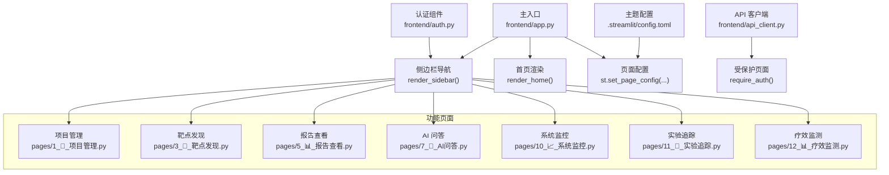
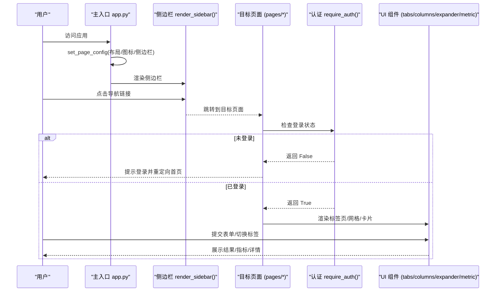
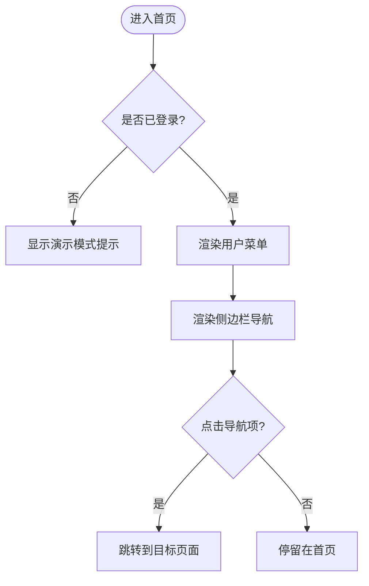
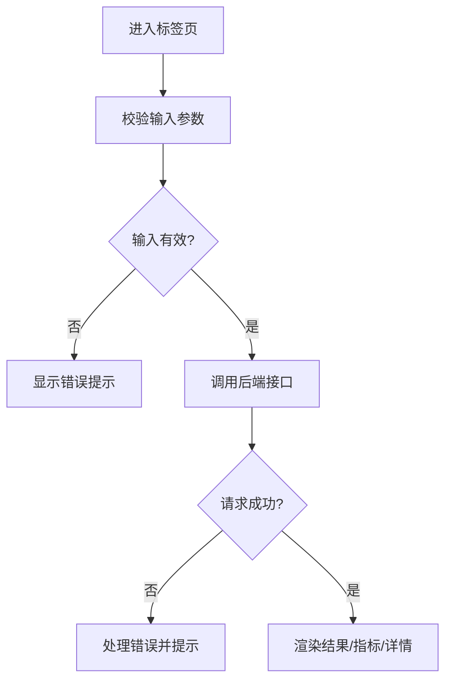
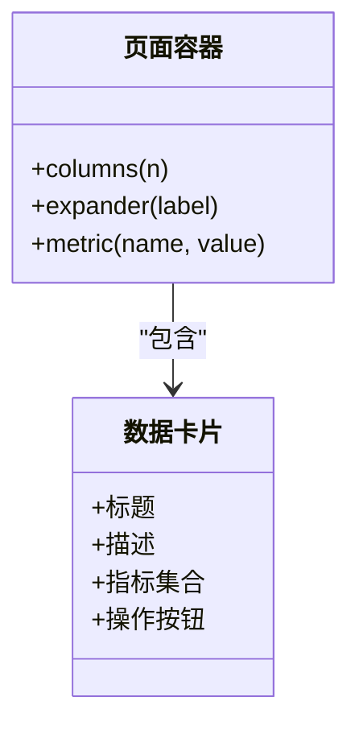
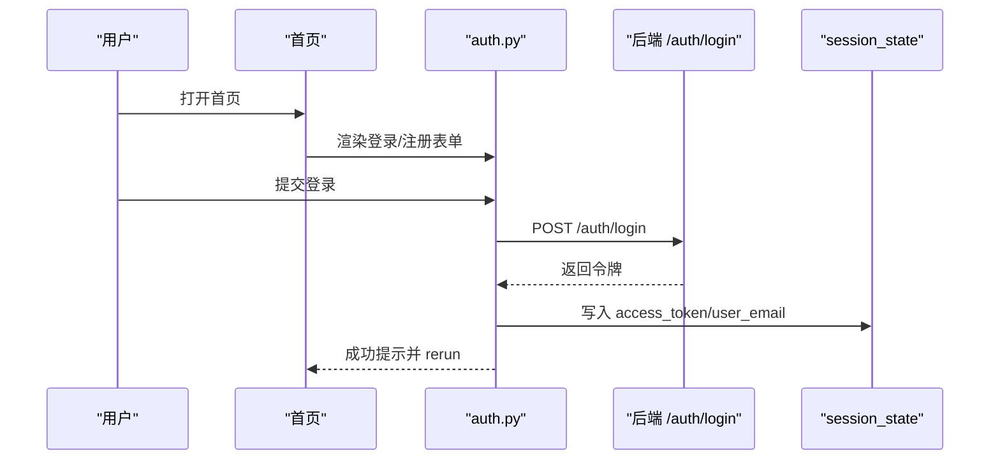
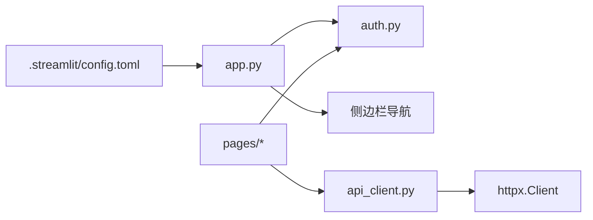
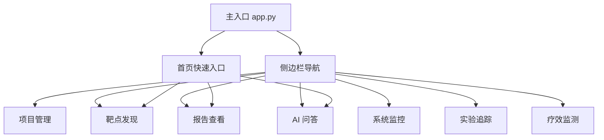

# 布局导航组件

<cite>
**本文引用的文件**   
- [frontend/app.py](file://frontend/app.py)
- [.streamlit/config.toml](file://.streamlit/config.toml)
- [frontend/auth.py](file://frontend/auth.py)
- [frontend/api_client.py](file://frontend/api_client.py)
- [frontend/pages/1_📁_项目管理.py](file://frontend/pages/1_📁_项目管理.py)
- [frontend/pages/3_🎯_靶点发现.py](file://frontend/pages/3_🎯_靶点发现.py)
- [frontend/pages/5_📊_报告查看.py](file://frontend/pages/5_📊_报告查看.py)
- [frontend/pages/7_🤖_AI问答.py](file://frontend/pages/7_🤖_AI问答.py)
- [frontend/pages/10_📈_系统监控.py](file://frontend/pages/10_📈_系统监控.py)
- [frontend/pages/11_🧪_实验追踪.py](file://frontend/pages/11_🧪_实验追踪.py)
- [frontend/pages/12_📊_疗效监测.py](file://frontend/pages/12_📊_疗效监测.py)
</cite>

## 目录
1. [简介](#简介)
2. [项目结构](#项目结构)
3. [核心组件](#核心组件)
4. [架构总览](#架构总览)
5. [详细组件分析](#详细组件分析)
6. [依赖关系分析](#依赖关系分析)
7. [性能与响应式布局](#性能与响应式布局)
8. [主题与样式定制](#主题与样式定制)
9. [多页面导航架构](#多页面导航架构)
10. [用户体验优化](#用户体验优化)
11. [跨设备与浏览器兼容性](#跨设备与浏览器兼容性)
12. [故障排查指南](#故障排查指南)
13. [结论](#结论)

## 简介
本文件聚焦于 AI 药物设计系统的布局与导航组件，围绕 Streamlit 的页面配置、侧边栏导航、标签页切换、网格与卡片布局、模态对话框（展开面板）等能力进行系统化说明。文档同时覆盖主题定制、颜色方案、字体设置、图标使用，以及多页面应用的导航架构设计与用户体验优化策略，确保在桌面与移动端、主流浏览器上获得一致体验。

## 项目结构
前端采用 Streamlit 的多页面应用组织方式：
- 主入口 app.py 负责全局页面配置、侧边栏导航与首页渲染
- pages 目录下每个文件对应一个独立页面，通过 st.set_page_config 定义页面标题、图标与布局
- auth.py 提供登录/注册表单与用户菜单
- api_client.py 封装后端 API 调用、认证注入与缓存机制
- .streamlit/config.toml 统一主题与服务器配置

图表来源
- [frontend/app.py:35-64](file://frontend/app.py#L35-L64)
- [.streamlit/config.toml:1-16](file://.streamlit/config.toml#L1-L16)
- [frontend/auth.py:116-128](file://frontend/auth.py#L116-L128)
- [frontend/api_client.py:170-180](file://frontend/api_client.py#L170-L180)

章节来源
- [frontend/app.py:35-64](file://frontend/app.py#L35-L64)
- [.streamlit/config.toml:1-16](file://.streamlit/config.toml#L1-L16)

## 核心组件
- 页面配置与布局
  - 使用 st.set_page_config 设置页面标题、图标、布局模式与侧边栏初始状态
  - 各页面均声明 layout="wide" 以启用宽屏网格布局
- 侧边栏导航
  - 使用 st.sidebar.page_link 构建功能导航，支持图标与分组标题
  - 根据登录状态动态显示用户菜单与导航项
- 标签页切换
  - 使用 st.tabs 将复杂流程拆分为多个子任务（如“录入实验”“LIMS 导入”“实验追踪”“汇总”）
- 网格系统与卡片布局
  - 使用 st.columns 实现多列布局；结合 st.expander 实现可折叠卡片
  - 使用 st.metric 展示关键指标，形成数据卡片
- 模态对话框
  - 使用 st.expander 作为轻量级模态，承载详情、证据列表、结构化数据等
- 认证与用户菜单
  - 登录/注册表单位于首页，成功后写入 session_state
  - 右上角用户菜单提供登出操作并清理会话

章节来源
- [frontend/app.py:35-64](file://frontend/app.py#L35-L64)
- [frontend/auth.py:10-114](file://frontend/auth.py#L10-L114)
- [frontend/pages/11_🧪_实验追踪.py:44-46](file://frontend/pages/11_🧪_实验追踪.py#L44-L46)
- [frontend/pages/1_📁_项目管理.py:84-96](file://frontend/pages/1_📁_项目管理.py#L84-L96)
- [frontend/pages/5_📊_报告查看.py:94-95](file://frontend/pages/5_📊_报告查看.py#L94-L95)

## 架构总览
下图展示了从主入口到具体页面的导航流与交互要点，包括认证检查、侧边栏跳转、标签页内工作流与结果展示。

图表来源
- [frontend/app.py:35-64](file://frontend/app.py#L35-L64)
- [frontend/api_client.py:170-180](file://frontend/api_client.py#L170-L180)
- [frontend/pages/11_🧪_实验追踪.py:44-46](file://frontend/pages/11_🧪_实验追踪.py#L44-L46)

## 详细组件分析

### 侧边栏导航与用户菜单
- 侧边栏
  - 标题与版本信息
  - 登录后显示用户菜单与功能导航
  - 使用 page_link 实现页面间跳转，支持图标
- 用户菜单
  - 显示当前用户邮箱
  - 登出按钮清除会话并刷新页面

图表来源
- [frontend/app.py:43-64](file://frontend/app.py#L43-L64)
- [frontend/auth.py:116-128](file://frontend/auth.py#L116-L128)

章节来源
- [frontend/app.py:43-64](file://frontend/app.py#L43-L64)
- [frontend/auth.py:116-128](file://frontend/auth.py#L116-L128)

### 标签页切换与工作流编排
- 典型场景：实验追踪页面将“录入实验”“LIMS 导入”“实验追踪”“汇总”分置于不同标签页
- 优点：降低单页复杂度，提升任务专注度与可维护性
- 实践建议：为每个标签页提供明确的输入校验与反馈，避免跨标签的状态污染

图表来源
- [frontend/pages/11_🧪_实验追踪.py:44-46](file://frontend/pages/11_🧪_实验追踪.py#L44-L46)
- [frontend/pages/11_🧪_实验追踪.py:52-122](file://frontend/pages/11_🧪_实验追踪.py#L52-L122)

章节来源
- [frontend/pages/11_🧪_实验追踪.py:44-46](file://frontend/pages/11_🧪_实验追踪.py#L44-L46)
- [frontend/pages/11_🧪_实验追踪.py:52-122](file://frontend/pages/11_🧪_实验追踪.py#L52-L122)

### 网格系统与卡片布局
- 网格系统
  - 使用 st.columns 创建多列布局，常见比例为 [3,2]、[2,1,1,1]、[4,1] 等
  - 配合 st.metric 展示关键指标，形成数据卡片
- 卡片布局
  - 使用 st.expander 包裹条目内容，支持折叠/展开
  - 在卡片内部再嵌套 columns 与 metric，形成层次化信息展示

图表来源
- [frontend/pages/1_📁_项目管理.py:84-96](file://frontend/pages/1_📁_项目管理.py#L84-L96)
- [frontend/pages/5_📊_报告查看.py:80-85](file://frontend/pages/5_📊_报告查看.py#L80-L85)

章节来源
- [frontend/pages/1_📁_项目管理.py:84-96](file://frontend/pages/1_📁_项目管理.py#L84-L96)
- [frontend/pages/5_📊_报告查看.py:80-85](file://frontend/pages/5_📊_报告查看.py#L80-L85)

### 模态对话框（展开面板）
- 使用 st.expander 作为轻量模态，适合展示详情、证据列表、JSON 数据等
- 优势：无需额外弹窗库，保持 Streamlit 原生风格
- 注意：避免在展开面板中放置过多交互控件，以免引发重绘与性能问题

章节来源
- [frontend/pages/5_📊_报告查看.py:94-95](file://frontend/pages/5_📊_报告查看.py#L94-L95)

### 认证与用户菜单
- 登录/注册
  - 首页提供登录与注册两个标签页
  - 登录成功后写入 access_token、refresh_token、user_email 等会话字段
- 用户菜单
  - 显示当前用户邮箱
  - 登出时清空会话并刷新页面

图表来源
- [frontend/auth.py:10-66](file://frontend/auth.py#L10-L66)
- [frontend/auth.py:116-128](file://frontend/auth.py#L116-L128)

章节来源
- [frontend/auth.py:10-66](file://frontend/auth.py#L10-L66)
- [frontend/auth.py:116-128](file://frontend/auth.py#L116-L128)

### 多页面导航与快速入口
- 侧边栏集中导航
  - 使用 page_link 列出所有功能页面，便于统一管理与扩展
- 首页快速入口
  - 针对高频功能提供快捷链接，减少导航层级
- 页面内跳转
  - 使用 switch_page 或 page_link 在页面间传递上下文（例如从靶点发现跳转到报告查看）

章节来源
- [frontend/app.py:52-63](file://frontend/app.py#L52-L63)
- [frontend/app.py:137-146](file://frontend/app.py#L137-L146)
- [frontend/pages/3_🎯_靶点发现.py:143-145](file://frontend/pages/3_🎯_靶点发现.py#L143-L145)

## 依赖关系分析
- 页面与组件耦合
  - 各页面依赖 require_auth 进行权限控制
  - 页面普遍依赖 get_client/cached_get 进行数据获取与缓存
- 外部依赖
  - httpx 用于 HTTP 请求与连接池复用
  - Streamlit 内置组件用于布局与交互

图表来源
- [frontend/app.py:35-64](file://frontend/app.py#L35-L64)
- [frontend/api_client.py:24-39](file://frontend/api_client.py#L24-L39)
- [.streamlit/config.toml:1-16](file://.streamlit/config.toml#L1-L16)

章节来源
- [frontend/api_client.py:24-39](file://frontend/api_client.py#L24-L39)
- [frontend/api_client.py:170-180](file://frontend/api_client.py#L170-L180)

## 性能与响应式布局
- 连接池复用
  - 通过 @st.cache_resource 共享 httpx.Client，减少连接建立开销
- 请求级缓存
  - 使用 cached_get 对不常变数据进行 TTL 缓存，降低后端压力
- 布局优化
  - 使用 wide 布局与合理列比例，提升大屏利用率
  - 在大数据展示时使用 dataframes 与分页/筛选，避免一次性渲染过多 DOM
- 交互优化
  - 使用 spinner 与 success/error 提示，增强用户感知
  - 合理使用 rerun 与 session_state，避免不必要的重计算

章节来源
- [frontend/api_client.py:24-39](file://frontend/api_client.py#L24-L39)
- [frontend/api_client.py:186-236](file://frontend/api_client.py#L186-L236)
- [frontend/pages/11_🧪_实验追踪.py:84-118](file://frontend/pages/11_🧪_实验追踪.py#L84-L118)

## 主题与样式定制
- 主题配置
  - primaryColor、backgroundColor、secondaryBackgroundColor、textColor、font 等
- 服务器与浏览器选项
  - server.port、headless、enableCORS、enableXsrfProtection
  - browser.gatherUsageStats
- 页面图标与标题
  - 每个页面通过 set_page_config 自定义 page_title 与 page_icon
- 侧边栏与页面标题
  - 使用 emoji 图标提升可读性与识别度

章节来源
- [.streamlit/config.toml:1-16](file://.streamlit/config.toml#L1-L16)
- [frontend/app.py:35-40](file://frontend/app.py#L35-L40)
- [frontend/pages/1_📁_项目管理.py:17](file://frontend/pages/1_📁_项目管理.py#L17)
- [frontend/pages/3_🎯_靶点发现.py:17](file://frontend/pages/3_🎯_靶点发现.py#L17)
- [frontend/pages/5_📊_报告查看.py:17](file://frontend/pages/5_📊_报告查看.py#L17)
- [frontend/pages/7_🤖_AI问答.py:17](file://frontend/pages/7_🤖_AI问答.py#L17)
- [frontend/pages/10_📈_系统监控.py:18](file://frontend/pages/10_📈_系统监控.py#L18)
- [frontend/pages/11_🧪_实验追踪.py:24](file://frontend/pages/11_🧪_实验追踪.py#L24)
- [frontend/pages/12_📊_疗效监测.py:26](file://frontend/pages/12_📊_疗效监测.py#L26)

## 多页面导航架构
- 统一入口
  - 主入口负责全局配置与侧边栏导航
- 页面组织
  - 按业务域划分 pages 目录下的文件，命名包含序号与图标，便于排序与识别
- 权限控制
  - 各页面通过 require_auth 进行登录检查，未登录则引导回首页
- 快速入口
  - 首页提供常用功能快捷链接，缩短导航路径

图表来源
- [frontend/app.py:52-63](file://frontend/app.py#L52-L63)
- [frontend/app.py:137-146](file://frontend/app.py#L137-L146)

章节来源
- [frontend/app.py:52-63](file://frontend/app.py#L52-L63)
- [frontend/app.py:137-146](file://frontend/app.py#L137-L146)
- [frontend/api_client.py:170-180](file://frontend/api_client.py#L170-L180)

## 用户体验优化
- 清晰的导航层级
  - 侧边栏集中导航，首页提供快速入口，减少认知负荷
- 一致的视觉语言
  - 统一的图标、色彩与排版，提升品牌一致性
- 即时反馈
  - 使用 spinner、success、error、info 等提示，明确操作结果
- 渐进披露
  - 使用 expander 隐藏次要信息，保持界面简洁
- 容错与帮助
  - 表单校验与错误提示，必要时提供示例与帮助文本

章节来源
- [frontend/pages/11_🧪_实验追踪.py:84-118](file://frontend/pages/11_🧪_实验追踪.py#L84-L118)
- [frontend/pages/7_🤖_AI问答.py:78-110](file://frontend/pages/7_🤖_AI问答.py#L78-L110)

## 跨设备与浏览器兼容性
- 设备适配
  - 使用 wide 布局与自适应列比例，提升移动端可读性
  - 避免在小屏幕上放置过多并列控件，优先使用垂直堆叠
- 浏览器兼容
  - 遵循 Streamlit 官方推荐，避免使用非标准 CSS 或第三方样式
  - 谨慎使用高级特性（如复杂动画），确保在主流浏览器下稳定运行
- 测试建议
  - 在不同分辨率与浏览器下进行基础功能验证
  - 关注表单输入、滚动与展开面板的交互表现

[本节为通用指导，不直接分析具体文件]

## 故障排查指南
- 登录失败
  - 检查后端地址是否正确
  - 确认网络连通与 CORS 配置
  - 查看错误消息中的 detail 字段
- 数据加载失败
  - 检查缓存键前缀与 TTL 设置
  - 确认后端服务状态与健康检查
- 页面无法渲染
  - 检查 require_auth 返回值与重定向逻辑
  - 确认页面配置与资源路径正确

章节来源
- [frontend/auth.py:32-66](file://frontend/auth.py#L32-L66)
- [frontend/api_client.py:186-236](file://frontend/api_client.py#L186-L236)
- [frontend/api_client.py:170-180](file://frontend/api_client.py#L170-L180)

## 结论
本系统基于 Streamlit 实现了清晰的多页面导航与丰富的布局组件。通过侧边栏导航、标签页切换、网格与卡片布局、展开面板等能力，构建了高效且易用的研究平台界面。配合主题定制与缓存优化，系统在性能与体验之间取得良好平衡。建议在后续迭代中持续完善移动端适配与无障碍支持，进一步提升跨设备与跨浏览器的兼容性。