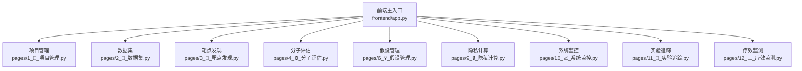
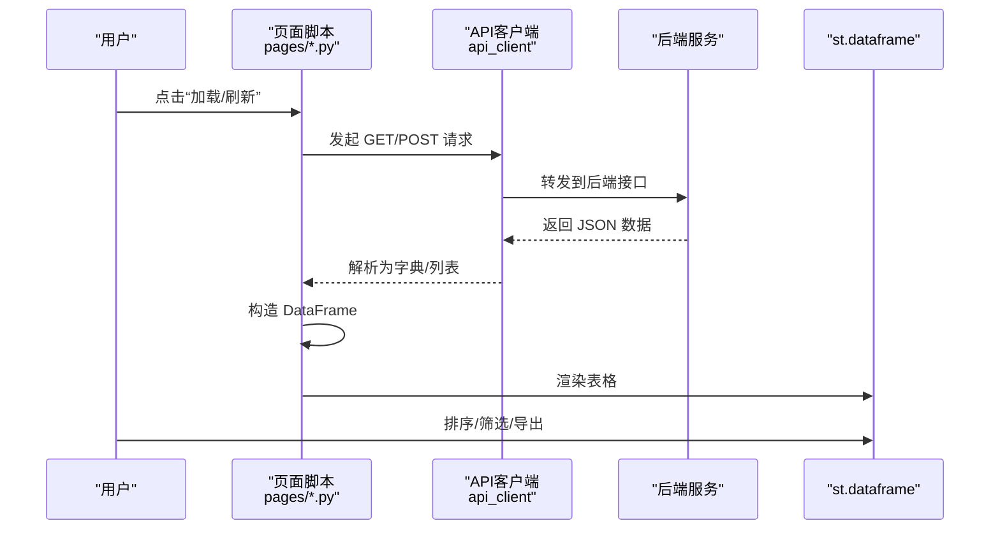
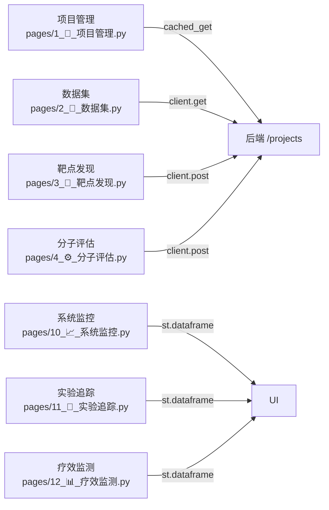

# 数据表格组件

<cite>
**本文引用的文件**
- [frontend/app.py](file://frontend/app.py)
- [frontend/pages/1_📁_项目管理.py](file://frontend/pages/1_📁_项目管理.py)
- [frontend/pages/2_🧬_数据集.py](file://frontend/pages/2_🧬_数据集.py)
- [frontend/pages/3_🎯_靶点发现.py](file://frontend/pages/3_🎯_靶点发现.py)
- [frontend/pages/4_⚙️_分子评估.py](file://frontend/pages/4_⚙️_分子评估.py)
- [frontend/pages/6_💡_假设管理.py](file://frontend/pages/6_💡_假设管理.py)
- [frontend/pages/9_🔒_隐私计算.py](file://frontend/pages/9_🔒_隐私计算.py)
- [frontend/pages/10_📈_系统监控.py](file://frontend/pages/10_📈_系统监控.py)
- [frontend/pages/11_🧪_实验追踪.py](file://frontend/pages/11_🧪_实验追踪.py)
- [frontend/pages/12_📊_疗效监测.py](file://frontend/pages/12_📊_疗效监测.py)
</cite>

## 目录
1. [简介](#简介)
2. [项目结构](#项目结构)
3. [核心组件](#核心组件)
4. [架构总览](#架构总览)
5. [详细组件分析](#详细组件分析)
6. [依赖分析](#依赖分析)
7. [性能考虑](#性能考虑)
8. [故障排查指南](#故障排查指南)
9. [结论](#结论)
10. [附录](#附录)

## 简介
本文件为 AI 药物设计系统的数据表格组件文档，聚焦于 Streamlit 前端中基于 st.dataframe 的表格能力与使用模式。内容覆盖：
- 渲染模式与分页处理
- 排序与筛选的实现方式
- 列配置、行操作、批量操作、导出功能
- 数据绑定、实时更新、虚拟滚动优化
- 样式定制、主题适配、响应式布局示例
- 大数据量下的性能表现与用户体验保障

说明：当前仓库未提供自定义表格组件封装，页面普遍采用 Streamlit 内置 st.dataframe 进行展示；部分页面通过展开卡片或指标卡片呈现结构化信息。

## 项目结构
前端以 Streamlit 多页面组织，表格相关实现主要分布在以下页面：
- 项目管理：列表项以展开卡片形式展示，配合按钮完成状态变更
- 数据集：上传后以展开卡片展示元信息与统计，并提供处理与质控入口
- 靶点发现：结果以卡片+证据列表呈现，支持跳转报告页
- 分子评估：以表单+指标卡片为主，非表格形态
- 其他页面（假设管理、隐私计算、系统监控、实验追踪、疗效监测）：多处使用 st.dataframe 直接渲染 DataFrame

图表来源
- [frontend/app.py:1-157](file://frontend/app.py#L1-L157)
- [frontend/pages/1_📁_项目管理.py:1-137](file://frontend/pages/1_📁_项目管理.py#L1-L137)
- [frontend/pages/2_🧬_数据集.py:1-127](file://frontend/pages/2_🧬_数据集.py#L1-L127)
- [frontend/pages/3_🎯_靶点发现.py:1-157](file://frontend/pages/3_🎯_靶点发现.py#L1-L157)
- [frontend/pages/4_⚙️_分子评估.py:1-159](file://frontend/pages/4_⚙️_分子评估.py#L1-L159)
- [frontend/pages/6_💡_假设管理.py:174](file://frontend/pages/6_💡_假设管理.py#L174)
- [frontend/pages/9_🔒_隐私计算.py:164](file://frontend/pages/9_🔒_隐私计算.py#L164)
- [frontend/pages/10_📈_系统监控.py:65](file://frontend/pages/10_📈_系统监控.py#L65)
- [frontend/pages/11_🧪_实验追踪.py:159](file://frontend/pages/11_🧪_实验追踪.py#L159)
- [frontend/pages/12_📊_疗效监测.py:370](file://frontend/pages/12_📊_疗效监测.py#L370)

章节来源
- [frontend/app.py:1-157](file://frontend/app.py#L1-L157)
- [frontend/pages/1_📁_项目管理.py:1-137](file://frontend/pages/1_📁_项目管理.py#L1-L137)
- [frontend/pages/2_🧬_数据集.py:1-127](file://frontend/pages/2_🧬_数据集.py#L1-L127)
- [frontend/pages/3_🎯_靶点发现.py:1-157](file://frontend/pages/3_🎯_靶点发现.py#L1-L157)
- [frontend/pages/4_⚙️_分子评估.py:1-159](file://frontend/pages/4_⚙️_分子评估.py#L1-L159)
- [frontend/pages/6_💡_假设管理.py:174](file://frontend/pages/6_💡_假设管理.py#L174)
- [frontend/pages/9_🔒_隐私计算.py:164](file://frontend/pages/9_🔒_隐私计算.py#L164)
- [frontend/pages/10_📈_系统监控.py:65](file://frontend/pages/10_📈_系统监控.py#L65)
- [frontend/pages/11_🧪_实验追踪.py:159](file://frontend/pages/11_🧪_实验追踪.py#L159)
- [frontend/pages/12_📊_疗效监测.py:370](file://frontend/pages/12_📊_疗效监测.py#L370)

## 核心组件
- 表格渲染
  - 直接使用 st.dataframe 渲染 pandas.DataFrame，支持浏览器端排序、筛选、导出等交互。
  - 典型用法见：
    - [frontend/pages/10_📈_系统监控.py:65](file://frontend/pages/10_📈_系统监控.py#L65)
    - [frontend/pages/11_🧪_实验追踪.py:159](file://frontend/pages/11_🧪_实验追踪.py#L159)
    - [frontend/pages/12_📊_疗效监测.py:370](file://frontend/pages/12_📊_疗效监测.py#L370)
    - [frontend/pages/12_📊_疗效监测.py:509](file://frontend/pages/12_📊_疗效监测.py#L509)
    - [frontend/pages/6_💡_假设管理.py:174](file://frontend/pages/6_💡_假设管理.py#L174)
    - [frontend/pages/9_🔒_隐私计算.py:164](file://frontend/pages/9_🔒_隐私计算.py#L164)

- 列表与卡片组合
  - 项目管理、数据集、靶点发现等页面采用“展开卡片 + 指标 + 操作按钮”的组合，适合复杂对象详情与轻量操作。
  - 参考：
    - [frontend/pages/1_📁_项目管理.py:83-129](file://frontend/pages/1_📁_项目管理.py#L83-L129)
    - [frontend/pages/2_🧬_数据集.py:90-121](file://frontend/pages/2_🧬_数据集.py#L90-L121)
    - [frontend/pages/3_🎯_靶点发现.py:116-151](file://frontend/pages/3_🎯_靶点发现.py#L116-L151)

- 数据获取与缓存
  - 使用 cached_get 对列表接口进行短时缓存，减少频繁请求。
  - 参考：
    - [frontend/pages/1_📁_项目管理.py:67-76](file://frontend/pages/1_📁_项目管理.py#L67-L76)

章节来源
- [frontend/pages/10_📈_系统监控.py:65](file://frontend/pages/10_📈_系统监控.py#L65)
- [frontend/pages/11_🧪_实验追踪.py:159](file://frontend/pages/11_🧪_实验追踪.py#L159)
- [frontend/pages/12_📊_疗效监测.py:370](file://frontend/pages/12_📊_疗效监测.py#L370)
- [frontend/pages/12_📊_疗效监测.py:509](file://frontend/pages/12_📊_疗效监测.py#L509)
- [frontend/pages/6_💡_假设管理.py:174](file://frontend/pages/6_💡_假设管理.py#L174)
- [frontend/pages/9_🔒_隐私计算.py:164](file://frontend/pages/9_🔒_隐私计算.py#L164)
- [frontend/pages/1_📁_项目管理.py:83-129](file://frontend/pages/1_📁_项目管理.py#L83-L129)
- [frontend/pages/2_🧬_数据集.py:90-121](file://frontend/pages/2_🧬_数据集.py#L90-L121)
- [frontend/pages/3_🎯_靶点发现.py:116-151](file://frontend/pages/3_🎯_靶点发现.py#L116-L151)
- [frontend/pages/1_📁_项目管理.py:67-76](file://frontend/pages/1_📁_项目管理.py#L67-L76)

## 架构总览
Streamlit 页面作为前端控制器，负责：
- 用户输入收集与校验
- 调用后端 API 获取数据
- 将数据转换为 DataFrame 并交由 st.dataframe 渲染
- 在需要时触发 rerun 刷新界面

图表来源
- [frontend/pages/1_📁_项目管理.py:67-76](file://frontend/pages/1_📁_项目管理.py#L67-L76)
- [frontend/pages/10_📈_系统监控.py:65](file://frontend/pages/10_📈_系统监控.py#L65)
- [frontend/pages/11_🧪_实验追踪.py:159](file://frontend/pages/11_🧪_实验追踪.py#L159)
- [frontend/pages/12_📊_疗效监测.py:370](file://frontend/pages/12_📊_疗效监测.py#L370)

## 详细组件分析

### 渲染模式与分页处理
- 渲染模式
  - 直接表格：适用于结构化、字段较少的列表数据，如系统监控、实验追踪、疗效监测等页面。
  - 卡片列表：适用于对象详情较多、需分组展示的列表，如项目管理、数据集、靶点发现。
- 分页处理
  - 当前页面多为一次性拉取固定数量（如 page_size=50），未实现前端无限滚动或后端游标分页。
  - 建议：对大数据集引入后端分页参数（page/page_size）与前端分页控件，或在 st.dataframe 外层包裹滚动容器。

章节来源
- [frontend/pages/1_📁_项目管理.py:67-76](file://frontend/pages/1_📁_项目管理.py#L67-L76)
- [frontend/pages/2_🧬_数据集.py:76-80](file://frontend/pages/2_🧬_数据集.py#L76-L80)
- [frontend/pages/10_📈_系统监控.py:65](file://frontend/pages/10_📈_系统监控.py#L65)
- [frontend/pages/11_🧪_实验追踪.py:159](file://frontend/pages/11_🧪_实验追踪.py#L159)
- [frontend/pages/12_📊_疗效监测.py:370](file://frontend/pages/12_📊_疗效监测.py#L370)

### 排序与筛选
- 排序
  - st.dataframe 默认启用列头排序，无需额外代码。
- 筛选
  - st.dataframe 提供搜索框进行文本过滤；数值范围筛选可通过预处理 DataFrame 实现。
- 服务端筛选
  - 对于大型数据集，建议在查询参数中传递筛选条件，减少传输与渲染开销。

章节来源
- [frontend/pages/10_📈_系统监控.py:65](file://frontend/pages/10_📈_系统监控.py#L65)
- [frontend/pages/11_🧪_实验追踪.py:159](file://frontend/pages/11_🧪_实验追踪.py#L159)
- [frontend/pages/12_📊_疗效监测.py:370](file://frontend/pages/12_📊_疗效监测.py#L370)

### 列配置
- 列顺序与类型
  - 通过 DataFrame 的列顺序控制显示顺序；确保数值列为数值类型以便正确排序与聚合。
- 列宽与对齐
  - 可使用 CSS 注入或 Streamlit 主题设置调整；也可在 DataFrame 构建阶段格式化字符串列。
- 列隐藏/重命名
  - 在构造 DataFrame 前重命名列名，或仅选择必要列以减少渲染压力。

章节来源
- [frontend/pages/10_📈_系统监控.py:65](file://frontend/pages/10_📈_系统监控.py#L65)
- [frontend/pages/12_📊_疗效监测.py:509](file://frontend/pages/12_📊_疗效监测.py#L509)

### 行操作与批量操作
- 行操作
  - 当前页面多以“展开卡片 + 按钮”的方式执行单行操作（激活/暂停/归档、查看质控等）。
  - 若需表格内行操作，可在 DataFrame 旁放置选择器，或使用侧边栏选中行后执行操作。
- 批量操作
  - 可结合 st.dataframe 的选择能力（如多选行）与后端批量接口实现批量删除/更新。
  - 注意：当前仓库未见直接的多选行实现，需在页面层扩展。

章节来源
- [frontend/pages/1_📁_项目管理.py:99-129](file://frontend/pages/1_📁_项目管理.py#L99-L129)
- [frontend/pages/2_🧬_数据集.py:107-121](file://frontend/pages/2_🧬_数据集.py#L107-L121)

### 导出功能
- st.dataframe 原生支持导出 CSV/Excel（取决于浏览器与 Streamlit 版本）。
- 如需自定义导出（含筛选/排序后的视图），可在页面增加“导出当前视图”按钮，读取当前 DataFrame 并写入文件流供下载。

章节来源
- [frontend/pages/10_📈_系统监控.py:65](file://frontend/pages/10_📈_系统监控.py#L65)
- [frontend/pages/11_🧪_实验追踪.py:159](file://frontend/pages/11_🧪_实验追踪.py#L159)
- [frontend/pages/12_📊_疗效监测.py:370](file://frontend/pages/12_📊_疗效监测.py#L370)

### 数据绑定与实时更新
- 数据绑定
  - 页面从 API 获取 JSON，转为 DataFrame 后交给 st.dataframe 渲染。
- 实时更新
  - 通过 st.rerun() 或定时轮询（如每 N 秒）刷新表格；对长耗时任务建议使用异步任务与状态提示。
  - 项目管理页在操作成功后调用 invalidate_cache 并 rerun，保证列表即时更新。

章节来源
- [frontend/pages/1_📁_项目管理.py:58-61](file://frontend/pages/1_📁_项目管理.py#L58-L61)
- [frontend/pages/1_📁_项目管理.py:105-129](file://frontend/pages/1_📁_项目管理.py#L105-L129)

### 虚拟滚动与大数据优化
- 现状
  - 当前页面未实现虚拟滚动；大数据量下可能影响渲染性能。
- 建议方案
  - 前端：使用分页或懒加载，限制单次渲染行数；必要时引入第三方虚拟滚动组件。
  - 后端：按 page/page_size 分页，按需返回列子集，避免全表传输。
  - 缓存：对热点列表使用短时缓存（如 10-30 秒），降低重复请求。

章节来源
- [frontend/pages/1_📁_项目管理.py:67-76](file://frontend/pages/1_📁_项目管理.py#L67-L76)

### 样式定制、主题适配与响应式布局
- 主题
  - 通过 st.set_page_config 设置 layout="wide" 以获得更宽的可用区域。
- 样式
  - 可使用 CSS 注入对表格边框、字体、背景等进行微调；注意跨浏览器兼容性。
- 响应式
  - 利用 st.columns 与 st.expander 组合，在小屏设备上获得更好的可读性。

章节来源
- [frontend/app.py:35-40](file://frontend/app.py#L35-L40)
- [frontend/pages/1_📁_项目管理.py:17](file://frontend/pages/1_📁_项目管理.py#L17)
- [frontend/pages/2_🧬_数据集.py:17](file://frontend/pages/2_🧬_数据集.py#L17)
- [frontend/pages/3_🎯_靶点发现.py:17](file://frontend/pages/3_🎯_靶点发现.py#L17)
- [frontend/pages/4_⚙️_分子评估.py:17](file://frontend/pages/4_⚙️_分子评估.py#L17)

## 依赖分析
- 页面与表格的关系
  - 多个页面直接依赖 st.dataframe 进行数据展示；部分页面通过展开卡片承载复杂对象详情。
- 外部依赖
  - 页面通过 api_client 访问后端 REST 接口；列表接口通常返回包含 items 的字典结构。

图表来源
- [frontend/pages/1_📁_项目管理.py:67-76](file://frontend/pages/1_📁_项目管理.py#L67-L76)
- [frontend/pages/2_🧬_数据集.py:76-80](file://frontend/pages/2_🧬_数据集.py#L76-L80)
- [frontend/pages/3_🎯_靶点发现.py:86-96](file://frontend/pages/3_🎯_靶点发现.py#L86-L96)
- [frontend/pages/4_⚙️_分子评估.py:44-47](file://frontend/pages/4_⚙️_分子评估.py#L44-L47)
- [frontend/pages/10_📈_系统监控.py:65](file://frontend/pages/10_📈_系统监控.py#L65)
- [frontend/pages/11_🧪_实验追踪.py:159](file://frontend/pages/11_🧪_实验追踪.py#L159)
- [frontend/pages/12_📊_疗效监测.py:370](file://frontend/pages/12_📊_疗效监测.py#L370)

章节来源
- [frontend/pages/1_📁_项目管理.py:67-76](file://frontend/pages/1_📁_项目管理.py#L67-L76)
- [frontend/pages/2_🧬_数据集.py:76-80](file://frontend/pages/2_🧬_数据集.py#L76-L80)
- [frontend/pages/3_🎯_靶点发现.py:86-96](file://frontend/pages/3_🎯_靶点发现.py#L86-L96)
- [frontend/pages/4_⚙️_分子评估.py:44-47](file://frontend/pages/4_⚙️_分子评估.py#L44-L47)
- [frontend/pages/10_📈_系统监控.py:65](file://frontend/pages/10_📈_系统监控.py#L65)
- [frontend/pages/11_🧪_实验追踪.py:159](file://frontend/pages/11_🧪_实验追踪.py#L159)
- [frontend/pages/12_📊_疗效监测.py:370](file://frontend/pages/12_📊_疗效监测.py#L370)

## 性能考虑
- 减少不必要列与行：仅返回与展示所需的列，限制初始行数。
- 使用缓存：对静态或低频变化数据使用短时缓存（如 10-30 秒）。
- 分页与懒加载：对大数据集采用后端分页，前端按需加载。
- 避免阻塞渲染：长耗时任务使用异步与进度提示，防止界面卡顿。
- 合理格式化：在 Python 层完成数值格式化与单位换算，减少前端计算负担。

[本节为通用指导，不直接分析具体文件]

## 故障排查指南
- 无法连接后端
  - 现象：表格为空或报错提示无法连接后端服务。
  - 排查：确认后端服务已启动，检查网络与端口；查看健康检查接口是否可达。
- 列表无数据
  - 现象：页面提示暂无数据。
  - 排查：检查后端接口返回结构与字段名是否与前端期望一致；确认缓存键是否过期。
- 操作失败
  - 现象：点击“激活/暂停/归档”等操作后报错。
  - 排查：查看错误消息；确认权限与资源存在；重试并观察日志。

章节来源
- [frontend/app.py:121-134](file://frontend/app.py#L121-L134)
- [frontend/pages/1_📁_项目管理.py:74-76](file://frontend/pages/1_📁_项目管理.py#L74-L76)
- [frontend/pages/1_📁_项目管理.py:108-129](file://frontend/pages/1_📁_项目管理.py#L108-L129)

## 结论
当前系统在前端广泛使用 st.dataframe 进行数据展示，具备开箱即用的排序、筛选与导出能力。针对大数据量场景，建议引入后端分页、前端分页/懒加载与缓存策略，并结合卡片化布局提升复杂对象的浏览体验。同时，通过合理的列配置与样式定制，可在不同设备与主题下保持良好可用性。

[本节为总结性内容，不直接分析具体文件]

## 附录
- 常用页面路径
  - 项目管理：[frontend/pages/1_📁_项目管理.py](file://frontend/pages/1_📁_项目管理.py)
  - 数据集：[frontend/pages/2_🧬_数据集.py](file://frontend/pages/2_🧬_数据集.py)
  - 靶点发现：[frontend/pages/3_🎯_靶点发现.py](file://frontend/pages/3_🎯_靶点发现.py)
  - 分子评估：[frontend/pages/4_⚙️_分子评估.py](file://frontend/pages/4_⚙️_分子评估.py)
  - 假设管理：[frontend/pages/6_💡_假设管理.py](file://frontend/pages/6_💡_假设管理.py)
  - 隐私计算：[frontend/pages/9_🔒_隐私计算.py](file://frontend/pages/9_🔒_隐私计算.py)
  - 系统监控：[frontend/pages/10_📈_系统监控.py](file://frontend/pages/10_📈_系统监控.py)
  - 实验追踪：[frontend/pages/11_🧪_实验追踪.py](file://frontend/pages/11_🧪_实验追踪.py)
  - 疗效监测：[frontend/pages/12_📊_疗效监测.py](file://frontend/pages/12_📊_疗效监测.py)

[本节为索引性内容，不直接分析具体文件]