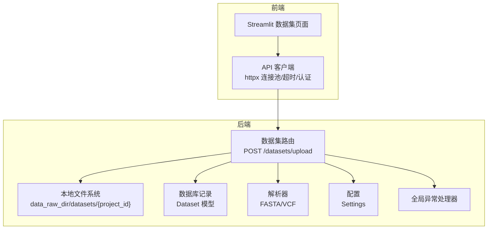
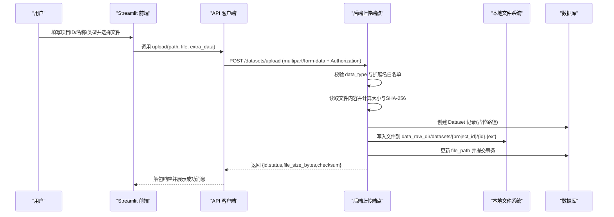
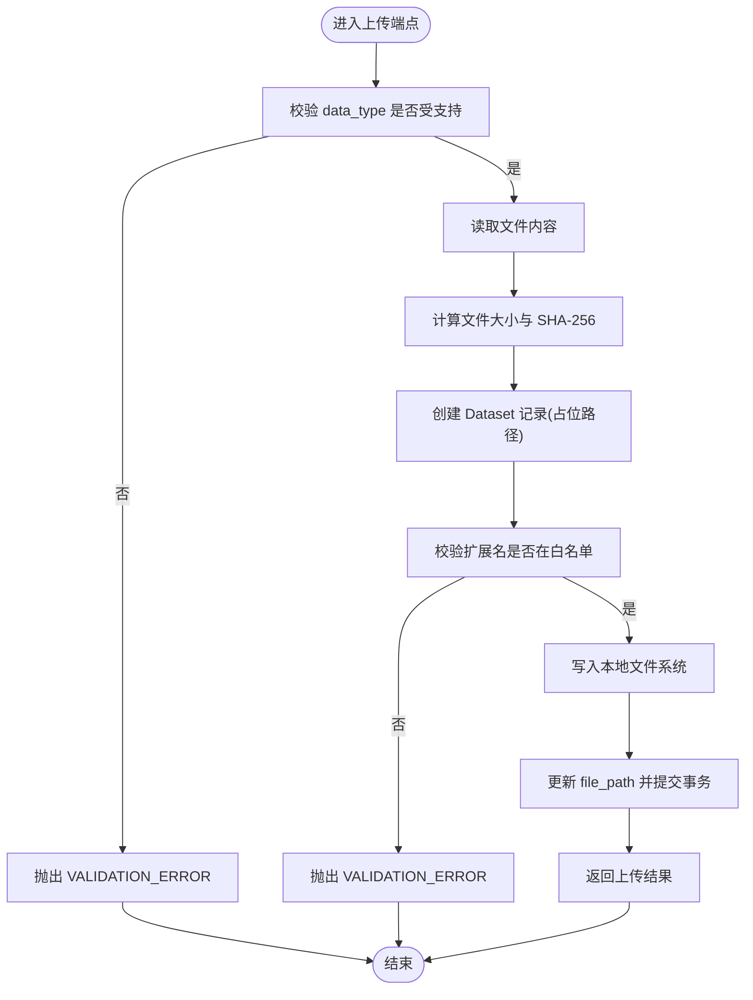
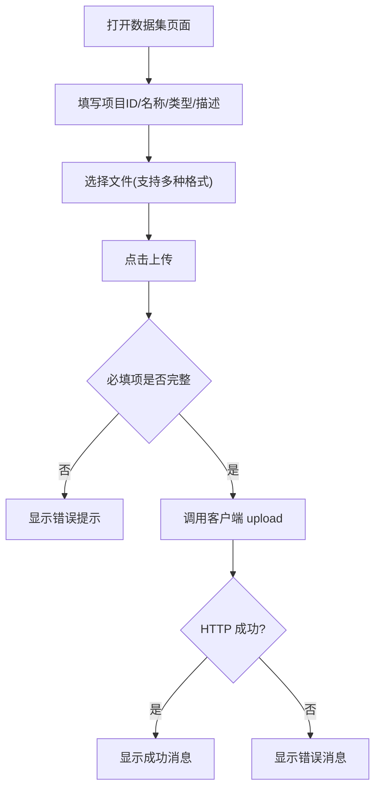
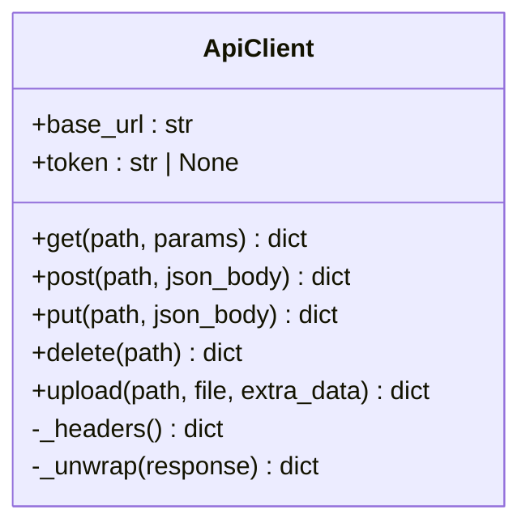
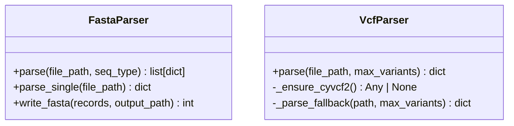
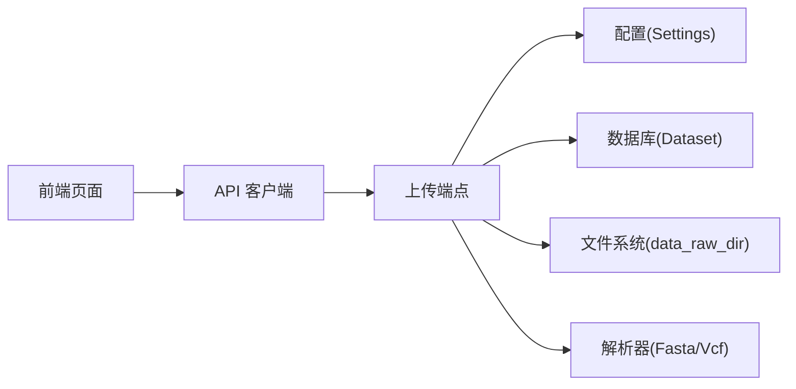

# 文件上传组件

<cite>
**本文引用的文件**
- [backend/app/api/v1/data.py](file://backend/app/api/v1/data.py)
- [frontend/pages/2_🧬_数据集.py](file://frontend/pages/2_🧬_数据集.py)
- [frontend/api_client.py](file://frontend/api_client.py)
- [backend/app/services/parser/fasta_parser.py](file://backend/app/services/parser/fasta_parser.py)
- [backend/app/services/parser/vcf_parser.py](file://backend/app/services/parser/vcf_parser.py)
- [backend/app/core/config.py](file://backend/app/core/config.py)
- [backend/app/core/exceptions.py](file://backend/app/core/exceptions.py)
</cite>

## 目录
1. [简介](#简介)
2. [项目结构](#项目结构)
3. [核心组件](#核心组件)
4. [架构总览](#架构总览)
5. [详细组件分析](#详细组件分析)
6. [依赖关系分析](#依赖关系分析)
7. [性能与内存优化](#性能与内存优化)
8. [故障排查指南](#故障排查指南)
9. [结论](#结论)
10. [附录](#附录)

## 简介
本文件为 AI 药物设计系统的“文件上传组件”提供完整文档，覆盖多格式支持（FASTA、VCF、CSV、JSON 等）、拖拽上传、进度显示、断点续传、文件大小限制、格式验证、病毒扫描与安全处理、批量上传、预览、错误重试机制，以及生物医学大文件的处理优化策略与内存管理。同时给出用户反馈与错误处理的实践建议。

说明：
- 当前后端已实现基础的文件上传、校验与持久化能力；前端提供 Streamlit 页面进行上传与列表查看。
- 部分高级特性（如断点续传、病毒扫描）在现有代码中未直接实现，本文给出可落地的扩展方案与集成建议。

## 项目结构
与文件上传相关的关键位置如下：
- 后端 API：数据集上传与处理端点位于 v1 数据路由。
- 前端页面：Streamlit 的“数据集”页面负责上传表单与结果展示。
- API 客户端：封装 HTTP 请求、统一错误处理与上传方法。
- 解析器：FASTA/VCF 解析器用于后续数据处理与预览。
- 配置与异常：存储路径、CORS、全局异常信封等。

图示来源
- [backend/app/api/v1/data.py:54-121](file://backend/app/api/v1/data.py#L54-L121)
- [frontend/pages/2_🧬_数据集.py:27-68](file://frontend/pages/2_🧬_数据集.py#L27-L68)
- [frontend/api_client.py:136-162](file://frontend/api_client.py#L136-L162)
- [backend/app/services/parser/fasta_parser.py:12-58](file://backend/app/services/parser/fasta_parser.py#L12-L58)
- [backend/app/services/parser/vcf_parser.py:14-87](file://backend/app/services/parser/vcf_parser.py#L14-L87)
- [backend/app/core/config.py:108-110](file://backend/app/core/config.py#L108-L110)
- [backend/app/core/exceptions.py:131-178](file://backend/app/core/exceptions.py#L131-L178)

章节来源
- [backend/app/api/v1/data.py:1-121](file://backend/app/api/v1/data.py#L1-L121)
- [frontend/pages/2_🧬_数据集.py:1-127](file://frontend/pages/2_🧬_数据集.py#L1-L127)
- [frontend/api_client.py:1-251](file://frontend/api_client.py#L1-L251)
- [backend/app/services/parser/fasta_parser.py:1-100](file://backend/app/services/parser/fasta_parser.py#L1-L100)
- [backend/app/services/parser/vcf_parser.py:1-136](file://backend/app/services/parser/vcf_parser.py#L1-L136)
- [backend/app/core/config.py:1-144](file://backend/app/core/config.py#L1-L144)
- [backend/app/core/exceptions.py:1-179](file://backend/app/core/exceptions.py#L1-L179)

## 核心组件
- 后端上传端点
  - 接收 multipart/form-data 文件与表单字段（项目 ID、名称、数据类型、可选元数据）。
  - 计算文件大小与 SHA-256 校验和，创建数据库记录并保存文件到本地磁盘。
  - 校验 data_type 与文件扩展名白名单。
- 前端上传页面
  - 使用 Streamlit 表单收集元信息，选择文件后调用客户端 upload 方法。
  - 展示成功/失败提示与数据集列表。
- API 客户端
  - 封装 httpx 客户端，设置连接池、超时、Authorization 头。
  - 提供 upload 方法以独立 client 发送文件上传请求。
- 解析器
  - FASTA 解析器：基于 BioPython，支持序列读取与写入。
  - VCF 解析器：优先 cyvcf2，降级纯文本解析，返回前若干条变异用于预览。
- 配置与异常
  - Settings 提供数据存储根目录 data_raw_dir。
  - 全局异常处理器将业务异常转换为统一信封响应。

章节来源
- [backend/app/api/v1/data.py:46-121](file://backend/app/api/v1/data.py#L46-L121)
- [frontend/pages/2_🧬_数据集.py:27-68](file://frontend/pages/2_🧬_数据集.py#L27-L68)
- [frontend/api_client.py:24-39](file://frontend/api_client.py#L24-L39)
- [frontend/api_client.py:136-162](file://frontend/api_client.py#L136-L162)
- [backend/app/services/parser/fasta_parser.py:12-58](file://backend/app/services/parser/fasta_parser.py#L12-L58)
- [backend/app/services/parser/vcf_parser.py:14-87](file://backend/app/services/parser/vcf_parser.py#L14-L87)
- [backend/app/core/config.py:108-110](file://backend/app/core/config.py#L108-L110)
- [backend/app/core/exceptions.py:131-178](file://backend/app/core/exceptions.py#L131-L178)

## 架构总览
以下时序图展示了从前端到后端的上传流程，包括参数校验、校验和计算、持久化与响应。

图示来源
- [frontend/pages/2_🧬_数据集.py:50-67](file://frontend/pages/2_🧬_数据集.py#L50-L67)
- [frontend/api_client.py:136-162](file://frontend/api_client.py#L136-L162)
- [backend/app/api/v1/data.py:54-121](file://backend/app/api/v1/data.py#L54-L121)
- [backend/app/core/config.py:108-110](file://backend/app/core/config.py#L108-L110)

## 详细组件分析

### 后端上传端点（POST /datasets/upload）
- 功能要点
  - 参数校验：data_type 必须在允许集合内；扩展名在白名单内。
  - 完整性：计算 SHA-256 校验和并记录。
  - 持久化：先写数据库记录（占位），再落盘文件，最后更新路径并提交。
  - 响应：返回数据集 id、状态、文件大小与校验和。
- 安全与合规
  - 白名单校验防止非法扩展名。
  - 当前未实现病毒扫描与 MIME 类型强校验，建议补充。
- 可扩展点
  - 增加文件大小上限检查。
  - 引入分片上传与断点续传（见“断点续传扩展方案”）。
  - 接入病毒扫描服务（见“病毒扫描扩展方案”）。

图示来源
- [backend/app/api/v1/data.py:54-121](file://backend/app/api/v1/data.py#L54-L121)
- [backend/app/core/exceptions.py:52-54](file://backend/app/core/exceptions.py#L52-L54)

章节来源
- [backend/app/api/v1/data.py:46-121](file://backend/app/api/v1/data.py#L46-L121)
- [backend/app/core/exceptions.py:131-178](file://backend/app/core/exceptions.py#L131-L178)

### 前端上传页面（Streamlit）
- 功能要点
  - 表单字段：项目 ID、数据类型、名称、描述。
  - 文件选择：支持 csv/tsv/h5/mtx/vcf/fasta/fa。
  - 提交逻辑：构造额外表单数据并调用客户端 upload。
  - 结果展示：成功提示与错误提示。
- 交互增强建议
  - 添加拖拽区域与文件类型提示。
  - 增加进度条与取消上传按钮。
  - 批量上传队列与并发控制。

图示来源
- [frontend/pages/2_🧬_数据集.py:27-68](file://frontend/pages/2_🧬_数据集.py#L27-L68)
- [frontend/api_client.py:136-162](file://frontend/api_client.py#L136-L162)

章节来源
- [frontend/pages/2_🧬_数据集.py:27-68](file://frontend/pages/2_🧬_数据集.py#L27-L68)
- [frontend/api_client.py:136-162](file://frontend/api_client.py#L136-L162)

### API 客户端（httpx 封装）
- 功能要点
  - 共享连接池与超时配置，避免频繁建连。
  - 自动注入 Authorization Bearer token。
  - 统一响应解包，错误转为 RuntimeError。
  - 上传使用独立 client，避免影响主连接池。
- 建议增强
  - 增加重试与退避策略（指数退避）。
  - 流式上传与分块传输以降低内存占用。
  - 进度回调接口以便前端显示进度。

图示来源
- [frontend/api_client.py:42-162](file://frontend/api_client.py#L42-L162)

章节来源
- [frontend/api_client.py:24-39](file://frontend/api_client.py#L24-L39)
- [frontend/api_client.py:136-162](file://frontend/api_client.py#L136-L162)

### 解析器（FASTA/VCF）
- FASTA 解析器
  - 惰性加载 BioPython，支持批量读取与单序列读取。
  - 输出包含 id、name、description、sequence、length、annotations。
- VCF 解析器
  - 优先使用 cyvcf2，若不可用则降级为纯文本解析。
  - 返回样本列表、统计信息与最多前 100 条变异用于预览。

图示来源
- [backend/app/services/parser/fasta_parser.py:12-58](file://backend/app/services/parser/fasta_parser.py#L12-L58)
- [backend/app/services/parser/vcf_parser.py:14-87](file://backend/app/services/parser/vcf_parser.py#L14-L87)

章节来源
- [backend/app/services/parser/fasta_parser.py:1-100](file://backend/app/services/parser/fasta_parser.py#L1-L100)
- [backend/app/services/parser/vcf_parser.py:1-136](file://backend/app/services/parser/vcf_parser.py#L1-L136)

### 配置与异常
- 配置
  - data_raw_dir 指定原始数据根目录，上传文件保存在 datasets/{project_id} 子目录下。
- 异常
  - 全局异常处理器将业务异常与参数校验异常转换为统一信封响应，便于前端统一处理。

章节来源
- [backend/app/core/config.py:108-110](file://backend/app/core/config.py#L108-L110)
- [backend/app/core/exceptions.py:131-178](file://backend/app/core/exceptions.py#L131-L178)

## 依赖关系分析
- 前端依赖
  - Streamlit 页面依赖 api_client 进行网络请求与错误处理。
- 后端依赖
  - 上传端点依赖 Settings 获取存储路径，依赖数据库会话与模型，依赖文件系统写入。
  - 解析器依赖外部库（BioPython/cyvcf2），具备降级策略。
- 耦合与内聚
  - 上传端点职责清晰：校验、持久化、返回结果。
  - 解析器与上传端点解耦，通过路径引用进行后续处理。

图示来源
- [frontend/pages/2_🧬_数据集.py:27-68](file://frontend/pages/2_🧬_数据集.py#L27-L68)
- [frontend/api_client.py:136-162](file://frontend/api_client.py#L136-L162)
- [backend/app/api/v1/data.py:54-121](file://backend/app/api/v1/data.py#L54-L121)
- [backend/app/core/config.py:108-110](file://backend/app/core/config.py#L108-L110)
- [backend/app/services/parser/fasta_parser.py:12-58](file://backend/app/services/parser/fasta_parser.py#L12-L58)
- [backend/app/services/parser/vcf_parser.py:14-87](file://backend/app/services/parser/vcf_parser.py#L14-L87)

章节来源
- [backend/app/api/v1/data.py:54-121](file://backend/app/api/v1/data.py#L54-L121)
- [frontend/api_client.py:136-162](file://frontend/api_client.py#L136-L162)
- [backend/app/core/config.py:108-110](file://backend/app/core/config.py#L108-L110)

## 性能与内存优化
- 当前实现
  - 上传端点一次性读取整个文件到内存，适合中小文件；对大文件存在内存压力。
  - 前端上传使用独立 httpx.Client，避免影响主连接池。
- 优化建议
  - 服务端：
    - 使用流式写入（分块读取与写入），降低峰值内存占用。
    - 增加文件大小上限校验，拒绝超大文件。
    - 启用异步 I/O 与线程池隔离，避免阻塞事件循环。
  - 客户端：
    - 实现分块上传与断点续传，提升稳定性与用户体验。
    - 增加重试与退避策略，提高网络抖动下的成功率。
    - 提供进度回调，便于前端显示实时进度。
  - 解析器：
    - 对 VCF/FASTA 采用迭代器模式逐条处理，避免全量加载。
    - 预览时限制最大条目数（VCF 已实现前 100 条）。

章节来源
- [backend/app/api/v1/data.py:78-107](file://backend/app/api/v1/data.py#L78-L107)
- [frontend/api_client.py:157-162](file://frontend/api_client.py#L157-L162)
- [backend/app/services/parser/vcf_parser.py:78-87](file://backend/app/services/parser/vcf_parser.py#L78-L87)

## 故障排查指南
- 常见错误
  - data_type 不被支持：检查表单中的数据类型是否在允许集合内。
  - 文件扩展名不被支持：确认文件后缀在白名单内。
  - 网络或认证失败：检查 Authorization 头与 token 有效性。
  - 服务器内部错误：查看后端日志与全局异常处理返回的错误信封。
- 定位步骤
  - 前端：查看控制台与 Streamlit 错误提示，确认请求参数与文件选择是否正确。
  - 后端：根据 request_id 追踪日志，检查数据库事务与文件系统权限。
  - 解析器：确认依赖库安装情况（BioPython/cyvcf2），必要时走降级路径。

章节来源
- [backend/app/api/v1/data.py:72-102](file://backend/app/api/v1/data.py#L72-L102)
- [backend/app/core/exceptions.py:131-178](file://backend/app/core/exceptions.py#L131-L178)
- [frontend/api_client.py:68-94](file://frontend/api_client.py#L68-L94)

## 结论
当前系统已具备稳定的基础上传能力，涵盖多格式支持、基本校验与持久化。为满足生物医学大文件场景与生产级要求，建议逐步引入分块上传、断点续传、病毒扫描、严格 MIME 校验、进度反馈与重试机制，并对解析流程进行流式与增量处理，以提升性能与安全性。

## 附录

### 多格式支持与预览
- 支持格式（后端白名单）
  - CSV/TSV/TXT、VCF、FASTA/FA/FNA、HDF5/H5AD、Matrix Market(MTX)、PDF/PNG/JPG/JPEG、BAM、JSON、XLSX。
- 预览能力
  - VCF：返回样本列表、统计与前若干条变异。
  - FASTA：支持批量读取与单序列读取，可用于快速预览。

章节来源
- [backend/app/api/v1/data.py:46-51](file://backend/app/api/v1/data.py#L46-L51)
- [backend/app/services/parser/vcf_parser.py:78-87](file://backend/app/services/parser/vcf_parser.py#L78-L87)
- [backend/app/services/parser/fasta_parser.py:29-58](file://backend/app/services/parser/fasta_parser.py#L29-L58)

### 拖拽上传与进度显示（前端增强方案）
- 拖拽上传
  - 使用 Streamlit 的 drag-and-drop 组件或自定义 HTML 组件，监听 drop 事件并将文件对象传入上传函数。
- 进度显示
  - 客户端实现分块上传，每块完成后回调进度；前端使用进度条组件实时更新。
- 取消上传
  - 维护上传任务句柄，支持中断请求并清理临时分片。

章节来源
- [frontend/pages/2_🧬_数据集.py:27-68](file://frontend/pages/2_🧬_数据集.py#L27-L68)
- [frontend/api_client.py:136-162](file://frontend/api_client.py#L136-L162)

### 断点续传（后端与客户端协同方案）
- 客户端
  - 将文件切分为固定大小的分片，每个分片携带分片序号与总片数。
  - 首次上传所有分片，失败的分片按指数退避重试。
- 后端
  - 新增分片上传端点，接收分片并写入临时目录。
  - 合并端点校验分片完整性（校验和比对），合并后生成最终文件并更新数据库记录。
- 幂等性
  - 使用唯一任务 ID 与分片索引确保重复上传不产生副作用。

章节来源
- [backend/app/api/v1/data.py:54-121](file://backend/app/api/v1/data.py#L54-L121)
- [frontend/api_client.py:136-162](file://frontend/api_client.py#L136-L162)

### 病毒扫描与安全处理（集成方案）
- 扫描时机
  - 文件落盘后、数据处理前，调用病毒扫描服务（如 ClamAV 或云厂商扫描 API）。
- 结果处理
  - 扫描通过：继续处理；发现威胁：标记数据集为“已拦截”，删除文件并记录审计日志。
- 安全加固
  - 严格 MIME 类型校验与内容探测（magic bytes）。
  - 限制上传频率与并发，防止资源耗尽。

章节来源
- [backend/app/api/v1/data.py:99-110](file://backend/app/api/v1/data.py#L99-L110)
- [backend/app/core/exceptions.py:131-178](file://backend/app/core/exceptions.py#L131-L178)

### 批量上传（前端队列与后端并行）
- 前端
  - 构建上传队列，支持并发上限控制与失败重试。
  - 显示整体进度与单个文件状态。
- 后端
  - 支持批量上传端点，接收多个文件与元数据，逐个校验与持久化。
  - 返回汇总结果（成功/失败清单）。

章节来源
- [frontend/pages/2_🧬_数据集.py:27-68](file://frontend/pages/2_🧬_数据集.py#L27-L68)
- [backend/app/api/v1/data.py:54-121](file://backend/app/api/v1/data.py#L54-L121)

### 错误重试机制（客户端增强）
- 策略
  - 指数退避：初始等待时间递增，最大重试次数限制。
  - 条件重试：仅对网络超时或部分失败状态码重试。
- 实现
  - 在 upload 方法中包装重试逻辑，记录重试次数与原因。

章节来源
- [frontend/api_client.py:136-162](file://frontend/api_client.py#L136-L162)