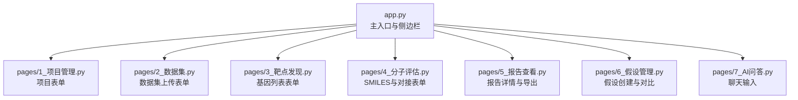
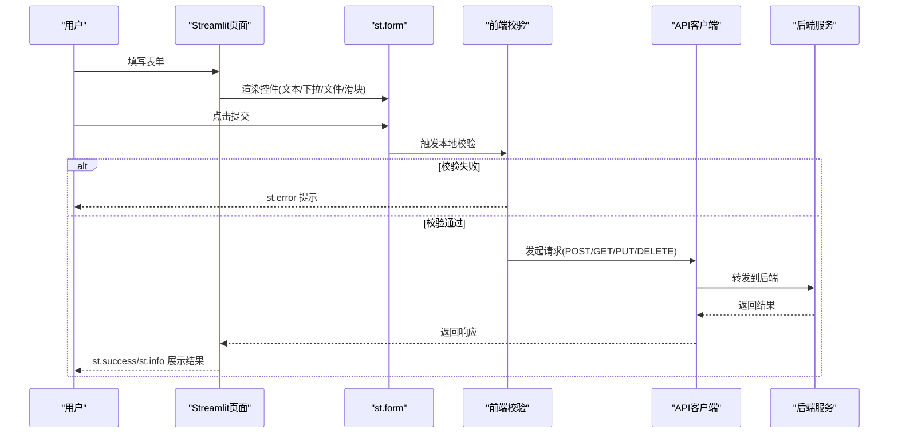
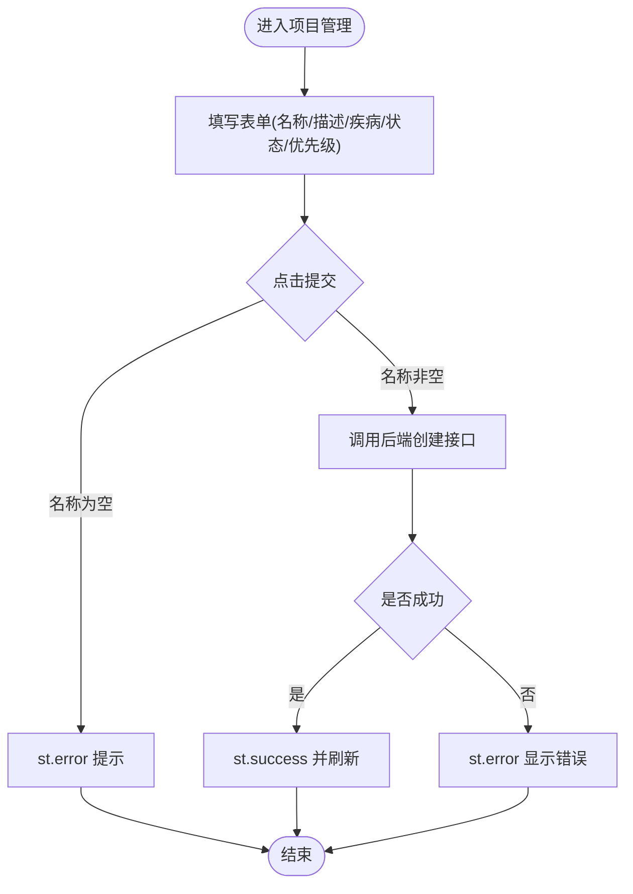
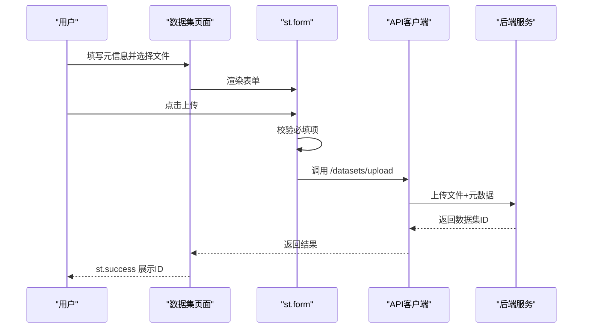
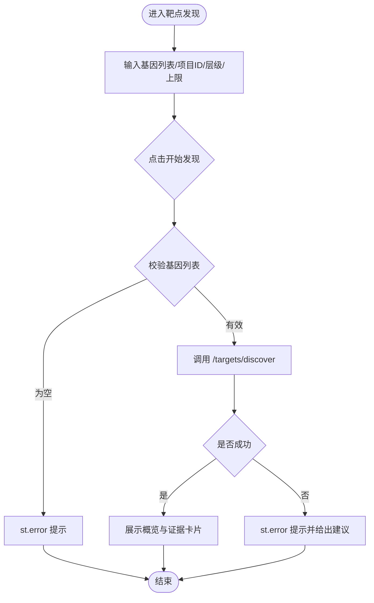
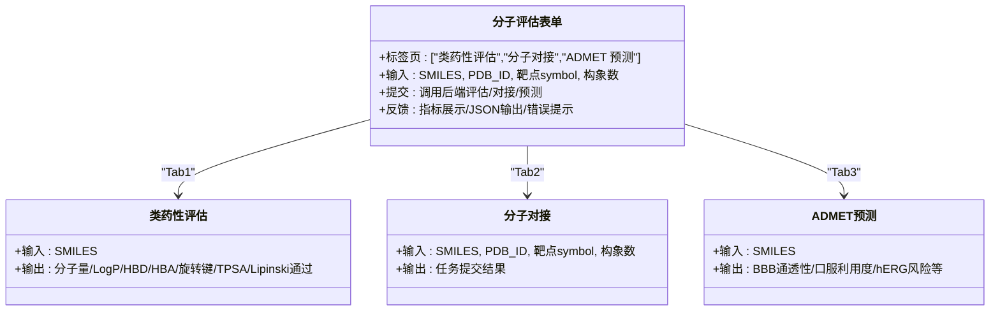
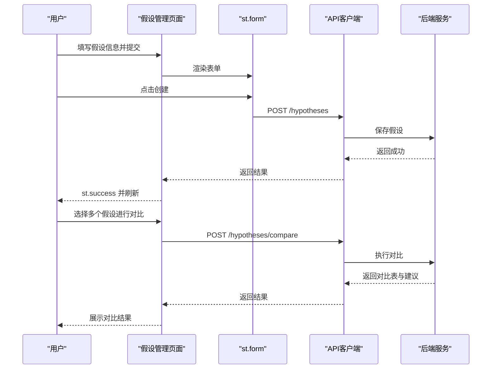
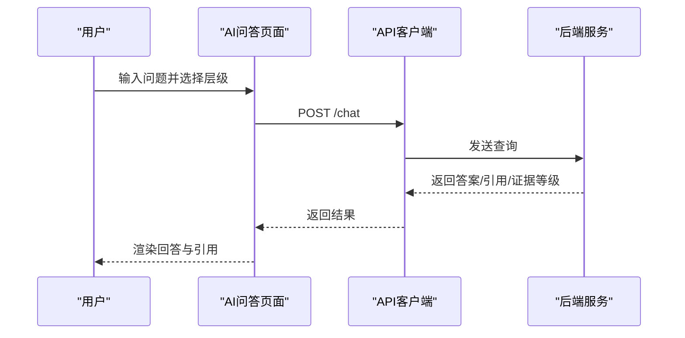
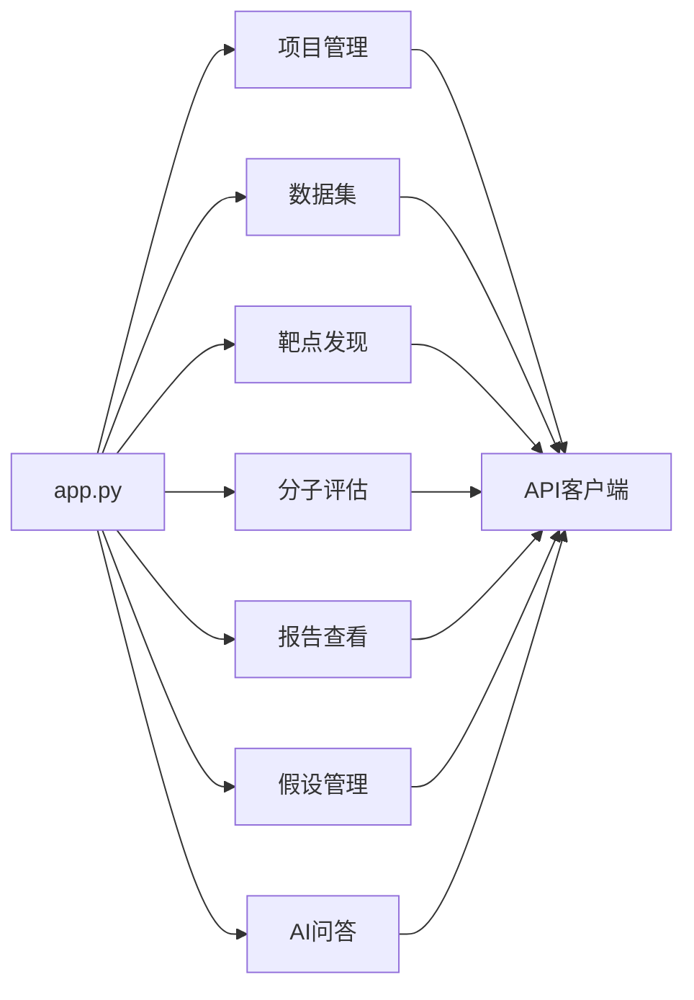

# 表单输入组件

<cite>
**本文引用的文件**   
- [frontend/app.py](file://frontend/app.py)
- [frontend/pages/1_📁_项目管理.py](file://frontend/pages/1_📁_项目管理.py)
- [frontend/pages/2_🧬_数据集.py](file://frontend/pages/2_🧬_数据集.py)
- [frontend/pages/3_🎯_靶点发现.py](file://frontend/pages/3_🎯_靶点发现.py)
- [frontend/pages/4_⚙️_分子评估.py](file://frontend/pages/4_⚙️_分子评估.py)
- [frontend/pages/5_📊_报告查看.py](file://frontend/pages/5_📊_报告查看.py)
- [frontend/pages/6_💡_假设管理.py](file://frontend/pages/6_💡_假设管理.py)
- [frontend/pages/7_🤖_AI问答.py](file://frontend/pages/7_🤖_AI问答.py)
</cite>

## 目录
1. [简介](#简介)
2. [项目结构](#项目结构)
3. [核心组件](#核心组件)
4. [架构总览](#架构总览)
5. [详细组件分析](#详细组件分析)
6. [依赖关系分析](#依赖关系分析)
7. [性能与可用性考虑](#性能与可用性考虑)
8. [故障排查指南](#故障排查指南)
9. [结论](#结论)
10. [附录：生物医学数据输入规范](#附录生物医学数据输入规范)

## 简介
本文件面向 AI 药物设计系统的 Streamlit 前端，聚焦“表单输入组件”的设计与使用。内容覆盖文本输入、下拉选择、日期时间、文件上传等基础控件；系统化的表单验证、错误提示、实时校验与条件显示逻辑；复杂布局与分组组织；动态字段生成；以及针对基因序列、分子结构等生物医学数据的特殊处理策略。目标是帮助开发者快速构建高可用、可访问且符合科研场景的表单体验。

## 项目结构
前端采用 Streamlit 多页面应用组织方式，每个业务模块对应一个 pages 脚本，主入口负责侧边栏导航与首页渲染。表单相关实现主要分布在以下页面中：
- 项目管理：创建项目（文本、下拉、提交）
- 数据集：上传组学数据（文本、下拉、文件上传）
- 靶点发现：差异基因列表输入（文本域、滑块、下拉）
- 分子评估：SMILES 输入与参数设置（文本、滑块）
- 假设管理：多字段组合与对比选择（文本、下拉、多选）
- AI 问答：聊天式输入（聊天输入框、层级选择）

图表来源
- [frontend/app.py:43-64](file://frontend/app.py#L43-L64)
- [frontend/pages/1_📁_项目管理.py:27-62](file://frontend/pages/1_📁_项目管理.py#L27-L62)
- [frontend/pages/2_🧬_数据集.py:27-68](file://frontend/pages/2_🧬_数据集.py#L27-L68)
- [frontend/pages/3_🎯_靶点发现.py:34-72](file://frontend/pages/3_🎯_靶点发现.py#L34-L72)
- [frontend/pages/4_⚙️_分子评估.py:31-74](file://frontend/pages/4_⚙️_分子评估.py#L31-L74)
- [frontend/pages/6_💡_假设管理.py:29-66](file://frontend/pages/6_💡_假设管理.py#L29-L66)
- [frontend/pages/7_🤖_AI问答.py:40-111](file://frontend/pages/7_🤖_AI问答.py#L40-L111)

章节来源
- [frontend/app.py:1-157](file://frontend/app.py#L1-L157)

## 核心组件
本节从“控件类型—交互模式—验证策略—错误反馈—布局组织”五个维度，总结各页面的表单实践。

- 文本输入与文本域
  - 用途：项目名称、描述、疾病、差异基因列表、SMILES、PDB ID、问题输入等
  - 要点：提供占位符与示例值；对关键文本进行非空校验；长文本使用 text_area 并限制高度
  - 参考路径：[项目管理-文本输入:27-62](file://frontend/pages/1_📁_项目管理.py#L27-L62)、[靶点发现-基因列表:34-72](file://frontend/pages/3_🎯_靶点发现.py#L34-L72)、[分子评估-SMILES:31-74](file://frontend/pages/4_⚙️_分子评估.py#L31-L74)、[AI问答-聊天输入:40-111](file://frontend/pages/7_🤖_AI问答.py#L40-L111)

- 下拉选择与单选/多选
  - 用途：状态、优先级、数据类型、分析层级、对比假设选择
  - 要点：选项枚举明确；为复杂选择提供 multiselect；结合 help 说明
  - 参考路径：[项目管理-下拉:27-62](file://frontend/pages/1_📁_项目管理.py#L27-L62)、[数据集-数据类型:27-68](file://frontend/pages/2_🧬_数据集.py#L27-L68)、[靶点发现-分析层级:34-72](file://frontend/pages/3_🎯_靶点发现.py#L34-L72)、[假设管理-多选对比:135-191](file://frontend/pages/6_💡_假设管理.py#L135-L191)

- 日期时间
  - 现状：当前页面未直接使用日期时间控件；可在需要时引入 st.date_input / st.time_input 或 st.datetime_input
  - 建议：统一时区与格式；在提交前转换为后端期望格式；提供默认值与范围约束

- 文件上传
  - 用途：组学数据上传（CSV/TSV/h5/mtx/vcf/fasta/fa）
  - 要点：限定 type 白名单；提交前校验必填项；上传后展示结果与后续操作
  - 参考路径：[数据集-文件上传:27-68](file://frontend/pages/2_🧬_数据集.py#L27-L68)

- 滑块与数值输入
  - 用途：最大靶点数、构象数等
  - 要点：设置合理 min/max/step；提供单位与说明
  - 参考路径：[靶点发现-滑块:34-72](file://frontend/pages/3_🎯_靶点发现.py#L34-L72)、[分子评估-构象数:76-107](file://frontend/pages/4_⚙️_分子评估.py#L76-L107)

- 表单验证与错误提示
  - 策略：提交前本地校验（非空、长度、格式），失败时使用 st.error 提示；成功则调用 API 并刷新
  - 参考路径：[项目管理-提交校验:41-62](file://frontend/pages/1_📁_项目管理.py#L41-L62)、[数据集-上传校验:50-68](file://frontend/pages/2_🧬_数据集.py#L50-L68)、[靶点发现-基因解析:57-72](file://frontend/pages/3_🎯_靶点发现.py#L57-L72)

- 条件显示与动态字段
  - 策略：基于会话状态控制显隐；根据用户选择动态加载字段或区域
  - 参考路径：[靶点发现-提交后状态:67-72](file://frontend/pages/3_🎯_靶点发现.py#L67-L72)、[假设管理-对比选择:135-191](file://frontend/pages/6_💡_假设管理.py#L135-L191)

- 复杂布局与分组
  - 策略：使用 columns 分栏、expander 折叠、tabs 分区、form 包裹提交
  - 参考路径：[项目管理-列布局:83-97](file://frontend/pages/1_📁_项目管理.py#L83-L97)、[分子评估-Tabs:26-28](file://frontend/pages/4_⚙️_分子评估.py#L26-L28)、[假设管理-折叠创建:29-66](file://frontend/pages/6_💡_假设管理.py#L29-L66)

章节来源
- [frontend/pages/1_📁_项目管理.py:27-137](file://frontend/pages/1_📁_项目管理.py#L27-L137)
- [frontend/pages/2_🧬_数据集.py:27-127](file://frontend/pages/2_🧬_数据集.py#L27-L127)
- [frontend/pages/3_🎯_靶点发现.py:34-157](file://frontend/pages/3_🎯_靶点发现.py#L34-L157)
- [frontend/pages/4_⚙️_分子评估.py:26-159](file://frontend/pages/4_⚙️_分子评估.py#L26-L159)
- [frontend/pages/6_💡_假设管理.py:29-197](file://frontend/pages/6_💡_假设管理.py#L29-L197)
- [frontend/pages/7_🤖_AI问答.py:40-139](file://frontend/pages/7_🤖_AI问答.py#L40-L139)

## 架构总览
表单组件通过 Streamlit 页面组织，统一由主入口渲染侧边栏与导航；各页面内部以 form 包裹输入控件，提交后调用 API 客户端完成数据持久化或计算任务，并通过 st.success/st.error 反馈结果。

图表来源
- [frontend/pages/1_📁_项目管理.py:41-62](file://frontend/pages/1_📁_项目管理.py#L41-L62)
- [frontend/pages/2_🧬_数据集.py:50-68](file://frontend/pages/2_🧬_数据集.py#L50-L68)
- [frontend/pages/3_🎯_靶点发现.py:57-100](file://frontend/pages/3_🎯_靶点发现.py#L57-L100)
- [frontend/pages/4_⚙️_分子评估.py:41-74](file://frontend/pages/4_⚙️_分子评估.py#L41-L74)

## 详细组件分析

### 项目管理表单
- 控件与布局
  - 文本输入：项目名称、描述、目标疾病
  - 下拉选择：状态、优先级
  - 提交按钮：use_container_width 全宽
  - 列布局：columns 将信息分为左右两列
- 验证与反馈
  - 提交前检查名称是否为空，否则 st.error 提示
  - 成功后 st.success 并刷新页面
- 扩展建议
  - 增加日期时间字段（如计划开始/结束）
  - 为疾病字段提供常用病种下拉或自动补全
  - 添加字段级实时校验（on_change）

图表来源
- [frontend/pages/1_📁_项目管理.py:27-62](file://frontend/pages/1_📁_项目管理.py#L27-L62)

章节来源
- [frontend/pages/1_📁_项目管理.py:27-137](file://frontend/pages/1_📁_项目管理.py#L27-L137)

### 数据集上传表单
- 控件与布局
  - 文本输入：项目 ID、数据集名称、描述
  - 下拉选择：数据类型（scrna/rna_seq/variant/proteomics/clinical）
  - 文件上传：type 白名单限制
  - 列布局：columns 将元信息与文件选择分列
- 验证与反馈
  - 提交前检查项目 ID 与文件是否选择
  - 上传成功后展示数据集 ID
- 扩展建议
  - 增加文件大小与格式二次校验
  - 支持批量上传与进度条
  - 上传预览（首行/样例）

图表来源
- [frontend/pages/2_🧬_数据集.py:27-68](file://frontend/pages/2_🧬_数据集.py#L27-L68)

章节来源
- [frontend/pages/2_🧬_数据集.py:27-127](file://frontend/pages/2_🧬_数据集.py#L27-L127)

### 靶点发现表单
- 控件与布局
  - 文本域：差异基因列表（每行一个或逗号分隔）
  - 文本输入：项目 ID
  - 下拉选择：分析层级（quick/deep）
  - 滑块：最大靶点数
- 验证与反馈
  - 提交前检查基因列表非空，并进行清洗与解析
  - 提交后显示 spinner，完成后统计概览与证据卡片
- 扩展建议
  - 提供基因符号标准化与去重
  - 支持从已上传数据集导入差异基因
  - 增加阈值过滤（表达倍数、p值）

图表来源
- [frontend/pages/3_🎯_靶点发现.py:34-100](file://frontend/pages/3_🎯_靶点发现.py#L34-L100)

章节来源
- [frontend/pages/3_🎯_靶点发现.py:34-157](file://frontend/pages/3_🎯_靶点发现.py#L34-L157)

### 分子评估表单
- 控件与布局
  - Tabs 分区：类药性评估、分子对接、ADMET 预测
  - 文本输入：SMILES、PDB ID、靶点 symbol
  - 滑块：构象数
- 验证与反馈
  - 提交前检查 SMILES 非空
  - 类药性评估返回 Lipinski 规则通过情况与违反项
  - 对接与 ADMET 提交后展示结果或 JSON
- 扩展建议
  - 增加 SMILES 合法性校验与可视化预览
  - 对接任务异步化与任务队列
  - 提供常用分子库一键填充

图表来源
- [frontend/pages/4_⚙️_分子评估.py:26-159](file://frontend/pages/4_⚙️_分子评估.py#L26-L159)

章节来源
- [frontend/pages/4_⚙️_分子评估.py:26-159](file://frontend/pages/4_⚙️_分子评估.py#L26-L159)

### 假设管理表单
- 控件与布局
  - 折叠面板：创建新假设（名称、项目 ID、优先级、靶点列表、描述）
  - 列表展开：显示状态、优先级、证据评分与操作按钮
  - 对比分析：multiselect 选择多个假设执行对比
- 验证与反馈
  - 创建时校验名称非空；提交后 st.success 并刷新
  - 对比时要求至少选择两个假设
- 扩展建议
  - 靶点列表支持自动补全与去重
  - 对比结果表格支持导出 CSV/Excel
  - 增加筛选与排序

图表来源
- [frontend/pages/6_💡_假设管理.py:29-66](file://frontend/pages/6_💡_假设管理.py#L29-L66)
- [frontend/pages/6_💡_假设管理.py:135-191](file://frontend/pages/6_💡_假设管理.py#L135-L191)

章节来源
- [frontend/pages/6_💡_假设管理.py:29-197](file://frontend/pages/6_💡_假设管理.py#L29-L197)

### AI 问答表单
- 控件与布局
  - 聊天历史：按角色渲染消息与引用源
  - 输入：chat_input 配合 selectbox 选择分析层级
- 验证与反馈
  - 提交后显示 spinner，返回答案、引用与证据等级
  - 异常时给出配置提示
- 扩展建议
  - 支持富文本与公式渲染
  - 历史记录持久化与搜索
  - 引用源可点击跳转

图表来源
- [frontend/pages/7_🤖_AI问答.py:40-111](file://frontend/pages/7_🤖_AI问答.py#L40-L111)

章节来源
- [frontend/pages/7_🤖_AI问答.py:40-139](file://frontend/pages/7_🤖_AI问答.py#L40-L139)

## 依赖关系分析
- 页面间依赖
  - app.py 作为主入口，负责侧边栏导航与首页渲染，不直接参与表单逻辑
  - 各 pages 页面独立维护自身表单状态与交互，通过 API 客户端与后端通信
- 组件耦合
  - 表单与 API 客户端解耦：页面仅负责 UI 与校验，网络请求委托给客户端
  - 状态管理：使用 st.session_state 传递跨步骤数据（如提交后的中间态）

图表来源
- [frontend/app.py:43-64](file://frontend/app.py#L43-L64)
- [frontend/pages/1_📁_项目管理.py:14-16](file://frontend/pages/1_📁_项目管理.py#L14-L16)
- [frontend/pages/2_🧬_数据集.py:14-16](file://frontend/pages/2_🧬_数据集.py#L14-L16)
- [frontend/pages/3_🎯_靶点发现.py:14-16](file://frontend/pages/3_🎯_靶点发现.py#L14-L16)
- [frontend/pages/4_⚙️_分子评估.py:14-16](file://frontend/pages/4_⚙️_分子评估.py#L14-L16)
- [frontend/pages/5_📊_报告查看.py:14-16](file://frontend/pages/5_📊_报告查看.py#L14-L16)
- [frontend/pages/6_💡_假设管理.py:14-16](file://frontend/pages/6_💡_假设管理.py#L14-L16)
- [frontend/pages/7_🤖_AI问答.py:14-16](file://frontend/pages/7_🤖_AI问答.py#L14-L16)

章节来源
- [frontend/app.py:1-157](file://frontend/app.py#L1-L157)

## 性能与可用性考虑
- 性能
  - 大文件上传：建议分块上传与断点续传；服务端限流与超时保护
  - 长耗时任务（对接/靶点发现）：异步任务与轮询/WebSocket 推送结果
  - 缓存：对只读列表（项目/数据集/报告）使用短期缓存减少重复请求
- 可用性
  - 键盘可达性：确保所有控件可通过 Tab 导航，Enter 提交
  - 屏幕阅读器：为重要控件添加 aria-label 或 title 辅助文本
  - 错误恢复：网络异常时提供重试按钮与友好提示
  - 渐进增强：在弱网环境下降级为更简单的输入方式

## 故障排查指南
- 常见问题
  - 表单提交无响应：检查网络连接与后端服务状态；确认认证令牌有效
  - 上传失败：核对文件类型与大小；查看后端日志与存储权限
  - 靶点发现无结果：确认基因符号正确性与知识库连通性
  - 分子对接失败：确认 PDB ID 存在与工具链可用
- 定位方法
  - 前端：打开浏览器控制台查看网络请求与错误堆栈
  - 后端：查看 API 文档与日志，确认入参与响应结构
  - 数据：核对输入格式（如 SMILES、FASTA/VCF）是否符合规范

章节来源
- [frontend/pages/3_🎯_靶点发现.py:84-100](file://frontend/pages/3_🎯_靶点发现.py#L84-L100)
- [frontend/pages/4_⚙️_分子评估.py:90-107](file://frontend/pages/4_⚙️_分子评估.py#L90-L107)
- [frontend/pages/7_🤖_AI问答.py:108-111](file://frontend/pages/7_🤖_AI问答.py#L108-L111)

## 结论
本系统的前端表单遵循统一的 Streamlit 模式：以 form 包裹控件、提交前本地校验、成功后调用 API 并刷新。通过 columns/tabs/expander 实现复杂布局与分组；借助 session_state 实现条件显示与动态字段。针对生物医学数据（基因序列、分子结构）提供了专用输入与校验策略。建议在后续迭代中完善日期时间、实时校验、异步任务与可访问性细节，以提升整体用户体验与稳定性。

## 附录：生物医学数据输入规范
- 基因序列
  - FASTA：单行标识符，多行序列；支持多序列拼接
  - VCF：标准变异注释格式；需包含必要字段（CHROM/POS/REF/ALT）
  - 输入建议：提供模板下载与在线校验；错误行号定位与修复建议
- 分子结构
  - SMILES：字符串表示；建议进行合法性校验与可视化预览
  - PDB ID：蛋白质结构标识；需校验存在性与版本
- 质量控制
  - 缺失值与异常值检测
  - 格式一致性检查（大小写、分隔符）
  - 领域词典与别名映射（基因符号标准化）