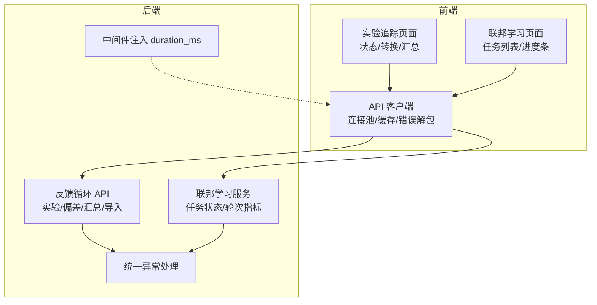
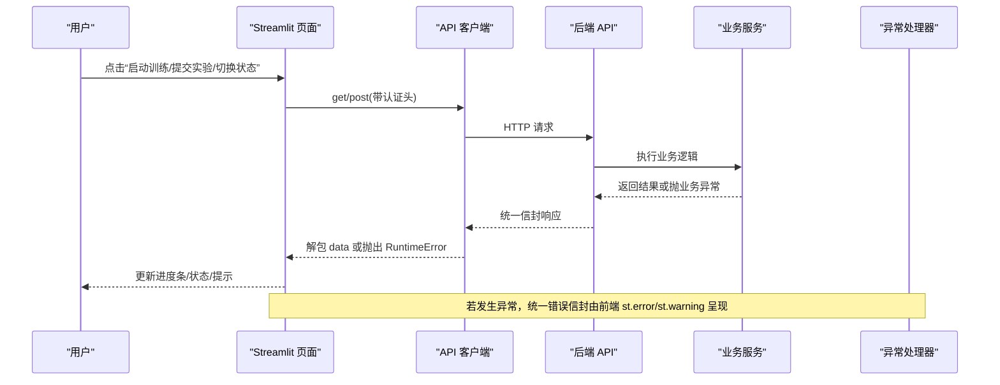
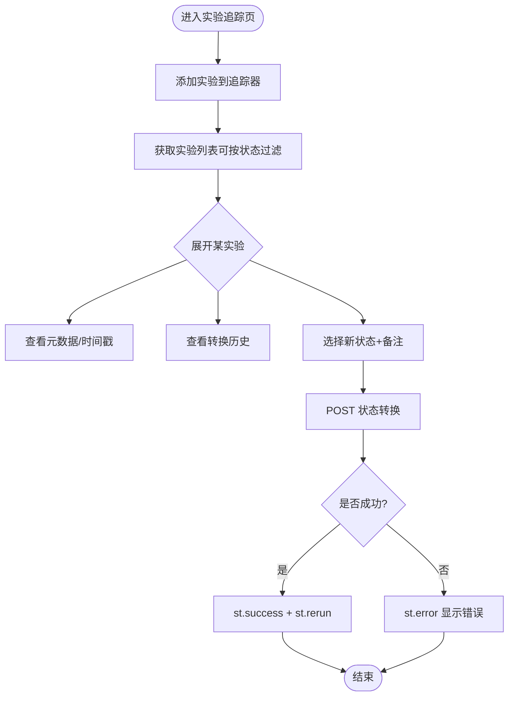
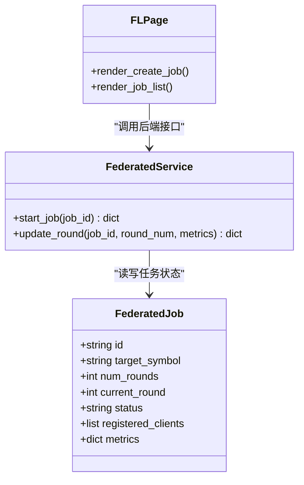
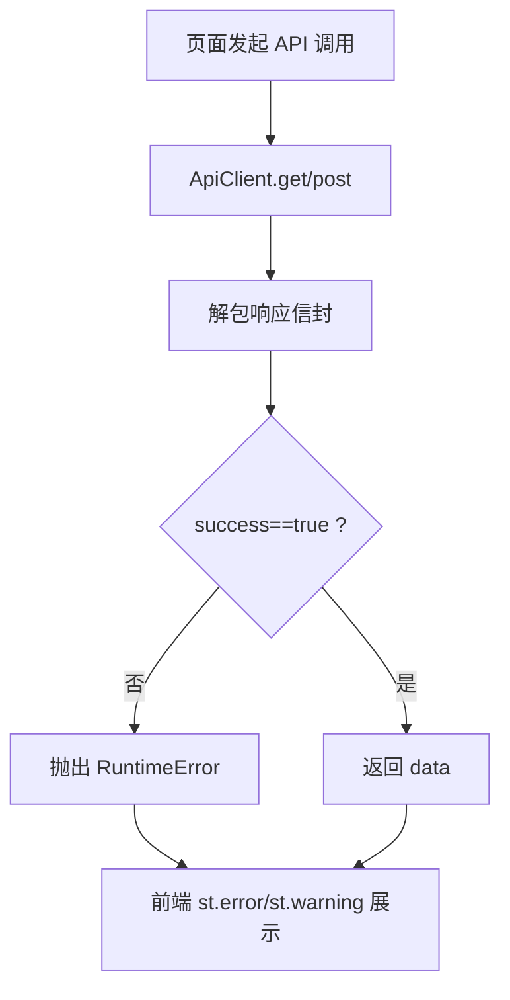
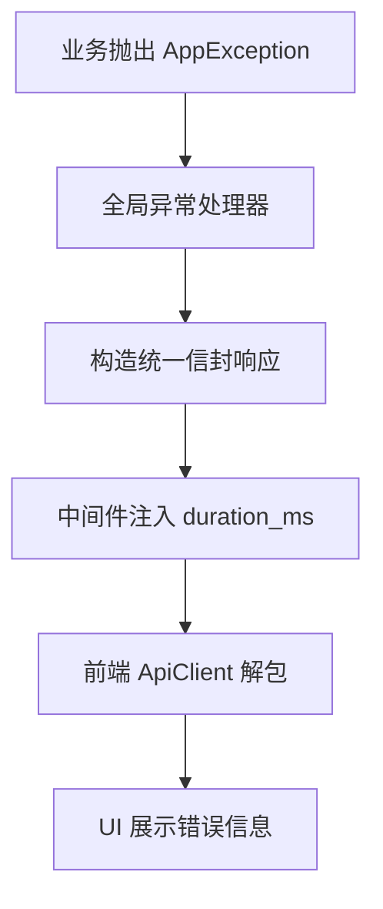
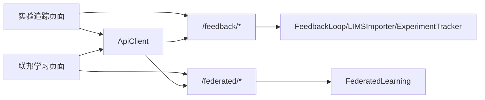

# 进度反馈组件

<cite>
**本文引用的文件**
- [frontend/pages/11_🧪_实验追踪.py](file://frontend/pages/11_🧪_实验追踪.py)
- [backend/app/api/v1/feedback.py](file://backend/app/api/v1/feedback.py)
- [frontend/pages/8_🌐_联邦学习.py](file://frontend/pages/8_🌐_联邦学习.py)
- [backend/app/services/optimizer/federated_learning.py](file://backend/app/services/optimizer/federated_learning.py)
- [frontend/api_client.py](file://frontend/api_client.py)
- [backend/app/core/exceptions.py](file://backend/app/core/exceptions.py)
- [backend/app/main.py](file://backend/app/main.py)
- [tests/e2e_test.py](file://tests/e2e_test.py)
</cite>

## 目录
1. [简介](#简介)
2. [项目结构](#项目结构)
3. [核心组件](#核心组件)
4. [架构总览](#架构总览)
5. [详细组件分析](#详细组件分析)
6. [依赖关系分析](#依赖关系分析)
7. [性能与用户体验优化](#性能与用户体验优化)
8. [故障排查指南](#故障排查指南)
9. [结论](#结论)
10. [附录：API 与状态定义](#附录api-与状态定义)

## 简介
本文件面向“AI药物设计系统”的进度反馈组件，聚焦以下能力：
- 加载动画、进度条、状态指示器、通知消息等前端反馈组件的使用与最佳实践
- 异步任务进度跟踪（如联邦学习任务轮次）与长耗时操作的用户体验优化
- 错误状态显示、重试机制、取消操作的实现建议
- AI 模型训练、数据分析等长时间任务的进度展示方案
- 不同网络环境下的稳定性与可感知性保障

## 项目结构
与进度反馈相关的代码主要分布在前后端：
- 前端页面：实验追踪、联邦学习页面使用 Streamlit 组件进行状态与进度展示
- 后端 API：提供实验生命周期管理、偏差检测、汇总统计等接口
- 客户端封装：统一错误处理、连接池复用、请求级缓存
- 异常体系：统一的错误信封与全局异常处理器

图表来源
- [frontend/pages/11_🧪_实验追踪.py:260-450](file://frontend/pages/11_🧪_实验追踪.py#L260-L450)
- [frontend/pages/8_🌐_联邦学习.py:68-141](file://frontend/pages/8_🌐_联邦学习.py#L68-L141)
- [frontend/api_client.py:42-163](file://frontend/api_client.py#L42-L163)
- [backend/app/api/v1/feedback.py:1-357](file://backend/app/api/v1/feedback.py#L1-L357)
- [backend/app/services/optimizer/federated_learning.py:135-167](file://backend/app/services/optimizer/federated_learning.py#L135-L167)
- [backend/app/main.py:99-128](file://backend/app/main.py#L99-L128)
- [backend/app/core/exceptions.py:1-178](file://backend/app/core/exceptions.py#L1-L178)

章节来源
- [frontend/pages/11_🧪_实验追踪.py:260-450](file://frontend/pages/11_🧪_实验追踪.py#L260-L450)
- [frontend/pages/8_🌐_联邦学习.py:68-141](file://frontend/pages/8_🌐_联邦学习.py#L68-L141)
- [frontend/api_client.py:42-163](file://frontend/api_client.py#L42-L163)
- [backend/app/api/v1/feedback.py:1-357](file://backend/app/api/v1/feedback.py#L1-L357)
- [backend/app/services/optimizer/federated_learning.py:135-167](file://backend/app/services/optimizer/federated_learning.py#L135-L167)
- [backend/app/main.py:99-128](file://backend/app/main.py#L99-L128)
- [backend/app/core/exceptions.py:1-178](file://backend/app/core/exceptions.py#L1-L178)

## 核心组件
- 实验追踪与状态机
  - 支持添加实验、按状态过滤、查看元数据与转换历史、执行状态转换（含失败重试与重启）
  - 通过后端接口维护实验记录与转换事件
- 联邦学习任务进度
  - 任务创建、启动、注册客户端、轮次推进与指标上报
  - 前端以进度条直观展示 current_round / num_rounds
- 统一 API 客户端
  - 连接池复用、超时配置、响应信封解包、统一错误抛出
  - GET 请求缓存与失效策略，减少重复调用
- 统一异常与错误信封
  - 业务异常、校验异常、未捕获异常均返回统一信封，便于前端一致化处理

章节来源
- [frontend/pages/11_🧪_实验追踪.py:260-450](file://frontend/pages/11_🧪_实验追踪.py#L260-L450)
- [backend/app/api/v1/feedback.py:250-357](file://backend/app/api/v1/feedback.py#L250-L357)
- [frontend/pages/8_🌐_联邦学习.py:68-141](file://frontend/pages/8_🌐_联邦学习.py#L68-L141)
- [backend/app/services/optimizer/federated_learning.py:135-167](file://backend/app/services/optimizer/federated_learning.py#L135-L167)
- [frontend/api_client.py:42-163](file://frontend/api_client.py#L42-L163)
- [backend/app/core/exceptions.py:1-178](file://backend/app/core/exceptions.py#L1-L178)

## 架构总览
下图展示了从用户交互到后端处理的端到端流程，以及进度反馈的关键路径。

图表来源
- [frontend/pages/8_🌐_联邦学习.py:110-120](file://frontend/pages/8_🌐_联邦学习.py#L110-L120)
- [frontend/pages/11_🧪_实验追踪.py:360-377](file://frontend/pages/11_🧪_实验追踪.py#L360-L377)
- [frontend/api_client.py:68-94](file://frontend/api_client.py#L68-L94)
- [backend/app/api/v1/feedback.py:250-357](file://backend/app/api/v1/feedback.py#L250-L357)
- [backend/app/core/exceptions.py:138-178](file://backend/app/core/exceptions.py#L138-L178)

## 详细组件分析

### 组件A：实验追踪与状态机
- 功能要点
  - 添加实验到追踪器（初始 queued）
  - 列出并过滤实验（全部/queued/running/completed/failed/cancelled）
  - 查看元数据与转换历史
  - 执行状态转换（含失败→重试、已取消→重启）
- 关键交互
  - 新增：POST /feedback/experiments/tracker
  - 查询：GET /feedback/experiments/tracker?status=...
  - 转换：POST /feedback/experiments/{id}/transition
- 前端反馈
  - 使用 expander 分组展示详情
  - 使用 selectbox + text_input 选择目标状态与备注
  - 成功/失败分别用 st.success / st.error 提示
  - 操作后 st.rerun 刷新列表

图表来源
- [frontend/pages/11_🧪_实验追踪.py:274-377](file://frontend/pages/11_🧪_实验追踪.py#L274-L377)
- [backend/app/api/v1/feedback.py:293-357](file://backend/app/api/v1/feedback.py#L293-L357)
- [backend/app/api/v1/feedback.py:250-291](file://backend/app/api/v1/feedback.py#L250-L291)

章节来源
- [frontend/pages/11_🧪_实验追踪.py:260-450](file://frontend/pages/11_🧪_实验追踪.py#L260-L450)
- [backend/app/api/v1/feedback.py:250-357](file://backend/app/api/v1/feedback.py#L250-L357)
- [tests/e2e_test.py:213-236](file://tests/e2e_test.py#L213-L236)

### 组件B：联邦学习任务进度
- 功能要点
  - 创建任务（指定轮数、最少客户端）
  - 注册客户端
  - 启动训练（pending/ready → running）
  - 轮次推进与指标上报（current_round/num_rounds/metrics）
- 前端反馈
  - 使用 st.progress 展示当前轮次占比
  - 使用 metric 展示关键指标
  - 按钮触发启动/注册，成功后 st.success + st.rerun
- 后端支撑
  - 服务层维护任务状态与轮次指标

图表来源
- [frontend/pages/8_🌐_联邦学习.py:36-141](file://frontend/pages/8_🌐_联邦学习.py#L36-L141)
- [backend/app/services/optimizer/federated_learning.py:135-167](file://backend/app/services/optimizer/federated_learning.py#L135-L167)

章节来源
- [frontend/pages/8_🌐_联邦学习.py:68-141](file://frontend/pages/8_🌐_联邦学习.py#L68-L141)
- [backend/app/services/optimizer/federated_learning.py:135-167](file://backend/app/services/optimizer/federated_learning.py#L135-L167)

### 组件C：统一 API 客户端与错误处理
- 特性
  - 共享 httpx.Client（连接池复用），降低连接开销
  - 统一超时与限制配置
  - 自动注入 Authorization 头
  - 响应信封解包：{success,data,meta}，失败时抛出 RuntimeError
  - GET 请求缓存（TTL 时间桶），写操作后失效
- 对进度反馈的意义
  - 快速失败的错误路径能立即反馈给用户
  - 缓存减少频繁轮询带来的抖动与延迟
  - 连接池提升弱网环境下的吞吐与稳定性

图表来源
- [frontend/api_client.py:68-94](file://frontend/api_client.py#L68-L94)
- [frontend/api_client.py:96-134](file://frontend/api_client.py#L96-L134)
- [frontend/api_client.py:186-236](file://frontend/api_client.py#L186-L236)

章节来源
- [frontend/api_client.py:24-39](file://frontend/api_client.py#L24-L39)
- [frontend/api_client.py:68-94](file://frontend/api_client.py#L68-L94)
- [frontend/api_client.py:186-236](file://frontend/api_client.py#L186-L236)

### 组件D：后端统一异常与响应增强
- 统一异常
  - AppException 及其子类携带 code/status_code/message/details
  - 全局处理器将异常转换为统一信封响应
- 响应增强
  - 中间件为 JSON 响应注入 meta.duration_ms，便于前端展示耗时

图表来源
- [backend/app/core/exceptions.py:138-178](file://backend/app/core/exceptions.py#L138-L178)
- [backend/app/main.py:99-128](file://backend/app/main.py#L99-L128)

章节来源
- [backend/app/core/exceptions.py:1-178](file://backend/app/core/exceptions.py#L1-L178)
- [backend/app/main.py:99-128](file://backend/app/main.py#L99-L128)

## 依赖关系分析
- 页面与服务耦合点
  - 实验追踪页面依赖 /feedback/experiments/tracker 与 /feedback/experiments/{id}/transition
  - 联邦学习页面依赖 /federated 列表与 /federated/{id}/start
- 客户端依赖
  - 所有页面通过 ApiClient 访问后端，统一错误与缓存策略
- 异常链路
  - 后端异常经全局处理器转为统一信封，前端统一处理

图表来源
- [frontend/pages/11_🧪_实验追踪.py:260-450](file://frontend/pages/11_🧪_实验追踪.py#L260-L450)
- [frontend/pages/8_🌐_联邦学习.py:68-141](file://frontend/pages/8_🌐_联邦学习.py#L68-L141)
- [backend/app/api/v1/feedback.py:1-357](file://backend/app/api/v1/feedback.py#L1-L357)
- [backend/app/services/optimizer/federated_learning.py:135-167](file://backend/app/services/optimizer/federated_learning.py#L135-L167)
- [frontend/api_client.py:42-163](file://frontend/api_client.py#L42-L163)

章节来源
- [frontend/pages/11_🧪_实验追踪.py:260-450](file://frontend/pages/11_🧪_实验追踪.py#L260-L450)
- [frontend/pages/8_🌐_联邦学习.py:68-141](file://frontend/pages/8_🌐_联邦学习.py#L68-L141)
- [backend/app/api/v1/feedback.py:1-357](file://backend/app/api/v1/feedback.py#L1-L357)
- [backend/app/services/optimizer/federated_learning.py:135-167](file://backend/app/services/optimizer/federated_learning.py#L135-L167)
- [frontend/api_client.py:42-163](file://frontend/api_client.py#L42-L163)

## 性能与用户体验优化
- 连接池复用
  - 通过共享 httpx.Client 避免每次请求新建连接，显著降低首包延迟
- 请求级缓存
  - 使用 TTL 时间桶的 cached_get 减少重复 GET 调用；写操作后 invalidate_cache 保证一致性
- 超时与重试
  - 合理设置 connect/read 超时；对幂等 GET 可引入指数退避重试
- 弱网适配
  - 增加友好提示（加载中占位）、分段加载（分页/折叠）、失败重试与降级（仅展示缓存）
- 进度可视化
  - 联邦学习使用 st.progress 展示轮次进度；实验追踪使用状态图标与转换历史
- 耗时可见性
  - 后端注入 meta.duration_ms，前端可在控制台或调试面板展示，辅助定位慢请求

章节来源
- [frontend/api_client.py:24-39](file://frontend/api_client.py#L24-L39)
- [frontend/api_client.py:186-236](file://frontend/api_client.py#L186-L236)
- [backend/app/main.py:99-128](file://backend/app/main.py#L99-L128)
- [frontend/pages/8_🌐_联邦学习.py:100-102](file://frontend/pages/8_🌐_联邦学习.py#L100-L102)

## 故障排查指南
- 常见错误类型
  - 参数校验失败：400 VALIDATION_ERROR
  - 未认证/无权限：401/403
  - 资源不存在：404 NOT_FOUND
  - 冲突：409 CONFLICT
  - 上游错误：502 UPSTREAM_ERROR
  - 内部错误：500 INTERNAL_ERROR
- 前端表现
  - ApiClient 在响应失败或 success=false 时抛出 RuntimeError，页面使用 st.error/st.warning 展示
  - 操作成功后使用 st.success 并 st.rerun 刷新
- 定位步骤
  - 检查浏览器网络面板的请求/响应，确认统一信封结构与错误码
  - 查看后端日志中的 request_id 与错误堆栈
  - 对于状态转换失败，核对合法转换规则与当前状态

章节来源
- [frontend/api_client.py:68-94](file://frontend/api_client.py#L68-L94)
- [backend/app/core/exceptions.py:138-178](file://backend/app/core/exceptions.py#L138-L178)
- [backend/app/api/v1/feedback.py:250-291](file://backend/app/api/v1/feedback.py#L250-L291)

## 结论
本进度反馈体系通过“统一客户端 + 统一异常 + 明确的状态机 + 直观的进度可视化”，在复杂长耗时任务中提供了稳定、可感知、可恢复的用户体验。结合连接池复用与请求级缓存，系统在弱网与高并发场景下仍能提供良好响应。后续可进一步引入服务端推送（如 SSE/WebSocket）以实现更实时的进度更新。

## 附录：API 与状态定义
- 实验追踪相关
  - POST /feedback/experiments/tracker：添加实验（默认 queued）
  - GET /feedback/experiments/tracker?status=...：按状态过滤
  - POST /feedback/experiments/{id}/transition：状态转换
- 联邦学习相关
  - GET /federated：任务列表（包含 current_round/num_rounds/metrics）
  - POST /federated/{id}/start：启动训练
- 状态集合
  - 实验：queued → running → completed/failed/cancelled；failed→queued（重试），cancelled→queued（重启）
  - 联邦任务：pending/ready → running → completed/failed

章节来源
- [backend/app/api/v1/feedback.py:293-357](file://backend/app/api/v1/feedback.py#L293-L357)
- [backend/app/api/v1/feedback.py:250-291](file://backend/app/api/v1/feedback.py#L250-L291)
- [frontend/pages/8_🌐_联邦学习.py:68-141](file://frontend/pages/8_🌐_联邦学习.py#L68-L141)