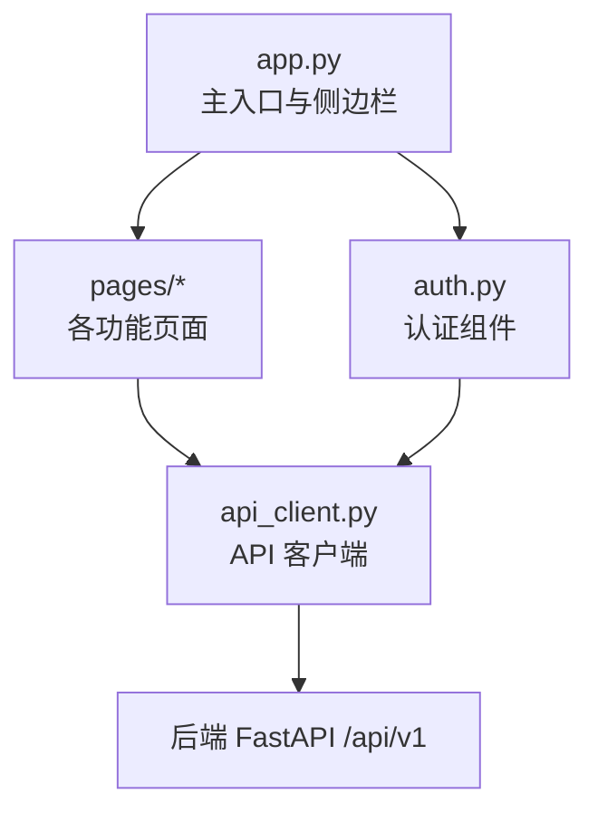
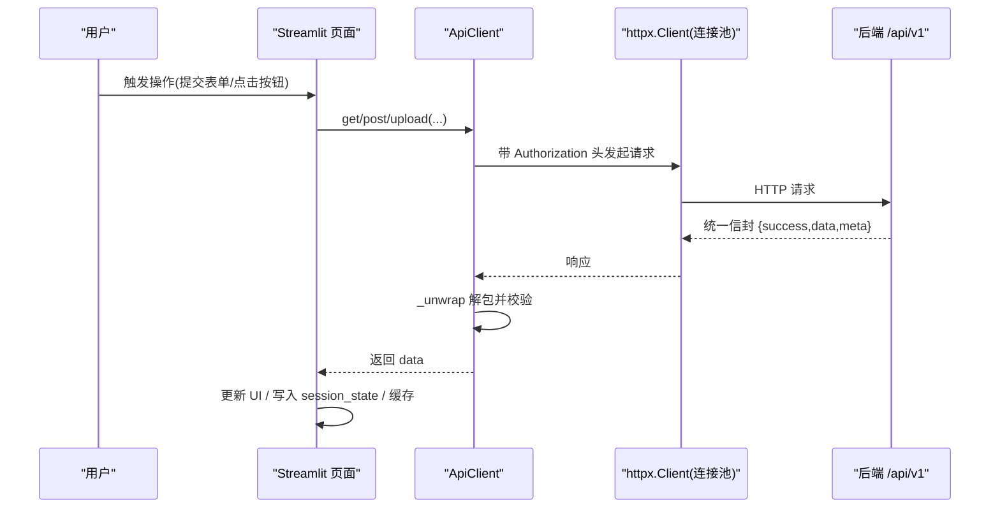
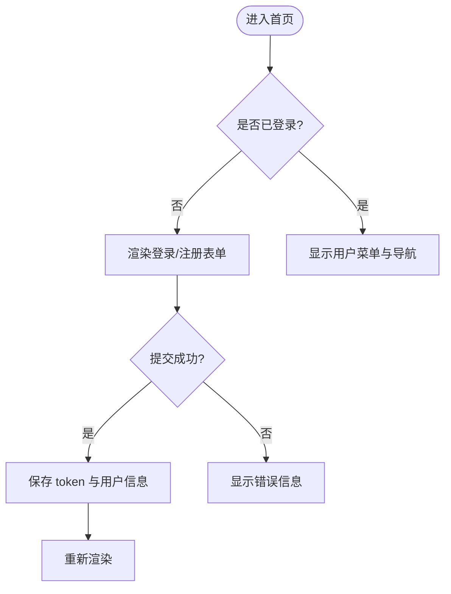
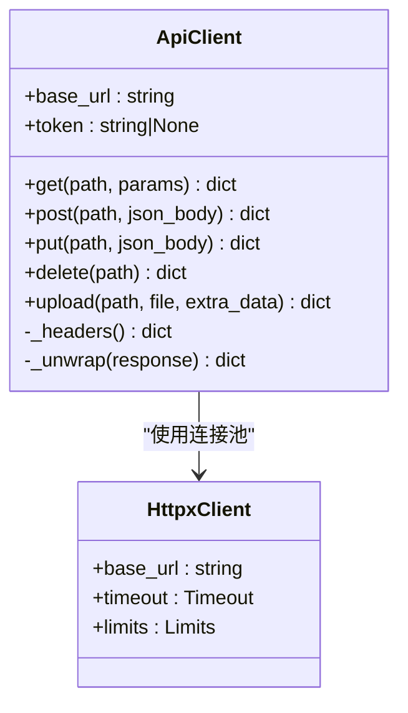
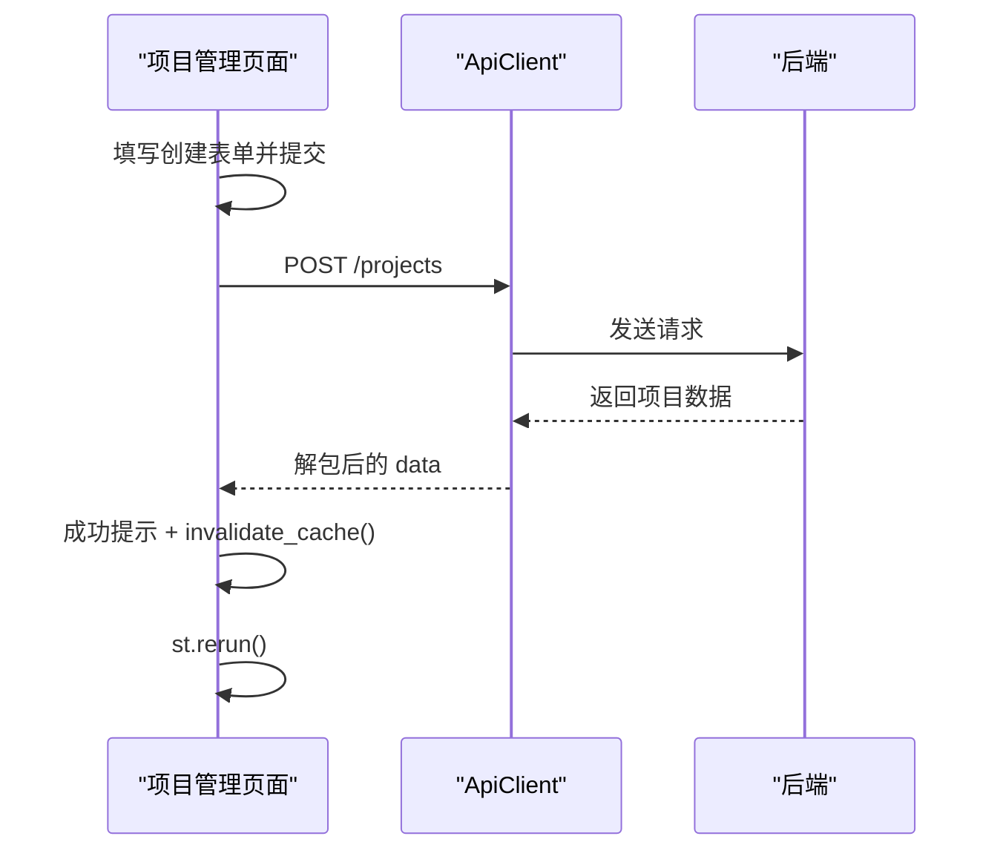
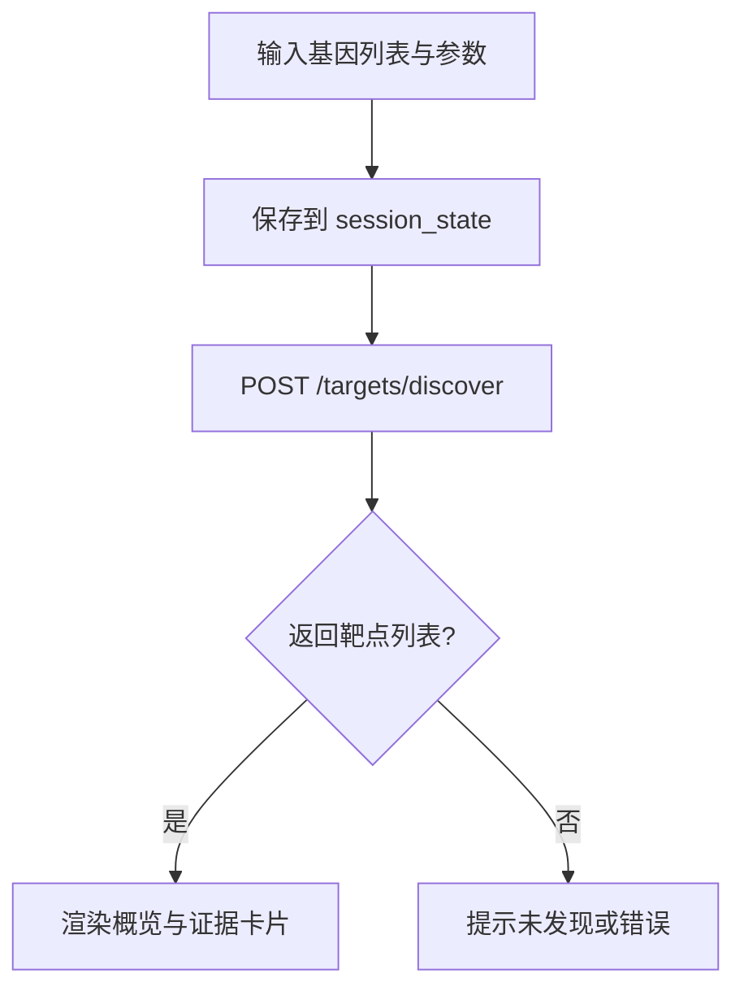
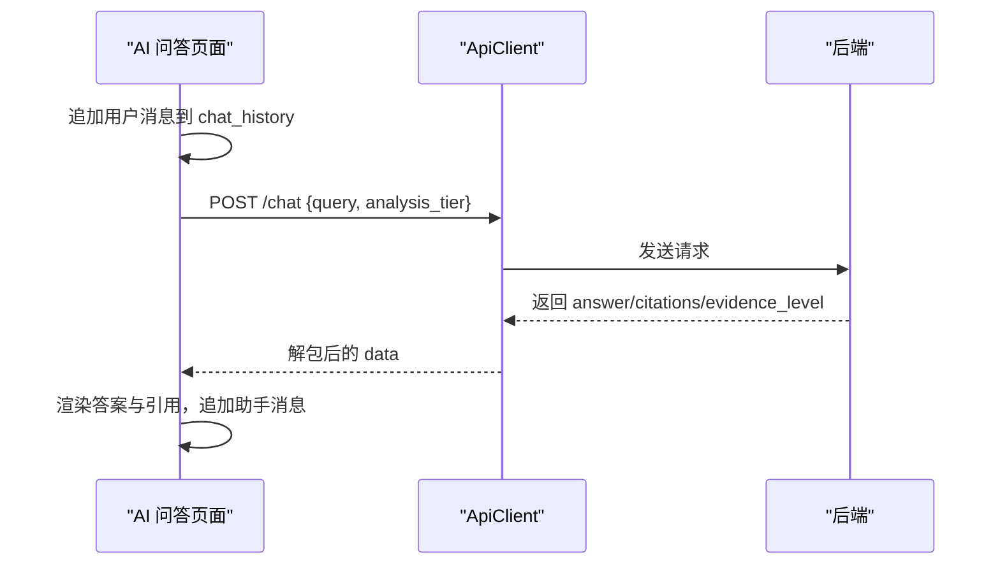
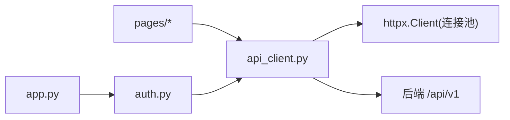

# 前端开发指南

<cite>
**本文引用的文件**   
- [frontend/app.py](file://frontend/app.py)
- [frontend/api_client.py](file://frontend/api_client.py)
- [frontend/auth.py](file://frontend/auth.py)
- [frontend/pages/1_📁_项目管理.py](file://frontend/pages/1_📁_项目管理.py)
- [frontend/pages/2_🧬_数据集.py](file://frontend/pages/2_🧬_数据集.py)
- [frontend/pages/3_🎯_靶点发现.py](file://frontend/pages/3_🎯_靶点发现.py)
- [frontend/pages/4_⚙️_分子评估.py](file://frontend/pages/4_⚙️_分子评估.py)
- [frontend/pages/5_📊_报告查看.py](file://frontend/pages/5_📊_报告查看.py)
- [frontend/pages/6_💡_假设管理.py](file://frontend/pages/6_💡_假设管理.py)
- [frontend/pages/7_🤖_AI问答.py](file://frontend/pages/7_🤖_AI问答.py)
- [frontend/pages/8_🌐_联邦学习.py](file://frontend/pages/8_🌐_联邦学习.py)
- [frontend/pages/9_🔒_隐私计算.py](file://frontend/pages/9_🔒_隐私计算.py)
- [frontend/pages/10_📈_系统监控.py](file://frontend/pages/10_📈_系统监控.py)
</cite>

## 目录
1. [引言](#引言)
2. [项目结构](#项目结构)
3. [核心组件](#核心组件)
4. [架构总览](#架构总览)
5. [详细组件分析](#详细组件分析)
6. [依赖关系分析](#依赖关系分析)
7. [性能考虑](#性能考虑)
8. [故障排查指南](#故障排查指南)
9. [结论](#结论)
10. [附录](#附录)

## 引言
本指南面向 AI 药物设计系统的前端开发者与 UI 设计师，聚焦 Streamlit 应用的整体架构、页面组件设计、状态管理、API 客户端封装与复用模式。文档覆盖 10 个主要页面的功能实现、用户交互流程与可视化集成方式，并提供样式定制、响应式布局、用户体验优化、页面开发模板、组件使用示例、调试技巧与性能优化方案，帮助团队高效构建一致、可维护且高性能的 Web 界面。

## 项目结构
前端采用 Streamlit 多页应用组织方式：
- 主入口 app.py 负责全局配置、侧边栏导航与首页渲染
- api_client.py 统一封装后端 REST API 调用（连接池、认证注入、信封解包、缓存）
- auth.py 提供登录/注册/登出等认证相关 UI 与逻辑
- pages/ 下按业务域划分 10 个页面，每个页面独立运行，通过 session_state 共享状态

图表来源
- [frontend/app.py:35-64](file://frontend/app.py#L35-L64)
- [frontend/api_client.py:42-167](file://frontend/api_client.py#L42-L167)
- [frontend/auth.py:10-137](file://frontend/auth.py#L10-L137)

章节来源
- [frontend/app.py:1-157](file://frontend/app.py#L1-L157)

## 核心组件
- 全局配置与导航
  - 设置页面标题、图标、布局与侧边栏；根据登录态动态展示导航菜单与快速入口
- 认证模块
  - 登录/注册表单、错误提示、会话令牌存储、登出清理
- API 客户端
  - 基于 httpx 的连接池复用、JWT 自动注入、统一响应信封解包、流式上传、请求级缓存与 TTL 失效机制
- 页面通用模式
  - require_auth 守卫、cached_get 缓存读取、invalidate_cache 刷新、st.session_state 跨页面状态传递

章节来源
- [frontend/app.py:35-64](file://frontend/app.py#L35-L64)
- [frontend/auth.py:10-137](file://frontend/auth.py#L10-L137)
- [frontend/api_client.py:24-167](file://frontend/api_client.py#L24-L167)
- [frontend/api_client.py:186-251](file://frontend/api_client.py#L186-L251)

## 架构总览
整体数据流：浏览器 → Streamlit 页面 → ApiClient → 后端 /api/v1 → 返回统一信封 → 页面渲染与缓存。

图表来源
- [frontend/api_client.py:42-167](file://frontend/api_client.py#L42-L167)
- [frontend/api_client.py:68-94](file://frontend/api_client.py#L68-L94)

## 详细组件分析

### 认证与用户菜单
- 登录/注册
  - 支持邮箱+密码登录与注册，失败时解析后端错误信息并提示
  - 成功后将 access_token、refresh_token、user_email 写入 session_state
- 用户菜单
  - 显示当前用户与登出按钮，登出后清空会话并重载
- 演示模式提示
  - 未登录时给出演示账号与后端可用性提示

图表来源
- [frontend/auth.py:10-137](file://frontend/auth.py#L10-L137)
- [frontend/app.py:67-147](file://frontend/app.py#L67-L147)

章节来源
- [frontend/auth.py:10-137](file://frontend/auth.py#L10-L137)
- [frontend/app.py:67-147](file://frontend/app.py#L67-L147)

### API 客户端封装
- 连接池复用
  - 使用 @st.cache_resource 创建全局 httpx.Client，减少握手开销
- 认证注入
  - 自动从 session_state 读取 access_token 并注入 Authorization 头
- 响应信封解包
  - 对 {success,data,meta} 进行校验与解包，失败抛出运行时异常
- 上传接口
  - 使用独立 Client 处理大文件上传，避免影响连接池
- 请求级缓存
  - cached_get 基于时间桶 TTL 与 st.cache_data 实现可过期缓存
  - invalidate_cache 用于写操作后强制刷新

图表来源
- [frontend/api_client.py:24-167](file://frontend/api_client.py#L24-L167)

章节来源
- [frontend/api_client.py:24-167](file://frontend/api_client.py#L24-L167)
- [frontend/api_client.py:186-251](file://frontend/api_client.py#L186-L251)

### 页面 1：项目管理
- 功能要点
  - 创建项目表单（名称、描述、疾病、状态、优先级）
  - 项目列表展示（展开详情、指标卡片）
  - 操作：激活/暂停/归档，完成后刷新缓存并重载
- 交互流程
  - 提交表单 → POST /projects → 成功提示 → 清除缓存 → 重渲染
  - 列表加载 → GET /projects（缓存）→ 展开详情 → 操作 → PUT/DELETE → 刷新

图表来源
- [frontend/pages/1_📁_项目管理.py:27-137](file://frontend/pages/1_📁_项目管理.py#L27-L137)
- [frontend/api_client.py:186-251](file://frontend/api_client.py#L186-L251)

章节来源
- [frontend/pages/1_📁_项目管理.py:1-137](file://frontend/pages/1_📁_项目管理.py#L1-L137)

### 页面 2：数据集
- 功能要点
  - 上传 CSV/TSV/h5/mtx/vcf/fasta/fa 等多类型文件
  - 数据集列表筛选（按项目 ID）、元数据展示（行数、列数、大小、状态）
  - 触发数据处理与查看质控结果
- 交互流程
  - 选择文件与参数 → 调用 upload → 成功提示
  - 列表加载 → 展开详情 → 执行处理/查看质控

章节来源
- [frontend/pages/2_🧬_数据集.py:1-127](file://frontend/pages/2_🧬_数据集.py#L1-L127)

### 页面 3：靶点发现
- 功能要点
  - 输入差异基因列表（每行或逗号分隔），选择分析层级（quick/deep）与最大靶点数
  - 调用 /targets/discover 获取潜在靶点与证据项
  - 概览统计与证据等级展示，支持生成报告与跳转
- 交互流程
  - 提交表单 → 保存 session_state → 调用 API → 渲染结果卡片与证据

图表来源
- [frontend/pages/3_🎯_靶点发现.py:34-157](file://frontend/pages/3_🎯_靶点发现.py#L34-L157)

章节来源
- [frontend/pages/3_🎯_靶点发现.py:1-157](file://frontend/pages/3_🎯_靶点发现.py#L1-L157)

### 页面 4：分子评估
- 功能要点
  - 类药性评估（Lipinski 五规则）：展示分子量、LogP、氢键供体/受体、可旋转键、TPSA 与通过情况
  - 分子对接：提交配体 SMILES 与靶点 PDB/symbol，返回任务结果
  - ADMET 预测：BBB 通透性、口服生物利用度、hERG 毒性风险等
- 交互流程
  - 表单提交 → 对应 API 调用 → 指标卡片与 JSON 详情展示

章节来源
- [frontend/pages/4_⚙️_分子评估.py:1-159](file://frontend/pages/4_⚙️_分子评估.py#L1-L159)

### 页面 5：报告查看
- 功能要点
  - 报告列表与详情查看（证据等级分布、Markdown 内容、结构化 JSON）
  - CDISC SDTM 导出
- 交互流程
  - 列表加载 → 查看详情 → 导出为 SDTM JSON

章节来源
- [frontend/pages/5_📊_报告查看.py:1-112](file://frontend/pages/5_📊_报告查看.py#L1-L112)

### 页面 6：假设管理
- 功能要点
  - 创建假设（名称、项目、优先级、靶点列表、描述）
  - 假设列表与状态管理（运行分析、标记验证、淘汰、删除）
  - 对比分析：多选假设执行对比，输出对比表、共享靶点与建议
- 交互流程
  - 创建/编辑 → CRUD 操作 → 对比分析 → 表格与文本建议展示

章节来源
- [frontend/pages/6_💡_假设管理.py:1-197](file://frontend/pages/6_💡_假设管理.py#L1-L197)

### 页面 7：AI 问答
- 功能要点
  - 聊天历史持久化于 session_state，支持引用源与证据等级展示
  - 选择分析层级（quick/deep），调用 /chat 获取回答与模型信息
  - 示例问题快捷输入，清空历史
- 交互流程
  - 输入问题 → 追加用户消息 → 调用 API → 渲染助手消息与引用 → 保存历史

图表来源
- [frontend/pages/7_🤖_AI问答.py:40-139](file://frontend/pages/7_🤖_AI问答.py#L40-L139)

章节来源
- [frontend/pages/7_🤖_AI问答.py:1-139](file://frontend/pages/7_🤖_AI问答.py#L1-L139)

### 页面 8：联邦学习
- 功能要点
  - 创建训练任务（项目 ID、目标靶点、轮次、最少客户端）
  - 任务列表与进度条、指标展示
  - 启动训练、注册客户端
- 交互流程
  - 创建任务 → 列表加载（缓存）→ 启动/注册 → 刷新缓存并重载

章节来源
- [frontend/pages/8_🌐_联邦学习.py:1-142](file://frontend/pages/8_🌐_联邦学习.py#L1-L142)

### 页面 9：隐私计算
- 功能要点
  - 隐私域管理与数据集注册（含 Schema 与 ε 预算）
  - 计算请求提交（Python 代码在受控环境执行）
  - 差分隐私预算监控（总预算、已消耗、剩余、查询次数、历史）
- 交互流程
  - 创建域/注册数据集 → 提交计算请求 → 查看预算与历史记录

章节来源
- [frontend/pages/9_🔒_隐私计算.py:1-177](file://frontend/pages/9_🔒_隐私计算.py#L1-L177)

### 页面 10：系统监控
- 功能要点
  - 健康检查（服务状态与延迟）
  - LLM 成本统计（总花费、预算、剩余、调用次数、按模型/层级分解）
  - API 端点概览与自动刷新控件
- 交互流程
  - 定时刷新（checkbox 控制）→ 拉取健康与成本数据 → 指标与表格展示

章节来源
- [frontend/pages/10_📈_系统监控.py:1-122](file://frontend/pages/10_📈_系统监控.py#L1-L122)

## 依赖关系分析
- 页面与客户端
  - 所有页面均依赖 api_client.get/post/upload 与 require_auth
  - 部分页面使用 cached_get 与 invalidate_cache 提升性能与一致性
- 认证与导航
  - 首页根据 session_state.access_token 决定渲染登录表单或用户菜单与导航
- 外部依赖
  - httpx 作为底层 HTTP 客户端，Streamlit 提供 UI 与状态管理

图表来源
- [frontend/app.py:35-64](file://frontend/app.py#L35-L64)
- [frontend/api_client.py:24-167](file://frontend/api_client.py#L24-L167)

章节来源
- [frontend/app.py:35-64](file://frontend/app.py#L35-L64)
- [frontend/api_client.py:24-167](file://frontend/api_client.py#L24-L167)

## 性能考虑
- 连接池复用
  - 使用 @st.cache_resource 创建全局 httpx.Client，降低连接建立开销
- 请求级缓存
  - 使用 cached_get 配合 TTL 时间桶，避免频繁重复请求
  - 写操作后调用 invalidate_cache 确保数据一致性
- 上传隔离
  - 上传接口使用独立 Client，避免长耗时上传阻塞连接池
- 页面渲染优化
  - 使用 st.columns、st.expander、st.tabs 合理组织布局，减少不必要的重渲染
  - 对长耗时任务使用 spinner 与异步提示，提升用户体验

章节来源
- [frontend/api_client.py:24-167](file://frontend/api_client.py#L24-L167)
- [frontend/api_client.py:186-251](file://frontend/api_client.py#L186-L251)

## 故障排查指南
- 认证失败
  - 检查登录表单是否正确提交，确认后端地址与网络连通性
  - 查看错误信息中 detail/message 字段，定位具体原因
- 请求失败
  - 确认 Authorization 头是否正确注入（access_token 存在）
  - 检查后端返回的统一信封格式与 success 字段
- 缓存不一致
  - 在执行写操作后调用 invalidate_cache，必要时手动清除缓存
- 上传失败
  - 确认文件格式与大小限制，检查额外表单数据是否完整
- 页面无法访问
  - 未登录时 require_auth 会阻止访问，先完成登录流程

章节来源
- [frontend/auth.py:10-137](file://frontend/auth.py#L10-L137)
- [frontend/api_client.py:68-94](file://frontend/api_client.py#L68-L94)
- [frontend/api_client.py:170-181](file://frontend/api_client.py#L170-L181)

## 结论
本指南梳理了 AI 药物设计系统前端的整体架构与关键组件，明确了页面职责、状态管理与 API 封装模式。通过统一的认证与客户端封装、合理的缓存策略与布局组织，可实现高可用、易扩展的前端体验。建议在新增页面时遵循现有模板与最佳实践，持续优化性能与用户体验。

## 附录

### 页面开发模板（参考路径）
- 新建页面文件位于 frontend/pages/，命名规范：序号_图标_中文名称.py
- 基本结构
  - 导入依赖（streamlit、api_client、auth）
  - 设置页面配置（title、icon、layout）
  - 认证守卫（require_auth）
  - 渲染用户菜单（render_user_menu）
  - 分块渲染（表单、列表、详情）
  - 使用 get_client/cached_get/invalidate_cache 与 session_state

章节来源
- [frontend/pages/1_📁_项目管理.py:1-137](file://frontend/pages/1_📁_项目管理.py#L1-L137)
- [frontend/pages/2_🧬_数据集.py:1-127](file://frontend/pages/2_🧬_数据集.py#L1-L127)

### 组件使用示例（参考路径）
- 认证组件
  - render_login_form、render_user_menu、render_demo_mode_notice
- API 客户端
  - get_client、cached_get、invalidate_cache、require_auth

章节来源
- [frontend/auth.py:10-137](file://frontend/auth.py#L10-L137)
- [frontend/api_client.py:165-251](file://frontend/api_client.py#L165-L251)

### 调试技巧
- 打印 session_state 关键键值（access_token、user_email、api_base_url）
- 捕获并展示 API 错误信息（detail/message）
- 使用 st.json 展示后端返回的结构化数据
- 在关键步骤添加 st.info/st.warning 提示，辅助定位问题

章节来源
- [frontend/api_client.py:68-94](file://frontend/api_client.py#L68-L94)
- [frontend/pages/7_🤖_AI问答.py:40-139](file://frontend/pages/7_🤖_AI问答.py#L40-L139)

### 样式定制与响应式设计
- 使用 st.set_page_config 设置 layout="wide" 与 initial_sidebar_state
- 使用 st.columns 与 st.expander 组织复杂布局
- 使用 st.metric 与 st.progress 展示指标与进度
- 使用 st.tabs 与 st.page_link 提升导航体验

章节来源
- [frontend/app.py:35-64](file://frontend/app.py#L35-L64)
- [frontend/pages/4_⚙️_分子评估.py:26-28](file://frontend/pages/4_⚙️_分子评估.py#L26-L28)