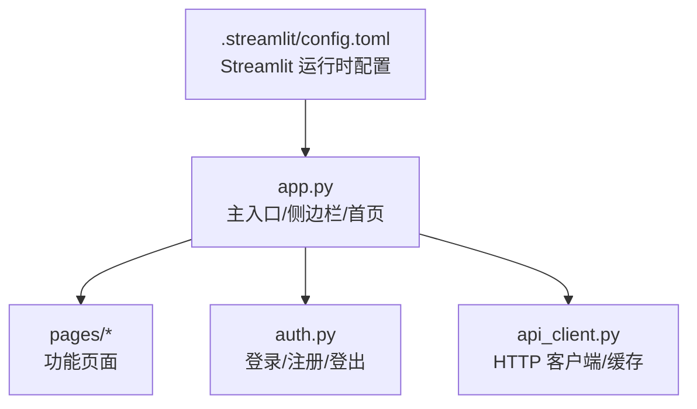
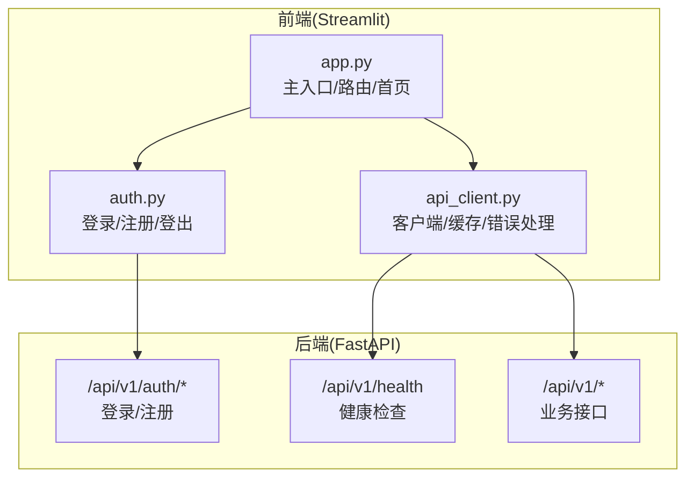
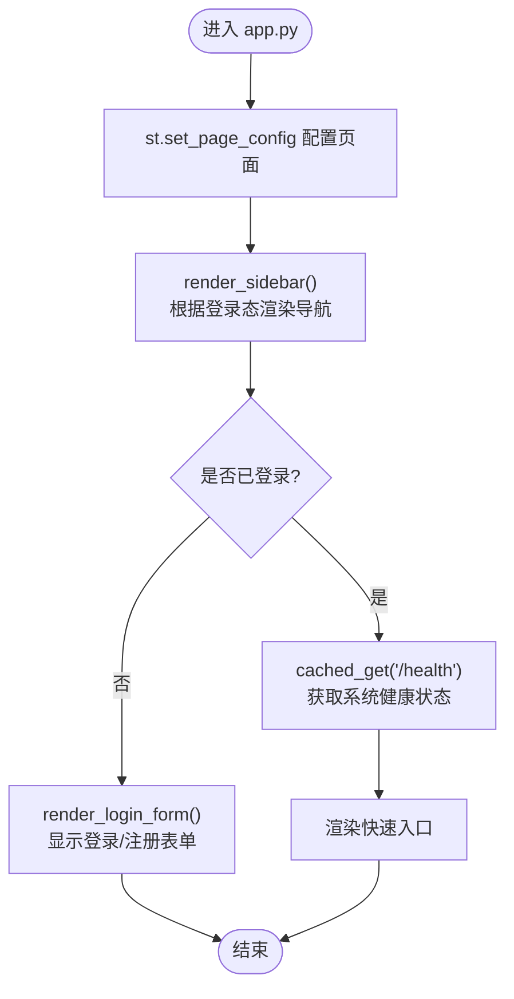
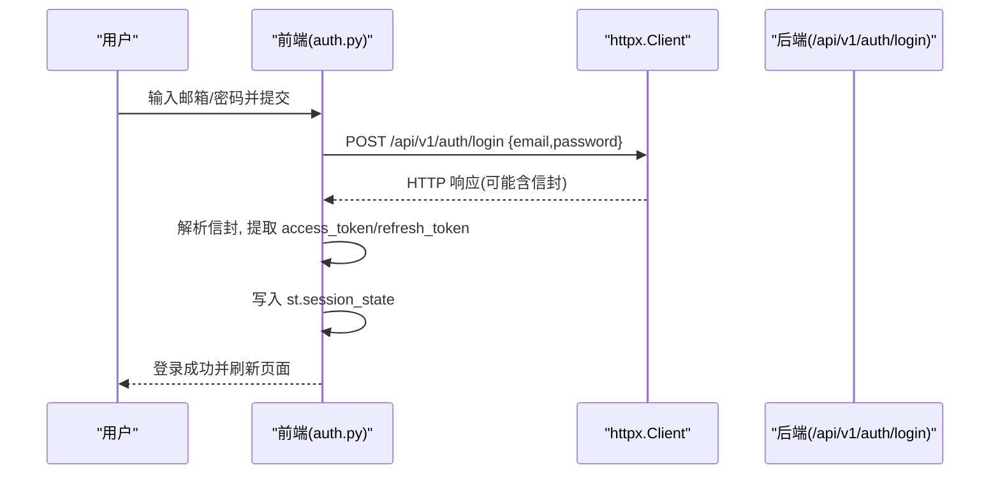
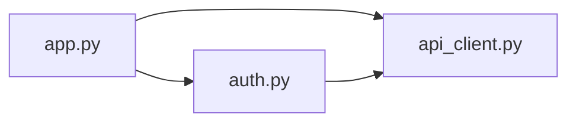

# 应用架构设计

<cite>
**本文引用的文件**   
- [frontend/app.py](file://frontend/app.py)
- [frontend/api_client.py](file://frontend/api_client.py)
- [frontend/auth.py](file://frontend/auth.py)
- [.streamlit/config.toml](file://.streamlit/config.toml)
</cite>

## 目录
1. [简介](#简介)
2. [项目结构](#项目结构)
3. [核心组件](#核心组件)
4. [架构总览](#架构总览)
5. [详细组件分析](#详细组件分析)
6. [依赖关系分析](#依赖关系分析)
7. [性能考虑](#性能考虑)
8. [故障排查指南](#故障排查指南)
9. [结论](#结论)
10. [附录](#附录)

## 简介
本文件面向 AI 药物设计系统的前端 Streamlit 应用，系统性阐述总体架构、页面路由机制、状态管理、API 客户端封装策略、认证流程集成、前后端通信协议、数据缓存与错误处理机制，以及应用初始化配置与环境变量管理。文档同时提供扩展指南与最佳实践建议，帮助读者快速理解并安全扩展前端能力。

## 项目结构
前端采用单入口 + 多页面的 Streamlit 组织方式：
- 主入口 app.py 负责全局配置、侧边栏导航、首页渲染与登录态判断。
- pages 目录下按功能模块划分页面（如项目管理、数据集、靶点发现等），通过侧边栏 page_link 进行路由跳转。
- api_client.py 统一封装后端 REST API 调用，提供连接池复用、请求级缓存、JWT 注入与响应信封解包。
- auth.py 提供登录/注册表单、用户菜单与演示模式提示。
- .streamlit/config.toml 定义主题、服务器端口与浏览器行为等运行期配置。



图表来源
- [frontend/app.py:35-65](file://frontend/app.py#L35-L65)
- [frontend/api_client.py:24-39](file://frontend/api_client.py#L24-L39)
- [.streamlit/config.toml:1-16](file://.streamlit/config.toml#L1-L16)

章节来源
- [frontend/app.py:35-65](file://frontend/app.py#L35-L65)
- [.streamlit/config.toml:1-16](file://.streamlit/config.toml#L1-L16)

## 核心组件
- 主入口与页面路由
  - 使用 st.set_page_config 设置页面标题、图标、布局与侧边栏初始状态。
  - 侧边栏根据登录态动态展示“功能导航”或提示信息；通过 st.sidebar.page_link 实现页面路由。
  - 首页在未登录时显示登录表单与系统介绍；已登录时展示系统健康状态与快速入口。
- API 客户端封装
  - 基于 httpx.Client 构建共享客户端，启用连接池复用与超时限制。
  - 统一错误处理与响应信封解包，自动注入 Authorization 头。
  - 提供带 TTL 的缓存 GET 接口 cached_get，减少重复网络请求。
- 认证流程
  - 登录/注册表单直接调用后端 /auth/login 与 /auth/register。
  - 成功后将 access_token、refresh_token、user_email 写入 st.session_state。
  - 用户菜单支持一键登出，清理会话状态并重跑界面。

章节来源
- [frontend/app.py:35-157](file://frontend/app.py#L35-L157)
- [frontend/api_client.py:42-167](file://frontend/api_client.py#L42-L167)
- [frontend/auth.py:10-137](file://frontend/auth.py#L10-L137)

## 架构总览
前端以 Streamlit 为 UI 框架，通过 api_client 与后端 FastAPI 服务通信；认证由后端鉴权，前端仅持有 JWT token 并在后续请求中携带。



图表来源
- [frontend/app.py:35-157](file://frontend/app.py#L35-L157)
- [frontend/api_client.py:42-167](file://frontend/api_client.py#L42-L167)
- [frontend/auth.py:10-137](file://frontend/auth.py#L10-L137)

## 详细组件分析

### 主入口 app.py 组织结构
- 页面配置与侧边栏
  - 使用 st.set_page_config 完成基础页面配置。
  - render_sidebar 根据 session_state 中的 access_token 决定展示用户菜单与功能导航，未登录则提示先登录。
- 首页逻辑
  - 未登录：左侧渲染登录表单，右侧展示系统简介与技术栈概览，并提供演示模式提示。
  - 已登录：欢迎信息、系统健康状态（带缓存）、快速入口按钮。
- 控制流
  - main 函数依次渲染侧边栏与首页内容。



图表来源
- [frontend/app.py:35-157](file://frontend/app.py#L35-L157)

章节来源
- [frontend/app.py:35-157](file://frontend/app.py#L35-L157)

### 侧边栏导航与页面路由
- 使用 st.sidebar.page_link 指向 pages 下的具体页面文件，形成稳定的页面路由。
- 导航项包含：首页、项目管理、数据集、靶点发现、分子评估、报告查看、假设管理、AI 问答、联邦学习、隐私计算、系统监控。
- 未登录时侧边栏显示提示信息，引导用户先登录。

章节来源
- [frontend/app.py:43-65](file://frontend/app.py#L43-L65)

### 用户认证流程集成
- 登录
  - 表单提交后调用后端 /auth/login，解析返回信封，提取 access_token 与 refresh_token，写入 session_state。
  - 成功登录后触发 st.rerun 刷新界面。
- 注册
  - 表单校验通过后调用 /auth/register，成功后提示切换至登录标签。
- 登出
  - 清除 session_state 中的 token 与用户信息，重跑界面。



图表来源
- [frontend/auth.py:10-66](file://frontend/auth.py#L10-L66)

章节来源
- [frontend/auth.py:10-137](file://frontend/auth.py#L10-L137)

### API 客户端封装策略
- 连接池与超时
  - 使用 @st.cache_resource 创建共享 httpx.Client，配置连接池上限与超时参数，避免频繁建立连接。
- 请求头与鉴权
  - _headers 方法统一添加 Content-Type，若存在 token 则附加 Authorization: Bearer。
- 响应信封解包
  - _unwrap 对非 2xx 响应抛出 RuntimeError，并对 {success,data,meta} 信封进行解包，返回 data 字段。
- 上传支持
  - upload 方法使用独立 Client 发送 multipart/form-data，避免影响共享连接池。
- 缓存 GET
  - cached_get 基于时间桶 TTL 与 st.cache_data 实现可过期缓存，key 包含 token 与 base_url 隔离不同用户与实例。
- 统一错误处理
  - 所有请求经 _unwrap 统一处理，失败时抛出异常供上层捕获。

```mermaid
classDiagram
class ApiClient {
+string base_url
+string token
+get(path,params) dict
+post(path,json_body) dict
+put(path,json_body) dict
+delete(path) dict
+upload(path,file,extra_data) dict
-_headers() dict
-_unwrap(response) dict
}
class HttpCache {
+cached_get(path,params,ttl,key_prefix) dict
+invalidate_cache(prefix) void
}
ApiCache["共享 httpx.Client"] --> ApiClient : "被复用"
HttpCache --> ApiClient : "内部构造"
```

图表来源
- [frontend/api_client.py:24-39](file://frontend/api_client.py#L24-L39)
- [frontend/api_client.py:42-167](file://frontend/api_client.py#L42-L167)
- [frontend/api_client.py:186-251](file://frontend/api_client.py#L186-L251)

章节来源
- [frontend/api_client.py:24-39](file://frontend/api_client.py#L24-L39)
- [frontend/api_client.py:42-167](file://frontend/api_client.py#L42-L167)
- [frontend/api_client.py:186-251](file://frontend/api_client.py#L186-L251)

### 前端与后端通信协议
- 协议与路径
  - 默认基础地址 DEFAULT_BASE_URL 指向后端 /api/v1。
  - 认证相关：/api/v1/auth/login、/api/v1/auth/register。
  - 健康检查：/api/v1/health。
- 请求格式
  - JSON 请求体，Content-Type: application/json。
  - 鉴权：Authorization: Bearer <token>。
- 响应格式
  - 统一信封 {success, data, meta}，失败时 success=false 并包含 error.message。
  - 非 2xx 响应会抛出运行时异常，便于前端统一处理。

章节来源
- [frontend/api_client.py:21-39](file://frontend/api_client.py#L21-L39)
- [frontend/api_client.py:68-94](file://frontend/api_client.py#L68-L94)
- [frontend/auth.py:32-66](file://frontend/auth.py#L32-L66)

### 数据缓存策略
- 连接级缓存
  - 共享 httpx.Client 复用 TCP 连接，降低握手开销。
- 请求级缓存
  - cached_get 使用 st.cache_data 与时间桶 TTL 实现可过期缓存，适合不常变的数据（如健康状态）。
- 缓存失效
  - invalidate_cache 支持清空全部缓存；前缀过滤通过 TTL 自然过期实现。

章节来源
- [frontend/api_client.py:24-39](file://frontend/api_client.py#L24-L39)
- [frontend/api_client.py:186-251](file://frontend/api_client.py#L186-L251)

### 错误处理机制
- 网络层
  - httpx 超时与连接池限制保障稳定性。
- 应用层
  - _unwrap 统一解析错误消息，抛出 RuntimeError，上层 try/except 捕获并友好提示。
- 认证层
  - 登录/注册失败时解析后端错误详情并展示给用户。

章节来源
- [frontend/api_client.py:68-94](file://frontend/api_client.py#L68-L94)
- [frontend/auth.py:32-66](file://frontend/auth.py#L32-L66)

### 应用初始化配置与环境变量管理
- Streamlit 配置
  - .streamlit/config.toml 定义主题色、背景、字体、服务器端口、CORS 与 XSRF 保护开关、浏览器统计收集等。
- 运行时参数
  - 登录表单允许用户输入 API 地址，默认值来自 DEFAULT_BASE_URL。
  - 该地址会被持久化到 session_state 的 api_base_url，用于后续缓存键与请求基址。
- 环境变量
  - 当前前端代码未直接读取环境变量，可通过修改 DEFAULT_BASE_URL 或在部署时覆盖 Streamlit 配置来适配环境。

章节来源
- [.streamlit/config.toml:1-16](file://.streamlit/config.toml#L1-L16)
- [frontend/api_client.py:21-39](file://frontend/api_client.py#L21-L39)
- [frontend/auth.py:20-26](file://frontend/auth.py#L20-L26)

## 依赖关系分析
- 模块耦合
  - app.py 依赖 auth.py 与 api_client.py，承担路由与页面编排职责。
  - api_client.py 作为基础设施层，被认证与业务页面共同复用。
- 外部依赖
  - httpx 用于 HTTP 通信；Streamlit 提供 UI 与缓存能力。
- 潜在循环依赖
  - 当前结构无循环导入风险。



图表来源
- [frontend/app.py:35-65](file://frontend/app.py#L35-L65)
- [frontend/auth.py:10-26](file://frontend/auth.py#L10-L26)
- [frontend/api_client.py:42-67](file://frontend/api_client.py#L42-L67)

章节来源
- [frontend/app.py:35-65](file://frontend/app.py#L35-L65)
- [frontend/auth.py:10-26](file://frontend/auth.py#L10-L26)
- [frontend/api_client.py:42-67](file://frontend/api_client.py#L42-L67)

## 性能考虑
- 连接池复用
  - 共享 httpx.Client 减少连接建立与销毁开销，提升并发性能。
- 请求级缓存
  - 对稳定数据（如健康状态）使用 TTL 缓存，显著降低后端压力与首屏延迟。
- 上传优化
  - 上传使用独立 Client，避免阻塞共享连接池，提高大文件上传稳定性。
- 超时与限流
  - 合理设置 connect/read 超时与连接池上限，防止资源耗尽。

[本节为通用性能指导，无需特定文件引用]

## 故障排查指南
- 无法连接后端
  - 检查 .streamlit/config.toml 的 server.port 与浏览器访问地址是否一致。
  - 确认登录表单中的 API 地址是否正确，必要时在浏览器控制台查看网络请求。
- 登录失败
  - 核对后端 /api/v1/auth/login 返回的错误消息，常见原因为邮箱/密码错误或后端未启动。
- 缓存导致数据陈旧
  - 使用 invalidate_cache 清空缓存，或增大 cached_get 的 ttl 调整策略。
- 权限问题
  - 确认 access_token 是否存在于 session_state，且未被登出操作清理。

章节来源
- [.streamlit/config.toml:8-12](file://.streamlit/config.toml#L8-L12)
- [frontend/auth.py:32-66](file://frontend/auth.py#L32-L66)
- [frontend/api_client.py:186-251](file://frontend/api_client.py#L186-L251)

## 结论
本前端架构以 Streamlit 为核心，结合统一的 API 客户端与认证组件，实现了清晰的路由、稳健的状态管理与高效的缓存策略。通过连接池复用与请求级缓存，系统在用户体验与性能之间取得良好平衡。未来可按需扩展更多页面与服务集成，遵循现有封装与错误处理规范，确保一致性与可维护性。

[本节为总结性内容，无需特定文件引用]

## 附录

### 架构扩展指南
- 新增页面
  - 在 pages 下创建新文件，命名遵循序号+标题约定，并通过侧边栏 page_link 添加导航。
- 新增 API 调用
  - 优先使用 ApiClient 的 get/post/put/delete/upload 方法，保持统一错误处理与鉴权注入。
- 新增缓存
  - 对读多写少的接口使用 cached_get，合理设置 ttl 与 key_prefix，避免跨模块污染。
- 新增认证逻辑
  - 在 auth.py 中扩展表单或流程，确保 token 写入 session_state 并触发 rerun。

### 最佳实践建议
- 统一错误处理
  - 所有 API 调用包裹 try/except，向用户展示可读错误信息。
- 明确缓存边界
  - 仅在数据稳定时使用缓存，变更场景及时失效或缩短 TTL。
- 分离关注点
  - 页面只负责渲染与交互，业务逻辑下沉至 api_client 或服务层。
- 配置与环境
  - 通过 config.toml 与默认常量管理环境差异，避免硬编码。

[本节为通用指导，无需特定文件引用]