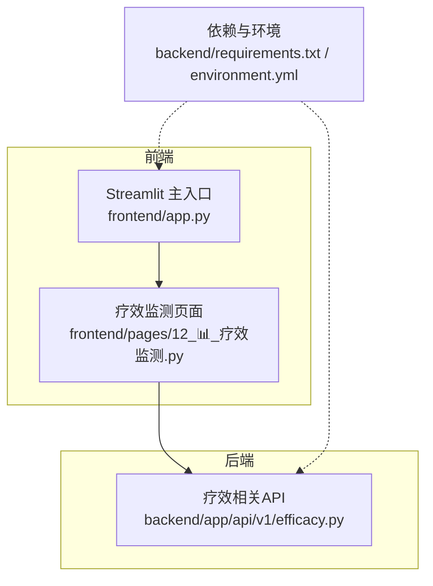
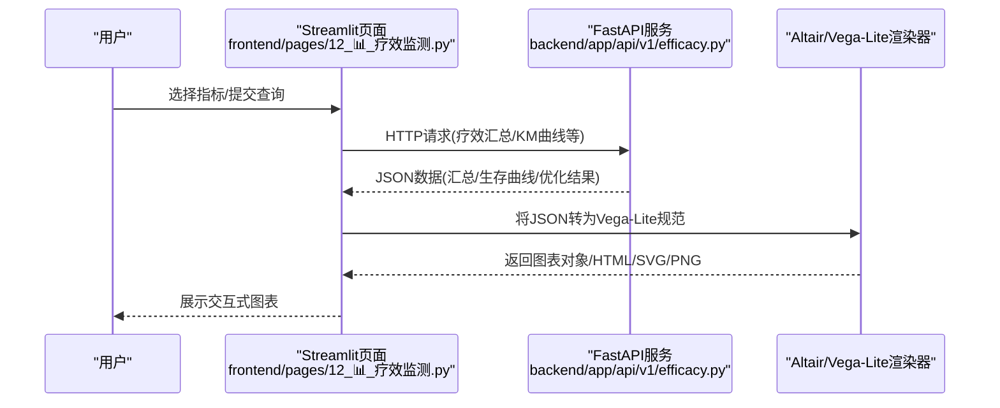
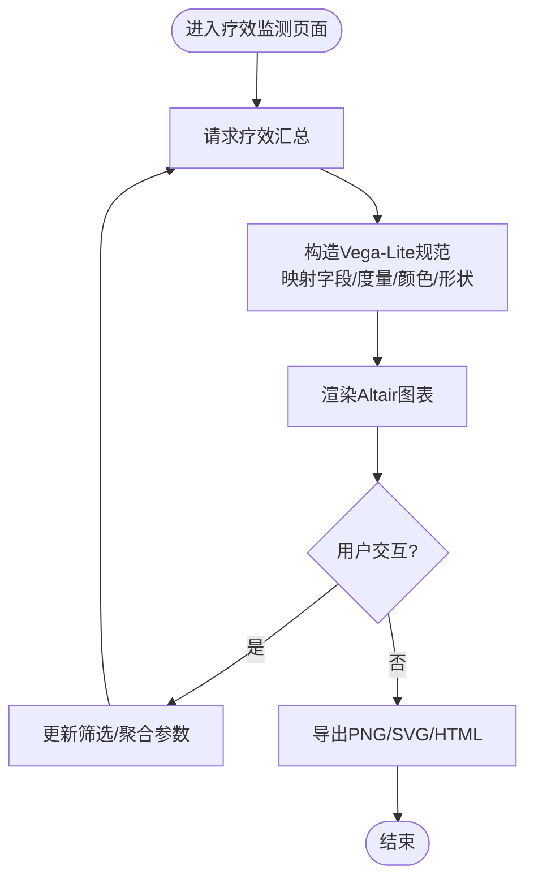
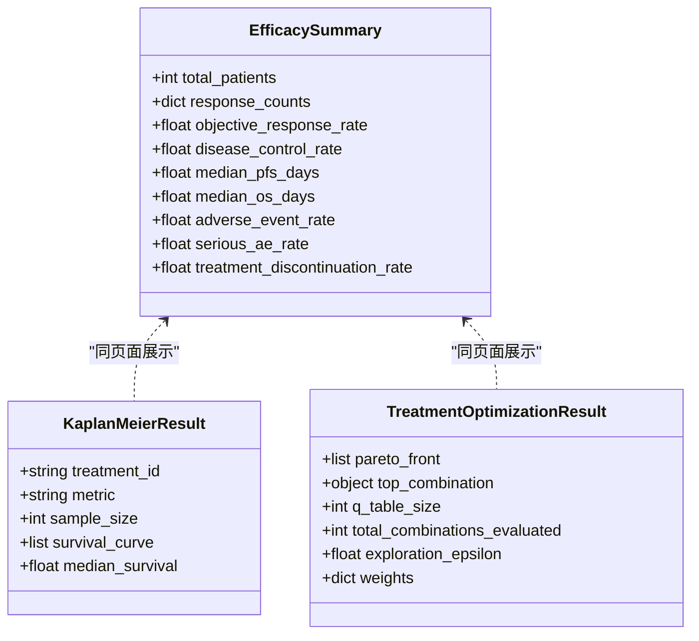
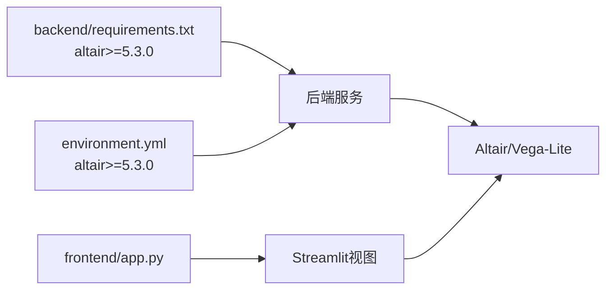

# Altair声明式可视化

<cite>
**本文引用的文件**   
- [backend/requirements.txt](file://backend/requirements.txt)
- [environment.yml](file://environment.yml)
- [frontend/app.py](file://frontend/app.py)
- [frontend/pages/12_📊_疗效监测.py](file://frontend/pages/12_📊_疗效监测.py)
- [backend/app/api/v1/efficacy.py](file://backend/app/api/v1/efficacy.py)
</cite>

## 目录
1. [引言](#引言)
2. [项目结构](#项目结构)
3. [核心组件](#核心组件)
4. [架构总览](#架构总览)
5. [详细组件分析](#详细组件分析)
6. [依赖分析](#依赖分析)
7. [性能考虑](#性能考虑)
8. [故障排查指南](#故障排查指南)
9. [结论](#结论)
10. [附录](#附录)

## 引言
本指南面向AI药物设计系统中的Altair声明式可视化能力，聚焦于基于Vega-Lite语法的图表构建、数据绑定与图层叠加、条件格式设置、响应式适配、导出策略以及与Streamlit的集成模式。文档同时结合现有前端页面与后端API，给出可落地的实现路径与最佳实践，帮助读者快速在项目中引入并扩展Altair可视化能力。

## 项目结构
本项目采用前后端分离：
- 后端：FastAPI提供数据与分析接口（如疗效汇总、KM曲线等）
- 前端：Streamlit页面负责交互与渲染，当前已使用内置图表组件展示基础统计图
- 可视化栈：后端依赖清单包含altair>=5.3.0，环境配置亦声明该依赖；前端通过HTTP调用后端获取结构化数据，再在前端进行渲染或导出

**图示来源** 
- [frontend/app.py:1-157](file://frontend/app.py#L1-L157)
- [frontend/pages/12_📊_疗效监测.py:1-583](file://frontend/pages/12_📊_疗效监测.py#L1-L583)
- [backend/app/api/v1/efficacy.py:1-347](file://backend/app/api/v1/efficacy.py#L1-L347)
- [backend/requirements.txt:63-71](file://backend/requirements.txt#L63-L71)
- [environment.yml:45-46](file://environment.yml#L45-L46)

**章节来源**
- [frontend/app.py:1-157](file://frontend/app.py#L1-L157)
- [frontend/pages/12_📊_疗效监测.py:1-583](file://frontend/pages/12_📊_疗效监测.py#L1-L583)
- [backend/app/api/v1/efficacy.py:1-347](file://backend/app/api/v1/efficacy.py#L1-L347)
- [backend/requirements.txt:63-71](file://backend/requirements.txt#L63-L71)
- [environment.yml:45-46](file://environment.yml#L45-L46)

## 核心组件
- Streamlit页面层：负责用户输入、表单提交、结果展示与交互控制。当前页面已使用内置图表组件完成部分统计展示，可作为后续替换为Altair的基础。
- FastAPI API层：提供疗效汇总、Kaplan-Meier生存估计、治疗方案优化等数据接口，返回结构化JSON供前端消费。
- 可视化依赖：后端依赖清单与环境配置中已包含altair，便于在服务端生成Vega-Lite规范或进行离线渲染。

**章节来源**
- [frontend/pages/12_📊_疗效监测.py:1-583](file://frontend/pages/12_📊_疗效监测.py#L1-L583)
- [backend/app/api/v1/efficacy.py:1-347](file://backend/app/api/v1/efficacy.py#L1-L347)
- [backend/requirements.txt:63-71](file://backend/requirements.txt#L63-L71)
- [environment.yml:45-46](file://environment.yml#L45-L46)

## 架构总览
下图展示了从前端到后端的请求-响应流程，以及未来引入Altair后的数据流与渲染位置。

**图示来源** 
- [frontend/pages/12_📊_疗效监测.py:210-376](file://frontend/pages/12_📊_疗效监测.py#L210-L376)
- [backend/app/api/v1/efficacy.py:141-223](file://backend/app/api/v1/efficacy.py#L141-L223)

## 详细组件分析

### 组件A：疗效监测页面的可视化现状与扩展点
- 现状：页面使用Streamlit内置图表组件展示柱状图、折线图与散点图，用于响应分布、生存曲线与Pareto前沿可视化。
- 扩展点：可将上述数据源替换为Altair生成的Vega-Lite规范，以启用更丰富的交互（筛选、缩放、联动）、主题与导出能力。

**图示来源** 
- [frontend/pages/12_📊_疗效监测.py:210-376](file://frontend/pages/12_📊_疗效监测.py#L210-L376)

**章节来源**
- [frontend/pages/12_📊_疗效监测.py:210-376](file://frontend/pages/12_📊_疗效监测.py#L210-L376)

### 组件B：后端API的数据契约与可视化对接
- 关键接口：
  - 疗效汇总：返回患者数、ORR、DCR、中位PFS/OS、AE率等
  - Kaplan-Meier：返回生存曲线时间序列与中位生存
  - 治疗方案优化：返回Pareto前沿、Top组合、Q表大小等
- 对接建议：
  - 将上述JSON直接映射为Vega-Lite的data.values或URL数据源
  - 对分类字段使用color/shape编码，数值字段使用x/y/size/opacity等
  - 对阈值/告警信息使用条件格式（如严重AE率阈值）

**图示来源** 
- [backend/app/api/v1/efficacy.py:141-223](file://backend/app/api/v1/efficacy.py#L141-L223)
- [backend/app/api/v1/efficacy.py:229-309](file://backend/app/api/v1/efficacy.py#L229-L309)

**章节来源**
- [backend/app/api/v1/efficacy.py:141-223](file://backend/app/api/v1/efficacy.py#L141-L223)
- [backend/app/api/v1/efficacy.py:229-309](file://backend/app/api/v1/efficacy.py#L229-L309)

### 统计分析图表实现要点（箱线图、小提琴图、热图、火山图）
- 数据准备
  - 箱线图/小提琴图：需要分组变量与连续变量，必要时计算分位数或核密度估计
  - 热图：二维矩阵（行×列），值域需归一化或分箱
  - 火山图：横轴为效应量（如log2FC），纵轴为显著性（-log10(p)），可用颜色表示方向或显著性
- Vega-Lite映射
  - 编码通道：x/y/row/column/color/shape/size/opacity
  - 变换：aggregate/filter/bin/stack/normalize
  - 条件格式：根据阈值或类别动态设置颜色/标记样式
- 图层叠加
  - 多图层叠加：基础分布+参考线+异常点标注
  - 交互：brushing/linking、tooltip、selection
- 响应式设计
  - 使用view.width/view.height自适应容器
  - 在Streamlit中使用st.altair_chart或嵌入HTML/SVG
- 导出
  - PNG/SVG：适合报告与论文
  - HTML：保留交互，适合在线分享
  - Vega-Lite JSON：便于版本管理与复用

[本节为概念性说明，不直接分析具体文件]

## 依赖分析
- 后端依赖中包含altair>=5.3.0，表明服务端具备使用Altair的能力，可用于生成Vega-Lite规范或离线渲染
- 环境配置文件也声明了altair，确保conda环境一致性
- 前端依赖未显式声明altair，但可通过Streamlit的altair_chart组件或HTML嵌入方式展示

**图示来源** 
- [backend/requirements.txt:63-71](file://backend/requirements.txt#L63-L71)
- [environment.yml:45-46](file://environment.yml#L45-L46)
- [frontend/app.py:1-157](file://frontend/app.py#L1-L157)

**章节来源**
- [backend/requirements.txt:63-71](file://backend/requirements.txt#L63-L71)
- [environment.yml:45-46](file://environment.yml#L45-L46)
- [frontend/app.py:1-157](file://frontend/app.py#L1-L157)

## 性能考虑
- 大数据集
  - 优先在后端进行聚合与采样，减少前端传输体积
  - 使用bin/aggregate降低点数，必要时分页加载
- 渲染性能
  - 避免过多图层与复杂变换；合并相似图层
  - 合理设置mark属性（如点透明度）提升可读性与渲染速度
- 缓存策略
  - 对静态或低频变化数据做短期缓存（如全局汇总）
  - 利用浏览器缓存与CDN分发静态资源（SVG/HTML）

[本节为通用指导，不直接分析具体文件]

## 故障排查指南
- 常见错误
  - 字段缺失或类型不匹配：检查后端返回JSON键名与Vega-Lite映射是否一致
  - 空数据集：在页面层增加空数据提示与降级展示
  - 权限/认证失败：确认登录态与token传递正确
- 定位方法
  - 查看网络请求响应体，确认数据结构
  - 打印Vega-Lite规范，验证encoding与transform
  - 逐步简化图层，定位问题所在

**章节来源**
- [frontend/pages/12_📊_疗效监测.py:210-376](file://frontend/pages/12_📊_疗效监测.py#L210-L376)
- [backend/app/api/v1/efficacy.py:141-223](file://backend/app/api/v1/efficacy.py#L141-L223)

## 结论
通过在现有Streamlit页面与FastAPI接口基础上引入Altair/Vega-Lite，可实现更强大的声明式可视化能力。建议优先将疗效汇总与KM曲线替换为Altair图表，逐步扩展到箱线图、小提琴图、热图与火山图等生物信息学常用图表。配合条件格式、图层叠加与导出功能，可显著提升分析与报告质量。

[本节为总结性内容，不直接分析具体文件]

## 附录
- 集成模式建议
  - 前端：使用Streamlit的altair_chart或直接嵌入HTML/SVG
  - 后端：按需生成Vega-Lite JSON，作为统一数据契约
- 最佳实践
  - 明确数据契约与字段命名规范
  - 统一主题与配色方案，保证跨图表一致性
  - 对敏感指标设置阈值告警与条件格式
  - 建立图表模板库，提高复用效率

[本节为补充说明，不直接分析具体文件]