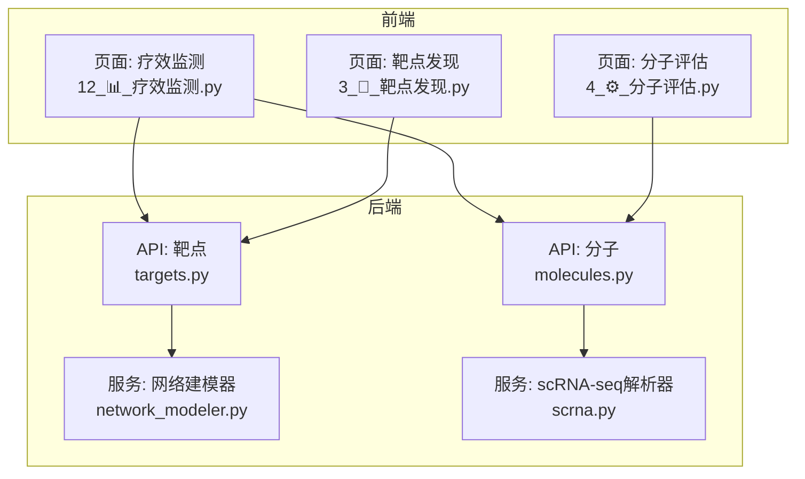
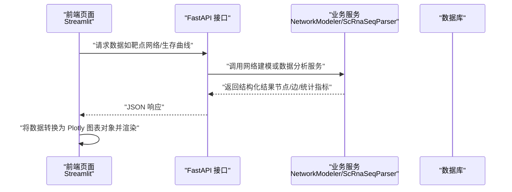
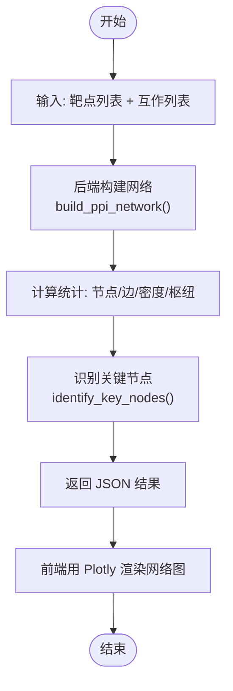
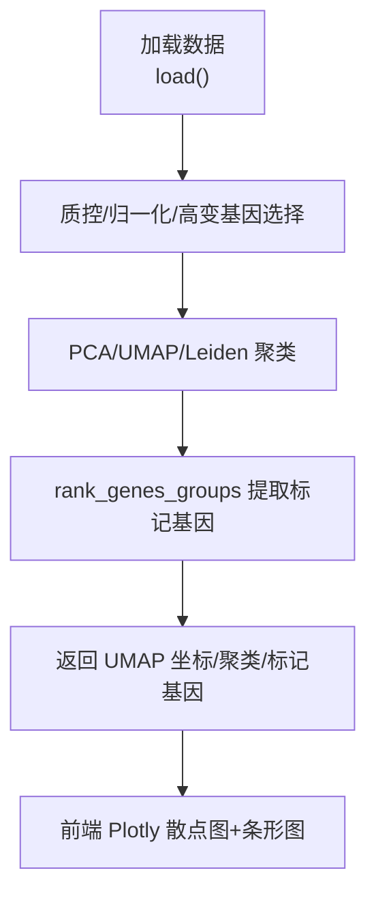
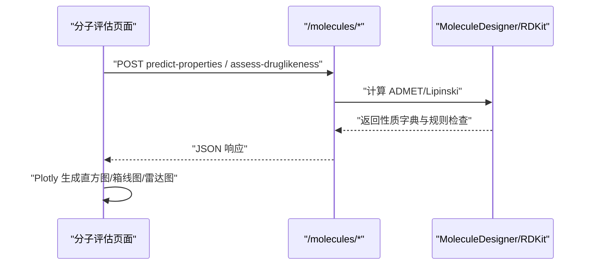
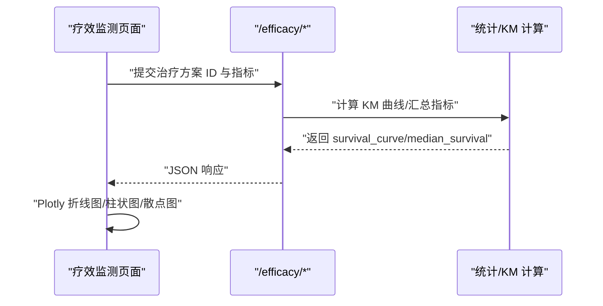
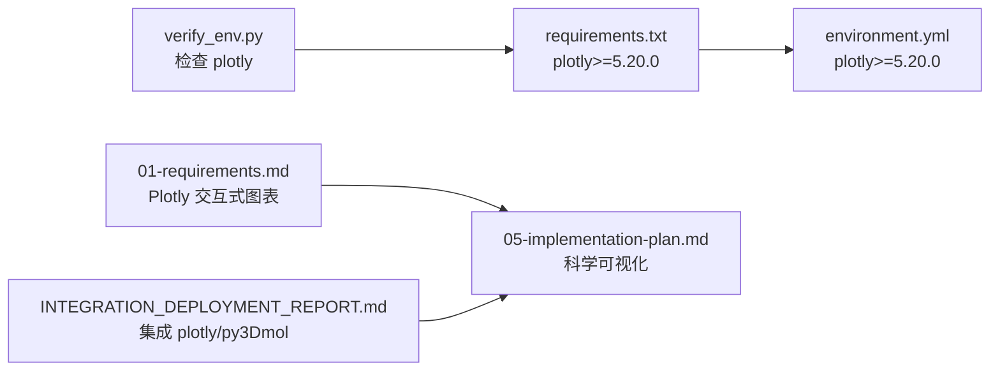

# Plotly交互式图表

<cite>
**本文引用的文件**   
- [README.md](file://precision-drug-design\README.md)
- [requirements.txt](file://precision-drug-design\backend\requirements.txt)
- [requirements-stage1.txt](file://precision-drug-design\backend\requirements-stage1.txt)
- [environment.yml](file://precision-drug-design\environment.yml)
- [verify_env.py](file://precision-drug-design\scripts\verify_env.py)
- [INTEGRATION_DEPLOYMENT_REPORT.md](file://precision-drug-design\docs\INTEGRATION_DEPLOYMENT_REPORT.md)
- [01-requirements.md](file://precision-drug-design\docs\design\01-requirements.md)
- [05-implementation-plan.md](file://precision-drug-design\docs\design\05-implementation-plan.md)
- [12_📊_疗效监测.py](file://precision-drug-design\frontend\pages\12_📊_疗效监测.py)
- [3_🎯_靶点发现.py](file://precision-drug-design\frontend\pages\3_🎯_靶点发现.py)
- [4_⚙️_分子评估.py](file://precision-drug-design\frontend\pages\4_⚙️_分子评估.py)
- [targets.py](file://precision-drug-design\backend\app\api\v1\targets.py)
- [molecules.py](file://precision-drug-design\backend\app\api\v1|molecules.py)
- [network_modeler.py](file://precision-drug-design\backend\app\services\analyzer\network_modeler.py)
- [scrna.py](file://precision-drug-design\backend\app\services\parser\scrna.py)
</cite>

## 目录
1. [引言](#引言)
2. [项目结构](#项目结构)
3. [核心组件](#核心组件)
4. [架构总览](#架构总览)
5. [详细组件分析](#详细组件分析)
6. [依赖分析](#依赖分析)
7. [性能考虑](#性能考虑)
8. [故障排查指南](#故障排查指南)
9. [结论](#结论)
10. [附录](#附录)

## 引言
本指南面向在“精准药物设计系统”中集成与使用 Plotly 进行交互式可视化的开发者。文档覆盖：
- Plotly 库的集成与配置（后端/前端）
- 基础图表类型实现方法（散点图、折线图、柱状图）
- 生物医学可视化场景（差异表达分析、靶点网络关系图、分子性质分布等）
- 交互能力（缩放、筛选、悬停提示）、主题定制、动画效果
- 大数据量渲染的性能优化与最佳实践
- 可复用的图表组件模板与示例路径

## 项目结构
本项目采用前后端分离架构，前端基于 Streamlit 页面组织功能模块，后端基于 FastAPI 提供 API。Plotly 作为科学数据可视化库已在环境与依赖中声明，并在部分需求与设计文档中被明确引用。

图示来源
- [12_📊_疗效监测.py:1-583](file://precision-drug-design\frontend\pages\12_📊_疗效监测.py#L1-L583)
- [3_🎯_靶点发现.py:1-157](file://precision-drug-design\frontend\pages\3_🎯_靶点发现.py#L1-L157)
- [4_⚙️_分子评估.py:1-159](file://precision-drug-design\frontend\pages\4_⚙️_分子评估.py#L1-L159)
- [targets.py:1-344](file://precision-drug-design\backend\app\api\v1\targets.py#L1-L344)
- [molecules.py:1-403](file://precision-drug-design\backend\app\api\v1|molecules.py#L1-L403)
- [network_modeler.py:1-370](file://precision-drug-design\backend\app\services\analyzer\network_modeler.py#L1-L370)
- [scrna.py:1-160](file://precision-drug-design\backend\app\services\parser\scrna.py#L1-L160)

章节来源
- [README.md:90-100](file://precision-drug-design\README.md#L90-L100)
- [01-requirements.md:80-90](file://precision-drug-design\docs\design\01-requirements.md#L80-L90)
- [05-implementation-plan.md:150-170](file://precision-drug-design\docs\design\05-implementation-plan.md#L150-L170)

## 核心组件
- 依赖与环境
  - 后端依赖已包含 plotly>=5.20.0，环境配置文件亦声明该依赖；验证脚本中包含对 plotly 的检查项。
- 前端可视化现状
  - 当前页面主要使用 Streamlit 内置图表（如 bar_chart、line_chart、scatter_chart），尚未直接调用 Plotly。
- 后端数据处理与服务
  - 靶点网络建模器提供 PPI 网络构建、关键节点识别、协同效应预测等结果，适合用于绘制网络关系图。
  - scRNA-seq 解析器输出 UMAP 坐标、聚类标签与标记基因，可用于差异表达分析与降维可视化。

章节来源
- [requirements.txt:60-70](file://precision-drug-design\backend\requirements.txt#L60-L70)
- [requirements-stage1.txt:25-35](file://precision-drug-design\backend\requirements-stage1.txt#L25-L35)
- [environment.yml:70-80](file://precision-drug-design\environment.yml#L70-L80)
- [verify_env.py:50-60](file://precision-drug-design\scripts\verify_env.py#L50-L60)
- [12_📊_疗效监测.py:280-375](file://precision-drug-design\frontend\pages\12_📊_疗效监测.py#L280-L375)
- [network_modeler.py:66-137](file://precision-drug-design\backend\app\services\analyzer\network_modeler.py#L66-L137)
- [scrna.py:75-134](file://precision-drug-design\backend\app\services\parser\scrna.py#L75-L134)

## 架构总览
下图展示从前端页面到后端 API 与服务的调用链，以及未来引入 Plotly 可视化时的数据流向。

图示来源
- [targets.py:274-312](file://precision-drug-design\backend\app\api\v1\targets.py#L274-L312)
- [network_modeler.py:66-137](file://precision-drug-design\backend\app\services\analyzer\network_modeler.py#L66-L137)
- [12_📊_疗效监测.py:313-375](file://precision-drug-design\frontend\pages\12_📊_疗效监测.py#L313-L375)

## 详细组件分析

### 组件A：靶点网络关系图（PPI）
- 数据来源
  - 后端通过 /targets/network 触发网络建模，返回节点数、边数、密度、枢纽节点、平均度、连通分量等统计信息，并可返回关键节点与模块划分结果。
- 可视化建议
  - 使用 Plotly Graph Objects 构建有向/无向图，节点按中心性评分着色，边权重映射为线宽。
  - 交互：支持缩放、拖拽、悬停显示节点名称与得分、点击过滤子图。
- 关键流程
  - 前端提交目标列表与互作列表 → 后端 NetworkModeler.build_ppi_network → 返回网络统计与关键节点 → 前端生成 Plotly 图形。

图示来源
- [targets.py:274-312](file://precision-drug-design\backend\app\api\v1\targets.py#L274-L312)
- [network_modeler.py:66-137](file://precision-drug-design\backend\app\services\analyzer\network_modeler.py#L66-L137)
- [network_modeler.py:139-168](file://precision-drug-design\backend\app\services\analyzer\network_modeler.py#L139-L168)

章节来源
- [targets.py:274-312](file://precision-drug-design\backend\app\api\v1\targets.py#L274-L312)
- [network_modeler.py:66-137](file://precision-drug-design\backend\app\services\analyzer\network_modeler.py#L66-L137)

### 组件B：差异表达分析图表（UMAP/标记基因）
- 数据来源
  - ScRnaSeqParser.process 输出 UMAP 坐标、聚类标签与标记基因列表，可作为散点图与条形图的输入。
- 可视化建议
  - UMAP 散点图：以 x/y 坐标为轴，颜色映射聚类标签，大小映射细胞质量指标。
  - 标记基因条形图：按聚类分组展示 top N 标记基因及其得分。
- 关键流程
  - 上传 scRNA-seq 数据 → 预处理与降维 → 提取标记基因 → 前端生成 Plotly 图表。

图示来源
- [scrna.py:75-134](file://precision-drug-design\backend\app\services\parser\scrna.py#L75-L134)

章节来源
- [scrna.py:75-134](file://precision-drug-design\backend\app\services\parser\scrna.py#L75-L134)

### 组件C：分子性质分布图（ADMET/类药性）
- 数据来源
  - 分子评估页面调用后端 /molecules/predict-properties 与 /molecules/assess-druglikeness，返回 ADMET 指标与 Lipinski 规则检查结果。
- 可视化建议
  - 分子性质分布：使用直方图/箱线图展示 LogP、分子量、TPSA 等分布。
  - 类药性雷达图：多维度指标对比（MW、LogP、HBD、HBA、RotBonds、TPSA）。
- 关键流程
  - 输入 SMILES → 后端计算性质 → 返回结构化结果 → 前端 Plotly 生成分布图与雷达图。

图示来源
- [molecules.py:95-106](file://precision-drug-design\backend\app\api\v1|molecules.py#L95-L106)
- [molecules.py:219-298](file://precision-drug-design\backend\app\api\v1|molecules.py#L219-L298)
- [4_⚙️_分子评估.py:31-74](file://precision-drug-design\frontend\pages\4_⚙️_分子评估.py#L31-L74)

章节来源
- [molecules.py:95-106](file://precision-drug-design\backend\app\api\v1|molecules.py#L95-L106)
- [molecules.py:219-298](file://precision-drug-design\backend\app\api\v1|molecules.py#L219-L298)
- [4_⚙️_分子评估.py:31-74](file://precision-drug-design\frontend\pages\4_⚙️_分子评估.py#L31-L74)

### 组件D：生存曲线与疗效汇总（KM 曲线/柱状图/折线图）
- 数据来源
  - 疗效监测页面通过表单收集患者结局与不良事件，后端返回汇总指标与 KM 曲线数据。
- 可视化建议
  - KM 曲线：时间 vs 生存概率折线图，支持置信区间带。
  - 响应分布：CR/PR/SD/PD 计数柱状图。
  - 方案优化 Pareto 前沿：散点图（有效性 vs 安全性），气泡大小映射 Q 值。
- 关键流程
  - 用户输入参数 → 后端计算 KM/汇总 → 返回数据 → 前端 Plotly 渲染。

图示来源
- [12_📊_疗效监测.py:313-375](file://precision-drug-design\frontend\pages\12_📊_疗效监测.py#L313-L375)
- [12_📊_疗效监测.py:213-308](file://precision-drug-design\frontend\pages\12_📊_疗效监测.py#L213-L308)
- [12_📊_疗效监测.py:479-532](file://precision-drug-design\frontend\pages\12_📊_疗效监测.py#L479-L532)

章节来源
- [12_📊_疗效监测.py:313-375](file://precision-drug-design\frontend\pages\12_📊_疗效监测.py#L313-L375)
- [12_📊_疗效监测.py:213-308](file://precision-drug-design\frontend\pages\12_📊_疗效监测.py#L213-L308)
- [12_📊_疗效监测.py:479-532](file://precision-drug-design\frontend\pages\12_📊_疗效监测.py#L479-L532)

## 依赖分析
- 依赖声明
  - 后端 requirements 与 environment.yml 均包含 plotly>=5.20.0。
  - 验证脚本 verify_env.py 包含对 plotly 的检查项。
- 需求与设计
  - 需求文档指出“UMAP/聚类可视化”使用 Plotly 交互式图表。
  - 实施计划强调“科学可视化：Plotly/py3Dmol/UMAP”。
  - 部署报告提到“前端缺 UMAP/3D 分子可视化”，建议集成 plotly/py3Dmol。

图示来源
- [requirements.txt:60-70](file://precision-drug-design\backend\requirements.txt#L60-L70)
- [environment.yml:70-80](file://precision-drug-design\environment.yml#L70-L80)
- [verify_env.py:50-60](file://precision-drug-design\scripts\verify_env.py#L50-L60)
- [01-requirements.md:80-90](file://precision-drug-design\docs\design\01-requirements.md#L80-L90)
- [05-implementation-plan.md:150-170](file://precision-drug-design\docs\design\05-implementation-plan.md#L150-L170)
- [INTEGRATION_DEPLOYMENT_REPORT.md:330-345](file://precision-drug-design\docs\INTEGRATION_DEPLOYMENT_REPORT.md#L330-L345)

章节来源
- [requirements.txt:60-70](file://precision-drug-design\backend\requirements.txt#L60-L70)
- [environment.yml:70-80](file://precision-drug-design\environment.yml#L70-L80)
- [verify_env.py:50-60](file://precision-drug-design\scripts\verify_env.py#L50-L60)
- [01-requirements.md:80-90](file://precision-drug-design\docs\design\01-requirements.md#L80-L90)
- [05-implementation-plan.md:150-170](file://precision-drug-design\docs\design\05-implementation-plan.md#L150-L170)
- [INTEGRATION_DEPLOYMENT_REPORT.md:330-345](file://precision-drug-design\docs\INTEGRATION_DEPLOYMENT_REPORT.md#L330-L345)

## 性能考虑
- 大数据量渲染
  - 对 UMAP/散点图数据点进行采样或分块渲染，避免一次性传输过多点。
  - 使用 Plotly 的 downsample 与 stream 模式提升交互流畅度。
- 网络图优化
  - 对大型 PPI 图进行社区检测与层级聚合，仅展示关键节点与粗粒度边。
  - 启用 WebGL 加速（Plotly 默认开启），必要时限制边数量与样式复杂度。
- 缓存与增量更新
  - 对 KM 曲线与汇总指标做短期缓存，减少重复计算。
  - 使用流式更新或分页加载，降低首屏渲染压力。
- 主题与样式
  - 统一主题（暗色/亮色）与配色方案，减少重绘开销。
  - 预定义布局模板，复用样式配置。

[本节为通用指导，不直接分析具体文件]

## 故障排查指南
- 依赖缺失
  - 若 plotly 未安装，验证脚本会失败；请确保后端与环境的依赖一致。
- RDKit 不可用
  - 分子性质预测与类药性评估依赖 RDKit；缺失时将降级返回错误信息。
- PyG 不可用
  - 网络建模器在 PyG 缺失时自动降级为中心性启发式，不影响基本功能。
- 外部 API 不可用
  - DiffDock NIM API 不可用时，对接任务返回占位 task_id，需后续查询结果。

章节来源
- [verify_env.py:50-60](file://precision-drug-design\scripts\verify_env.py#L50-L60)
- [molecules.py:219-298](file://precision-drug-design\backend\app\api\v1|molecules.py#L219-L298)
- [molecules.py:109-143](file://precision-drug-design\backend\app\api\v1|molecules.py#L109-L143)
- [network_modeler.py:39-64](file://precision-drug-design\backend\app\services\analyzer\network_modeler.py#L39-L64)

## 结论
本项目已具备 Plotly 的依赖与需求背景，当前前端主要使用 Streamlit 内置图表。建议在以下场景优先引入 Plotly：
- 靶点网络关系图（PPI）
- scRNA-seq 差异表达与 UMAP 可视化
- 分子性质分布与雷达图
- 生存曲线与疗效汇总的高级交互

通过模块化封装与性能优化策略，可在保证用户体验的同时支撑大规模生物医学数据的可视化需求。

[本节为总结，不直接分析具体文件]

## 附录

### 集成与配置清单
- 后端依赖
  - 确认 requirements.txt 与 environment.yml 包含 plotly>=5.20.0。
- 环境验证
  - 运行 verify_env.py 检查 plotly 是否可用。
- 前端集成
  - 在 Streamlit 页面中引入 plotly.graph_objects 与 plotly.express，替换或增强现有 st.* 图表。
- 参考文档
  - 需求文档与实施计划明确 Plotly 的使用场景与目标。

章节来源
- [requirements.txt:60-70](file://precision-drug-design\backend\requirements.txt#L60-L70)
- [environment.yml:70-80](file://precision-drug-design\environment.yml#L70-L80)
- [verify_env.py:50-60](file://precision-drug-design\scripts\verify_env.py#L50-L60)
- [01-requirements.md:80-90](file://precision-drug-design\docs\design\01-requirements.md#L80-L90)
- [05-implementation-plan.md:150-170](file://precision-drug-design\docs\design\05-implementation-plan.md#L150-L170)

### 可复用图表组件模板（路径指引）
- 散点图模板
  - 适用：UMAP 散点、Pareto 前沿
  - 参考页面：[12_📊_疗效监测.py:513-532](file://precision-drug-design\frontend\pages\12_📊_疗效监测.py#L513-L532)
- 折线图模板
  - 适用：KM 生存曲线
  - 参考页面：[12_📊_疗效监测.py:367-368](file://precision-drug-design\frontend\pages\12_📊_疗效监测.py#L367-L368)
- 柱状图模板
  - 适用：响应分布（CR/PR/SD/PD）
  - 参考页面：[12_📊_疗效监测.py:299-300](file://precision-drug-design\frontend\pages\12_📊_疗效监测.py#L299-L300)

章节来源
- [12_📊_疗效监测.py:299-300](file://precision-drug-design\frontend\pages\12_📊_疗效监测.py#L299-L300)
- [12_📊_疗效监测.py:367-368](file://precision-drug-design\frontend\pages\12_📊_疗效监测.py#L367-L368)
- [12_📊_疗效监测.py:513-532](file://precision-drug-design\frontend\pages\12_📊_疗效监测.py#L513-L532)