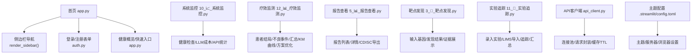
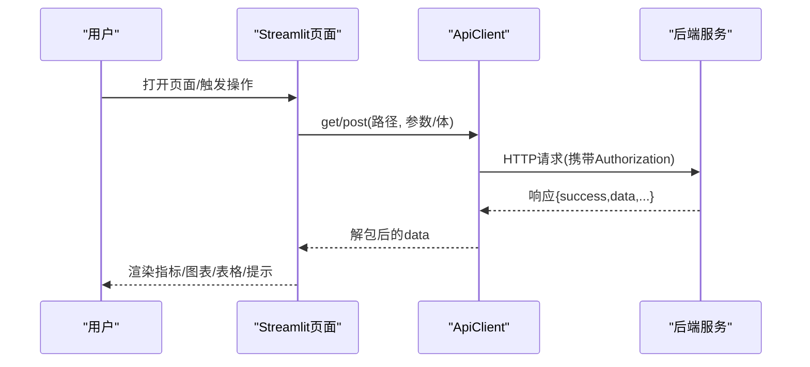
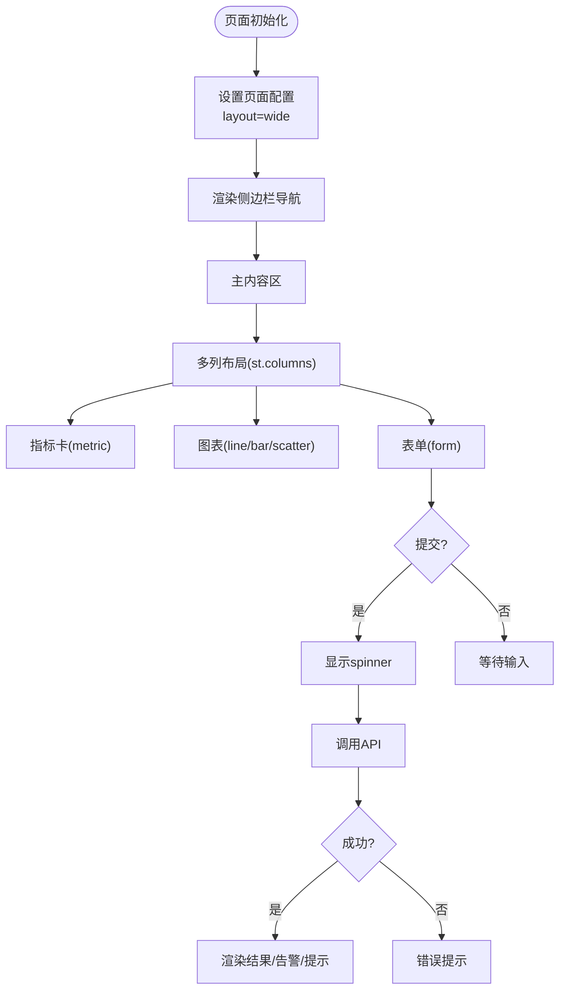
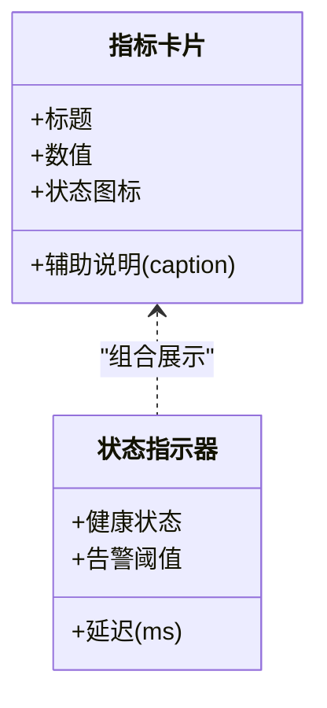
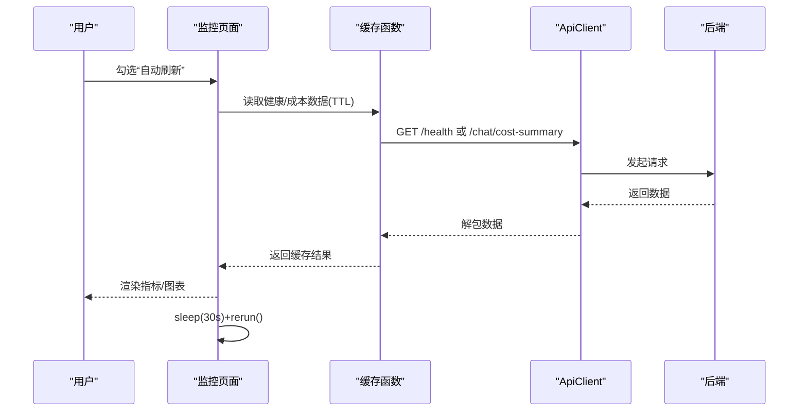
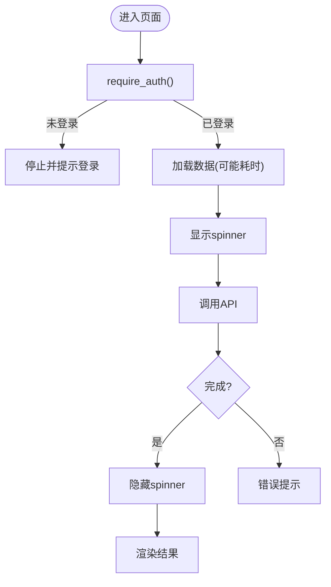
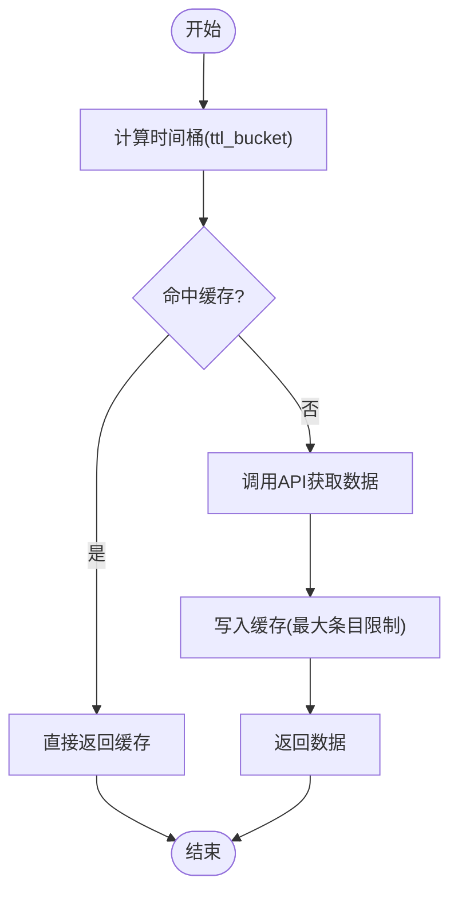
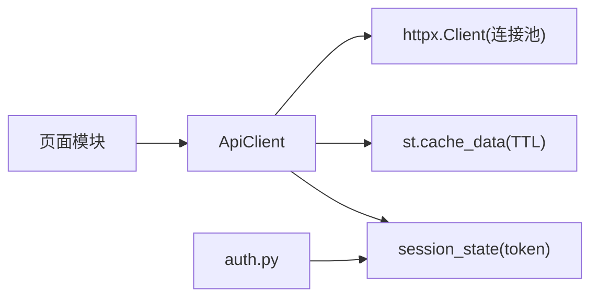

# 仪表板组件

<cite>
**本文引用的文件**   
- [frontend/app.py](file://frontend/app.py)
- [frontend/api_client.py](file://frontend/api_client.py)
- [frontend/auth.py](file://frontend/auth.py)
- [frontend/pages/10_📈_系统监控.py](file://frontend/pages/10_📈_系统监控.py)
- [frontend/pages/12_📊_疗效监测.py](file://frontend/pages/12_📊_疗效监测.py)
- [frontend/pages/5_📊_报告查看.py](file://frontend/pages/5_📊_报告查看.py)
- [frontend/pages/3_🎯_靶点发现.py](file://frontend/pages/3_🎯_靶点发现.py)
- [frontend/pages/11_🧪_实验追踪.py](file://frontend/pages/11_🧪_实验追踪.py)
- [.streamlit/config.toml](file://.streamlit/config.toml)
</cite>

## 目录
1. [引言](#引言)
2. [项目结构](#项目结构)
3. [核心组件](#核心组件)
4. [架构总览](#架构总览)
5. [详细组件分析](#详细组件分析)
6. [依赖关系分析](#依赖关系分析)
7. [性能考虑](#性能考虑)
8. [故障排查指南](#故障排查指南)
9. [结论](#结论)
10. [附录：可复用模板与组件库](#附录可复用模板与组件库)

## 引言
本指南面向AI药物设计系统的仪表板开发，聚焦Streamlit布局体系、多列布局与容器管理；详解关键指标卡片、实时监控图表、状态指示器、进度条等UI组件的实现方式；覆盖数据刷新机制、实时更新与异步加载处理；提供响应式布局适配、主题定制与国际化支持建议；并给出缓存、懒加载、虚拟滚动等性能优化策略，以及可复用的仪表板模板与组件库组织方式。

## 项目结构
前端基于Streamlit的多页面应用，入口为首页，各功能以独立页面模块组织，通过侧边栏导航跳转。认证与API客户端作为共享能力被多个页面复用。

图示来源
- [frontend/app.py:35-40](file://frontend/app.py#L35-L40)
- [frontend/app.py:43-65](file://frontend/app.py#L43-L65)
- [frontend/app.py:67-146](file://frontend/app.py#L67-L146)
- [frontend/auth.py:10-66](file://frontend/auth.py#L10-L66)
- [frontend/api_client.py:24-39](file://frontend/api_client.py#L24-L39)
- [frontend/api_client.py:186-236](file://frontend/api_client.py#L186-L236)
- [frontend/pages/10_📈_系统监控.py:19-26](file://frontend/pages/10_📈_系统监控.py#L19-L26)
- [frontend/pages/12_📊_疗效监测.py:26-48](file://frontend/pages/12_📊_疗效监测.py#L26-L48)
- [frontend/pages/5_📊_报告查看.py:17-24](file://frontend/pages/5_📊_报告查看.py#L17-L24)
- [frontend/pages/3_🎯_靶点发现.py:17-31](file://frontend/pages/3_🎯_靶点发现.py#L17-L31)
- [frontend/pages/11_🧪_实验追踪.py:24-46](file://frontend/pages/11_🧪_实验追踪.py#L24-L46)
- [.streamlit/config.toml:1-16](file://.streamlit/config.toml#L1-L16)

章节来源
- [frontend/app.py:35-146](file://frontend/app.py#L35-L146)
- [frontend/auth.py:10-137](file://frontend/auth.py#L10-L137)
- [frontend/api_client.py:24-236](file://frontend/api_client.py#L24-L236)
- [frontend/pages/10_📈_系统监控.py:19-122](file://frontend/pages/10_📈_系统监控.py#L19-L122)
- [frontend/pages/12_📊_疗效监测.py:26-583](file://frontend/pages/12_📊_疗效监测.py#L26-L583)
- [frontend/pages/5_📊_报告查看.py:17-112](file://frontend/pages/5_📊_报告查看.py#L17-L112)
- [frontend/pages/3_🎯_靶点发现.py:17-157](file://frontend/pages/3_🎯_靶点发现.py#L17-L157)
- [frontend/pages/11_🧪_实验追踪.py:24-200](file://frontend/pages/11_🧪_实验追踪.py#L24-L200)
- [.streamlit/config.toml:1-16](file://.streamlit/config.toml#L1-L16)

## 核心组件
- 布局与导航
  - 全局宽屏布局与侧边栏导航，使用st.set_page_config与st.sidebar.page_link实现。
  - 多列布局广泛使用st.columns进行指标卡、图表、表单分栏。
- 认证与会话
  - 登录/注册表单统一在auth.py中渲染，成功后写入session_state的token与用户信息。
- API客户端与缓存
  - ApiClient封装HTTP调用、错误解包、JWT注入；共享httpx.Client提升连接复用。
  - cached_get提供带TTL的GET缓存，避免频繁后端请求。
- 监控与可视化
  - 系统监控页聚合健康检查、LLM成本、API端点概览，支持自动刷新。
  - 疗效监测页包含表单录入、指标卡、条形图、折线图、散点图等。
- 报告与导出
  - 报告查看页支持列表展开、详情Markdown/JSON展示与CDISC导出。

章节来源
- [frontend/app.py:35-146](file://frontend/app.py#L35-L146)
- [frontend/auth.py:10-137](file://frontend/auth.py#L10-L137)
- [frontend/api_client.py:24-236](file://frontend/api_client.py#L24-L236)
- [frontend/pages/10_📈_系统监控.py:29-122](file://frontend/pages/10_📈_系统监控.py#L29-L122)
- [frontend/pages/12_📊_疗效监测.py:54-583](file://frontend/pages/12_📊_疗效监测.py#L54-L583)
- [frontend/pages/5_📊_报告查看.py:27-112](file://frontend/pages/5_📊_报告查看.py#L27-L112)

## 架构总览
前端通过Streamlit页面组织业务域，统一由api_client发起REST请求，后端返回信封格式响应，前端解包后渲染。认证态保存在session_state，控制页面访问与请求头注入。

图示来源
- [frontend/api_client.py:42-134](file://frontend/api_client.py#L42-L134)
- [frontend/api_client.py:186-236](file://frontend/api_client.py#L186-L236)
- [frontend/pages/10_📈_系统监控.py:29-46](file://frontend/pages/10_📈_系统监控.py#L29-L46)
- [frontend/pages/12_📊_疗效监测.py:116-133](file://frontend/pages/12_📊_疗效监测.py#L116-L133)

## 详细组件分析

### 布局系统与容器管理
- 全局布局
  - 使用st.set_page_config设置wide布局与初始侧边栏状态，确保大屏指标与图表有充足空间。
- 多列布局
  - 广泛采用st.columns按权重或固定数量划分列，用于指标卡、表单字段、图表并列展示。
- 容器与交互
  - st.expander用于折叠详情（如报告条目、靶点证据），减少首屏信息密度。
  - st.tabs用于将复杂功能拆分为子任务（如疗效监测五标签页）。
  - st.form包裹提交按钮与输入控件，保证一次性提交与校验。
  - st.spinner在长耗时操作时提供加载反馈。

图示来源
- [frontend/app.py:35-40](file://frontend/app.py#L35-L40)
- [frontend/app.py:73-146](file://frontend/app.py#L73-L146)
- [frontend/pages/12_📊_疗效监测.py:46-48](file://frontend/pages/12_📊_疗效监测.py#L46-L48)
- [frontend/pages/3_🎯_靶点发现.py:84-100](file://frontend/pages/3_🎯_靶点发现.py#L84-L100)

章节来源
- [frontend/app.py:35-146](file://frontend/app.py#L35-L146)
- [frontend/pages/12_📊_疗效监测.py:46-48](file://frontend/pages/12_📊_疗效监测.py#L46-L48)
- [frontend/pages/3_🎯_靶点发现.py:84-100](file://frontend/pages/3_🎯_靶点发现.py#L84-L100)

### 关键指标卡片与状态指示器
- 指标卡
  - 使用st.metric展示关键数值，如“今日总花费”“ORR”“DCR”“中位PFS/OS”等。
  - 结合st.columns将多个指标横向排列，形成仪表盘风格。
- 状态指示器
  - 通过图标+文本组合表示健康状态（如✅ healthy / ❌ unhealthy）。
  - 对异常阈值（如停药率>20%）使用st.warning或st.error进行告警。

图示来源
- [frontend/pages/10_📈_系统监控.py:55-78](file://frontend/pages/10_📈_系统监控.py#L55-L78)
- [frontend/pages/12_📊_疗效监测.py:219-280](file://frontend/pages/12_📊_疗效监测.py#L219-L280)
- [frontend/pages/12_📊_疗效监测.py:358-373](file://frontend/pages/12_📊_疗效监测.py#L358-L373)

章节来源
- [frontend/pages/10_📈_系统监控.py:55-78](file://frontend/pages/10_📈_系统监控.py#L55-L78)
- [frontend/pages/12_📊_疗效监测.py:219-280](file://frontend/pages/12_📊_疗效监测.py#L219-L280)
- [frontend/pages/12_📊_疗效监测.py:358-373](file://frontend/pages/12_📊_疗效监测.py#L358-L373)

### 实时监控图表与数据流
- 实时性
  - 系统监控页通过checkbox触发sleep+rerun实现定时刷新。
  - 其他页面通过cached_get的TTL机制降低刷新频率，兼顾实时性与性能。
- 图表类型
  - 条形图：响应分布（CR/PR/SD/PD）。
  - 折线图：Kaplan-Meier生存曲线。
  - 散点图：Pareto前沿（有效性 vs 安全性，气泡大小为Q值）。

图示来源
- [frontend/pages/10_📈_系统监控.py:106-122](file://frontend/pages/10_📈_系统监控.py#L106-L122)
- [frontend/api_client.py:186-236](file://frontend/api_client.py#L186-L236)
- [frontend/pages/12_📊_疗效监测.py:313-376](file://frontend/pages/12_📊_疗效监测.py#L313-L376)

章节来源
- [frontend/pages/10_📈_系统监控.py:106-122](file://frontend/pages/10_📈_系统监控.py#L106-L122)
- [frontend/api_client.py:186-236](file://frontend/api_client.py#L186-L236)
- [frontend/pages/12_📊_疗效监测.py:313-376](file://frontend/pages/12_📊_疗效监测.py#L313-L376)

### 进度条与异步加载处理
- 进度反馈
  - 使用st.spinner包裹耗时操作（如靶点发现），向用户提供明确加载状态。
- 异步策略
  - 对于非阻塞型查询，优先使用cached_get进行短期缓存，减少重复请求。
  - 对于需要立即响应的交互，先渲染骨架或提示信息，再逐步填充数据。

图示来源
- [frontend/pages/3_🎯_靶点发现.py:84-100](file://frontend/pages/3_🎯_靶点发现.py#L84-L100)
- [frontend/api_client.py:186-236](file://frontend/api_client.py#L186-L236)

章节来源
- [frontend/pages/3_🎯_靶点发现.py:84-100](file://frontend/pages/3_🎯_靶点发现.py#L84-L100)
- [frontend/api_client.py:186-236](file://frontend/api_client.py#L186-L236)

### 数据刷新机制与实时更新
- 定时刷新
  - 监控页通过checkbox+sleep+rerun实现每30秒刷新。
- TTL缓存
  - 使用cached_get的TTL桶机制，不同模块通过key_prefix隔离缓存。
- 手动失效
  - 提供invalidate_cache接口，必要时清空缓存以强制刷新。

图示来源
- [frontend/pages/10_📈_系统监控.py:106-122](file://frontend/pages/10_📈_系统监控.py#L106-L122)
- [frontend/api_client.py:186-236](file://frontend/api_client.py#L186-L236)
- [frontend/api_client.py:239-251](file://frontend/api_client.py#L239-L251)

章节来源
- [frontend/pages/10_📈_系统监控.py:106-122](file://frontend/pages/10_📈_系统监控.py#L106-L122)
- [frontend/api_client.py:186-251](file://frontend/api_client.py#L186-L251)

### 响应式布局适配
- 宽屏布局
  - 所有页面均设置layout="wide"，充分利用桌面端宽度。
- 自适应列数
  - 根据数据长度动态生成列（如st.columns(len(data))），在不同数据规模下保持良好排版。
- 移动端建议
  - 在小屏幕设备上，可将多列改为单列堆叠，或使用st.columns([1])强制单列。

章节来源
- [frontend/app.py:35-40](file://frontend/app.py#L35-L40)
- [frontend/pages/10_📈_系统监控.py:34-44](file://frontend/pages/10_📈_系统监控.py#L34-L44)

### 主题定制与国际化支持
- 主题定制
  - 通过.streamlit/config.toml配置primaryColor、backgroundColor、textColor、font等，统一品牌视觉。
- 国际化建议
  - 将界面文案抽离为字典，依据用户语言偏好选择对应键值；当前代码中文为主，可按需扩展。

章节来源
- [.streamlit/config.toml:1-16](file://.streamlit/config.toml#L1-L16)

## 依赖关系分析
- 页面到客户端
  - 各页面通过get_client()/cached_get调用后端API，统一错误处理与认证注入。
- 客户端内部依赖
  - ApiClient依赖共享httpx.Client，提升连接复用；缓存层依赖st.cache_data与时间桶。
- 认证依赖
  - auth.py负责登录/注册流程，并将token写入session_state供ApiClient使用。

图示来源
- [frontend/api_client.py:24-39](file://frontend/api_client.py#L24-L39)
- [frontend/api_client.py:186-236](file://frontend/api_client.py#L186-L236)
- [frontend/auth.py:54-66](file://frontend/auth.py#L54-L66)

章节来源
- [frontend/api_client.py:24-236](file://frontend/api_client.py#L24-L236)
- [frontend/auth.py:54-66](file://frontend/auth.py#L54-L66)

## 性能考虑
- 连接池复用
  - 使用@st.cache_resource缓存httpx.Client，避免每次请求新建连接，提高吞吐。
- 请求级缓存
  - 通过cached_get的TTL机制减少重复请求，适用于不常变的数据（健康、成本摘要）。
- 懒加载与按需渲染
  - 使用st.expander折叠详情，仅在用户展开时渲染大量内容。
- 虚拟滚动建议
  - 当列表项较多时，可使用分页或虚拟滚动思路（如仅渲染可视区域），以降低内存占用与渲染开销。
- 图表优化
  - 大数据集先聚合再绘图；选择合适的图表类型（条形/折线/散点）以提升可读性与渲染速度。

章节来源
- [frontend/api_client.py:24-39](file://frontend/api_client.py#L24-L39)
- [frontend/api_client.py:186-236](file://frontend/api_client.py#L186-L236)
- [frontend/pages/5_📊_报告查看.py:42-57](file://frontend/pages/5_📊_报告查看.py#L42-L57)

## 故障排查指南
- 认证失败
  - 检查是否已登录（session_state中的access_token），未登录会提示返回首页登录。
- 网络错误
  - 确认后端服务地址与端口正确，查看错误消息中的detail字段。
- 缓存问题
  - 若数据未更新，尝试调用invalidate_cache清除缓存或调整TTL。
- 页面卡顿
  - 检查是否存在过多同步请求，适当引入缓存或分页；避免在主线程执行长时间计算。

章节来源
- [frontend/auth.py:170-180](file://frontend/auth.py#L170-L180)
- [frontend/api_client.py:68-94](file://frontend/api_client.py#L68-L94)
- [frontend/api_client.py:239-251](file://frontend/api_client.py#L239-L251)

## 结论
本指南梳理了AI药物设计系统仪表板的布局体系、组件实现与数据流，提供了实时监控、指标卡、图表与进度反馈的最佳实践，并结合缓存、连接池与懒加载等策略保障性能。建议在后续迭代中完善国际化与更细粒度的权限控制，持续优化大数据量场景下的渲染与交互体验。

## 附录：可复用模板与组件库
- 页面模板
  - 标准页面结构：set_page_config → require_auth → 标题/分隔线 → 功能区（tabs/expander/form）→ 指标卡/图表 → 错误处理。
- 组件清单
  - 指标卡组件：封装metric+caption+状态图标，支持阈值告警。
  - 图表组件：封装line/bar/scatter，统一样式与空数据处理。
  - 表单组件：封装columns+form+submit，统一校验与错误提示。
  - 刷新组件：封装checkbox+sleep+rerun，支持自定义间隔。
- 组织建议
  - 将通用组件放入components目录，页面只关注业务逻辑；通过统一的api_client进行数据交互。

[本节为概念性总结，不直接分析具体文件]