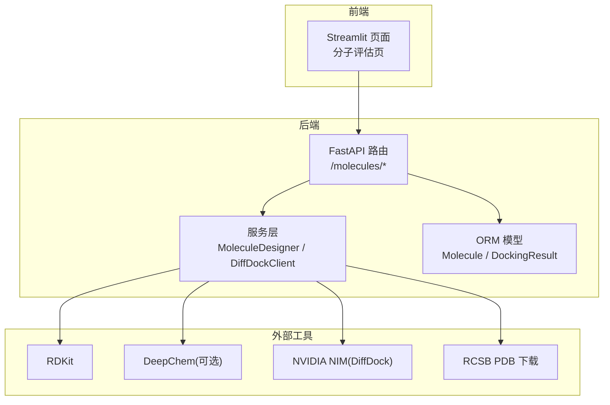
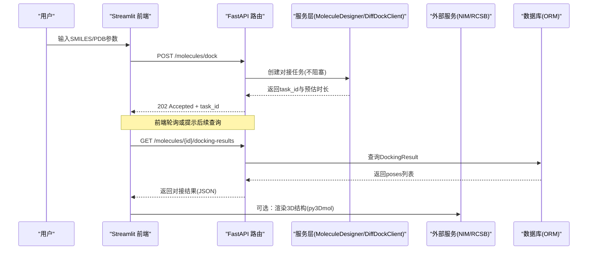
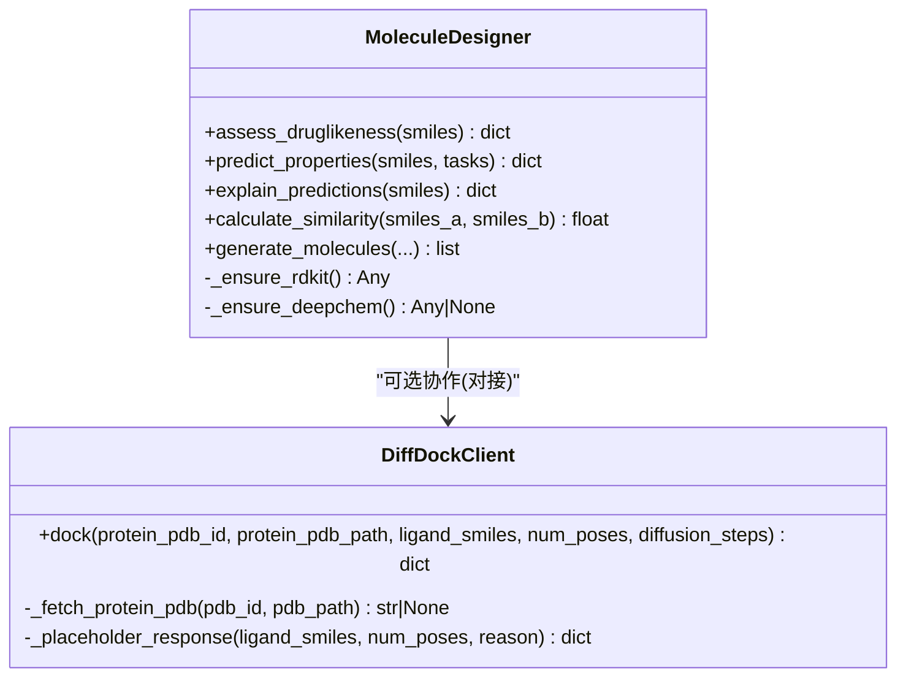
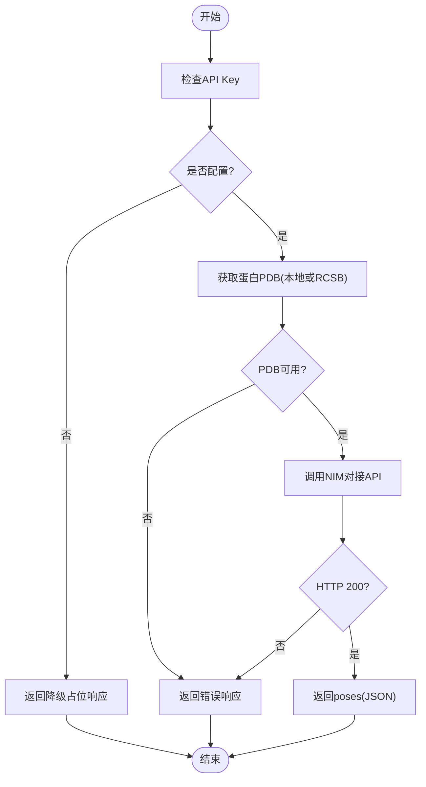
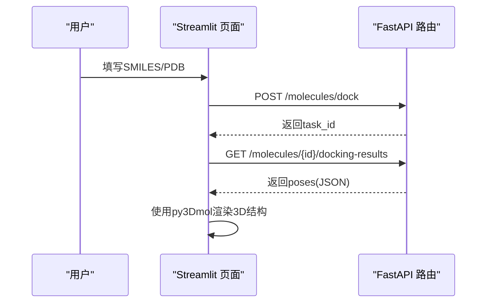
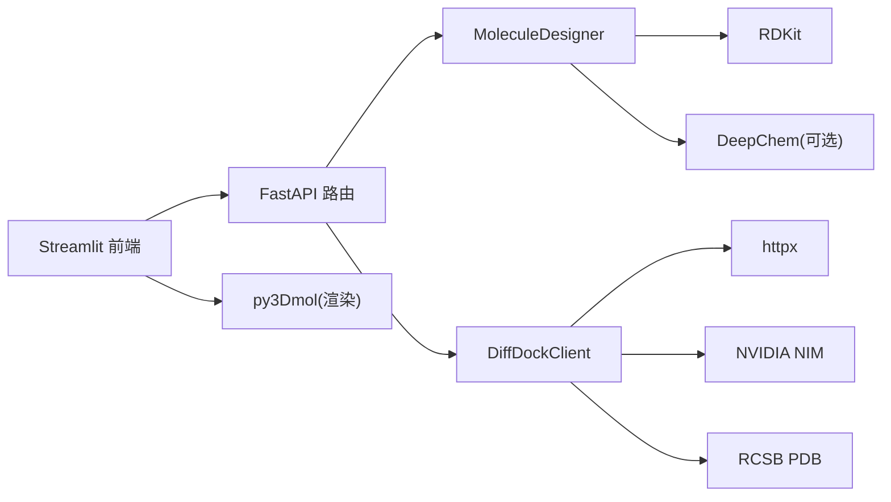

# 分子结构可视化

<cite>
**本文引用的文件**   
- [backend/app/api/v1/molecules.py](file://backend/app/api/v1/molecules.py)
- [backend/app/services/analyzer/molecule_designer.py](file://backend/app/services/analyzer/molecule_designer.py)
- [backend/app/models/molecule.py](file://backend/app/models/molecule.py)
- [backend/app/schemas/molecule.py](file://backend/app/schemas/molecule.py)
- [frontend/pages/4_⚙️_分子评估.py](file://frontend/pages/4_⚙️_分子评估.py)
- [backend/requirements.txt](file://backend/requirements.txt)
- [scripts/check_rdkit.py](file://scripts/check_rdkit.py)
</cite>

## 目录
1. [引言](#引言)
2. [项目结构](#项目结构)
3. [核心组件](#核心组件)
4. [架构总览](#架构总览)
5. [详细组件分析](#详细组件分析)
6. [依赖关系分析](#依赖关系分析)
7. [性能与渲染优化](#性能与渲染优化)
8. [故障排查指南](#故障排查指南)
9. [结论](#结论)
10. [附录](#附录)

## 引言
本指南面向AI药物设计系统的“分子结构可视化”能力，聚焦于以下目标：
- 集成RDKit、PyMOL（可选）、py3Dmol等化学信息学工具，提供SMILES/PDB解析、2D结构图生成、3D结构展示。
- 对接结果可视化：多构象poses的置信度排序、SDF坐标渲染、活性位点标记与相互作用力显示。
- 分子属性标注：类药性指标、ADMET预测、SHAP风格可解释性贡献。
- WebGL渲染与交互：旋转、缩放、选择、搜索高亮、构象变化动画。
- 数据流与接口契约：从前端到后端API、服务层、模型与数据库的端到端流程。

## 项目结构
围绕分子可视化的关键代码分布在后端API、服务层、数据模型与前端页面中：
- API层：提供类药性评估、分子对接任务提交、对接结果查询、性质预测等接口。
- 服务层：封装RDKit计算、DeepChem预测、DiffDock NIM客户端。
- 数据模型：分子与对接结果的持久化结构。
- 前端页面：Streamlit界面用于输入SMILES/PDB、触发对接与查看结果。

图表来源
- [backend/app/api/v1/molecules.py:1-403](file://backend/app/api/v1/molecules.py#L1-L403)
- [backend/app/services/analyzer/molecule_designer.py:1-689](file://backend/app/services/analyzer/molecule_designer.py#L1-L689)
- [backend/app/models/molecule.py:1-61](file://backend/app/models/molecule.py#L1-L61)
- [frontend/pages/4_⚙️_分子评估.py:1-159](file://frontend/pages/4_⚙️_分子评估.py#L1-L159)

章节来源
- [backend/app/api/v1/molecules.py:1-403](file://backend/app/api/v1/molecules.py#L1-L403)
- [backend/app/services/analyzer/molecule_designer.py:1-689](file://backend/app/services/analyzer/molecule_designer.py#L1-L689)
- [backend/app/models/molecule.py:1-61](file://backend/app/models/molecule.py#L1-L61)
- [frontend/pages/4_⚙️_分子评估.py:1-159](file://frontend/pages/4_⚙️_分子评估.py#L1-L159)

## 核心组件
- 类药性评估：基于RDKit计算分子量、LogP、氢键供体/受体、可旋转键、TPSA，并判断Lipinski/Veber规则通过情况。
- ADMET性质预测：优先使用DeepChem模型，不可用时降级为规则模型；返回溶解度、口服生物利用度、BBB通透性等。
- 分子对接：通过DiffDock NIM API执行，支持PDB ID或本地PDB路径；返回多构象poses（含confidence、sdf）。
- 可解释性分析：基于特征贡献的简化SHAP代理输出，辅助理解各理化指标对性质的影响。
- 相似度计算：Tanimoto相似性（Morgan指纹），用于分子检索与高亮。

章节来源
- [backend/app/api/v1/molecules.py:47-92](file://backend/app/api/v1/molecules.py#L47-L92)
- [backend/app/services/analyzer/molecule_designer.py:71-134](file://backend/app/services/analyzer/molecule_designer.py#L71-L134)
- [backend/app/services/analyzer/molecule_designer.py:136-256](file://backend/app/services/analyzer/molecule_designer.py#L136-L256)
- [backend/app/services/analyzer/molecule_designer.py:333-358](file://backend/app/services/analyzer/molecule_designer.py#L333-L358)
- [backend/app/services/analyzer/molecule_designer.py:522-660](file://backend/app/services/analyzer/molecule_designer.py#L522-L660)

## 架构总览
下图展示了从前端到后端的完整调用链，包括对接任务的异步处理与结果获取。

图表来源
- [backend/app/api/v1/molecules.py:109-143](file://backend/app/api/v1/molecules.py#L109-L143)
- [backend/app/api/v1/molecules.py:194-216](file://backend/app/api/v1/molecules.py#L194-L216)
- [backend/app/services/analyzer/molecule_designer.py:543-611](file://backend/app/services/analyzer/molecule_designer.py#L543-L611)
- [backend/app/models/molecule.py:46-61](file://backend/app/models/molecule.py#L46-L61)

## 详细组件分析

### 组件A：类药性与ADMET评估（RDKit/DeepChem）
- 功能要点
  - 解析SMILES，计算基础理化指标。
  - Lipinski/Veber规则判定与QED评分。
  - DeepChem优先，失败时回退至规则模型。
- 数据结构
  - 请求：包含smiles与可选tasks。
  - 响应：包含valid、各项指标、properties、model_used、druglikeness等。
- 复杂度与优化
  - SMILES解析与描述符计算为O(n)，n为原子数；建议缓存常用分子的指纹与描述符。
  - DeepChem首次加载耗时，应延迟加载与模型缓存。

图表来源
- [backend/app/services/analyzer/molecule_designer.py:20-51](file://backend/app/services/analyzer/molecule_designer.py#L20-L51)
- [backend/app/services/analyzer/molecule_designer.py:71-134](file://backend/app/services/analyzer/molecule_designer.py#L71-L134)
- [backend/app/services/analyzer/molecule_designer.py:136-256](file://backend/app/services/analyzer/molecule_designer.py#L136-L256)
- [backend/app/services/analyzer/molecule_designer.py:333-358](file://backend/app/services/analyzer/molecule_designer.py#L333-L358)
- [backend/app/services/analyzer/molecule_designer.py:522-660](file://backend/app/services/analyzer/molecule_designer.py#L522-L660)

章节来源
- [backend/app/api/v1/molecules.py:47-92](file://backend/app/api/v1/molecules.py#L47-L92)
- [backend/app/services/analyzer/molecule_designer.py:71-134](file://backend/app/services/analyzer/molecule_designer.py#L71-L134)
- [backend/app/services/analyzer/molecule_designer.py:136-256](file://backend/app/services/analyzer/molecule_designer.py#L136-L256)
- [backend/app/services/analyzer/molecule_designer.py:333-358](file://backend/app/services/analyzer/molecule_designer.py#L333-L358)

### 组件B：分子对接（DiffDock NIM）
- 功能要点
  - 支持PDB ID或本地PDB路径；自动下载或读取蛋白结构。
  - 调用NVIDIA NIM执行对接，返回多构象poses（confidence、sdf）。
  - 未配置API Key或网络异常时返回降级占位响应。
- 数据流
  - 前端提交对接任务 → 后端返回task_id → 前端轮询获取结果 → 渲染3D结构。

图表来源
- [backend/app/services/analyzer/molecule_designer.py:543-611](file://backend/app/services/analyzer/molecule_designer.py#L543-L611)
- [backend/app/services/analyzer/molecule_designer.py:613-638](file://backend/app/services/analyzer/molecule_designer.py#L613-L638)
- [backend/app/services/analyzer/molecule_designer.py:640-660](file://backend/app/services/analyzer/molecule_designer.py#L640-L660)

章节来源
- [backend/app/api/v1/molecules.py:109-143](file://backend/app/api/v1/molecules.py#L109-L143)
- [backend/app/api/v1/molecules.py:194-216](file://backend/app/api/v1/molecules.py#L194-L216)
- [backend/app/services/analyzer/molecule_designer.py:543-660](file://backend/app/services/analyzer/molecule_designer.py#L543-L660)

### 组件C：前端交互与渲染（Streamlit + py3Dmol）
- 功能要点
  - 表单输入SMILES/PDB参数，提交对接任务。
  - 展示类药性指标与ADMET预测结果。
  - 使用py3Dmol渲染3D结构（需在前端页面中集成）。
- 交互流程
  - 提交任务 → 显示任务ID与提示 → 轮询结果 → 渲染3D视图。

图表来源
- [frontend/pages/4_⚙️_分子评估.py:76-106](file://frontend/pages/4_⚙️_分子评估.py#L76-L106)
- [backend/app/api/v1/molecules.py:109-143](file://backend/app/api/v1/molecules.py#L109-L143)
- [backend/app/api/v1/molecules.py:194-216](file://backend/app/api/v1/molecules.py#L194-L216)

章节来源
- [frontend/pages/4_⚙️_分子评估.py:1-159](file://frontend/pages/4_⚙️_分子评估.py#L1-L159)

## 依赖关系分析
- 后端依赖
  - RDKit：SMILES解析、描述符计算、指纹生成。
  - DeepChem（可选）：ADMET预测模型。
  - httpx：异步HTTP客户端（NIM/RCSB）。
  - FastAPI/SQLAlchemy：Web框架与ORM。
- 前端依赖
  - Streamlit：交互式UI。
  - py3Dmol：浏览器内3D分子渲染（在requirements中声明）。

图表来源
- [backend/requirements.txt:25-84](file://backend/requirements.txt#L25-L84)
- [backend/app/api/v1/molecules.py:1-403](file://backend/app/api/v1/molecules.py#L1-L403)
- [backend/app/services/analyzer/molecule_designer.py:1-689](file://backend/app/services/analyzer/molecule_designer.py#L1-L689)

章节来源
- [backend/requirements.txt:25-84](file://backend/requirements.txt#L25-L84)

## 性能与渲染优化
- 渲染优化
  - 使用py3Dmol进行WebGL渲染，避免后端重绘；仅传输JSON坐标与样式指令。
  - 对大分子采用LOD（细节层次）策略，按需加载表面与相互作用线。
- 计算优化
  - RDKit描述符与指纹计算结果缓存（按SMILES哈希）。
  - DeepChem模型懒加载与预取，减少首请求延迟。
- 交互优化
  - 前端事件节流（旋转/缩放）降低帧率抖动。
  - 分子搜索高亮采用局部更新而非全量重绘。

[本节为通用指导，无需特定文件引用]

## 故障排查指南
- RDKit未安装
  - 现象：类药性评估返回无效或抛出导入错误。
  - 处理：安装rdkit或使用conda环境；运行脚本快速验证。
- DiffDock NIM不可用
  - 现象：返回降级占位响应或错误状态码。
  - 处理：检查环境变量API Key与网络连通性；确认NIM服务可用性。
- PDB获取失败
  - 现象：无法下载或读取PDB文件。
  - 处理：校验PDB ID有效性或本地路径权限；重试或更换镜像源。

章节来源
- [scripts/check_rdkit.py:1-15](file://scripts/check_rdkit.py#L1-L15)
- [backend/app/services/analyzer/molecule_designer.py:543-611](file://backend/app/services/analyzer/molecule_designer.py#L543-L611)
- [backend/app/services/analyzer/molecule_designer.py:613-638](file://backend/app/services/analyzer/molecule_designer.py#L613-L638)

## 结论
本指南梳理了分子结构可视化的核心链路：从SMILES/PDB输入、类药性与ADMET评估、对接任务执行与结果查询，到前端3D渲染与交互。通过RDKit与py3Dmol的组合，系统可在浏览器中高效展示分子结构与对接构象；结合DeepChem与NIM服务，实现可扩展的预测与对接能力。建议在工程实践中引入缓存、懒加载与前端渲染优化，以提升整体性能与用户体验。

[本节为总结性内容，无需特定文件引用]

## 附录
- 接口契约摘要
  - POST /molecules/assess-druglikeness：类药性评估（Lipinski/Veber/QED）。
  - POST /molecules/dock：提交对接任务，返回task_id。
  - GET /molecules/{id}/docking-results：查询对接结果（poses JSON）。
  - POST /molecules/predict-properties：ADMET性质预测（DeepChem或规则模型）。
- 数据模型
  - Molecule：分子基本信息与关联的对接结果。
  - DockingResult：对接任务结果（protein_pdb_id/path、poses、top_confidence、docked_by）。

章节来源
- [backend/app/api/v1/molecules.py:95-106](file://backend/app/api/v1/molecules.py#L95-L106)
- [backend/app/api/v1/molecules.py:109-143](file://backend/app/api/v1/molecules.py#L109-L143)
- [backend/app/api/v1/molecules.py:194-216](file://backend/app/api/v1/molecules.py#L194-L216)
- [backend/app/api/v1/molecules.py:219-298](file://backend/app/api/v1/molecules.py#L219-L298)
- [backend/app/models/molecule.py:14-61](file://backend/app/models/molecule.py#L14-L61)
- [backend/app/schemas/molecule.py:56-86](file://backend/app/schemas/molecule.py#L56-L86)