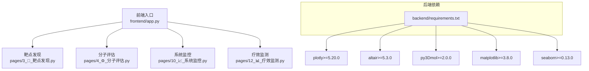
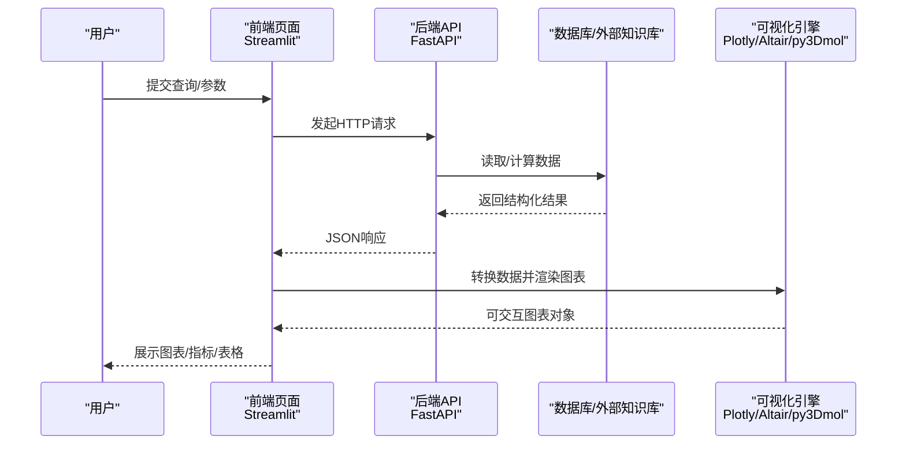
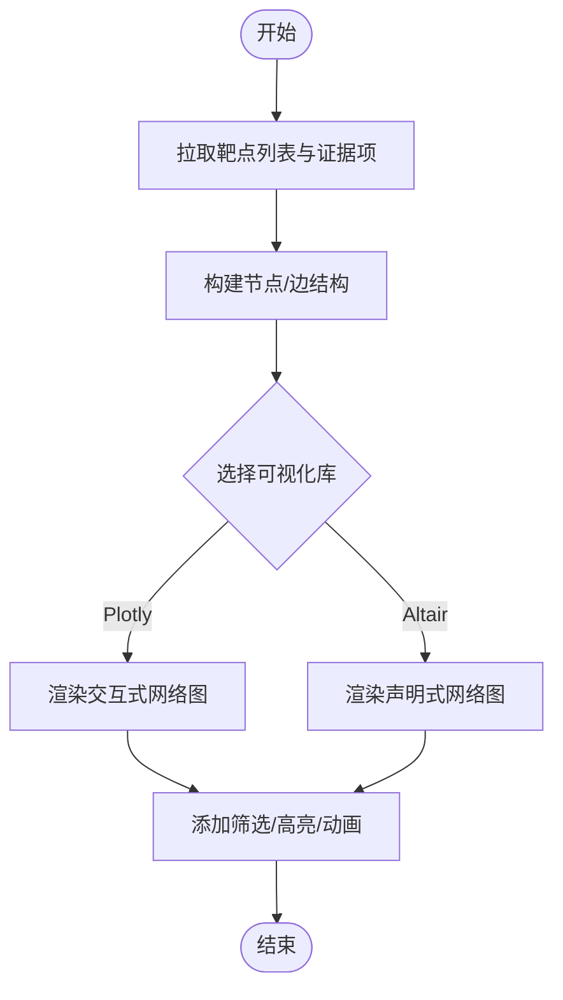
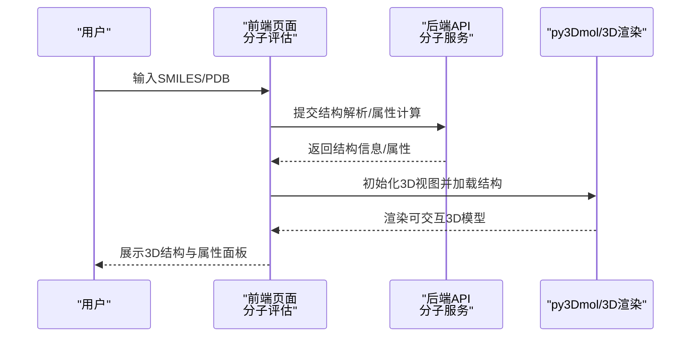
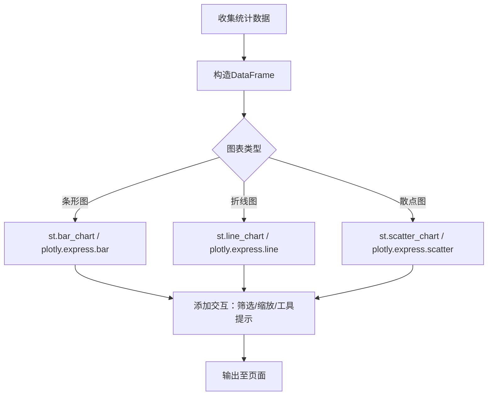
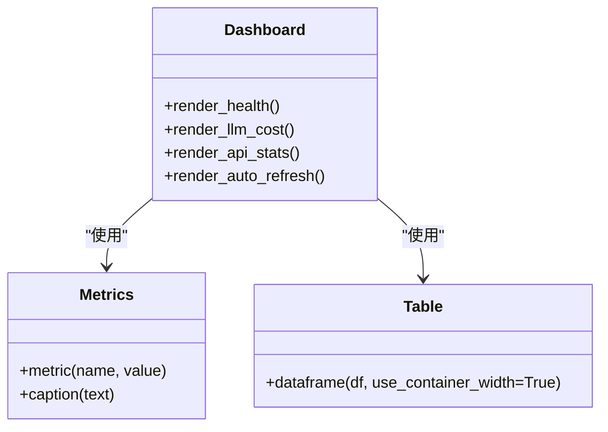
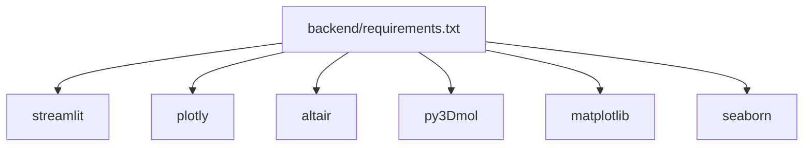

# 数据可视化

<cite>
**本文引用的文件**   
- [frontend/app.py](file://frontend/app.py)
- [frontend/pages/3_🎯_靶点发现.py](file://frontend/pages/3_🎯_靶点发现.py)
- [frontend/pages/4_⚙️_分子评估.py](file://frontend/pages/4_⚙️_分子评估.py)
- [frontend/pages/10_📈_系统监控.py](file://frontend/pages/10_📈_系统监控.py)
- [frontend/pages/12_📊_疗效监测.py](file://frontend/pages/12_📊_疗效监测.py)
- [backend/requirements.txt](file://backend/requirements.txt)
</cite>

## 目录
1. [引言](#引言)
2. [项目结构](#项目结构)
3. [核心组件](#核心组件)
4. [架构总览](#架构总览)
5. [详细组件分析](#详细组件分析)
6. [依赖分析](#依赖分析)
7. [性能考虑](#性能考虑)
8. [故障排查指南](#故障排查指南)
9. [结论](#结论)
10. [附录](#附录)

## 引言
本指南面向AI药物设计系统的“数据可视化”能力，聚焦于如何在现有Streamlit前端中集成Plotly、Altair等可视化库，构建交互式图表与生物医学数据可视化。文档覆盖：
- 可视化库集成与选择策略（Plotly、Altair、py3Dmol、matplotlib/seaborn）
- 交互式图表开发流程与最佳实践
- 核心可视化组件：靶点网络图、分子结构展示、统计分析图表、实时监控仪表板
- 图表定制、动画效果、响应式布局、大数据量渲染优化
- 可视化组件开发模板、性能调优技巧、用户体验设计原则

## 项目结构
当前前端基于Streamlit组织页面，后端提供REST API；可视化主要在前端通过Streamlit内置图表与第三方库完成。关键入口与页面如下：
- 应用主入口：首页、侧边栏导航、健康状态概览
- 功能页面：靶点发现、分子评估、系统监控、疗效监测等
- 依赖清单：后端requirements中包含streamlit、plotly、altair、py3Dmol、matplotlib、seaborn等

**图示来源** 
- [frontend/app.py:35-63](file://frontend/app.py#L35-L63)
- [backend/requirements.txt:63-71](file://backend/requirements.txt#L63-L71)

**章节来源**
- [frontend/app.py:35-63](file://frontend/app.py#L35-L63)
- [backend/requirements.txt:63-71](file://backend/requirements.txt#L63-L71)

## 核心组件
本节梳理现有页面中的可视化模式与扩展点，为后续引入Plotly/Altair提供基础。

- 指标卡片与进度条
  - 使用st.metric、st.progress进行KPI与预算使用率展示
  - 示例路径：[隐私计算—差分隐私预算监控:142-169](file://frontend/pages/9_🔒_隐私计算.py#L142-L169)

- 表格与条形图
  - 使用st.dataframe、st.bar_chart呈现分类统计
  - 示例路径：[疗效监测—响应分布:282-300](file://frontend/pages/12_📊_疗效监测.py#L282-L300)

- 折线图与生存曲线
  - 使用st.line_chart绘制时间序列或生存函数
  - 示例路径：[疗效监测—KM曲线:364-371](file://frontend/pages/12_📊_疗效监测.py#L364-L371)

- 散点图与多维关系
  - 使用st.scatter_chart展示Pareto前沿（有效性 vs 安全性）
  - 示例路径：[疗效监测—方案优化:513-530](file://frontend/pages/12_📊_疗效监测.py#L513-L530)

- 自动刷新与缓存
  - 使用st.rerun实现定时刷新；使用cached_get减少重复请求
  - 示例路径：[系统监控—自动刷新:106-113](file://frontend/pages/10_📈_系统监控.py#L106-L113)、[首页—健康状态缓存:120-134](file://frontend/app.py#L120-L134)

**章节来源**
- [frontend/pages/9_🔒_隐私计算.py:142-169](file://frontend/pages/9_🔒_隐私计算.py#L142-L169)
- [frontend/pages/12_📊_疗效监测.py:282-300](file://frontend/pages/12_📊_疗效监测.py#L282-L300)
- [frontend/pages/12_📊_疗效监测.py:364-371](file://frontend/pages/12_📊_疗效监测.py#L364-L371)
- [frontend/pages/12_📊_疗效监测.py:513-530](file://frontend/pages/12_📊_疗效监测.py#L513-L530)
- [frontend/pages/10_📈_系统监控.py:106-113](file://frontend/pages/10_📈_系统监控.py#L106-L113)
- [frontend/app.py:120-134](file://frontend/app.py#L120-L134)

## 架构总览
从数据到可视化的端到端流程：
- 用户交互：表单输入、参数配置
- 后端服务：FastAPI接口处理业务逻辑与数据聚合
- 前端渲染：Streamlit调用内置图表或第三方库生成可视化
- 缓存与刷新：降低重复请求，提升体验

**图示来源** 
- [frontend/app.py:120-134](file://frontend/app.py#L120-L134)
- [frontend/pages/12_📊_疗效监测.py:339-371](file://frontend/pages/12_📊_疗效监测.py#L339-L371)
- [backend/requirements.txt:63-71](file://backend/requirements.txt#L63-L71)

## 详细组件分析

### 靶点网络图（概念与实现建议）
目标：以节点-边形式展示基因/蛋白之间的相互作用、证据强度与来源。
- 数据结构建议
  - 节点：包含symbol、name、evidence_level、source等字段
  - 边：包含target_from、target_to、weight、evidence_type等字段
- 可视化选型
  - Plotly Graph Objects：适合大规模网络、支持缩放/筛选/动画
  - Altair：声明式语法，适合快速原型与小规模网络
- 交互设计
  - 点击节点高亮邻接边
  - 按证据级别过滤
  - 悬停显示摘要与来源链接
- 参考实现位置
  - 靶点发现页面用于获取候选靶点与证据项，可作为网络图的输入源
  - 示例路径：[靶点发现—结果渲染:115-151](file://frontend/pages/3_🎯_靶点发现.py#L115-L151)

**章节来源**
- [frontend/pages/3_🎯_靶点发现.py:115-151](file://frontend/pages/3_🎯_靶点发现.py#L115-L151)

### 分子结构展示（3D可视化）
目标：在浏览器中展示分子三维结构，支持旋转、缩放、键长/角度测量。
- 技术选型
  - py3Dmol：专为分子结构设计的WebGL可视化库，适合SMILES/PDB渲染
  - RDKit：用于SMILES解析与属性计算（后端已具备相关依赖）
- 工作流
  - 输入SMILES或PDB ID
  - 后端或前端解析结构
  - 使用py3Dmol渲染3D视图
- 参考实现位置
  - 分子评估页面提供SMILES输入与对接任务提交
  - 示例路径：[分子评估—类药性/对接/预测:31-158](file://frontend/pages/4_⚙️_分子评估.py#L31-L158)

**图示来源** 
- [frontend/pages/4_⚙️_分子评估.py:31-158](file://frontend/pages/4_⚙️_分子评估.py#L31-L158)
- [backend/requirements.txt:26,68:26-26](file://backend/requirements.txt#L26-L26)
- [backend/requirements.txt:68-69](file://backend/requirements.txt#L68-L69)

**章节来源**
- [frontend/pages/4_⚙️_分子评估.py:31-158](file://frontend/pages/4_⚙️_分子评估.py#L31-L158)
- [backend/requirements.txt:26](file://backend/requirements.txt#L26-L26)
- [backend/requirements.txt:68-69](file://backend/requirements.txt#L68-L69)

### 统计分析图表（条形图、折线图、散点图）
目标：对临床结局、疗效汇总、Pareto前沿等进行可视化。
- 条形图：响应分布（CR/PR/SD/PD）
  - 示例路径：[疗效监测—响应分布:282-300](file://frontend/pages/12_📊_疗效监测.py#L282-L300)
- 折线图：Kaplan-Meier生存曲线
  - 示例路径：[疗效监测—KM曲线:364-371](file://frontend/pages/12_📊_疗效监测.py#L364-L371)
- 散点图：Pareto前沿（有效性 vs 安全性），气泡大小表示Q值
  - 示例路径：[疗效监测—方案优化:513-530](file://frontend/pages/12_📊_疗效监测.py#L513-L530)

**章节来源**
- [frontend/pages/12_📊_疗效监测.py:282-300](file://frontend/pages/12_📊_疗效监测.py#L282-L300)
- [frontend/pages/12_📊_疗效监测.py:364-371](file://frontend/pages/12_📊_疗效监测.py#L364-L371)
- [frontend/pages/12_📊_疗效监测.py:513-530](file://frontend/pages/12_📊_疗效监测.py#L513-L530)

### 实时监控仪表板（健康检查、成本统计、API概览）
目标：集中展示系统健康、LLM成本、API端点状态，支持自动刷新。
- 健康检查：动态列布局，图标化状态
  - 示例路径：[系统监控—健康检查:29-46](file://frontend/pages/10_📈_系统监控.py#L29-L46)
- LLM成本：按模型/层级分解的指标与表格
  - 示例路径：[系统监控—LLM成本:49-79](file://frontend/pages/10_📈_系统监控.py#L49-L79)
- API概览：卡片式端点说明
  - 示例路径：[系统监控—API概览:82-104](file://frontend/pages/10_📈_系统监控.py#L82-L104)
- 自动刷新：checkbox触发定时rerun
  - 示例路径：[系统监控—自动刷新:106-113](file://frontend/pages/10_📈_系统监控.py#L106-L113)

**图示来源** 
- [frontend/pages/10_📈_系统监控.py:29-113](file://frontend/pages/10_📈_系统监控.py#L29-L113)

**章节来源**
- [frontend/pages/10_📈_系统监控.py:29-113](file://frontend/pages/10_📈_系统监控.py#L29-L113)

## 依赖分析
- 可视化相关依赖位于后端requirements中，前端通过Streamlit间接使用这些库
- 关键版本约束：
  - streamlit>=1.33.0
  - plotly>=5.20.0
  - altair>=5.3.0
  - py3Dmol>=2.0.0
  - matplotlib>=3.8.0
  - seaborn>=0.13.0

**图示来源** 
- [backend/requirements.txt:63-71](file://backend/requirements.txt#L63-L71)

**章节来源**
- [backend/requirements.txt:63-71](file://backend/requirements.txt#L63-L71)

## 性能考虑
- 数据量控制
  - 对网络图与散点图进行采样或聚合，避免一次性渲染过多元素
  - 使用分页或懒加载机制，分批次渲染大表与大图
- 缓存与去重
  - 使用缓存（如cached_get）减少重复请求
  - 对静态或低频更新的数据设置合理TTL
- 渲染优化
  - 优先使用Plotly Express或Altair的声明式API，减少手动DOM操作
  - 对复杂图形启用降采样、简化几何、关闭不必要的动画
- 交互优化
  - 将高频交互（如筛选）放在前端，减少往返请求
  - 使用节流/防抖策略，避免频繁触发重渲染
- 资源管理
  - 及时释放大型对象引用，避免内存泄漏
  - 对3D模型进行LOD（细节层次）控制

[本节为通用指导，不直接分析具体文件]

## 故障排查指南
- 常见错误定位
  - 后端不可用：健康检查失败时给出明确提示
    - 示例路径：[系统监控—健康检查异常处理:45-46](file://frontend/pages/10_📈_系统监控.py#L45-L46)
  - 数据为空或缺失：当无患者结局或KM数据时，给出友好提示
    - 示例路径：[疗效监测—KM空数据提示:347-354](file://frontend/pages/12_📊_疗效监测.py#L347-L354)
  - 请求异常：捕获并展示错误信息与帮助提示
    - 示例路径：[靶点发现—异常处理:97-100](file://frontend/pages/3_🎯_靶点发现.py#L97-L100)
- 调试建议
  - 打开浏览器开发者工具查看网络请求与错误日志
  - 在后端增加更详细的错误码与消息
  - 对关键图表增加最小数据集验证，确保渲染链路正常

**章节来源**
- [frontend/pages/10_📈_系统监控.py:45-46](file://frontend/pages/10_📈_系统监控.py#L45-L46)
- [frontend/pages/12_📊_疗效监测.py:347-354](file://frontend/pages/12_📊_疗效监测.py#L347-L354)
- [frontend/pages/3_🎯_靶点发现.py:97-100](file://frontend/pages/3_🎯_靶点发现.py#L97-L100)

## 结论
本项目已具备良好的可视化基础：Streamlit内置图表满足多数统计需求，后端依赖清单涵盖Plotly、Altair、py3Dmol等高级可视化库。建议在以下方向持续完善：
- 引入Plotly/Altair增强交互性与表现力
- 构建统一的可视化组件库与模板，提高复用性
- 建立性能基准与监控，保障大数据量场景下的流畅体验
- 强化用户体验设计原则，确保图表可读性与可解释性

[本节为总结性内容，不直接分析具体文件]

## 附录

### 可视化组件开发模板（建议）
- 输入层
  - 表单控件：文本框、下拉框、滑块、日期选择器
  - 校验与默认值：必填字段、范围限制、提示信息
- 数据处理层
  - 数据清洗：缺失值处理、类型转换、单位统一
  - 聚合与采样：分组统计、时间窗口、随机采样
- 渲染层
  - 选择库：Plotly（复杂交互）、Altair（声明式）、py3Dmol（3D结构）
  - 主题与样式：统一配色、字体、尺寸规范
- 交互层
  - 筛选与联动：多图表联动、下钻详情
  - 动画与过渡：平滑切换、渐进加载
- 输出层
  - 导出与分享：PNG/SVG导出、URL参数持久化
  - 可访问性：键盘导航、屏幕阅读器支持

[本节为概念性模板，不直接分析具体文件]