# 状态管理

<cite>
**本文引用的文件**
- [frontend/app.py](file://frontend/app.py)
- [frontend/auth.py](file://frontend/auth.py)
- [frontend/api_client.py](file://frontend/api_client.py)
- [frontend/pages/1_📁_项目管理.py](file://frontend/pages/1_📁_项目管理.py)
- [frontend/pages/3_🎯_靶点发现.py](file://frontend/pages/3_🎯_靶点发现.py)
- [frontend/pages/4_⚙️_分子评估.py](file://frontend/pages/4_⚙️_分子评估.py)
- [frontend/pages/5_📊_报告查看.py](file://frontend/pages/5_📊_报告查看.py)
- [frontend/pages/6_💡_假设管理.py](file://frontend/pages/6_💡_假设管理.py)
- [frontend/pages/7_🤖_AI问答.py](file://frontend/pages/7_🤖_AI问答.py)
</cite>

## 目录
1. [简介](#简介)
2. [项目结构](#项目结构)
3. [核心组件](#核心组件)
4. [架构总览](#架构总览)
5. [详细组件分析](#详细组件分析)
6. [依赖关系分析](#依赖关系分析)
7. [性能考虑](#性能考虑)
8. [故障排查指南](#故障排查指南)
9. [结论](#结论)
10. [附录](#附录)

## 简介
本文件面向 AI 药物设计系统的前端（Streamlit）状态管理，系统性说明：
- Streamlit session_state 的使用模式与全局/局部状态划分
- 用户认证状态、项目上下文、分析任务状态、缓存数据管理
- 状态更新最佳实践、性能优化技巧、状态同步机制、内存管理
- 状态设计模式、调试方法、常见问题解决方案

目标是帮助开发者在复杂多页面应用中稳定地维护状态，提升可维护性与用户体验。

## 项目结构
前端采用 Streamlit 多页面应用组织方式，入口为 app.py，各功能以 pages/*.py 形式独立页面实现；认证与 API 客户端封装位于 auth.py 与 api_client.py。

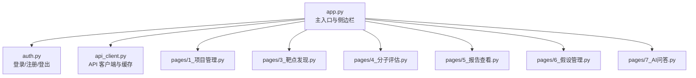

图示来源
- [frontend/app.py:43-64](file://frontend/app.py#L43-L64)
- [frontend/auth.py:10-127](file://frontend/auth.py#L10-L127)
- [frontend/api_client.py:42-167](file://frontend/api_client.py#L42-L167)
- [frontend/pages/1_📁_项目管理.py:1-24](file://frontend/pages/1_📁_项目管理.py#L1-L24)
- [frontend/pages/3_🎯_靶点发现.py:1-24](file://frontend/pages/3_🎯_靶点发现.py#L1-L24)
- [frontend/pages/4_⚙️_分子评估.py:1-24](file://frontend/pages/4_⚙️_分子评估.py#L1-L24)
- [frontend/pages/5_📊_报告查看.py:1-24](file://frontend/pages/5_📊_报告查看.py#L1-L24)
- [frontend/pages/6_💡_假设管理.py:1-24](file://frontend/pages/6_💡_假设管理.py#L1-L24)
- [frontend/pages/7_🤖_AI问答.py:1-24](file://frontend/pages/7_🤖_AI问答.py#L1-L24)

章节来源
- [frontend/app.py:35-64](file://frontend/app.py#L35-L64)
- [frontend/auth.py:10-127](file://frontend/auth.py#L10-L127)
- [frontend/api_client.py:24-39](file://frontend/api_client.py#L24-L39)

## 核心组件
- 会话认证状态
  - access_token、refresh_token、user_email、api_base_url 等键用于维持登录态与后端连接地址。
  - 通过 require_auth() 在各页面进行鉴权拦截。
- 全局状态
  - 由 app.py 渲染侧边栏与首页，根据 access_token 切换导航与欢迎信息。
- 局部状态
  - 各页面使用 st.session_state 保存表单输入、查询参数、结果集、当前视图 ID、聊天历史等。
- 缓存与持久化策略
  - 使用 @st.cache_resource 复用 httpx.Client 连接池。
  - 使用 @st.cache_data 配合时间桶 TTL 对 GET 请求做短期缓存。
  - 提供 invalidate_cache() 统一清理缓存。

章节来源
- [frontend/auth.py:54-62](file://frontend/auth.py#L54-L62)
- [frontend/auth.py:116-127](file://frontend/auth.py#L116-L127)
- [frontend/api_client.py:165-180](file://frontend/api_client.py#L165-L180)
- [frontend/api_client.py:24-39](file://frontend/api_client.py#L24-L39)
- [frontend/api_client.py:186-236](file://frontend/api_client.py#L186-L236)
- [frontend/api_client.py:239-251](file://frontend/api_client.py#L239-L251)
- [frontend/app.py:48-64](file://frontend/app.py#L48-L64)

## 架构总览
下图展示“用户交互 → 状态更新 → 后端调用 → 缓存/重渲染”的端到端流程。

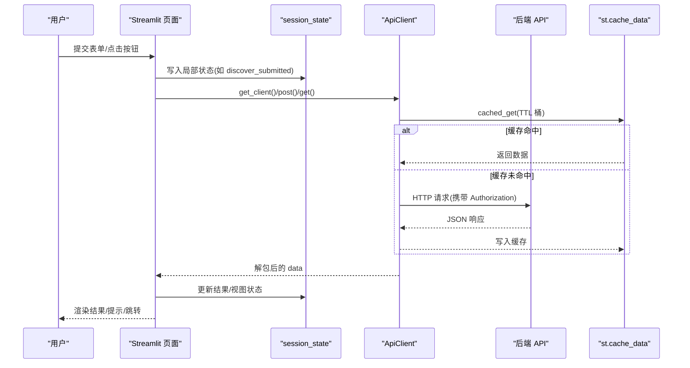

图示来源
- [frontend/pages/3_🎯_靶点发现.py:67-71](file://frontend/pages/3_🎯_靶点发现.py#L67-L71)
- [frontend/pages/3_🎯_靶点发现.py:84-100](file://frontend/pages/3_🎯_靶点发现.py#L84-L100)
- [frontend/api_client.py:186-236](file://frontend/api_client.py#L186-L236)
- [frontend/api_client.py:42-66](file://frontend/api_client.py#L42-L66)

## 详细组件分析

### 认证与会话状态
- 登录流程
  - 用户在登录表单输入邮箱/密码与 API 地址，成功后将 access_token、refresh_token、user_email 写入 session_state，并触发 rerun。
- 登出流程
  - 清除 access_token、refresh_token、user_email，触发 rerun。
- 鉴权守卫
  - 各页面顶部调用 require_auth()，未登录则提示并跳转首页。

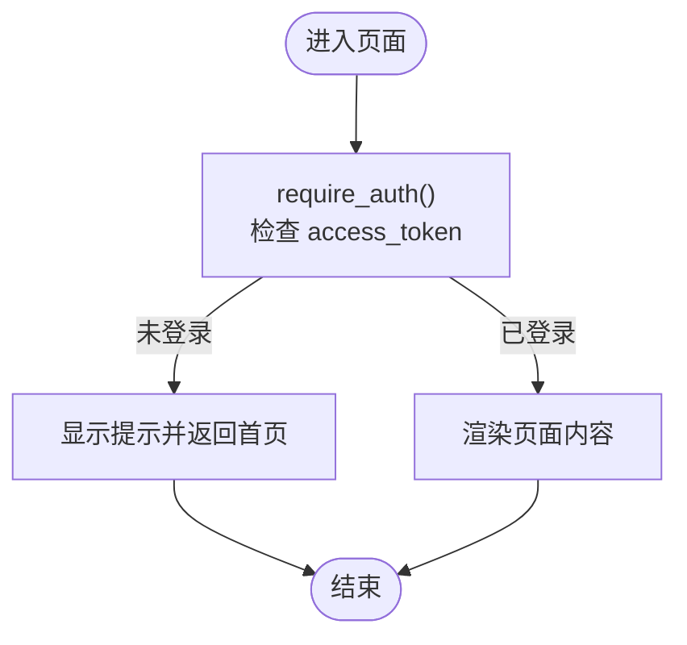

图示来源
- [frontend/auth.py:116-127](file://frontend/auth.py#L116-L127)
- [frontend/api_client.py:170-180](file://frontend/api_client.py#L170-L180)
- [frontend/pages/1_📁_项目管理.py:19-20](file://frontend/pages/1_📁_项目管理.py#L19-L20)

章节来源
- [frontend/auth.py:10-66](file://frontend/auth.py#L10-L66)
- [frontend/auth.py:116-127](file://frontend/auth.py#L116-L127)
- [frontend/api_client.py:170-180](file://frontend/api_client.py#L170-L180)

### 全局状态与导航
- 侧边栏根据 access_token 决定显示用户菜单或登录提示。
- 首页在未登录时展示登录表单与系统介绍；登录后展示健康状态与快速入口。

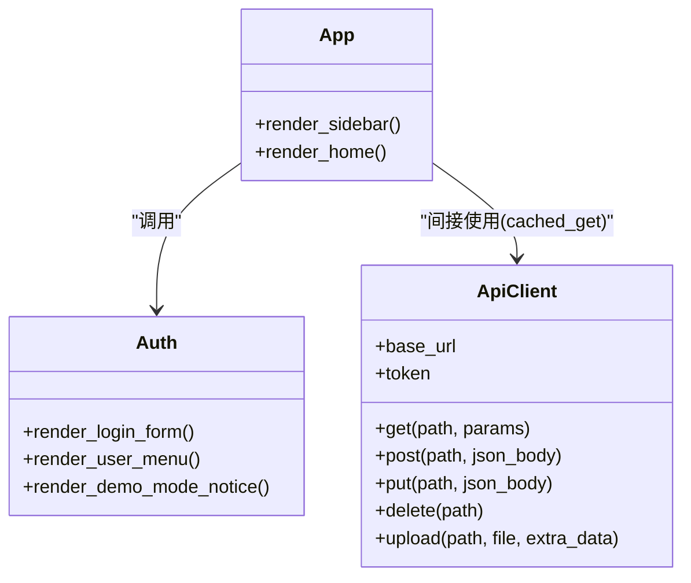

图示来源
- [frontend/app.py:43-64](file://frontend/app.py#L43-L64)
- [frontend/app.py:67-146](file://frontend/app.py#L67-L146)
- [frontend/auth.py:10-127](file://frontend/auth.py#L10-L127)
- [frontend/api_client.py:42-167](file://frontend/api_client.py#L42-L167)

章节来源
- [frontend/app.py:43-64](file://frontend/app.py#L43-L64)
- [frontend/app.py:67-146](file://frontend/app.py#L67-L146)

### 项目上下文与列表操作
- 项目创建/激活/暂停/归档均通过 ApiClient 调用后端接口，并在变更后调用 invalidate_cache() 使缓存失效，随后 rerun 刷新列表。
- 列表读取使用 cached_get 带 TTL 的短缓存，避免频繁请求。

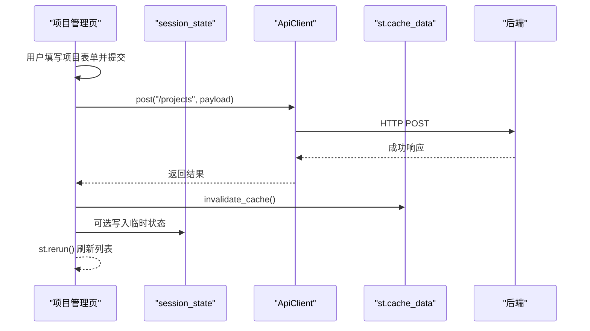

图示来源
- [frontend/pages/1_📁_项目管理.py:41-61](file://frontend/pages/1_📁_项目管理.py#L41-L61)
- [frontend/pages/1_📁_项目管理.py:64-76](file://frontend/pages/1_📁_项目管理.py#L64-L76)
- [frontend/api_client.py:239-251](file://frontend/api_client.py#L239-L251)

章节来源
- [frontend/pages/1_📁_项目管理.py:27-61](file://frontend/pages/1_📁_项目管理.py#L27-L61)
- [frontend/pages/1_📁_项目管理.py:64-130](file://frontend/pages/1_📁_项目管理.py#L64-L130)
- [frontend/api_client.py:186-236](file://frontend/api_client.py#L186-L236)

### 分析任务状态（靶点发现）
- 表单提交后将 genes、tier、project_id、max_targets 等写入 session_state，并设置 discover_submitted 标志位控制结果区渲染。
- 结果区根据标志位发起 /targets/discover 请求，并将结果渲染到界面。

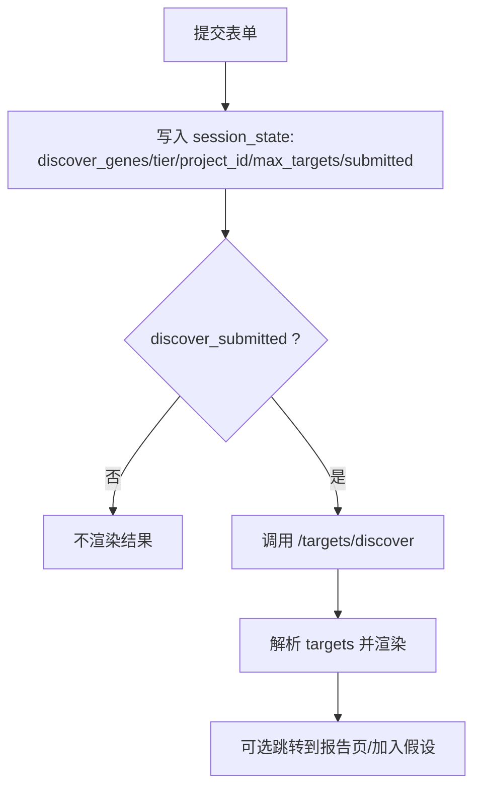

图示来源
- [frontend/pages/3_🎯_靶点发现.py:57-71](file://frontend/pages/3_🎯_靶点发现.py#L57-L71)
- [frontend/pages/3_🎯_靶点发现.py:74-100](file://frontend/pages/3_🎯_靶点发现.py#L74-L100)
- [frontend/pages/3_🎯_靶点发现.py:143-151](file://frontend/pages/3_🎯_靶点发现.py#L143-L151)

章节来源
- [frontend/pages/3_🎯_靶点发现.py:34-71](file://frontend/pages/3_🎯_靶点发现.py#L34-L71)
- [frontend/pages/3_🎯_靶点发现.py:74-151](file://frontend/pages/3_🎯_靶点发现.py#L74-L151)

### 分子评估（类药性/对接/ADMET）
- 三个子功能分别以 tab 组织，各自维护独立的 SMILES 等输入键。
- 提交后直接调用对应后端接口，渲染指标与提示信息。

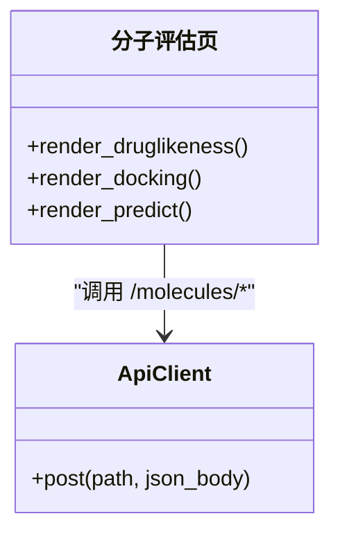

图示来源
- [frontend/pages/4_⚙️_分子评估.py:31-74](file://frontend/pages/4_⚙️_分子评估.py#L31-L74)
- [frontend/pages/4_⚙️_分子评估.py:76-106](file://frontend/pages/4_⚙️_分子评估.py#L76-L106)
- [frontend/pages/4_⚙️_分子评估.py:109-151](file://frontend/pages/4_⚙️_分子评估.py#L109-L151)

章节来源
- [frontend/pages/4_⚙️_分子评估.py:26-159](file://frontend/pages/4_⚙️_分子评估.py#L26-L159)

### 报告查看（列表与详情）
- 列表页通过 get("/reports") 获取报告清单，点击“查看详情”时将 view_report_id 写入 session_state 并 rerun。
- 详情页根据 view_report_id 拉取详情，并提供 CDISC 导出按钮。

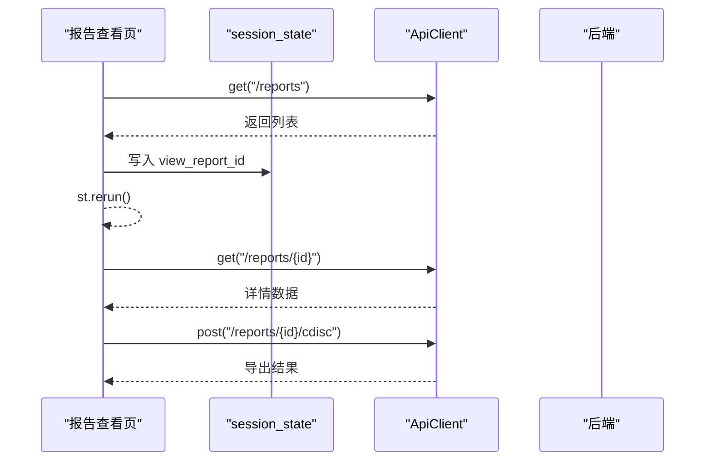

图示来源
- [frontend/pages/5_📊_报告查看.py:27-57](file://frontend/pages/5_📊_报告查看.py#L27-L57)
- [frontend/pages/5_📊_报告查看.py:60-106](file://frontend/pages/5_📊_报告查看.py#L60-L106)

章节来源
- [frontend/pages/5_📊_报告查看.py:27-112](file://frontend/pages/5_📊_报告查看.py#L27-L112)

### 假设管理（列表与对比）
- 支持创建、运行分析、标记验证、淘汰、删除等操作，均通过 ApiClient 调用后端。
- 对比分析页多选假设后调用 /hypotheses/compare 生成对比表与建议。

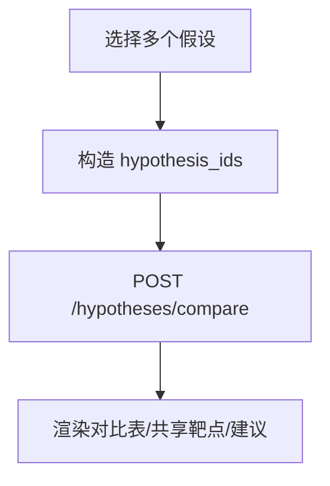

图示来源
- [frontend/pages/6_💡_假设管理.py:135-191](file://frontend/pages/6_💡_假设管理.py#L135-L191)

章节来源
- [frontend/pages/6_💡_假设管理.py:29-133](file://frontend/pages/6_💡_假设管理.py#L29-L133)
- [frontend/pages/6_💡_假设管理.py:135-191](file://frontend/pages/6_💡_假设管理.py#L135-L191)

### AI 问答（聊天历史）
- 使用 chat_history 数组作为会话级状态，按角色渲染消息与引用源。
- 每次提问后追加用户与助手消息，支持清空历史。

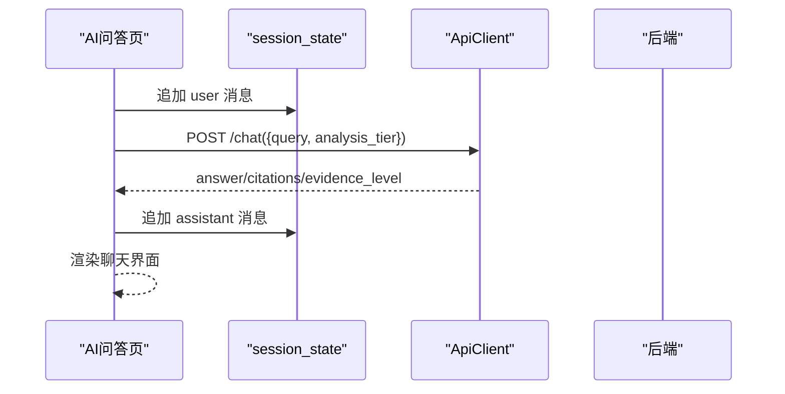

图示来源
- [frontend/pages/7_🤖_AI问答.py:36-37](file://frontend/pages/7_🤖_AI问答.py#L36-L37)
- [frontend/pages/7_🤖_AI问答.py:72-110](file://frontend/pages/7_🤖_AI问答.py#L72-L110)
- [frontend/pages/7_🤖_AI问答.py:131-134](file://frontend/pages/7_🤖_AI问答.py#L131-L134)

章节来源
- [frontend/pages/7_🤖_AI问答.py:35-139](file://frontend/pages/7_🤖_AI问答.py#L35-L139)

## 依赖关系分析
- 页面模块依赖认证与 API 客户端，形成“页面 → 认证/客户端 → 后端”的单向依赖。
- 缓存层通过 time 桶与 key_prefix 隔离不同模块的缓存空间，降低跨模块污染风险。

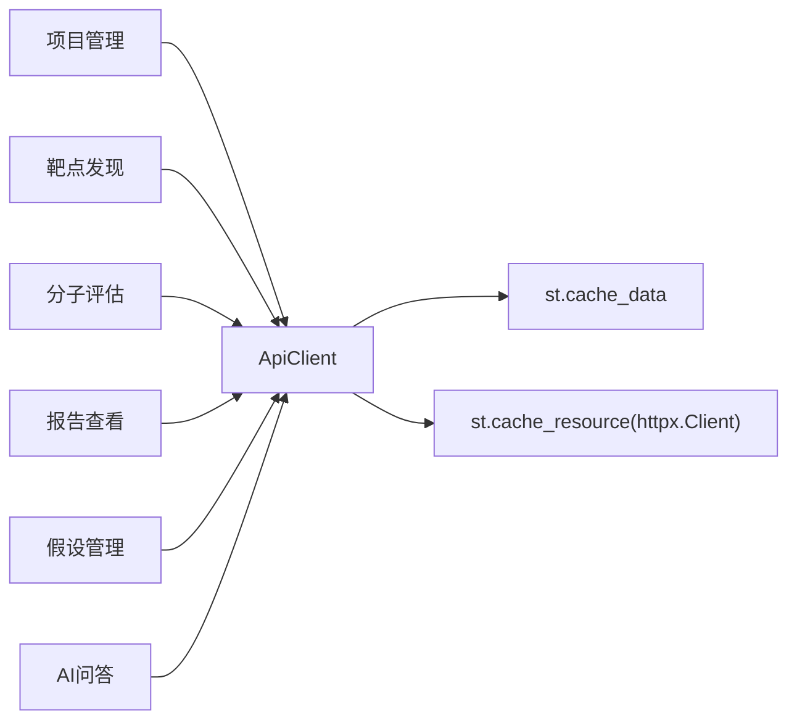

图示来源
- [frontend/api_client.py:24-39](file://frontend/api_client.py#L24-L39)
- [frontend/api_client.py:186-236](file://frontend/api_client.py#L186-L236)
- [frontend/pages/1_📁_项目管理.py:14-20](file://frontend/pages/1_📁_项目管理.py#L14-L20)
- [frontend/pages/3_🎯_靶点发现.py:14-20](file://frontend/pages/3_🎯_靶点发现.py#L14-L20)
- [frontend/pages/4_⚙️_分子评估.py:14-20](file://frontend/pages/4_⚙️_分子评估.py#L14-L20)
- [frontend/pages/5_📊_报告查看.py:14-20](file://frontend/pages/5_📊_报告查看.py#L14-L20)
- [frontend/pages/6_💡_假设管理.py:14-20](file://frontend/pages/6_💡_假设管理.py#L14-L20)
- [frontend/pages/7_🤖_AI问答.py:14-20](file://frontend/pages/7_🤖_AI问答.py#L14-L20)

章节来源
- [frontend/api_client.py:24-39](file://frontend/api_client.py#L24-L39)
- [frontend/api_client.py:186-236](file://frontend/api_client.py#L186-L236)

## 性能考虑
- 连接池复用
  - 使用 @st.cache_resource 创建全局 httpx.Client，减少握手开销与端口占用。
- 请求级缓存
  - 使用 @st.cache_data 结合时间桶 TTL 对 GET 请求做短期缓存，降低后端压力。
  - 通过 key_prefix 区分不同模块缓存，避免相互干扰。
- 批量与分页
  - 列表接口采用 page/page_size 分页，避免一次性加载过多数据。
- 大对象与长任务
  - 对接/深度分析等耗时任务仅提交任务，前端通过 spinner 提示，避免阻塞 UI。
- 缓存失效策略
  - 写操作后调用 invalidate_cache() 主动失效，确保列表一致性。

章节来源
- [frontend/api_client.py:24-39](file://frontend/api_client.py#L24-L39)
- [frontend/api_client.py:186-236](file://frontend/api_client.py#L186-L236)
- [frontend/pages/1_📁_项目管理.py:58-59](file://frontend/pages/1_📁_项目管理.py#L58-L59)
- [frontend/pages/4_⚙️_分子评估.py:90-106](file://frontend/pages/4_⚙️_分子评估.py#L90-L106)

## 故障排查指南
- 无法连接后端
  - 现象：登录失败、列表加载失败、问答失败等。
  - 排查：确认 api_base_url 配置正确、后端服务是否启动、网络连通性。
- 鉴权失败
  - 现象：访问受保护页面被重定向至首页。
  - 排查：检查 access_token 是否存在且有效，必要时重新登录。
- 缓存导致数据不一致
  - 现象：修改后列表未刷新。
  - 排查：确认写操作后是否调用 invalidate_cache()，必要时手动清理缓存。
- 聊天历史异常
  - 现象：消息重复或未显示。
  - 排查：检查 chat_history 初始化与追加逻辑，必要时清空历史重试。

章节来源
- [frontend/auth.py:32-66](file://frontend/auth.py#L32-L66)
- [frontend/api_client.py:170-180](file://frontend/api_client.py#L170-L180)
- [frontend/api_client.py:239-251](file://frontend/api_client.py#L239-L251)
- [frontend/pages/7_🤖_AI问答.py:36-37](file://frontend/pages/7_🤖_AI问答.py#L36-L37)

## 结论
本系统在前端采用“全局认证 + 页面局部状态 + 请求级缓存”的分层状态管理模式：
- 全局状态聚焦认证与基础配置，保证跨页面一致性与安全性。
- 局部状态聚焦单页交互与结果展示，降低耦合度。
- 缓存层兼顾性能与一致性，通过 TTL 与显式失效策略平衡实时性与负载。
遵循本文的最佳实践与排障建议，可在复杂业务场景下保持稳定的用户体验与可维护性。

## 附录

### 状态键清单与用途
- 认证相关
  - access_token：JWT 访问令牌
  - refresh_token：刷新令牌
  - user_email：当前用户邮箱
  - api_base_url：后端 API 基础地址
- 页面局部
  - 项目管理：proj_name/proj_desc/proj_disease/proj_status/proj_priority
  - 靶点发现：discover_genes/discover_tier/discover_project_id/discover_max/discover_submitted
  - 分子评估：druglike_smiles/dock_smiles/dock_pdb/dock_target/dock_poses/predict_smiles
  - 报告查看：view_report_id
  - 假设管理：hypo_name/hypo_project/hypo_priority/hypo_targets/hypo_desc
  - AI 问答：chat_history/chat_tier

章节来源
- [frontend/auth.py:54-62](file://frontend/auth.py#L54-L62)
- [frontend/pages/1_📁_项目管理.py:29-39](file://frontend/pages/1_📁_项目管理.py#L29-L39)
- [frontend/pages/3_🎯_靶点发现.py:67-71](file://frontend/pages/3_🎯_靶点发现.py#L67-L71)
- [frontend/pages/4_⚙️_分子评估.py:33-86](file://frontend/pages/4_⚙️_分子评估.py#L33-L86)
- [frontend/pages/5_📊_报告查看.py:56-57](file://frontend/pages/5_📊_报告查看.py#L56-L57)
- [frontend/pages/6_💡_假设管理.py:33-46](file://frontend/pages/6_💡_假设管理.py#L33-L46)
- [frontend/pages/7_🤖_AI问答.py:36-37](file://frontend/pages/7_🤖_AI问答.py#L36-L37)

### 状态更新最佳实践
- 单一职责：每个页面只维护自身所需的状态，避免跨页面共享复杂对象。
- 原子更新：一次事件只更新必要字段，减少不必要的 rerun。
- 显式失效：写操作后立即 invalidate_cache()，再 rerun 刷新。
- 安全校验：所有敏感操作前用 require_auth() 拦截。
- 错误处理：对网络与解析异常给出友好提示，保留关键上下文便于定位。

章节来源
- [frontend/api_client.py:170-180](file://frontend/api_client.py#L170-L180)
- [frontend/pages/1_📁_项目管理.py:58-61](file://frontend/pages/1_📁_项目管理.py#L58-L61)

### 调试方法
- 打印 session_state 快照：在关键节点输出当前状态键值，辅助定位缺失或异常。
- 分步 rerun：将复杂流程拆分为小步骤，逐步验证状态流转。
- 缓存观察：通过调整 TTL 与 key_prefix 验证缓存命中情况。

[本节为通用指导，无需源码引用]