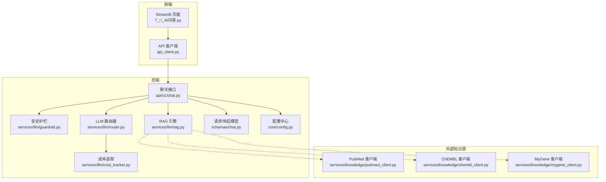
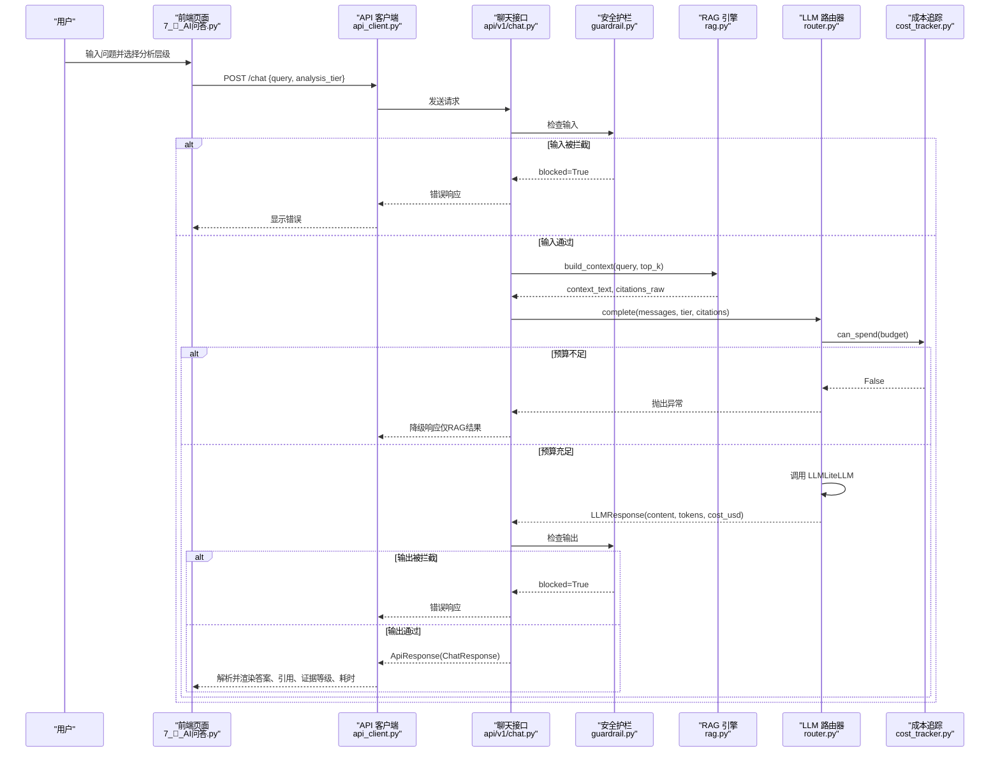
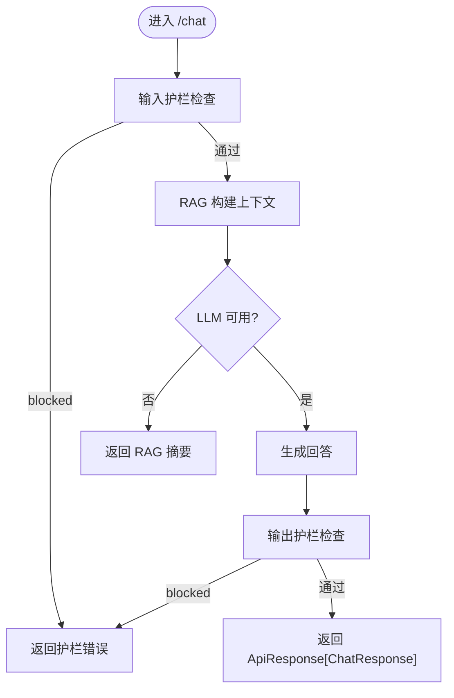
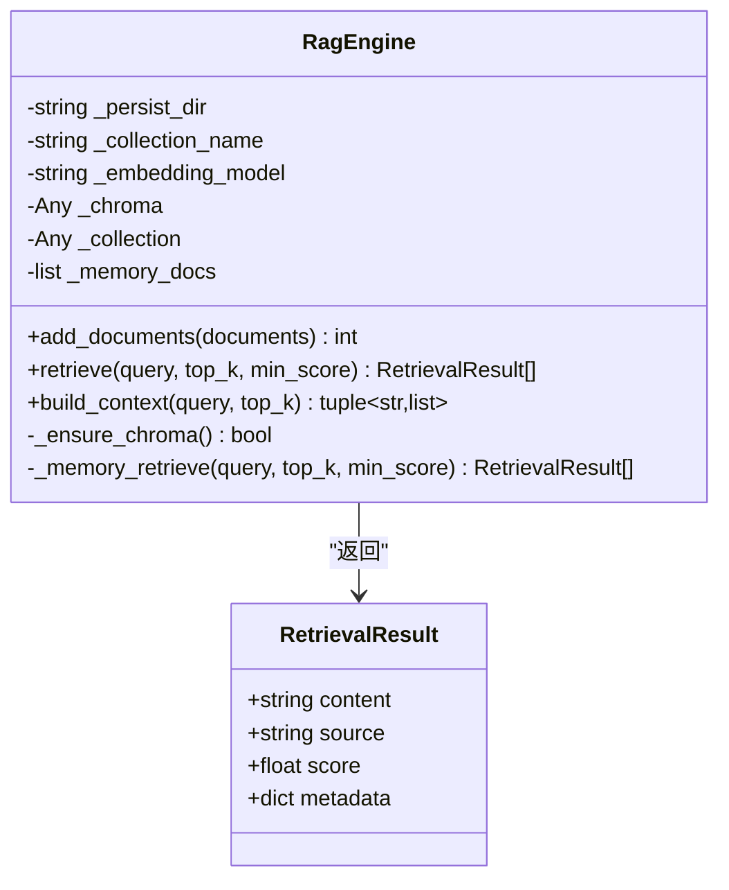
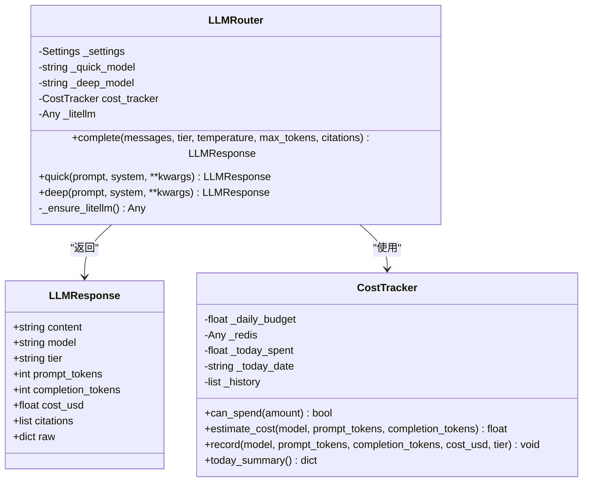
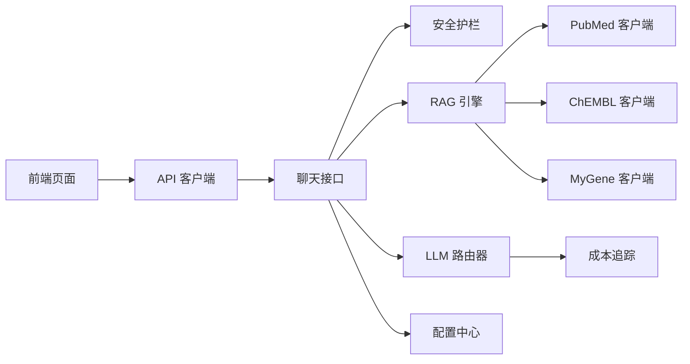

# AI问答页面

<cite>
**本文引用的文件**   
- [7_🤖_AI问答.py](file://frontend/pages/7_🤖_AI问答.py)
- [api_client.py](file://frontend/api_client.py)
- [chat.py](file://backend/app/api/v1/chat.py)
- [rag.py](file://backend/app/services/llm/rag.py)
- [router.py](file://backend/app/services/llm/router.py)
- [guardrail.py](file://backend/app/services/llm/guardrail.py)
- [cost_tracker.py](file://backend/app/services/llm/cost_tracker.py)
- [chat.py](file://backend/app/schemas/chat.py)
- [config.py](file://backend/app/core/config.py)
- [pubmed_client.py](file://backend/app/services/knowledge/pubmed_client.py)
- [chembl_client.py](file://backend/app/services/knowledge/chembl_client.py)
- [mygene_client.py](file://backend/app/services/knowledge/mygene_client.py)
- [evidence.py](file://backend/app/utils/evidence.py)
</cite>

## 目录
1. [简介](#简介)
2. [项目结构](#项目结构)
3. [核心组件](#核心组件)
4. [架构总览](#架构总览)
5. [详细组件分析](#详细组件分析)
6. [依赖关系分析](#依赖关系分析)
7. [性能与成本控制](#性能与成本控制)
8. [故障排查指南](#故障排查指南)
9. [结论](#结论)
10. [附录](#附录)

## 简介
本文件为“AI问答页面”的详细开发文档，面向药物研发领域的智能问答系统。系统基于检索增强生成（RAG）实现：对话界面、上下文管理、知识库检索、多模型路由、安全护栏、证据分级与引用来源展示、成本追踪等。支持快速/深度两种分析层级，自动选择合适的大语言模型，并在LLM不可用时降级返回检索结果摘要。

## 项目结构
前端采用 Streamlit 单页应用，后端使用 FastAPI 提供 REST API。AI问答相关的关键路径如下：
- 前端页面：pages/7_🤖_AI问答.py
- 前端客户端封装：frontend/api_client.py
- 后端聊天接口：backend/app/api/v1/chat.py
- RAG引擎：backend/app/services/llm/rag.py
- LLM路由器：backend/app/services/llm/router.py
- 安全护栏：backend/app/services/llm/guardrail.py
- 成本追踪：backend/app/services/llm/cost_tracker.py
- 数据模型：backend/app/schemas/chat.py
- 配置中心：backend/app/core/config.py
- 外部知识源客户端：PubMed/ChEMBL/MyGene

图表来源
- [7_🤖_AI问答.py:1-139](file://frontend/pages/7_🤖_AI问答.py#L1-L139)
- [api_client.py:1-251](file://frontend/api_client.py#L1-L251)
- [chat.py:1-177](file://backend/app/api/v1/chat.py#L1-L177)
- [rag.py:1-238](file://backend/app/services/llm/rag.py#L1-L238)
- [router.py:1-198](file://backend/app/services/llm/router.py#L1-L198)
- [guardrail.py:1-168](file://backend/app/services/llm/guardrail.py#L1-L168)
- [cost_tracker.py:1-167](file://backend/app/services/llm/cost_tracker.py#L1-L167)
- [chat.py:1-81](file://backend/app/schemas/chat.py#L1-L81)
- [config.py:1-144](file://backend/app/core/config.py#L1-L144)
- [pubmed_client.py:1-125](file://backend/app/services/knowledge/pubmed_client.py#L1-L125)
- [chembl_client.py:1-127](file://backend/app/services/knowledge/chembl_client.py#L1-L127)
- [mygene_client.py:1-97](file://backend/app/services/knowledge/mygene_client.py#L1-L97)

章节来源
- [7_🤖_AI问答.py:1-139](file://frontend/pages/7_🤖_AI问答.py#L1-L139)
- [api_client.py:1-251](file://frontend/api_client.py#L1-L251)
- [chat.py:1-177](file://backend/app/api/v1/chat.py#L1-L177)

## 核心组件
- 对话界面与历史管理
  - 前端维护会话状态中的聊天历史，渲染用户与助手消息，并展示引用源与证据等级。
  - 示例问题快捷按钮用于快速发起典型药物研发相关问题。
- 安全护栏
  - 输入/输出双重检查，拦截违规内容、提示词注入、非医学话题；对敏感术语进行警告；脱敏个人身份信息。
- RAG 检索增强
  - 优先使用 Chroma 向量库进行相似度检索；不可用时降级为内存关键词检索（Jaccard）。
  - 构建 LLM 上下文文本与引用元数据列表。
- LLM 多模型路由
  - 根据分析层级（quick/deep）选择不同模型，统一通过 LiteLLM 调用。
  - 预算控制：在调用前检查当日预算是否充足，记录 token 用量与估算费用。
- 数据模型与响应信封
  - 统一的 ChatRequest/ChatResponse/Citation 等 Pydantic 模型，校验分析层级与证据等级。
- 外部知识源
  - PubMed/ChEMBL/MyGene 客户端提供文献、分子活性、基因信息检索能力，作为 RAG 的知识来源之一。

章节来源
- [7_🤖_AI问答.py:1-139](file://frontend/pages/7_🤖_AI问答.py#L1-L139)
- [guardrail.py:1-168](file://backend/app/services/llm/guardrail.py#L1-L168)
- [rag.py:1-238](file://backend/app/services/llm/rag.py#L1-L238)
- [router.py:1-198](file://backend/app/services/llm/router.py#L1-L198)
- [chat.py:1-81](file://backend/app/schemas/chat.py#L1-L81)
- [pubmed_client.py:1-125](file://backend/app/services/knowledge/pubmed_client.py#L1-L125)
- [chembl_client.py:1-127](file://backend/app/services/knowledge/chembl_client.py#L1-L127)
- [mygene_client.py:1-97](file://backend/app/services/knowledge/mygene_client.py#L1-L97)

## 架构总览
下图展示了从用户提问到回答返回的完整流程，包括安全护栏、RAG 检索、LLM 路由与成本追踪。

图表来源
- [7_🤖_AI问答.py:1-139](file://frontend/pages/7_🤖_AI问答.py#L1-L139)
- [api_client.py:1-251](file://frontend/api_client.py#L1-L251)
- [chat.py:1-177](file://backend/app/api/v1/chat.py#L1-L177)
- [guardrail.py:1-168](file://backend/app/services/llm/guardrail.py#L1-L168)
- [rag.py:1-238](file://backend/app/services/llm/rag.py#L1-L238)
- [router.py:1-198](file://backend/app/services/llm/router.py#L1-L198)
- [cost_tracker.py:1-167](file://backend/app/services/llm/cost_tracker.py#L1-L167)

## 详细组件分析

### 前端对话界面与上下文管理
- 会话历史
  - 使用 st.session_state 维护 chat_history，包含角色、内容、引用、证据等级等字段。
  - 渲染时展开引用源，显示来源标识与相似度分数；底部标注证据等级、模型名与耗时。
- 分析层级选择
  - quick：快速层，适合简单问答，限制更严格（token 更少、预算更低）。
  - deep：深度层，适合综合推理与报告生成，允许更长输出与更高预算。
- 示例问题
  - 提供常见药物研发问题，一键填充至聊天历史并触发重新渲染。

章节来源
- [7_🤖_AI问答.py:1-139](file://frontend/pages/7_🤖_AI问答.py#L1-L139)

### 后端聊天接口与安全护栏
- 端点设计
  - POST /chat：接收 ChatRequest，返回 ApiResponse[ChatResponse]。
  - GET /chat/history：当前返回空列表，后续版本将持久化。
- 处理流程
  - 输入护栏：拒绝违规、离题、提示词注入；脱敏 PII。
  - RAG 上下文：按层级选择 top_k（quick=5，deep=20），构建上下文与引用列表。
  - LLM 生成：组装 system/user 消息，温度较低以保证稳定性；若失败则降级返回 RAG 摘要。
  - 输出护栏：再次检查输出，避免不当建议或剂量处方。
- 响应字段
  - answer、citations、evidence_level、cost_usd、tokens_in/out、guardrail_triggered/rule。

图表来源
- [chat.py:1-177](file://backend/app/api/v1/chat.py#L1-L177)
- [guardrail.py:1-168](file://backend/app/services/llm/guardrail.py#L1-L168)
- [rag.py:1-238](file://backend/app/services/llm/rag.py#L1-L238)

章节来源
- [chat.py:1-177](file://backend/app/api/v1/chat.py#L1-L177)
- [guardrail.py:1-168](file://backend/app/services/llm/guardrail.py#L1-L168)

### RAG 引擎与知识库检索
- 向量检索
  - 使用 Chroma 集合存储文档，计算余弦相似度，返回 top-k 结果。
  - 距离转相似度：score = max(0, 1 - distance)。
- 降级策略
  - 当 chromadb 未安装或初始化失败时，回退到内存关键词检索（Jaccard）。
- 上下文构建
  - 将检索结果拼接为结构化文本，附带来源与相似度，供 LLM 参考。

图表来源
- [rag.py:1-238](file://backend/app/services/llm/rag.py#L1-L238)

章节来源
- [rag.py:1-238](file://backend/app/services/llm/rag.py#L1-L238)

### LLM 路由器与多模型路由
- 模型选择
  - quick：默认 gpt-4o-mini（可配置覆盖）。
  - deep：默认 gpt-4o（可配置覆盖）。
- 调用流程
  - 通过 LiteLLM 异步完成调用，解析 usage 统计 token 数。
  - 估算成本并记录到 CostTracker，支持按 tier 与模型维度汇总。
- 预算控制
  - 调用前检查 can_spend，超支直接拒绝并返回错误。

图表来源
- [router.py:1-198](file://backend/app/services/llm/router.py#L1-L198)
- [cost_tracker.py:1-167](file://backend/app/services/llm/cost_tracker.py#L1-L167)

章节来源
- [router.py:1-198](file://backend/app/services/llm/router.py#L1-L198)
- [cost_tracker.py:1-167](file://backend/app/services/llm/cost_tracker.py#L1-L167)

### 数据模型与响应格式
- ChatRequest
  - project_id、message、analysis_tier（quick/deep）、context_dataset_ids。
  - 校验 analysis_tier 必须在允许集合内。
- ChatResponse
  - answer、citations、evidence_level、cost_usd、tokens_in/out、guardrail_triggered/rule、generated_code（可选）。
  - evidence_level 必须为 I/II/III/IV 之一。
- Citation
  - type、id、url、title。

章节来源
- [chat.py:1-81](file://backend/app/schemas/chat.py#L1-L81)

### 外部知识源集成（PubMed/ChEMBL/MyGene）
- PubMed
  - 通过 E-utilities 检索文献（esearch/esummary/efetch），返回 pmid、title、authors、journal、pubdate 等。
- ChEMBL
  - 查询分子详情、靶点活性（IC50/Ki/Kd）、已批准药物适应症。
- MyGene
  - 查询基因信息（symbol/HGNC/Ensembl ID），支持批量查询。

章节来源
- [pubmed_client.py:1-125](file://backend/app/services/knowledge/pubmed_client.py#L1-L125)
- [chembl_client.py:1-127](file://backend/app/services/knowledge/chembl_client.py#L1-L127)
- [mygene_client.py:1-97](file://backend/app/services/knowledge/mygene_client.py#L1-L97)

### 证据分级工具
- classify_evidence_level
  - 依据证据类型与载荷推断等级（I/II/III/IV），支持显式覆盖与 is_approved 判断。
- aggregate_evidence_levels
  - 统计各等级数量分布。
- highest_evidence_level
  - 返回最高等级（I > II > III > IV）。

章节来源
- [evidence.py:1-103](file://backend/app/utils/evidence.py#L1-L103)

## 依赖关系分析
- 前端依赖
  - Streamlit 页面依赖 api_client 进行 HTTP 调用，依赖 session_state 管理对话历史。
- 后端依赖
  - 聊天接口依赖安全护栏、RAG、LLM 路由器与成本追踪。
  - RAG 依赖 Chroma（可选）与外部知识源客户端（PubMed/ChEMBL/MyGene）。
  - LLM 路由器依赖 LiteLLM 与配置中心。
- 配置与环境
  - 所有关键配置项（数据库、Redis、S3、Chroma、LLM、外部服务 URL、CORS 等）由 Settings 集中管理。

图表来源
- [7_🤖_AI问答.py:1-139](file://frontend/pages/7_🤖_AI问答.py#L1-L139)
- [api_client.py:1-251](file://frontend/api_client.py#L1-L251)
- [chat.py:1-177](file://backend/app/api/v1/chat.py#L1-L177)
- [guardrail.py:1-168](file://backend/app/services/llm/guardrail.py#L1-L168)
- [rag.py:1-238](file://backend/app/services/llm/rag.py#L1-L238)
- [router.py:1-198](file://backend/app/services/llm/router.py#L1-L198)
- [cost_tracker.py:1-167](file://backend/app/services/llm/cost_tracker.py#L1-L167)
- [pubmed_client.py:1-125](file://backend/app/services/knowledge/pubmed_client.py#L1-L125)
- [chembl_client.py:1-127](file://backend/app/services/knowledge/chembl_client.py#L1-L127)
- [mygene_client.py:1-97](file://backend/app/services/knowledge/mygene_client.py#L1-L97)
- [config.py:1-144](file://backend/app/core/config.py#L1-L144)

章节来源
- [config.py:1-144](file://backend/app/core/config.py#L1-L144)

## 性能与成本控制
- 连接池复用
  - 前端 httpx.Client 使用共享实例与连接池，减少握手开销。
- 缓存机制
  - 前端提供带 TTL 的缓存 GET 辅助函数，降低重复请求压力。
- 向量检索优化
  - Chroma 使用 HNSW 索引与余弦空间，提升检索效率；阈值过滤低相似度结果。
- 模型参数调优
  - 低温度（0.2）保证输出稳定性；按层级设置最大 token 数以平衡质量与成本。
- 预算控制
  - 调用前检查当日预算，超支即拒绝；记录每次调用成本并按模型/层级汇总。

章节来源
- [api_client.py:1-251](file://frontend/api_client.py#L1-L251)
- [rag.py:1-238](file://backend/app/services/llm/rag.py#L1-L238)
- [router.py:1-198](file://backend/app/services/llm/router.py#L1-L198)
- [cost_tracker.py:1-167](file://backend/app/services/llm/cost_tracker.py#L1-L167)

## 故障排查指南
- 登录与鉴权
  - 未登录时前端会提示返回首页登录；确保 access_token 存在于 session_state。
- LLM 不可用
  - 若 LLM 调用失败，接口将降级返回 RAG 检索结果摘要；检查 OPENAI_API_KEY/ANTHROPIC_API_KEY 配置与网络连通性。
- 预算超支
  - 若超出 daily budget，将抛出错误；调整 llm_max_budget_usd 或等待次日重置。
- 向量库不可用
  - 若 chromadb 未安装或初始化失败，RAG 将降级为内存关键词检索；安装依赖或修复持久化目录权限。
- 安全护栏触发
  - 输入或输出被拦截时，返回 guardrail_triggered 与规则说明；修改提示词以避免违规模式。

章节来源
- [7_🤖_AI问答.py:1-139](file://frontend/pages/7_🤖_AI问答.py#L1-L139)
- [api_client.py:1-251](file://frontend/api_client.py#L1-L251)
- [chat.py:1-177](file://backend/app/api/v1/chat.py#L1-L177)
- [guardrail.py:1-168](file://backend/app/services/llm/guardrail.py#L1-L168)
- [rag.py:1-238](file://backend/app/services/llm/rag.py#L1-L238)
- [router.py:1-198](file://backend/app/services/llm/router.py#L1-L198)
- [cost_tracker.py:1-167](file://backend/app/services/llm/cost_tracker.py#L1-L167)

## 结论
该 AI 问答系统围绕“安全—检索—生成—成本”的主线构建，结合药物研发领域的外部知识源，提供具备引用来源与证据等级的智能问答体验。通过多模型路由与预算控制，系统在质量与成本之间取得良好平衡；同时提供完善的降级策略与错误处理，保障可用性。

## 附录
- 配置项要点（部分）
  - LLM：openai_api_key、anthropic_api_key、llm_default_model、llm_deep_model、llm_max_budget_usd、llm_quick_budget_usd。
  - 向量库：chroma_persist_dir。
  - 外部服务：pubmed_base_url、chembl_base_url、mygene_base_url、ncbi_email。
  - CORS：cors_origins。

章节来源
- [config.py:1-144](file://backend/app/core/config.py#L1-L144)