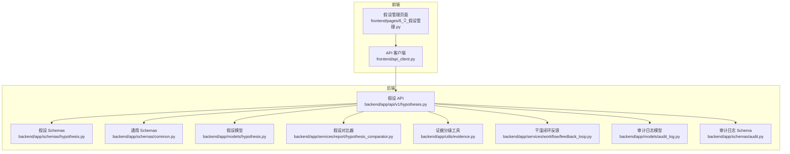
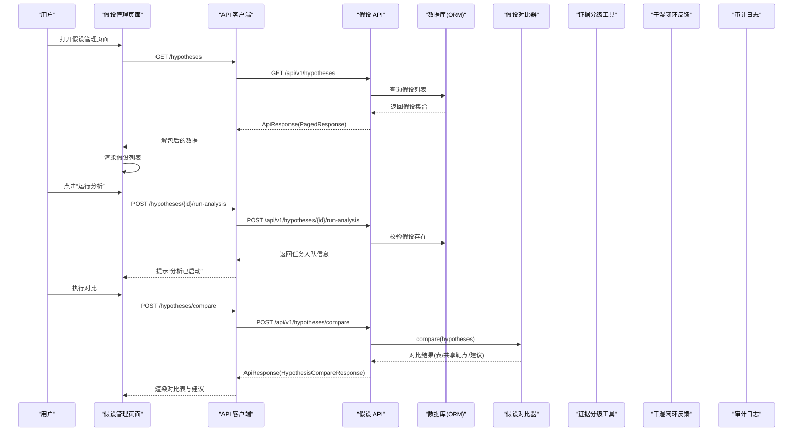
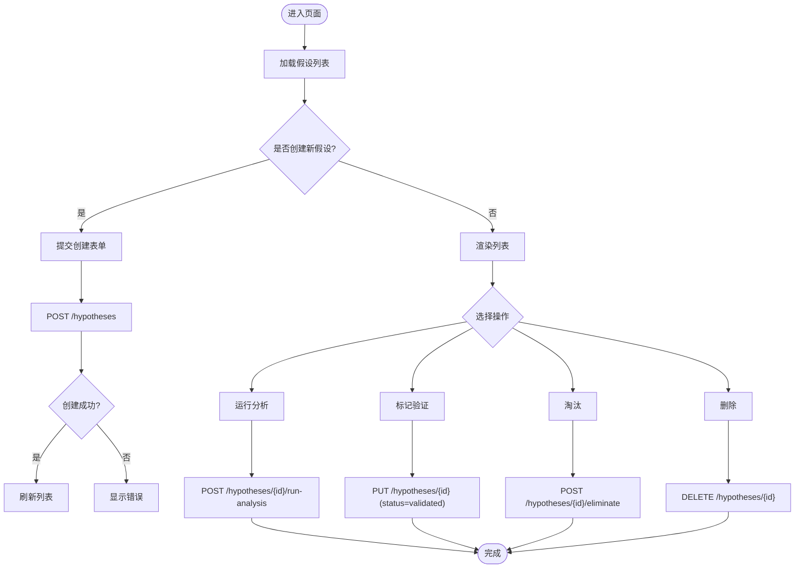
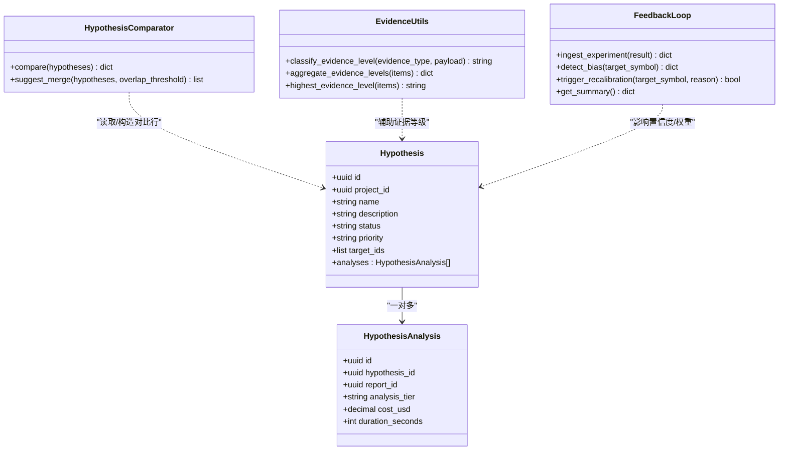
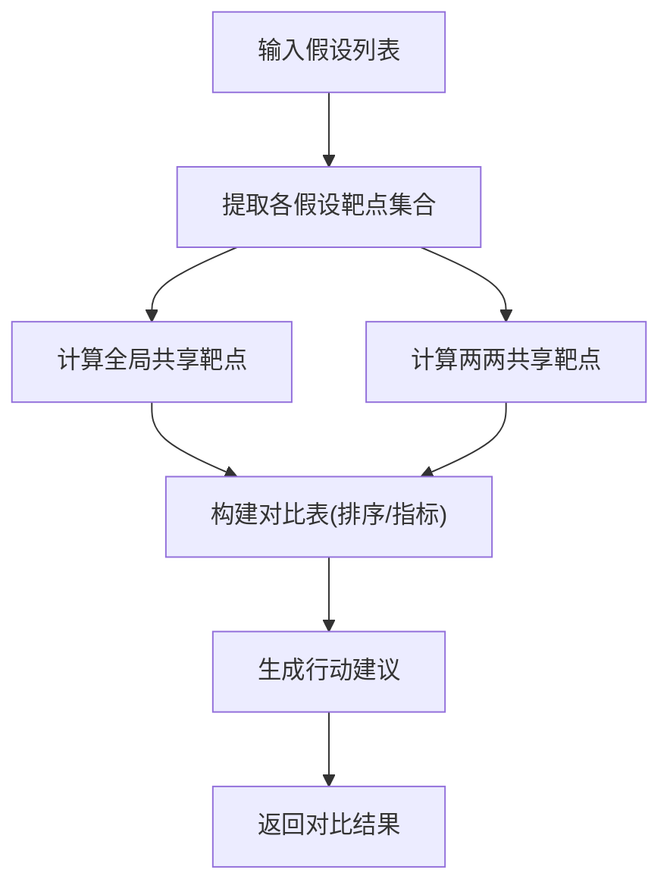
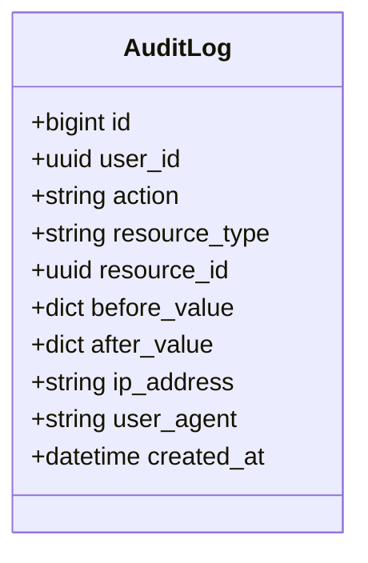
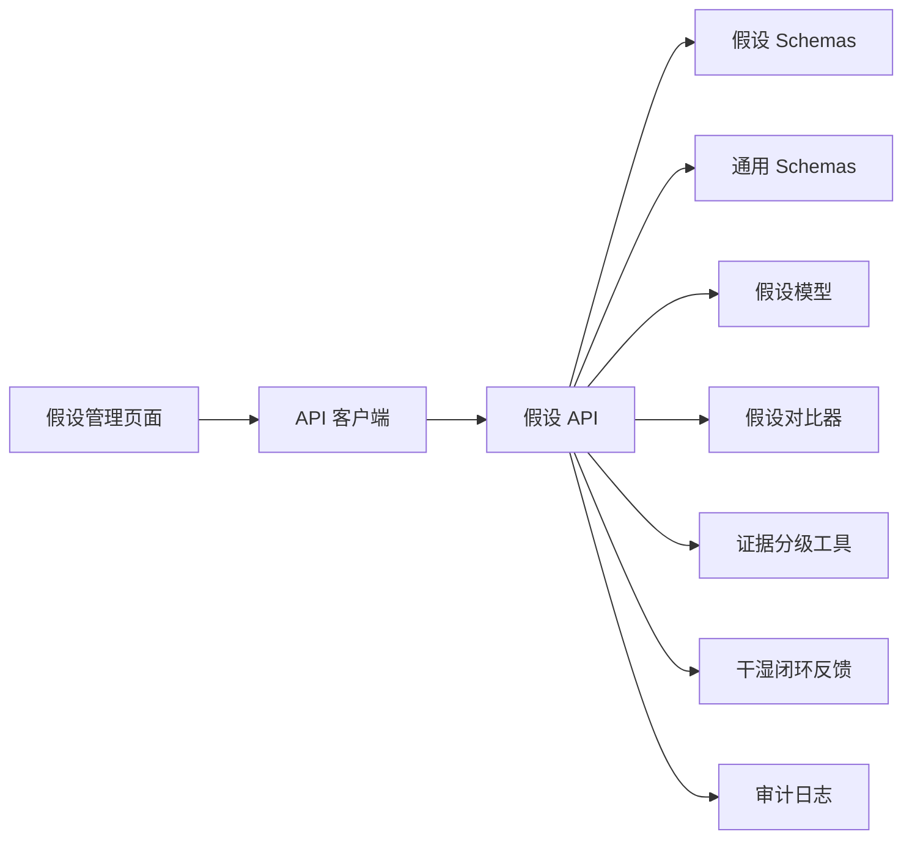

# 假设管理页面

<cite>
**本文引用的文件**   
- [frontend/pages/6_💡_假设管理.py](file://frontend/pages/6_💡_假设管理.py)
- [backend/app/api/v1/hypotheses.py](file://backend/app/api/v1/hypotheses.py)
- [backend/app/models/hypothesis.py](file://backend/app/models/hypothesis.py)
- [backend/app/schemas/hypothesis.py](file://backend/app/schemas/hypothesis.py)
- [backend/app/schemas/common.py](file://backend/app/schemas/common.py)
- [backend/app/services/report/hypothesis_comparator.py](file://backend/app/services/report/hypothesis_comparator.py)
- [backend/app/utils/evidence.py](file://backend/app/utils/evidence.py)
- [backend/app/services/workflow/feedback_loop.py](file://backend/app/services/workflow/feedback_loop.py)
- [backend/app/models/audit_log.py](file://backend/app/models/audit_log.py)
- [backend/app/schemas/audit.py](file://backend/app/schemas/audit.py)
- [frontend/api_client.py](file://frontend/api_client.py)
</cite>

## 目录
1. [引言](#引言)
2. [项目结构](#项目结构)
3. [核心组件](#核心组件)
4. [架构总览](#架构总览)
5. [详细组件分析](#详细组件分析)
6. [依赖关系分析](#依赖关系分析)
7. [性能与可扩展性](#性能与可扩展性)
8. [故障排查指南](#故障排查指南)
9. [结论](#结论)
10. [附录：API 与数据模型](#附录api-与数据模型)

## 引言
本文件面向“假设管理”页面的开发与集成，覆盖科学假设的创建、编辑、验证、比较全流程；并给出假设类型定义、证据支持度评估、冲突检测、版本历史管理方案；同时提供团队协作编辑、评论讨论、审批流程、知识沉淀的实现建议，以及推理引擎集成、证据链构建、可视化关系图、导出分享的整体方案。文档以现有代码为基础，结合可落地的扩展设计，帮助团队快速实现高质量交付。

## 项目结构
假设管理功能由前端 Streamlit 页面与后端 FastAPI 服务协同完成，核心路径如下：
- 前端页面：负责用户交互（创建、列表、对比）、调用 API、渲染结果
- 后端 API：提供假设 CRUD、运行分析、合并、淘汰、对比等接口
- 领域模型：假设与假设分析记录的数据结构与关系
- 业务服务：假设对比器、证据分级工具、干湿闭环反馈机制
- 审计日志：不可篡改的操作记录，用于版本历史与合规追溯

图表来源
- [frontend/pages/6_💡_假设管理.py:1-197](file://frontend/pages/6_💡_假设管理.py#L1-L197)
- [backend/app/api/v1/hypotheses.py:1-273](file://backend/app/api/v1/hypotheses.py#L1-L273)
- [backend/app/models/hypothesis.py:1-66](file://backend/app/models/hypothesis.py#L1-L66)
- [backend/app/schemas/hypothesis.py:1-119](file://backend/app/schemas/hypothesis.py#L1-L119)
- [backend/app/schemas/common.py:1-158](file://backend/app/schemas/common.py#L1-L158)
- [backend/app/services/report/hypothesis_comparator.py:1-181](file://backend/app/services/report/hypothesis_comparator.py#L1-L181)
- [backend/app/utils/evidence.py:1-103](file://backend/app/utils/evidence.py#L1-L103)
- [backend/app/services/workflow/feedback_loop.py:1-281](file://backend/app/services/workflow/feedback_loop.py#L1-L281)
- [backend/app/models/audit_log.py:1-45](file://backend/app/models/audit_log.py#L1-L45)
- [backend/app/schemas/audit.py:1-39](file://backend/app/schemas/audit.py#L1-L39)
- [frontend/api_client.py:1-251](file://frontend/api_client.py#L1-L251)

章节来源
- [frontend/pages/6_💡_假设管理.py:1-197](file://frontend/pages/6_💡_假设管理.py#L1-L197)
- [backend/app/api/v1/hypotheses.py:1-273](file://backend/app/api/v1/hypotheses.py#L1-L273)
- [backend/app/models/hypothesis.py:1-66](file://backend/app/models/hypothesis.py#L1-L66)
- [backend/app/schemas/hypothesis.py:1-119](file://backend/app/schemas/hypothesis.py#L1-L119)
- [backend/app/schemas/common.py:1-158](file://backend/app/schemas/common.py#L1-L158)
- [backend/app/services/report/hypothesis_comparator.py:1-181](file://backend/app/services/report/hypothesis_comparator.py#L1-L181)
- [backend/app/utils/evidence.py:1-103](file://backend/app/utils/evidence.py#L1-L103)
- [backend/app/services/workflow/feedback_loop.py:1-281](file://backend/app/services/workflow/feedback_loop.py#L1-L281)
- [backend/app/models/audit_log.py:1-45](file://backend/app/models/audit_log.py#L1-L45)
- [backend/app/schemas/audit.py:1-39](file://backend/app/schemas/audit.py#L1-L39)
- [frontend/api_client.py:1-251](file://frontend/api_client.py#L1-L251)

## 核心组件
- 前端假设管理页面
  - 提供“假设列表”和“对比分析”两个标签页
  - 支持创建新假设、运行分析、标记验证/淘汰、删除等操作
  - 通过多选择框进行多假设对比，展示对比表、共享靶点与建议
- 后端假设 API
  - 提供创建、分页列表、详情、运行分析、对比、合并、淘汰等端点
  - 使用 Pydantic 校验请求体与响应体，统一信封返回
  - 基于 SQLAlchemy 异步会话访问数据库
- 领域模型与 Schema
  - Hypothesis/HypothesisAnalysis 描述假设及其分析记录
  - 假设状态与优先级枚举在通用 Schemas 中集中定义
- 假设对比器
  - 计算共享/独有靶点、生成对比表与行动建议
  - 支持按重叠率建议合并
- 证据分级工具
  - 根据证据来源与载荷推断证据等级 I/II/III/IV
  - 统计分布与最高等级
- 干湿闭环反馈
  - 接收实验结果，动态调整靶点置信度与训练权重
  - 检测系统性偏差并触发模型重新校准
- 审计日志
  - 不可篡改的 append-only 记录，支撑版本历史与合规审计

章节来源
- [frontend/pages/6_💡_假设管理.py:1-197](file://frontend/pages/6_💡_假设管理.py#L1-L197)
- [backend/app/api/v1/hypotheses.py:1-273](file://backend/app/api/v1/hypotheses.py#L1-L273)
- [backend/app/models/hypothesis.py:1-66](file://backend/app/models/hypothesis.py#L1-L66)
- [backend/app/schemas/hypothesis.py:1-119](file://backend/app/schemas/hypothesis.py#L1-L119)
- [backend/app/schemas/common.py:1-158](file://backend/app/schemas/common.py#L1-L158)
- [backend/app/services/report/hypothesis_comparator.py:1-181](file://backend/app/services/report/hypothesis_comparator.py#L1-L181)
- [backend/app/utils/evidence.py:1-103](file://backend/app/utils/evidence.py#L1-L103)
- [backend/app/services/workflow/feedback_loop.py:1-281](file://backend/app/services/workflow/feedback_loop.py#L1-L281)
- [backend/app/models/audit_log.py:1-45](file://backend/app/models/audit_log.py#L1-L45)
- [backend/app/schemas/audit.py:1-39](file://backend/app/schemas/audit.py#L1-L39)

## 架构总览
下图展示了从前端到后端的端到端调用链路，以及关键业务组件的协作方式。

图表来源
- [frontend/pages/6_💡_假设管理.py:1-197](file://frontend/pages/6_💡_假设管理.py#L1-L197)
- [backend/app/api/v1/hypotheses.py:1-273](file://backend/app/api/v1/hypotheses.py#L1-L273)
- [backend/app/services/report/hypothesis_comparator.py:1-181](file://backend/app/services/report/hypothesis_comparator.py#L1-L181)

## 详细组件分析

### 前端假设管理页面
- 功能要点
  - 创建表单：名称、项目 ID、优先级、靶点列表、描述
  - 列表展示：状态图标、优先级图标、证据评分、操作按钮
  - 对比分析：多选假设、执行对比、展示对比表、共享靶点、行动建议
- 交互流程
  - 提交创建表单 → 调用 POST /hypotheses → 成功提示并重载
  - 点击“运行分析” → 调用 POST /hypotheses/{id}/run-analysis → 提示入队
  - 点击“标记验证/淘汰/删除” → 调用 PUT/DELETE → 更新状态或移除
  - 对比分析 → 调用 POST /hypotheses/compare → 渲染结果

图表来源
- [frontend/pages/6_💡_假设管理.py:1-197](file://frontend/pages/6_💡_假设管理.py#L1-L197)

章节来源
- [frontend/pages/6_💡_假设管理.py:1-197](file://frontend/pages/6_💡_假设管理.py#L1-L197)

### 后端假设 API
- 端点概览
  - POST /hypotheses：创建假设
  - GET /hypotheses：分页列表（支持 project_id、status 过滤）
  - GET /hypotheses/{id}：详情
  - POST /hypotheses/{id}/run-analysis：运行分析（返回任务入队信息）
  - GET /hypotheses/compare：对比多个假设（逗号分隔 ID）
  - POST /hypotheses/{id}/merge：合并假设（将源假设并入目标假设）
  - POST /hypotheses/{id}/eliminate：淘汰假设（保留历史）
- 数据校验与响应
  - 使用 Pydantic Schemas 校验输入输出
  - 统一 ApiResponse/PagedResponse 信封
  - 异常处理：NotFound、Validation 错误

图表来源
- [backend/app/models/hypothesis.py:1-66](file://backend/app/models/hypothesis.py#L1-L66)
- [backend/app/services/report/hypothesis_comparator.py:1-181](file://backend/app/services/report/hypothesis_comparator.py#L1-L181)
- [backend/app/utils/evidence.py:1-103](file://backend/app/utils/evidence.py#L1-L103)
- [backend/app/services/workflow/feedback_loop.py:1-281](file://backend/app/services/workflow/feedback_loop.py#L1-L281)

章节来源
- [backend/app/api/v1/hypotheses.py:1-273](file://backend/app/api/v1/hypotheses.py#L1-L273)
- [backend/app/schemas/hypothesis.py:1-119](file://backend/app/schemas/hypothesis.py#L1-L119)
- [backend/app/schemas/common.py:1-158](file://backend/app/schemas/common.py#L1-L158)

### 假设对比器与证据支持度评估
- 对比器能力
  - 横向对比多个假设，生成对比表（含证据评分、状态、优先级等）
  - 计算全局共享靶点与两两共享靶点
  - 生成行动建议（优先验证共享靶点、淘汰弱假设、合并高重叠假设等）
  - 支持按重叠率阈值建议合并
- 证据支持度评估
  - 依据证据来源与载荷自动推断证据等级 I/II/III/IV
  - 统计证据等级分布与最高等级，为对比表与推荐提供依据

图表来源
- [backend/app/services/report/hypothesis_comparator.py:1-181](file://backend/app/services/report/hypothesis_comparator.py#L1-L181)
- [backend/app/utils/evidence.py:1-103](file://backend/app/utils/evidence.py#L1-L103)

章节来源
- [backend/app/services/report/hypothesis_comparator.py:1-181](file://backend/app/services/report/hypothesis_comparator.py#L1-L181)
- [backend/app/utils/evidence.py:1-103](file://backend/app/utils/evidence.py#L1-L103)

### 版本历史管理与审计日志
- 审计日志模型
  - 不可篡改的 append-only 记录，包含用户、动作、资源类型/ID、前后值快照、IP、UA、时间戳
  - 索引优化：按 action 与 created_at 组合索引
- 版本历史建议
  - 对假设的关键字段变更（name/description/status/priority/target_ids）写入审计日志
  - 前端提供“版本历史”视图，按时间线展示变更轨迹
  - 支持回滚到指定版本（需权限控制与二次确认）

图表来源
- [backend/app/models/audit_log.py:1-45](file://backend/app/models/audit_log.py#L1-L45)
- [backend/app/schemas/audit.py:1-39](file://backend/app/schemas/audit.py#L1-L39)

章节来源
- [backend/app/models/audit_log.py:1-45](file://backend/app/models/audit_log.py#L1-L45)
- [backend/app/schemas/audit.py:1-39](file://backend/app/schemas/audit.py#L1-L39)

### 团队协作编辑、评论讨论、审批流程与知识沉淀
- 团队协作编辑
  - 基于项目维度的权限控制（查看/编辑/批准），结合审计日志追踪变更
  - 并发编辑采用乐观锁（updated_at 校验）避免覆盖
- 评论讨论
  - 在假设详情页增加评论模块，关联假设 ID，支持 @提及与富文本
  - 评论作为知识沉淀的一部分，纳入导出报告
- 审批流程
  - 新增“待审批→已批准/驳回”的状态机，结合工作流服务推进
  - 审批意见与决策记录入审计日志
- 知识沉淀
  - 将假设、分析结果、证据项、评论与审批记录聚合为结构化知识资产
  - 支持导出为 Markdown/JSON/CDISC SDTM（复用报告导出能力）

[本节为概念性设计，不直接分析具体文件]

### 假设推理引擎集成、证据链构建、可视化关系图、导出分享
- 推理引擎集成
  - 在“运行分析”时，调用下游推理服务（如网络建模、通路分析、药物重定位）
  - 将分析结果持久化为 HypothesisAnalysis 记录，并关联报告 ID
- 证据链构建
  - 将证据项按来源、等级、时间线组织，形成可追溯的证据链
  - 使用证据分级工具统一等级判定，便于跨假设比较
- 可视化关系图
  - 基于网络建模服务生成靶点互作图、模块识别、中心节点（hub）分析
  - 前端以图形化组件展示关系图，支持缩放与筛选
- 导出分享
  - 复用报告导出能力，生成 PDF/ZIP（含 CDISC SDTM）
  - 提供分享链接（带鉴权），限制访问范围与有效期

章节来源
- [backend/app/models/hypothesis.py:1-66](file://backend/app/models/hypothesis.py#L1-L66)
- [backend/app/services/workflow/feedback_loop.py:1-281](file://backend/app/services/workflow/feedback_loop.py#L1-L281)
- [backend/app/utils/evidence.py:1-103](file://backend/app/utils/evidence.py#L1-L103)

## 依赖关系分析
- 前端依赖
  - 假设管理页面依赖 API 客户端进行 HTTP 调用
  - 客户端封装统一错误处理、JWT 注入、连接池复用与缓存
- 后端依赖
  - 假设 API 依赖 Schemas 进行校验、依赖 ORM 模型进行数据存取
  - 对比器与证据工具为纯函数式服务，无外部状态
  - 反馈循环维护内存态的置信度与权重，适合进程内短期使用
  - 审计日志模型独立，供其他模块追加记录

图表来源
- [frontend/pages/6_💡_假设管理.py:1-197](file://frontend/pages/6_💡_假设管理.py#L1-L197)
- [frontend/api_client.py:1-251](file://frontend/api_client.py#L1-L251)
- [backend/app/api/v1/hypotheses.py:1-273](file://backend/app/api/v1/hypotheses.py#L1-L273)
- [backend/app/schemas/hypothesis.py:1-119](file://backend/app/schemas/hypothesis.py#L1-L119)
- [backend/app/schemas/common.py:1-158](file://backend/app/schemas/common.py#L1-L158)
- [backend/app/models/hypothesis.py:1-66](file://backend/app/models/hypothesis.py#L1-L66)
- [backend/app/services/report/hypothesis_comparator.py:1-181](file://backend/app/services/report/hypothesis_comparator.py#L1-L181)
- [backend/app/utils/evidence.py:1-103](file://backend/app/utils/evidence.py#L1-L103)
- [backend/app/services/workflow/feedback_loop.py:1-281](file://backend/app/services/workflow/feedback_loop.py#L1-L281)
- [backend/app/models/audit_log.py:1-45](file://backend/app/models/audit_log.py#L1-L45)

章节来源
- [frontend/api_client.py:1-251](file://frontend/api_client.py#L1-L251)
- [backend/app/api/v1/hypotheses.py:1-273](file://backend/app/api/v1/hypotheses.py#L1-L273)

## 性能与可扩展性
- 前端性能
  - 使用 httpx 连接池复用，减少握手开销
  - 可选缓存 GET 请求（TTL 桶机制），降低重复请求
- 后端性能
  - 分页查询与计数分离，避免全表扫描
  - 对比逻辑为 O(n^2) 两两交集计算，适用于少量假设对比；大规模场景可引入倒排索引或图结构加速
- 可扩展性
  - 对比器与证据工具为无状态服务，易于水平扩展
  - 反馈循环当前为进程内状态，生产环境可迁移至 Redis/内存数据库以支持多实例共享
  - 审计日志可按时间分片存储，提升查询效率

[本节提供一般性指导，不直接分析具体文件]

## 故障排查指南
- 常见错误
  - 未登录：前端 require_auth 检查失败，跳转首页登录
  - 参数校验失败：Pydantic 校验抛出 ValidationError，返回统一错误信封
  - 资源不存在：NotFoundError，提示缺失的假设 ID
- 调试建议
  - 查看 meta.request_id 进行链路追踪
  - 检查审计日志中的 action/resource_type/resource_id 定位变更
  - 对于对比结果异常，核对输入假设的 targets 与 evidence_score 字段

章节来源
- [frontend/api_client.py:170-180](file://frontend/api_client.py#L170-L180)
- [backend/app/api/v1/hypotheses.py:103-164](file://backend/app/api/v1/hypotheses.py#L103-L164)
- [backend/app/models/audit_log.py:1-45](file://backend/app/models/audit_log.py#L1-L45)

## 结论
假设管理页面围绕“创建—分析—对比—决策”的主线，提供了完整的工具链与数据结构支撑。通过对比器与证据分级工具，团队可以高效评估假设强度与冲突；借助审计日志与反馈闭环，系统具备版本追溯与持续优化的能力。建议在后续迭代中完善审批流程、评论讨论与可视化关系图，进一步提升协作效率与知识沉淀质量。

[本节为总结，不直接分析具体文件]

## 附录：API 与数据模型

### 关键 API 定义
- 创建假设
  - 方法：POST
  - 路径：/hypotheses
  - 请求体：名称、描述、项目 ID、优先级、靶点列表
  - 响应：ApiResponse[HypothesisResponse]
- 列出假设
  - 方法：GET
  - 路径：/hypotheses
  - 查询参数：project_id、status、分页
  - 响应：PagedResponse[HypothesisResponse]
- 运行分析
  - 方法：POST
  - 路径：/hypotheses/{id}/run-analysis
  - 请求体：analysis_tier
  - 响应：ApiResponse[任务入队信息]
- 对比假设
  - 方法：GET
  - 路径：/hypotheses/compare
  - 查询参数：ids（逗号分隔）
  - 响应：ApiResponse[HypothesisCompareResponse]
- 合并假设
  - 方法：POST
  - 路径：/hypotheses/{id}/merge
  - 请求体：into_hypothesis_id
  - 响应：ApiResponse[HypothesisResponse]
- 淘汰假设
  - 方法：POST
  - 路径：/hypotheses/{id}/eliminate
  - 响应：ApiResponse[HypothesisResponse]

章节来源
- [backend/app/api/v1/hypotheses.py:39-273](file://backend/app/api/v1/hypotheses.py#L39-L273)
- [backend/app/schemas/hypothesis.py:20-119](file://backend/app/schemas/hypothesis.py#L20-L119)
- [backend/app/schemas/common.py:63-158](file://backend/app/schemas/common.py#L63-L158)

### 数据模型与枚举
- 假设模型
  - 字段：project_id、name、description、status、priority、target_ids、analyses
  - 关系：一对多关联 HypothesisAnalysis
- 假设分析记录
  - 字段：hypothesis_id、report_id、analysis_tier、cost_usd、duration_seconds
- 假设状态与优先级
  - 状态：active、merged、archived、eliminated
  - 优先级：low、normal、high、forced

章节来源
- [backend/app/models/hypothesis.py:15-66](file://backend/app/models/hypothesis.py#L15-L66)
- [backend/app/schemas/common.py:153-158](file://backend/app/schemas/common.py#L153-L158)