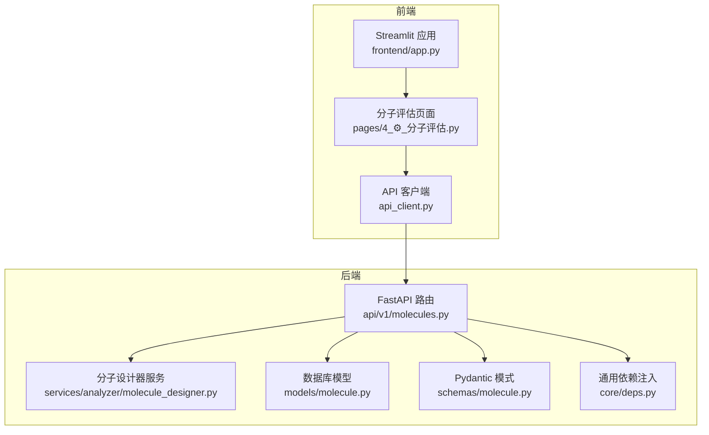
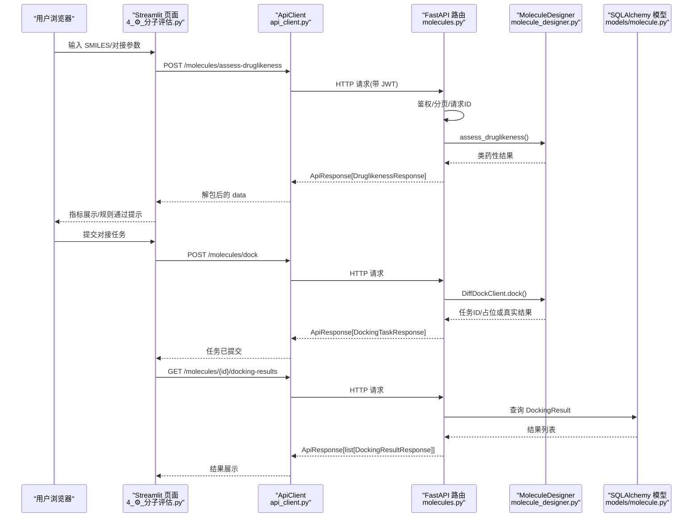
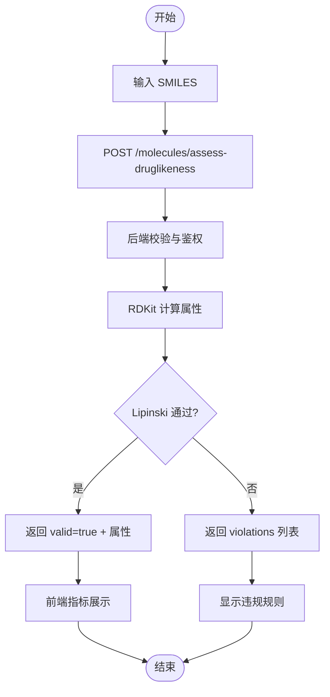
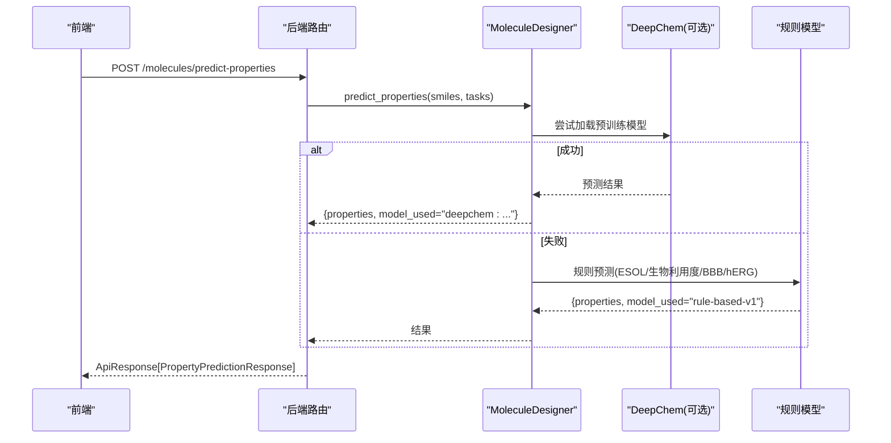
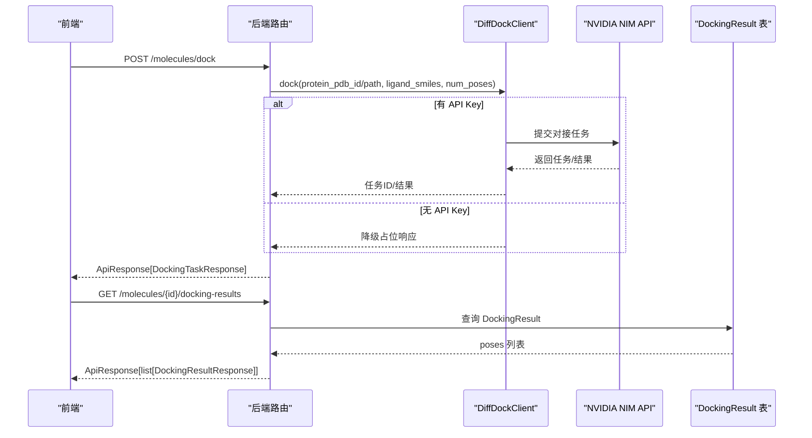
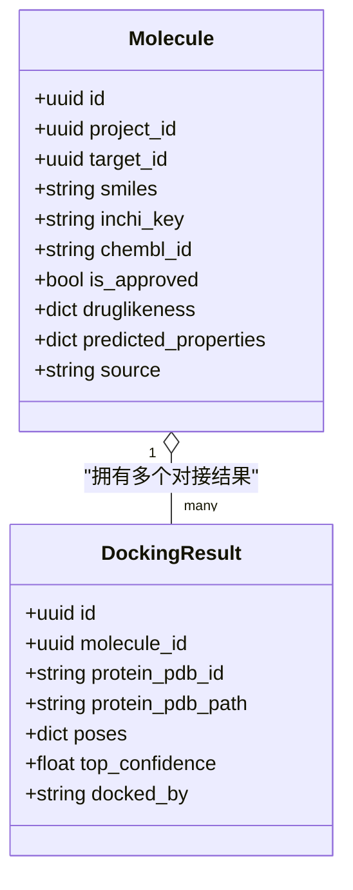
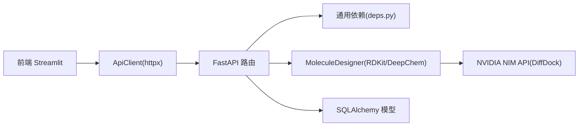

# 分子评估页面

<cite>
**本文引用的文件**   
- [前端主入口 app.py](file://precision-drug-design/frontend/app.py)
- [分子评估页面 4_⚙️_分子评估.py](file://precision-drug-design/frontend/pages/4_⚙️_分子评估.py)
- [API 客户端 api_client.py](file://precision-drug-design/frontend/api_client.py)
- [后端分子端点 molecules.py](file://precision-drug-design/backend/app/api/v1/molecules.py)
- [分子服务 MoleculeDesigner molecule_designer.py](file://precision-drug-design/backend/app/services/analyzer/molecule_designer.py)
- [数据库模型 molecule.py](file://precision-drug-design/backend/app/models/molecule.py)
- [请求/响应模式 schemas/molecule.py](file://precision-drug-design/backend/app/schemas/molecule.py)
- [通用依赖 deps.py](file://precision-drug-design/backend/app/core/deps.py)
- [靶点报告生成器 target_report.py](file://precision-drug-design/backend/app/services/report/target_report.py)
</cite>

## 目录
1. [简介](#简介)
2. [项目结构](#项目结构)
3. [核心组件](#核心组件)
4. [架构总览](#架构总览)
5. [详细组件分析](#详细组件分析)
6. [依赖关系分析](#依赖关系分析)
7. [性能考虑](#性能考虑)
8. [故障排查指南](#故障排查指南)
9. [结论](#结论)
10. [附录](#附录)

## 简介
本开发文档面向“分子评估”页面，覆盖从分子结构输入到类药性评估、ADMET 性质预测、分子对接模拟的完整流程。文档重点说明：
- 化学信息学工具集成（RDKit、DeepChem）
- 深度学习模型调用与降级策略
- 可视化渲染现状与扩展建议
- 结果解读与优化建议生成
- 批量评估、结果对比、报告导出能力与实现方案
- 性能优化与可观测性

## 项目结构
该功能由前端 Streamlit 页面与后端 FastAPI 服务组成，前后端通过 REST API 交互；后端封装 RDKit/DeepChem 等化学信息学与机器学习能力，并提供持久化模型与对接结果。

图表来源
- [前端主入口 app.py:1-157](file://precision-drug-design/frontend/app.py#L1-L157)
- [分子评估页面 4_⚙️_分子评估.py:1-159](file://precision-drug-design/frontend/pages/4_⚙️_分子评估.py#L1-L159)
- [API 客户端 api_client.py:1-251](file://precision-drug-design/frontend/api_client.py#L1-L251)
- [后端分子端点 molecules.py:1-403](file://precision-drug-design/backend/app/api/v1/molecules.py#L1-L403)
- [分子服务 MoleculeDesigner molecule_designer.py:1-689](file://precision-drug-design/backend/app/services/analyzer/molecule_designer.py#L1-L689)
- [数据库模型 molecule.py:1-61](file://precision-drug-design/backend/app/models/molecule.py#L1-L61)
- [请求/响应模式 schemas/molecule.py:1-178](file://precision-drug-design/backend/app/schemas/molecule.py#L1-L178)
- [通用依赖 deps.py:1-129](file://precision-drug-design/backend/app/core/deps.py#L1-L129)

章节来源
- [前端主入口 app.py:1-157](file://precision-drug-design/frontend/app.py#L1-L157)
- [分子评估页面 4_⚙️_分子评估.py:1-159](file://precision-drug-design/frontend/pages/4_⚙️_分子评估.py#L1-L159)
- [API 客户端 api_client.py:1-251](file://precision-drug-design/frontend/api_client.py#L1-L251)
- [后端分子端点 molecules.py:1-403](file://precision-drug-design/backend/app/api/v1/molecules.py#L1-L403)
- [分子服务 MoleculeDesigner molecule_designer.py:1-689](file://precision-drug-design/backend/app/services/analyzer/molecule_designer.py#L1-L689)
- [数据库模型 molecule.py:1-61](file://precision-drug-design/backend/app/models/molecule.py#L1-L61)
- [请求/响应模式 schemas/molecule.py:1-178](file://precision-drug-design/backend/app/schemas/molecule.py#L1-L178)
- [通用依赖 deps.py:1-129](file://precision-drug-design/backend/app/core/deps.py#L1-L129)

## 核心组件
- 前端页面：提供三类功能标签页——类药性评估、分子对接、ADMET 预测，统一通过 ApiClient 调用后端。
- 后端路由：暴露 /molecules/* 系列接口，负责鉴权、参数校验、调用服务层并返回标准化响应。
- 分子设计器服务：封装 RDKit 与 DeepChem，提供类药性评估、ADMET 预测、相似性计算、分子生成与可解释性分析。
- 数据模型与模式：定义分子与对接结果的持久化结构与 API 请求/响应契约。
- 依赖注入：提供用户认证、分页、请求追踪等横切能力。

章节来源
- [分子评估页面 4_⚙️_分子评估.py:1-159](file://precision-drug-design/frontend/pages/4_⚙️_分子评估.py#L1-L159)
- [后端分子端点 molecules.py:1-403](file://precision-drug-design/backend/app/api/v1/molecules.py#L1-L403)
- [分子服务 MoleculeDesigner molecule_designer.py:1-689](file://precision-drug-design/backend/app/services/analyzer/molecule_designer.py#L1-L689)
- [数据库模型 molecule.py:1-61](file://precision-drug-design/backend/app/models/molecule.py#L1-L61)
- [请求/响应模式 schemas/molecule.py:1-178](file://precision-drug-design/backend/app/schemas/molecule.py#L1-L178)
- [通用依赖 deps.py:1-129](file://precision-drug-design/backend/app/core/deps.py#L1-L129)

## 架构总览
端到端调用序列如下：

图表来源
- [分子评估页面 4_⚙️_分子评估.py:1-159](file://precision-drug-design/frontend/pages/4_⚙️_分子评估.py#L1-L159)
- [API 客户端 api_client.py:1-251](file://precision-drug-design/frontend/api_client.py#L1-L251)
- [后端分子端点 molecules.py:1-403](file://precision-drug-design/backend/app/api/v1/molecules.py#L1-L403)
- [分子服务 MoleculeDesigner molecule_designer.py:1-689](file://precision-drug-design/backend/app/services/analyzer/molecule_designer.py#L1-L689)
- [数据库模型 molecule.py:1-61](file://precision-drug-design/backend/app/models/molecule.py#L1-L61)

## 详细组件分析

### 类药性评估（Lipinski + Veber + QED）
- 前端表单收集 SMILES，调用 /molecules/assess-druglikeness。
- 后端路由解析请求，调用 _assess_druglikeness 使用 RDKit 计算 MW、LogP、HBD/HBA、旋转键、TPSA，判断 Lipinski 五规则是否通过，并返回违反项。
- 前端以指标卡片展示关键属性与通过状态，并对违规项给出警告提示。

图表来源
- [分子评估页面 4_⚙️_分子评估.py:31-74](file://precision-drug-design/frontend/pages/4_⚙️_分子评估.py#L31-L74)
- [后端分子端点 molecules.py:47-106](file://precision-drug-design/backend/app/api/v1/molecules.py#L47-L106)

章节来源
- [分子评估页面 4_⚙️_分子评估.py:31-74](file://precision-drug-design/frontend/pages/4_⚙️_分子评估.py#L31-L74)
- [后端分子端点 molecules.py:47-106](file://precision-drug-design/backend/app/api/v1/molecules.py#L47-L106)

### ADMET 性质预测（DeepChem 优先，规则降级）
- 前端调用 /molecules/predict-properties，传入 SMILES 与可选 tasks。
- 后端尝试使用 MoleculeDesigner.predict_properties，内部优先加载 DeepChem 模型（如 Tox21/Delaney），失败则回退到基于规则的预测（ESOL 近似溶解度、规则生物利用度/BBB/hERG）。
- 返回 properties 与 druglikeness 字段，前端展示 BBB、口服生物利用度、hERG 风险等关键指标。

图表来源
- [后端分子端点 molecules.py:219-298](file://precision-drug-design/backend/app/api/v1/molecules.py#L219-L298)
- [分子服务 MoleculeDesigner molecule_designer.py:136-256](file://precision-drug-design/backend/app/services/analyzer/molecule_designer.py#L136-L256)

章节来源
- [分子评估页面 4_⚙️_分子评估.py:109-151](file://precision-drug-design/frontend/pages/4_⚙️_分子评估.py#L109-L151)
- [后端分子端点 molecules.py:219-298](file://precision-drug-design/backend/app/api/v1/molecules.py#L219-L298)
- [分子服务 MoleculeDesigner molecule_designer.py:136-256](file://precision-drug-design/backend/app/services/analyzer/molecule_designer.py#L136-L256)

### 分子对接（DiffDock NIM API，异步任务）
- 前端提交配体 SMILES、靶点 PDB ID/路径、构象数等参数至 /molecules/dock。
- 后端创建对接任务，返回 task_id 与预估时长；实际对接由 DiffDockClient 调用 NVIDIA NIM API，若不可用则返回降级占位响应。
- 前端可通过 GET /molecules/{id}/docking-results 轮询获取结果，后端从 DockingResult 表读取 poses 列表。

图表来源
- [后端分子端点 molecules.py:109-216](file://precision-drug-design/backend/app/api/v1/molecules.py#L109-L216)
- [分子服务 MoleculeDesigner molecule_designer.py:522-660](file://precision-drug-design/backend/app/services/analyzer/molecule_designer.py#L522-L660)
- [数据库模型 molecule.py:46-61](file://precision-drug-design/backend/app/models/molecule.py#L46-L61)

章节来源
- [分子评估页面 4_⚙️_分子评估.py:76-107](file://precision-drug-design/frontend/pages/4_⚙️_分子评估.py#L76-L107)
- [后端分子端点 molecules.py:109-216](file://precision-drug-design/backend/app/api/v1/molecules.py#L109-L216)
- [分子服务 MoleculeDesigner molecule_designer.py:522-660](file://precision-drug-design/backend/app/services/analyzer/molecule_designer.py#L522-L660)
- [数据库模型 molecule.py:46-61](file://precision-drug-design/backend/app/models/molecule.py#L46-L61)

### 生成式分子设计与可解释性（补充能力）
- 生成式分子设计：支持 fragment/random/optimization 三种策略，返回候选分子及其类药性评分与相似度。
- 可解释性分析：基于特征贡献（SHAP 风格代理）输出各属性对药物相似性的影响方向与大小。

章节来源
- [后端分子端点 molecules.py:301-391](file://precision-drug-design/backend/app/api/v1/molecules.py#L301-L391)
- [分子服务 MoleculeDesigner molecule_designer.py:295-519](file://precision-drug-design/backend/app/services/analyzer/molecule_designer.py#L295-L519)

### 数据模型与 API 契约
- 模型：Molecule 存储 SMILES、类药性与预测性质、来源等；DockingResult 存储对接 poses、置信度与来源。
- 模式：定义 DruglikenessRequest/Response、PropertyPredictionRequest/Response、DockingRequest/Response、MoleculeGenerationRequest/Response、ExplainRequest/Response 等。

图表来源
- [数据库模型 molecule.py:14-61](file://precision-drug-design/backend/app/models/molecule.py#L14-L61)

章节来源
- [数据库模型 molecule.py:1-61](file://precision-drug-design/backend/app/models/molecule.py#L1-L61)
- [请求/响应模式 schemas/molecule.py:1-178](file://precision-drug-design/backend/app/schemas/molecule.py#L1-L178)

## 依赖关系分析
- 前端依赖：Streamlit、httpx（连接池复用）、缓存机制（st.cache_resource/st.cache_data）。
- 后端依赖：FastAPI、SQLAlchemy 异步会话、Pydantic 模式、loguru 日志。
- 化学信息学：RDKit（惰性加载）、DeepChem（惰性加载，失败时降级为规则模型）。
- 外部服务：NVIDIA NIM API（DiffDock），未配置时返回降级响应。

图表来源
- [API 客户端 api_client.py:1-251](file://precision-drug-design/frontend/api_client.py#L1-L251)
- [通用依赖 deps.py:1-129](file://precision-drug-design/backend/app/core/deps.py#L1-L129)
- [后端分子端点 molecules.py:1-403](file://precision-drug-design/backend/app/api/v1/molecules.py#L1-L403)
- [分子服务 MoleculeDesigner molecule_designer.py:1-689](file://precision-drug-design/backend/app/services/analyzer/molecule_designer.py#L1-L689)

章节来源
- [API 客户端 api_client.py:1-251](file://precision-drug-design/frontend/api_client.py#L1-L251)
- [通用依赖 deps.py:1-129](file://precision-drug-design/backend/app/core/deps.py#L1-L129)
- [后端分子端点 molecules.py:1-403](file://precision-drug-design/backend/app/api/v1/molecules.py#L1-L403)
- [分子服务 MoleculeDesigner molecule_designer.py:1-689](file://precision-drug-design/backend/app/services/analyzer/molecule_designer.py#L1-L689)

## 性能考虑
- 连接池复用：前端 ApiClient 使用 httpx.Client 全局缓存，减少握手开销。
- 请求级缓存：GET 接口可使用 cached_get 进行 TTL 控制，避免重复网络请求。
- 惰性加载：后端 RDKit/DeepChem 按需导入，降低启动时间与内存占用。
- 异步对接：对接任务采用异步提交与轮询，避免阻塞请求线程。
- 数据库分页：列表接口使用分页依赖，限制单次返回量。

章节来源
- [API 客户端 api_client.py:24-39](file://precision-drug-design/frontend/api_client.py#L24-L39)
- [API 客户端 api_client.py:186-236](file://precision-drug-design/frontend/api_client.py#L186-L236)
- [分子服务 MoleculeDesigner molecule_designer.py:27-69](file://precision-drug-design/backend/app/services/analyzer/molecule_designer.py#L27-L69)
- [后端分子端点 molecules.py:146-191](file://precision-drug-design/backend/app/api/v1/molecules.py#L146-L191)

## 故障排查指南
- RDKit 未安装：类药性评估与性质预测将抛出运行时错误，后端捕获后返回降级响应或错误信封。检查环境并安装 rdkit。
- DeepChem 未安装：性质预测自动降级为规则模型，model_used 标记为 rule-based-v1。如需更准确预测，请安装 deepchem。
- DiffDock NIM API 不可用：需设置环境变量 NVIDIA_API_KEY/NIM_API_KEY 与 DIFFDOCK_NIM_URL；否则返回降级占位响应。
- 鉴权失败：确保前端已登录并持有有效 access_token，后端依赖 get_current_user 进行短 TTL 缓存与权限校验。
- 请求超时：对接任务可能耗时较长，前端 spinner 提示与后端超时配置需匹配。

章节来源
- [后端分子端点 molecules.py:47-106](file://precision-drug-design/backend/app/api/v1/molecules.py#L47-L106)
- [后端分子端点 molecules.py:219-298](file://precision-drug-design/backend/app/api/v1/molecules.py#L219-L298)
- [分子服务 MoleculeDesigner molecule_designer.py:522-660](file://precision-drug-design/backend/app/services/analyzer/molecule_designer.py#L522-L660)
- [通用依赖 deps.py:101-124](file://precision-drug-design/backend/app/core/deps.py#L101-L124)

## 结论
当前“分子评估”页面实现了完整的类药性评估、ADMET 预测与对接任务提交流程，具备良好可扩展性与降级策略。后续可在以下方面增强：
- 引入 3D 分子可视化与交互式编辑器（见附录）
- 完善批量评估与结果对比界面
- 强化报告导出（CDISC SDTM 标准）
- 提升模型精度与可解释性可视化

## 附录

### 3D 分子可视化与编辑器（扩展建议）
- 可视化渲染：建议使用 RDKit 的 3D 渲染能力（例如生成 PNG/SVG 或转换为 WebGL 格式），在前端嵌入展示。
- 分子编辑器：可集成第三方 JS 库（如 ChemDoodle、SmilesDrawer 的 3D 扩展）或后端生成 SVG/PNG 再在前端渲染。
- 对接构象展示：将 DockingResult.poses 中的坐标与 SDF 内容用于 3D 渲染，支持旋转、缩放与高亮结合位点。

[本节为概念性扩展建议，不直接分析具体源码文件]

### 批量评估与结果对比（实现方案）
- 批量输入：在页面增加多行 SMILES 输入框或文件上传（CSV/Excel），后端新增 /molecules/batch-assess 接口，并行调用评估与预测。
- 结果对比：前端表格展示所有分子的属性与规则通过情况，支持排序、筛选与导出 CSV。
- 性能优化：后端使用并发队列或 Celery/RQ 处理批量任务，前端轮询任务进度。

[本节为概念性实现方案，不直接分析具体源码文件]

### 报告导出（CDISC SDTM 与 Markdown/JSON）
- 现有能力：TargetReportGenerator 可生成 Markdown 与 JSON 结构化报告，包含证据等级分布、相关分子、临床试验与文献。
- CDISC 导出：参考测试用例中 CDISC 导出器的行为，可将 DM/AE/LB 等域写入 JSON 文件，便于合规归档。
- 集成方式：在分子评估页面增加“导出报告”按钮，聚合当前项目的分子与证据，调用报告生成器并下载文件。

章节来源
- [靶点报告生成器 target_report.py:1-215](file://precision-drug-design/backend/app/services/report/target_report.py#L1-L215)