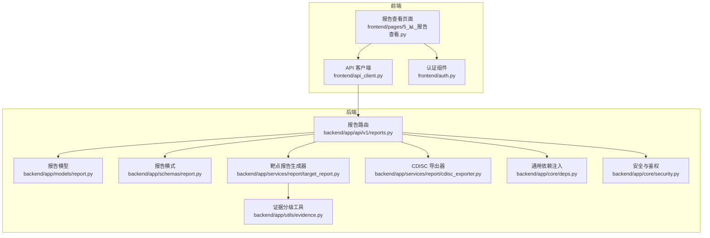
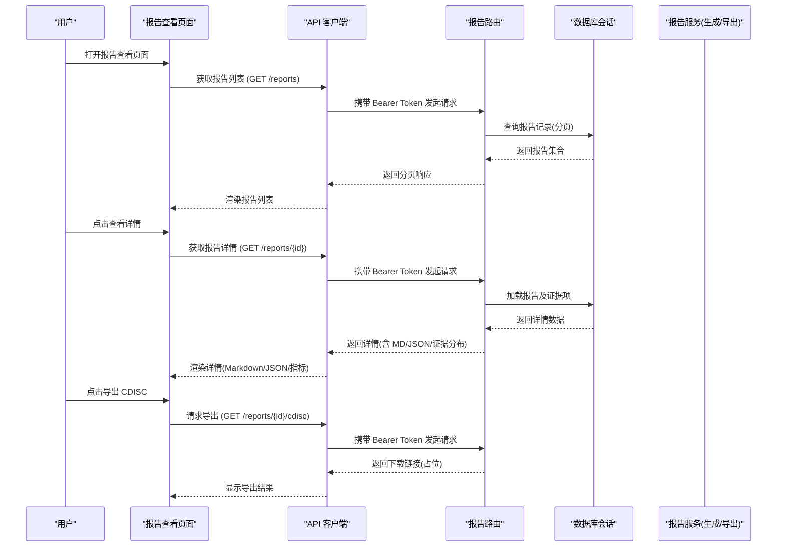
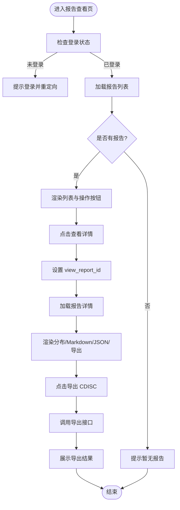
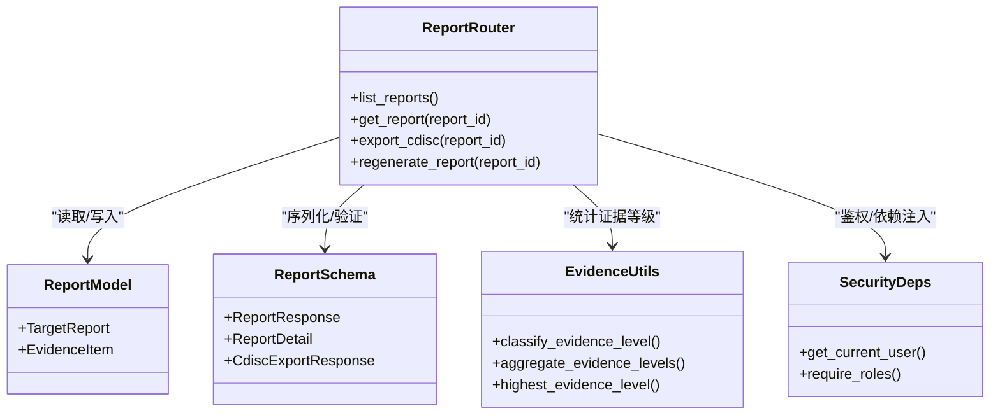
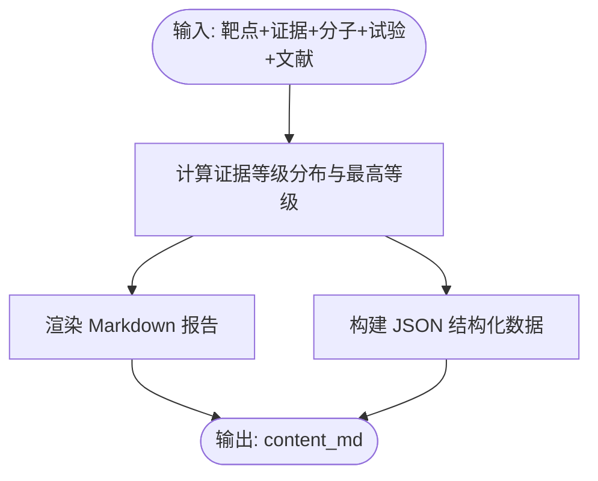
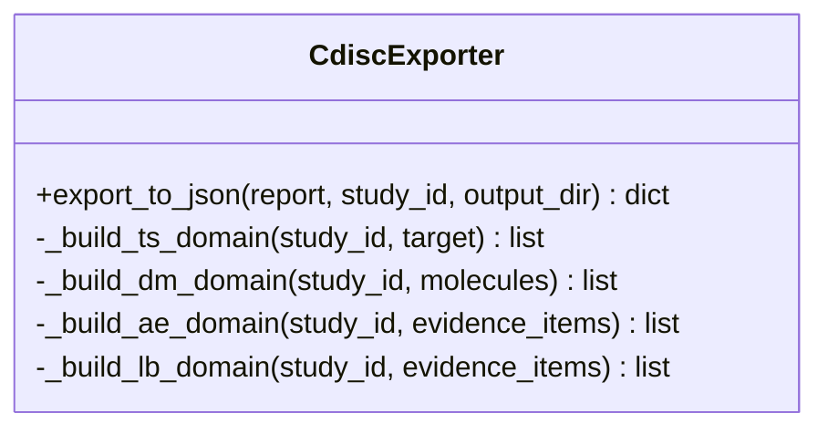
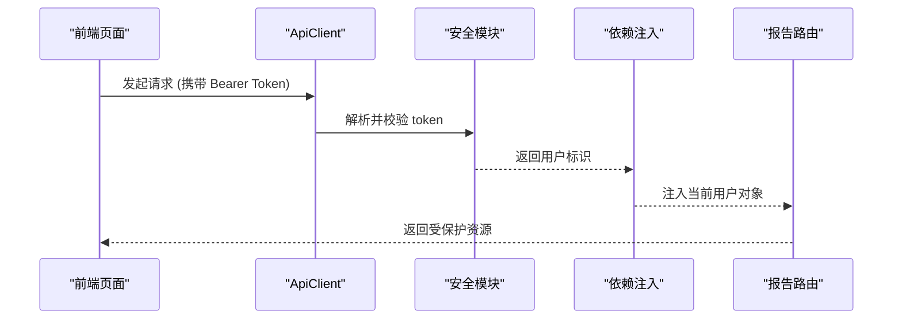
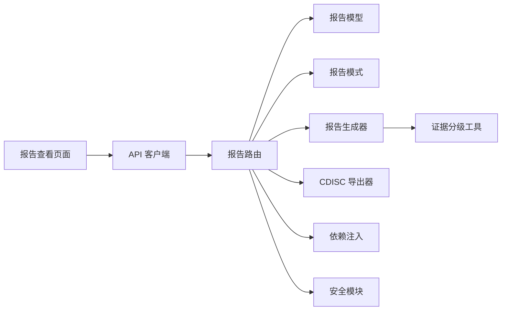

# 报告查看页面

<cite>
**本文引用的文件**   
- [5_📊_报告查看.py](file://frontend/pages/5_📊_报告查看.py)
- [reports.py](file://backend/app/api/v1/reports.py)
- [report.py](file://backend/app/models/report.py)
- [report.py](file://backend/app/schemas/report.py)
- [target_report.py](file://backend/app/services/report/target_report.py)
- [cdisc_exporter.py](file://backend/app/services/report/cdisc_exporter.py)
- [evidence.py](file://backend/app/utils/evidence.py)
- [security.py](file://backend/app/core/security.py)
- [deps.py](file://backend/app/core/deps.py)
- [api_client.py](file://frontend/api_client.py)
- [auth.py](file://frontend/auth.py)
</cite>

## 目录
1. [引言](#引言)
2. [项目结构](#项目结构)
3. [核心组件](#核心组件)
4. [架构总览](#架构总览)
5. [详细组件分析](#详细组件分析)
6. [依赖关系分析](#依赖关系分析)
7. [性能考虑](#性能考虑)
8. [故障排查指南](#故障排查指南)
9. [结论](#结论)
10. [附录](#附录)

## 引言
本文件面向“报告查看页面”的开发与维护，覆盖分析报告的生成、展示、下载与分享能力，重点说明以下功能：
- 交互式报告浏览（列表与详情）
- 图表导出（JSON 结构化数据）、PDF 生成（建议方案）
- CDISC SDTM 导出（占位实现 + 服务层模板）
- 版本管理（重新生成任务）
- 报告模板系统（Markdown 渲染与 JSON 结构化输出）
- 数据聚合与证据分级统计
- 权限控制（认证与角色校验）

该页面由 Streamlit 前端与 FastAPI 后端协作完成，前后端通过 REST API 交互。

## 项目结构
围绕“报告查看”的前后端关键文件如下：
- 前端页面：Streamlit 页面负责用户交互、调用后端 API、渲染 Markdown 与 JSON
- 后端接口：FastAPI 路由提供报告列表、详情、CDISC 导出、重新生成等
- 模型与模式：SQLAlchemy 模型定义持久化结构；Pydantic Schema 定义请求/响应契约
- 服务层：报告生成器与 CDISC 导出器封装业务逻辑
- 工具与安全：证据分级工具、JWT 认证与依赖注入

**图示来源** 
- [5_📊_报告查看.py:1-112](file://frontend/pages/5_📊_报告查看.py#L1-L112)
- [reports.py:1-181](file://backend/app/api/v1/reports.py#L1-L181)
- [report.py:1-73](file://backend/app/models/report.py#L1-L73)
- [report.py:1-59](file://backend/app/schemas/report.py#L1-L59)
- [target_report.py:1-215](file://backend/app/services/report/target_report.py#L1-L215)
- [cdisc_exporter.py:1-187](file://backend/app/services/report/cdisc_exporter.py#L1-L187)
- [evidence.py:1-103](file://backend/app/utils/evidence.py#L1-L103)
- [deps.py:1-129](file://backend/app/core/deps.py#L1-L129)
- [security.py:1-211](file://backend/app/core/security.py#L1-L211)

**章节来源**
- [5_📊_报告查看.py:1-112](file://frontend/pages/5_📊_报告查看.py#L1-L112)
- [reports.py:1-181](file://backend/app/api/v1/reports.py#L1-L181)

## 核心组件
- 报告查看页面（Streamlit）
  - 报告列表：分页获取并展示标题、证据等级、创建时间等摘要信息
  - 报告详情：展示证据等级分布、Markdown 内容、JSON 结构化数据、CDISC 导出入口
- 报告路由（FastAPI）
  - GET /reports：分页列出报告
  - GET /reports/{id}：返回详情（含 Markdown、JSON、证据项与等级分布）
  - GET /reports/{id}/cdisc：返回 CDISC 导出下载链接（当前为占位实现）
  - POST /reports/{id}/regenerate：触发重新生成（异步任务占位）
- 报告模型与模式
  - TargetReport/EvidenceItem：持久化结构与关联关系
  - ReportResponse/ReportDetail/CdiscExportResponse：统一响应契约
- 报告生成器与导出器
  - TargetReportGenerator：综合多源证据生成 Markdown 与 JSON
  - CdiscExporter：按 SDTM 标准构建 TS/DM/AE/LB 域（JSON 输出）
- 证据分级工具
  - classify_evidence_level/aggregate_evidence_levels/highest_evidence_level：依据来源与载荷推断等级并统计分布
- 认证与依赖注入
  - JWT 校验、当前用户解析、短 TTL 用户缓存、分页参数与请求追踪 ID

**章节来源**
- [5_📊_报告查看.py:27-111](file://frontend/pages/5_📊_报告查看.py#L27-L111)
- [reports.py:35-181](file://backend/app/api/v1/reports.py#L35-L181)
- [report.py:15-73](file://backend/app/models/report.py#L15-L73)
- [report.py:16-59](file://backend/app/schemas/report.py#L16-L59)
- [target_report.py:15-215](file://backend/app/services/report/target_report.py#L15-L215)
- [cdisc_exporter.py:22-187](file://backend/app/services/report/cdisc_exporter.py#L22-L187)
- [evidence.py:39-103](file://backend/app/utils/evidence.py#L39-L103)
- [deps.py:67-129](file://backend/app/core/deps.py#L67-L129)
- [security.py:155-211](file://backend/app/core/security.py#L155-L211)

## 架构总览
下图展示了从前端到后端的完整调用链，包括认证、数据加载、报告渲染与导出流程。

**图示来源** 
- [5_📊_报告查看.py:27-111](file://frontend/pages/5_📊_报告查看.py#L27-L111)
- [reports.py:35-153](file://backend/app/api/v1/reports.py#L35-L153)
- [api_client.py:42-134](file://frontend/api_client.py#L42-L134)
- [security.py:155-211](file://backend/app/core/security.py#L155-L211)
- [deps.py:101-129](file://backend/app/core/deps.py#L101-L129)

## 详细组件分析

### 报告查看页面（Streamlit）
- 列表渲染
  - 调用 GET /reports 获取分页数据，展示标题、证据等级、证据数、创建时间等
  - 支持展开条目并进入详情页
- 详情渲染
  - 展示证据等级分布（I/II/III/IV）
  - 渲染 Markdown 正文
  - 以可折叠面板展示 JSON 结构化数据
  - 提供 CDISC SDTM 导出按钮，调用 GET /reports/{id}/cdisc
- 状态管理
  - 使用 session_state 保存 view_report_id 控制视图切换
- 错误处理
  - 捕获网络异常并提示用户

**图示来源** 
- [5_📊_报告查看.py:27-111](file://frontend/pages/5_📊_报告查看.py#L27-L111)
- [api_client.py:165-180](file://frontend/api_client.py#L165-L180)

**章节来源**
- [5_📊_报告查看.py:27-111](file://frontend/pages/5_📊_报告查看.py#L27-L111)
- [api_client.py:42-134](file://frontend/api_client.py#L42-L134)

### 报告路由（FastAPI）
- 列表接口
  - 支持按 project_id、analysis_tier 过滤
  - 返回分页元数据与报告摘要
- 详情接口
  - 加载报告及其证据项，计算证据等级分布
  - 返回 Markdown 内容与 JSON 结构化数据
- CDISC 导出接口
  - 当前返回临时下载 URL 与文件清单（第二阶段实现）
- 重新生成接口
  - 返回任务队列状态（异步任务占位）

**图示来源** 
- [reports.py:35-181](file://backend/app/api/v1/reports.py#L35-L181)
- [report.py:15-73](file://backend/app/models/report.py#L15-L73)
- [report.py:16-59](file://backend/app/schemas/report.py#L16-L59)
- [evidence.py:39-103](file://backend/app/utils/evidence.py#L39-L103)
- [security.py:155-211](file://backend/app/core/security.py#L155-L211)
- [deps.py:101-129](file://backend/app/core/deps.py#L101-L129)

**章节来源**
- [reports.py:35-181](file://backend/app/api/v1/reports.py#L35-L181)
- [report.py:15-73](file://backend/app/models/report.py#L15-L73)
- [report.py:16-59](file://backend/app/schemas/report.py#L16-L59)
- [evidence.py:39-103](file://backend/app/utils/evidence.py#L39-L103)
- [security.py:155-211](file://backend/app/core/security.py#L155-L211)
- [deps.py:67-129](file://backend/app/core/deps.py#L67-L129)

### 报告生成器（Markdown + JSON）
- 输入：靶点信息、证据项、相关分子、临床试验、文献
- 处理：
  - 统计证据等级分布与最高等级
  - 渲染 Markdown 报告（包含概述、证据列表、相关分子、临床试验、参考文献与免责声明）
  - 生成 JSON 结构化数据（便于前端可视化与二次加工）
- 输出：content_md、content_json、evidence_level_distribution

**图示来源** 
- [target_report.py:21-76](file://backend/app/services/report/target_report.py#L21-L76)
- [target_report.py:78-215](file://backend/app/services/report/target_report.py#L78-L215)
- [evidence.py:78-103](file://backend/app/utils/evidence.py#L78-L103)

**章节来源**
- [target_report.py:15-215](file://backend/app/services/report/target_report.py#L15-L215)
- [evidence.py:39-103](file://backend/app/utils/evidence.py#L39-L103)

### CDISC SDTM 导出器
- 目标：将内部报告转换为符合 CDISC SDTM IG 3.2 的数据集
- 支持域：TS（试验摘要）、DM（人口学）、AE（不良事件）、LB（实验室检查）
- 输出：JSON 文件（路径由配置决定），后续可扩展为 XPT（SAS Transport）
- 当前后端导出接口返回占位下载 URL，实际导出逻辑在服务层实现

**图示来源** 
- [cdisc_exporter.py:22-187](file://backend/app/services/report/cdisc_exporter.py#L22-L187)

**章节来源**
- [cdisc_exporter.py:1-187](file://backend/app/services/report/cdisc_exporter.py#L1-L187)
- [reports.py:123-153](file://backend/app/api/v1/reports.py#L123-L153)

### 权限控制与认证
- 前端
  - 登录/注册表单，成功后存储 access_token/refresh_token 到 session_state
  - 页面入口 require_auth 检查是否已登录
  - ApiClient 自动在请求头注入 Authorization: Bearer <token>
- 后端
  - OAuth2 Bearer token 提取与解码
  - get_current_user 依赖注入，带短 TTL 内存缓存
  - require_roles 工厂用于角色守卫（可在需要时扩展至报告访问控制）

**图示来源** 
- [auth.py:10-137](file://frontend/auth.py#L10-L137)
- [api_client.py:42-134](file://frontend/api_client.py#L42-L134)
- [security.py:155-211](file://backend/app/core/security.py#L155-L211)
- [deps.py:101-129](file://backend/app/core/deps.py#L101-L129)

**章节来源**
- [auth.py:10-137](file://frontend/auth.py#L10-L137)
- [api_client.py:42-134](file://frontend/api_client.py#L42-L134)
- [security.py:155-211](file://backend/app/core/security.py#L155-L211)
- [deps.py:67-129](file://backend/app/core/deps.py#L67-L129)

### 报告模板系统与格式化输出
- 模板系统
  - Markdown 模板：由 TargetReportGenerator 动态组装，包含固定章节与变量填充
  - JSON 模板：结构化字段包含靶点、证据分布、证据项、相关分子、临床试验、文献与生成时间
- 格式化输出
  - 前端使用 Streamlit 的 markdown/json 组件进行渲染
  - 后端通过 Pydantic Schema 保证响应格式一致性与类型安全

**章节来源**
- [target_report.py:78-215](file://backend/app/services/report/target_report.py#L78-L215)
- [report.py:16-59](file://backend/app/schemas/report.py#L16-L59)

### 数据聚合与证据分级
- 证据来源映射到等级（I/II/III/IV）
- 根据 payload 中的显式等级或临床阶段推断
- 统计各等级数量并计算最高等级

**章节来源**
- [evidence.py:15-103](file://backend/app/utils/evidence.py#L15-L103)

### 版本管理与重新生成
- 重新生成接口返回任务 ID 与状态（queued），后续可由后台任务处理器更新状态与结果
- 建议在报告中增加版本号与变更日志字段，以便对比不同版本差异

**章节来源**
- [reports.py:156-181](file://backend/app/api/v1/reports.py#L156-L181)

### 图表导出、PDF 生成与分享
- 图表导出
  - 当前提供 JSON 结构化数据导出，便于前端自行绘制图表或二次分析
- PDF 生成（建议方案）
  - 基于 Markdown 内容使用第三方库（如 WeasyPrint、pdfkit）转换为 PDF
  - 或使用后端模板引擎（Jinja2 + pdfkit）生成标准化 PDF
- 分享（建议方案）
  - 生成一次性分享链接（带签名与过期时间）
  - 或将报告打包为 ZIP（含 Markdown、JSON、PDF）并通过临时下载链接分发

[本节为概念性建议，不直接分析具体文件]

## 依赖关系分析
- 前端依赖
  - Streamlit 页面依赖 api_client 与 auth 组件
  - api_client 复用 httpx 连接池，统一错误处理与信封解包
- 后端依赖
  - 路由依赖 deps（分页、请求 ID、当前用户）与 security（JWT 校验）
  - 路由依赖 models（ORM 模型）与 schemas（响应契约）
  - 路由调用 services（报告生成与导出）与 utils（证据分级）

**图示来源** 
- [5_📊_报告查看.py:1-112](file://frontend/pages/5_📊_报告查看.py#L1-L112)
- [reports.py:1-181](file://backend/app/api/v1/reports.py#L1-L181)
- [report.py:1-73](file://backend/app/models/report.py#L1-L73)
- [report.py:1-59](file://backend/app/schemas/report.py#L1-L59)
- [target_report.py:1-215](file://backend/app/services/report/target_report.py#L1-L215)
- [cdisc_exporter.py:1-187](file://backend/app/services/report/cdisc_exporter.py#L1-L187)
- [evidence.py:1-103](file://backend/app/utils/evidence.py#L1-L103)
- [deps.py:1-129](file://backend/app/core/deps.py#L1-L129)
- [security.py:1-211](file://backend/app/core/security.py#L1-L211)

**章节来源**
- [5_📊_报告查看.py:1-112](file://frontend/pages/5_📊_报告查看.py#L1-L112)
- [reports.py:1-181](file://backend/app/api/v1/reports.py#L1-L181)

## 性能考虑
- 前端
  - 使用 httpx 连接池减少握手开销
  - 使用 st.cache_data 对不常变数据进行缓存（TTL 桶机制）
- 后端
  - 用户对象短 TTL 内存缓存降低数据库压力
  - 分页查询限制返回规模，避免大结果集
- 导出
  - CDISC 导出采用流式写入与分域构建，避免一次性加载全部数据到内存

**章节来源**
- [api_client.py:24-39](file://frontend/api_client.py#L24-L39)
- [api_client.py:220-236](file://frontend/api_client.py#L220-L236)
- [deps.py:26-53](file://backend/app/core/deps.py#L26-L53)
- [reports.py:35-73](file://backend/app/api/v1/reports.py#L35-L73)
- [cdisc_exporter.py:44-88](file://backend/app/services/report/cdisc_exporter.py#L44-L88)

## 故障排查指南
- 登录失败
  - 检查前端登录表单是否正确提交邮箱与密码
  - 确认后端 /auth/login 返回成功信封且包含 access_token
- 报告加载失败
  - 检查后端 /reports 与 /reports/{id} 是否正常返回
  - 查看网络错误消息与后端日志
- CDISC 导出失败
  - 当前为占位实现，需关注返回的下载 URL 与过期时间
  - 第二阶段实现时需确保输出目录存在并可写
- 权限问题
  - 确认 Authorization header 正确携带 Bearer Token
  - 若启用角色守卫，需确保用户角色满足要求

**章节来源**
- [auth.py:10-137](file://frontend/auth.py#L10-L137)
- [api_client.py:68-94](file://frontend/api_client.py#L68-L94)
- [reports.py:123-153](file://backend/app/api/v1/reports.py#L123-L153)
- [security.py:155-211](file://backend/app/core/security.py#L155-L211)

## 结论
报告查看页面实现了从数据聚合、模板渲染到导出的完整链路。当前版本聚焦于靶点报告的 Markdown 与 JSON 输出、CDISC 导出占位与重新生成任务框架。后续可增强：
- 完善 CDISC 导出（XPT 支持与真实下载）
- 引入 PDF 生成与分享链接
- 扩展角色权限控制至报告级访问
- 增加报告版本对比与变更日志

[本节为总结性内容，不直接分析具体文件]

## 附录
- 术语
  - CDISC SDTM：临床试验数据标准，包含 TS/DM/AE/LB 等域
  - 证据等级：I/II/III/IV，反映证据强度
  - 报告模板：Markdown 与 JSON 的结构化模板
- 参考实现路径
  - 报告列表与详情：[reports.py:35-121](file://backend/app/api/v1/reports.py#L35-L121)
  - 报告详情渲染：[5_📊_报告查看.py:60-111](file://frontend/pages/5_📊_报告查看.py#L60-L111)
  - 报告生成器：[target_report.py:15-215](file://backend/app/services/report/target_report.py#L15-L215)
  - CDISC 导出器：[cdisc_exporter.py:22-187](file://backend/app/services/report/cdisc_exporter.py#L22-L187)
  - 证据分级工具：[evidence.py:39-103](file://backend/app/utils/evidence.py#L39-L103)
  - 认证与依赖注入：[security.py:155-211](file://backend/app/core/security.py#L155-L211), [deps.py:101-129](file://backend/app/core/deps.py#L101-L129)