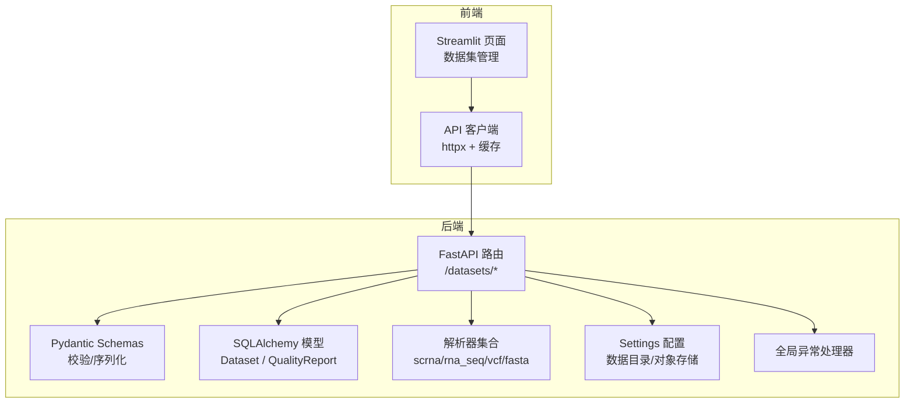
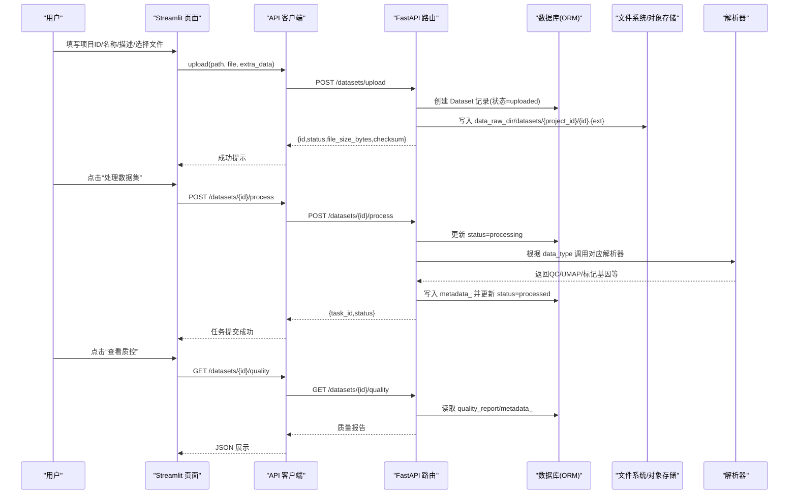
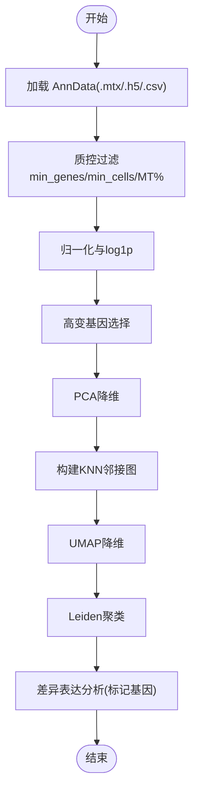
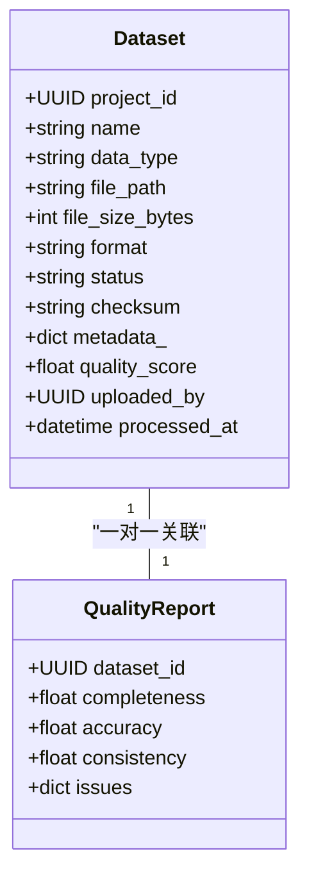
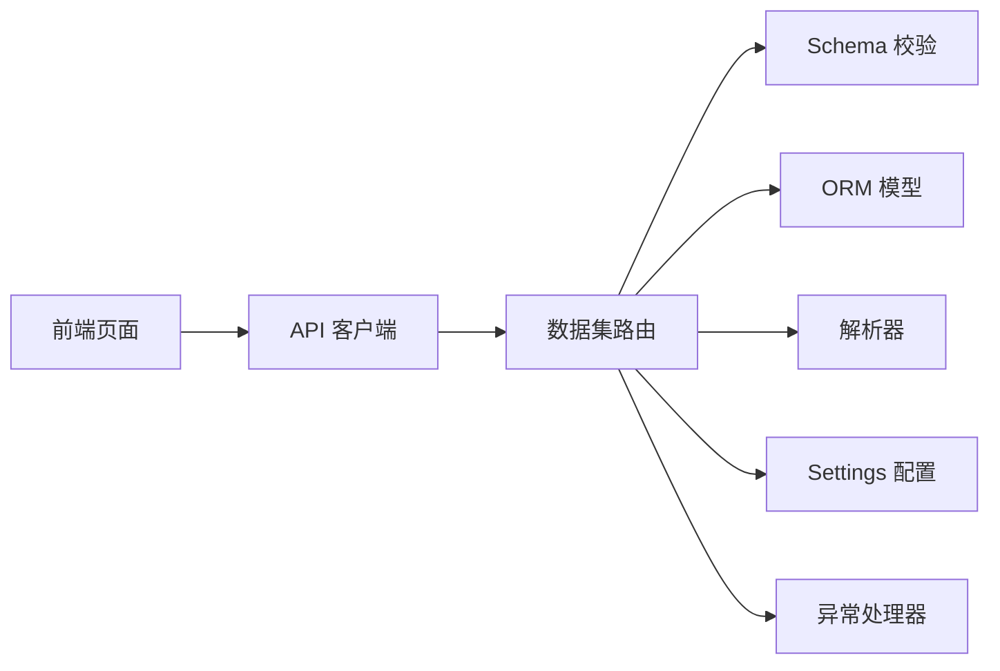

# 数据集管理页面

<cite>
**本文引用的文件列表**
- [前端页面：2_🧬_数据集.py](file://precision-drug-design/frontend/pages/2_🧬_数据集.py)
- [API 客户端：api_client.py](file://precision-drug-design/frontend/api_client.py)
- [数据集 API：data.py](file://precision-drug-design/backend/app/api/v1/data.py)
- [数据集模型：dataset.py](file://precision-drug-design/backend/app/models/dataset.py)
- [数据集 Schema：dataset.py](file://precision-drug-design/backend/app/schemas/dataset.py)
- [通用 Schema：common.py](file://precision-drug-design/backend/app/schemas/common.py)
- [应用配置：config.py](file://precision-drug-design/backend/app/core/config.py)
- [异常处理：exceptions.py](file://precision-drug-design/backend/app/core/exceptions.py)
- [scRNA-seq 解析器：scrna.py](file://precision-drug-design/backend/app/services/parser/scrna.py)
- [RNA-seq 解析器：rna_seq.py](file://precision-drug-design/backend/app/services/parser/rna_seq.py)
- [VCF 解析器：vcf_parser.py](file://precision-drug-design/backend/app/services/parser/vcf_parser.py)
- [FASTA 解析器：fasta_parser.py](file://precision-drug-design/backend/app/services/parser/fasta_parser.py)
</cite>

## 目录
1. [简介](#简介)
2. [项目结构](#项目结构)
3. [核心组件](#核心组件)
4. [架构总览](#架构总览)
5. [详细组件分析](#详细组件分析)
6. [依赖关系分析](#依赖关系分析)
7. [性能与可扩展性](#性能与可扩展性)
8. [故障排查指南](#故障排查指南)
9. [结论](#结论)
10. [附录](#附录)

## 简介
本开发文档面向“数据集管理页面”，覆盖多组学数据上传、预览、管理与处理的完整流程。重点说明支持的数据格式（RNA-seq、scRNA-seq、VCF、FASTA）、文件验证、预处理选项、质量控制指标，以及大文件上传、进度显示、错误恢复、数据预览可视化等实现要点。同时给出数据格式解析器集成、存储策略、元数据管理、数据血缘追踪的实现建议与落地方案。

## 项目结构
- 前端 Streamlit 页面提供上传表单、数据集列表、处理触发与质控查看能力。
- 后端 FastAPI 提供数据集上传、列表、详情、处理、UMAP 坐标、标记基因、质量报告、删除等接口。
- 解析器模块封装了 scRNA-seq、RNA-seq、VCF、FASTA 的加载与基础处理逻辑。
- 配置中心集中管理数据存储路径、对象存储、外部服务地址等。
- 统一异常与响应信封保证前后端交互一致性。

图表来源
- [前端页面：2_🧬_数据集.py:1-127](file://precision-drug-design/frontend/pages/2_🧬_数据集.py#L1-L127)
- [API 客户端：api_client.py:1-251](file://precision-drug-design/frontend/api_client.py#L1-L251)
- [数据集 API：data.py:1-369](file://precision-drug-design/backend/app/api/v1/data.py#L1-L369)
- [数据集模型：dataset.py:1-70](file://precision-drug-design/backend/app/models/dataset.py#L1-L70)
- [数据集 Schema：dataset.py:1-147](file://precision-drug-design/backend/app/schemas/dataset.py#L1-L147)
- [通用 Schema：common.py:1-158](file://precision-drug-design/backend/app/schemas/common.py#L1-L158)
- [应用配置：config.py:1-144](file://precision-drug-design/backend/app/core/config.py#L1-L144)
- [异常处理：exceptions.py:1-179](file://precision-drug-design/backend/app/core/exceptions.py#L1-L179)

章节来源
- [前端页面：2_🧬_数据集.py:1-127](file://precision-drug-design/frontend/pages/2_🧬_数据集.py#L1-L127)
- [API 客户端：api_client.py:1-251](file://precision-drug-design/frontend/api_client.py#L1-L251)
- [数据集 API：data.py:1-369](file://precision-drug-design/backend/app/api/v1/data.py#L1-L369)
- [数据集模型：dataset.py:1-70](file://precision-drug-design/backend/app/models/dataset.py#L1-L70)
- [数据集 Schema：dataset.py:1-147](file://precision-drug-design/backend/app/schemas/dataset.py#L1-L147)
- [通用 Schema：common.py:1-158](file://precision-drug-design/backend/app/schemas/common.py#L1-L158)
- [应用配置：config.py:1-144](file://precision-drug-design/backend/app/core/config.py#L1-L144)
- [异常处理：exceptions.py:1-179](file://precision-drug-design/backend/app/core/exceptions.py#L1-L179)

## 核心组件
- 前端上传与列表渲染：负责用户输入校验、调用后端上传与查询接口、展示结果与操作按钮。
- 后端数据集 API：接收上传、持久化元数据与文件、触发处理、返回 UMAP/标记基因/质控信息。
- 解析器：按数据类型加载并执行标准化预处理，产出 QC 指标、降维坐标、聚类标签与标记基因。
- 配置与存储：通过 Settings 指定原始数据目录与处理后目录；当前实现落盘本地文件系统，预留对象存储扩展点。
- 统一异常与响应：定义业务异常类型与全局处理器，确保错误码与消息一致。

章节来源
- [前端页面：2_🧬_数据集.py:27-127](file://precision-drug-design/frontend/pages/2_🧬_数据集.py#L27-L127)
- [数据集 API：data.py:54-369](file://precision-drug-design/backend/app/api/v1/data.py#L54-L369)
- [scRNA-seq 解析器：scrna.py:13-160](file://precision-drug-design/backend/app/services/parser/scrna.py#L13-L160)
- [RNA-seq 解析器：rna_seq.py:15-106](file://precision-drug-design/backend/app/services/parser/rna_seq.py#L15-L106)
- [VCF 解析器：vcf_parser.py:14-136](file://precision-drug-design/backend/app/services/parser/vcf_parser.py#L14-L136)
- [FASTA 解析器：fasta_parser.py:12-100](file://precision-drug-design/backend/app/services/parser/fasta_parser.py#L12-L100)
- [应用配置：config.py:108-111](file://precision-drug-design/backend/app/core/config.py#L108-L111)
- [异常处理：exceptions.py:131-179](file://precision-drug-design/backend/app/core/exceptions.py#L131-L179)

## 架构总览
下图展示了从前端到后端的端到端数据流，包括上传、处理、预览与质控读取的关键路径。

图表来源
- [前端页面：2_🧬_数据集.py:50-127](file://precision-drug-design/frontend/pages/2_🧬_数据集.py#L50-L127)
- [API 客户端：api_client.py:136-162](file://precision-drug-design/frontend/api_client.py#L136-L162)
- [数据集 API：data.py:54-369](file://precision-drug-design/backend/app/api/v1/data.py#L54-L369)
- [数据集模型：dataset.py:15-70](file://precision-drug-design/backend/app/models/dataset.py#L15-L70)
- [scRNA-seq 解析器：scrna.py:75-160](file://precision-drug-design/backend/app/services/parser/scrna.py#L75-L160)

## 详细组件分析

### 前端：数据集管理页面
- 上传区域
  - 表单字段：项目 ID、数据类型、数据集名称、描述、文件选择。
  - 支持的文件类型：csv、tsv、h5、mtx、vcf、fasta、fa。
  - 提交时调用 client.upload 将文件与额外元数据一并发送。
- 数据集列表
  - 支持按项目 ID 筛选，分页获取数据集列表。
  - 展示行数、列数、状态、大小等元信息。
  - 提供“处理数据集”和“查看质控”操作按钮，分别触发处理与质量报告查询。
- 认证与错误处理
  - 未登录自动跳转首页登录提示。
  - 上传/处理/查询失败时以错误消息反馈。

章节来源
- [前端页面：2_🧬_数据集.py:27-127](file://precision-drug-design/frontend/pages/2_🧬_数据集.py#L27-L127)
- [API 客户端：api_client.py:170-180](file://precision-drug-design/frontend/api_client.py#L170-L180)

### 后端：数据集 API
- 上传接口
  - 校验 data_type 是否在允许集合内。
  - 计算文件大小与 SHA256 校验和。
  - 创建 Dataset 记录（初始状态 uploaded），保存文件至 data_raw_dir/datasets/{project_id}/{id}.{ext}。
  - 更新 file_path 并提交事务。
- 列表接口
  - 支持按 project_id、data_type、status 过滤，分页返回。
  - 将 ORM 的 metadata_ 映射为响应字段 metadata。
- 处理接口
  - 针对 scrna 类型，调用 ScRnaSeqParser.load/process，将 QC 指标、UMAP 坐标、聚类标签、标记基因写入 metadata_，状态置为 processed。
  - 其他类型直接置为 processed。
  - 异常时降级回 uploaded 并返回 failed。
- 预览接口
  - UMAP：从 metadata_ 读取坐标与聚类标签。
  - 标记基因：从 metadata_ 读取并按 cluster 分组。
- 质量报告接口
  - 若存在 quality_report 则返回，否则返回空报告结构。
- 删除接口
  - 删除物理文件并移除数据库记录。

章节来源
- [数据集 API：data.py:54-369](file://precision-drug-design/backend/app/api/v1/data.py#L54-L369)
- [数据集 Schema：dataset.py:20-147](file://precision-drug-design/backend/app/schemas/dataset.py#L20-L147)
- [通用 Schema：common.py:141-148](file://precision-drug-design/backend/app/schemas/common.py#L141-L148)

### 解析器集成与数据处理

#### scRNA-seq 解析器
- 支持格式：10x MTX/HDF5/CSV。
- 标准流程：加载 → 质控（细胞/基因过滤、线粒体比例）→ 归一化与对数变换 → 高变基因选择 → PCA/邻居图 → UMAP 降维 → Leiden 聚类 → 差异表达分析。
- 输出：n_cells/n_genes 统计、UMAP 坐标（前 100 条用于预览）、聚类标签、标记基因、QC 指标（中位基因数、中位计数、最大线粒体比例）。

图表来源
- [scRNA-seq 解析器：scrna.py:75-160](file://precision-drug-design/backend/app/services/parser/scrna.py#L75-L160)

章节来源
- [scRNA-seq 解析器：scrna.py:13-160](file://precision-drug-design/backend/app/services/parser/scrna.py#L13-L160)

#### RNA-seq 解析器
- 支持格式：CSV/TSV/GCT。
- 功能：加载表达矩阵、低表达过滤、归一化（CPM/TPM简化版）。
- 适用场景：批量样本表达矩阵的快速预览与基础处理。

章节来源
- [RNA-seq 解析器：rna_seq.py:15-106](file://precision-drug-design/backend/app/services/parser/rna_seq.py#L15-L106)

#### VCF 解析器
- 支持格式：VCF 4.x。
- 功能：基于 cyvcf2 解析变异位点、样本信息与统计；未安装时降级为纯文本解析。
- 输出：变异列表（前 100 条预览）、染色体/类型分布统计、样本名列表。

章节来源
- [VCF 解析器：vcf_parser.py:14-136](file://precision-drug-design/backend/app/services/parser/vcf_parser.py#L14-L136)

#### FASTA 解析器
- 支持格式：FASTA/GenBank 等序列文件。
- 功能：批量解析序列记录，提取 id/name/description/sequence/length/annotations；支持单序列快速读取与写入。

章节来源
- [FASTA 解析器：fasta_parser.py:12-100](file://precision-drug-design/backend/app/services/parser/fasta_parser.py#L12-L100)

### 数据模型与 Schema
- Dataset 模型
  - 关键字段：project_id、name、data_type、file_path、file_size_bytes、format、status、checksum、metadata_、quality_score、uploaded_by、processed_at。
  - 关联：Project、QualityReport（一对一）。
- QualityReport 模型
  - 关键字段：completeness、accuracy、consistency、issues。
- Schema 校验
  - 数据类型与状态枚举在 common.py 中统一定义，避免散落的硬编码。
  - DatasetResponse 使用 alias 将 ORM 的 metadata_ 映射为 metadata 字段。

图表来源
- [数据集模型：dataset.py:15-70](file://precision-drug-design/backend/app/models/dataset.py#L15-L70)
- [数据集 Schema：dataset.py:36-55](file://precision-drug-design/backend/app/schemas/dataset.py#L36-L55)
- [通用 Schema：common.py:141-148](file://precision-drug-design/backend/app/schemas/common.py#L141-L148)

章节来源
- [数据集模型：dataset.py:15-70](file://precision-drug-design/backend/app/models/dataset.py#L15-L70)
- [数据集 Schema：dataset.py:36-147](file://precision-drug-design/backend/app/schemas/dataset.py#L36-L147)
- [通用 Schema：common.py:141-148](file://precision-drug-design/backend/app/schemas/common.py#L141-L148)

### 存储策略与配置
- 本地文件系统
  - 原始数据目录：data_raw_dir（默认 ./data/raw）。
  - 处理后目录：data_processed_dir（默认 ./data/processed）。
  - 上传路径规则：data_raw_dir/datasets/{project_id}/{dataset_id}.{ext}。
- 对象存储扩展点
  - 配置项包含 s3_endpoint/access_key/secret_key/bucket/region，便于未来迁移至 MinIO/S3。
- 当前实现
  - 上传接口直接写本地磁盘；删除接口同步删除物理文件。

章节来源
- [应用配置：config.py:108-111](file://precision-drug-design/backend/app/core/config.py#L108-L111)
- [应用配置：config.py:44-50](file://precision-drug-design/backend/app/core/config.py#L44-L50)
- [数据集 API：data.py:104-111](file://precision-drug-design/backend/app/api/v1/data.py#L104-L111)
- [数据集 API：data.py:356-364](file://precision-drug-design/backend/app/api/v1/data.py#L356-L364)

### 元数据管理与数据血缘追踪
- 元数据管理
  - 上传时支持传入 metadata 字符串（JSON），后端解析并存入 Dataset.metadata_。
  - 处理完成后，将 QC 指标、UMAP 坐标、聚类标签、标记基因等写入 metadata_，供预览接口读取。
- 数据血缘追踪（建议实现）
  - 在 Dataset 表新增字段如 pipeline_version、params_hash、source_file_checksum、created_by、updated_by。
  - 在 QualityReport 或独立 lineage 表中记录处理阶段、参数快照、上游文件哈希、下游产物路径。
  - 在 API 层记录每次处理的 task_id 与时间戳，形成可追溯的处理链。
  - 前端可在数据集详情页展示“处理历史”与“参数版本”。

章节来源
- [数据集 API：data.py:54-121](file://precision-drug-design/backend/app/api/v1/data.py#L54-L121)
- [数据集 API：data.py:191-254](file://precision-drug-design/backend/app/api/v1/data.py#L191-L254)
- [数据集模型：dataset.py:15-70](file://precision-drug-design/backend/app/models/dataset.py#L15-L70)

### 大文件上传、进度显示与错误恢复
- 当前实现
  - 前端一次性读取文件内容并通过 multipart/form-data 上传。
  - 后端读取全部字节并计算 SHA256 校验和。
- 改进建议
  - 分片上传：前端按固定大小切片，逐片上传并携带 chunk_index、total_chunks、file_id。
  - 断点续传：服务端维护临时分片目录与索引，合并成功后再持久化。
  - 进度显示：服务端返回已接收分片数量，前端实时更新进度条。
  - 错误恢复：网络中断后重试失败分片；校验失败丢弃并重传；超时自动重试。
  - 并发控制：限制同项目并发上传数，避免 I/O 瓶颈。

[本节为概念性建议，不直接分析具体文件]

### 数据预览与可视化
- 预览数据
  - scRNA-seq：UMAP 坐标与聚类标签可从 /datasets/{id}/umap 获取；标记基因可从 /datasets/{id}/markers 获取。
  - RNA-seq：可通过解析器 head 字段进行矩阵预览。
  - VCF/FASTA：解析器返回前若干条记录用于快速预览。
- 可视化建议
  - 前端使用 Streamlit Plotly/Altair 绘制 UMAP 散点图，按 cluster 着色。
  - 差异表达基因以条形图或火山图呈现。
  - VCF 变异分布按染色体/类型聚合展示。

章节来源
- [数据集 API：data.py:257-306](file://precision-drug-design/backend/app/api/v1/data.py#L257-L306)
- [RNA-seq 解析器：rna_seq.py:32-65](file://precision-drug-design/backend/app/services/parser/rna_seq.py#L32-L65)
- [VCF 解析器：vcf_parser.py:32-87](file://precision-drug-design/backend/app/services/parser/vcf_parser.py#L32-87)
- [FASTA 解析器：fasta_parser.py:29-58](file://precision-drug-design/backend/app/services/parser/fasta_parser.py#L29-58)

## 依赖关系分析
- 前端依赖
  - Streamlit 页面依赖 api_client 进行 HTTP 请求与缓存。
- 后端依赖
  - FastAPI 路由依赖 Pydantic Schema 进行请求/响应校验。
  - SQLAlchemy 模型与数据库会话进行持久化。
  - 解析器按需惰性导入第三方库（scanpy/pandas/cyvcf2/biopython）。
  - 配置中心提供数据目录与对象存储参数。
  - 全局异常处理器统一错误响应。

图表来源
- [前端页面：2_🧬_数据集.py:1-127](file://precision-drug-design/frontend/pages/2_🧬_数据集.py#L1-L127)
- [API 客户端：api_client.py:1-251](file://precision-drug-design/frontend/api_client.py#L1-L251)
- [数据集 API：data.py:1-369](file://precision-drug-design/backend/app/api/v1/data.py#L1-L369)
- [数据集模型：dataset.py:1-70](file://precision-drug-design/backend/app/models/dataset.py#L1-L70)
- [数据集 Schema：dataset.py:1-147](file://precision-drug-design/backend/app/schemas/dataset.py#L1-L147)
- [通用 Schema：common.py:1-158](file://precision-drug-design/backend/app/schemas/common.py#L1-L158)
- [应用配置：config.py:1-144](file://precision-drug-design/backend/app/core/config.py#L1-L144)
- [异常处理：exceptions.py:1-179](file://precision-drug-design/backend/app/core/exceptions.py#L1-L179)

章节来源
- [数据集 API：data.py:1-369](file://precision-drug-design/backend/app/api/v1/data.py#L1-L369)
- [数据集模型：dataset.py:1-70](file://precision-drug-design/backend/app/models/dataset.py#L1-L70)
- [数据集 Schema：dataset.py:1-147](file://precision-drug-design/backend/app/schemas/dataset.py#L1-L147)
- [通用 Schema：common.py:1-158](file://precision-drug-design/backend/app/schemas/common.py#L1-L158)
- [应用配置：config.py:1-144](file://precision-drug-design/backend/app/core/config.py#L1-L144)
- [异常处理：exceptions.py:1-179](file://precision-drug-design/backend/app/core/exceptions.py#L1-L179)

## 性能与可扩展性
- 连接池与缓存
  - 前端 httpx.Client 复用连接池，减少握手开销。
  - 提供带 TTL 的缓存 GET 接口，降低重复查询压力。
- 解析器惰性加载
  - 仅在需要时导入 scanpy/pandas/cyvcf2/biopython，缩短启动时间。
- 大数据集优化
  - 仅返回前 100 条 UMAP 坐标与标记基因用于预览，避免传输过大负载。
  - 建议后续引入异步任务队列（Celery/RQ）与进度轮询，提升用户体验。
- 存储扩展
  - 配置项已预留对象存储参数，可按需替换本地磁盘为 S3/MinIO，提升容量与可用性。

章节来源
- [API 客户端：api_client.py:24-39](file://precision-drug-design/frontend/api_client.py#L24-L39)
- [API 客户端：api_client.py:186-236](file://precision-drug-design/frontend/api_client.py#L186-L236)
- [scRNA-seq 解析器：scrna.py:28-36](file://precision-drug-design/backend/app/services/parser/scrna.py#L28-L36)
- [RNA-seq 解析器：rna_seq.py:22-30](file://precision-drug-design/backend/app/services/parser/rna_seq.py#L22-L30)
- [VCF 解析器：vcf_parser.py:21-30](file://precision-drug-design/backend/app/services/parser/vcf_parser.py#L21-L30)
- [FASTA 解析器：fasta_parser.py:19-27](file://precision-drug-design/backend/app/services/parser/fasta_parser.py#L19-L27)
- [应用配置：config.py:44-50](file://precision-drug-design/backend/app/core/config.py#L44-L50)

## 故障排查指南
- 常见错误
  - 未登录：前端提示跳转登录页。
  - 参数校验失败：后端返回 VALIDATION_ERROR，包含 errors 详情。
  - 资源不存在：返回 NOT_FOUND。
  - 内部错误：返回 INTERNAL_ERROR，附带日志级别异常堆栈。
- 定位方法
  - 检查 request_id 与 meta 字段，便于跨层追踪。
  - 查看后端日志（loguru）中的警告与异常信息。
  - 确认 data_type 与文件扩展名是否在允许集合内。
  - 确认 data_raw_dir 权限与空间是否充足。
- 恢复策略
  - 上传失败：检查网络与 token，必要时重试。
  - 处理失败：scrna 处理异常会降级为 uploaded，可重新触发或调整参数。
  - 删除失败：确认文件路径存在且可写。

章节来源
- [前端页面：2_🧬_数据集.py:19-24](file://precision-drug-design/frontend/pages/2_🧬_数据集.py#L19-L24)
- [异常处理：exceptions.py:131-179](file://precision-drug-design/backend/app/core/exceptions.py#L131-L179)
- [数据集 API：data.py:72-76](file://precision-drug-design/backend/app/api/v1/data.py#L72-L76)
- [数据集 API：data.py:240-247](file://precision-drug-design/backend/app/api/v1/data.py#L240-L247)

## 结论
数据集管理页面实现了多组学数据的上传、预览与管理闭环，涵盖 scRNA-seq、RNA-seq、VCF、FASTA 等主流格式的基础解析与处理。系统采用统一的响应信封与异常处理机制，具备良好的可维护性与扩展性。建议在后续迭代中完善大文件分片上传、异步任务与进度轮询、数据血缘追踪与对象存储迁移，以提升大规模数据场景下的稳定性与用户体验。

## 附录
- 支持的数据类型与状态
  - 数据类型：rna_seq、scrna、vcf、fasta、wes、wgs、ihc、proteomics、metabolomics。
  - 数据集状态：uploaded、processing、ready、failed。
- 关键接口清单
  - POST /datasets/upload
  - GET /datasets
  - GET /datasets/{id}
  - POST /datasets/{id}/process
  - GET /datasets/{id}/umap
  - GET /datasets/{id}/markers
  - GET /datasets/{id}/quality
  - DELETE /datasets/{id}

章节来源
- [通用 Schema：common.py:141-148](file://precision-drug-design/backend/app/schemas/common.py#L141-L148)
- [数据集 API：data.py:1-12](file://precision-drug-design/backend/app/api/v1/data.py#L1-L12)