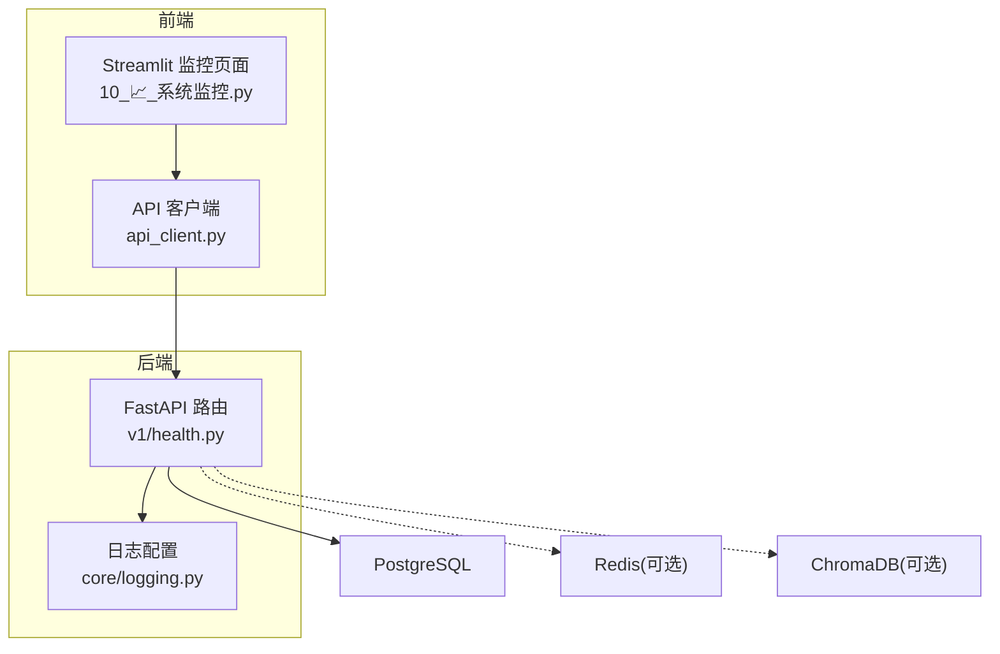
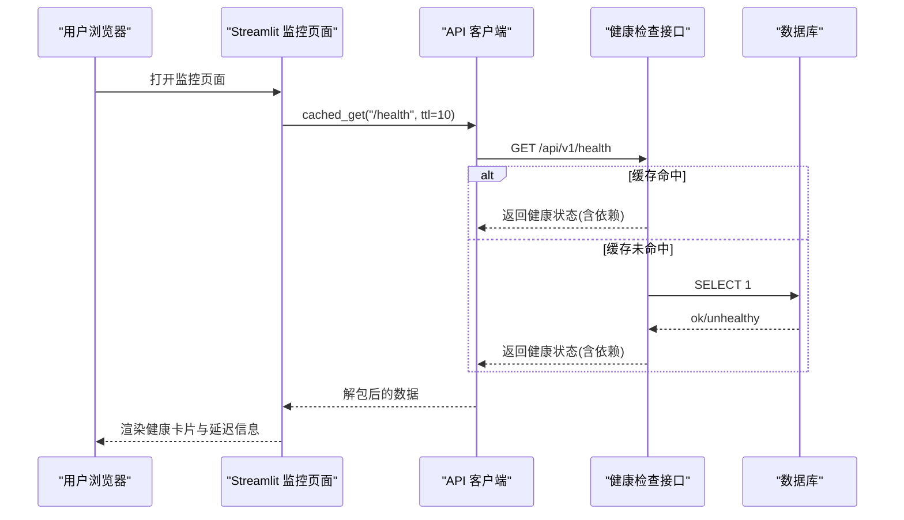
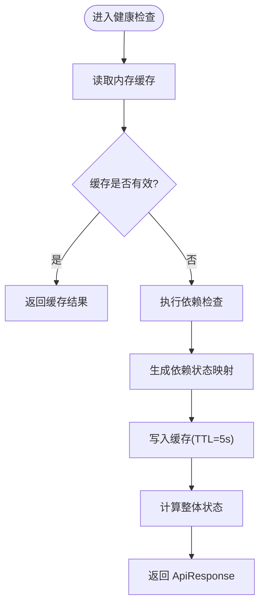
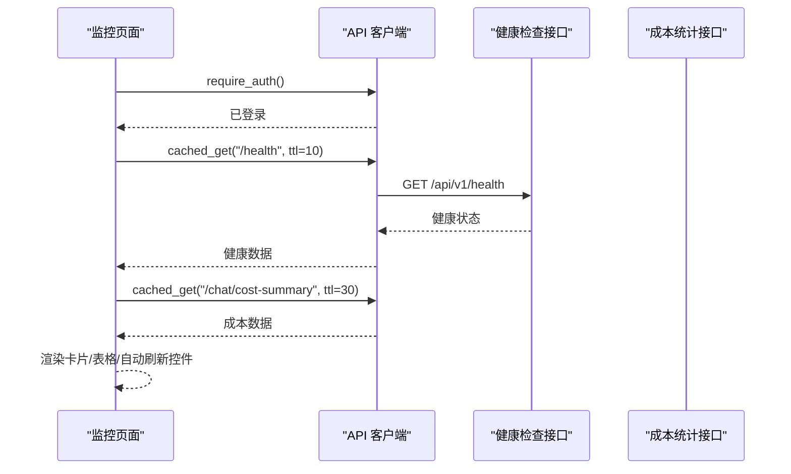
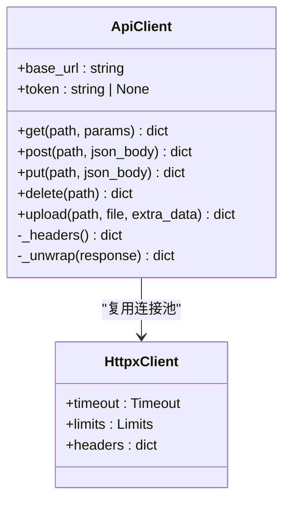
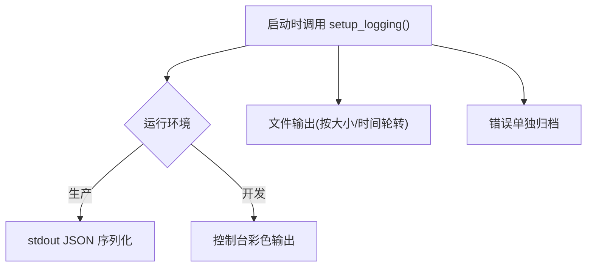
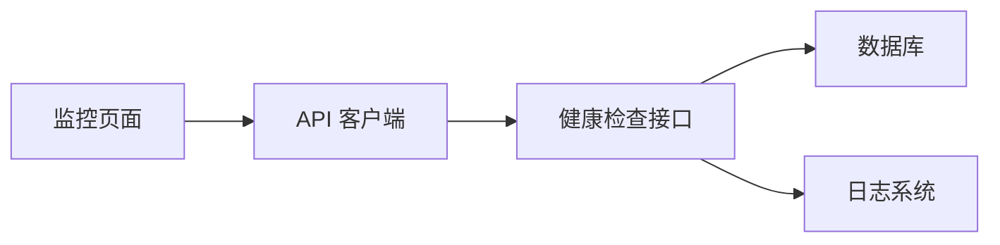

# 系统监控页面

<cite>
**本文引用的文件**   
- [10_📈_系统监控.py](file://frontend/pages/10_📈_系统监控.py)
- [health.py](file://backend/app/api/v1/health.py)
- [logging.py](file://backend/app/core/logging.py)
- [api_client.py](file://frontend/api_client.py)
</cite>

## 目录
1. [简介](#简介)
2. [项目结构](#项目结构)
3. [核心组件](#核心组件)
4. [架构总览](#架构总览)
5. [详细组件分析](#详细组件分析)
6. [依赖关系分析](#依赖关系分析)
7. [性能与存储优化](#性能与存储优化)
8. [故障诊断与排错指南](#故障诊断与排错指南)
9. [结论](#结论)
10. [附录：指标、告警与可视化建议](#附录指标告警与可视化建议)

## 简介
本开发文档围绕“系统监控页面”的实现与扩展，聚焦以下目标：
- 健康检查：服务整体状态与依赖组件（数据库、缓存、向量库）健康度展示。
- 性能监控：API 端点概览、延迟与吞吐的可视化与趋势跟踪。
- 资源使用：进程级与依赖服务的资源占用观测方案。
- 错误追踪：结构化日志、错误归档与快速定位。
- 关键指标收集、告警规则配置、日志分析、趋势预测。
- 实时仪表盘、自定义图表、通知推送、故障诊断功能。
- 监控系统集成、数据采集、存储优化、查询加速的实现方案。

## 项目结构
当前仓库采用前后端分离：
- 前端 Streamlit 页面提供监控仪表盘，包含健康检查、LLM 成本统计、API 端点概览等。
- 后端 FastAPI 提供健康检查接口，并内置内存缓存以降低重复查询压力。
- 日志子系统基于 loguru，支持生产 JSON 输出与按大小/时间轮转。

图示来源
- [10_📈_系统监控.py:1-122](file://frontend/pages/10_📈_系统监控.py#L1-L122)
- [api_client.py:1-251](file://frontend/api_client.py#L1-L251)
- [health.py:1-102](file://backend/app/api/v1/health.py#L1-L102)
- [logging.py:1-93](file://backend/app/core/logging.py#L1-L93)

章节来源
- [10_📈_系统监控.py:1-122](file://frontend/pages/10_📈_系统监控.py#L1-L122)
- [api_client.py:1-251](file://frontend/api_client.py#L1-L251)
- [health.py:1-102](file://backend/app/api/v1/health.py#L1-L102)
- [logging.py:1-93](file://backend/app/core/logging.py#L1-L93)

## 核心组件
- 监控页面（前端）
  - 健康检查：调用 /health，以卡片形式展示各依赖状态与延迟。
  - LLM 成本统计：调用 /chat/cost-summary，汇总预算、花费与模型分层。
  - API 端点概览：静态列出主要模块路径与能力说明。
  - 自动刷新：每 30 秒触发一次页面重渲染。
- 健康检查（后端）
  - 返回应用版本、整体状态与依赖项健康度。
  - 内置 5 秒内存缓存，避免频繁访问数据库。
- API 客户端（前端）
  - 统一封装 HTTP 请求、JWT 注入、响应信封解包。
  - 连接池复用与请求级缓存（TTL 桶机制）。
- 日志系统（后端）
  - 生产环境 JSON 输出；开发环境彩色控制台。
  - 文件按大小/时间轮转，错误单独归档。

章节来源
- [10_📈_系统监控.py:29-121](file://frontend/pages/10_📈_系统监控.py#L29-L121)
- [health.py:22-101](file://backend/app/api/v1/health.py#L22-L101)
- [api_client.py:42-236](file://frontend/api_client.py#L42-L236)
- [logging.py:20-74](file://backend/app/core/logging.py#L20-L74)

## 架构总览
监控页面的数据流如下：
- 用户打开监控页面后，前端通过带认证的 API 客户端发起 GET 请求。
- 健康检查接口在内存中缓存结果，降低对数据库的压力。
- 日志系统为后端提供结构化输出，便于集中采集与分析。

图示来源
- [10_📈_系统监控.py:29-46](file://frontend/pages/10_📈_系统监控.py#L29-L46)
- [api_client.py:186-236](file://frontend/api_client.py#L186-L236)
- [health.py:53-101](file://backend/app/api/v1/health.py#L53-L101)

## 详细组件分析

### 健康检查组件
- 功能要点
  - 返回整体状态 healthy/degraded，以及各依赖项状态。
  - 使用内存字典缓存最近的健康检查结果，TTL 为 5 秒。
  - 依赖检测包括数据库连通性、Redis 与 Chroma 的可用性探测。
- 实现细节
  - 优先读取缓存，若过期则重新执行依赖检查并写入缓存。
  - 任一依赖 unhealthy 时，整体状态降级为 degraded。
- 复杂度与性能
  - 单次健康检查的时间复杂度 O(n)，n 为依赖数量。
  - 内存缓存将高频读操作降为 O(1)。
- 错误处理
  - 依赖异常捕获并标记 unhealthy。
  - 导入缺失时标记 not_configured。

图示来源
- [health.py:22-101](file://backend/app/api/v1/health.py#L22-L101)

章节来源
- [health.py:22-101](file://backend/app/api/v1/health.py#L22-L101)

### 监控页面（前端）
- 功能要点
  - 健康检查卡片：动态列数，显示状态图标与延迟。
  - LLM 成本统计：今日花费、预算上限、剩余预算、调用次数，并按模型与层级分解。
  - API 端点概览：静态列出各模块路径与描述。
  - 自动刷新：每 30 秒触发一次页面重渲染。
- 实现细节
  - 使用 cached_get 进行请求级缓存，TTL 桶机制控制失效。
  - 异常捕获并以友好提示展示。
- 交互流程
  - 页面加载 → 认证检查 → 拉取健康与成本数据 → 渲染卡片与表格。

图示来源
- [10_📈_系统监控.py:29-121](file://frontend/pages/10_📈_系统监控.py#L29-L121)
- [api_client.py:186-236](file://frontend/api_client.py#L186-L236)

章节来源
- [10_📈_系统监控.py:29-121](file://frontend/pages/10_📈_系统监控.py#L29-L121)
- [api_client.py:186-236](file://frontend/api_client.py#L186-L236)

### API 客户端（前端）
- 功能要点
  - 统一错误处理、JWT 注入、响应信封解包。
  - 连接池复用（httpx.Client），减少握手开销。
  - 请求级缓存（st.cache_data + TTL 桶），提升监控页刷新效率。
- 实现细节
  - _get_http_client 使用 @st.cache_resource 保证全局唯一实例。
  - cached_get 通过时间桶 key_prefix 隔离不同模块缓存。
- 性能特性
  - max_keepalive_connections/max_connections 限制连接规模。
  - 超时设置合理，避免长时间阻塞。

图示来源
- [api_client.py:24-167](file://frontend/api_client.py#L24-L167)

章节来源
- [api_client.py:24-167](file://frontend/api_client.py#L24-L167)
- [api_client.py:186-236](file://frontend/api_client.py#L186-L236)

### 日志系统（后端）
- 功能要点
  - 生产环境 JSON 序列化输出；开发环境彩色控制台。
  - 文件输出按大小/时间轮转，保留策略可配置。
  - 错误级别单独归档，便于快速检索。
- 实现细节
  - setup_logging 初始化全局 logger，移除默认 handler。
  - get_logger 绑定模块名，便于上下文追踪。
- 运维建议
  - 结合外部日志平台（如 ELK/Loki）进行聚合与检索。
  - 为关键路径添加结构化字段（request_id、user_id）。

图示来源
- [logging.py:20-74](file://backend/app/core/logging.py#L20-L74)

章节来源
- [logging.py:20-74](file://backend/app/core/logging.py#L20-L74)

## 依赖关系分析
- 前端监控页面依赖 API 客户端进行网络请求与缓存。
- API 客户端依赖 httpx 的连接池与超时配置。
- 健康检查接口依赖数据库会话与配置对象，内部维护内存缓存。
- 日志系统独立于业务逻辑，为所有模块提供统一输出。

图示来源
- [10_📈_系统监控.py:1-122](file://frontend/pages/10_📈_系统监控.py#L1-L122)
- [api_client.py:1-251](file://frontend/api_client.py#L1-L251)
- [health.py:1-102](file://backend/app/api/v1/health.py#L1-L102)
- [logging.py:1-93](file://backend/app/core/logging.py#L1-L93)

章节来源
- [10_📈_系统监控.py:1-122](file://frontend/pages/10_📈_系统监控.py#L1-L122)
- [api_client.py:1-251](file://frontend/api_client.py#L1-L251)
- [health.py:1-102](file://backend/app/api/v1/health.py#L1-L102)
- [logging.py:1-93](file://backend/app/core/logging.py#L1-L93)

## 性能与存储优化
- 前端缓存
  - 使用 st.cache_data 与 TTL 桶机制，避免频繁刷新导致的高频请求。
  - 通过 key_prefix 隔离不同模块缓存，防止相互污染。
- 后端缓存
  - 健康检查接口使用内存缓存，TTL 为 5 秒，显著降低数据库压力。
- 连接池
  - httpx.Client 复用连接，减少 TCP 握手与 TLS 协商开销。
- 日志轮转
  - 按大小/时间轮转与压缩，避免磁盘膨胀。
- 查询加速建议
  - 为常用查询增加索引（如按时间戳、模块、级别）。
  - 引入时序数据库（如 InfluxDB/TimescaleDB）用于指标存储与高效聚合。
  - 使用物化视图或预聚合表加速大盘统计。

[本节为通用指导，不直接分析具体文件]

## 故障诊断与排错指南
- 健康检查失败
  - 现象：页面显示“健康检查失败”。
  - 排查：确认后端 /health 可达、数据库连通性、Redis/Chroma 配置。
  - 参考：健康检查接口与前端异常捕获。
- 缓存未生效
  - 现象：刷新频繁但数据未更新或一直不变。
  - 排查：检查 TTL 桶与 key_prefix 是否正确；确认服务端缓存 TTL。
- 日志无法定位
  - 现象：问题难以复现或无上下文。
  - 排查：确保 request_id/user_id 已绑定到日志；查看错误归档文件。
- 性能瓶颈
  - 现象：页面卡顿或接口延迟升高。
  - 排查：观察连接池参数、缓存命中率、数据库慢查询。

章节来源
- [10_📈_系统监控.py:29-46](file://frontend/pages/10_📈_系统监控.py#L29-L46)
- [health.py:22-101](file://backend/app/api/v1/health.py#L22-L101)
- [logging.py:20-74](file://backend/app/core/logging.py#L20-L74)

## 结论
当前系统监控页面实现了基础的健康检查、LLM 成本统计与 API 端点概览，并通过前后端缓存与连接池优化了性能。日志系统提供了结构化输出与错误归档，有助于快速定位问题。后续可扩展更丰富的指标采集、告警与可视化能力，以满足生产环境的监控需求。

[本节为总结，不直接分析具体文件]

## 附录：指标、告警与可视化建议
- 关键指标收集
  - 系统层：CPU、内存、磁盘 I/O、网络带宽。
  - 应用层：QPS、P95/P99 延迟、错误率、连接池利用率。
  - 业务层：LLM 调用次数、花费、成功率、重试率。
- 告警规则配置
  - 阈值类：错误率 > 1%、P99 延迟 > 500ms、内存使用 > 85%。
  - 突变类：QPS 骤降 > 50%、错误率突增 > 3 倍。
  - 预算类：LLM 花费接近预算上限、隐私预算消耗过快。
- 日志分析与趋势预测
  - 结构化日志接入日志平台，建立关键字段索引。
  - 使用滑动窗口与指数平滑进行趋势预测，提前预警容量风险。
- 实时仪表盘与自定义图表
  - 使用时序数据库与可视化工具（Grafana/Superset）构建实时大屏。
  - 支持自定义维度（模块、租户、区域）下钻分析。
- 通知推送与故障诊断
  - 对接企业微信/钉钉/邮件/短信，分级告警。
  - 提供一键导出链路追踪 ID、相关日志片段与快照，辅助快速诊断。

[本节为概念性建议，不直接分析具体文件]