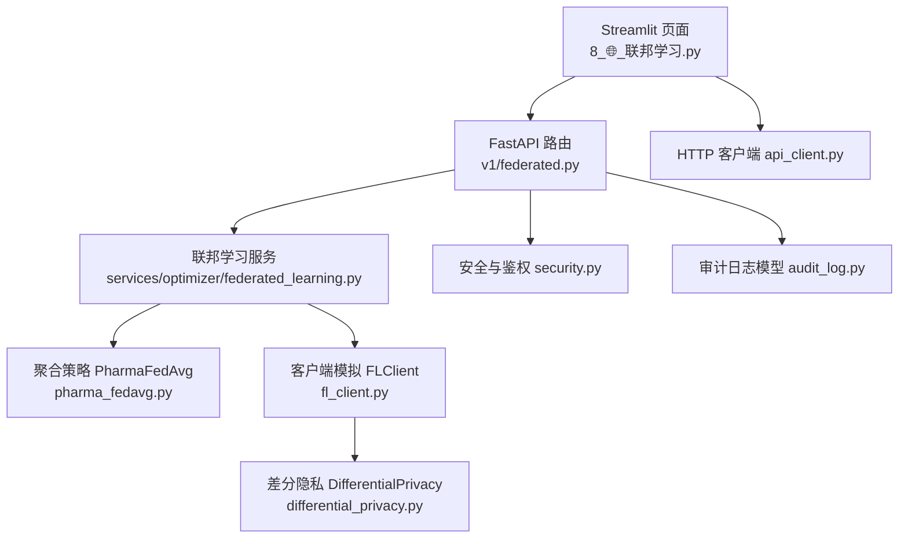
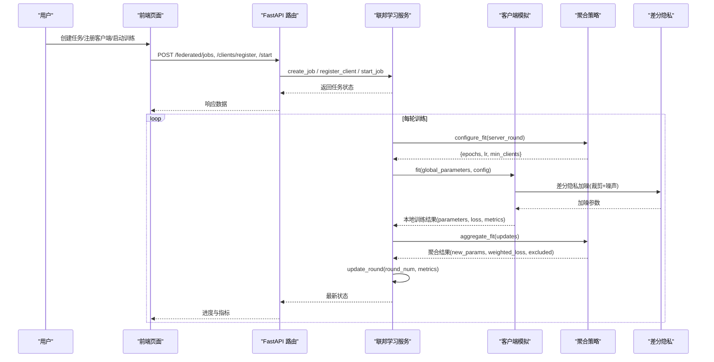
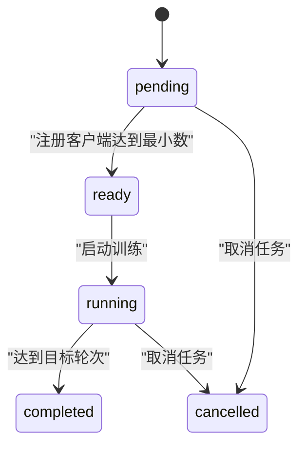
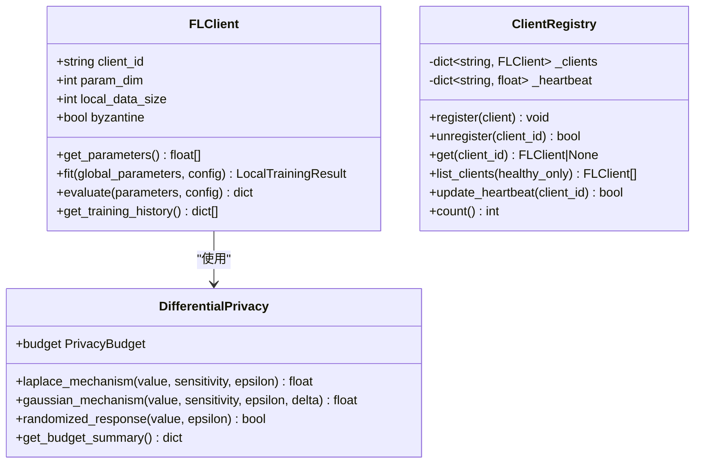
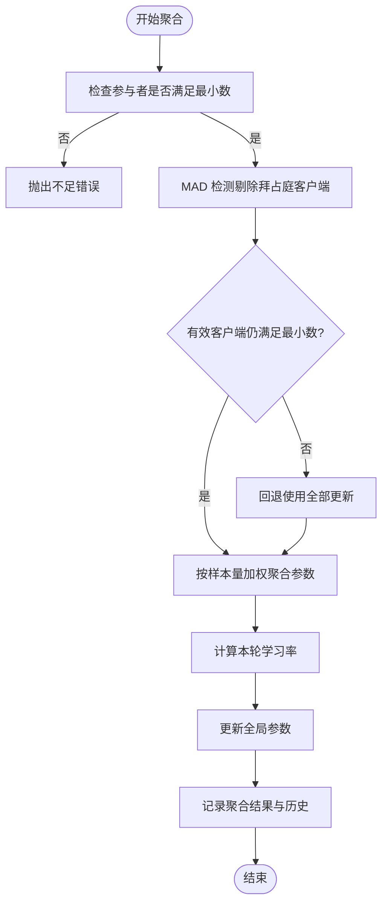
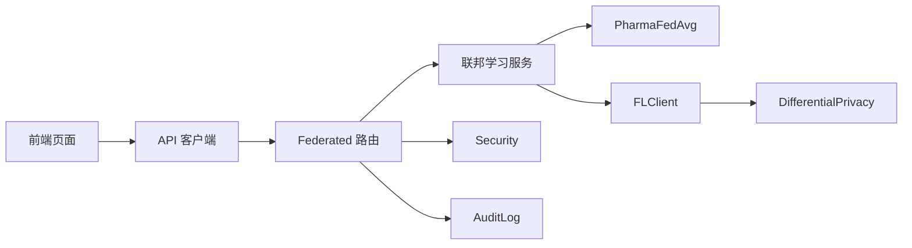

# 联邦学习页面

<cite>
**本文引用的文件**   
- [前端页面：8_🌐_联邦学习.py](file://precision-drug-design/frontend/pages/8_🌐_联邦学习.py)
- [API 路由：federated.py](file://precision-drug-design/backend/app/api/v1/federated.py)
- [服务实现：federated_learning.py](file://precision-drug-design/backend/app/services/optimizer/federated_learning.py)
- [客户端模拟：fl_client.py](file://precision-drug-design/backend/app/services/optimizer/fl_client.py)
- [聚合策略：pharma_fedavg.py](file://precision-drug-design/backend/app/services/optimizer/pharma_fedavg.py)
- [差分隐私：differential_privacy.py](file://precision-drug-design/backend/app/services/privacy/differential_privacy.py)
- [安全与鉴权：security.py](file://precision-drug-design/backend/app/core/security.py)
- [审计日志模型：audit_log.py](file://precision-drug-design/backend/app/models/audit_log.py)
- [API 客户端：api_client.py](file://precision-drug-design/frontend/api_client.py)
</cite>

## 目录
1. [简介](#简介)
2. [项目结构](#项目结构)
3. [核心组件](#核心组件)
4. [架构总览](#架构总览)
5. [详细组件分析](#详细组件分析)
6. [依赖关系分析](#依赖关系分析)
7. [性能考量](#性能考量)
8. [故障排查指南](#故障排查指南)
9. [结论](#结论)
10. [附录](#附录)

## 简介
本文件为“联邦学习页面”的详细开发文档，面向多机构协作的分布式机器学习平台。重点覆盖以下能力：
- 节点管理：客户端注册、心跳与健康检查、最小参与数控制
- 模型训练：轮次推进、本地训练模拟、进度与指标上报
- 参数聚合：按样本量加权 FedAvg、拜占庭剔除、学习率衰减
- 隐私保护：差分隐私预算管理与噪声注入、数据不出域原则
- 任务调度：创建任务、启动/停止、状态机流转
- 结果汇总：每轮指标记录、完成判定、可视化展示
- 审计追踪：不可篡改审计日志（append-only）
- 通信协议：REST API + JSON 信封；可扩展至 Flower 服务端
- 安全加密：JWT 认证、角色守卫、HTTPS/TLS 建议
- 负载均衡：异步聚合、最少参与者阈值、健康客户端筛选

## 项目结构
联邦学习功能由前端 Streamlit 页面驱动，通过 REST API 与后端交互；后端提供任务管理、客户端注册、训练状态更新等接口，并内置可替换的聚合策略与隐私机制。

图表来源
- [前端页面：8_🌐_联邦学习.py:1-142](file://precision-drug-design/frontend/pages/8_🌐_联邦学习.py#L1-L142)
- [API 路由：federated.py:1-133](file://precision-drug-design/backend/app/api/v1/federated.py#L1-L133)
- [服务实现：federated_learning.py:1-199](file://precision-drug-design/backend/app/services/optimizer/federated_learning.py#L1-L199)
- [客户端模拟：fl_client.py:1-254](file://precision-drug-design/backend/app/services/optimizer/fl_client.py#L1-L254)
- [聚合策略：pharma_fedavg.py:1-246](file://precision-drug-design/backend/app/services/optimizer/pharma_fedavg.py#L1-L246)
- [差分隐私：differential_privacy.py:1-151](file://precision-drug-design/backend/app/services/privacy/differential_privacy.py#L1-L151)
- [安全与鉴权：security.py:1-211](file://precision-drug-design/backend/app/core/security.py#L1-L211)
- [审计日志模型：audit_log.py:1-45](file://precision-drug-design/backend/app/models/audit_log.py#L1-L45)
- [API 客户端：api_client.py:1-251](file://precision-drug-design/frontend/api_client.py#L1-L251)

章节来源
- [前端页面：8_🌐_联邦学习.py:1-142](file://precision-drug-design/frontend/pages/8_🌐_联邦学习.py#L1-L142)
- [API 路由：federated.py:1-133](file://precision-drug-design/backend/app/api/v1/federated.py#L1-L133)

## 核心组件
- 前端页面：提供任务创建、客户端注册、训练启动、进度与指标查看
- API 路由：定义联邦学习任务与客户端注册的 REST 端点
- 联邦学习服务：内存态任务管理、状态机、轮次推进与指标记录
- 客户端模拟：本地训练模拟、差分隐私加噪、拜占庭异常模拟
- 聚合策略：PharmaFedAvg 加权聚合、拜占庭剔除、学习率衰减
- 差分隐私：ε-预算追踪、Laplace/Gaussian 噪声注入
- 安全与鉴权：JWT access/refresh token、角色守卫
- 审计日志：append-only 审计表，支持操作追溯

章节来源
- [服务实现：federated_learning.py:53-199](file://precision-drug-design/backend/app/services/optimizer/federated_learning.py#L53-L199)
- [客户端模拟：fl_client.py:42-196](file://precision-drug-design/backend/app/services/optimizer/fl_client.py#L42-L196)
- [聚合策略：pharma_fedavg.py:62-246](file://precision-drug-design/backend/app/services/optimizer/pharma_fedavg.py#L62-L246)
- [差分隐私：differential_privacy.py:51-151](file://precision-drug-design/backend/app/services/privacy/differential_privacy.py#L51-L151)
- [安全与鉴权：security.py:96-211](file://precision-drug-design/backend/app/core/security.py#L96-L211)
- [审计日志模型：audit_log.py:15-45](file://precision-drug-design/backend/app/models/audit_log.py#L15-L45)

## 架构总览
联邦学习端到端流程如下：
- 用户在页面创建任务，调用后端创建任务接口
- 各机构客户端注册到任务，达到最小参与数后进入 ready 状态
- 用户启动训练，服务推进轮次，客户端本地训练并上报参数
- 服务端执行加权聚合与拜占庭剔除，更新全局参数与指标
- 达到目标轮次后任务完成，前端展示进度与指标

图表来源
- [前端页面：8_🌐_联邦学习.py:36-141](file://precision-drug-design/frontend/pages/8_🌐_联邦学习.py#L36-L141)
- [API 路由：federated.py:35-133](file://precision-drug-design/backend/app/api/v1/federated.py#L35-L133)
- [服务实现：federated_learning.py:60-199](file://precision-drug-design/backend/app/services/optimizer/federated_learning.py#L60-L199)
- [客户端模拟：fl_client.py:89-196](file://precision-drug-design/backend/app/services/optimizer/fl_client.py#L89-L196)
- [聚合策略：pharma_fedavg.py:96-191](file://precision-drug-design/backend/app/services/optimizer/pharma_fedavg.py#L96-L191)
- [差分隐私：differential_privacy.py:63-151](file://precision-drug-design/backend/app/services/privacy/differential_privacy.py#L63-L151)

## 详细组件分析

### 前端页面：联邦学习
- 功能要点
  - 创建任务：输入项目 ID、目标靶点、训练轮数、最少客户端数
  - 任务列表：分页加载、状态图标、进度条、指标展开
  - 启动训练：在 pending/ready 状态下触发
  - 注册客户端：为任务添加客户端 ID，刷新缓存并重绘
- 交互细节
  - 使用缓存 GET 减少重复请求
  - 错误提示统一捕获并显示
  - 操作成功后失效缓存并重新渲染

章节来源
- [前端页面：8_🌐_联邦学习.py:36-141](file://precision-drug-design/frontend/pages/8_🌐_联邦学习.py#L36-L141)
- [API 客户端：api_client.py:186-251](file://precision-drug-design/frontend/api_client.py#L186-L251)

### API 路由：联邦学习
- 端点说明
  - POST /federated/jobs：创建任务（名称、模型架构、轮数、最少客户端、配置）
  - GET /federated/jobs：列出任务（可按状态过滤）
  - GET /federated/jobs/{job_id}：获取任务详情
  - POST /federated/jobs/{job_id}/stop：停止任务
  - POST /federated/clients/register：注册客户端（关联 job_id）
- 鉴权与审计
  - 所有端点依赖当前用户与请求 ID
  - 生产环境应结合审计日志记录关键操作

章节来源
- [API 路由：federated.py:35-133](file://precision-drug-design/backend/app/api/v1/federated.py#L35-L133)
- [安全与鉴权：security.py:155-211](file://precision-drug-design/backend/app/core/security.py#L155-L211)
- [审计日志模型：audit_log.py:15-45](file://precision-drug-design/backend/app/models/audit_log.py#L15-L45)

### 服务实现：联邦学习服务
- 数据结构
  - FederatedJob：任务 ID、项目 ID、目标靶点、轮数、最少客户端、状态、已注册客户端、当前轮次、时间戳、指标
- 核心方法
  - create_job：生成任务并持久化到内存字典
  - list_jobs/get_job：查询任务集合或单个任务
  - register_client：注册客户端，达到最小参与数时置为 ready
  - start_job：校验状态与客户端数量，置为 running
  - update_round：更新轮次与指标，达到目标轮次置为 completed
  - cancel_job：取消任务并记录完成时间
- 状态机
  - pending → ready（满足最小客户端）→ running → completed/cancelled

图表来源
- [服务实现：federated_learning.py:20-199](file://precision-drug-design/backend/app/services/optimizer/federated_learning.py#L20-L199)

章节来源
- [服务实现：federated_learning.py:60-199](file://precision-drug-design/backend/app/services/optimizer/federated_learning.py#L60-L199)

### 客户端模拟：FLClient 与 ClientRegistry
- FLClient
  - 本地训练模拟：同步全局参数，随机梯度下降近似，损失计算
  - 差分隐私：梯度裁剪 + Laplace 噪声，预算耗尽不再加噪
  - 拜占庭模拟：异常放大与偏移，用于测试剔除逻辑
  - 评估接口：返回简化 accuracy 与 loss
- ClientRegistry
  - 内存注册表：维护客户端对象与心跳时间
  - 健康检测：基于心跳窗口筛选 healthy_only 列表
  - 计数与注销：统计总数、移除离线客户端

图表来源
- [客户端模拟：fl_client.py:42-254](file://precision-drug-design/backend/app/services/optimizer/fl_client.py#L42-L254)
- [差分隐私：differential_privacy.py:51-151](file://precision-drug-design/backend/app/services/privacy/differential_privacy.py#L51-L151)

章节来源
- [客户端模拟：fl_client.py:89-196](file://precision-drug-design/backend/app/services/optimizer/fl_client.py#L89-L196)
- [客户端模拟：fl_client.py:198-254](file://precision-drug-design/backend/app/services/optimizer/fl_client.py#L198-L254)
- [差分隐私：differential_privacy.py:63-151](file://precision-drug-design/backend/app/services/privacy/differential_privacy.py#L63-L151)

### 聚合策略：PharmaFedAvg
- 特性
  - 按客户端样本量加权聚合
  - 拜占庭剔除：基于参数范数的 MAD 检测
  - 学习率衰减：lr_base * (decay ** round_num)
  - 异步聚合：满足最小参与者即可触发
- 核心流程
  - configure_fit：计算本轮 lr 与配置
  - aggregate_fit：剔除异常、加权聚合、更新全局参数
  - get_history/get_current_parameters：历史与当前参数访问

图表来源
- [聚合策略：pharma_fedavg.py:96-191](file://precision-drug-design/backend/app/services/optimizer/pharma_fedavg.py#L96-L191)

章节来源
- [聚合策略：pharma_fedavg.py:62-246](file://precision-drug-design/backend/app/services/optimizer/pharma_fedavg.py#L62-L246)

### 差分隐私：DifferentialPrivacy
- 能力
  - ε-预算追踪：记录每次消耗与剩余预算
  - Laplace 机制：对连续值加噪声
  - Gaussian 机制：对高斯噪声预算进行管控
  - Randomized Response：布尔值随机响应
- 约束
  - 预算不足时抛出错误，防止过度泄露
  - 客户端侧在本地训练后进行裁剪与加噪

章节来源
- [差分隐私：differential_privacy.py:15-151](file://precision-drug-design/backend/app/services/privacy/differential_privacy.py#L15-L151)

### 安全与鉴权：security.py
- JWT 令牌
  - access/refresh token 生成与解析
  - 过期时间与额外声明（如角色）
- FastAPI 依赖
  - get_current_user_id：从 Authorization header 提取并校验
  - require_roles：角色守卫工厂，限制敏感操作

章节来源
- [安全与鉴权：security.py:64-211](file://precision-drug-design/backend/app/core/security.py#L64-L211)

### 审计日志：audit_log.py
- 设计原则
  - append-only：不提供 UPDATE/DELETE 接口
  - 高效索引：action + created_at 复合索引
  - 字段完整：用户、资源类型与 ID、前后值快照、IP、User-Agent、时间戳

章节来源
- [审计日志模型：audit_log.py:15-45](file://precision-drug-design/backend/app/models/audit_log.py#L15-L45)

## 依赖关系分析
- 前端依赖
  - api_client：封装 HTTP 请求、自动注入 JWT、统一错误处理、缓存
- 后端依赖
  - federated.py：路由层，依赖安全与 schemas
  - federated_learning.py：业务层，管理任务与状态
  - pharma_fedavg.py：聚合策略，被服务层调用
  - fl_client.py：客户端模拟，依赖差分隐私
  - differential_privacy.py：隐私机制，被客户端使用
  - security.py：鉴权与安全工具
  - audit_log.py：审计模型（生产环境集成）

图表来源
- [前端页面：8_🌐_联邦学习.py:1-142](file://precision-drug-design/frontend/pages/8_🌐_联邦学习.py#L1-L142)
- [API 客户端：api_client.py:1-251](file://precision-drug-design/frontend/api_client.py#L1-L251)
- [API 路由：federated.py:1-133](file://precision-drug-design/backend/app/api/v1/federated.py#L1-L133)
- [服务实现：federated_learning.py:1-199](file://precision-drug-design/backend/app/services/optimizer/federated_learning.py#L1-L199)
- [聚合策略：pharma_fedavg.py:1-246](file://precision-drug-design/backend/app/services/optimizer/pharma_fedavg.py#L1-L246)
- [客户端模拟：fl_client.py:1-254](file://precision-drug-design/backend/app/services/optimizer/fl_client.py#L1-L254)
- [差分隐私：differential_privacy.py:1-151](file://precision-drug-design/backend/app/services/privacy/differential_privacy.py#L1-L151)
- [安全与鉴权：security.py:1-211](file://precision-drug-design/backend/app/core/security.py#L1-L211)
- [审计日志模型：audit_log.py:1-45](file://precision-drug-design/backend/app/models/audit_log.py#L1-L45)

章节来源
- [API 路由：federated.py:1-133](file://precision-drug-design/backend/app/api/v1/federated.py#L1-L133)
- [服务实现：federated_learning.py:1-199](file://precision-drug-design/backend/app/services/optimizer/federated_learning.py#L1-L199)

## 性能考量
- 前端
  - 连接池复用：httpx.Client 全局缓存，减少握手开销
  - 请求级缓存：TTL 桶机制避免频繁拉取不变数据
- 后端
  - 内存存储：第三阶段快速验证，生产需迁移数据库
  - 异步聚合：允许部分客户端延迟上报，降低阻塞
  - 拜占庭剔除：MAD 检测复杂度 O(n)，n 为参与客户端数
- 隐私
  - 差分隐私预算：合理分配 ε，避免过早耗尽导致无噪声
  - 梯度裁剪：限制灵敏度，降低噪声尺度，平衡精度与隐私

[本节为通用指导，不直接分析具体文件]

## 故障排查指南
- 常见错误
  - 任务不存在：GET/POST 任务相关接口返回未找到
  - 客户端不足：启动训练前未达到最小参与数
  - 隐私预算不足：差分隐私机制抛出预算不足错误
  - 权限不足：缺少必要角色或无效 JWT
- 定位步骤
  - 检查前端缓存是否失效：操作后调用 invalidate_cache
  - 查看后端日志：loguru 输出任务与客户端事件
  - 确认状态机流转：pending → ready → running → completed
  - 核对隐私预算：查看 remaining_epsilon 与 query_count

章节来源
- [服务实现：federated_learning.py:135-199](file://precision-drug-design/backend/app/services/optimizer/federated_learning.py#L135-L199)
- [客户端模拟：fl_client.py:131-167](file://precision-drug-design/backend/app/services/optimizer/fl_client.py#L131-L167)
- [差分隐私：differential_privacy.py:79-151](file://precision-drug-design/backend/app/services/privacy/differential_privacy.py#L79-L151)
- [安全与鉴权：security.py:138-211](file://precision-drug-design/backend/app/core/security.py#L138-L211)

## 结论
联邦学习页面实现了多中心协同训练的完整工作流，涵盖任务管理、客户端注册、训练推进、参数聚合与隐私保护。当前版本采用内存存储与纯 Python 模拟，便于快速验证与演示；生产环境建议接入真实 Flower 服务端、数据库持久化与更完善的审计与监控体系。

[本节为总结性内容，不直接分析具体文件]

## 附录

### API 定义（联邦学习）
- POST /federated/jobs
  - 请求体：name、model_arch、num_rounds、min_clients、config
  - 响应：任务信息（id、status、current_round、connected_clients 等）
- GET /federated/jobs
  - 查询参数：status（可选）
  - 响应：任务列表
- GET /federated/jobs/{job_id}
  - 路径参数：job_id
  - 响应：任务详情
- POST /federated/jobs/{job_id}/stop
  - 路径参数：job_id
  - 响应：任务状态更新为 completed
- POST /federated/clients/register
  - 请求体：job_id、client_name、client_url（可选）、data_size（可选）
  - 响应：client_id、status=registered

章节来源
- [API 路由：federated.py:35-133](file://precision-drug-design/backend/app/api/v1/federated.py#L35-L133)
- [Schema：federated.py:13-63](file://precision-drug-design/backend/app/schemas/federated.py#L13-L63)

### 前端页面使用示例
- 创建任务：填写项目 ID、目标靶点、训练轮数、最少客户端数，点击创建
- 注册客户端：在任务下输入客户端 ID，点击注册
- 启动训练：当状态为 pending/ready 时，点击启动训练
- 查看进度：进度条与指标面板实时更新

章节来源
- [前端页面：8_🌐_联邦学习.py:36-141](file://precision-drug-design/frontend/pages/8_🌐_联邦学习.py#L36-L141)