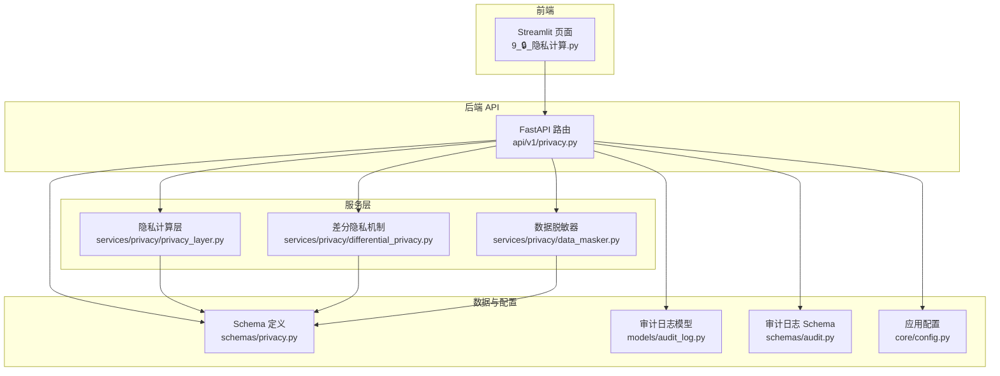
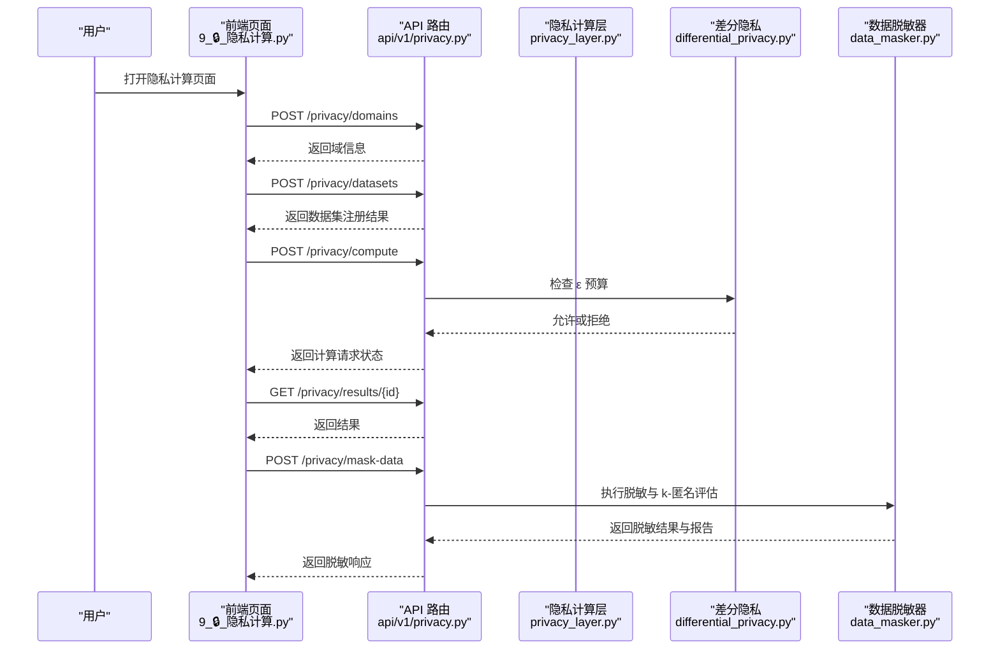
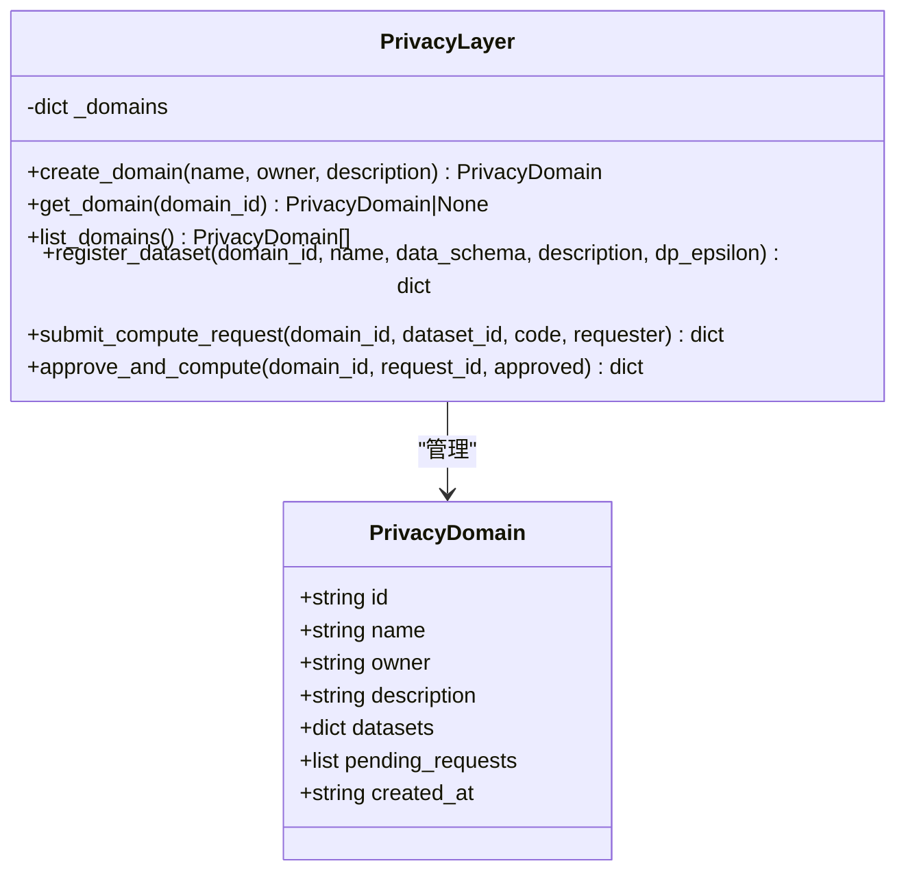
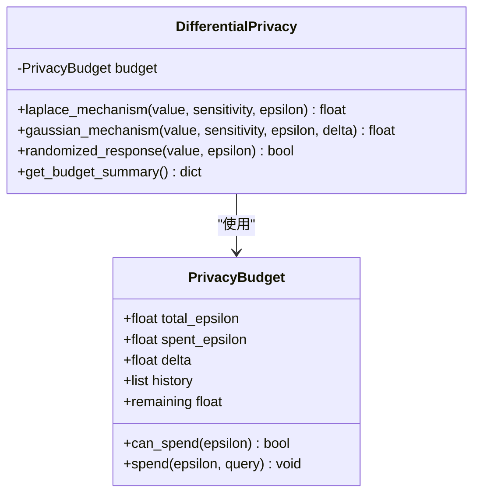
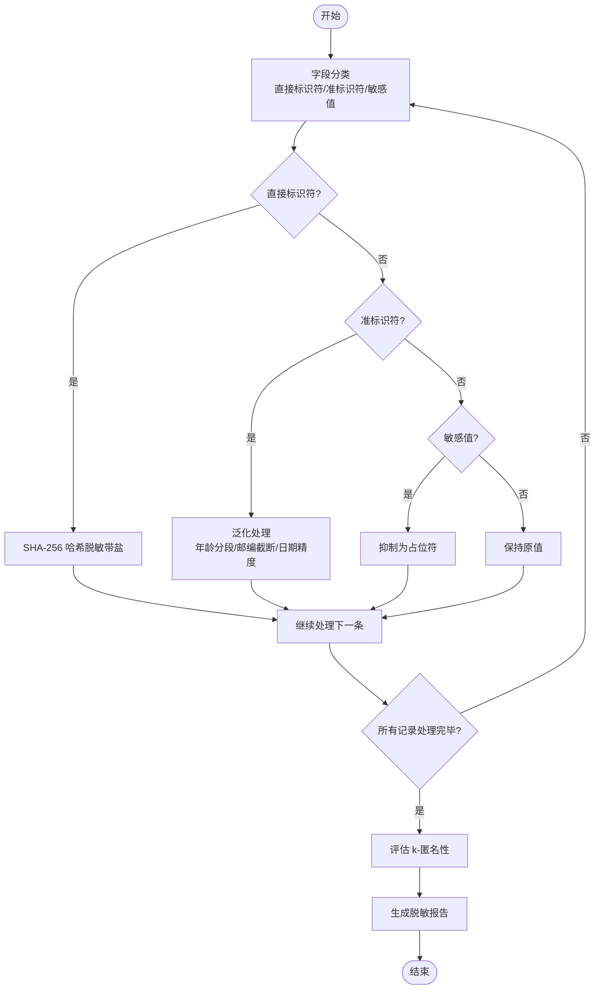
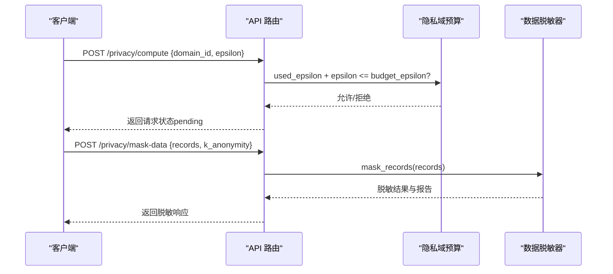
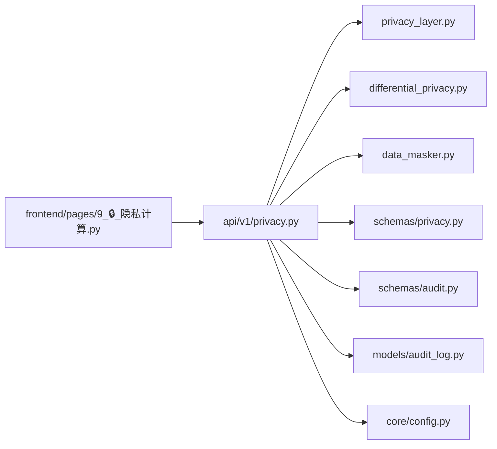

# 隐私计算页面

<cite>
**本文引用的文件**   
- [privacy.py](file://backend/app/api/v1/privacy.py)
- [privacy_layer.py](file://backend/app/services/privacy/privacy_layer.py)
- [differential_privacy.py](file://backend/app/services/privacy/differential_privacy.py)
- [data_masker.py](file://backend/app/services/privacy/data_masker.py)
- [privacy.py](file://backend/app/schemas/privacy.py)
- [9_🔒_隐私计算.py](file://frontend/pages/9_🔒_隐私计算.py)
- [audit_log.py](file://backend/app/models/audit_log.py)
- [audit.py](file://backend/app/schemas/audit.py)
- [config.py](file://backend/app/core/config.py)
- [test_privacy_layer.py](file://tests/test_privacy_layer.py)
- [test_differential_privacy.py](file://tests/test_differential_privacy.py)
</cite>

## 目录
1. [简介](#简介)
2. [项目结构](#项目结构)
3. [核心组件](#核心组件)
4. [架构总览](#架构总览)
5. [详细组件分析](#详细组件分析)
6. [依赖关系分析](#依赖关系分析)
7. [性能考量](#性能考量)
8. [故障排查指南](#故障排查指南)
9. [结论](#结论)
10. [附录](#附录)

## 简介
本文件为“隐私计算页面”的详细开发文档，覆盖数据脱敏、差分隐私与多方安全计算的实现与使用方式。重点说明：
- 隐私预算配置与消耗追踪
- 噪声添加机制（拉普拉斯、高斯、随机响应）
- 数据查询保护与合规性检查（k-匿名、HIPAA Safe Harbor）
- 敏感数据识别与脱敏规则配置
- 隐私风险评估与审计报告生成
- 隐私算法库集成、性能影响评估、合规性验证与审计日志

## 项目结构
隐私计算相关代码主要分布在后端服务层、API 层、前端页面以及测试中：
- API 层：提供隐私域管理、数据集注册、远程计算提交、结果查询与数据脱敏接口
- 服务层：包含隐私计算层（模拟 PySyft 域）、差分隐私机制、数据脱敏器
- 前端页面：Streamlit 页面用于创建域、注册数据集、提交计算请求与查看预算监控
- 模型与 Schema：审计日志模型与隐私相关的数据结构定义
- 配置：PySyft 域名与端口等环境配置项
- 测试：对隐私层与差分隐私的单元测试

图表来源
- [privacy.py:1-177](file://backend/app/api/v1/privacy.py#L1-L177)
- [privacy_layer.py:1-199](file://backend/app/services/privacy/privacy_layer.py#L1-L199)
- [differential_privacy.py:1-151](file://backend/app/services/privacy/differential_privacy.py#L1-L151)
- [data_masker.py:1-294](file://backend/app/services/privacy/data_masker.py#L1-L294)
- [privacy.py:1-84](file://backend/app/schemas/privacy.py#L1-L84)
- [audit_log.py:1-45](file://backend/app/models/audit_log.py#L1-L45)
- [audit.py:1-39](file://backend/app/schemas/audit.py#L1-L39)
- [config.py:1-144](file://backend/app/core/config.py#L1-L144)
- [9_🔒_隐私计算.py:1-177](file://frontend/pages/9_🔒_隐私计算.py#L1-L177)

章节来源
- [privacy.py:1-177](file://backend/app/api/v1/privacy.py#L1-L177)
- [privacy_layer.py:1-199](file://backend/app/services/privacy/privacy_layer.py#L1-L199)
- [differential_privacy.py:1-151](file://backend/app/services/privacy/differential_privacy.py#L1-L151)
- [data_masker.py:1-294](file://backend/app/services/privacy/data_masker.py#L1-L294)
- [privacy.py:1-84](file://backend/app/schemas/privacy.py#L1-L84)
- [9_🔒_隐私计算.py:1-177](file://frontend/pages/9_🔒_隐私计算.py#L1-L177)
- [audit_log.py:1-45](file://backend/app/models/audit_log.py#L1-L45)
- [audit.py:1-39](file://backend/app/schemas/audit.py#L1-L39)
- [config.py:1-144](file://backend/app/core/config.py#L1-L144)

## 核心组件
- 隐私计算层（PrivacyLayer）
  - 职责：模拟 PySyft 域行为，支持创建域、注册数据集、提交计算请求、审批执行
  - 关键点：数据不出域；所有者保留控制权；内存存储（可替换为数据库 + 真实 PySyft 域）
- 差分隐私（DifferentialPrivacy）
  - 职责：提供拉普拉斯、高斯、随机响应三种噪声机制，并维护 ε 预算
  - 关键点：预算不足时抛出异常；记录历史消费明细
- 数据脱敏器（DataMasker）
  - 职责：直接标识符哈希、准标识符泛化、敏感值抑制，并进行 k-匿名评估
  - 关键点：遵循 HIPAA Safe Harbor 18 项标识符处理策略；输出脱敏报告
- API 层（privacy.py）
  - 职责：暴露隐私域管理、数据集注册、远程计算提交、结果查询与数据脱敏接口
  - 关键点：在提交计算前校验 ε 预算；返回统一 ApiResponse 格式
- 前端页面（9_🔒_隐私计算.py）
  - 职责：提供可视化界面进行域管理、数据集注册、计算请求提交与预算监控展示
- 审计日志（AuditLog 与 Audit Schema）
  - 职责：不可篡改的 append-only 审计记录，便于合规审查与追溯
- 配置（Config）
  - 职责：加载 PySyft 域名与端口等环境变量，支撑隐私域运行参数

章节来源
- [privacy_layer.py:1-199](file://backend/app/services/privacy/privacy_layer.py#L1-L199)
- [differential_privacy.py:1-151](file://backend/app/services/privacy/differential_privacy.py#L1-L151)
- [data_masker.py:1-294](file://backend/app/services/privacy/data_masker.py#L1-L294)
- [privacy.py:1-177](file://backend/app/api/v1/privacy.py#L1-L177)
- [9_🔒_隐私计算.py:1-177](file://frontend/pages/9_🔒_隐私计算.py#L1-L177)
- [audit_log.py:1-45](file://backend/app/models/audit_log.py#L1-L45)
- [audit.py:1-39](file://backend/app/schemas/audit.py#L1-L39)
- [config.py:1-144](file://backend/app/core/config.py#L1-L144)

## 架构总览
系统采用前后端分离架构，前端通过 Streamlit 页面调用后端 FastAPI 接口，后端在服务层实现隐私计算、差分隐私与数据脱敏逻辑，并通过 Schema 与模型进行数据契约与持久化。

图表来源
- [privacy.py:1-177](file://backend/app/api/v1/privacy.py#L1-L177)
- [privacy_layer.py:1-199](file://backend/app/services/privacy/privacy_layer.py#L1-L199)
- [differential_privacy.py:1-151](file://backend/app/services/privacy/differential_privacy.py#L1-L151)
- [data_masker.py:1-294](file://backend/app/services/privacy/data_masker.py#L1-L294)
- [9_🔒_隐私计算.py:1-177](file://frontend/pages/9_🔒_隐私计算.py#L1-L177)

## 详细组件分析

### 隐私计算层（PrivacyLayer）
- 设计要点
  - 以内存字典存储域与数据集，便于快速原型与测试
  - 支持提交计算请求后进入待审批队列，由数据所有者审批执行
  - 与 PySyft 域概念对齐，后续可替换为真实分布式执行引擎
- 关键方法
  - create_domain：创建隐私域并记录创建时间
  - register_dataset：将数据集注册到指定域，附带 schema 与 ε 预算
  - submit_compute_request：提交计算代码与请求者信息，状态为 pending
  - approve_and_compute：批准则执行（占位结果），拒绝则标记 rejected
- 复杂度与扩展
  - 当前为 O(1) 查找与追加操作；可扩展为数据库持久化与并发控制

图表来源
- [privacy_layer.py:1-199](file://backend/app/services/privacy/privacy_layer.py#L1-L199)

章节来源
- [privacy_layer.py:1-199](file://backend/app/services/privacy/privacy_layer.py#L1-L199)
- [test_privacy_layer.py:1-145](file://tests/test_privacy_layer.py#L1-L145)

### 差分隐私（DifferentialPrivacy）
- 设计要点
  - 维护 PrivacyBudget，跟踪 total_epsilon、spent_epsilon、delta 与历史
  - 提供拉普拉斯、高斯、随机响应三种噪声机制
  - 每次加噪前检查预算是否足够，不足则抛出运行时错误
- 关键方法
  - laplace_mechanism：按敏感度与 ε 计算尺度并添加拉普拉斯噪声
  - gaussian_mechanism：按 δ 与 ε 计算 σ 并添加高斯噪声
  - randomized_response：基于概率翻转布尔值，适用于敏感属性调查
  - get_budget_summary：汇总预算使用情况
- 复杂度与扩展
  - 预算检查与消耗为 O(1)；历史记录增长为线性；可扩展为持久化与聚合统计

图表来源
- [differential_privacy.py:1-151](file://backend/app/services/privacy/differential_privacy.py#L1-L151)

章节来源
- [differential_privacy.py:1-151](file://backend/app/services/privacy/differential_privacy.py#L1-L151)
- [test_differential_privacy.py:1-126](file://tests/test_differential_privacy.py#L1-L126)

### 数据脱敏器（DataMasker）
- 设计要点
  - 字段分类：直接标识符、准标识符、敏感值
  - 处理策略：直接标识符 SHA-256 哈希（带盐）、准标识符泛化（年龄分段、邮编截断、日期精度）、敏感值抑制为占位符
  - 合规性：HIPAA Safe Harbor 18 项标识符处理；k-匿名评估
- 关键方法
  - mask_record / mask_records：单条与批量脱敏
  - _generalize_age / _generalize_date / _generalize_zip / _generalize_race：泛化策略
  - _evaluate_k_anonymity：按准标识符组合分组，评估最小同质组大小与违规项
- 复杂度与扩展
  - 批量脱敏为 O(n)，k-匿名评估为 O(n log n) 或 O(n) 取决于分组实现；可扩展为并行与增量评估

图表来源
- [data_masker.py:1-294](file://backend/app/services/privacy/data_masker.py#L1-L294)

章节来源
- [data_masker.py:1-294](file://backend/app/services/privacy/data_masker.py#L1-L294)

### API 层（privacy.py）
- 设计要点
  - 提供隐私域、数据集、计算与脱敏的统一入口
  - 在提交计算前校验 ε 预算，不足则返回验证错误
  - 返回统一的 ApiResponse 包装，包含 meta.request_id 用于追踪
- 关键端点
  - POST /privacy/domains：创建隐私域
  - POST /privacy/datasets：注册数据集（含 mock_data 预览）
  - POST /privacy/compute：提交远程计算请求（携带 ε）
  - GET /privacy/results/{request_id}：获取计算结果
  - POST /privacy/mask-data：数据脱敏（HIPAA Safe Harbor）
- 错误处理
  - NotFoundError：域或结果不存在
  - ValidationError：ε 预算不足

图表来源
- [privacy.py:1-177](file://backend/app/api/v1/privacy.py#L1-L177)
- [data_masker.py:1-294](file://backend/app/services/privacy/data_masker.py#L1-L294)

章节来源
- [privacy.py:1-177](file://backend/app/api/v1/privacy.py#L1-L177)

### 前端页面（9_🔒_隐私计算.py）
- 设计要点
  - 三个标签页：隐私域管理、计算请求、差分隐私
  - 域管理：创建域、列出域、注册数据集（含 schema JSON 输入与 ε 预算滑块）
  - 计算请求：填写域 ID、数据集 ID、计算代码并提交
  - 差分隐私：展示预算指标（总 ε、已消耗、剩余、查询次数）与进度条
- 交互流程
  - 表单提交 → 调用后端 API → 成功提示与刷新页面
  - 错误捕获与友好提示

章节来源
- [9_🔒_隐私计算.py:1-177](file://frontend/pages/9_🔒_隐私计算.py#L1-L177)

### 审计日志（AuditLog 与 Audit Schema）
- 设计要点
  - Append-only 模型，禁止 UPDATE/DELETE，保障不可篡改
  - 索引优化：action + created_at 复合索引，便于按时间与动作范围扫描
  - 字段包括用户、资源类型与 ID、变更前后值、IP 与 User-Agent、时间戳
- 使用场景
  - 记录隐私域创建、数据集注册、计算请求提交与审批、数据脱敏等操作
  - 配合合规审计与问题回溯

章节来源
- [audit_log.py:1-45](file://backend/app/models/audit_log.py#L1-L45)
- [audit.py:1-39](file://backend/app/schemas/audit.py#L1-L39)

### 配置（Config）
- 设计要点
  - 基于 pydantic-settings 的环境变量加载，支持 .env 与优先级
  - 隐私相关配置：pysyft_domain_port、pysyft_domain_name
- 使用建议
  - 在生产环境设置强密码与安全的域名与端口
  - 结合 CORS 与认证配置确保访问控制

章节来源
- [config.py:1-144](file://backend/app/core/config.py#L1-L144)

## 依赖关系分析
- 模块耦合
  - API 层依赖服务层（隐私层、差分隐私、脱敏器）与 Schema 定义
  - 服务层内部低耦合，各自独立实现特定功能
  - 前端仅依赖 API 接口，不直接访问服务层
- 外部依赖
  - FastAPI、Pydantic、SQLAlchemy、loguru 等
  - 未来可引入 PySyft 作为真实多方安全计算引擎

图表来源
- [privacy.py:1-177](file://backend/app/api/v1/privacy.py#L1-L177)
- [privacy_layer.py:1-199](file://backend/app/services/privacy/privacy_layer.py#L1-L199)
- [differential_privacy.py:1-151](file://backend/app/services/privacy/differential_privacy.py#L1-L151)
- [data_masker.py:1-294](file://backend/app/services/privacy/data_masker.py#L1-L294)
- [privacy.py:1-84](file://backend/app/schemas/privacy.py#L1-L84)
- [audit.py:1-39](file://backend/app/schemas/audit.py#L1-L39)
- [audit_log.py:1-45](file://backend/app/models/audit_log.py#L1-L45)
- [config.py:1-144](file://backend/app/core/config.py#L1-L144)
- [9_🔒_隐私计算.py:1-177](file://frontend/pages/9_🔒_隐私计算.py#L1-L177)

章节来源
- [privacy.py:1-177](file://backend/app/api/v1/privacy.py#L1-L177)
- [privacy_layer.py:1-199](file://backend/app/services/privacy/privacy_layer.py#L1-L199)
- [differential_privacy.py:1-151](file://backend/app/services/privacy/differential_privacy.py#L1-L151)
- [data_masker.py:1-294](file://backend/app/services/privacy/data_masker.py#L1-L294)
- [privacy.py:1-84](file://backend/app/schemas/privacy.py#L1-L84)
- [audit.py:1-39](file://backend/app/schemas/audit.py#L1-L39)
- [audit_log.py:1-45](file://backend/app/models/audit_log.py#L1-L45)
- [config.py:1-144](file://backend/app/core/config.py#L1-L144)
- [9_🔒_隐私计算.py:1-177](file://frontend/pages/9_🔒_隐私计算.py#L1-L177)

## 性能考量
- 差分隐私
  - 预算检查与消耗为常数时间；多次查询累计消耗需关注历史列表增长
  - 建议在高频查询场景下对历史进行归档与压缩
- 数据脱敏
  - 批量脱敏为线性复杂度；k-匿名评估涉及分组统计，建议对大规模数据使用分片或并行处理
  - 哈希脱敏使用 SHA-256，注意 CPU 开销与 I/O 瓶颈
- 隐私计算层
  - 内存存储适合原型阶段；生产环境应迁移至数据库并引入事务与并发锁
- 前端展示
  - 预算监控与进度条渲染应避免频繁轮询，建议使用事件驱动或长连接

[本节为通用指导，无需具体文件分析]

## 故障排查指南
- 常见错误
  - 隐私域或结果不存在：检查 domain_id 与 request_id 是否正确传递
  - ε 预算不足：确认域预算与本次请求 ε 之和未超过阈值
  - 数据脱敏失败：检查 records 结构与字段名是否符合直接标识符/准标识符/敏感值分类
- 调试建议
  - 启用日志（loguru）查看脱敏与预算消耗详情
  - 使用单元测试复现问题路径（参考 test_privacy_layer.py 与 test_differential_privacy.py）
  - 审计日志用于定位操作来源与时间线

章节来源
- [privacy.py:1-177](file://backend/app/api/v1/privacy.py#L1-L177)
- [differential_privacy.py:1-151](file://backend/app/services/privacy/differential_privacy.py#L1-L151)
- [data_masker.py:1-294](file://backend/app/services/privacy/data_masker.py#L1-L294)
- [test_privacy_layer.py:1-145](file://tests/test_privacy_layer.py#L1-L145)
- [test_differential_privacy.py:1-126](file://tests/test_differential_privacy.py#L1-L126)

## 结论
本隐私计算页面实现了数据脱敏、差分隐私与多方安全计算的核心能力，并提供可视化的前端交互与审计日志支持。通过严格的预算管理与合规性检查，系统在保护个体隐私的同时满足科研协作需求。后续可进一步集成真实 PySyft 域、增强审计与报表能力，并对大规模数据处理进行性能优化。

[本节为总结，无需具体文件分析]

## 附录
- 隐私预算配置
  - 在创建隐私域时设置 budget_epsilon；提交计算请求时声明本次 ε 消耗
  - 差分隐私机制在加噪前自动检查预算，不足则拒绝
- 噪声添加
  - 拉普拉斯机制适用于计数与求和类查询
  - 高斯机制适用于连续型查询且需要 δ 参数
  - 随机响应适用于布尔型敏感属性
- 数据查询保护
  - 在 API 层对 ε 预算进行前置校验
  - 结果返回前可进行二次脱敏与聚合限制
- 合规性检查
  - 脱敏器内置 HIPAA Safe Harbor 18 项标识符处理
  - k-匿名评估输出违规项与最小同质组大小
- 敏感数据识别与脱敏规则配置
  - 通过 MaskingConfig 调整盐值、年龄分段、邮编长度、日期精度与 k 值
- 隐私风险评估与审计报告
  - 使用脱敏报告与审计日志生成合规性报告
  - 结合预算历史与操作轨迹进行风险量化
- 隐私算法库集成
  - 当前为轻量实现，可替换为更完善的隐私算法库（如 OpenMined PySyft）
- 性能影响评估
  - 基准测试与压测建议：关注预算检查、哈希计算与分组统计耗时
- 合规性验证
  - 单元测试覆盖预算与脱敏逻辑；端到端测试验证完整流程
- 审计日志实现细节
  - Append-only 模型与索引优化；记录用户、资源、变更前后值与元数据

[本节为补充说明，无需具体文件分析]