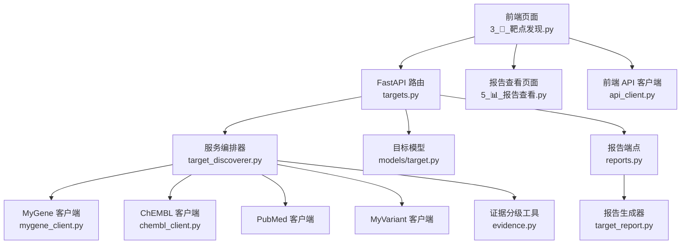
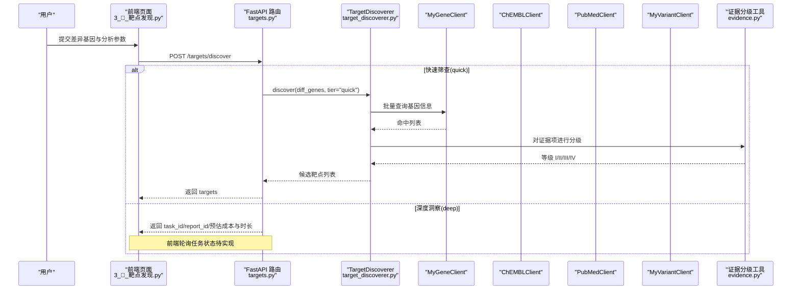
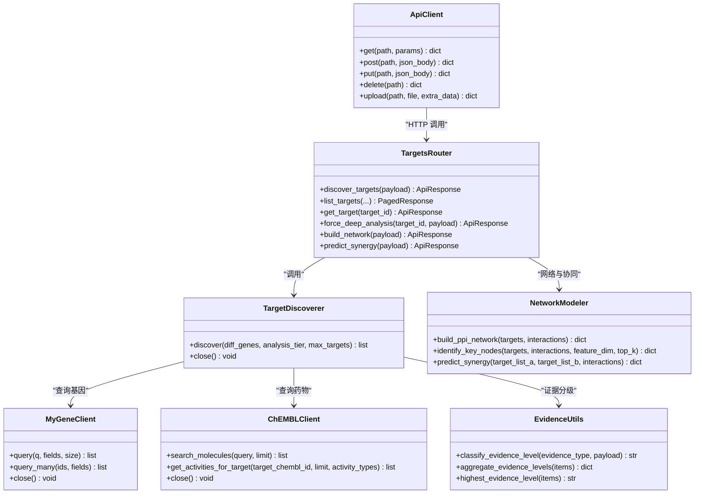

# 靶点发现页面

<cite>
**本文引用的文件**   
- [前端页面：3_🎯_靶点发现.py](file://precision-drug-design/frontend/pages/3_🎯_靶点发现.py)
- [API 路由：targets.py](file://precision-drug-design/backend/app/api/v1/targets.py)
- [服务编排器：target_discoverer.py](file://precision-drug-design/backend/app/services/analyzer/target_discoverer.py)
- [知识库客户端：mygene_client.py](file://precision-drug-design/backend/app/services/knowledge/mygene_client.py)
- [知识库客户端：chembl_client.py](file://precision-drug-design/backend/app/services/knowledge/chembl_client.py)
- [证据分级工具：evidence.py](file://precision-drug-design/backend/app/utils/evidence.py)
- [数据模型：target.py](file://precision-drug-design/backend/app/models/target.py)
- [报告生成器：target_report.py](file://precision-drug-design/backend/app/services/report/target_report.py)
- [前端页面：5_📊_报告查看.py](file://precision-drug-design/frontend/pages/5_📊_报告查看.py)
- [API 路由：reports.py](file://precision-drug-design/backend/app/api/v1/reports.py)
- [网络建模器：network_modeler.py](file://precision-drug-design/backend/app/services/analyzer/network_modeler.py)
- [假设与记录模型：hypothesis.py](file://precision-drug-design/backend/app/models/hypothesis.py)
- [前端 API 客户端：api_client.py](file://precision-drug-design/frontend/api_client.py)
</cite>

## 目录
1. [简介](#简介)
2. [项目结构](#项目结构)
3. [核心组件](#核心组件)
4. [架构总览](#架构总览)
5. [详细组件分析](#详细组件分析)
6. [依赖关系分析](#依赖关系分析)
7. [性能与长任务处理](#性能与长任务处理)
8. [可视化与报告导出](#可视化与报告导出)
9. [故障排查指南](#故障排查指南)
10. [结论](#结论)

## 简介
本文件面向“靶点发现”页面的开发与集成，系统性说明 AI 驱动的靶点发现工作流：差异表达输入、知识库检索（MyGene、ChEMBL、PubMed、MyVariant）、证据评估与分级、候选排序、结果可视化与证据链展示。文档同时覆盖分析参数配置、算法选择、进度跟踪、结果缓存、对比分析、生物医学数据库集成、可视化图表定制、报告生成与导出等实现细节，帮助开发者快速理解并扩展该功能。

## 项目结构
靶点发现功能由前端 Streamlit 页面驱动，调用后端 FastAPI 接口，后端通过服务编排器协调多个知识库客户端完成数据检索与证据聚合，最终输出结构化结果与可导出报告。

图示来源
- [前端页面：3_🎯_靶点发现.py:1-157](file://precision-drug-design/frontend/pages/3_🎯_靶点发现.py#L1-L157)
- [API 路由：targets.py:1-344](file://precision-drug-design/backend/app/api/v1/targets.py#L1-L344)
- [服务编排器：target_discoverer.py:1-176](file://precision-drug-design/backend/app/services/analyzer/target_discoverer.py#L1-L176)
- [知识库客户端：mygene_client.py:1-97](file://precision-drug-design/backend/app/services/knowledge/mygene_client.py#L1-L97)
- [知识库客户端：chembl_client.py:1-127](file://precision-drug-design/backend/app/services/knowledge/chembl_client.py#L1-L127)
- [证据分级工具：evidence.py:1-103](file://precision-drug-design/backend/app/utils/evidence.py#L1-L103)
- [数据模型：target.py:1-52](file://precision-drug-design/backend/app/models/target.py#L1-L52)
- [报告生成器：target_report.py:1-215](file://precision-drug-design/backend/app/services/report/target_report.py#L1-L215)
- [前端页面：5_📊_报告查看.py:1-112](file://precision-drug-design/frontend/pages/5_📊_报告查看.py#L1-L112)
- [API 路由：reports.py:1-181](file://precision-drug-design/backend/app/api/v1/reports.py#L1-L181)
- [前端 API 客户端：api_client.py:1-251](file://precision-drug-design/frontend/api_client.py#L1-L251)

章节来源
- [前端页面：3_🎯_靶点发现.py:1-157](file://precision-drug-design/frontend/pages/3_🎯_靶点发现.py#L1-L157)
- [API 路由：targets.py:1-344](file://precision-drug-design/backend/app/api/v1/targets.py#L1-L344)
- [服务编排器：target_discoverer.py:1-176](file://precision-drug-design/backend/app/services/analyzer/target_discoverer.py#L1-L176)

## 核心组件
- 前端交互层
  - 靶点发现表单：支持差异基因列表输入、项目 ID、分析层级（quick/deep）、最大靶点数。
  - 结果展示：概览统计、靶点卡片、证据项列表、操作按钮（生成报告、深度分析、加入假设）。
  - 报告查看：报告列表、详情（Markdown + JSON）、CDISC 导出入口。
- 后端 API 层
  - 靶点发现：POST /targets/discover，支持 quick 同步返回与 deep 异步任务模式。
  - 靶点查询：GET /targets 分页过滤；GET /targets/{id} 详情含证据项和相关分子。
  - 强制深度分析：POST /targets/{id}/force-deep-analysis（创始人角色）。
  - 网络协同：POST /targets/network、POST /targets/synergy。
  - 报告管理：GET /reports、GET /reports/{id}、GET /reports/{id}/cdisc、POST /reports/{id}/regenerate。
- 服务编排与知识库
  - TargetDiscoverer：批量查询 MyGene，按层级并行检索 PubMed/ChEMBL，构造证据项并分级。
  - MyGeneClient/ChEMBLClient/PubmedClient/MyVariantClient：封装外部数据库 REST 调用。
  - Evidence 工具：依据类型与载荷推断证据等级 I/II/III/IV。
- 数据模型与报告
  - Target/EvidenceItem/Molecule 模型与关联。
  - TargetReportGenerator：生成 Markdown 与 JSON 报告，汇总证据分布与最高等级。

章节来源
- [前端页面：3_🎯_靶点发现.py:34-157](file://precision-drug-design/frontend/pages/3_🎯_靶点发现.py#L34-L157)
- [API 路由：targets.py:42-131](file://precision-drug-design/backend/app/api/v1/targets.py#L42-L131)
- [服务编排器：target_discoverer.py:52-139](file://precision-drug-design/backend/app/services/analyzer/target_discoverer.py#L52-L139)
- [证据分级工具：evidence.py:39-103](file://precision-drug-design/backend/app/utils/evidence.py#L39-L103)
- [数据模型：target.py:14-52](file://precision-drug-design/backend/app/models/target.py#L14-L52)
- [报告生成器：target_report.py:21-76](file://precision-drug-design/backend/app/services/report/target_report.py#L21-L76)

## 架构总览
AI 驱动的靶点发现流程从用户输入差异基因开始，经后端路由进入编排器，编排器并行调用多源知识库，构建证据项并进行证据分级，最后返回候选靶点列表或异步任务标识。报告模块将证据与分子信息整合为 Markdown/JSON，并提供 CDISC 导出能力。

图示来源
- [前端页面：3_🎯_靶点发现.py:74-106](file://precision-drug-design/frontend/pages/3_🎯_靶点发现.py#L74-L106)
- [API 路由：targets.py:42-131](file://precision-drug-design/backend/app/api/v1/targets.py#L42-L131)
- [服务编排器：target_discoverer.py:52-139](file://precision-drug-design/backend/app/services/analyzer/target_discoverer.py#L52-L139)
- [知识库客户端：mygene_client.py:74-92](file://precision-drug-design/backend/app/services/knowledge/mygene_client.py#L74-L92)
- [知识库客户端：chembl_client.py:48-70](file://precision-drug-design/backend/app/services/knowledge/chembl_client.py#L48-L70)
- [证据分级工具：evidence.py:39-75](file://precision-drug-design/backend/app/utils/evidence.py#L39-L75)

## 详细组件分析

### 前端页面：靶点发现
- 表单渲染与校验
  - 差异基因文本区支持换行或逗号分隔，自动清洗空项。
  - 分析层级 quick/deep 影响后端执行模式与耗时预估。
  - 最大靶点数限制返回规模。
- 结果展示
  - 概览指标：靶点总数、有文献支持数、有药物数据数、分析层级。
  - 靶点卡片：显示 symbol、全名、Gene ID、摘要、证据数量。
  - 证据列表：每条证据显示等级、类型、来源。
  - 操作按钮：生成报告跳转至报告查看页；深度分析与加入假设为占位提示。
- 错误处理
  - 捕获异常并提示后端依赖可用性（如 mygene/chembl）。

章节来源
- [前端页面：3_🎯_靶点发现.py:34-157](file://precision-drug-design/frontend/pages/3_🎯_靶点发现.py#L34-L157)

### 后端 API：靶点发现与查询
- POST /targets/discover
  - quick 模式：同步执行 TargetDiscoverer.discover，返回 targets。
  - deep 模式：返回 task_id/report_id/estimated_cost_usd/estimated_duration_seconds/mode="async"。
  - 若未提供 focus_genes，尝试从数据集读取 marker_genes；无则降级返回空结果与错误信息。
- GET /targets
  - 支持 project_id、evidence_level、gene_symbol 过滤，分页返回。
- GET /targets/{id}
  - 加载 Target 及其证据项与相关分子，返回 TargetDetail。
- POST /targets/{id}/force-deep-analysis
  - 仅 founder 角色可调用，记录强制分析历史到 metadata。
- POST /targets/network 与 /targets/synergy
  - 使用 NetworkModeler 构建 PPI 网络、识别关键节点与模块，预测协同效应。

章节来源
- [API 路由：targets.py:42-344](file://precision-drug-design/backend/app/api/v1/targets.py#L42-L344)

### 服务编排器：TargetDiscoverer
- 工作流程
  - 批量查询 MyGene 获取 gene symbol/name/entrezgene/summary。
  - 根据 analysis_tier 决定检索范围：
    - deep：并行检索 PubMed 与 ChEMBL，构造 literature 与 drug_activity 证据项。
    - quick：仅标记 differential_expression 证据项。
  - 对每条证据调用 classify_evidence_level 进行分级。
  - 按证据数量降序排序返回候选靶点。
- 资源管理
  - close() 关闭所有客户端连接。

章节来源
- [服务编排器：target_discoverer.py:52-176](file://precision-drug-design/backend/app/services/analyzer/target_discoverer.py#L52-L176)

### 知识库客户端：MyGene 与 ChEMBL
- MyGeneClient
  - get_gene/query/query_many：支持单条与批量查询，字段可定制。
  - 超时与重试策略通过 HttpClient 配置。
- ChEMBLClient
  - search_molecules/get_activities_for_target/get_approved_drugs_for_indication：检索分子、活性数据与已批准药物。
  - 返回数据结构包含 properties/structures/activities 等。

章节来源
- [知识库客户端：mygene_client.py:39-92](file://precision-drug-design/backend/app/services/knowledge/mygene_client.py#L39-L92)
- [知识库客户端：chembl_client.py:48-122](file://precision-drug-design/backend/app/services/knowledge/chembl_client.py#L48-L122)

### 证据评估与分级
- classify_evidence_level
  - 优先从 payload 显式等级读取。
  - 已获批药物 → I 级。
  - 临床试验阶段 → III 级。
  - 默认映射表：fda/nmpa/chembl_approved → I；guideline → II；clinical_trial_* → III；clinvar/cosmic/pubmed_case/pathway_analysis/network_inference/differential_expression → IV。
- aggregate_evidence_levels/highest_evidence_level
  - 统计各等级数量与最高等级。

章节来源
- [证据分级工具：evidence.py:39-103](file://precision-drug-design/backend/app/utils/evidence.py#L39-L103)

### 数据模型：Target 与关联
- Target
  - 字段：project_id、dataset_id、gene_symbol、gene_entrez_id、evidence_level、confidence_score、mechanism、source、metadata_。
  - 关系：evidence_items、molecules。
- 响应 Schema
  - TargetResponse/TargetDetail/EvidenceItemResponse 等用于序列化与校验。

章节来源
- [数据模型：target.py:14-52](file://precision-drug-design/backend/app/models/target.py#L14-L52)
- [靶点 Schemas：target.py:42-126](file://precision-drug-design/backend/app/schemas/target.py#L42-L126)

### 报告生成与查看
- TargetReportGenerator
  - generate：整合 target、evidence_items、related_molecules、clinical_trials、literature，输出 content_md/content_json/evidence_level_distribution。
  - _render_markdown：生成结构化 Markdown，包括证据等级分布、概述、证据列表、相关分子、临床试验、参考文献与免责声明。
- 报告查看页面
  - 列表与详情：展示证据等级分布、Markdown 内容、JSON 结构化数据。
  - CDISC 导出：触发后端导出接口，返回下载链接与过期时间。

章节来源
- [报告生成器：target_report.py:21-215](file://precision-drug-design/backend/app/services/report/target_report.py#L21-L215)
- [前端页面：5_📊_报告查看.py:27-112](file://precision-drug-design/frontend/pages/5_📊_报告查看.py#L27-L112)
- [API 路由：reports.py:76-153](file://precision-drug-design/backend/app/api/v1/reports.py#L76-L153)

### 网络建模与协同效应预测
- NetworkModeler
  - build_ppi_network：基于 NetworkX 构建图，计算密度、中心节点、连通分量。
  - find_modules：社区检测（贪婪模块度）。
  - identify_key_nodes：GraphSAGE 嵌入+度中心性；不可用时降级为中心性启发式（度/介数/接近）。
  - predict_synergy：基于 Jaccard 重叠、跨组合边数、规模因子估算协同评分与机制。
  - build_string_network：STRING 数据库占位实现（需异步调用）。

章节来源
- [网络建模器：network_modeler.py:66-370](file://precision-drug-design/backend/app/services/analyzer/network_modeler.py#L66-L370)

### 假设管理与强制深度分析
- Hypothesis/HypothesisAnalysis
  - 假设状态与优先级；记录分析层级、成本、时长。
- 强制深度分析
  - 创始人角色可强制对某靶点进行深度分析，记录原因与时间戳到 metadata。

章节来源
- [假设与记录模型：hypothesis.py:15-66](file://precision-drug-design/backend/app/models/hypothesis.py#L15-L66)
- [API 路由：targets.py:228-271](file://precision-drug-design/backend/app/api/v1/targets.py#L228-L271)

## 依赖关系分析
- 前端依赖
  - api_client：统一 HTTP 客户端、JWT 注入、响应解包、请求级缓存。
  - 页面间跳转：从靶点发现跳转到报告查看。
- 后端依赖
  - FastAPI 路由依赖 SQLAlchemy ORM、Pydantic Schemas、认证与分页依赖。
  - 服务编排器依赖多个知识库客户端与证据分级工具。
  - 网络建模器惰性加载 NetworkX/PyG，具备降级策略。

图示来源
- [前端 API 客户端：api_client.py:42-167](file://precision-drug-design/frontend/api_client.py#L42-L167)
- [API 路由：targets.py:42-344](file://precision-drug-design/backend/app/api/v1/targets.py#L42-L344)
- [服务编排器：target_discoverer.py:26-176](file://precision-drug-design/backend/app/services/analyzer/target_discoverer.py#L26-L176)
- [知识库客户端：mygene_client.py:19-97](file://precision-drug-design/backend/app/services/knowledge/mygene_client.py#L19-L97)
- [知识库客户端：chembl_client.py:20-127](file://precision-drug-design/backend/app/services/knowledge/chembl_client.py#L20-L127)
- [证据分级工具：evidence.py:39-103](file://precision-drug-design/backend/app/utils/evidence.py#L39-L103)
- [网络建模器：network_modeler.py:14-370](file://precision-drug-design/backend/app/services/analyzer/network_modeler.py#L14-L370)

## 性能与长任务处理
- 快速筛查（quick）
  - 同步执行，直接返回候选靶点列表，适合小样本与低延迟场景。
- 深度洞察（deep）
  - 异步任务模式，返回 task_id/report_id/预估成本与时长；前端应轮询任务状态（当前为占位逻辑）。
- 并发与降级
  - 编排器在 deep 模式下并行调用 PubMed 与 ChEMBL，提升吞吐。
  - 网络建模器在 PyG 不可用时自动降级为中心性启发式，保证可用性。
- 前端缓存
  - api_client 提供 cached_get 与 TTL 桶机制，减少重复请求开销。
- 连接池复用
  - httpx.Client 全局复用，降低握手与连接建立成本。

章节来源
- [API 路由：targets.py:42-131](file://precision-drug-design/backend/app/api/v1/targets.py#L42-L131)
- [服务编排器：target_discoverer.py:82-139](file://precision-drug-design/backend/app/services/analyzer/target_discoverer.py#L82-L139)
- [网络建模器：network_modeler.py:39-64](file://precision-drug-design/backend/app/services/analyzer/network_modeler.py#L39-L64)
- [前端 API 客户端：api_client.py:24-39](file://precision-drug-design/frontend/api_client.py#L24-L39)
- [前端 API 客户端：api_client.py:186-236](file://precision-drug-design/frontend/api_client.py#L186-L236)

## 可视化与报告导出
- 可视化
  - 概览指标：靶点总数、有文献支持数、有药物数据数、分析层级。
  - 证据等级分布：I/II/III/IV 四级统计与图标化展示。
  - 网络拓扑：PPI 节点/边统计、关键节点、模块划分。
- 报告生成
  - Markdown 报告：包含证据等级分布、靶点概述、证据列表、相关分子、临床试验、参考文献与免责声明。
  - JSON 结构化数据：便于二次处理与自动化流水线。
- 导出
  - CDISC SDTM 导出：返回下载 URL 与过期时间，实际 ZIP 打包在第二阶段实现。

章节来源
- [前端页面：3_🎯_靶点发现.py:108-151](file://precision-drug-design/frontend/pages/3_🎯_靶点发现.py#L108-L151)
- [报告生成器：target_report.py:78-215](file://precision-drug-design/backend/app/services/report/target_report.py#L78-L215)
- [前端页面：5_📊_报告查看.py:79-112](file://precision-drug-design/frontend/pages/5_📊_报告查看.py#L79-L112)
- [API 路由：reports.py:123-153](file://precision-drug-design/backend/app/api/v1/reports.py#L123-L153)

## 故障排查指南
- 常见错误
  - 靶点发现失败：检查后端服务是否启动，依赖（mygene/chembl）是否可用。
  - 数据集不存在：确保 dataset_id 有效且包含 marker_genes。
  - 权限不足：强制深度分析仅 founder 角色可调用。
  - 网络建模依赖缺失：NetworkX/PyG 未安装时降级为启发式。
- 定位建议
  - 查看 API 响应中的 error 字段与 meta.request_id。
  - 确认前端缓存是否导致旧数据，必要时清除缓存。
  - 检查日志中关于外部客户端失败的警告信息。

章节来源
- [前端页面：3_🎯_靶点发现.py:97-100](file://precision-drug-design/frontend/pages/3_🎯_靶点发现.py#L97-L100)
- [API 路由：targets.py:74-95](file://precision-drug-design/backend/app/api/v1/targets.py#L74-L95)
- [API 路由：targets.py:244-250](file://precision-drug-design/backend/app/api/v1/targets.py#L244-L250)
- [网络建模器：network_modeler.py:59-64](file://precision-drug-design/backend/app/services/analyzer/network_modeler.py#L59-L64)
- [前端 API 客户端：api_client.py:239-251](file://precision-drug-design/frontend/api_client.py#L239-L251)

## 结论
靶点发现页面以“快速筛查 + 深度洞察”双模式为核心，结合多源知识库与证据分级体系，形成从差异基因到候选靶点的完整闭环。系统具备良好的可扩展性与容错能力，支持网络建模与协同效应预测、报告生成与标准化导出。后续可在以下方面增强：
- 完善 deep 模式的异步任务队列与进度推送。
- 集成 STRING 数据库真实 PPI 数据与预训练 GraphSAGE 模型。
- 扩展报告模板与更多导出格式（PDF/Excel）。
- 引入更丰富的可视化组件与交互式探索。