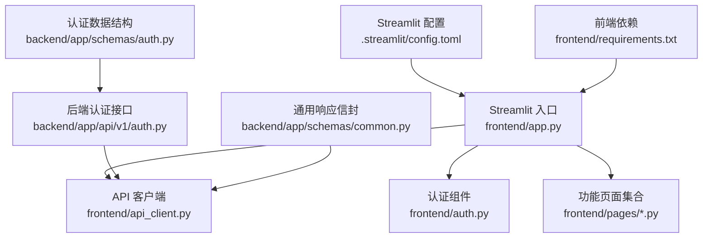
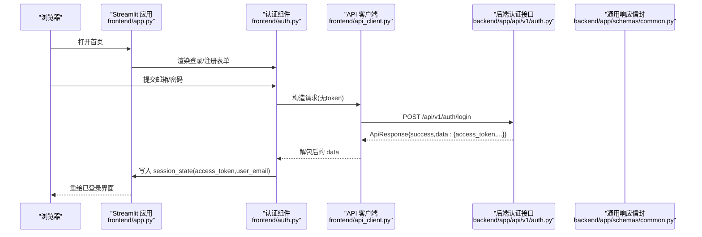
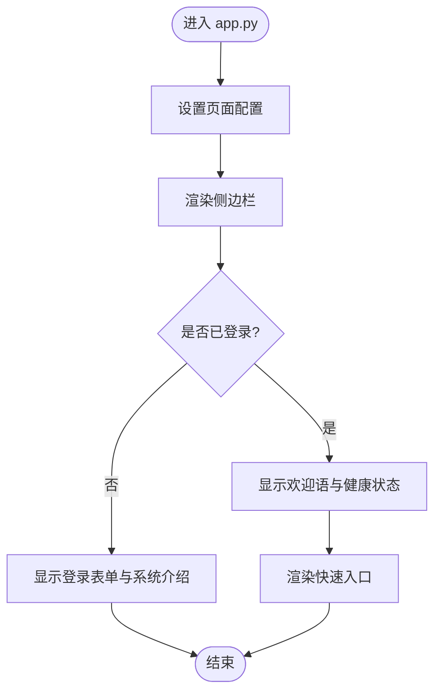
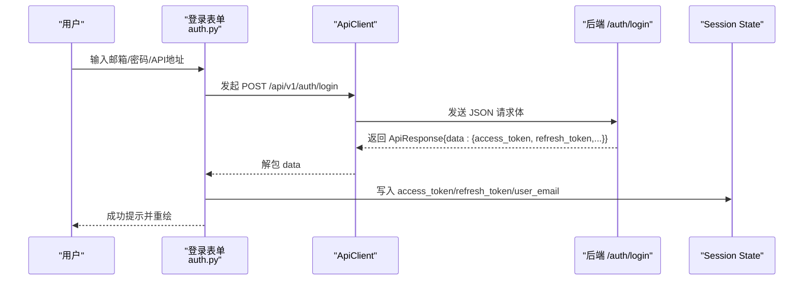
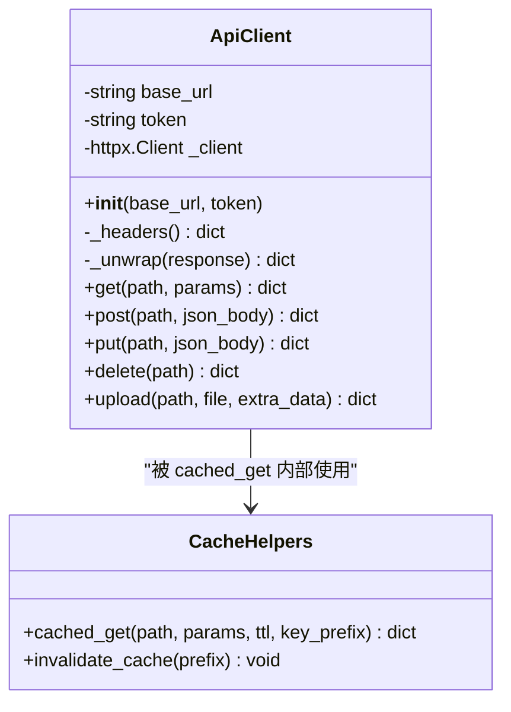
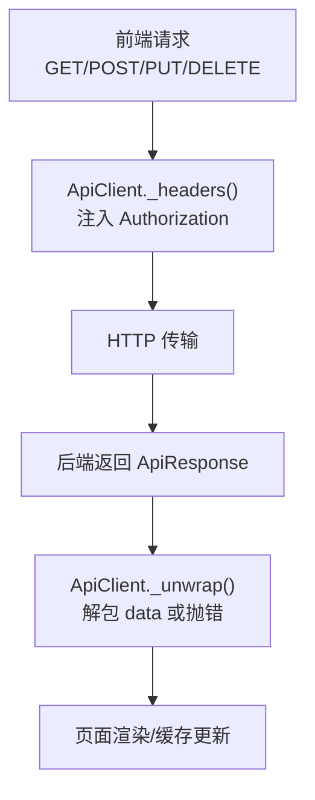
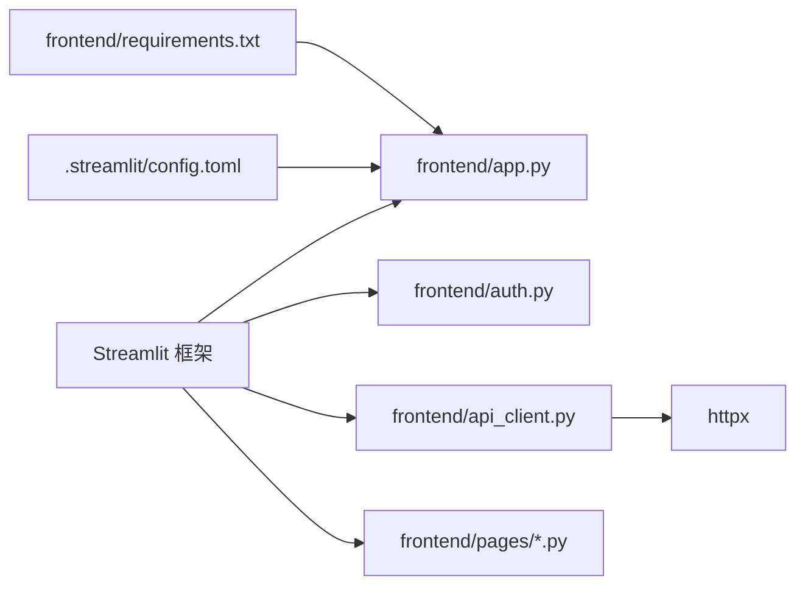

# 页面开发基础

<cite>
**本文引用的文件**
- [frontend/app.py](file://frontend/app.py)
- [frontend/api_client.py](file://frontend/api_client.py)
- [frontend/auth.py](file://frontend/auth.py)
- [.streamlit/config.toml](file://.streamlit/config.toml)
- [frontend/requirements.txt](file://frontend/requirements.txt)
- [backend/app/api/v1/auth.py](file://backend/app/api/v1/auth.py)
- [backend/app/schemas/common.py](file://backend/app/schemas/common.py)
- [backend/app/schemas/auth.py](file://backend/app/schemas/auth.py)
- [frontend/pages/1_📁_项目管理.py](file://frontend/pages/1_📁_项目管理.py)
- [frontend/pages/3_🎯_靶点发现.py](file://frontend/pages/3_🎯_靶点发现.py)
- [frontend/pages/7_🤖_AI问答.py](file://frontend/pages/7_🤖_AI问答.py)
</cite>

## 目录
1. [简介](#简介)
2. [项目结构](#项目结构)
3. [核心组件](#核心组件)
4. [架构总览](#架构总览)
5. [详细组件分析](#详细组件分析)
6. [依赖关系分析](#依赖关系分析)
7. [性能考虑](#性能考虑)
8. [故障排查指南](#故障排查指南)
9. [结论](#结论)
10. [附录](#附录)

## 简介
本指南面向在 AI 药物设计系统中基于 Streamlit 进行页面开发的工程师与研究者，系统阐述应用架构、页面路由机制、API 客户端封装、用户认证集成、页面配置与布局、状态管理、错误处理模式，并提供页面开发模板、调试技巧与性能优化最佳实践。同时解释前后端通信协议、数据格式转换与缓存策略，帮助读者快速上手并稳定扩展新页面。

## 项目结构
前端采用 Streamlit 多页面组织方式：
- 入口与全局侧边栏：frontend/app.py
- 认证与登录注册：frontend/auth.py
- API 客户端与缓存：frontend/api_client.py
- 功能页面：frontend/pages/*.py（以数字前缀控制顺序）
- 运行配置：.streamlit/config.toml
- 依赖清单：frontend/requirements.txt

图表来源
- [frontend/app.py:35-40](file://frontend/app.py#L35-L40)
- [frontend/auth.py:10-137](file://frontend/auth.py#L10-L137)
- [frontend/api_client.py:24-39](file://frontend/api_client.py#L24-L39)
- [backend/app/api/v1/auth.py:70-101](file://backend/app/api/v1/auth.py#L70-L101)
- [backend/app/schemas/common.py:63-89](file://backend/app/schemas/common.py#L63-L89)
- [backend/app/schemas/auth.py:47-55](file://backend/app/schemas/auth.py#L47-L55)
- [.streamlit/config.toml:1-16](file://.streamlit/config.toml#L1-L16)
- [frontend/requirements.txt:1-3](file://frontend/requirements.txt#L1-L3)

章节来源
- [frontend/app.py:1-157](file://frontend/app.py#L1-L157)
- [frontend/auth.py:1-137](file://frontend/auth.py#L1-L137)
- [frontend/api_client.py:1-251](file://frontend/api_client.py#L1-L251)
- [.streamlit/config.toml:1-16](file://.streamlit/config.toml#L1-L16)
- [frontend/requirements.txt:1-3](file://frontend/requirements.txt#L1-L3)

## 核心组件
- 应用入口与侧边栏导航：负责页面标题、图标、布局、侧边栏菜单与首页渲染；根据会话状态决定是否展示功能导航。
- 认证组件：提供登录/注册表单、用户菜单与演示模式提示；将 access_token、refresh_token、user_email 写入 session_state。
- API 客户端：统一封装 httpx 调用、自动注入 Authorization 头、解包后端响应信封、支持上传与请求级缓存；提供 require_auth 守卫与 cached_get 便捷函数。
- 功能页面：遵循“先鉴权、再渲染”的模式，使用 get_client/cached_get 访问后端，结合 st.session_state 管理交互状态。

章节来源
- [frontend/app.py:43-65](file://frontend/app.py#L43-L65)
- [frontend/auth.py:10-137](file://frontend/auth.py#L10-L137)
- [frontend/api_client.py:42-167](file://frontend/api_client.py#L42-L167)
- [frontend/pages/1_📁_项目管理.py:17-24](file://frontend/pages/1_📁_项目管理.py#L17-L24)

## 架构总览
整体为“前端 Streamlit + FastAPI 后端”的 REST 架构。前端通过 ApiClient 发起 HTTP 请求，后端返回统一的 ApiResponse 信封，包含 success/data/meta。认证流程基于 JWT，前端保存 token 并在后续请求中携带。

图表来源
- [frontend/auth.py:28-66](file://frontend/auth.py#L28-L66)
- [frontend/api_client.py:96-120](file://frontend/api_client.py#L96-L120)
- [backend/app/api/v1/auth.py:70-101](file://backend/app/api/v1/auth.py#L70-L101)
- [backend/app/schemas/common.py:63-89](file://backend/app/schemas/common.py#L63-L89)

## 详细组件分析

### 应用入口与页面路由
- 页面配置：设置标题、图标、布局与侧边栏初始状态。
- 侧边栏导航：登录后显示功能页链接，未登录时提示先登录。
- 首页逻辑：未登录显示登录表单与系统介绍；已登录显示健康状态与快捷入口。
- 路由机制：利用 Streamlit pages 目录下的命名规则（数字前缀+中文标签）实现页面排序与导航。

图表来源
- [frontend/app.py:35-40](file://frontend/app.py#L35-L40)
- [frontend/app.py:43-65](file://frontend/app.py#L43-L65)
- [frontend/app.py:67-147](file://frontend/app.py#L67-L147)

章节来源
- [frontend/app.py:1-157](file://frontend/app.py#L1-L157)

### 认证组件与用户会话
- 登录流程：校验输入 → 调用后端登录接口 → 解析响应信封 → 写入 session_state → 触发 rerun。
- 注册流程：校验输入 → 调用后端注册接口 → 成功提示。
- 用户菜单：显示当前用户与登出按钮，登出后清除相关 session_state。
- 演示模式提示：在未登录时给出演示账号与后端可用性说明。

图表来源
- [frontend/auth.py:28-66](file://frontend/auth.py#L28-L66)
- [backend/app/api/v1/auth.py:70-101](file://backend/app/api/v1/auth.py#L70-L101)
- [backend/app/schemas/auth.py:47-55](file://backend/app/schemas/auth.py#L47-L55)

章节来源
- [frontend/auth.py:1-137](file://frontend/auth.py#L1-L137)
- [backend/app/schemas/auth.py:1-61](file://backend/app/schemas/auth.py#L1-L61)

### API 客户端封装与缓存策略
- 连接池复用：使用 @st.cache_resource 缓存 httpx.Client，配置超时与连接池上限，减少握手开销。
- 统一请求方法：get/post/put/delete/upload，自动注入 Authorization 头。
- 响应信封解包：对 4xx/5xx 与业务失败(success=false)进行异常抛出，便于上层统一捕获。
- 请求级缓存：cached_get 使用 @st.cache_data + 时间桶 TTL 机制，按 token/base_url/params 隔离缓存；写操作后调用 invalidate_cache 失效。

图表来源
- [frontend/api_client.py:24-39](file://frontend/api_client.py#L24-L39)
- [frontend/api_client.py:42-167](file://frontend/api_client.py#L42-L167)
- [frontend/api_client.py:186-251](file://frontend/api_client.py#L186-L251)

章节来源
- [frontend/api_client.py:1-251](file://frontend/api_client.py#L1-L251)

### 页面开发模板与示例
推荐的新页面模板要点：
- 页面配置：set_page_config 设置标题、图标与布局。
- 鉴权守卫：require_auth 检查登录态，未登录则跳转首页。
- 用户菜单：render_user_menu 显示当前用户与登出。
- 数据加载：优先使用 cached_get 获取列表或概览数据，设置合理 TTL。
- 表单提交：使用 st.form 收集参数，get_client().post/put/delete 调用后端，成功后 invalidate_cache 并 st.rerun。
- 结果展示：使用 expander/metric/columns 等组件组织信息，必要时用 spinner 提示长耗时操作。

示例参考路径：
- 项目管理页面（CRUD 与缓存失效）：[frontend/pages/1_📁_项目管理.py](file://frontend/pages/1_📁_项目管理.py)
- 靶点发现页面（表单→异步任务→结果卡片）：[frontend/pages/3_🎯_靶点发现.py](file://frontend/pages/3_🎯_靶点发现.py)
- AI 问答页面（聊天历史与引用源）：[frontend/pages/7_🤖_AI问答.py](file://frontend/pages/7_🤖_AI问答.py)

章节来源
- [frontend/pages/1_📁_项目管理.py:17-137](file://frontend/pages/1_📁_项目管理.py#L17-L137)
- [frontend/pages/3_🎯_靶点发现.py:17-157](file://frontend/pages/3_🎯_靶点发现.py#L17-L157)
- [frontend/pages/7_🤖_AI问答.py:17-139](file://frontend/pages/7_🤖_AI问答.py#L17-L139)

### 前后端通信协议与数据格式
- 认证接口：POST /api/v1/auth/login 返回 ApiResponse，data 中包含 access_token、refresh_token、token_type、expires_in、user。
- 通用响应信封：ApiResponse{success, data, meta}；分页响应 PagedResponse{success, data, meta}；错误响应 ErrorResponse{success:false, error, meta}。
- 字段风格：CamelModel 支持 snake_case ↔ camelCase 双向兼容，前端可安全读取 snake_case 字段。

图表来源
- [backend/app/api/v1/auth.py:70-101](file://backend/app/api/v1/auth.py#L70-L101)
- [backend/app/schemas/common.py:63-89](file://backend/app/schemas/common.py#L63-L89)
- [backend/app/schemas/auth.py:47-55](file://backend/app/schemas/auth.py#L47-L55)
- [frontend/api_client.py:68-94](file://frontend/api_client.py#L68-L94)

章节来源
- [backend/app/api/v1/auth.py:1-147](file://backend/app/api/v1/auth.py#L1-L147)
- [backend/app/schemas/common.py:1-158](file://backend/app/schemas/common.py#L1-L158)
- [backend/app/schemas/auth.py:1-61](file://backend/app/schemas/auth.py#L1-L61)
- [frontend/api_client.py:68-94](file://frontend/api_client.py#L68-L94)

## 依赖关系分析
- 前端依赖：streamlit、httpx。
- 运行时配置：端口、主题、CORS/XSRF 开关、统计采集等由 .streamlit/config.toml 管理。
- 模块耦合：app.py 依赖 auth 与 api_client；各页面依赖 api_client 与 auth；api_client 依赖 httpx 与 streamlit 缓存装饰器。

图表来源
- [frontend/requirements.txt:1-3](file://frontend/requirements.txt#L1-L3)
- [.streamlit/config.toml:1-16](file://.streamlit/config.toml#L1-L16)
- [frontend/app.py:30-34](file://frontend/app.py#L30-L34)
- [frontend/api_client.py:18-39](file://frontend/api_client.py#L18-L39)

章节来源
- [frontend/requirements.txt:1-3](file://frontend/requirements.txt#L1-L3)
- [.streamlit/config.toml:1-16](file://.streamlit/config.toml#L1-L16)
- [frontend/app.py:30-34](file://frontend/app.py#L30-L34)
- [frontend/api_client.py:18-39](file://frontend/api_client.py#L18-L39)

## 性能考虑
- 连接池复用：@st.cache_resource 缓存 httpx.Client，配置 max_keepalive_connections/max_connections/keepalive_expiry，降低握手与 TLS 开销。
- 请求级缓存：cached_get 使用 @st.cache_data + 时间桶 TTL，避免重复网络请求；不同用户 token 隔离缓存。
- 写操作后失效：创建/更新/删除后调用 invalidate_cache，确保列表与详情及时刷新。
- 页面渲染优化：合理使用 columns/expander/metric/spinner，减少不必要的重绘；对长耗时操作使用 spinner 提升体验。

章节来源
- [frontend/api_client.py:24-39](file://frontend/api_client.py#L24-L39)
- [frontend/api_client.py:186-251](file://frontend/api_client.py#L186-L251)
- [frontend/pages/1_📁_项目管理.py:58-61](file://frontend/pages/1_📁_项目管理.py#L58-L61)

## 故障排查指南
- 登录失败
  - 现象：登录按钮报错或提示“未知错误”。
  - 排查：确认后端服务可达、API 地址正确；查看后端返回的 detail/message 字段；检查用户名/密码是否正确。
  - 参考：[frontend/auth.py:28-66](file://frontend/auth.py#L28-L66)、[backend/app/api/v1/auth.py:70-101](file://backend/app/api/v1/auth.py#L70-L101)
- 鉴权缺失
  - 现象：进入功能页提示“请先登录”。
  - 排查：检查 session_state 中是否存在 access_token；确认首页登录成功且未手动清理。
  - 参考：[frontend/api_client.py:170-180](file://frontend/api_client.py#L170-L180)
- 缓存导致数据不更新
  - 现象：修改数据后页面仍显示旧值。
  - 排查：确认写操作后是否调用 invalidate_cache；适当调整 cached_get 的 TTL。
  - 参考：[frontend/api_client.py:239-251](file://frontend/api_client.py#L239-L251)
- 网络连接问题
  - 现象：连接超时或无法建立连接。
  - 排查：检查防火墙/代理；确认 httpx 超时配置；验证后端端口与域名。
  - 参考：[frontend/api_client.py:30-39](file://frontend/api_client.py#L30-L39)
- 响应格式不一致
  - 现象：前端解析 data 失败。
  - 排查：确认后端返回 ApiResponse 信封；检查 success/data/meta 字段；注意 camelCase/snake_case 兼容。
  - 参考：[backend/app/schemas/common.py:63-89](file://backend/app/schemas/common.py#L63-L89)

章节来源
- [frontend/auth.py:28-66](file://frontend/auth.py#L28-L66)
- [frontend/api_client.py:170-180](file://frontend/api_client.py#L170-L180)
- [frontend/api_client.py:239-251](file://frontend/api_client.py#L239-L251)
- [frontend/api_client.py:30-39](file://frontend/api_client.py#L30-L39)
- [backend/app/schemas/common.py:63-89](file://backend/app/schemas/common.py#L63-L89)

## 结论
本指南梳理了 Streamlit 页面的架构与关键组件，明确了认证、API 客户端、缓存与错误处理的最佳实践。遵循“统一信封、连接池复用、请求级缓存、写后失效”的原则，可在保证用户体验的同时显著提升稳定性与性能。建议在新页面开发中严格遵循模板与规范，逐步完善功能与健壮性。

## 附录
- 运行与启动
  - 安装依赖：见 frontend/requirements.txt。
  - 启动命令：streamlit run frontend/app.py。
  - 端口与主题：见 .streamlit/config.toml。
- 常用页面路径
  - 项目管理：[frontend/pages/1_📁_项目管理.py](file://frontend/pages/1_📁_项目管理.py)
  - 靶点发现：[frontend/pages/3_🎯_靶点发现.py](file://frontend/pages/3_🎯_靶点发现.py)
  - AI 问答：[frontend/pages/7_🤖_AI问答.py](file://frontend/pages/7_🤖_AI问答.py)

章节来源
- [frontend/requirements.txt:1-3](file://frontend/requirements.txt#L1-L3)
- [.streamlit/config.toml:1-16](file://.streamlit/config.toml#L1-L16)
- [frontend/pages/1_📁_项目管理.py:1-137](file://frontend/pages/1_📁_项目管理.py#L1-L137)
- [frontend/pages/3_🎯_靶点发现.py:1-157](file://frontend/pages/3_🎯_靶点发现.py#L1-L157)
- [frontend/pages/7_🤖_AI问答.py:1-139](file://frontend/pages/7_🤖_AI问答.py#L1-L139)