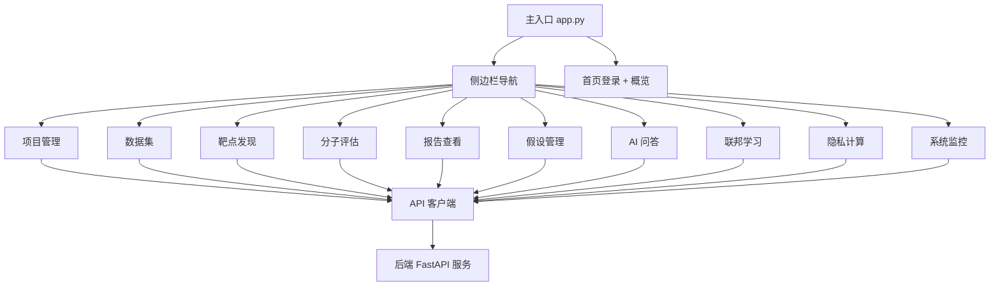
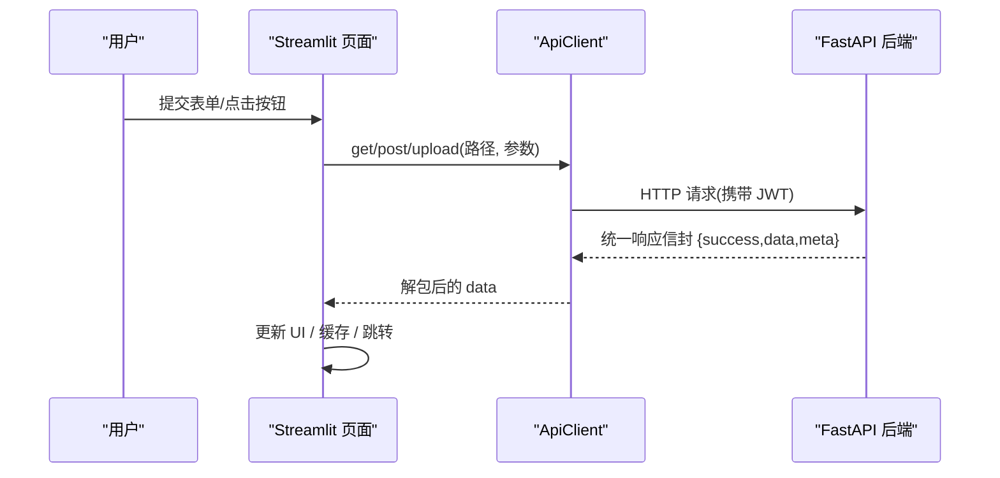
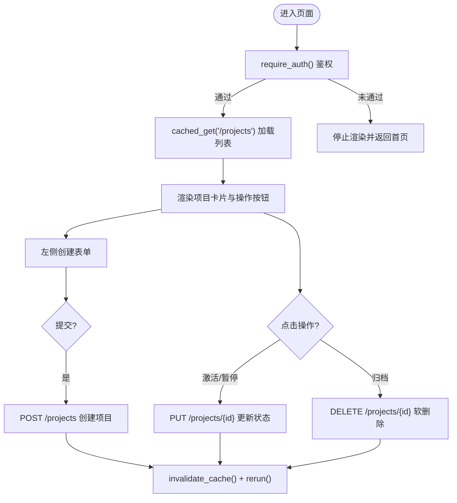
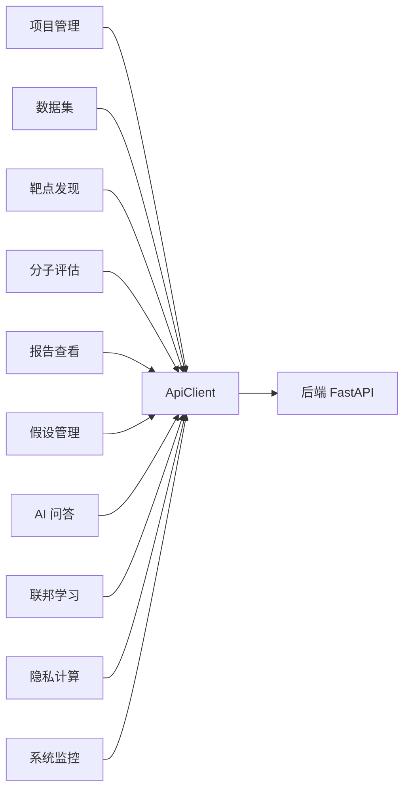

# 页面开发指南

<cite>
**本文引用的文件**   
- [frontend/app.py](file://frontend/app.py)
- [frontend/api_client.py](file://frontend/api_client.py)
- [frontend/auth.py](file://frontend/auth.py)
- [frontend/pages/1_📁_项目管理.py](file://frontend/pages/1_📁_项目管理.py)
- [frontend/pages/2_🧬_数据集.py](file://frontend/pages/2_🧬_数据集.py)
- [frontend/pages/3_🎯_靶点发现.py](file://frontend/pages/3_🎯_靶点发现.py)
- [frontend/pages/4_⚙️_分子评估.py](file://frontend/pages/4_⚙️_分子评估.py)
- [frontend/pages/5_📊_报告查看.py](file://frontend/pages/5_📊_报告查看.py)
- [frontend/pages/6_💡_假设管理.py](file://frontend/pages/6_💡_假设管理.py)
- [frontend/pages/7_🤖_AI问答.py](file://frontend/pages/7_🤖_AI问答.py)
- [frontend/pages/8_🌐_联邦学习.py](file://frontend/pages/8_🌐_联邦学习.py)
- [frontend/pages/9_🔒_隐私计算.py](file://frontend/pages/9_🔒_隐私计算.py)
- [frontend/pages/10_📈_系统监控.py](file://frontend/pages/10_📈_系统监控.py)
- [backend/app/api/v1/projects.py](file://backend/app/api/v1/projects.py)
- [backend/app/schemas/project.py](file://backend/app/schemas/project.py)
</cite>

## 目录
1. [简介](#简介)
2. [项目结构](#项目结构)
3. [核心组件](#核心组件)
4. [架构总览](#架构总览)
5. [详细组件分析](#详细组件分析)
6. [依赖关系分析](#依赖关系分析)
7. [性能考虑](#性能考虑)
8. [故障排查指南](#故障排查指南)
9. [结论](#结论)
10. [附录：页面模板与最佳实践](#附录页面模板与最佳实践)

## 简介
本指南面向 AI 药物设计系统的 Streamlit 前端页面开发者，提供统一的页面开发规范、组件使用模式、用户交互设计原则，并逐一说明 10 个主要功能页面的实现方式与要点。内容涵盖页面布局、表单处理、数据可视化集成、异步操作处理、缓存策略、错误处理与调试技巧，以及性能优化方案。读者可据此快速搭建高质量、可维护的页面。

## 项目结构
前端采用 Streamlit 多页应用组织方式，主入口负责侧边栏导航与首页渲染；各功能页面位于 pages 目录下，通过统一 API 客户端访问后端 REST 服务。认证模块提供登录/注册/登出能力，API 客户端封装了连接池复用、请求级缓存、统一错误解包等通用能力。

图表来源
- [frontend/app.py:35-65](file://frontend/app.py#L35-L65)
- [frontend/api_client.py:24-39](file://frontend/api_client.py#L24-L39)

章节来源
- [frontend/app.py:1-157](file://frontend/app.py#L1-L157)
- [frontend/api_client.py:1-251](file://frontend/api_client.py#L1-L251)
- [frontend/auth.py:1-137](file://frontend/auth.py#L1-L137)

## 核心组件
- 主入口与导航
  - 设置页面配置、侧边栏导航、首页渲染（未登录显示登录与系统介绍，已登录显示健康状态与快捷入口）。
- 认证组件
  - 登录/注册表单、用户菜单、演示模式提示；将 access_token 写入 session_state，供后续页面使用。
- API 客户端
  - 共享 httpx.Client（连接池复用）、统一响应信封解包、自动注入 Authorization 头、流式上传、请求级缓存（TTL 时间桶机制）、缓存失效工具。

关键职责与约定
- 所有页面在顶部调用 require_auth() 进行鉴权拦截。
- 列表类数据优先使用 cached_get 带 TTL 缓存，减少重复请求。
- 写操作后调用 invalidate_cache() 清理缓存，再 st.rerun() 刷新界面。
- 长耗时任务使用 spinner 或进度条反馈，避免阻塞 UI。

章节来源
- [frontend/app.py:43-147](file://frontend/app.py#L43-L147)
- [frontend/auth.py:10-137](file://frontend/auth.py#L10-L137)
- [frontend/api_client.py:42-167](file://frontend/api_client.py#L42-L167)
- [frontend/api_client.py:186-251](file://frontend/api_client.py#L186-L251)

## 架构总览
前端页面通过 ApiClient 发起 HTTP 请求至后端 FastAPI 服务，后端以统一响应信封返回数据。页面层负责输入校验、UI 渲染与交互控制，业务逻辑由后端服务完成。

图表来源
- [frontend/api_client.py:68-94](file://frontend/api_client.py#L68-L94)
- [frontend/api_client.py:96-162](file://frontend/api_client.py#L96-L162)

## 详细组件分析

### 项目管理页面
- 目标：创建/查看/归档研究项目，支持分页与状态切换。
- 交互流程
  - 左侧创建表单，右侧展开式列表展示项目详情与操作。
  - 列表使用缓存加载，写操作后清理缓存并刷新。
- 关键实现要点
  - 表单字段：名称、描述、疾病、状态、优先级。
  - 列表项包含指标卡片与操作按钮（激活/暂停/归档）。
  - 使用 get_client().post/put/delete 调用后端接口。
- 后端契约参考
  - 列表/创建/更新/归档端点与权限控制（founder 可访问全部，其他仅自己拥有的项目）。
  - 状态枚举校验与分页元信息。

图表来源
- [frontend/pages/1_📁_项目管理.py:27-130](file://frontend/pages/1_📁_项目管理.py#L27-L130)
- [backend/app/api/v1/projects.py:47-169](file://backend/app/api/v1/projects.py#L47-L169)
- [backend/app/schemas/project.py:13-55](file://backend/app/schemas/project.py#L13-L55)

章节来源
- [frontend/pages/1_📁_项目管理.py:1-137](file://frontend/pages/1_📁_项目管理.py#L1-L137)
- [backend/app/api/v1/projects.py:1-169](file://backend/app/api/v1/projects.py#L1-L169)
- [backend/app/schemas/project.py:1-55](file://backend/app/schemas/project.py#L1-L55)

### 数据集管理页面
- 目标：上传/查看/处理组学数据，支持按项目筛选。
- 交互流程
  - 上传区选择数据类型与文件，提交后调用 upload 接口。
  - 列表区展示数据集元信息与处理/质控操作。
- 关键实现要点
  - 使用 client.upload 进行文件上传，附带额外表单数据。
  - 列表支持按 project_id 过滤，操作触发异步处理任务。

章节来源
- [frontend/pages/2_🧬_数据集.py:1-127](file://frontend/pages/2_🧬_数据集.py#L1-L127)
- [frontend/api_client.py:136-162](file://frontend/api_client.py#L136-L162)

### 靶点发现页面
- 目标：输入差异基因列表，整合知识库发现潜在靶点并分级证据。
- 交互流程
  - 表单输入基因列表、分析层级、最大靶点数，提交后调用发现接口。
  - 结果区展示统计指标与靶点卡片，支持生成报告/深度分析/加入假设。
- 关键实现要点
  - 使用 session_state 暂存提交参数，避免重复请求。
  - 结果解析与证据等级展示，便于科研决策。

章节来源
- [frontend/pages/3_🎯_靶点发现.py:1-157](file://frontend/pages/3_🎯_靶点发现.py#L1-L157)

### 分子评估页面
- 目标：类药性评估（Lipinski 五规则）、分子对接、ADMET 预测。
- 交互流程
  - 三个标签页分别对应不同功能，各自独立表单与结果展示。
  - 对接为长耗时任务，使用 spinner 提示。
- 关键实现要点
  - 指标卡片展示关键属性，违规项高亮提示。
  - ADMET 预测结果结构化输出，便于进一步分析。

章节来源
- [frontend/pages/4_⚙️_分子评估.py:1-159](file://frontend/pages/4_⚙️_分子评估.py#L1-L159)

### 报告查看页面
- 目标：查看靶点报告与 CDISC SDTM 导出。
- 交互流程
  - 列表页展示报告摘要，详情页展示证据分布、Markdown 内容与 JSON 数据。
  - 支持一键导出为 SDTM JSON。
- 关键实现要点
  - 使用 session_state 控制列表/详情视图切换。
  - 证据等级分布用指标卡片直观呈现。

章节来源
- [frontend/pages/5_📊_报告查看.py:1-112](file://frontend/pages/5_📊_报告查看.py#L1-L112)

### 假设管理页面
- 目标：多假设并行推进与对比分析。
- 交互流程
  - 列表页支持创建、运行分析、标记验证/淘汰、删除等操作。
  - 对比分析页支持多选假设执行对比，输出对比表与建议。
- 关键实现要点
  - 状态与优先级图标化展示，提升可读性。
  - 对比分析需至少两个假设，服务端聚合指标与建议。

章节来源
- [frontend/pages/6_💡_假设管理.py:1-197](file://frontend/pages/6_💡_假设管理.py#L1-L197)

### AI 问答页面
- 目标：基于文献与知识库的智能问答，标注证据等级与引用源。
- 交互流程
  - 聊天历史持久化于 session_state，支持清空历史。
  - 选择分析层级（quick/deep），调用问答接口，展示答案、引用与证据等级。
- 关键实现要点
  - 引用源折叠展示，便于追溯。
  - 示例问题快速填充，降低使用门槛。

章节来源
- [frontend/pages/7_🤖_AI问答.py:1-139](file://frontend/pages/7_🤖_AI问答.py#L1-L139)

### 联邦学习页面
- 目标：多中心数据协同训练，保护数据不出域。
- 交互流程
  - 创建训练任务，注册客户端，启动训练，查看进度与指标。
  - 任务状态机：pending → ready → running → completed/failed。
- 关键实现要点
  - 进度条与指标面板实时反馈。
  - 客户端注册与任务启停通过独立接口控制。

章节来源
- [frontend/pages/8_🌐_联邦学习.py:1-142](file://frontend/pages/8_🌐_联邦学习.py#L1-L142)

### 隐私计算页面
- 目标：PySyft 域管理与差分隐私预算监控。
- 交互流程
  - 隐私域管理：创建域、注册数据集、定义 Schema 与 ε 预算。
  - 计算请求：提交代码到指定域的数据集上执行。
  - 差分隐私：预算使用率与历史记录可视化。
- 关键实现要点
  - 预算使用率通过进度条展示，超限告警。
  - 计算请求需等待审批，结果安全输出。

章节来源
- [frontend/pages/9_🔒_隐私计算.py:1-177](file://frontend/pages/9_🔒_隐私计算.py#L1-L177)

### 系统监控页面
- 目标：健康检查、LLM 成本统计、API 端点概览。
- 交互流程
  - 健康检查使用缓存拉取，指标卡片展示延迟与健康状态。
  - LLM 成本按模型与层级分解，支持预算上限与剩余预算展示。
  - 自动刷新控件每 30 秒刷新一次。
- 关键实现要点
  - 使用 cached_get 降低后端压力。
  - 自动刷新通过 time.sleep + st.rerun 实现。

章节来源
- [frontend/pages/10_📈_系统监控.py:1-122](file://frontend/pages/10_📈_系统监控.py#L1-L122)

## 依赖关系分析
- 页面与客户端
  - 所有页面依赖 api_client.get_client/cached_get/invalidate_cache 进行网络与缓存控制。
- 认证与导航
  - auth.render_user_menu 与 app.render_sidebar 共同构建用户会话与导航体验。
- 后端契约
  - 项目模块展示了标准的 CRUD 与权限控制模式，可作为其他模块参考。

图表来源
- [frontend/api_client.py:42-167](file://frontend/api_client.py#L42-L167)
- [backend/app/api/v1/projects.py:47-169](file://backend/app/api/v1/projects.py#L47-L169)

章节来源
- [frontend/api_client.py:1-251](file://frontend/api_client.py#L1-L251)
- [backend/app/api/v1/projects.py:1-169](file://backend/app/api/v1/projects.py#L1-L169)

## 性能考虑
- 连接池复用
  - 使用 @st.cache_resource 缓存 httpx.Client，避免频繁建立连接。
- 请求级缓存
  - 列表与静态数据使用 cached_get 带 TTL，减少后端压力与网络开销。
- 缓存失效
  - 写操作后调用 invalidate_cache() 清理缓存，确保数据一致性。
- 长耗时任务
  - 使用 spinner 或进度条反馈，避免阻塞 UI；必要时拆分任务与轮询状态。
- 资源隔离
  - 上传使用独立 Client，避免影响共享连接池。

章节来源
- [frontend/api_client.py:24-39](file://frontend/api_client.py#L24-L39)
- [frontend/api_client.py:186-251](file://frontend/api_client.py#L186-L251)

## 故障排查指南
- 认证失败
  - 检查 access_token 是否存在，确认登录成功并正确写入 session_state。
- 网络连接异常
  - 确认后端地址与端口，查看浏览器控制台与 Streamlit 日志。
- 缓存不一致
  - 写操作后是否调用 invalidate_cache()；必要时手动清除缓存。
- 表单校验错误
  - 检查必填字段与格式约束，参考后端 schema 校验规则。
- 长耗时任务超时
  - 调整超时配置与重试策略，增加进度反馈与错误提示。

章节来源
- [frontend/auth.py:10-137](file://frontend/auth.py#L10-L137)
- [frontend/api_client.py:68-94](file://frontend/api_client.py#L68-L94)

## 结论
本指南总结了 AI 药物设计系统 Streamlit 前端的页面开发规范与实践方法。通过统一的认证与 API 客户端、合理的缓存策略与错误处理、清晰的页面布局与交互设计，开发者可以快速构建稳定、高效、易用的功能页面。建议在新页面开发中遵循本文模板与最佳实践，并结合后端契约进行联调与测试。

## 附录：页面模板与最佳实践
- 页面模板（步骤）
  - 设置页面配置（标题、图标、布局）。
  - 调用 require_auth() 进行鉴权拦截。
  - 渲染用户菜单与分割线。
  - 分区域渲染：表单区、列表区、结果区。
  - 使用 get_client()/cached_get() 进行数据交互。
  - 写操作后调用 invalidate_cache() 并 st.rerun()。
- 表单处理
  - 使用 st.form 包裹输入控件，提交时集中校验。
  - 对必填字段进行前端校验，减少无效请求。
- 数据可视化
  - 使用指标卡片、进度条、表格与 Markdown 展示结构化数据。
  - 复杂数据使用 expander 折叠，保持界面整洁。
- 异步操作
  - 长耗时任务使用 spinner 或 progress 反馈。
  - 必要时引入轮询或事件驱动机制。
- 调试技巧
  - 打印关键变量与请求参数，定位问题。
  - 使用 st.json 展示原始响应，辅助排错。
- 性能优化
  - 合理设置 TTL，避免过短导致频繁请求或过长导致数据陈旧。
  - 列表分页加载，避免一次性渲染大量数据。
  - 使用 st.columns 与 st.expander 优化布局与内存占用。

章节来源
- [frontend/app.py:35-65](file://frontend/app.py#L35-L65)
- [frontend/api_client.py:186-251](file://frontend/api_client.py#L186-L251)
- [frontend/pages/1_📁_项目管理.py:27-130](file://frontend/pages/1_📁_项目管理.py#L27-L130)