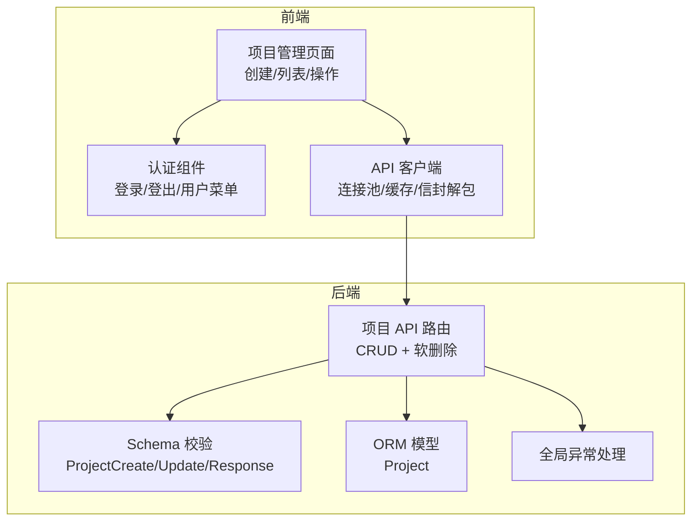
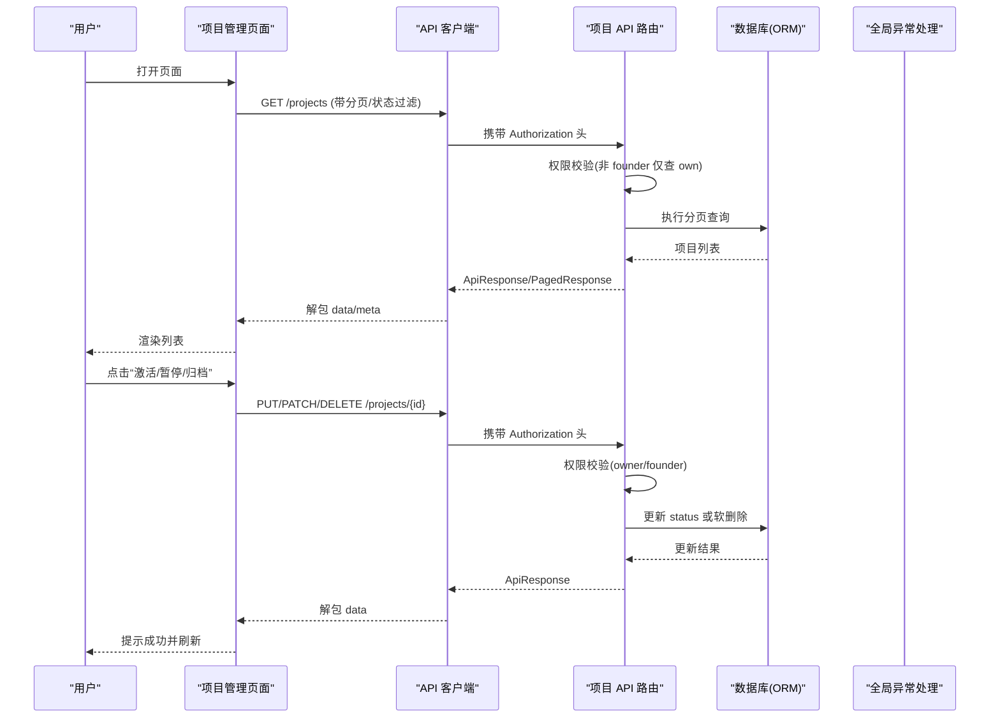
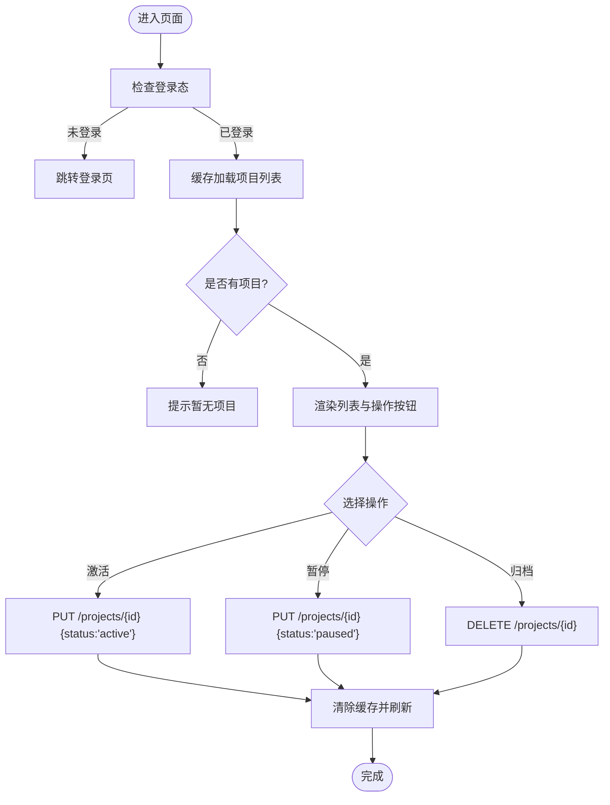
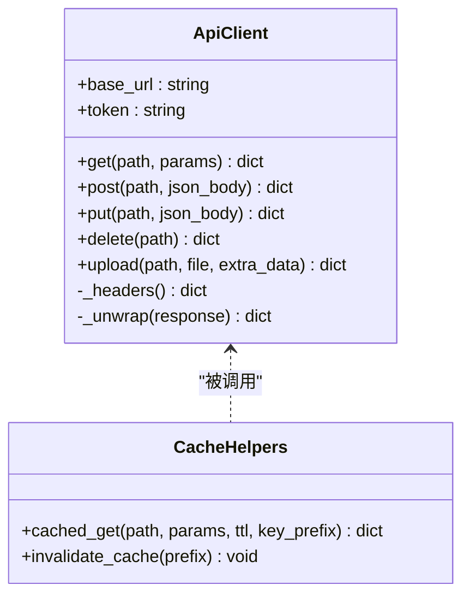
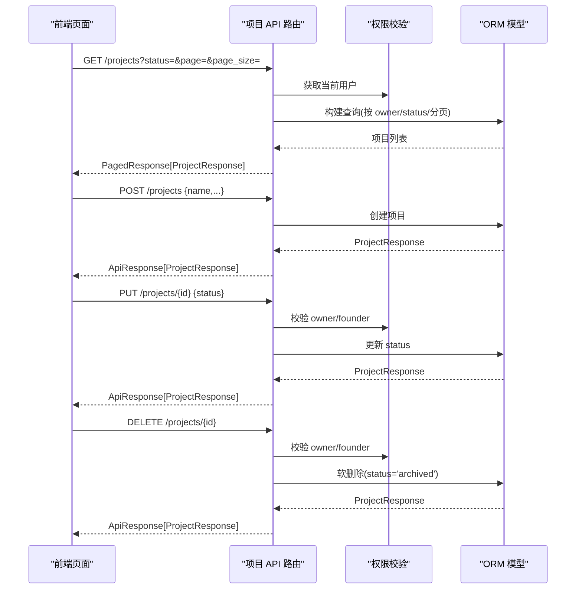
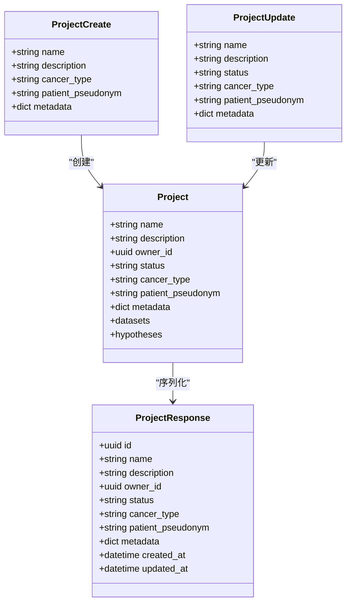
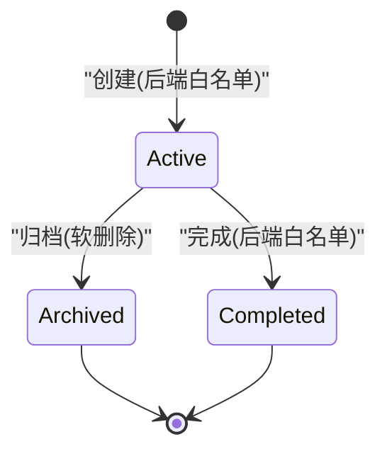
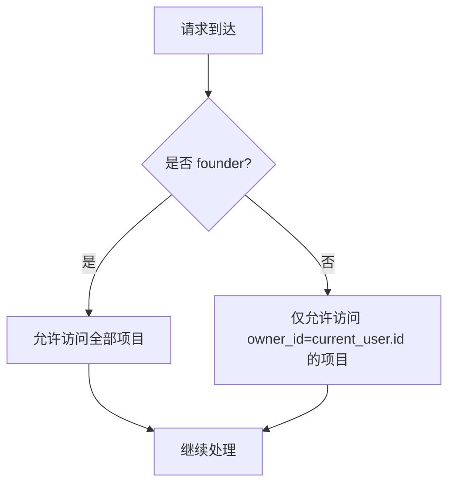
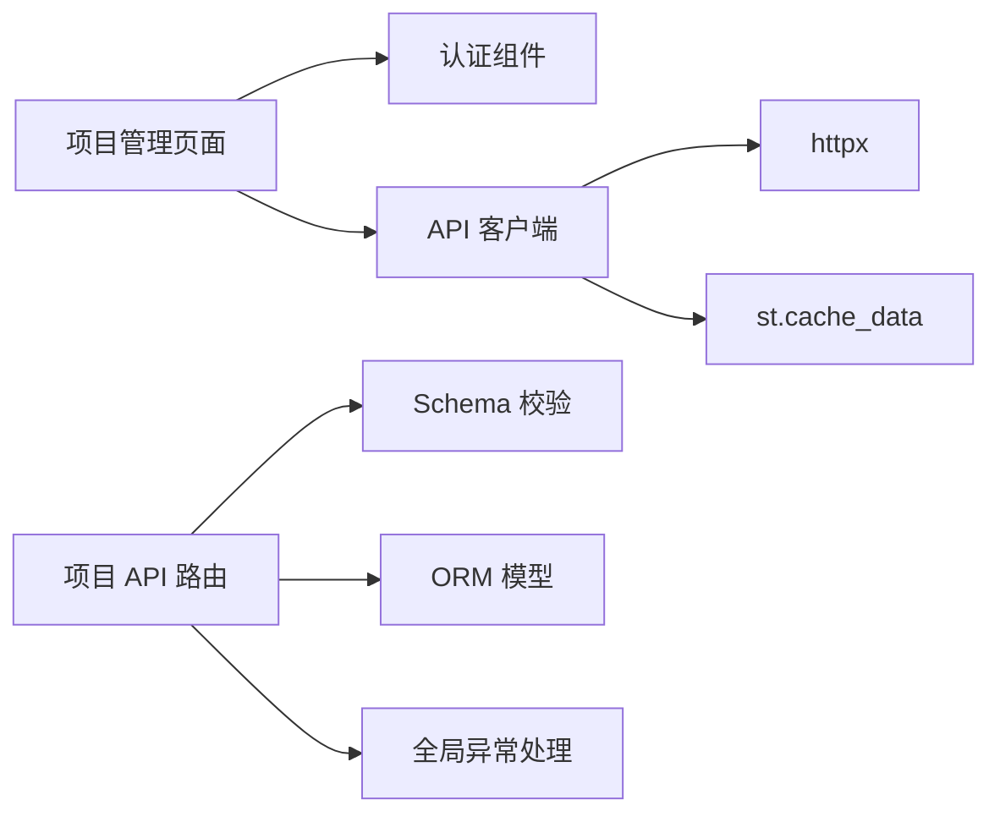

# 项目管理页面

<cite>
**本文引用的文件**   
- [前端：项目管理页面](file://precision-drug-design/frontend/pages/1_📁_项目管理.py)
- [后端：项目 API 路由](file://precision-drug-design/backend/app/api/v1/projects.py)
- [后端：项目数据模型](file://precision-drug-design/backend/app/models/project.py)
- [后端：项目 Schema 定义](file://precision-drug-design/backend/app/schemas/project.py)
- [后端：通用响应与枚举](file://precision-drug-design/backend/app/schemas/common.py)
- [后端：全局异常处理](file://precision-drug-design/backend/app/core/exceptions.py)
- [前端：API 客户端与缓存](file://precision-drug-design/frontend/api_client.py)
- [前端：认证组件](file://precision-drug-design/frontend/auth.py)
</cite>

## 目录
1. [简介](#简介)
2. [项目结构](#项目结构)
3. [核心组件](#核心组件)
4. [架构总览](#架构总览)
5. [详细组件分析](#详细组件分析)
6. [依赖关系分析](#依赖关系分析)
7. [性能考虑](#性能考虑)
8. [故障排查指南](#故障排查指南)
9. [结论](#结论)
10. [附录](#附录)

## 简介
本文件为“项目管理页面”的详细开发文档，覆盖以下目标：
- 项目 CRUD 操作实现方式（创建表单、列表展示、状态管理、权限控制）
- 项目生命周期管理（规划、活跃、暂停、归档）、优先级设置、疾病分类等能力说明
- 表单验证、异步操作处理、错误提示、用户体验优化
- 项目数据模型映射、API 调用封装、缓存策略实现

注意：当前代码库中，后端允许的项目状态集合包含 active/archived/completed；前端页面提供 planning/active/paused 的创建选项。二者存在差异，详见后文“状态与生命周期”章节。

## 项目结构
围绕“项目管理页面”，前后端关键文件如下：
- 前端页面：负责渲染创建表单、展示项目列表、触发状态变更与归档操作
- 前端 API 客户端：统一封装 HTTP 请求、JWT 注入、响应信封解包、连接池复用、请求级缓存
- 后端 API 路由：提供项目的分页查询、创建、详情、更新、软删除接口
- 后端数据模型与 Schema：定义数据库字段、校验规则、序列化格式
- 全局异常处理：统一错误码与响应信封
- 认证组件：登录/注册、用户菜单、会话态管理

图表来源
- [前端：项目管理页面:1-137](file://precision-drug-design/frontend/pages/1_📁_项目管理.py#L1-L137)
- [前端：API 客户端与缓存:1-251](file://precision-drug-design/frontend/api_client.py#L1-L251)
- [后端：项目 API 路由:1-169](file://precision-drug-design/backend/app/api/v1/projects.py#L1-L169)
- [后端：项目 Schema 定义:1-55](file://precision-drug-design/backend/app/schemas/project.py#L1-L55)
- [后端：项目数据模型:1-42](file://precision-drug-design/backend/app/models/project.py#L1-L42)
- [后端：全局异常处理:1-179](file://precision-drug-design/backend/app/core/exceptions.py#L1-L179)

章节来源
- [前端：项目管理页面:1-137](file://precision-drug-design/frontend/pages/1_📁_项目管理.py#L1-L137)
- [前端：API 客户端与缓存:1-251](file://precision-drug-design/frontend/api_client.py#L1-L251)
- [后端：项目 API 路由:1-169](file://precision-drug-design/backend/app/api/v1/projects.py#L1-L169)
- [后端：项目 Schema 定义:1-55](file://precision-drug-design/backend/app/schemas/project.py#L1-L55)
- [后端：项目数据模型:1-42](file://precision-drug-design/backend/app/models/project.py#L1-L42)
- [后端：全局异常处理:1-179](file://precision-drug-design/backend/app/core/exceptions.py#L1-L179)

## 核心组件
- 前端项目管理页面
  - 渲染创建表单：项目名称、描述、目标疾病、状态、优先级
  - 渲染项目列表：分页加载、展开详情、状态切换、归档
  - 交互反馈：成功/错误提示、刷新页面
- 前端 API 客户端
  - 统一 Base URL、超时与连接池配置
  - JWT 自动注入、响应信封解包
  - 请求级缓存（TTL 时间桶机制）与缓存失效
- 后端项目 API
  - 列表：支持按状态过滤、分页、仅返回当前用户可访问项（创始人除外）
  - 创建：基于 ProjectCreate 校验并持久化
  - 详情/更新：基于 ProjectUpdate 校验，支持部分更新
  - 归档：软删除，将 status 置为 archived
- 数据模型与 Schema
  - ORM 模型：projects 表字段、外键、JSONB 元数据
  - Pydantic Schema：字段长度、必填、状态白名单校验、驼峰兼容
- 全局异常处理
  - 业务异常到统一信封的错误响应
  - 参数校验失败、未捕获异常的兜底处理

章节来源
- [前端：项目管理页面:27-130](file://precision-drug-design/frontend/pages/1_📁_项目管理.py#L27-L130)
- [前端：API 客户端与缓存:42-163](file://precision-drug-design/frontend/api_client.py#L42-L163)
- [后端：项目 API 路由:47-168](file://precision-drug-design/backend/app/api/v1/projects.py#L47-L168)
- [后端：项目 Schema 定义:13-55](file://precision-drug-design/backend/app/schemas/project.py#L13-L55)
- [后端：项目数据模型:14-42](file://precision-drug-design/backend/app/models/project.py#L14-L42)
- [后端：全局异常处理:131-179](file://precision-drug-design/backend/app/core/exceptions.py#L131-L179)

## 架构总览
下图展示了从前端页面到后端 API 的完整调用链路，包括认证、缓存、权限校验与软删除流程。

图表来源
- [前端：项目管理页面:64-130](file://precision-drug-design/frontend/pages/1_📁_项目管理.py#L64-L130)
- [前端：API 客户端与缓存:96-134](file://precision-drug-design/frontend/api_client.py#L96-L134)
- [后端：项目 API 路由:47-168](file://precision-drug-design/backend/app/api/v1/projects.py#L47-L168)
- [后端：项目数据模型:14-42](file://precision-drug-design/backend/app/models/project.py#L14-L42)
- [后端：全局异常处理:131-179](file://precision-drug-design/backend/app/core/exceptions.py#L131-L179)

## 详细组件分析

### 前端：项目管理页面
- 创建表单
  - 字段：名称、描述、目标疾病、状态、优先级
  - 提交时进行前端基础校验（如名称必填），成功后调用 POST /projects
  - 成功后显示 ID，并清除缓存、刷新页面
- 列表展示
  - 使用缓存 GET /projects?page=1&page_size=50，TTL 默认 30 秒
  - 空列表提示引导创建
  - 每个项目以折叠面板展示：描述、疾病、状态、优先级、创建时间
- 状态管理与操作
  - 激活：PUT /projects/{id} {status:"active"}
  - 暂停：PUT /projects/{id} {status:"paused"}
  - 归档：DELETE /projects/{id}（后端软删除，status="archived"）
  - 每次操作后清除缓存并刷新页面
- 权限控制
  - 页面入口 require_auth()，未登录则跳转首页登录
  - 列表仅返回当前用户可访问的项目（后端实现）

图表来源
- [前端：项目管理页面:27-130](file://precision-drug-design/frontend/pages/1_📁_项目管理.py#L27-L130)
- [前端：API 客户端与缓存:186-251](file://precision-drug-design/frontend/api_client.py#L186-L251)

章节来源
- [前端：项目管理页面:27-130](file://precision-drug-design/frontend/pages/1_📁_项目管理.py#L27-L130)
- [前端：认证组件:116-137](file://precision-drug-design/frontend/auth.py#L116-L137)

### 前端：API 客户端与缓存
- 连接池与超时
  - 共享 httpx.Client，最大连接数、KeepAlive 与超时配置
- 请求封装
  - get/post/put/delete/upload 方法统一封装
  - 自动注入 Authorization Bearer token
  - 统一解包响应信封，提取 data 或抛出运行时错误
- 缓存策略
  - cached_get(path, params, ttl, key_prefix) 使用 st.cache_data
  - TTL 通过时间桶机制实现：每 ttl 秒一个桶，桶变化即失效
  - invalidate_cache(prefix=None) 清空缓存（当前实现全部清空）

图表来源
- [前端：API 客户端与缓存:42-163](file://precision-drug-design/frontend/api_client.py#L42-L163)
- [前端：API 客户端与缓存:186-251](file://precision-drug-design/frontend/api_client.py#L186-L251)

章节来源
- [前端：API 客户端与缓存:1-251](file://precision-drug-design/frontend/api_client.py#L1-L251)

### 后端：项目 API 路由
- 列表接口
  - 支持 status 过滤、分页
  - 非 founder 仅返回 owner_id=current_user.id 的项目
- 创建接口
  - 使用 ProjectCreate 校验，写入数据库并返回 ProjectResponse
- 详情/更新接口
  - 权限校验：founder 可访问全部，否则需 owner_id 匹配
  - 更新使用 exclude_unset=True 做部分更新
- 归档接口
  - 软删除：将 status 设置为 archived

图表来源
- [后端：项目 API 路由:47-168](file://precision-drug-design/backend/app/api/v1/projects.py#L47-L168)
- [后端：项目数据模型:14-42](file://precision-drug-design/backend/app/models/project.py#L14-L42)

章节来源
- [后端：项目 API 路由:1-169](file://precision-drug-design/backend/app/api/v1/projects.py#L1-L169)

### 后端：数据模型与 Schema
- ORM 模型
  - projects 表字段：name、description、owner_id、status、cancer_type、patient_pseudonym、metadata(JSONB)
  - 关系：datasets、hypotheses（级联删除）
- Schema 校验
  - ProjectCreate：name 必填且长度限制，description/cancer_type/patient_pseudonym 可选，metadata 默认空字典
  - ProjectUpdate：所有字段可选，status 白名单校验
  - ProjectResponse：包含 id、时间戳、驼峰兼容映射 metadata_ → metadata

图表来源
- [后端：项目数据模型:14-42](file://precision-drug-design/backend/app/models/project.py#L14-L42)
- [后端：项目 Schema 定义:13-55](file://precision-drug-design/backend/app/schemas/project.py#L13-L55)

章节来源
- [后端：项目数据模型:1-42](file://precision-drug-design/backend/app/models/project.py#L1-L42)
- [后端：项目 Schema 定义:1-55](file://precision-drug-design/backend/app/schemas/project.py#L1-L55)

### 状态与生命周期
- 后端允许的状态集合：active、archived、completed
- 前端创建表单提供：planning、active、paused
- 前端操作提供：active、paused、归档（后端软删除为 archived）
- 差异说明
  - 若前端传入 status=planning 或 paused，后端在创建时会因不在白名单而触发校验错误
  - 建议对齐前后端状态集，或在后端扩展白名单以支持 planning/paused

图表来源
- [后端：项目 Schema 定义:33-38](file://precision-drug-design/backend/app/schemas/project.py#L33-L38)
- [后端：通用响应与枚举:150-151](file://precision-drug-design/backend/app/schemas/common.py#L150-L151)
- [后端：项目 API 路由:153-168](file://precision-drug-design/backend/app/api/v1/projects.py#L153-L168)

章节来源
- [后端：项目 Schema 定义:13-55](file://precision-drug-design/backend/app/schemas/project.py#L13-L55)
- [后端：通用响应与枚举:150-151](file://precision-drug-design/backend/app/schemas/common.py#L150-L151)
- [后端：项目 API 路由:153-168](file://precision-drug-design/backend/app/api/v1/projects.py#L153-L168)

### 权限控制
- 列表接口：非 founder 仅返回 own 项目；founder 可访问全部
- 单项目操作：founder 可访问全部，其他角色需 owner_id 匹配
- 前端：require_auth() 确保登录态

图表来源
- [后端：项目 API 路由:55-64](file://precision-drug-design/backend/app/api/v1/projects.py#L55-L64)
- [后端：项目 API 路由:32-44](file://precision-drug-design/backend/app/api/v1/projects.py#L32-L44)

章节来源
- [后端：项目 API 路由:32-64](file://precision-drug-design/backend/app/api/v1/projects.py#L32-L64)

### 表单验证与错误提示
- 前端
  - 创建表单：名称必填校验；网络异常捕获并显示错误
  - 操作按钮：激活/暂停/归档均捕获异常并提示
- 后端
  - Pydantic 校验：字段长度、必填、状态白名单
  - 全局异常处理器：统一错误信封，包含 code/message/details/request_id

章节来源
- [前端：项目管理页面:41-61](file://precision-drug-design/frontend/pages/1_📁_项目管理.py#L41-L61)
- [后端：项目 Schema 定义:13-38](file://precision-drug-design/backend/app/schemas/project.py#L13-L38)
- [后端：全局异常处理:131-179](file://precision-drug-design/backend/app/core/exceptions.py#L131-L179)

### 异步操作处理
- 当前页面操作均为同步 HTTP 调用，无长任务或流式上传
- 如需引入异步任务（例如批量导入数据集），可在后端增加任务队列并在前端轮询任务状态

[本节为概念性说明，不直接分析具体文件]

### 用户体验优化
- 列表加载使用缓存（TTL 30s），减少重复请求
- 操作成功后立即刷新页面，保证视图一致性
- 错误信息友好提示，便于定位问题

章节来源
- [前端：项目管理页面:64-130](file://precision-drug-design/frontend/pages/1_📁_项目管理.py#L64-L130)
- [前端：API 客户端与缓存:186-251](file://precision-drug-design/frontend/api_client.py#L186-L251)

## 依赖关系分析
- 前端页面依赖认证组件与 API 客户端
- API 客户端依赖 httpx 与 Streamlit 缓存
- 后端路由依赖 ORM 模型、Schema 校验、全局异常处理
- 权限逻辑集中在路由层，结合用户角色与资源归属

图表来源
- [前端：项目管理页面:1-24](file://precision-drug-design/frontend/pages/1_📁_项目管理.py#L1-L24)
- [前端：API 客户端与缓存:1-40](file://precision-drug-design/frontend/api_client.py#L1-L40)
- [后端：项目 API 路由:1-28](file://precision-drug-design/backend/app/api/v1/projects.py#L1-L28)
- [后端：项目 Schema 定义:1-12](file://precision-drug-design/backend/app/schemas/project.py#L1-L12)
- [后端：项目数据模型:1-12](file://precision-drug-design/backend/app/models/project.py#L1-L12)
- [后端：全局异常处理:1-20](file://precision-drug-design/backend/app/core/exceptions.py#L1-L20)

章节来源
- [前端：项目管理页面:1-24](file://precision-drug-design/frontend/pages/1_📁_项目管理.py#L1-L24)
- [前端：API 客户端与缓存:1-40](file://precision-drug-design/frontend/api_client.py#L1-L40)
- [后端：项目 API 路由:1-28](file://precision-drug-design/backend/app/api/v1/projects.py#L1-L28)
- [后端：项目 Schema 定义:1-12](file://precision-drug-design/backend/app/schemas/project.py#L1-L12)
- [后端：项目数据模型:1-12](file://precision-drug-design/backend/app/models/project.py#L1-L12)
- [后端：全局异常处理:1-20](file://precision-drug-design/backend/app/core/exceptions.py#L1-L20)

## 性能考虑
- 连接池复用：httpx.Client 全局缓存，避免频繁建立连接
- 请求级缓存：st.cache_data 配合 TTL 时间桶，降低重复请求
- 分页查询：后端使用 offset/limit 分页，减少单次返回数据量
- 建议
  - 对高频读接口进一步细化缓存键（如按用户 token 隔离）
  - 对大对象或复杂计算引入服务端缓存或异步任务

[本节为通用指导，不直接分析具体文件]

## 故障排查指南
- 常见错误
  - 未登录：前端 require_auth() 拦截并提示登录
  - 权限不足：后端抛出 FORBIDDEN，前端显示错误消息
  - 参数校验失败：后端 VALIDATION_ERROR，包含 errors 详情
  - 网络异常：客户端 _unwrap 抛出 RuntimeError，前端捕获并提示
- 定位步骤
  - 查看浏览器控制台与 Streamlit 日志
  - 核对后端 request_id 与错误信封中的 message/details
  - 确认前后端状态集合是否一致（planning/paused 与后端白名单）

章节来源
- [前端：认证组件:116-137](file://precision-drug-design/frontend/auth.py#L116-L137)
- [前端：API 客户端与缓存:68-94](file://precision-drug-design/frontend/api_client.py#L68-L94)
- [后端：全局异常处理:131-179](file://precision-drug-design/backend/app/core/exceptions.py#L131-L179)

## 结论
本项目实现了项目管理的核心功能：创建、列表、状态切换与归档，具备完善的权限控制与统一的错误处理。前后端在状态集合上存在差异，建议尽快对齐以避免校验错误。同时，可通过更细粒度的缓存策略与异步任务进一步提升体验与性能。

[本节为总结性内容，不直接分析具体文件]

## 附录

### 数据模型映射要点
- ORM 字段与 Schema 字段一一对应，metadata_ 通过 validation_alias 映射到 metadata
- 时间戳与 ID 通过混入类统一提供
- 状态白名单集中管理于 common.py，便于维护

章节来源
- [后端：项目数据模型:14-42](file://precision-drug-design/backend/app/models/project.py#L14-L42)
- [后端：项目 Schema 定义:41-55](file://precision-drug-design/backend/app/schemas/project.py#L41-L55)
- [后端：通用响应与枚举:119-151](file://precision-drug-design/backend/app/schemas/common.py#L119-L151)

### API 调用封装要点
- 统一信封解包，简化前端数据处理
- 自动注入 Authorization 头，避免遗漏
- 上传接口独立 client，避免影响主连接池

章节来源
- [前端：API 客户端与缓存:42-163](file://precision-drug-design/frontend/api_client.py#L42-L163)

### 缓存策略实现要点
- TTL 时间桶：每 ttl 秒一个桶，桶变化即失效
- 前缀隔离：不同模块使用不同 key_prefix
- 失效策略：当前实现全部清空，可按需改进为按前缀清理

章节来源
- [前端：API 客户端与缓存:186-251](file://precision-drug-design/frontend/api_client.py#L186-L251)