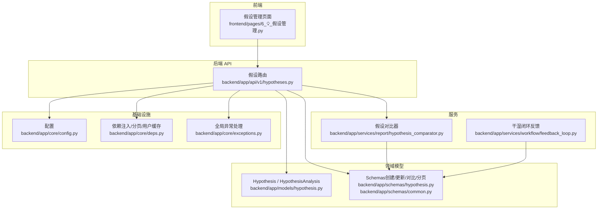
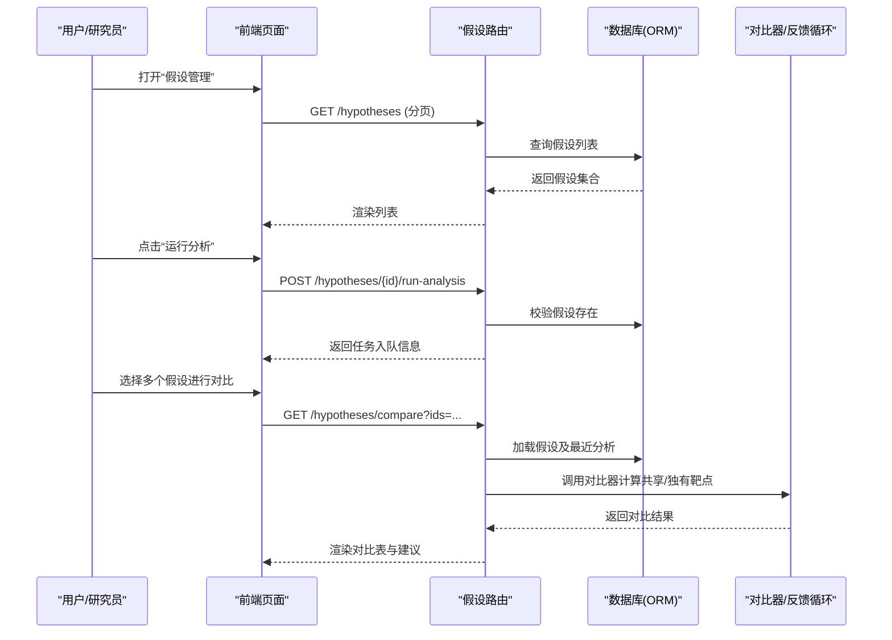
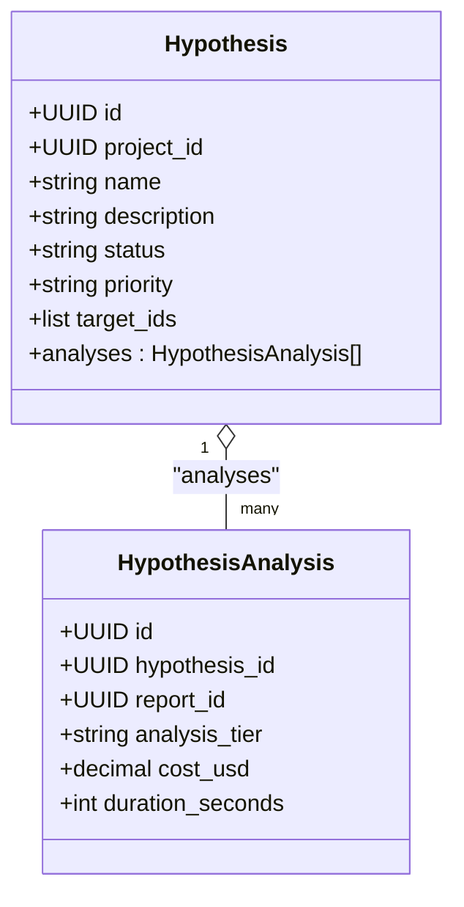
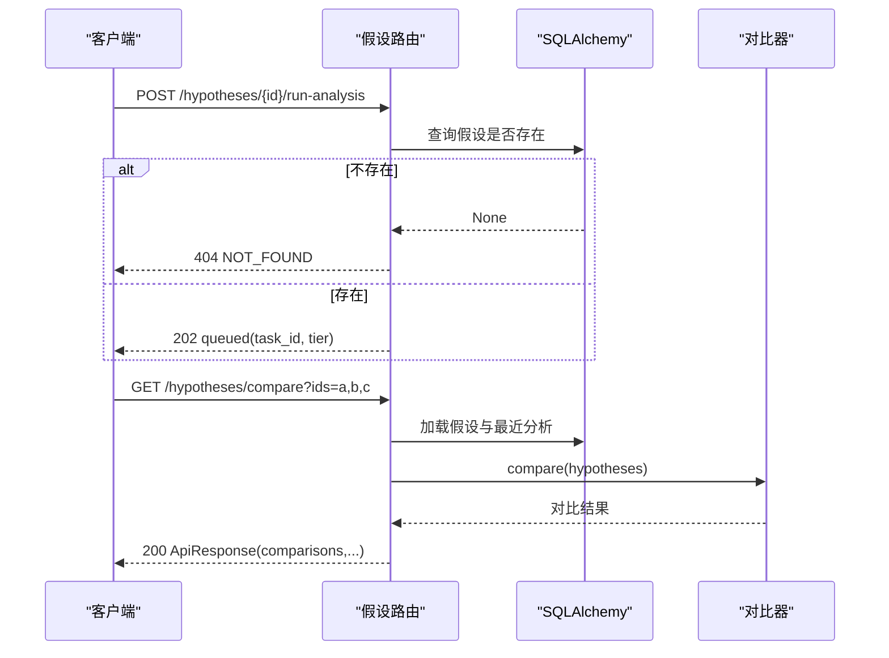
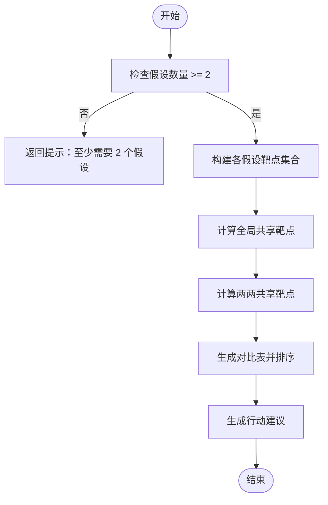
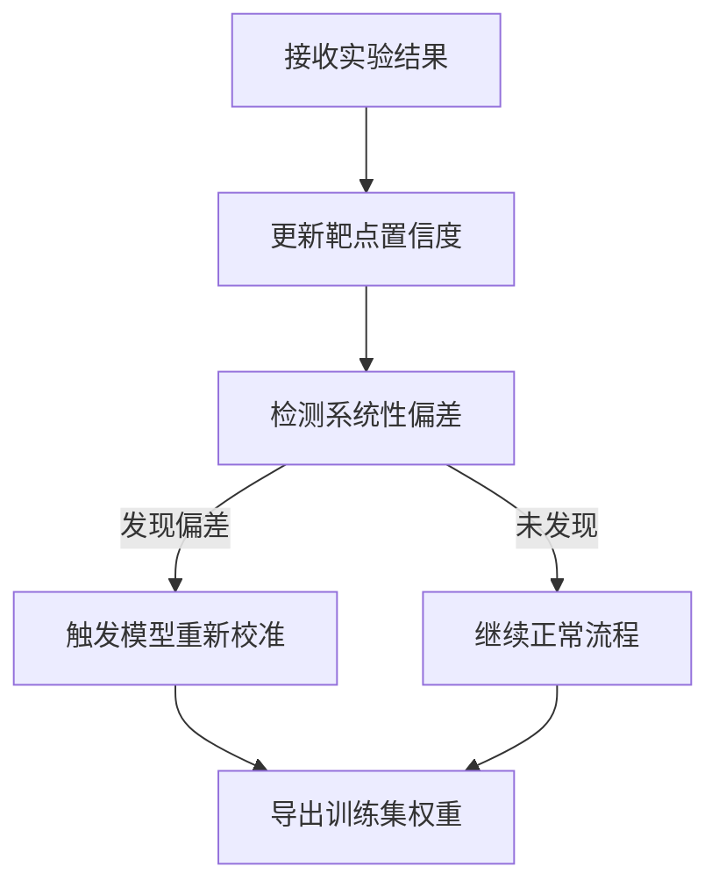
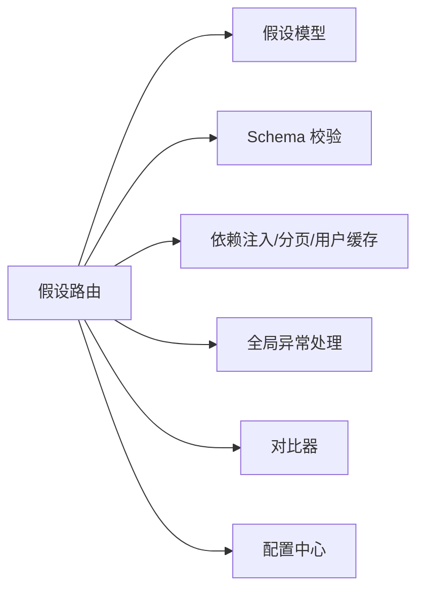

# 假设管理与沙盒

<cite>
**本文引用的文件**   
- [hypotheses.py](file://backend/app/api/v1/hypotheses.py)
- [hypothesis.py](file://backend/app/models/hypothesis.py)
- [hypothesis.py](file://backend/app/schemas/hypothesis.py)
- [common.py](file://backend/app/schemas/common.py)
- [config.py](file://backend/app/core/config.py)
- [deps.py](file://backend/app/core/deps.py)
- [exceptions.py](file://backend/app/core/exceptions.py)
- [hypothesis_comparator.py](file://backend/app/services/report/hypothesis_comparator.py)
- [feedback_loop.py](file://backend/app/services/workflow/feedback_loop.py)
- [6_💡_假设管理.py](file://frontend/pages/6_💡_假设管理.py)
</cite>

## 目录
1. [简介](#简介)
2. [项目结构](#项目结构)
3. [核心组件](#核心组件)
4. [架构总览](#架构总览)
5. [详细组件分析](#详细组件分析)
6. [依赖关系分析](#依赖关系分析)
7. [性能与可扩展性](#性能与可扩展性)
8. [故障排查指南](#故障排查指南)
9. [结论](#结论)
10. [附录：API 参考与使用指南](#附录api-参考与使用指南)

## 简介
本文件面向研究人员和数据科学家，系统化阐述 AI 药物设计系统中的“假设管理与沙盒”能力。内容覆盖：
- 假设沙盒机制的设计原理与环境隔离思路
- 假设的创建、验证、版本与状态跟踪
- 多假设并行推进与对比分析
- 协作编辑与冲突解决策略
- 假设模板、批量验证与自动化测试集成
- 后端 API 接口文档与前端工作流
- 沙盒配置方法与最佳实践

## 项目结构
围绕假设管理的代码主要分布在以下模块：
- 后端 API 层：提供假设 CRUD、运行分析、合并、淘汰、对比等接口
- 数据模型层：定义假设实体与分析记录
- Schema 层：统一请求/响应结构与枚举校验
- 服务层：假设对比器、干湿闭环反馈循环
- 前端页面：Streamlit 界面用于假设列表、操作与对比展示
- 通用支撑：配置、依赖注入、异常处理

图表来源
- [hypotheses.py:1-273](file://backend/app/api/v1/hypotheses.py#L1-L273)
- [hypothesis.py:1-66](file://backend/app/models/hypothesis.py#L1-L66)
- [hypothesis.py:1-119](file://backend/app/schemas/hypothesis.py#L1-L119)
- [common.py:1-158](file://backend/app/schemas/common.py#L1-L158)
- [hypothesis_comparator.py:1-181](file://backend/app/services/report/hypothesis_comparator.py#L1-L181)
- [feedback_loop.py:1-281](file://backend/app/services/workflow/feedback_loop.py#L1-L281)
- [config.py:1-144](file://backend/app/core/config.py#L1-L144)
- [deps.py:1-129](file://backend/app/core/deps.py#L1-L129)
- [exceptions.py:1-179](file://backend/app/core/exceptions.py#L1-L179)

章节来源
- [hypotheses.py:1-273](file://backend/app/api/v1/hypotheses.py#L1-L273)
- [hypothesis.py:1-66](file://backend/app/models/hypothesis.py#L1-L66)
- [hypothesis.py:1-119](file://backend/app/schemas/hypothesis.py#L1-L119)
- [common.py:1-158](file://backend/app/schemas/common.py#L1-L158)
- [hypothesis_comparator.py:1-181](file://backend/app/services/report/hypothesis_comparator.py#L1-L181)
- [feedback_loop.py:1-281](file://backend/app/services/workflow/feedback_loop.py#L1-L281)
- [config.py:1-144](file://backend/app/core/config.py#L1-L144)
- [deps.py:1-129](file://backend/app/core/deps.py#L1-L129)
- [exceptions.py:1-179](file://backend/app/core/exceptions.py#L1-L179)

## 核心组件
- 假设实体与生命周期
  - 假设支持多种状态：active、merged、archived、eliminated；优先级 low、normal、high、forced
  - 每次分析生成一条分析记录，包含层级、成本、耗时等指标
- 假设对比器
  - 计算共享/独有靶点、证据强度排序、两两重叠度与建议合并
- 干湿闭环反馈
  - 接收湿实验结果，动态调整靶点置信度与训练权重，检测系统性偏差并触发重新校准
- 前端工作流
  - 提供假设创建、运行分析、标记验证/淘汰、删除与对比分析可视化

章节来源
- [hypothesis.py:1-66](file://backend/app/models/hypothesis.py#L1-L66)
- [hypothesis_comparator.py:1-181](file://backend/app/services/report/hypothesis_comparator.py#L1-L181)
- [feedback_loop.py:1-281](file://backend/app/services/workflow/feedback_loop.py#L1-L281)
- [6_💡_假设管理.py:1-197](file://frontend/pages/6_💡_假设管理.py#L1-L197)

## 架构总览
假设沙盒以“假设为中心”的多分支并行研究范式组织数据与工作流。每个假设代表一个可独立验证的研究方向，通过 API 驱动创建、分析与对比，结合前后端实现高效协作。

图表来源
- [hypotheses.py:103-164](file://backend/app/api/v1/hypotheses.py#L103-L164)
- [hypotheses.py:185-211](file://backend/app/api/v1/hypotheses.py#L185-L211)
- [hypothesis_comparator.py:26-89](file://backend/app/services/report/hypothesis_comparator.py#L26-L89)

## 详细组件分析

### 假设数据模型与状态机
- 字段与关系
  - 假设：项目关联、名称、描述、状态、优先级、强制深度分析标记、目标靶点集合
  - 分析记录：关联假设、报告 ID、分析层级、成本、耗时
- 状态流转
  - active → merged（合并后源假设置为 merged）
  - active → eliminated（淘汰保留历史）
  - archived（归档，通常由外部流程或管理员设置）
- 复杂度
  - 列表查询按 created_at 倒序 + 分页，时间复杂度 O(n log n) 排序，空间 O(n)
  - 对比查询使用 selectinload 预加载分析，避免 N+1

图表来源
- [hypothesis.py:15-47](file://backend/app/models/hypothesis.py#L15-L47)
- [hypothesis.py:49-66](file://backend/app/models/hypothesis.py#L49-L66)

章节来源
- [hypothesis.py:1-66](file://backend/app/models/hypothesis.py#L1-L66)

### 假设 API 设计与交互
- 关键接口
  - 创建假设：POST /hypotheses
  - 列出假设：GET /hypotheses（支持按项目、状态过滤与分页）
  - 获取详情：GET /hypotheses/{id}
  - 运行分析：POST /hypotheses/{id}/run-analysis（异步入队）
  - 对比假设：GET /hypotheses/compare?ids=...
  - 合并假设：POST /hypotheses/{id}/merge
  - 淘汰假设：POST /hypotheses/{id}/eliminate
- 错误处理
  - 参数校验失败返回 VALIDATION_ERROR
  - 资源不存在返回 NOT_FOUND
  - 业务冲突返回 CONFLICT（如合并到自身）
  - 未授权/禁用返回 UNAUTHORIZED/FORBIDDEN
- 认证与追踪
  - 通过依赖注入获取当前用户与数据库会话
  - 请求级 request_id 贯穿日志与响应元数据

图表来源
- [hypotheses.py:185-211](file://backend/app/api/v1/hypotheses.py#L185-L211)
- [hypotheses.py:103-164](file://backend/app/api/v1/hypotheses.py#L103-L164)
- [exceptions.py:131-179](file://backend/app/core/exceptions.py#L131-L179)

章节来源
- [hypotheses.py:39-100](file://backend/app/api/v1/hypotheses.py#L39-L100)
- [hypotheses.py:103-164](file://backend/app/api/v1/hypotheses.py#L103-L164)
- [hypotheses.py:167-182](file://backend/app/api/v1/hypotheses.py#L167-L182)
- [hypotheses.py:185-211](file://backend/app/api/v1/hypotheses.py#L185-L211)
- [hypotheses.py:214-247](file://backend/app/api/v1/hypotheses.py#L214-L247)
- [hypotheses.py:250-273](file://backend/app/api/v1/hypotheses.py#L250-L273)
- [deps.py:83-129](file://backend/app/core/deps.py#L83-L129)
- [exceptions.py:131-179](file://backend/app/core/exceptions.py#L131-L179)

### 假设对比器与推荐策略
- 功能要点
  - 计算全局共享靶点与两两共享靶点
  - 生成对比表并按证据分数降序
  - 基于分差与重叠率给出合并/淘汰/并行建议
- 算法复杂度
  - 两两共享靶点 O(k^2 * t)，k 为假设数，t 为平均靶点数
  - 建议合并阈值可调，默认 0.5

图表来源
- [hypothesis_comparator.py:26-89](file://backend/app/services/report/hypothesis_comparator.py#L26-L89)
- [hypothesis_comparator.py:91-146](file://backend/app/services/report/hypothesis_comparator.py#L91-L146)
- [hypothesis_comparator.py:148-181](file://backend/app/services/report/hypothesis_comparator.py#L148-L181)

章节来源
- [hypothesis_comparator.py:1-181](file://backend/app/services/report/hypothesis_comparator.py#L1-L181)

### 干湿闭环反馈与假设验证
- 作用
  - 将湿实验结果回流至系统，动态调整靶点置信度与训练权重
  - 检测系统性偏差（高失败率且样本量足够），触发模型重新校准
- 与假设的关系
  - 假设中的靶点集合可作为反馈输入，提升后续假设筛选与优先级决策质量

图表来源
- [feedback_loop.py:99-163](file://backend/app/services/workflow/feedback_loop.py#L99-L163)
- [feedback_loop.py:165-206](file://backend/app/services/workflow/feedback_loop.py#L165-L206)
- [feedback_loop.py:208-231](file://backend/app/services/workflow/feedback_loop.py#L208-L231)

章节来源
- [feedback_loop.py:1-281](file://backend/app/services/workflow/feedback_loop.py#L1-L281)

### 前端工作流与协作体验
- 功能
  - 创建假设（名称、项目、优先级、靶点、描述）
  - 列表查看与筛选（状态、优先级图标）
  - 运行分析、标记验证/淘汰、删除
  - 对比分析（多选假设，展示对比表、共享靶点与建议）
- 协作建议
  - 使用统一的命名规范与描述模板
  - 对高重叠假设及时合并，减少重复工作
  - 通过“淘汰”保留历史，便于审计与回溯

章节来源
- [6_💡_假设管理.py:1-197](file://frontend/pages/6_💡_假设管理.py#L1-L197)

## 依赖关系分析
- 组件耦合
  - API 层依赖模型与 Schema，使用依赖注入获取用户与会话
  - 对比器与服务逻辑解耦，便于单元测试与替换
  - 前端通过 REST 与后端交互，不直接访问数据库
- 外部依赖
  - 数据库（PostgreSQL）、对象存储（MinIO/S3）、向量库（Chroma）、LLM/NIM 等通过配置集中管理
- 潜在风险
  - 对比接口若传入大量假设，需关注计算开销与分页策略
  - 合并/淘汰操作应配合权限控制与审计日志

图表来源
- [hypotheses.py:1-273](file://backend/app/api/v1/hypotheses.py#L1-L273)
- [deps.py:1-129](file://backend/app/core/deps.py#L1-L129)
- [exceptions.py:1-179](file://backend/app/core/exceptions.py#L1-L179)
- [config.py:1-144](file://backend/app/core/config.py#L1-L144)

章节来源
- [hypotheses.py:1-273](file://backend/app/api/v1/hypotheses.py#L1-L273)
- [deps.py:1-129](file://backend/app/core/deps.py#L1-L129)
- [exceptions.py:1-179](file://backend/app/core/exceptions.py#L1-L179)
- [config.py:1-144](file://backend/app/core/config.py#L1-L144)

## 性能与可扩展性
- 查询优化
  - 列表查询使用分页与索引（project_id、status、created_at）
  - 对比查询使用 selectinload 预加载分析，降低 N+1 问题
- 计算扩展
  - 对比器可水平扩展为无状态服务，支持并发对比
  - 运行分析接口已返回 task_id，适合接入消息队列与异步执行器
- 资源治理
  - 通过优先级与证据分数指导资源分配
  - 合并高重叠假设，减少冗余计算

[本节为通用性能建议，无需特定文件引用]

## 故障排查指南
- 常见错误码
  - VALIDATION_ERROR：请求参数校验失败（如 IDs 格式错误、analysis_tier 不在允许值）
  - NOT_FOUND：假设不存在
  - CONFLICT：非法操作（如合并到自身）
  - UNAUTHORIZED/FORBIDDEN：未登录或被禁用
  - INTERNAL_ERROR：服务器内部错误
- 定位方法
  - 使用响应 meta.request_id 在日志中检索
  - 检查前端表单字段是否符合 Schema 约束
  - 确认数据库连接与权限配置

章节来源
- [exceptions.py:131-179](file://backend/app/core/exceptions.py#L131-L179)
- [hypotheses.py:103-164](file://backend/app/api/v1/hypotheses.py#L103-L164)
- [hypotheses.py:214-247](file://backend/app/api/v1/hypotheses.py#L214-L247)

## 结论
假设管理与沙盒为多假设并行验证提供了结构化、可追溯、可对比的工作流。通过清晰的模型与状态机、健壮的 API 与对比器、以及干湿闭环反馈，团队能够高效推进研究、快速收敛候选方案，并在协作中保持数据一致性与可审计性。

[本节为总结性内容，无需特定文件引用]

## 附录：API 参考与使用指南

### 假设管理 API 参考
- 创建假设
  - 方法：POST
  - 路径：/hypotheses
  - 请求体：包含项目名称、描述、目标靶点列表等
  - 成功响应：返回假设详情与请求追踪 ID
- 列出假设
  - 方法：GET
  - 路径：/hypotheses
  - 查询参数：page、page_size、project_id、status
  - 成功响应：分页数据与元信息
- 获取详情
  - 方法：GET
  - 路径：/hypotheses/{id}
- 运行分析
  - 方法：POST
  - 路径：/hypotheses/{id}/run-analysis
  - 请求体：analysis_tier（quick/deep）
  - 成功响应：202，返回 task_id 与状态 queued
- 对比假设
  - 方法：GET
  - 路径：/hypotheses/compare
  - 查询参数：ids（逗号分隔的假设 ID 列表）
  - 成功响应：comparisons、shared_targets、unique_targets
- 合并假设
  - 方法：POST
  - 路径：/hypotheses/{id}/merge
  - 请求体：into_hypothesis_id
  - 成功响应：目标假设最新状态
- 淘汰假设
  - 方法：POST
  - 路径：/hypotheses/{id}/eliminate
  - 成功响应：被标记为 eliminated 的假设

章节来源
- [hypotheses.py:39-100](file://backend/app/api/v1/hypotheses.py#L39-L100)
- [hypotheses.py:103-164](file://backend/app/api/v1/hypotheses.py#L103-L164)
- [hypotheses.py:167-182](file://backend/app/api/v1/hypotheses.py#L167-L182)
- [hypotheses.py:185-211](file://backend/app/api/v1/hypotheses.py#L185-L211)
- [hypotheses.py:214-247](file://backend/app/api/v1/hypotheses.py#L214-L247)
- [hypotheses.py:250-273](file://backend/app/api/v1/hypotheses.py#L250-L273)

### 沙盒配置方法
- 应用与环境
  - app_env：development/staging/production
  - app_debug：调试开关
  - app_host/app_port：服务监听地址与端口
- 数据与存储
  - database_url：数据库连接串
  - s3_endpoint/access_key/secret_key/bucket/region：对象存储
  - chroma_persist_dir：向量库持久化目录
- LLM 与外部知识库
  - openai_api_key/anthropic_api_key/llm_default_model/llm_deep_model
  - mygene_base_url/myvariant_base_url/chembl_base_url/pubmed_base_url/clinical_trials_url
- 联邦学习与隐私
  - flower_server_address/flower_num_rounds
  - pysyft_domain_port/pysyft_domain_name
- CORS 与认证
  - cors_origins：允许的跨域来源
  - jwt_secret_key/jwt_algorithm/jwt_access_token_expire_minutes/jwt_refresh_token_expire_days

章节来源
- [config.py:21-144](file://backend/app/core/config.py#L21-L144)

### 协作工作流程与最佳实践
- 假设模板
  - 名称：清晰表达研究主题与条件
  - 描述：背景、假设、预期产出与风险
  - 靶点：明确符号与来源，避免歧义
- 版本与状态
  - 使用 active 推进，validated 表示已通过初步验证
  - 合并高重叠假设，淘汰低价值假设，保留历史
- 批量验证
  - 通过对比接口一次性评估多个假设，依据共享靶点与证据分数决策
- 自动化测试集成
  - 针对对比器编写单测，覆盖边界条件（空靶点、低重叠、高分差）
  - 端到端测试覆盖创建→运行分析→对比→合并/淘汰主流程

章节来源
- [hypothesis_comparator.py:1-181](file://backend/app/services/report/hypothesis_comparator.py#L1-L181)
- [test_hypothesis_comparator.py:1-110](file://tests/test_hypothesis_comparator.py#L1-L110)