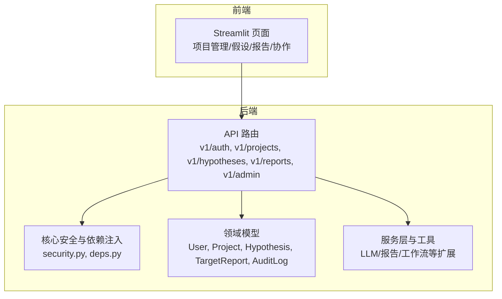
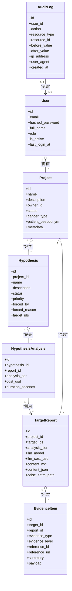
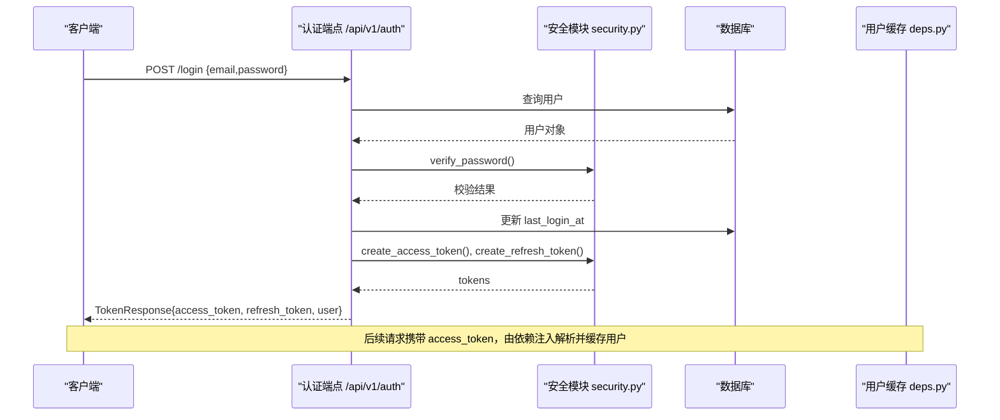
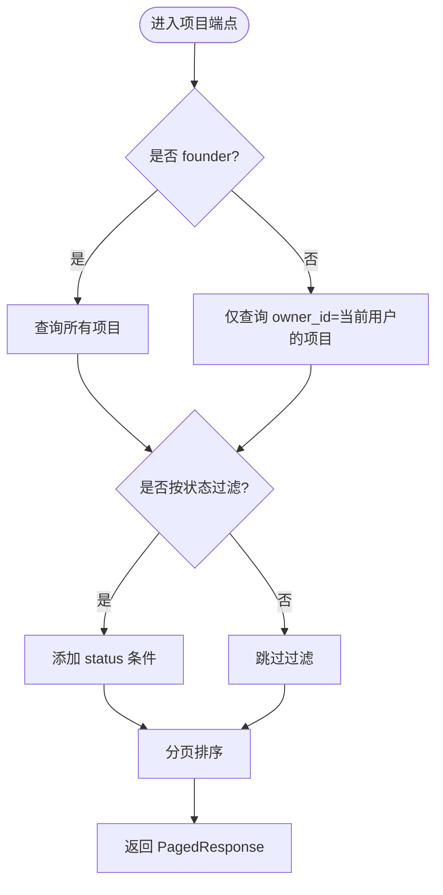
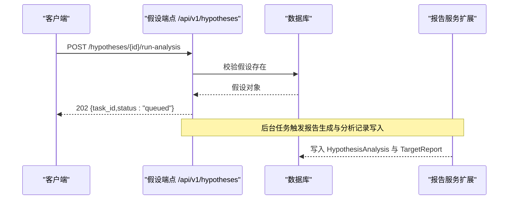
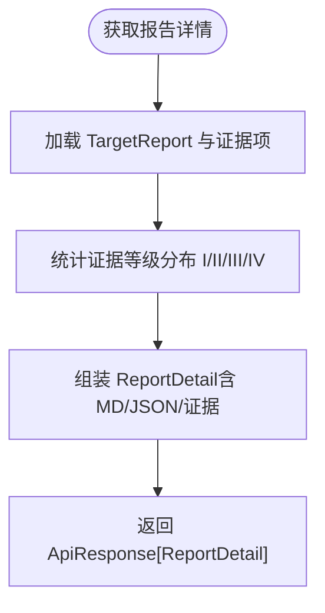
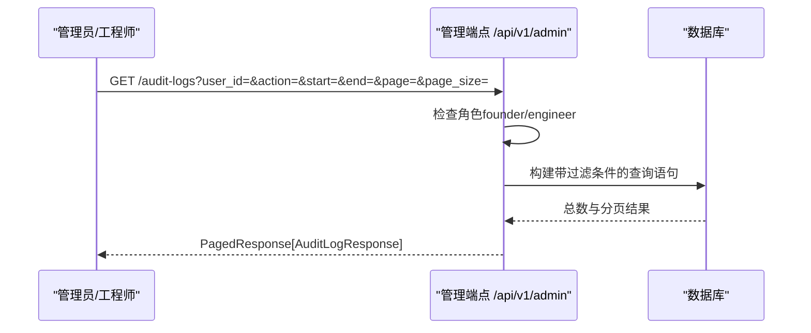
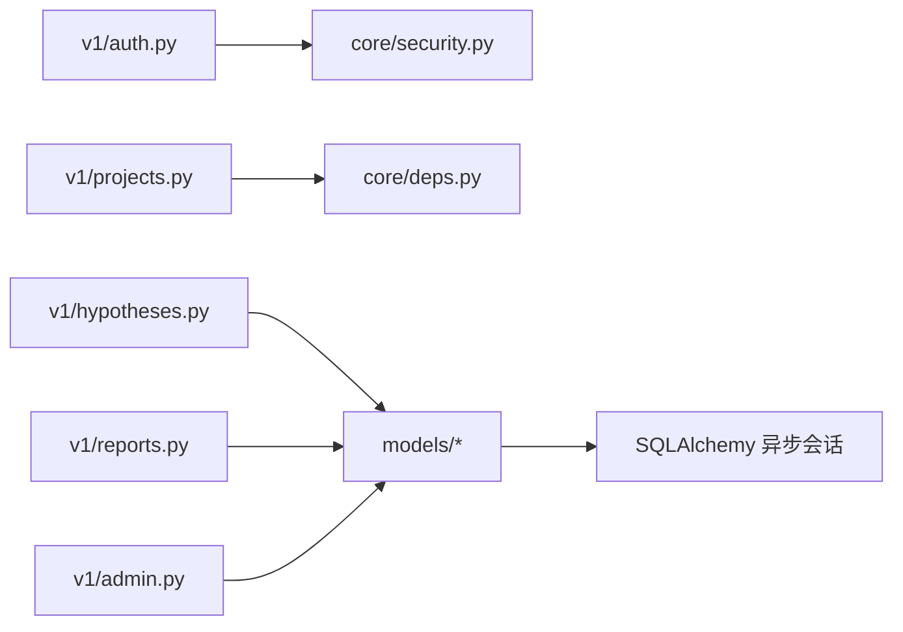

# 协作平台

<cite>
**本文引用的文件**   
- [README.md](file://precision-drug-design/README.md)
- [user.py](file://precision-drug-design/backend/app/models/user.py)
- [project.py](file://precision-drug-design/backend/app/models/project.py)
- [hypothesis.py](file://precision-drug-design/backend/app/models/hypothesis.py)
- [audit_log.py](file://precision-drug-design/backend/app/models/audit_log.py)
- [target.py](file://precision-drug-design/backend/app/models/target.py)
- [report.py](file://precision-drug-design/backend/app/models/report.py)
- [security.py](file://precision-drug-design/backend/app/core/security.py)
- [deps.py](file://precision-drug-design/backend/app/core/deps.py)
- [auth.py](file://precision-drug-design/backend/app/api/v1/auth.py)
- [admin.py](file://precision-drug-design/backend/app/api/v1/admin.py)
- [projects.py](file://precision-drug-design/backend/app/api/v1/projects.py)
- [hypotheses.py](file://precision-drug-design/backend/app/api/v1/hypotheses.py)
- [reports.py](file://precision-drug-design/backend/app/api/v1/reports.py)
- [auth.py](file://precision-drug-design/backend/app/schemas/auth.py)
- [audit.py](file://precision-drug-design/backend/app/schemas/audit.py)
</cite>

## 目录
1. [简介](#简介)
2. [项目结构](#项目结构)
3. [核心组件](#核心组件)
4. [架构总览](#架构总览)
5. [详细组件分析](#详细组件分析)
6. [依赖关系分析](#依赖关系分析)
7. [性能与可扩展性](#性能与可扩展性)
8. [故障排查指南](#故障排查指南)
9. [结论](#结论)
10. [附录：使用与管理指南](#附录使用与管理指南)

## 简介
本文件面向团队管理者与技术负责人，系统性阐述 AI 药物设计系统的“协作平台”能力，重点覆盖以下主题：
- RBAC 五角色权限体系（founder/pi/researcher/doctor/engineer）
- 假设沙盒机制（Hypothesis Sandbox）
- 审计日志系统（append-only、不可篡改）
- 团队协作功能（用户管理、项目协作、假设验证、报告生成）
- 权限控制策略与数据隔离机制
- 版本管理与工作流协作
- 权限配置示例、审计查询方法、协作最佳实践

该协作平台作为子系统 D，贯穿多组学数据整合、靶点发现、治疗方案设计与团队协作全流程，确保在合规与安全前提下高效协同。

## 项目结构
协作平台相关代码主要位于后端应用模块中，围绕认证授权、RBAC 守卫、资源访问控制、审计日志以及业务域模型（项目、假设、报告等）展开。前端通过 Streamlit 页面调用 API，实现可视化协作体验。

图表来源
- [auth.py:1-147](file://precision-drug-design/backend/app/api/v1/auth.py#L1-L147)
- [projects.py:1-169](file://precision-drug-design/backend/app/api/v1/projects.py#L1-L169)
- [hypotheses.py:1-273](file://precision-drug-design/backend/app/api/v1/hypotheses.py#L1-L273)
- [reports.py:1-181](file://precision-drug-design/backend/app/api/v1/reports.py#L1-L181)
- [admin.py:1-124](file://precision-drug-design/backend/app/api/v1/admin.py#L1-L124)
- [security.py:1-211](file://precision-drug-design/backend/app/core/security.py#L1-L211)
- [deps.py:1-129](file://precision-drug-design/backend/app/core/deps.py#L1-L129)
- [user.py:1-36](file://precision-drug-design/backend/app/models/user.py#L1-L36)
- [project.py:1-42](file://precision-drug-design/backend/app/models/project.py#L1-L42)
- [hypothesis.py:1-66](file://precision-drug-design/backend/app/models/hypothesis.py#L1-L66)
- [report.py:1-73](file://precision-drug-design/backend/app/models/report.py#L1-L73)
- [audit_log.py:1-45](file://precision-drug-design/backend/app/models/audit_log.py#L1-L45)

章节来源
- [README.md:1-421](file://precision-drug-design/README.md#L1-L421)

## 核心组件
- 用户与角色（RBAC）
  - 用户模型包含邮箱、密码哈希、姓名、角色、活跃状态与最后登录时间。
  - 角色取值：founder、pi、researcher、doctor、engineer。
- 项目与数据隔离
  - 项目拥有 owner_id，非 founder 仅能访问自己拥有的项目；founder 可访问全部。
- 假设沙盒
  - 假设属于项目，支持创建、运行分析、合并、淘汰、对比；记录分析层级、成本与耗时。
- 报告与证据
  - 报告关联项目与多个靶点，保存结构化 JSON 与 Markdown，并统计证据等级分布。
- 审计日志
  - append-only 表，记录操作类型、资源类型与 ID、前后值快照、IP 与 UA、时间戳。
- 认证与授权
  - JWT access/refresh token，角色守卫 require_roles，当前用户依赖注入与短 TTL 缓存。

章节来源
- [user.py:1-36](file://precision-drug-design/backend/app/models/user.py#L1-L36)
- [project.py:1-42](file://precision-drug-design/backend/app/models/project.py#L1-L42)
- [hypothesis.py:1-66](file://precision-drug-design/backend/app/models/hypothesis.py#L1-L66)
- [report.py:1-73](file://precision-drug-design/backend/app/models/report.py#L1-L73)
- [audit_log.py:1-45](file://precision-drug-design/backend/app/models/audit_log.py#L1-L45)
- [security.py:1-211](file://precision-drug-design/backend/app/core/security.py#L1-L211)
- [deps.py:1-129](file://precision-drug-design/backend/app/core/deps.py#L1-L129)

## 架构总览
协作平台采用 FastAPI + SQLAlchemy 异步 ORM 的清晰分层：API 路由负责请求处理与参数校验，依赖注入提供当前用户与数据库会话，领域模型承载数据与关系，核心安全模块提供认证与 RBAC 守卫。

图表来源
- [user.py:1-36](file://precision-drug-design/backend/app/models/user.py#L1-L36)
- [project.py:1-42](file://precision-drug-design/backend/app/models/project.py#L1-L42)
- [hypothesis.py:1-66](file://precision-drug-design/backend/app/models/hypothesis.py#L1-L66)
- [report.py:1-73](file://precision-drug-design/backend/app/models/report.py#L1-L73)
- [audit_log.py:1-45](file://precision-drug-design/backend/app/models/audit_log.py#L1-L45)

## 详细组件分析

### 认证与 RBAC 授权
- 登录流程
  - 客户端提交邮箱与密码，服务端校验用户与密码，返回 access_token 与 refresh_token，并更新最后登录时间。
  - 刷新令牌时校验 refresh token 类型与用户状态，签发新的 access_token 与 refresh_token。
- 当前用户与角色
  - 从 Authorization header 解析 JWT，提取 user_id 与 role；提供 get_current_user 依赖注入，含短 TTL 内存缓存以减少 DB 压力。
- 角色守卫
  - require_roles 工厂函数用于端点级 RBAC 控制，未满足角色则返回 403。
- 注册限制
  - 注册接口受外层守卫保护，仅 founder 可调用（除首位 founder 外）。

图表来源
- [auth.py:1-147](file://precision-drug-design/backend/app/api/v1/auth.py#L1-L147)
- [security.py:1-211](file://precision-drug-design/backend/app/core/security.py#L1-L211)
- [deps.py:1-129](file://precision-drug-design/backend/app/core/deps.py#L1-L129)

章节来源
- [auth.py:1-147](file://precision-drug-design/backend/app/api/v1/auth.py#L1-L147)
- [security.py:1-211](file://precision-drug-design/backend/app/core/security.py#L1-L211)
- [deps.py:1-129](file://precision-drug-design/backend/app/core/deps.py#L1-L129)
- [auth.py:1-61](file://precision-drug-design/backend/app/schemas/auth.py#L1-L61)

### 项目协作与数据隔离
- 列表与详情
  - 非 founder 只能查看 own projects；founder 可查看所有项目。
- 创建与更新
  - 创建项目时自动绑定当前用户为 owner；更新支持部分字段与 metadata。
- 软删除
  - 删除将 status 置为 archived，保留历史数据。
- 权限校验
  - 内部 _get_owned_project 对非 founder 进行 owner_id 校验，越权返回 403。

图表来源
- [projects.py:1-169](file://precision-drug-design/backend/app/api/v1/projects.py#L1-L169)
- [project.py:1-42](file://precision-drug-design/backend/app/models/project.py#L1-L42)

章节来源
- [projects.py:1-169](file://precision-drug-design/backend/app/api/v1/projects.py#L1-L169)
- [project.py:1-42](file://precision-drug-design/backend/app/models/project.py#L1-L42)

### 假设沙盒与工作流协作
- 生命周期
  - active → merged/eliminated/archived；支持 forced（创始人强制深度分析）。
- 分析记录
  - HypothesisAnalysis 记录每次分析的 report_id、分析层级、成本与耗时。
- 对比与合并
  - compare 接口支持多假设并排对比，计算共享与独有靶点集合；merge 去重合并 target_ids。
- 运行分析
  - run-analysis 返回任务队列信息（queued），便于异步执行与进度跟踪。

图表来源
- [hypotheses.py:1-273](file://precision-drug-design/backend/app/api/v1/hypotheses.py#L1-L273)
- [hypothesis.py:1-66](file://precision-drug-design/backend/app/models/hypothesis.py#L1-L66)
- [report.py:1-73](file://precision-drug-design/backend/app/models/report.py#L1-L73)

章节来源
- [hypotheses.py:1-273](file://precision-drug-design/backend/app/api/v1/hypotheses.py#L1-L273)
- [hypothesis.py:1-66](file://precision-drug-design/backend/app/models/hypothesis.py#L1-L66)
- [report.py:1-73](file://precision-drug-design/backend/app/models/report.py#L1-L73)

### 报告生成与证据分级
- 报告内容
  - 包含 summary、content_md、content_json、CDISC SDTM 导出路径等。
- 证据项
  - 每个证据项标注类型与证据等级（I/II/III/IV），支持统计分布。
- 重新生成与导出
  - regenerate 返回任务队列；cdisc 导出返回下载链接与过期时间。

图表来源
- [reports.py:1-181](file://precision-drug-design/backend/app/api/v1/reports.py#L1-L181)
- [report.py:1-73](file://precision-drug-design/backend/app/models/report.py#L1-L73)
- [target.py:1-52](file://precision-drug-design/backend/app/models/target.py#L1-L52)

章节来源
- [reports.py:1-181](file://precision-drug-design/backend/app/api/v1/reports.py#L1-L181)
- [report.py:1-73](file://precision-drug-design/backend/app/models/report.py#L1-L73)
- [target.py:1-52](file://precision-drug-design/backend/app/models/target.py#L1-L52)

### 审计日志系统与查询
- 不可篡改
  - 应用层不提供 UPDATE/DELETE；数据库层通过权限回收保护；BIGSERIAL 主键便于时间范围扫描。
- 查询接口
  - 仅 founder/engineer 可访问；支持按 user_id、action、resource_type、时间范围过滤与分页。
- 索引优化
  - 针对 action 与 created_at 建立复合索引以提升查询效率。

图表来源
- [admin.py:1-124](file://precision-drug-design/backend/app/api/v1/admin.py#L1-L124)
- [audit_log.py:1-45](file://precision-drug-design/backend/app/models/audit_log.py#L1-L45)
- [audit.py:1-39](file://precision-drug-design/backend/app/schemas/audit.py#L1-L39)

章节来源
- [admin.py:1-124](file://precision-drug-design/backend/app/api/v1/admin.py#L1-L124)
- [audit_log.py:1-45](file://precision-drug-design/backend/app/models/audit_log.py#L1-L45)
- [audit.py:1-39](file://precision-drug-design/backend/app/schemas/audit.py#L1-L39)

## 依赖关系分析
- 组件耦合
  - API 路由依赖 core.security 与 core.deps 完成认证与用户注入；各业务路由依赖对应模型与服务。
- 外部依赖
  - JWT 库、bcrypt、SQLAlchemy 异步 ORM、FastAPI 依赖注入机制。
- 潜在循环
  - 模型间通过 relationship 定义一对多/多对一关系，避免直接导入循环；服务层与路由解耦良好。

图表来源
- [auth.py:1-147](file://precision-drug-design/backend/app/api/v1/auth.py#L1-L147)
- [projects.py:1-169](file://precision-drug-design/backend/app/api/v1/projects.py#L1-L169)
- [hypotheses.py:1-273](file://precision-drug-design/backend/app/api/v1/hypotheses.py#L1-L273)
- [reports.py:1-181](file://precision-drug-design/backend/app/api/v1/reports.py#L1-L181)
- [admin.py:1-124](file://precision-drug-design/backend/app/api/v1/admin.py#L1-L124)
- [security.py:1-211](file://precision-drug-design/backend/app/core/security.py#L1-L211)
- [deps.py:1-129](file://precision-drug-design/backend/app/core/deps.py#L1-L129)

章节来源
- [auth.py:1-147](file://precision-drug-design/backend/app/api/v1/auth.py#L1-L147)
- [projects.py:1-169](file://precision-drug-design/backend/app/api/v1/projects.py#L1-L169)
- [hypotheses.py:1-273](file://precision-drug-design/backend/app/api/v1/hypotheses.py#L1-L273)
- [reports.py:1-181](file://precision-drug-design/backend/app/api/v1/reports.py#L1-L181)
- [admin.py:1-124](file://precision-drug-design/backend/app/api/v1/admin.py#L1-L124)
- [security.py:1-211](file://precision-drug-design/backend/app/core/security.py#L1-L211)
- [deps.py:1-129](file://precision-drug-design/backend/app/core/deps.py#L1-L129)

## 性能与可扩展性
- 用户缓存
  - get_current_user 使用短 TTL 内存缓存降低频繁 DB 查询，提升高并发下的响应速度。
- 分页与索引
  - 统一分页依赖 get_pagination；审计日志针对 action 与 created_at 建立索引，提高筛选与时间范围查询效率。
- 异步 IO
  - 全链路使用 async/await 与异步 ORM，减少阻塞，提升吞吐。
- 可扩展建议
  - 引入 Redis 做分布式缓存与会话存储；审计日志接入独立存储或时序数据库以支撑大规模查询；报告生成与假设分析接入消息队列与任务调度器。

## 故障排查指南
- 常见错误码
  - 401 未认证：检查 Authorization header 与 token 类型；确认用户未被禁用。
  - 403 无权限：检查角色是否符合 require_roles 守卫；项目访问需 owner_id 匹配或 founder 角色。
  - 404 资源不存在：核对项目/假设/报告 ID 是否存在。
  - 422 LLM 安全护栏拦截：检查输入是否触发护栏规则。
  - 429 频率限制：检查限流策略与重试间隔。
  - 500/502 服务器/上游错误：查看日志与外部服务状态。
- 定位步骤
  - 使用 X-Request-ID 追踪请求链路；结合审计日志筛选 action 与 resource_type；检查用户缓存是否过期导致重复 DB 查询。
- 恢复建议
  - 刷新 access_token；清理用户缓存后重试；调整分页大小与过滤条件；必要时联系管理员审查审计日志。

章节来源
- [README.md:283-296](file://precision-drug-design/README.md#L283-L296)
- [admin.py:1-124](file://precision-drug-design/backend/app/api/v1/admin.py#L1-L124)
- [deps.py:1-129](file://precision-drug-design/backend/app/core/deps.py#L1-L129)

## 结论
协作平台通过清晰的 RBAC 五角色体系、严格的资源隔离、完善的审计日志与高效的假设沙盒机制，为 AI 药物设计提供了安全、可追溯、可协作的研发环境。配合报告生成与证据分级，团队可在合规前提下加速从数据到洞察的闭环。

## 附录：使用与管理指南

### 权限配置示例
- 注册新用户（仅 founder）
  - 调用 /api/v1/auth/register，传入 email、password、full_name、role（founder/pi/researcher/doctor/engineer）。
- 登录与刷新
  - 调用 /api/v1/auth/login 获取 access_token 与 refresh_token；使用 /api/v1/auth/refresh 刷新令牌。
- 项目访问
  - 非 founder 仅能访问 own projects；founder 可访问全部项目。
- 审计日志查询
  - 仅 founder/engineer 可调用 /api/v1/admin/audit-logs，支持按 user_id、action、resource_type、时间范围过滤与分页。

章节来源
- [auth.py:1-147](file://precision-drug-design/backend/app/api/v1/auth.py#L1-L147)
- [projects.py:1-169](file://precision-drug-design/backend/app/api/v1/projects.py#L1-L169)
- [admin.py:1-124](file://precision-drug-design/backend/app/api/v1/admin.py#L1-L124)
- [auth.py:1-61](file://precision-drug-design/backend/app/schemas/auth.py#L1-L61)

### 审计查询方法
- 常用参数
  - user_id、action、resource_type、from_time/to_time、page/page_size。
- 典型场景
  - 按用户筛选某段时间的操作；按资源类型（如 project、dataset、target）检索变更；按 action（create/update/delete/login）审计关键事件。
- 输出字段
  - id、user_id、action、resource_type、resource_id、before_value、after_value、ip_address、user_agent、created_at。

章节来源
- [admin.py:1-124](file://precision-drug-design/backend/app/api/v1/admin.py#L1-L124)
- [audit.py:1-39](file://precision-drug-design/backend/app/schemas/audit.py#L1-L39)

### 协作最佳实践
- 角色最小化原则
  - 为每位成员分配最低必要角色；founder 仅用于系统初始化与关键审批。
- 项目边界清晰
  - 每个患者/研究主题一个项目，明确 owner；跨项目协作通过共享报告与假设对比进行。
- 假设沙盒规范
  - 为每个研究方向创建独立假设；使用 merge 收敛有效思路；eliminate 保留历史以便回溯。
- 报告与证据
  - 优先选择高质量证据（I/II），并在报告中记录证据分布；定期再生成报告以反映最新数据。
- 审计与合规
  - 定期导出审计日志进行合规审查；关注敏感操作（update/delete）与异常 IP/UA。