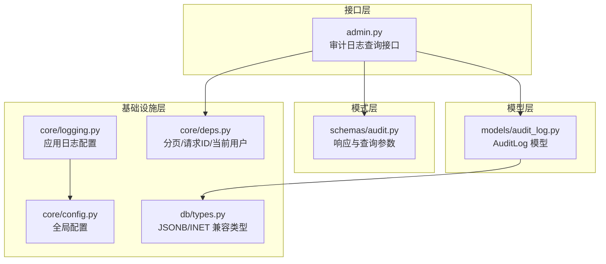
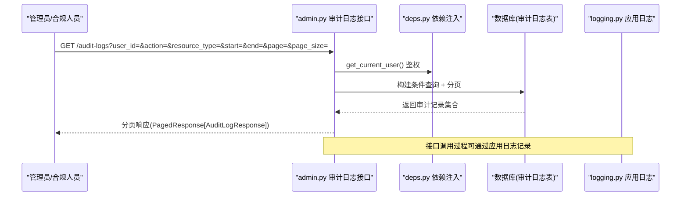
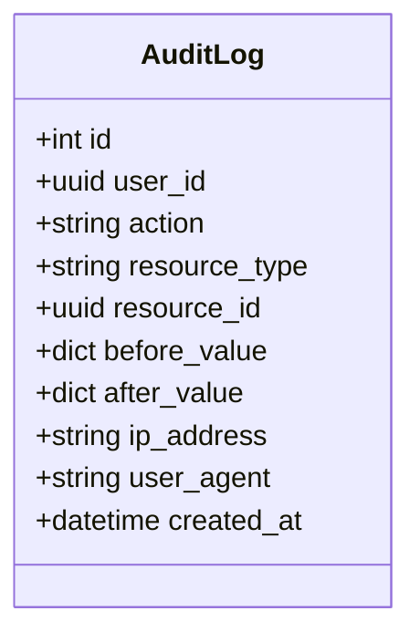
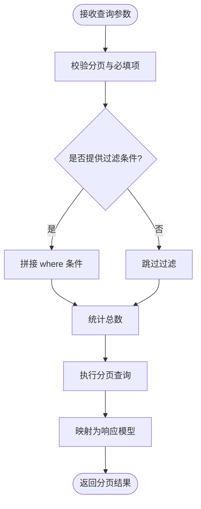
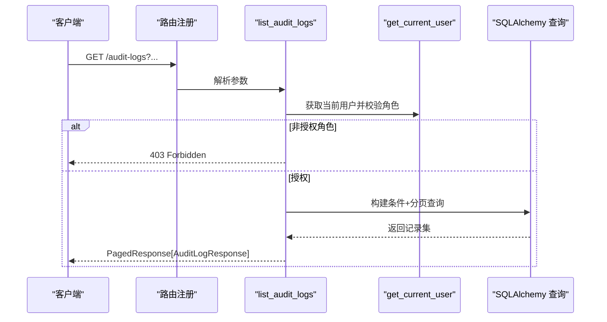
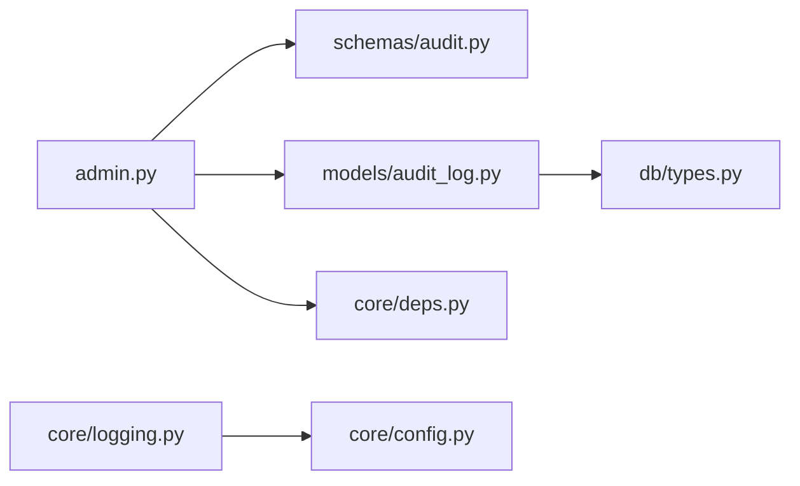

# 审计日志系统

<cite>
**本文引用的文件**   
- [backend/app/models/audit_log.py](file://backend/app/models/audit_log.py)
- [backend/app/schemas/audit.py](file://backend/app/schemas/audit.py)
- [backend/app/api/v1/admin.py](file://backend/app/api/v1/admin.py)
- [backend/app/core/logging.py](file://backend/app/core/logging.py)
- [backend/app/core/config.py](file://backend/app/core/config.py)
- [backend/app/db/types.py](file://backend/app/db/types.py)
- [backend/app/core/deps.py](file://backend/app/core/deps.py)
</cite>

## 目录
1. [简介](#简介)
2. [项目结构](#项目结构)
3. [核心组件](#核心组件)
4. [架构总览](#架构总览)
5. [详细组件分析](#详细组件分析)
6. [依赖关系分析](#依赖关系分析)
7. [性能考虑](#性能考虑)
8. [故障排查指南](#故障排查指南)
9. [结论](#结论)
10. [附录](#附录)

## 简介
本文件面向系统管理员与合规审计人员，系统化阐述 AI 药物设计系统的审计日志体系：记录策略、事件分类、存储结构、查询与分析方法；覆盖敏感操作监控、数据变更追踪、用户行为分析与合规性审计；并提供日志级别配置、性能优化、归档策略与安全保护建议。同时给出审计日志 API 接口说明、查询语法与报表生成方法，帮助快速落地可追溯、可审计的闭环方案。

## 项目结构
审计日志相关代码位于后端模块中，围绕“模型-模式-接口-基础设施”分层组织：
- 数据模型层：定义不可篡改的审计日志表结构与索引
- 模式层：定义响应体与查询参数校验
- 接口层：提供受限访问的审计日志查询 API
- 基础设施层：应用日志框架、配置、数据库类型兼容与通用依赖注入

图表来源
- [backend/app/api/v1/admin.py:52-124](file://backend/app/api/v1/admin.py#L52-L124)
- [backend/app/schemas/audit.py:14-39](file://backend/app/schemas/audit.py#L14-L39)
- [backend/app/models/audit_log.py:15-44](file://backend/app/models/audit_log.py#L15-L44)
- [backend/app/core/logging.py:20-74](file://backend/app/core/logging.py#L20-L74)
- [backend/app/core/config.py:21-144](file://backend/app/core/config.py#L21-L144)
- [backend/app/db/types.py:13-42](file://backend/app/db/types.py#L13-L42)
- [backend/app/core/deps.py:67-98](file://backend/app/core/deps.py#L67-L98)

章节来源
- [backend/app/api/v1/admin.py:52-124](file://backend/app/api/v1/admin.py#L52-L124)
- [backend/app/schemas/audit.py:14-39](file://backend/app/schemas/audit.py#L14-L39)
- [backend/app/models/audit_log.py:15-44](file://backend/app/models/audit_log.py#L15-L44)
- [backend/app/core/logging.py:20-74](file://backend/app/core/logging.py#L20-L74)
- [backend/app/core/config.py:21-144](file://backend/app/core/config.py#L21-L144)
- [backend/app/db/types.py:13-42](file://backend/app/db/types.py#L13-L42)
- [backend/app/core/deps.py:67-98](file://backend/app/core/deps.py#L67-L98)

## 核心组件
- 审计日志模型（不可变追加）：使用自增主键便于时间范围扫描，包含用户、动作、资源标识、变更前后的 JSON 快照、客户端 IP 与 UA、创建时间，并建立复合索引以优化按动作与时间的查询。
- 审计日志模式：定义返回字段与查询参数，支持按用户、动作、资源类型、时间范围过滤，以及分页。
- 审计日志查询接口：仅允许特定角色访问，支持多维度过滤与分页，返回统一分页包装。
- 应用日志配置：生产环境输出结构化 JSON，开发环境彩色控制台；按大小/时间轮转与保留期管理；错误单独归档。
- 配置中心：集中管理日志级别、运行环境等关键开关。
- 数据库类型兼容：PostgreSQL 下使用 JSONB/INET 以获得高效查询与索引能力，其他方言降级为通用类型保证本地可用。
- 通用依赖：分页、请求 ID、当前用户对象注入，支撑审计上下文构建。

章节来源
- [backend/app/models/audit_log.py:15-44](file://backend/app/models/audit_log.py#L15-L44)
- [backend/app/schemas/audit.py:14-39](file://backend/app/schemas/audit.py#L14-L39)
- [backend/app/api/v1/admin.py:52-124](file://backend/app/api/v1/admin.py#L52-L124)
- [backend/app/core/logging.py:20-74](file://backend/app/core/logging.py#L20-L74)
- [backend/app/core/config.py:21-144](file://backend/app/core/config.py#L21-L144)
- [backend/app/db/types.py:13-42](file://backend/app/db/types.py#L13-L42)
- [backend/app/core/deps.py:67-98](file://backend/app/core/deps.py#L67-L98)

## 架构总览
审计日志在系统中的位置与交互如下：
- 业务服务在关键路径写入审计日志（通过数据库会话插入 AuditLog 记录）。
- 管理员或合规人员通过受控 API 查询审计日志，进行安全与合规分析。
- 应用日志框架负责程序运行日志的结构化输出与归档，与审计日志互补。

图表来源
- [backend/app/api/v1/admin.py:52-124](file://backend/app/api/v1/admin.py#L52-L124)
- [backend/app/core/deps.py:101-124](file://backend/app/core/deps.py#L101-L124)
- [backend/app/core/logging.py:20-74](file://backend/app/core/logging.py#L20-L74)

## 详细组件分析

### 审计日志模型（不可变追加）
- 主键采用自增整数，利于按时间范围高效扫描。
- 关键字段：
  - user_id：关联用户，可为空（匿名或系统触发场景）。
  - action：操作类型（如 create/read/update/delete/login 等），用于事件分类。
  - resource_type/resource_id：资源维度，用于定位受影响实体。
  - before_value/after_value：变更前后快照（JSON），用于数据变更追踪。
  - ip_address/user_agent：客户端信息，用于溯源与异常检测。
  - created_at：服务器端时间戳，确保时序一致。
- 索引：针对 action 与 created_at 的复合索引，优化高频过滤与排序。

图表来源
- [backend/app/models/audit_log.py:15-44](file://backend/app/models/audit_log.py#L15-L44)

章节来源
- [backend/app/models/audit_log.py:15-44](file://backend/app/models/audit_log.py#L15-L44)
- [backend/app/db/types.py:13-42](file://backend/app/db/types.py#L13-L42)

### 审计日志模式（响应与查询）
- 响应体字段与模型一一对应，描述动作与资源类型的取值示例，便于前端展示与筛选。
- 查询参数支持：
  - user_id/action/resource_type/resource_id：精确匹配过滤
  - from_time/to_time：时间范围过滤
  - page/page_size：分页控制（页码从 1 开始，每页上限受约束）

图表来源
- [backend/app/schemas/audit.py:14-39](file://backend/app/schemas/audit.py#L14-L39)
- [backend/app/api/v1/admin.py:52-124](file://backend/app/api/v1/admin.py#L52-L124)

章节来源
- [backend/app/schemas/audit.py:14-39](file://backend/app/schemas/audit.py#L14-L39)
- [backend/app/api/v1/admin.py:52-124](file://backend/app/api/v1/admin.py#L52-L124)

### 审计日志查询接口
- 访问控制：仅 founder/engineer 角色可访问，否则拒绝。
- 过滤维度：用户、动作、资源类型、时间范围。
- 排序与分页：按创建时间倒序，支持 offset/limit。
- 响应格式：统一分页包装，包含元数据（页码、总数、总页数、请求 ID）。

图表来源
- [backend/app/api/v1/admin.py:52-124](file://backend/app/api/v1/admin.py#L52-L124)
- [backend/app/core/deps.py:101-124](file://backend/app/core/deps.py#L101-L124)

章节来源
- [backend/app/api/v1/admin.py:52-124](file://backend/app/api/v1/admin.py#L52-L124)
- [backend/app/core/deps.py:101-124](file://backend/app/core/deps.py#L101-L124)

### 应用日志配置（与审计日志互补）
- 环境区分：生产环境输出结构化 JSON，开发环境彩色控制台。
- 文件输出：按天滚动、按大小轮转、压缩与保留期管理；错误日志单独归档。
- 上下文绑定：支持绑定模块名、请求 ID、用户 ID 等上下文，便于跨链路追踪。

章节来源
- [backend/app/core/logging.py:20-74](file://backend/app/core/logging.py#L20-L74)
- [backend/app/core/config.py:21-144](file://backend/app/core/config.py#L21-L144)

## 依赖关系分析
- 接口层依赖：
  - 依赖注入：分页、请求 ID、当前用户对象
  - 数据访问：SQLAlchemy 异步会话
  - 模式校验：Pydantic 响应与查询参数
- 模型层依赖：
  - 基础 ORM 基类
  - 数据库类型兼容（JSONB/INET）
- 配置与日志：
  - 配置单例驱动日志初始化
  - 日志框架独立于审计日志，但可用于记录审计接口调用与异常

图表来源
- [backend/app/api/v1/admin.py:52-124](file://backend/app/api/v1/admin.py#L52-L124)
- [backend/app/schemas/audit.py:14-39](file://backend/app/schemas/audit.py#L14-L39)
- [backend/app/models/audit_log.py:15-44](file://backend/app/models/audit_log.py#L15-L44)
- [backend/app/db/types.py:13-42](file://backend/app/db/types.py#L13-L42)
- [backend/app/core/deps.py:67-98](file://backend/app/core/deps.py#L67-L98)
- [backend/app/core/logging.py:20-74](file://backend/app/core/logging.py#L20-L74)
- [backend/app/core/config.py:21-144](file://backend/app/core/config.py#L21-L144)

章节来源
- [backend/app/api/v1/admin.py:52-124](file://backend/app/api/v1/admin.py#L52-L124)
- [backend/app/schemas/audit.py:14-39](file://backend/app/schemas/audit.py#L14-L39)
- [backend/app/models/audit_log.py:15-44](file://backend/app/models/audit_log.py#L15-L44)
- [backend/app/db/types.py:13-42](file://backend/app/db/types.py#L13-L42)
- [backend/app/core/deps.py:67-98](file://backend/app/core/deps.py#L67-L98)
- [backend/app/core/logging.py:20-74](file://backend/app/core/logging.py#L20-L74)
- [backend/app/core/config.py:21-144](file://backend/app/core/config.py#L21-L144)

## 性能考虑
- 索引优化：
  - 已为 (action, created_at) 建立复合索引，适合按动作与时间范围过滤与排序。
  - 若频繁按 user_id 过滤，可评估增加 user_id 索引以提升点查性能。
- 分页与限制：
  - 接口默认分页，page_size 有上限，避免一次性拉取大量数据。
  - 建议在报表导出时采用流式处理与分批导出。
- 数据库类型：
  - PostgreSQL 下 JSONB 支持高效子字段检索与索引，提升复杂条件查询性能。
- 应用日志：
  - 生产环境 JSON 输出有利于集中采集与高性能分析；注意磁盘 I/O 与轮转策略。
- 缓存与去重：
  - 对热点查询（如最近 N 条审计记录）可在网关或缓存层做短期缓存，降低数据库压力。

[本节为通用性能建议，不直接分析具体文件]

## 故障排查指南
- 权限问题：
  - 非 founder/engineer 角色访问审计日志接口将返回禁止访问错误。检查当前用户角色与令牌有效性。
- 查询无结果：
  - 确认过滤条件（用户、动作、资源类型、时间范围）是否正确；检查时间区间是否跨越服务器时区。
- 性能缓慢：
  - 检查是否存在缺失索引；评估是否使用了过大 page_size；必要时拆分查询或使用更细粒度过滤。
- 日志未落盘：
  - 检查应用日志配置中的轮转与保留策略；确认 logs 目录写权限；核对环境变量 app_env 与 app_log_level。
- 数据类型异常：
  - 在非 PostgreSQL 环境下，JSONB/INET 会降级为通用类型，可能导致部分高级查询失效；建议在生产使用 PostgreSQL。

章节来源
- [backend/app/api/v1/admin.py:52-124](file://backend/app/api/v1/admin.py#L52-L124)
- [backend/app/core/logging.py:20-74](file://backend/app/core/logging.py#L20-L74)
- [backend/app/db/types.py:13-42](file://backend/app/db/types.py#L13-L42)

## 结论
本审计日志系统以不可变追加为核心原则，结合严格的访问控制、完善的过滤与分页能力、以及可扩展的事件分类与变更快照，满足敏感操作监控、数据变更追踪、用户行为分析与合规性审计需求。配合应用日志的结构化输出与归档策略，形成完整的可观测性与可审计性闭环。

[本节为总结性内容，不直接分析具体文件]

## 附录

### 审计日志 API 参考
- 接口路径：GET /audit-logs
- 认证与授权：需要有效令牌且角色为 founder 或 engineer
- 查询参数：
  - user_id：按用户过滤
  - action：按动作过滤
  - resource_type：按资源类型过滤
  - start/end：ISO 8601 时间范围
  - page/page_size：分页参数
- 响应体：PagedResponse[AuditLogResponse]，包含 data 列表与 meta 元数据

章节来源
- [backend/app/api/v1/admin.py:52-124](file://backend/app/api/v1/admin.py#L52-L124)
- [backend/app/schemas/audit.py:14-39](file://backend/app/schemas/audit.py#L14-L39)

### 事件分类体系建议
- 动作分类（action）：create、read、update、delete、login、logout、export、import、approve、reject、assign、revoke 等
- 资源类型（resource_type）：project、dataset、target、molecule、hypothesis、report、user、role 等
- 组合用法：通过 action + resource_type + resource_id 精确定位一次变更的影响面

章节来源
- [backend/app/schemas/audit.py:14-39](file://backend/app/schemas/audit.py#L14-L39)

### 日志级别配置与环境
- 环境变量：app_env（development/staging/production）、app_log_level（DEBUG/INFO/WARNING/ERROR）
- 行为差异：
  - 生产：结构化 JSON 输出，便于集中采集与分析
  - 开发：彩色控制台输出，便于调试
- 文件归档：按天滚动、按大小轮转、压缩与保留期管理；错误日志单独归档

章节来源
- [backend/app/core/config.py:21-144](file://backend/app/core/config.py#L21-L144)
- [backend/app/core/logging.py:20-74](file://backend/app/core/logging.py#L20-L74)

### 安全保护与合规建议
- 不可篡改：应用层不提供 UPDATE/DELETE 审计日志接口；数据库层建议通过 REVOKE 权限进一步保护。
- 最小权限：仅授权必要角色访问审计日志接口。
- 脱敏策略：before_value/after_value 中避免记录敏感明文（如密码、密钥），必要时在写入前进行脱敏。
- 留存策略：结合法规要求设定审计日志保留期，并启用压缩与异地备份。

章节来源
- [backend/app/models/audit_log.py:15-44](file://backend/app/models/audit_log.py#L15-L44)

### 报表生成方法
- 基于 API 的分批拉取：
  - 使用分页参数逐页拉取审计记录，合并后生成 CSV/Excel/PDF 报表。
- 聚合指标：
  - 按用户/动作/资源类型统计频次、趋势图、异常峰值。
- 导出规范：
  - 包含请求 ID、时间戳、用户、动作、资源、变更摘要、IP/UA 等字段，便于后续审计复核。

[本节为通用方法指导，不直接分析具体文件]