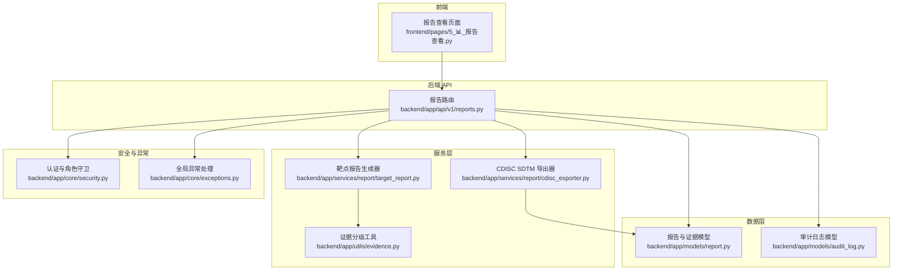
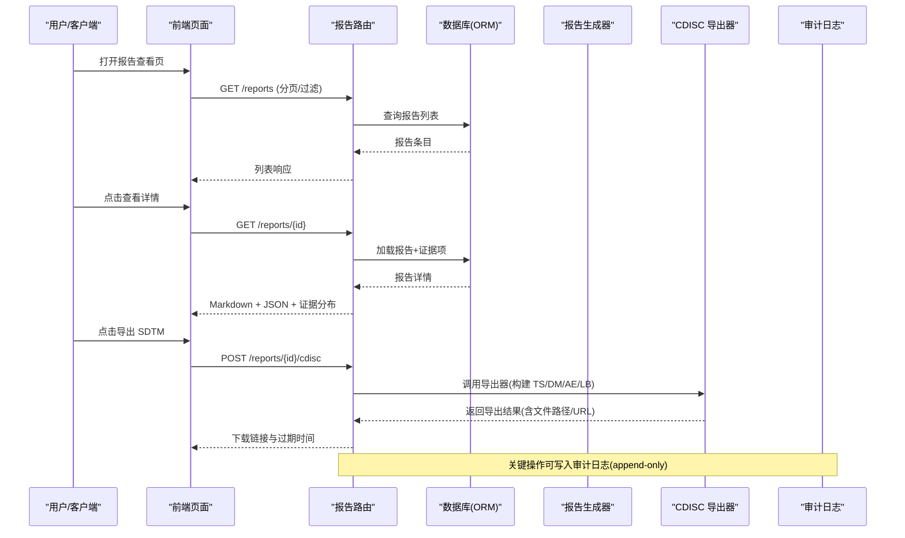
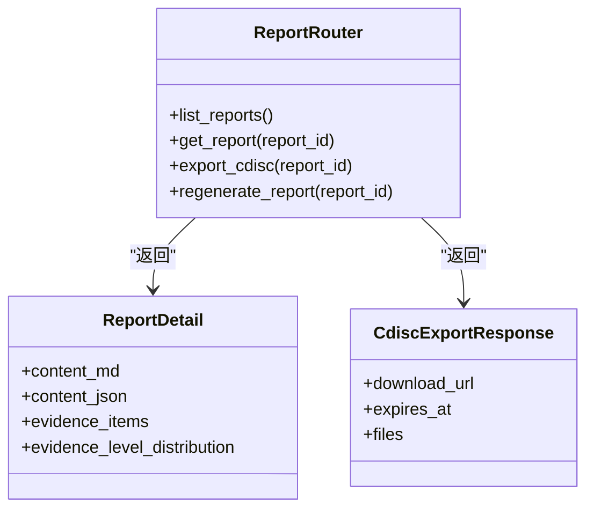
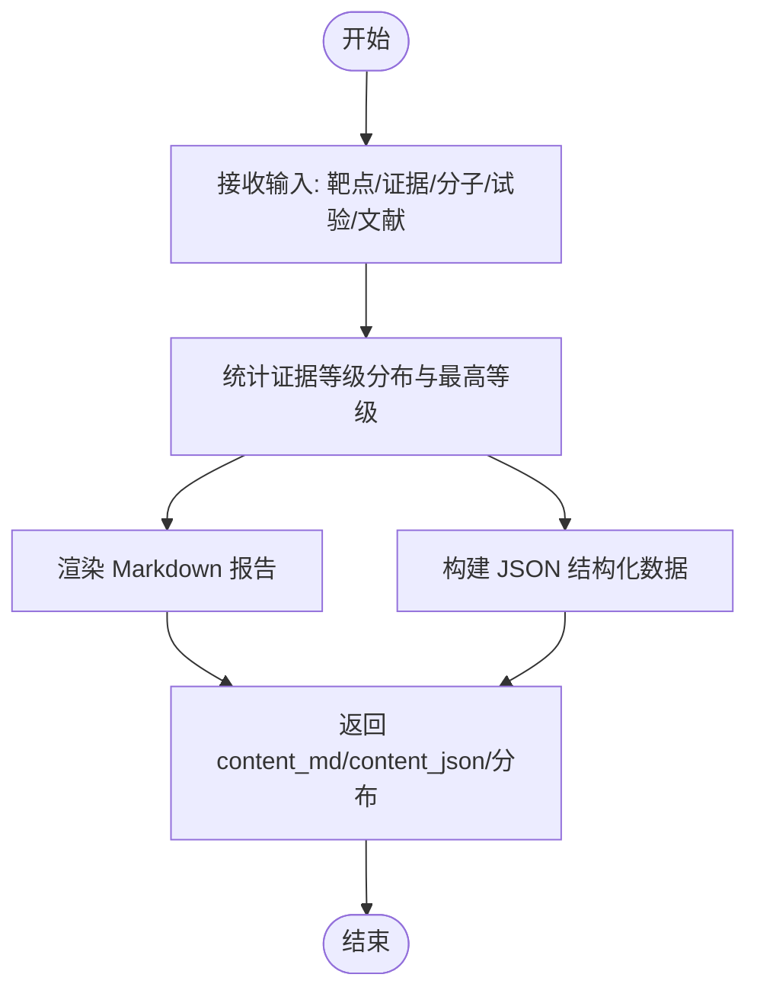
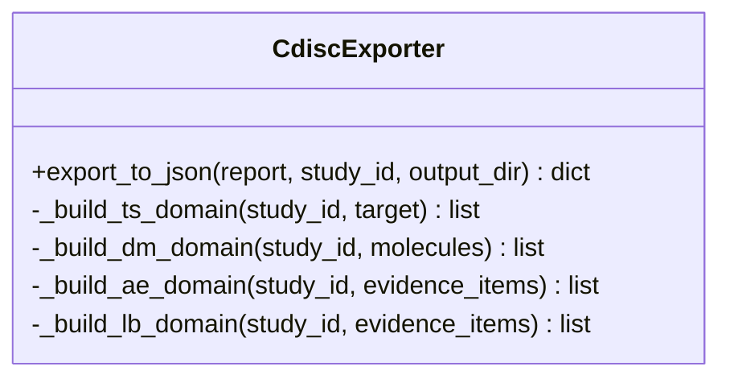
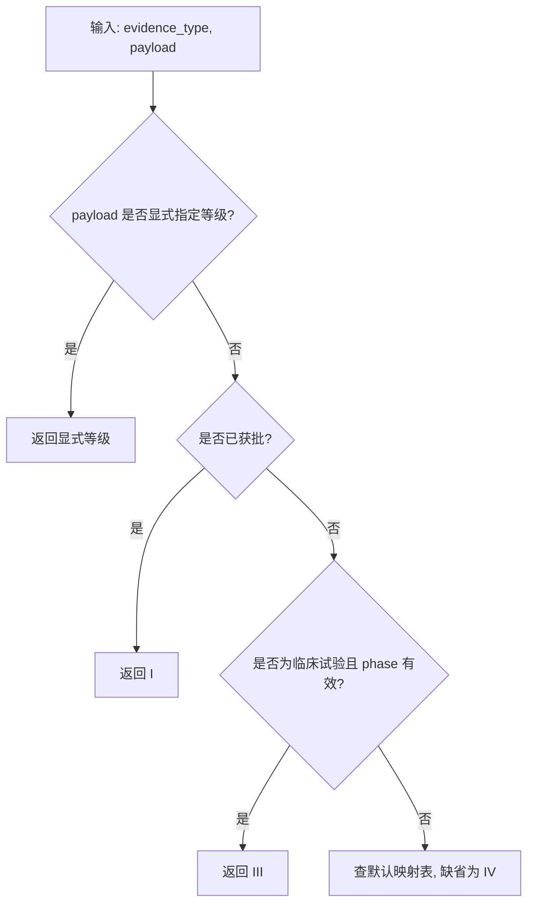
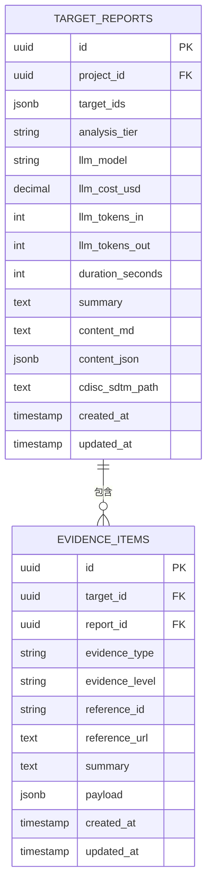
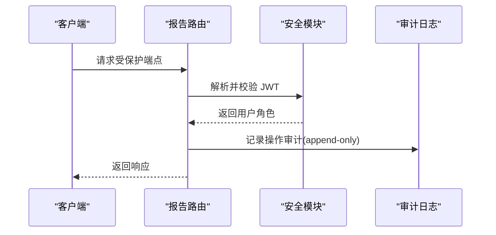
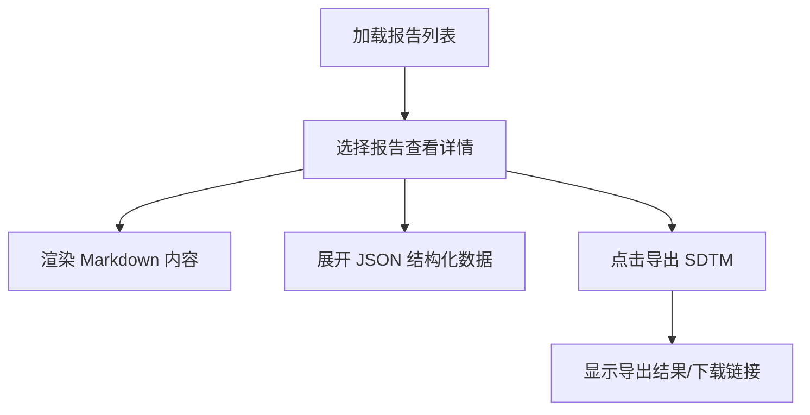
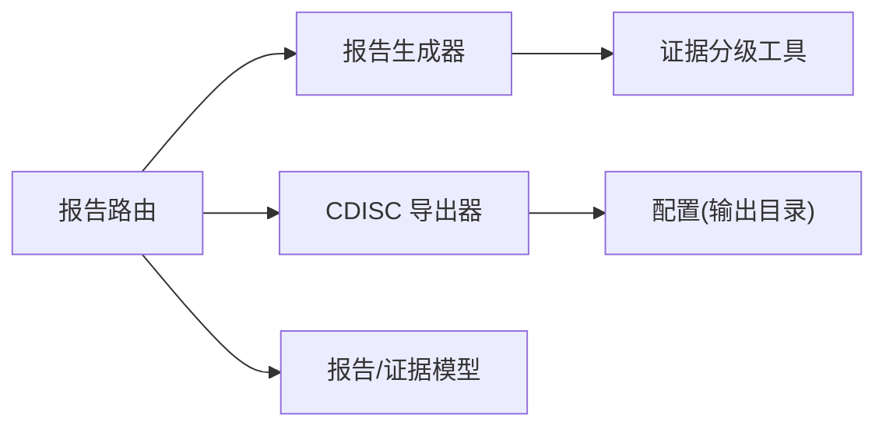

# 报告生成与管理

<cite>
**本文引用的文件**   
- [backend/app/api/v1/reports.py](file://backend/app/api/v1/reports.py)
- [backend/app/models/report.py](file://backend/app/models/report.py)
- [backend/app/schemas/report.py](file://backend/app/schemas/report.py)
- [backend/app/services/report/cdisc_exporter.py](file://backend/app/services/report/cdisc_exporter.py)
- [backend/app/services/report/target_report.py](file://backend/app/services/report/target_report.py)
- [backend/app/utils/evidence.py](file://backend/app/utils/evidence.py)
- [backend/app/models/audit_log.py](file://backend/app/models/audit_log.py)
- [backend/app/core/security.py](file://backend/app/core/security.py)
- [backend/app/core/exceptions.py](file://backend/app/core/exceptions.py)
- [frontend/pages/5_📊_报告查看.py](file://frontend/pages/5_📊_报告查看.py)
- [tests/test_cdisc_exporter.py](file://tests/test_cdisc_exporter.py)
</cite>

## 目录
1. [简介](#简介)
2. [项目结构](#项目结构)
3. [核心组件](#核心组件)
4. [架构总览](#架构总览)
5. [详细组件分析](#详细组件分析)
6. [依赖关系分析](#依赖关系分析)
7. [性能与可扩展性](#性能与可扩展性)
8. [故障排查指南](#故障排查指南)
9. [结论](#结论)
10. [附录：API 接口文档与开发指南](#附录api-接口文档与开发指南)

## 简介
本文件面向研究人员与合规团队，系统化说明 AI 药物设计系统中的“报告生成与管理”能力。内容覆盖：
- 报告模板系统（Markdown + JSON 结构化）
- 多格式导出支持（SDTM JSON、占位 ZIP/XPT 路径）
- 报告版本控制（基于数据库记录与时间戳）
- 审批工作流（权限控制与审计追踪）
- 自动生成机制（证据聚合、等级统计、渲染）
- 可视化图表（前端指标展示）
- 合规性检查（CDISC SDTM 域映射与校验）
- 报告模板定制、批量导出、权限控制、审计追踪
- 报告管理 API 接口文档、CDISC 导出配置、自定义报告开发指南

## 项目结构
围绕报告功能的核心代码分布在后端 API、服务层、数据模型与前端页面中：
- API 层：提供报告的列表、详情、CDISC 导出、重新生成等端点
- 服务层：靶点报告生成器、CDISC SDTM 导出器、证据分级工具
- 数据层：报告与证据项模型、审计日志模型
- 安全与异常：JWT 鉴权、统一错误信封
- 前端：报告查看与导出交互

图示来源
- [backend/app/api/v1/reports.py:1-181](file://backend/app/api/v1/reports.py#L1-L181)
- [backend/app/services/report/target_report.py:1-215](file://backend/app/services/report/target_report.py#L1-L215)
- [backend/app/services/report/cdisc_exporter.py:1-187](file://backend/app/services/report/cdisc_exporter.py#L1-L187)
- [backend/app/utils/evidence.py:1-103](file://backend/app/utils/evidence.py#L1-L103)
- [backend/app/models/report.py:1-73](file://backend/app/models/report.py#L1-L73)
- [backend/app/models/audit_log.py:1-45](file://backend/app/models/audit_log.py#L1-L45)
- [backend/app/core/security.py:1-211](file://backend/app/core/security.py#L1-L211)
- [backend/app/core/exceptions.py:1-179](file://backend/app/core/exceptions.py#L1-L179)
- [frontend/pages/5_📊_报告查看.py:1-112](file://frontend/pages/5_📊_报告查看.py#L1-L112)

章节来源
- [backend/app/api/v1/reports.py:1-181](file://backend/app/api/v1/reports.py#L1-L181)
- [backend/app/services/report/target_report.py:1-215](file://backend/app/services/report/target_report.py#L1-L215)
- [backend/app/services/report/cdisc_exporter.py:1-187](file://backend/app/services/report/cdisc_exporter.py#L1-L187)
- [backend/app/utils/evidence.py:1-103](file://backend/app/utils/evidence.py#L1-L103)
- [backend/app/models/report.py:1-73](file://backend/app/models/report.py#L1-L73)
- [backend/app/models/audit_log.py:1-45](file://backend/app/models/audit_log.py#L1-L45)
- [backend/app/core/security.py:1-211](file://backend/app/core/security.py#L1-L211)
- [backend/app/core/exceptions.py:1-179](file://backend/app/core/exceptions.py#L1-L179)
- [frontend/pages/5_📊_报告查看.py:1-112](file://frontend/pages/5_📊_报告查看.py#L1-L112)

## 核心组件
- 报告路由（REST API）
  - 列出报告（分页、按项目与分析层级过滤）
  - 获取报告详情（Markdown + JSON + 证据项 + 证据等级分布）
  - CDISC SDTM 导出（返回下载 URL 与过期时间，当前为占位实现）
  - 重新生成报告（异步任务入队，返回任务状态）
- 靶点报告生成器
  - 输入：靶点信息、证据项、相关分子、临床试验、文献
  - 输出：Markdown 报告、JSON 结构化数据、证据等级分布
- CDISC SDTM 导出器
  - 将内部报告转换为 SDTM 核心域（TS、DM、AE、LB），输出 JSON 文件
  - 支持研究 ID、输出目录、标准版本标注
- 证据分级工具
  - 根据证据类型与载荷推断等级（I/II/III/IV）
  - 统计等级分布与最高等级
- 数据模型
  - TargetReport：报告主表（项目、目标、LLM 用量、时长、摘要、内容、CDISC 路径等）
  - EvidenceItem：证据项（类型、等级、参考、摘要、载荷）
  - AuditLog：不可变审计日志（操作、资源、前后值、IP、UA、时间）
- 安全与异常
  - JWT 鉴权与角色守卫（require_roles）
  - 统一异常信封（AppException 体系）

章节来源
- [backend/app/api/v1/reports.py:1-181](file://backend/app/api/v1/reports.py#L1-L181)
- [backend/app/services/report/target_report.py:1-215](file://backend/app/services/report/target_report.py#L1-L215)
- [backend/app/services/report/cdisc_exporter.py:1-187](file://backend/app/services/report/cdisc_exporter.py#L1-L187)
- [backend/app/utils/evidence.py:1-103](file://backend/app/utils/evidence.py#L1-L103)
- [backend/app/models/report.py:1-73](file://backend/app/models/report.py#L1-L73)
- [backend/app/models/audit_log.py:1-45](file://backend/app/models/audit_log.py#L1-L45)
- [backend/app/core/security.py:1-211](file://backend/app/core/security.py#L1-L211)
- [backend/app/core/exceptions.py:1-179](file://backend/app/core/exceptions.py#L1-L179)

## 架构总览
报告从数据源到最终导出的端到端流程如下：

图示来源
- [backend/app/api/v1/reports.py:1-181](file://backend/app/api/v1/reports.py#L1-L181)
- [backend/app/services/report/cdisc_exporter.py:1-187](file://backend/app/services/report/cdisc_exporter.py#L1-L187)
- [backend/app/models/report.py:1-73](file://backend/app/models/report.py#L1-L73)
- [backend/app/models/audit_log.py:1-45](file://backend/app/models/audit_log.py#L1-L45)

## 详细组件分析

### 报告路由（API）
- 列表接口
  - 支持按 project_id、analysis_tier 过滤
  - 分页元信息包含 page、page_size、total、total_pages、request_id
- 详情接口
  - 返回完整 Markdown、JSON、证据项列表与证据等级分布
- CDISC 导出接口
  - 返回下载 URL、过期时间、文件清单（占位实现）
- 重新生成接口
  - 返回任务入队状态（task_id、status=queued）

图示来源
- [backend/app/api/v1/reports.py:1-181](file://backend/app/api/v1/reports.py#L1-L181)
- [backend/app/schemas/report.py:1-59](file://backend/app/schemas/report.py#L1-L59)

章节来源
- [backend/app/api/v1/reports.py:1-181](file://backend/app/api/v1/reports.py#L1-L181)
- [backend/app/schemas/report.py:1-59](file://backend/app/schemas/report.py#L1-L59)

### 靶点报告生成器
- 生成逻辑
  - 计算证据等级分布与最高等级
  - 渲染 Markdown（标题、概述、证据列表、相关分子、临床试验、参考文献、免责声明）
  - 构造 JSON 结构化数据（包含所有输入与生成时间）
- 模板定制
  - 通过修改渲染函数扩展章节与字段
  - 可在 JSON 中追加自定义键供下游消费

图示来源
- [backend/app/services/report/target_report.py:1-215](file://backend/app/services/report/target_report.py#L1-L215)
- [backend/app/utils/evidence.py:1-103](file://backend/app/utils/evidence.py#L1-L103)

章节来源
- [backend/app/services/report/target_report.py:1-215](file://backend/app/services/report/target_report.py#L1-L215)
- [backend/app/utils/evidence.py:1-103](file://backend/app/utils/evidence.py#L1-L103)

### CDISC SDTM 导出器
- 支持的 SDTM 核心域
  - TS（试验摘要）、DM（人口学）、AE（不良事件）、LB（实验室检查）
- 输出
  - JSON 文件（命名包含研究 ID 与时间戳）
  - 返回结果包含 datasets 计数、filepath、standard、generated_at
- 校验与测试
  - 单元测试验证必要字段、文件存在性与 TS 域包含靶点信息

图示来源
- [backend/app/services/report/cdisc_exporter.py:1-187](file://backend/app/services/report/cdisc_exporter.py#L1-L187)
- [tests/test_cdisc_exporter.py:1-83](file://tests/test_cdisc_exporter.py#L1-L83)

章节来源
- [backend/app/services/report/cdisc_exporter.py:1-187](file://backend/app/services/report/cdisc_exporter.py#L1-L187)
- [tests/test_cdisc_exporter.py:1-83](file://tests/test_cdisc_exporter.py#L1-L83)

### 证据分级工具
- 分类规则
  - 优先使用 payload.evidence_level
  - 已获批药物 → I 级
  - 临床试验阶段 → III 级
  - 默认映射表决定等级
- 统计与最高等级
  - 统计各等级数量
  - 返回最高等级（I > II > III > IV）

图示来源
- [backend/app/utils/evidence.py:1-103](file://backend/app/utils/evidence.py#L1-L103)

章节来源
- [backend/app/utils/evidence.py:1-103](file://backend/app/utils/evidence.py#L1-L103)

### 数据模型与版本控制
- 报告模型
  - 包含项目、目标、分析层级、LLM 用量、时长、摘要、内容、CDISC 路径等
  - 关联证据项与假设分析
- 证据项模型
  - 类型、等级、参考、摘要、载荷
- 版本控制策略
  - 通过 created_at/updated_at 与内容字段实现版本追溯
  - 建议新增 version 字段以显式管理版本迭代

图示来源
- [backend/app/models/report.py:1-73](file://backend/app/models/report.py#L1-L73)

章节来源
- [backend/app/models/report.py:1-73](file://backend/app/models/report.py#L1-L73)

### 权限控制与审计追踪
- 权限控制
  - 使用 JWT access token 解析用户身份与角色
  - 通过 require_roles 工厂进行角色守卫
- 审计追踪
  - 审计日志为 append-only，记录 action、resource_type、resource_id、before/after_value、ip_address、user_agent、created_at
  - 建议在报告关键操作（创建、更新、导出、审批）写入审计日志

图示来源
- [backend/app/core/security.py:1-211](file://backend/app/core/security.py#L1-L211)
- [backend/app/models/audit_log.py:1-45](file://backend/app/models/audit_log.py#L1-L45)

章节来源
- [backend/app/core/security.py:1-211](file://backend/app/core/security.py#L1-L211)
- [backend/app/models/audit_log.py:1-45](file://backend/app/models/audit_log.py#L1-L45)

### 前端可视化与交互
- 报告列表与详情
  - 显示证据等级分布指标（I/II/III/IV）
  - 渲染 Markdown 内容与 JSON 结构化数据
- CDISC 导出
  - 触发导出按钮，调用后端接口并展示结果

图示来源
- [frontend/pages/5_📊_报告查看.py:1-112](file://frontend/pages/5_📊_报告查看.py#L1-L112)

章节来源
- [frontend/pages/5_📊_报告查看.py:1-112](file://frontend/pages/5_📊_报告查看.py#L1-L112)

## 依赖关系分析
- 组件耦合
  - 报告路由依赖服务层（生成器、导出器）与数据层（模型）
  - 生成器依赖证据分级工具
  - 导出器依赖配置与文件系统
- 外部依赖
  - FastAPI、SQLAlchemy、Pydantic、loguru、bcrypt、jose
- 潜在循环依赖
  - 当前未发现直接循环导入；注意在新增模块时避免跨层反向引用

图示来源
- [backend/app/api/v1/reports.py:1-181](file://backend/app/api/v1/reports.py#L1-L181)
- [backend/app/services/report/target_report.py:1-215](file://backend/app/services/report/target_report.py#L1-L215)
- [backend/app/services/report/cdisc_exporter.py:1-187](file://backend/app/services/report/cdisc_exporter.py#L1-L187)
- [backend/app/utils/evidence.py:1-103](file://backend/app/utils/evidence.py#L1-L103)
- [backend/app/models/report.py:1-73](file://backend/app/models/report.py#L1-L73)

章节来源
- [backend/app/api/v1/reports.py:1-181](file://backend/app/api/v1/reports.py#L1-L181)
- [backend/app/services/report/target_report.py:1-215](file://backend/app/services/report/target_report.py#L1-L215)
- [backend/app/services/report/cdisc_exporter.py:1-187](file://backend/app/services/report/cdisc_exporter.py#L1-L187)
- [backend/app/utils/evidence.py:1-103](file://backend/app/utils/evidence.py#L1-L103)
- [backend/app/models/report.py:1-73](file://backend/app/models/report.py#L1-L73)

## 性能与可扩展性
- 报告生成
  - 证据聚合与等级统计为 O(n)，适合中等规模证据集
  - Markdown 渲染为字符串拼接，避免重型模板引擎开销
- CDISC 导出
  - 文件写入为顺序 IO，建议对大批量导出采用分块或异步任务队列
- 可扩展点
  - 新增 SDTM 域：在导出器中添加 _build_xxx_domain 方法并在 export_to_json 中注册
  - 自定义报告模板：在生成器中扩展 Markdown 与 JSON 结构
  - 批量导出：增加批处理端点，结合任务队列与进度回调

[本节为通用指导，不直接分析具体文件]

## 故障排查指南
- 常见错误
  - 未找到报告：抛出 NOT_FOUND 异常，检查 report_id 是否存在
  - 参数校验失败：VALIDATION_ERROR，检查请求参数是否符合 schema
  - 上游服务失败：UPSTREAM_ERROR，检查外部数据源可用性
  - 权限不足：FORBIDDEN，检查用户角色与 require_roles 配置
- 调试建议
  - 查看统一错误信封中的 code、message、details 与 request_id
  - 关注日志级别（业务异常 warning，内部错误 exception）
  - 审计日志用于定位关键操作的 before/after 值变化

章节来源
- [backend/app/core/exceptions.py:1-179](file://backend/app/core/exceptions.py#L1-L179)
- [backend/app/api/v1/reports.py:1-181](file://backend/app/api/v1/reports.py#L1-L181)

## 结论
该系统提供了完整的报告生成与管理能力：从证据聚合与等级统计，到 Markdown/JSON 报告渲染，再到 CDISC SDTM 导出与前端可视化。通过 JWT 鉴权与审计日志，满足合规与可追溯要求。后续可进一步增强版本化、审批工作流与批量导出能力，以满足更严格的监管需求。

[本节为总结，不直接分析具体文件]

## 附录：API 接口文档与开发指南

### 报告管理 API
- 列表报告
  - 方法：GET
  - 路径：/api/v1/reports
  - 查询参数：project_id、analysis_tier、page、page_size
  - 响应：分页元信息与报告简要信息
- 获取报告详情
  - 方法：GET
  - 路径：/api/v1/reports/{report_id}
  - 响应：Markdown、JSON、证据项、证据等级分布
- CDISC SDTM 导出
  - 方法：GET
  - 路径：/api/v1/reports/{report_id}/cdisc
  - 响应：下载 URL、过期时间、文件清单（占位实现）
- 重新生成报告
  - 方法：POST
  - 路径：/api/v1/reports/{report_id}/regenerate
  - 响应：任务入队状态（task_id、status）

章节来源
- [backend/app/api/v1/reports.py:1-181](file://backend/app/api/v1/reports.py#L1-L181)
- [backend/app/schemas/report.py:1-59](file://backend/app/schemas/report.py#L1-L59)

### CDISC 导出配置
- 输出目录
  - 通过配置项 cdisc_sdtm_output_dir 指定
- 标准版本
  - 固定为 SDTM-IG 3.2
- 数据集
  - TS、DM、AE、LB 四个核心域
- 文件名
  - sdtm_{study_id}_{timestamp}.json

章节来源
- [backend/app/services/report/cdisc_exporter.py:1-187](file://backend/app/services/report/cdisc_exporter.py#L1-L187)

### 自定义报告开发指南
- 模板定制
  - 在报告生成器中扩展 Markdown 渲染与 JSON 结构
  - 新增字段需同步更新 Schema 与前端展示
- 新证据类型
  - 在证据分级工具中补充映射与分类规则
- 新导出格式
  - 在导出器中新增对应方法与测试用例
- 权限与审计
  - 使用 require_roles 控制访问
  - 在关键操作处写入审计日志

章节来源
- [backend/app/services/report/target_report.py:1-215](file://backend/app/services/report/target_report.py#L1-L215)
- [backend/app/utils/evidence.py:1-103](file://backend/app/utils/evidence.py#L1-L103)
- [backend/app/core/security.py:1-211](file://backend/app/core/security.py#L1-L211)
- [backend/app/models/audit_log.py:1-45](file://backend/app/models/audit_log.py#L1-L45)