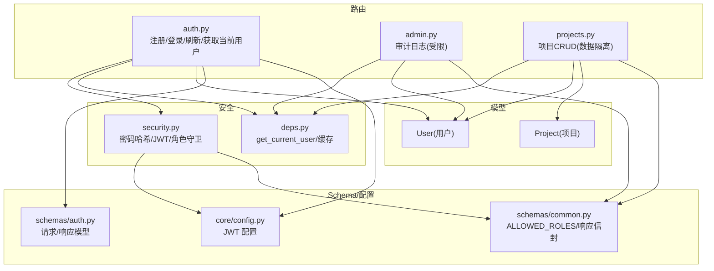
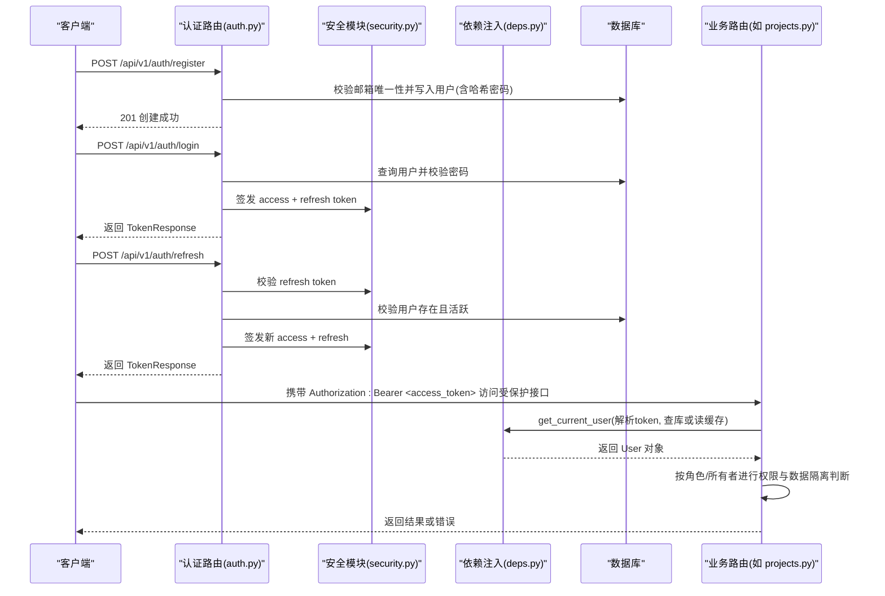
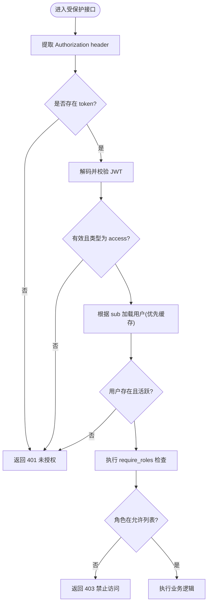
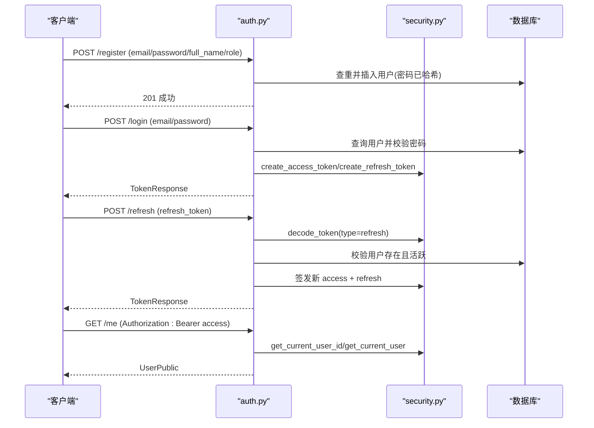
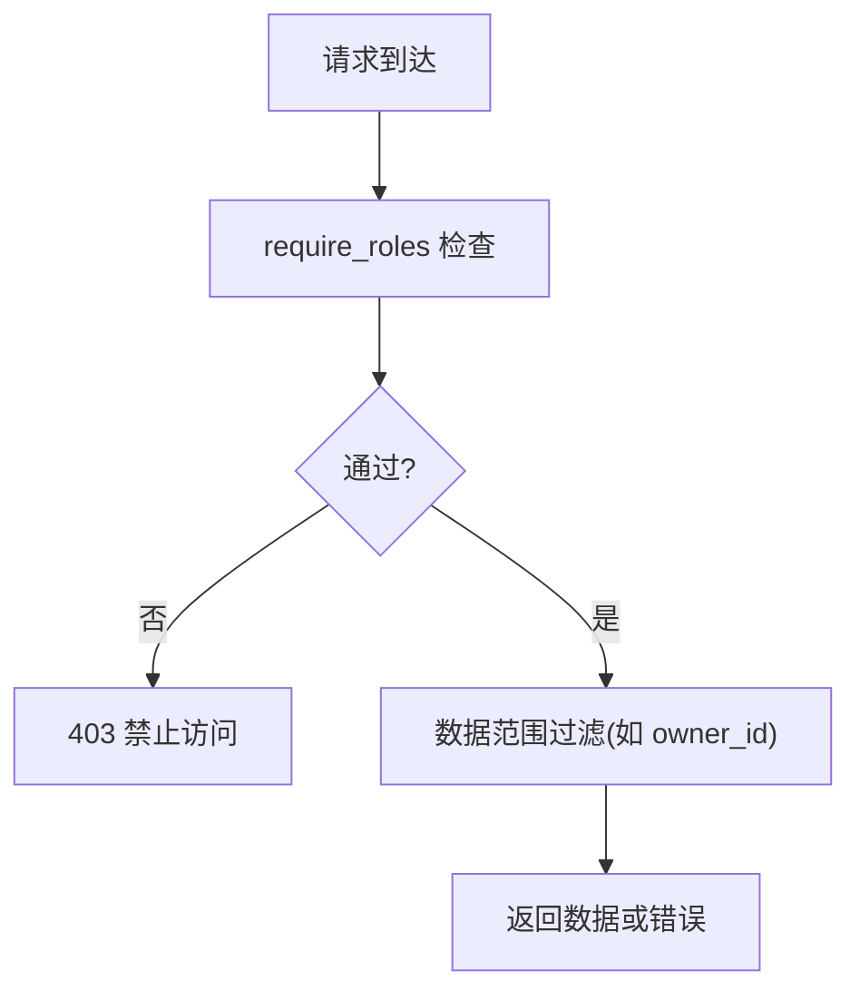
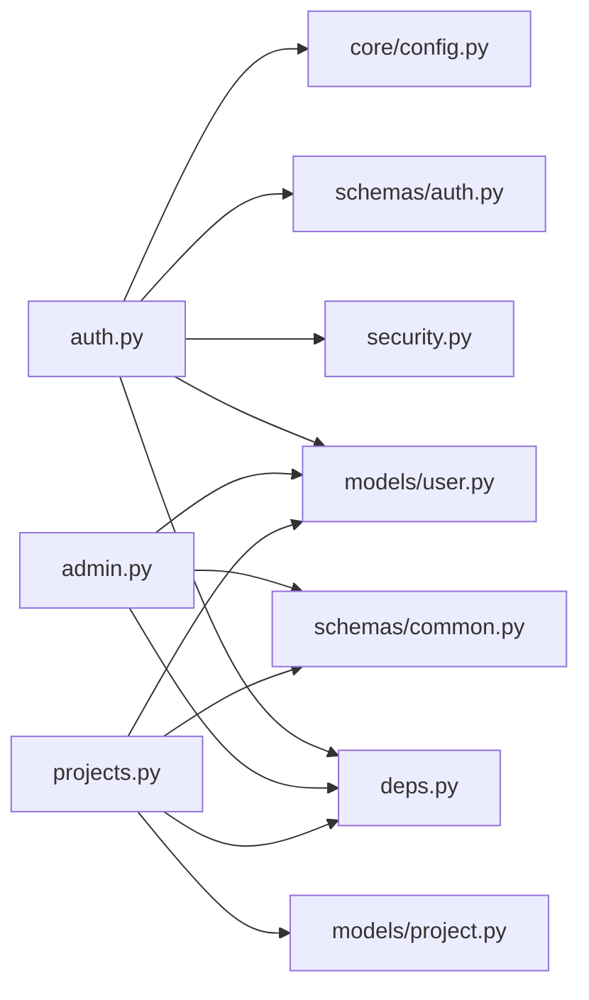

# 用户认证与权限管理

<cite>
**本文引用的文件**   
- [backend/app/models/user.py](file://backend/app/models/user.py)
- [backend/app/api/v1/auth.py](file://backend/app/api/v1/auth.py)
- [backend/app/core/security.py](file://backend/app/core/security.py)
- [backend/app/schemas/auth.py](file://backend/app/schemas/auth.py)
- [backend/app/core/deps.py](file://backend/app/core/deps.py)
- [backend/app/schemas/common.py](file://backend/app/schemas/common.py)
- [backend/app/core/config.py](file://backend/app/core/config.py)
- [backend/app/api/v1/admin.py](file://backend/app/api/v1/admin.py)
- [backend/app/api/v1/projects.py](file://backend/app/api/v1/projects.py)
- [backend/app/models/project.py](file://backend/app/models/project.py)
- [backend/app/core/exceptions.py](file://backend/app/core/exceptions.py)
- [tests/test_security.py](file://tests/test_security.py)
</cite>

## 目录
1. [简介](#简介)
2. [项目结构](#项目结构)
3. [核心组件](#核心组件)
4. [架构总览](#架构总览)
5. [详细组件分析](#详细组件分析)
6. [依赖关系分析](#依赖关系分析)
7. [性能与安全考量](#性能与安全考量)
8. [故障排查指南](#故障排查指南)
9. [结论](#结论)
10. [附录：API 与配置示例](#附录api-与配置示例)

## 简介
本文件面向系统管理员与开发者，系统化阐述 AI 药物设计系统的“用户认证与权限管理”模块。内容覆盖 RBAC 五角色体系（founder/pi/researcher/doctor/engineer）的权限策略、JWT 令牌机制、密码加密存储、会话管理、注册登录流程、权限验证中间件、API 访问控制、角色权限矩阵、数据隔离机制，并提供 API 接口文档、权限配置示例与安全最佳实践。

## 项目结构
认证与授权相关代码主要分布在以下位置：
- 模型层：用户与资源模型定义
- 安全层：密码哈希、JWT 生成/校验、当前用户提取、角色守卫
- 依赖注入：数据库会话、当前用户对象、分页与请求追踪
- 路由层：认证端点、管理端点、业务端点的权限控制
- Schema 层：统一响应信封、角色白名单等通用定义
- 配置层：JWT 密钥、过期时间等环境变量加载



图表来源
- [backend/app/models/user.py:14-36](file://backend/app/models/user.py#L14-L36)
- [backend/app/models/project.py:14-42](file://backend/app/models/project.py#L14-L42)
- [backend/app/core/security.py:1-211](file://backend/app/core/security.py#L1-L211)
- [backend/app/core/deps.py:101-124](file://backend/app/core/deps.py#L101-L124)
- [backend/app/api/v1/auth.py:41-147](file://backend/app/api/v1/auth.py#L41-L147)
- [backend/app/api/v1/admin.py:53-124](file://backend/app/api/v1/admin.py#L53-L124)
- [backend/app/api/v1/projects.py:32-84](file://backend/app/api/v1/projects.py#L32-L84)
- [backend/app/schemas/auth.py:13-61](file://backend/app/schemas/auth.py#L13-L61)
- [backend/app/schemas/common.py:132-134](file://backend/app/schemas/common.py#L132-L134)
- [backend/app/core/config.py:78-83](file://backend/app/core/config.py#L78-L83)

章节来源
- [backend/app/models/user.py:14-36](file://backend/app/models/user.py#L14-L36)
- [backend/app/models/project.py:14-42](file://backend/app/models/project.py#L14-L42)
- [backend/app/core/security.py:1-211](file://backend/app/core/security.py#L1-L211)
- [backend/app/core/deps.py:101-124](file://backend/app/core/deps.py#L101-L124)
- [backend/app/api/v1/auth.py:41-147](file://backend/app/api/v1/auth.py#L41-L147)
- [backend/app/api/v1/admin.py:53-124](file://backend/app/api/v1/admin.py#L53-L124)
- [backend/app/api/v1/projects.py:32-84](file://backend/app/api/v1/projects.py#L32-L84)
- [backend/app/schemas/auth.py:13-61](file://backend/app/schemas/auth.py#L13-L61)
- [backend/app/schemas/common.py:132-134](file://backend/app/schemas/common.py#L132-L134)
- [backend/app/core/config.py:78-83](file://backend/app/core/config.py#L78-L83)

## 核心组件
- 用户模型与角色
  - 用户包含邮箱、哈希密码、全名、角色、活跃状态、最后登录时间等字段；角色取值限定为 founder/pi/researcher/doctor/engineer。
- 安全能力
  - bcrypt 密码哈希与校验；JWT access/refresh token 生成与解析；FastAPI 依赖注入的当前用户提取与角色守卫。
- 依赖注入
  - get_current_user 提供带短 TTL 内存缓存的用户对象，减少重复查询；get_request_id 注入请求追踪 ID。
- 认证路由
  - 注册（首位 founder 开放，后续需 token）、登录（返回 access + refresh）、刷新（用 refresh 换新的 access）、获取当前用户信息。
- 权限控制
  - require_roles 工厂用于声明式角色检查；部分接口硬编码角色判断（如审计日志仅 founder/engineer）。
- 数据隔离
  - 非 founder 只能访问自己拥有的资源（以 owner_id 过滤），实现基于所有者的数据隔离。
- 配置
  - JWT 密钥、算法、access/refresh 过期时间通过 Settings 集中管理。

章节来源
- [backend/app/models/user.py:14-36](file://backend/app/models/user.py#L14-L36)
- [backend/app/core/security.py:32-59](file://backend/app/core/security.py#L32-L59)
- [backend/app/core/security.py:96-149](file://backend/app/core/security.py#L96-L149)
- [backend/app/core/security.py:194-210](file://backend/app/core/security.py#L194-L210)
- [backend/app/core/deps.py:101-124](file://backend/app/core/deps.py#L101-L124)
- [backend/app/api/v1/auth.py:41-147](file://backend/app/api/v1/auth.py#L41-L147)
- [backend/app/api/v1/admin.py:69-70](file://backend/app/api/v1/admin.py#L69-L70)
- [backend/app/api/v1/projects.py:59-61](file://backend/app/api/v1/projects.py#L59-L61)
- [backend/app/core/config.py:78-83](file://backend/app/core/config.py#L78-L83)

## 架构总览
下图展示了从客户端到后端的核心认证与鉴权路径，包括注册、登录、刷新、受保护资源访问以及数据隔离逻辑。



图表来源
- [backend/app/api/v1/auth.py:41-147](file://backend/app/api/v1/auth.py#L41-L147)
- [backend/app/core/security.py:96-149](file://backend/app/core/security.py#L96-L149)
- [backend/app/core/deps.py:101-124](file://backend/app/core/deps.py#L101-L124)
- [backend/app/api/v1/projects.py:59-61](file://backend/app/api/v1/projects.py#L59-L61)

## 详细组件分析

### 用户模型与角色定义
- 用户表字段：邮箱（唯一）、哈希密码、全名、角色、是否活跃、最后登录时间。
- 角色集合：founder/pi/researcher/doctor/engineer，由全局常量 ALLOWED_ROLES 约束。

```mermaid
classDiagram
class User {
+uuid id
+string email
+string hashed_password
+string full_name
+string role
+bool is_active
+datetime last_login_at
}
class Project {
+uuid id
+string name
+uuid owner_id
+string status
+dict metadata_
}
User ||--o{ Project : "拥有(owner_id)"
```

图表来源
- [backend/app/models/user.py:14-36](file://backend/app/models/user.py#L14-L36)
- [backend/app/models/project.py:14-42](file://backend/app/models/project.py#L14-L42)

章节来源
- [backend/app/models/user.py:14-36](file://backend/app/models/user.py#L14-L36)
- [backend/app/schemas/common.py:132-134](file://backend/app/schemas/common.py#L132-L134)

### 安全模块：密码与 JWT
- 密码哈希：bcrypt 生成盐并哈希；校验使用恒定时间比较。
- JWT：
  - access token：短期（默认 60 分钟），携带 sub、role、type=access、iat/exp/jti。
  - refresh token：长期（默认 7 天），type=refresh。
  - decode 失败抛出未授权异常。
- 依赖注入：
  - get_current_user_id：从 Authorization header 提取并校验 access token。
  - get_current_user_role：从 payload 中读取 role。
  - require_roles：声明式角色守卫，不满足时抛出禁止访问异常。



图表来源
- [backend/app/core/security.py:155-191](file://backend/app/core/security.py#L155-L191)
- [backend/app/core/security.py:194-210](file://backend/app/core/security.py#L194-L210)
- [backend/app/core/exceptions.py:57-64](file://backend/app/core/exceptions.py#L57-L64)

章节来源
- [backend/app/core/security.py:32-59](file://backend/app/core/security.py#L32-L59)
- [backend/app/core/security.py:96-149](file://backend/app/core/security.py#L96-L149)
- [backend/app/core/security.py:155-210](file://backend/app/core/security.py#L155-L210)
- [backend/app/core/exceptions.py:57-64](file://backend/app/core/exceptions.py#L57-L64)

### 认证路由：注册、登录、刷新、获取当前用户
- 注册：
  - 首次 founder 可开放注册；后续需带 token（由外层守卫控制）。
  - 校验邮箱唯一性，密码经哈希后入库。
- 登录：
  - 校验邮箱与密码，更新最后登录时间，签发 access + refresh。
- 刷新：
  - 校验 refresh token 类型与有效性，重新签发 access + refresh。
- 获取当前用户：
  - 需要有效的 access token，返回公开用户信息。



图表来源
- [backend/app/api/v1/auth.py:41-147](file://backend/app/api/v1/auth.py#L41-L147)
- [backend/app/core/security.py:96-149](file://backend/app/core/security.py#L96-L149)
- [backend/app/core/deps.py:101-124](file://backend/app/core/deps.py#L101-L124)

章节来源
- [backend/app/api/v1/auth.py:41-147](file://backend/app/api/v1/auth.py#L41-L147)
- [backend/app/schemas/auth.py:13-61](file://backend/app/schemas/auth.py#L13-L61)

### 权限验证中间件与 API 访问控制
- 声明式角色守卫：require_roles("founder","pi") 等，用于限制特定接口的角色范围。
- 硬编码角色检查：例如审计日志仅 founder/engineer 可访问。
- 数据隔离：非 founder 仅能访问 own 资源（owner_id 匹配）。



图表来源
- [backend/app/core/security.py:194-210](file://backend/app/core/security.py#L194-L210)
- [backend/app/api/v1/admin.py:69-70](file://backend/app/api/v1/admin.py#L69-L70)
- [backend/app/api/v1/projects.py:59-61](file://backend/app/api/v1/projects.py#L59-L61)

章节来源
- [backend/app/api/v1/admin.py:69-70](file://backend/app/api/v1/admin.py#L69-L70)
- [backend/app/api/v1/projects.py:59-61](file://backend/app/api/v1/projects.py#L59-L61)

### 用户管理与权限配置示例
- 用户管理 API
  - 注册：POST /api/v1/auth/register
  - 登录：POST /api/v1/auth/login
  - 刷新：POST /api/v1/auth/refresh
  - 获取当前用户：GET /api/v1/auth/me
- 权限配置示例
  - 使用 require_roles 限制接口角色范围。
  - 在业务逻辑中按 owner_id 做数据隔离。
- 角色权限矩阵（基于现有实现归纳）
  - founder：最高权限，可访问全部资源；可注册首位 founder；可访问审计日志。
  - pi：具备较高权限，具体取决于各接口 require_roles 配置。
  - researcher：默认角色，可访问自身资源。
  - doctor：只读角色，通常用于查看类接口。
  - engineer：运维角色，可访问审计日志等管理功能。
- 权限继承规则
  - 当前实现采用显式角色白名单与数据隔离，无隐式继承；如需扩展可在 require_roles 中组合角色或使用更细粒度的策略。

章节来源
- [backend/app/api/v1/auth.py:41-147](file://backend/app/api/v1/auth.py#L41-L147)
- [backend/app/api/v1/admin.py:69-70](file://backend/app/api/v1/admin.py#L69-L70)
- [backend/app/api/v1/projects.py:59-61](file://backend/app/api/v1/projects.py#L59-L61)
- [backend/app/schemas/common.py:132-134](file://backend/app/schemas/common.py#L132-L134)

## 依赖关系分析
- 模块耦合
  - auth 路由依赖 security、deps、models、schemas、config。
  - admin 路由依赖 deps、models、schemas。
  - projects 路由依赖 deps、models、schemas，并在业务层实现数据隔离。
- 外部依赖
  - bcrypt、jose（JWT）、fastapi、sqlalchemy、pydantic-settings。
- 潜在循环依赖
  - 当前结构清晰，未见循环导入；若新增模块需注意将共享逻辑下沉至 core 层。



图表来源
- [backend/app/api/v1/auth.py:1-38](file://backend/app/api/v1/auth.py#L1-L38)
- [backend/app/core/security.py:1-27](file://backend/app/core/security.py#L1-L27)
- [backend/app/core/deps.py:1-25](file://backend/app/core/deps.py#L1-L25)
- [backend/app/models/user.py:1-12](file://backend/app/models/user.py#L1-L12)
- [backend/app/schemas/auth.py:1-12](file://backend/app/schemas/auth.py#L1-L12)
- [backend/app/core/config.py:1-20](file://backend/app/core/config.py#L1-L20)
- [backend/app/api/v1/admin.py:1-24](file://backend/app/api/v1/admin.py#L1-L24)
- [backend/app/api/v1/projects.py:1-28](file://backend/app/api/v1/projects.py#L1-L28)
- [backend/app/models/project.py:1-12](file://backend/app/models/project.py#L1-L12)
- [backend/app/schemas/common.py:1-20](file://backend/app/schemas/common.py#L1-L20)

章节来源
- [backend/app/api/v1/auth.py:1-38](file://backend/app/api/v1/auth.py#L1-L38)
- [backend/app/core/security.py:1-27](file://backend/app/core/security.py#L1-L27)
- [backend/app/core/deps.py:1-25](file://backend/app/core/deps.py#L1-L25)
- [backend/app/models/user.py:1-12](file://backend/app/models/user.py#L1-L12)
- [backend/app/schemas/auth.py:1-12](file://backend/app/schemas/auth.py#L1-L12)
- [backend/app/core/config.py:1-20](file://backend/app/core/config.py#L1-L20)
- [backend/app/api/v1/admin.py:1-24](file://backend/app/api/v1/admin.py#L1-L24)
- [backend/app/api/v1/projects.py:1-28](file://backend/app/api/v1/projects.py#L1-L28)
- [backend/app/models/project.py:1-12](file://backend/app/models/project.py#L1-L12)
- [backend/app/schemas/common.py:1-20](file://backend/app/schemas/common.py#L1-L20)

## 性能与安全考量
- 性能
  - 用户对象短 TTL 内存缓存（约 10 秒），显著降低高频鉴权时的数据库压力。
  - JWT 无状态校验，避免服务端会话存储开销。
- 安全
  - 密码使用 bcrypt 哈希，抵抗彩虹表与时序攻击。
  - JWT 使用 HS256 签名，建议生产环境使用强随机密钥并定期轮换。
  - 区分 access 与 refresh token，缩短 access 有效期，降低泄露风险。
  - 统一异常封装，避免敏感信息泄露。

[本节为通用指导，无需列出具体文件来源]

## 故障排查指南
- 常见错误码
  - UNAUTHORIZED（401）：缺少或无效 token、用户不存在或被禁用。
  - FORBIDDEN（403）：角色不足或无权访问资源。
  - NOT_FOUND（404）：资源不存在。
  - CONFLICT（409）：邮箱已注册等冲突。
- 定位步骤
  - 检查 Authorization header 是否正确携带 Bearer token。
  - 确认 JWT 密钥与算法配置一致。
  - 查看日志中的 request_id 与错误详情。
  - 对密码问题，确认哈希格式与校验逻辑。

章节来源
- [backend/app/core/exceptions.py:57-75](file://backend/app/core/exceptions.py#L57-L75)
- [backend/app/core/exceptions.py:131-179](file://backend/app/core/exceptions.py#L131-L179)
- [backend/app/core/security.py:138-149](file://backend/app/core/security.py#L138-L149)

## 结论
本模块通过 bcrypt 密码哈希、JWT 无状态令牌、声明式角色守卫与数据隔离策略，构建了稳健的认证与授权体系。结合短 TTL 用户缓存与统一异常封装，兼顾了性能与安全性。建议在后续迭代中完善更细粒度的权限策略与审计记录，以满足合规与运营需求。

[本节为总结，无需列出具体文件来源]

## 附录：API 与配置示例

### 用户管理 API 参考
- 注册
  - 方法：POST
  - 路径：/api/v1/auth/register
  - 说明：注册新用户（首位 founder 开放，后续需 token）
- 登录
  - 方法：POST
  - 路径：/api/v1/auth/login
  - 说明：返回 access_token、refresh_token、token_type、expires_in、user
- 刷新
  - 方法：POST
  - 路径：/api/v1/auth/refresh
  - 说明：使用 refresh_token 换取新的 access_token 与 refresh_token
- 获取当前用户
  - 方法：GET
  - 路径：/api/v1/auth/me
  - 说明：需要有效的 access token

章节来源
- [backend/app/api/v1/auth.py:41-147](file://backend/app/api/v1/auth.py#L41-L147)
- [backend/app/schemas/auth.py:47-61](file://backend/app/schemas/auth.py#L47-L61)

### 权限配置示例
- 使用 require_roles 限制接口角色范围
  - 示例用法：在路由上添加 dependencies=[Depends(require_roles("founder","pi"))]
- 数据隔离
  - 在查询条件中加入 owner_id 过滤，确保非 founder 仅访问自有资源

章节来源
- [backend/app/core/security.py:194-210](file://backend/app/core/security.py#L194-L210)
- [backend/app/api/v1/projects.py:59-61](file://backend/app/api/v1/projects.py#L59-L61)

### 安全最佳实践
- 生产环境
  - 设置强随机 jwt_secret_key，启用 HTTPS，合理配置 CORS。
  - 定期轮换密钥，监控异常登录与频繁刷新行为。
- 前端
  - 妥善存储 access/refresh token，避免 XSS 与 CSRF 风险。
  - 在 token 过期前主动刷新，提升用户体验。

章节来源
- [backend/app/core/config.py:78-83](file://backend/app/core/config.py#L78-L83)
- [backend/app/core/config.py:84-86](file://backend/app/core/config.py#L84-L86)

### 单元测试参考
- 密码哈希与校验
  - 验证 bcrypt 输出格式、唯一性与正确性
- JWT 生成与解析
  - 验证 claims 完整性、类型区分、无效 token 处理

章节来源
- [tests/test_security.py:16-44](file://tests/test_security.py#L16-L44)
- [tests/test_security.py:46-94](file://tests/test_security.py#L46-L94)