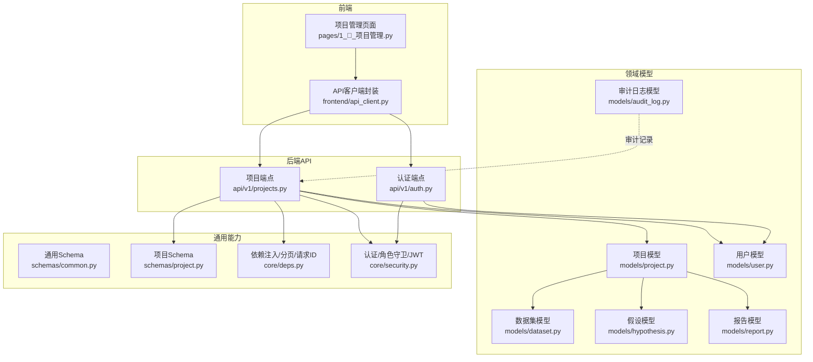
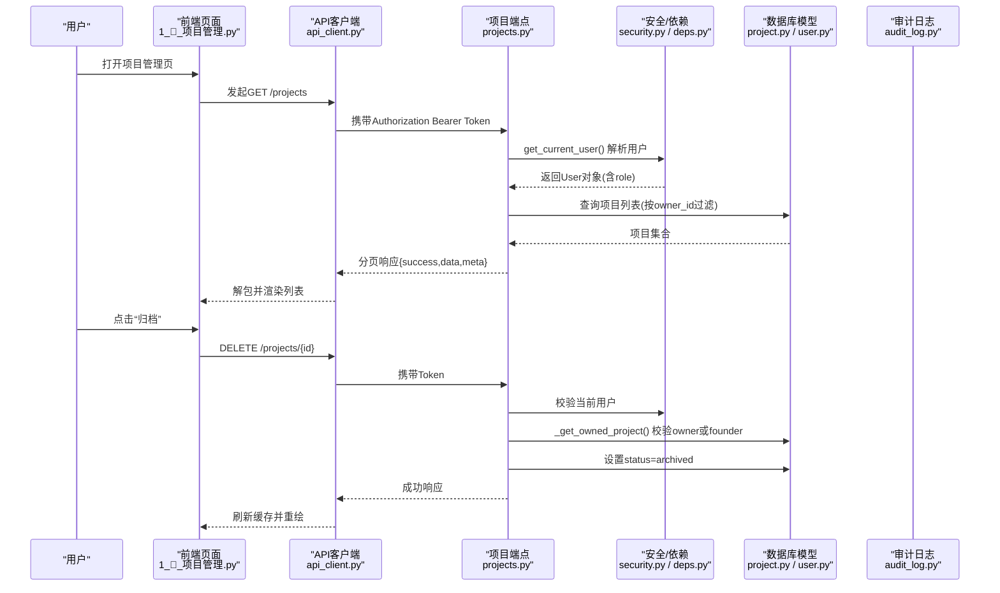
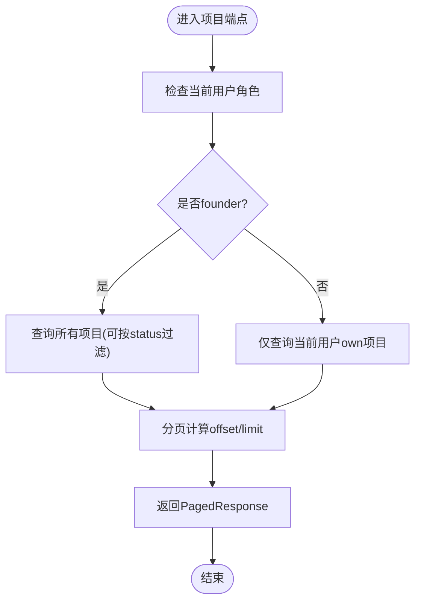
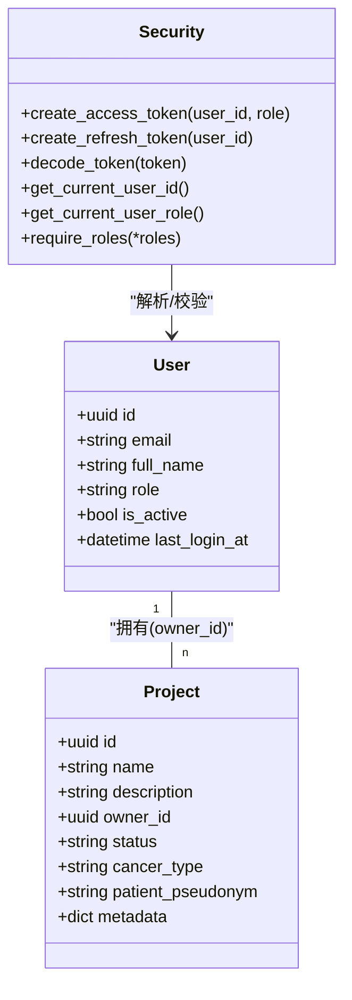
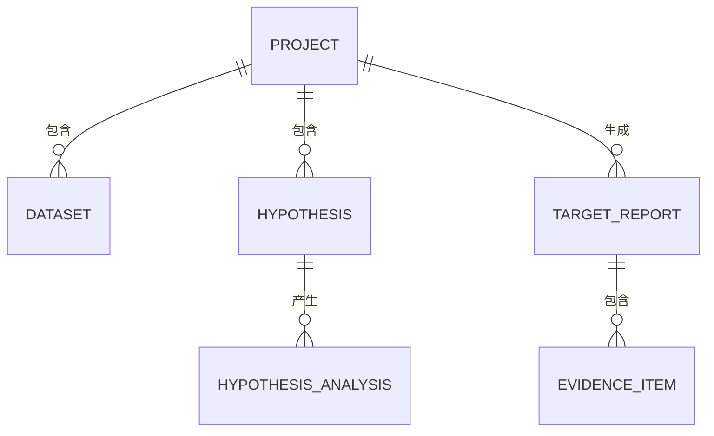
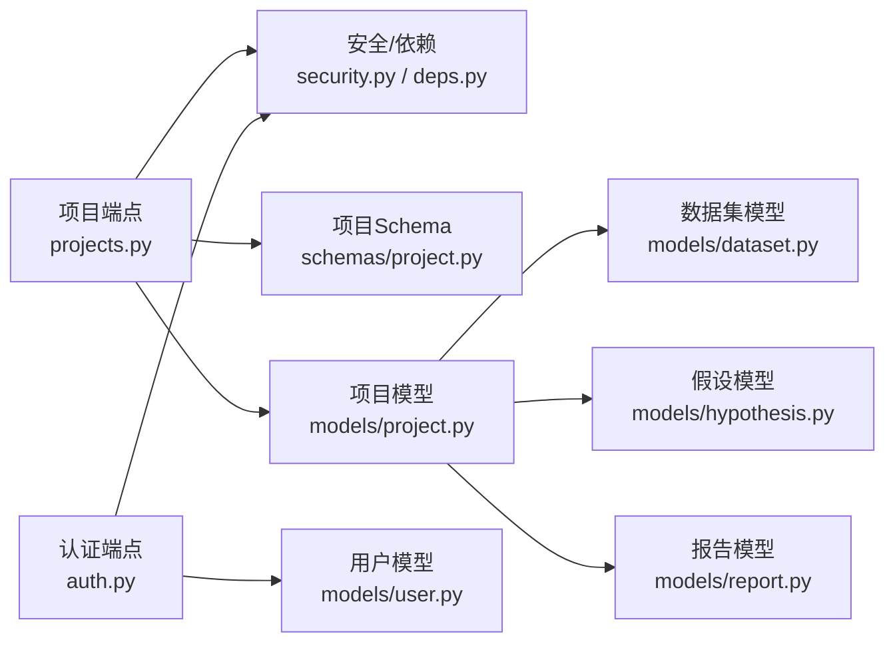

# 项目管理协作

<cite>
**本文引用的文件**   
- [projects.py](file://backend/app/api/v1/projects.py)
- [project.py](file://backend/app/models/project.py)
- [project.py](file://backend/app/schemas/project.py)
- [user.py](file://backend/app/models/user.py)
- [audit_log.py](file://backend/app/models/audit_log.py)
- [auth.py](file://backend/app/api/v1/auth.py)
- [security.py](file://backend/app/core/security.py)
- [common.py](file://backend/app/schemas/common.py)
- [deps.py](file://backend/app/core/deps.py)
- [dataset.py](file://backend/app/models/dataset.py)
- [hypothesis.py](file://backend/app/models/hypothesis.py)
- [report.py](file://backend/app/models/report.py)
- [04-api-spec.md](file://docs/design/04-api-spec.md)
- [1_📁_项目管理.py](file://frontend/pages/1_📁_项目管理.py)
- [api_client.py](file://frontend/api_client.py)
</cite>

## 目录
1. [引言](#引言)
2. [项目结构](#项目结构)
3. [核心组件](#核心组件)
4. [架构总览](#架构总览)
5. [详细组件分析](#详细组件分析)
6. [依赖关系分析](#依赖关系分析)
7. [性能考虑](#性能考虑)
8. [故障排查指南](#故障排查指南)
9. [结论](#结论)
10. [附录](#附录)

## 引言
本文件面向AI药物设计系统的项目管理协作能力，聚焦以下主题：
- 项目生命周期管理（创建、更新、归档）
- 团队成员邀请与权限分配（角色模型、访问控制）
- 项目数据共享机制（项目内数据集、假设、报告等）
- 版本控制策略（软删除、状态机）
- 项目模板与批量操作（前端交互与后端接口约定）
- 审计追踪（不可变日志）
- 项目管理API规范与最佳实践
- 权限配置示例与使用指南

## 项目结构
围绕“项目管理”的关键代码分布在后端API、数据模型、Schema定义、认证与安全、以及前端页面与客户端封装中。下图展示了与项目管理协作相关的主要模块及其关系。

图表来源
- [projects.py:1-169](file://backend/app/api/v1/projects.py#L1-L169)
- [project.py:1-42](file://backend/app/models/project.py#L1-L42)
- [project.py:1-55](file://backend/app/schemas/project.py#L1-L55)
- [user.py:1-36](file://backend/app/models/user.py#L1-L36)
- [audit_log.py:1-45](file://backend/app/models/audit_log.py#L1-L45)
- [auth.py:1-147](file://backend/app/api/v1/auth.py#L1-L147)
- [security.py:1-211](file://backend/app/core/security.py#L1-L211)
- [common.py:1-158](file://backend/app/schemas/common.py#L1-L158)
- [deps.py:1-129](file://backend/app/core/deps.py#L1-L129)
- [dataset.py:1-70](file://backend/app/models/dataset.py#L1-L70)
- [hypothesis.py:1-66](file://backend/app/models/hypothesis.py#L1-L66)
- [report.py:1-73](file://backend/app/models/report.py#L1-L73)
- [1_📁_项目管理.py:1-137](file://frontend/pages/1_📁_项目管理.py#L1-L137)
- [api_client.py:1-251](file://frontend/api_client.py#L1-L251)

章节来源
- [projects.py:1-169](file://backend/app/api/v1/projects.py#L1-L169)
- [project.py:1-42](file://backend/app/models/project.py#L1-L42)
- [project.py:1-55](file://backend/app/schemas/project.py#L1-L55)
- [user.py:1-36](file://backend/app/models/user.py#L1-L36)
- [audit_log.py:1-45](file://backend/app/models/audit_log.py#L1-L45)
- [auth.py:1-147](file://backend/app/api/v1/auth.py#L1-L147)
- [security.py:1-211](file://backend/app/core/security.py#L1-L211)
- [common.py:1-158](file://backend/app/schemas/common.py#L1-L158)
- [deps.py:1-129](file://backend/app/core/deps.py#L1-L129)
- [dataset.py:1-70](file://backend/app/models/dataset.py#L1-L70)
- [hypothesis.py:1-66](file://backend/app/models/hypothesis.py#L1-L66)
- [report.py:1-73](file://backend/app/models/report.py#L1-L73)
- [1_📁_项目管理.py:1-137](file://frontend/pages/1_📁_项目管理.py#L1-L137)
- [api_client.py:1-251](file://frontend/api_client.py#L1-L251)

## 核心组件
- 项目CRUD与软删除：提供项目的创建、查询、更新与归档（软删除），并内置基于所有者的访问控制。
- 用户与角色：支持多角色（founder/pi/researcher/doctor/engineer），用于全局权限与速率限制。
- 认证与授权：JWT access/refresh token、当前用户解析、角色守卫工厂。
- 统一响应与分页：统一的信封格式、分页元数据、错误码规范。
- 审计日志：不可变append-only记录，便于合规与回溯。
- 项目内数据实体：数据集、假设、报告等通过外键与项目关联，形成项目级数据域。

章节来源
- [projects.py:1-169](file://backend/app/api/v1/projects.py#L1-L169)
- [user.py:1-36](file://backend/app/models/user.py#L1-L36)
- [security.py:1-211](file://backend/app/core/security.py#L1-L211)
- [common.py:1-158](file://backend/app/schemas/common.py#L1-L158)
- [audit_log.py:1-45](file://backend/app/models/audit_log.py#L1-L45)
- [dataset.py:1-70](file://backend/app/models/dataset.py#L1-L70)
- [hypothesis.py:1-66](file://backend/app/models/hypothesis.py#L1-L66)
- [report.py:1-73](file://backend/app/models/report.py#L1-L73)

## 架构总览
下图展示从前端到后端的调用链路与权限校验流程，包括认证、鉴权、业务处理与数据持久化。

图表来源
- [1_📁_项目管理.py:1-137](file://frontend/pages/1_📁_项目管理.py#L1-L137)
- [api_client.py:1-251](file://frontend/api_client.py#L1-L251)
- [projects.py:1-169](file://backend/app/api/v1/projects.py#L1-L169)
- [security.py:1-211](file://backend/app/core/security.py#L1-L211)
- [deps.py:1-129](file://backend/app/core/deps.py#L1-L129)
- [project.py:1-42](file://backend/app/models/project.py#L1-L42)
- [user.py:1-36](file://backend/app/models/user.py#L1-L36)

## 详细组件分析

### 项目生命周期与权限控制
- 生命周期状态：active、archived、completed；软删除通过设置status实现，避免物理删除导致的数据丢失。
- 访问控制：非founder仅能访问自己拥有的项目；founder可访问全部。
- 关键流程：
  - 列表：按当前用户owner_id过滤，支持status筛选与分页。
  - 详情/更新/归档：先通过私有方法校验所有权，再执行相应操作。

图表来源
- [projects.py:47-84](file://backend/app/api/v1/projects.py#L47-L84)
- [common.py:75-81](file://backend/app/schemas/common.py#L75-L81)

章节来源
- [projects.py:32-44](file://backend/app/api/v1/projects.py#L32-L44)
- [projects.py:47-84](file://backend/app/api/v1/projects.py#L47-L84)
- [projects.py:87-110](file://backend/app/api/v1/projects.py#L87-L110)
- [projects.py:128-150](file://backend/app/api/v1/projects.py#L128-L150)
- [projects.py:153-168](file://backend/app/api/v1/projects.py#L153-L168)
- [project.py:14-42](file://backend/app/models/project.py#L14-L42)
- [project.py:1-55](file://backend/app/schemas/project.py#L1-L55)
- [common.py:150-151](file://backend/app/schemas/common.py#L150-L151)

### 成员角色与权限模型
- 角色定义：founder、pi、researcher、doctor、engineer。
- 权限要点：
  - founder：最高权限，可访问所有项目。
  - 其他角色：仅能访问其拥有者身份的项目。
  - 登录与会话：access_token短期、refresh_token长期，支持刷新。
  - 角色守卫：提供require_roles工厂函数，便于扩展更多资源级权限。

图表来源
- [user.py:14-36](file://backend/app/models/user.py#L14-L36)
- [project.py:14-42](file://backend/app/models/project.py#L14-L42)
- [security.py:96-122](file://backend/app/core/security.py#L96-L122)
- [security.py:155-211](file://backend/app/core/security.py#L155-L211)

章节来源
- [user.py:14-36](file://backend/app/models/user.py#L14-L36)
- [security.py:194-211](file://backend/app/core/security.py#L194-L211)
- [auth.py:70-101](file://backend/app/api/v1/auth.py#L70-L101)
- [auth.py:104-134](file://backend/app/api/v1/auth.py#L104-L134)
- [auth.py:137-147](file://backend/app/api/v1/auth.py#L137-L147)

### 项目数据共享机制
- 项目内数据实体：
  - 数据集：上传的多组学数据，包含质量报告，归属项目。
  - 假设：在项目中组织分析目标与优先级，支持合并/淘汰。
  - 报告：靶点发现结果，包含LLM成本、时长、内容摘要与结构化JSON。
- 数据可见性：遵循项目访问控制，即只有具备项目访问权限的用户才能查看其下属数据集、假设与报告。

图表来源
- [dataset.py:15-70](file://backend/app/models/dataset.py#L15-L70)
- [hypothesis.py:15-66](file://backend/app/models/hypothesis.py#L15-L66)
- [report.py:15-73](file://backend/app/models/report.py#L15-L73)
- [project.py:14-42](file://backend/app/models/project.py#L14-L42)

章节来源
- [dataset.py:15-70](file://backend/app/models/dataset.py#L15-L70)
- [hypothesis.py:15-66](file://backend/app/models/hypothesis.py#L15-L66)
- [report.py:15-73](file://backend/app/models/report.py#L15-L73)

### 版本控制策略
- 软删除：项目归档通过设置status为archived实现，保留历史数据与关联关系。
- 状态机：项目状态受Schema校验约束，确保只允许合法转换。
- 建议：对关键变更（如owner变更、状态迁移）增加审计日志条目，便于追溯。

章节来源
- [projects.py:153-168](file://backend/app/api/v1/projects.py#L153-L168)
- [project.py:27-30](file://backend/app/models/project.py#L27-L30)
- [project.py:33-38](file://backend/app/models/project.py#L33-L38)
- [project.py:33-38](file://backend/app/schemas/project.py#L33-L38)

### 项目模板与批量操作
- 模板：可通过metadata字段存储项目模板信息（如默认疾病类型、患者匿名标识、初始假设等），在创建时复用。
- 批量操作：当前未提供专用批量端点，可在前端通过循环调用单个端点实现；建议在后续版本引入批量创建/更新接口以提升效率。

章节来源
- [project.py:30](file://backend/app/models/project.py#L30)
- [project.py:20-21](file://backend/app/schemas/project.py#L20-L21)
- [projects.py:87-110](file://backend/app/api/v1/projects.py#L87-L110)

### 审计追踪功能
- 审计日志模型：不可变append-only，记录action、resource_type、resource_id、before/after值、IP与UA等。
- 建议集成：在项目关键操作（创建、更新、归档）处写入审计日志，结合管理员端点查询。

章节来源
- [audit_log.py:15-45](file://backend/app/models/audit_log.py#L15-L45)
- [04-api-spec.md:597-602](file://docs/design/04-api-spec.md#L597-L602)

### 项目管理API接口规范
- 基础URL：/api/v1
- 认证：除注册/登录/健康检查外，均需Bearer Token。
- 统一信封：{success, data, meta}；错误信封：{success:false, error:{code,message,details}, meta}。
- 分页：page、page_size、total、total_pages。
- 项目端点：
  - GET /projects：列出可访问项目，支持status过滤与分页。
  - POST /projects：创建项目。
  - GET /projects/{id}：获取详情。
  - PATCH /projects/{id}：更新项目。
  - DELETE /projects/{id}：归档（软删除）。

章节来源
- [04-api-spec.md:9-91](file://docs/design/04-api-spec.md#L9-L91)
- [04-api-spec.md:150-175](file://docs/design/04-api-spec.md#L150-L175)
- [common.py:63-81](file://backend/app/schemas/common.py#L63-L81)
- [projects.py:47-84](file://backend/app/api/v1/projects.py#L47-L84)
- [projects.py:87-110](file://backend/app/api/v1/projects.py#L87-L110)
- [projects.py:113-125](file://backend/app/api/v1/projects.py#L113-L125)
- [projects.py:128-150](file://backend/app/api/v1/projects.py#L128-L150)
- [projects.py:153-168](file://backend/app/api/v1/projects.py#L153-L168)

### 团队协作最佳实践
- 明确角色边界：founder负责项目治理与最终决策；pi主导科学方向；researcher执行分析；doctor提供临床视角；engineer负责运维与数据管道。
- 数据共享原则：以项目为边界，最小权限访问；敏感信息通过patient_pseudonym与metadata脱敏。
- 工作流建议：
  - 创建项目并填写模板信息（疾病类型、匿名标识、初始假设）。
  - 上传数据集并触发预处理，产出质量报告。
  - 在假设下运行分析，生成报告并评估证据等级。
  - 定期归档已完成项目，保留历史以便审计。

[本节为概念性指导，不直接分析具体文件]

### 权限配置示例
- 登录与获取用户信息：
  - POST /auth/login：返回access_token与refresh_token。
  - GET /auth/me：返回当前用户公开信息。
- 刷新令牌：
  - POST /auth/refresh：使用refresh_token换取新的access_token。
- 角色守卫：
  - 使用require_roles("founder","pi")保护高权限端点。

章节来源
- [auth.py:70-101](file://backend/app/api/v1/auth.py#L70-L101)
- [auth.py:104-134](file://backend/app/api/v1/auth.py#L104-L134)
- [auth.py:137-147](file://backend/app/api/v1/auth.py#L137-L147)
- [security.py:194-211](file://backend/app/core/security.py#L194-L211)

### 前端协作界面与客户端
- 项目管理页面：提供创建表单、项目列表、激活/暂停/归档操作，自动刷新缓存。
- API客户端：统一错误处理、JWT注入、响应信封解包、连接池复用、请求级缓存。

章节来源
- [1_📁_项目管理.py:27-62](file://frontend/pages/1_📁_项目管理.py#L27-L62)
- [1_📁_项目管理.py:64-130](file://frontend/pages/1_📁_项目管理.py#L64-L130)
- [api_client.py:42-94](file://frontend/api_client.py#L42-L94)
- [api_client.py:186-236](file://frontend/api_client.py#L186-L236)

## 依赖关系分析
- 耦合与内聚：
  - 项目端点强依赖安全与依赖注入模块，保证认证与分页一致性。
  - 模型层通过外键建立项目与数据集、假设、报告的强关联，提升内聚性。
- 外部依赖：
  - JWT库、bcrypt、Pydantic、SQLAlchemy异步会话。
- 潜在循环依赖：
  - 模型间存在双向关系声明，但通过字符串引用避免运行时循环导入。

图表来源
- [projects.py:1-169](file://backend/app/api/v1/projects.py#L1-L169)
- [security.py:1-211](file://backend/app/core/security.py#L1-L211)
- [deps.py:1-129](file://backend/app/core/deps.py#L1-L129)
- [project.py:1-55](file://backend/app/schemas/project.py#L1-L55)
- [project.py:1-42](file://backend/app/models/project.py#L1-L42)
- [dataset.py:1-70](file://backend/app/models/dataset.py#L1-L70)
- [hypothesis.py:1-66](file://backend/app/models/hypothesis.py#L1-L66)
- [report.py:1-73](file://backend/app/models/report.py#L1-L73)
- [auth.py:1-147](file://backend/app/api/v1/auth.py#L1-L147)
- [user.py:1-36](file://backend/app/models/user.py#L1-L36)

章节来源
- [projects.py:1-169](file://backend/app/api/v1/projects.py#L1-L169)
- [security.py:1-211](file://backend/app/core/security.py#L1-L211)
- [deps.py:1-129](file://backend/app/core/deps.py#L1-L129)
- [project.py:1-55](file://backend/app/schemas/project.py#L1-L55)
- [project.py:1-42](file://backend/app/models/project.py#L1-L42)
- [dataset.py:1-70](file://backend/app/models/dataset.py#L1-L70)
- [hypothesis.py:1-66](file://backend/app/models/hypothesis.py#L1-L66)
- [report.py:1-73](file://backend/app/models/report.py#L1-L73)
- [auth.py:1-147](file://backend/app/api/v1/auth.py#L1-L147)
- [user.py:1-36](file://backend/app/models/user.py#L1-L36)

## 性能考虑
- 用户对象短TTL内存缓存：减少频繁数据库查询，提高并发性能。
- 前端请求级缓存：通过时间桶机制实现可配置的TTL，降低重复请求压力。
- 连接池复用：httpx.Client全局复用，减少握手开销。
- 分页与索引：项目列表分页与数据库索引优化查询性能。

章节来源
- [deps.py:26-53](file://backend/app/core/deps.py#L26-L53)
- [api_client.py:24-39](file://frontend/api_client.py#L24-L39)
- [api_client.py:186-236](file://frontend/api_client.py#L186-L236)
- [projects.py:66-72](file://backend/app/api/v1/projects.py#L66-L72)

## 故障排查指南
- 常见错误码：
  - VALIDATION_ERROR：参数校验失败，检查请求体字段与长度限制。
  - UNAUTHORIZED：缺少或无效token，确认Authorization头与token有效期。
  - FORBIDDEN：权限不足，确认当前用户角色与项目owner关系。
  - NOT_FOUND：资源不存在，检查项目ID是否正确。
  - CONFLICT：资源冲突（如邮箱重复），检查唯一约束。
  - INTERNAL_ERROR：服务器内部错误，查看服务端日志。
- 定位步骤：
  - 使用meta.request_id在服务端日志中检索对应请求。
  - 核对前后端字段命名（snake_case/camelCase）与枚举值。
  - 检查用户is_active状态与token类型（access vs refresh）。

章节来源
- [04-api-spec.md:66-91](file://docs/design/04-api-spec.md#L66-L91)
- [exceptions.py:131-178](file://backend/app/core/exceptions.py#L131-L178)
- [auth.py:70-101](file://backend/app/api/v1/auth.py#L70-L101)
- [projects.py:32-44](file://backend/app/api/v1/projects.py#L32-L44)

## 结论
本项目在项目管理协作方面提供了清晰的权限模型、稳健的认证与授权机制、完整的项目生命周期管理与审计追踪能力。通过统一API规范与前端封装，团队可以高效开展跨角色协作。建议后续增强批量操作与更细粒度的资源级权限控制，以满足更大规模团队的复杂需求。

[本节为总结性内容，不直接分析具体文件]

## 附录
- 快速上手清单：
  - 注册/登录：POST /auth/register、POST /auth/login
  - 获取当前用户：GET /auth/me
  - 创建项目：POST /projects
  - 列出项目：GET /projects?page=1&page_size=20&status=active
  - 更新项目：PATCH /projects/{id}
  - 归档项目：DELETE /projects/{id}
- 前端操作提示：
  - 项目管理页面支持创建、激活、暂停、归档等操作，并在成功后刷新缓存。

章节来源
- [auth.py:41-67](file://backend/app/api/v1/auth.py#L41-L67)
- [auth.py:70-101](file://backend/app/api/v1/auth.py#L70-L101)
- [auth.py:137-147](file://backend/app/api/v1/auth.py#L137-L147)
- [projects.py:87-110](file://backend/app/api/v1/projects.py#L87-L110)
- [projects.py:47-84](file://backend/app/api/v1/projects.py#L47-L84)
- [projects.py:128-150](file://backend/app/api/v1/projects.py#L128-L150)
- [projects.py:153-168](file://backend/app/api/v1/projects.py#L153-L168)
- [1_📁_项目管理.py:27-62](file://frontend/pages/1_📁_项目管理.py#L27-L62)
- [1_📁_项目管理.py:64-130](file://frontend/pages/1_📁_项目管理.py#L64-L130)