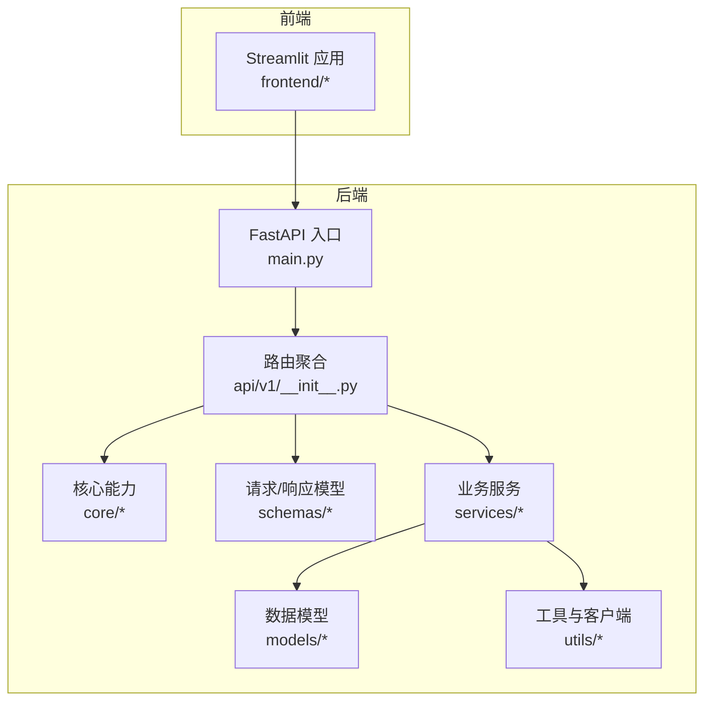
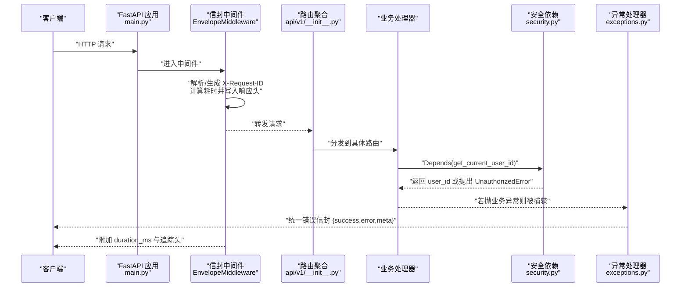
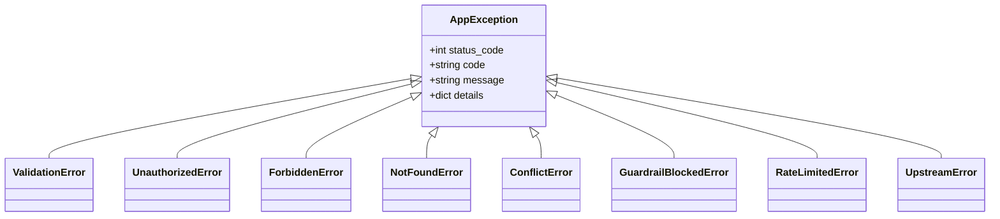
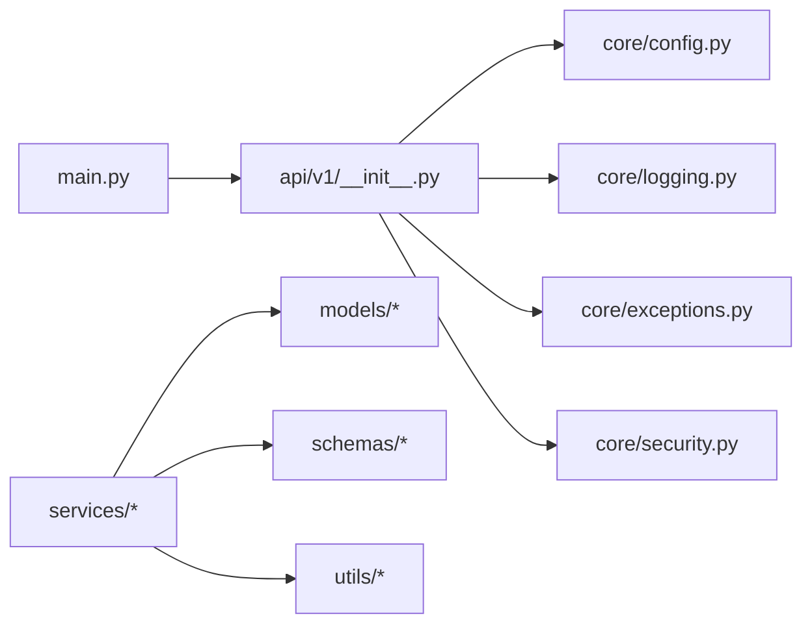

# 代码规范与质量

<cite>
**本文引用的文件**   
- [pyproject.toml](file://pyproject.toml)
- [backend/app/main.py](file://backend/app/main.py)
- [backend/app/core/config.py](file://backend/app/core/config.py)
- [backend/app/core/logging.py](file://backend/app/core/logging.py)
- [backend/app/core/exceptions.py](file://backend/app/core/exceptions.py)
- [backend/app/core/security.py](file://backend/app/core/security.py)
- [backend/app/api/v1/__init__.py](file://backend/app/api/v1/__init__.py)
- [backend/app/models/user.py](file://backend/app/models/user.py)
- [backend/app/schemas/auth.py](file://backend/app/schemas/auth.py)
- [backend/app/schemas/common.py](file://backend/app/schemas/common.py)
- [tests/conftest.py](file://tests/conftest.py)
</cite>

## 目录
1. [引言](#引言)
2. [项目结构](#项目结构)
3. [核心组件](#核心组件)
4. [架构总览](#架构总览)
5. [详细组件分析](#详细组件分析)
6. [依赖分析](#依赖分析)
7. [性能考虑](#性能考虑)
8. [故障排查指南](#故障排查指南)
9. [结论](#结论)
10. [附录](#附录)

## 引言
本文件为 AI 药物设计系统制定全面的代码规范与质量管理标准，覆盖 Python 代码风格、命名约定、文件组织；ruff 检查与格式化配置及使用；mypy 类型检查配置与实践；函数/类/模块注释与类型注解规范；错误处理模式、日志记录与安全编码实践；并提供代码审查清单与质量门禁标准。所有规范均基于仓库现有实现与配置进行提炼与扩展，确保可落地执行。

## 项目结构
后端采用 FastAPI + SQLAlchemy + Pydantic v2 的分层架构：
- API 路由层：按领域划分在 backend/app/api/v1 下聚合
- 核心能力：配置、异常、安全、日志等位于 backend/app/core
- 数据模型与 Schema：ORM 模型在 models，Pydantic 请求/响应在 schemas
- 业务服务：services 下按子域组织（analyzer/knowledge/llm/optimizer/parser/privacy/report/workflow）
- 工具与客户端：utils 提供通用 HTTP/S3 等能力
- 前端：Streamlit 应用位于 frontend
- 测试与脚本：tests 与 scripts 分别承载用例与运维脚本

图表来源
- [backend/app/main.py:187-248](file://backend/app/main.py#L187-L248)
- [backend/app/api/v1/__init__.py:24-40](file://backend/app/api/v1/__init__.py#L24-L40)

章节来源
- [backend/app/main.py:1-248](file://backend/app/main.py#L1-L248)
- [backend/app/api/v1/__init__.py:1-41](file://backend/app/api/v1/__init__.py#L1-L41)

## 核心组件
- 应用工厂与中间件：统一信封响应、CORS、全局异常处理器注册、健康与文档端点
- 配置中心：基于 pydantic-settings 的环境变量加载与校验，单例缓存
- 日志系统：loguru 结构化输出、轮转归档、开发/生产差异化格式
- 异常体系：AppException 基类及具体业务异常，统一错误信封
- 认证与安全：bcrypt 密码哈希、JWT access/refresh token、角色守卫
- 数据契约：Pydantic CamelModel 支持 snake_case/camelCase 双向兼容，统一分页与元数据

章节来源
- [backend/app/main.py:187-248](file://backend/app/main.py#L187-L248)
- [backend/app/core/config.py:21-144](file://backend/app/core/config.py#L21-L144)
- [backend/app/core/logging.py:20-93](file://backend/app/core/logging.py#L20-L93)
- [backend/app/core/exceptions.py:19-179](file://backend/app/core/exceptions.py#L19-L179)
- [backend/app/core/security.py:32-211](file://backend/app/core/security.py#L32-L211)
- [backend/app/schemas/common.py:21-158](file://backend/app/schemas/common.py#L21-L158)

## 架构总览
下图展示一次受保护的 API 调用从进入 FastAPI 到返回统一信封的完整流程，包含中间件注入追踪头、异常处理器转换、以及安全鉴权依赖。

图表来源
- [backend/app/main.py:29-185](file://backend/app/main.py#L29-L185)
- [backend/app/api/v1/__init__.py:24-40](file://backend/app/api/v1/__init__.py#L24-L40)
- [backend/app/core/security.py:155-191](file://backend/app/core/security.py#L155-L191)
- [backend/app/core/exceptions.py:131-179](file://backend/app/core/exceptions.py#L131-L179)

## 详细组件分析

### 代码风格与命名约定
- 行宽与格式化
  - 使用 ruff format，双引号、空格缩进，行长由格式化器处理
  - 参考配置位置：[pyproject.toml:40-42](file://pyproject.toml#L40-L42)
- 规则集与忽略项
  - 启用 pycodestyle/pyflakes/isort/flake8-bugbear/comprehensions/pyupgrade/naming/simplify 等规则
  - 针对测试、前端入口、脚本、SQLAlchemy 基类、第三方库大写模块名等进行 per-file ignores
  - 参考配置位置：[pyproject.toml:19-52](file://pyproject.toml#L19-L52)
- 命名约定
  - 模块/包：小写下划线
  - 类：大驼峰
  - 函数/方法/变量：小写下划线
  - 常量：大写下划线
  - 对第三方库模块名（如 RDKit、BioPython）允许大写以遵循其约定，已在 per-file-ignores 中豁免
- 导入顺序
  - isort 自动排序，保持标准库/第三方/本地分组清晰
- 示例参考
  - 路由聚合与标签化：[backend/app/api/v1/__init__.py:24-40](file://backend/app/api/v1/__init__.py#L24-L40)
  - 配置字段命名与环境映射：[backend/app/core/config.py:21-133](file://backend/app/core/config.py#L21-L133)

章节来源
- [pyproject.toml:14-52](file://pyproject.toml#L14-L52)
- [backend/app/api/v1/__init__.py:24-40](file://backend/app/api/v1/__init__.py#L24-L40)
- [backend/app/core/config.py:21-133](file://backend/app/core/config.py#L21-L133)

### Ruff 检查与格式化
- 安装与运行
  - 检查：ruff check .
  - 修复：ruff check --fix .
  - 格式化：ruff format .
- 规则选择与忽略
  - 已启用 E/W/F/I/B/C4/UP/N/SIM 系列规则
  - 忽略项包括 E501（交由格式化）、B008（FastAPI Depends 合法用法）、N818（业务异常后缀）、SIM102/108/117（Streamlit 限制）
  - 针对 tests/frontend/scripts/db/base.py/health.py/molecule_designer.py/fasta_parser.py 的 per-file-ignores
- CI 集成建议
  - 在 PR 阶段执行 ruff check --diff 与 ruff format --check
  - 失败即阻断合并，保证风格一致性
- 参考配置
  - [pyproject.toml:14-52](file://pyproject.toml#L14-L52)

章节来源
- [pyproject.toml:14-52](file://pyproject.toml#L14-L52)

### MyPy 类型检查
- 版本与严格度
  - python_version=3.11，strict=false，warn_return_any=true，逐步收紧 disallow_untyped_defs
  - ignore_missing_imports=true 以兼容无 stub 的第三方库
- 排除目录
  - notebooks/nextflow/models 不参与类型检查
- 最佳实践
  - 优先为公共接口与关键路径添加类型注解
  - 使用 typing 模块中的 Optional/Union/TypeVar/Generic 表达复杂类型
  - 逐步将 disallow_untyped_defs 设为 true，配合 mypy 报告驱动重构
- 参考配置
  - [pyproject.toml:54-61](file://pyproject.toml#L54-L61)

章节来源
- [pyproject.toml:54-61](file://pyproject.toml#L54-L61)

### 注释与类型注解规范
- 模块级 docstring
  - 说明职责、外部依赖、环境变量、注意事项
  - 参考：[backend/app/core/config.py:1-10](file://backend/app/core/config.py#L1-10)、[backend/app/core/logging.py:1-8](file://backend/app/core/logging.py#L1-8)
- 类级 docstring
  - 描述用途、属性、行为约束、枚举取值范围
  - 参考：[backend/app/models/user.py:14-23](file://backend/app/models/user.py#L14-L23)
- 函数/方法 docstring
  - 使用 Args/Returns/Raises 三段式，明确参数含义、返回值与异常
  - 参考：[backend/app/core/security.py:32-58](file://backend/app/core/security.py#L32-L58)、[backend/app/core/logging.py:77-88](file://backend/app/core/logging.py#L77-L88)
- 类型注解
  - 函数签名与变量声明尽量标注类型，避免 Any 滥用
  - 参考：[backend/app/core/security.py:64-93](file://backend/app/core/security.py#L64-L93)

章节来源
- [backend/app/core/config.py:1-10](file://backend/app/core/config.py#L1-10)
- [backend/app/core/logging.py:1-8](file://backend/app/core/logging.py#L1-8)
- [backend/app/models/user.py:14-23](file://backend/app/models/user.py#L14-L23)
- [backend/app/core/security.py:32-58](file://backend/app/core/security.py#L32-L58)
- [backend/app/core/logging.py:77-88](file://backend/app/core/logging.py#L77-L88)
- [backend/app/core/security.py:64-93](file://backend/app/core/security.py#L64-L93)

### 错误处理模式
- 业务异常继承 AppException，携带 code/status_code/message/details
- 全局异常处理器将 AppException 转换为统一错误信封，并记录不同级别日志
- 未捕获异常兜底为 INTERNAL_ERROR，附带 request_id
- 参考实现
  - 异常定义与处理器：[backend/app/core/exceptions.py:19-179](file://backend/app/core/exceptions.py#L19-L179)
  - 应用启动时注册处理器：[backend/app/main.py:229-230](file://backend/app/main.py#L229-L230)

图表来源
- [backend/app/core/exceptions.py:19-94](file://backend/app/core/exceptions.py#L19-L94)

章节来源
- [backend/app/core/exceptions.py:19-179](file://backend/app/core/exceptions.py#L19-L179)
- [backend/app/main.py:229-230](file://backend/app/main.py#L229-L230)

### 日志记录规范
- 初始化时机：应用启动最早阶段调用 setup_logging
- 输出策略：生产 JSON 序列化，开发彩色控制台；文件按大小/时间轮转，错误单独归档
- 上下文绑定：通过 get_logger(name=__name__) 绑定模块名；中间件注入 request_id 便于链路追踪
- 参考实现
  - 初始化与输出：[backend/app/core/logging.py:20-74](file://backend/app/core/logging.py#L20-L74)
  - 获取带模块名的 logger：[backend/app/core/logging.py:77-88](file://backend/app/core/logging.py#L77-L88)
  - 中间件写入耗时与追踪头：[backend/app/main.py:29-185](file://backend/app/main.py#L29-L185)

章节来源
- [backend/app/core/logging.py:20-88](file://backend/app/core/logging.py#L20-L88)
- [backend/app/main.py:29-185](file://backend/app/main.py#L29-L185)

### 安全编码实践
- 密码哈希：bcrypt 生成盐与哈希，验证使用恒定时间比较
- JWT：access/refresh token 生成与解码，过期时间与算法来自配置
- 依赖注入：get_current_user_id/get_current_user_role 作为 FastAPI 依赖，require_roles 工厂实现角色守卫
- 敏感信息：密钥与 URL 通过 Settings 管理，禁止硬编码
- 参考实现
  - 密码与 JWT：[backend/app/core/security.py:32-149](file://backend/app/core/security.py#L32-L149)
  - 依赖与角色守卫：[backend/app/core/security.py:155-211](file://backend/app/core/security.py#L155-L211)
  - 配置读取：[backend/app/core/config.py:21-133](file://backend/app/core/config.py#L21-L133)

章节来源
- [backend/app/core/security.py:32-211](file://backend/app/core/security.py#L32-L211)
- [backend/app/core/config.py:21-133](file://backend/app/core/config.py#L21-L133)

### 数据契约与统一信封
- 统一响应信封：ApiResponse/PagedResponse/ErrorResponse，含 meta 元数据（request_id/duration_ms）
- 分页元数据：PageMeta/PagedMeta，约束 page/page_size/total/total_pages
- 通用基类：CamelModel 支持 snake_case/camelCase 双向兼容
- 参考实现
  - 信封与元数据：[backend/app/schemas/common.py:35-89](file://backend/app/schemas/common.py#L35-L89)
  - 认证相关 Schema：[backend/app/schemas/auth.py:13-61](file://backend/app/schemas/auth.py#L13-L61)

章节来源
- [backend/app/schemas/common.py:35-89](file://backend/app/schemas/common.py#L35-L89)
- [backend/app/schemas/auth.py:13-61](file://backend/app/schemas/auth.py#L13-L61)

## 依赖分析
- 模块耦合
  - main.py 负责创建应用、注册中间件与异常处理器、挂载路由
  - api/v1/__init__.py 聚合各子域路由，按前缀与标签组织
  - core/* 提供共享能力，被 API 与服务广泛依赖
  - services/* 依赖 models/schemas/utils，面向业务编排
- 外部依赖
  - FastAPI/Starlette、Pydantic v2、SQLAlchemy、loguru、bcrypt、python-jose、pydantic-settings
- 潜在风险
  - 路由聚合集中引入较多模块，注意按需懒加载以避免冷启动开销
  - 中间件全量缓冲响应体，需关注大响应场景内存占用

图表来源
- [backend/app/main.py:187-248](file://backend/app/main.py#L187-L248)
- [backend/app/api/v1/__init__.py:24-40](file://backend/app/api/v1/__init__.py#L24-L40)

章节来源
- [backend/app/main.py:187-248](file://backend/app/main.py#L187-L248)
- [backend/app/api/v1/__init__.py:24-40](file://backend/app/api/v1/__init__.py#L24-L40)

## 性能考虑
- 中间件信封模式会缓冲响应体，建议在流式响应场景谨慎使用或优化分片逻辑
- 日志轮转与压缩可减少磁盘压力，但需注意 I/O 开销
- 配置单例使用 lru_cache，避免重复读取 .env
- 覆盖率目标与报告：pytest 默认要求覆盖率不低于 75%，报告输出至 htmlcov

章节来源
- [backend/app/main.py:29-185](file://backend/app/main.py#L29-L185)
- [backend/app/core/logging.py:54-74](file://backend/app/core/logging.py#L54-L74)
- [backend/app/core/config.py:136-144](file://backend/app/core/config.py#L136-L144)
- [pyproject.toml:63-78](file://pyproject.toml#L63-L78)

## 故障排查指南
- 常见问题定位
  - 请求无追踪 ID：确认 EnvelopeMiddleware 是否生效，检查 X-Request-ID 是否回写
  - 响应缺少 duration_ms：确认响应为 200 且 application/json，且包含 meta 字段
  - 认证失败：检查 Authorization header 与 token 类型是否为 access
  - 权限不足：确认 require_roles 配置的角色集合与当前用户角色
  - 日志缺失：确认 setup_logging 在应用启动早期调用，查看 logs 目录轮转文件
- 参考实现
  - 中间件逻辑：[backend/app/main.py:29-185](file://backend/app/main.py#L29-L185)
  - 认证依赖：[backend/app/core/security.py:155-191](file://backend/app/core/security.py#L155-L191)
  - 异常处理器：[backend/app/core/exceptions.py:131-179](file://backend/app/core/exceptions.py#L131-L179)
  - 日志初始化：[backend/app/core/logging.py:20-74](file://backend/app/core/logging.py#L20-L74)

章节来源
- [backend/app/main.py:29-185](file://backend/app/main.py#L29-L185)
- [backend/app/core/security.py:155-191](file://backend/app/core/security.py#L155-L191)
- [backend/app/core/exceptions.py:131-179](file://backend/app/core/exceptions.py#L131-L179)
- [backend/app/core/logging.py:20-74](file://backend/app/core/logging.py#L20-L74)

## 结论
本规范以仓库现有实现为基础，明确了代码风格、类型检查、注释与类型注解、错误处理、日志与安全编码的最佳实践，并通过 ruff/mypy/pytest/coverage 形成闭环的质量保障。建议将上述规则纳入 CI 门禁，持续度量与改进代码质量。

## 附录

### 代码审查清单
- 风格与格式
  - 已通过 ruff check/format 检查，无新增违规
- 类型与注解
  - 关键接口具备类型注解，避免 Any 滥用
- 文档与注释
  - 模块/类/函数具备必要 docstring，参数与返回值清晰
- 错误处理
  - 业务异常使用 AppException 子类，统一错误信封
- 日志
  - 关键路径有结构化日志，包含 request_id 与耗时
- 安全
  - 敏感配置通过 Settings 管理，密码使用 bcrypt，JWT 校验完备
- 测试与覆盖率
  - 新增/修改逻辑具备单元测试，覆盖率达标

### 质量门禁标准
- 静态检查
  - ruff check 必须通过
  - ruff format --check 必须通过
  - mypy 不新增警告（或按团队阈值放行）
- 测试
  - pytest 全部通过，覆盖率不低于 75%
- 构建与部署
  - 依赖锁定（requirements/environment.yml），启动脚本可复现

章节来源
- [pyproject.toml:63-105](file://pyproject.toml#L63-L105)
- [tests/conftest.py:1-85](file://tests/conftest.py#L1-L85)