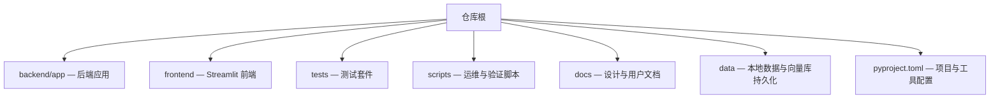
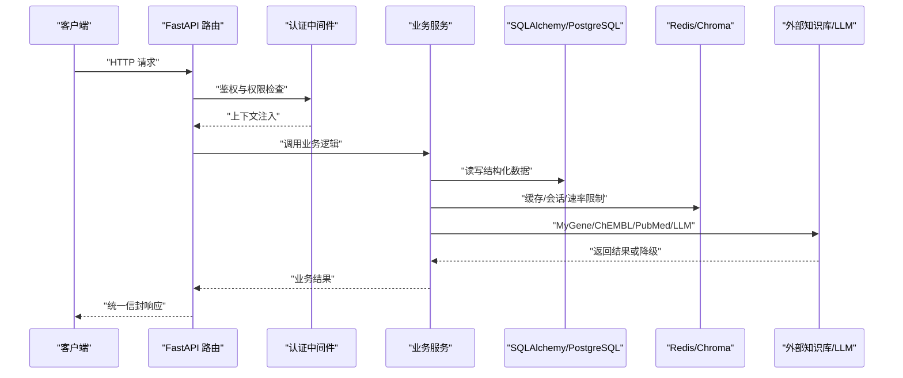
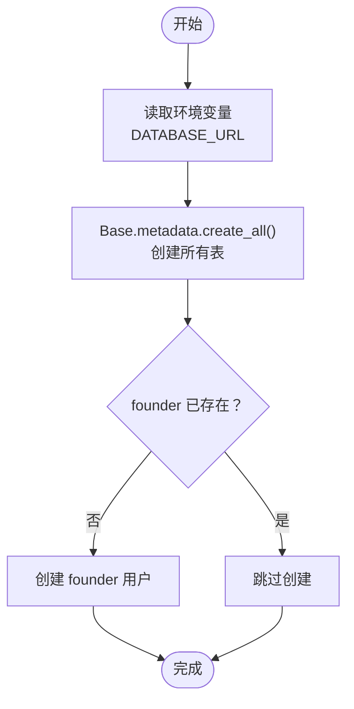
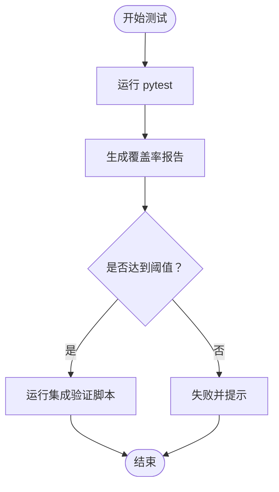
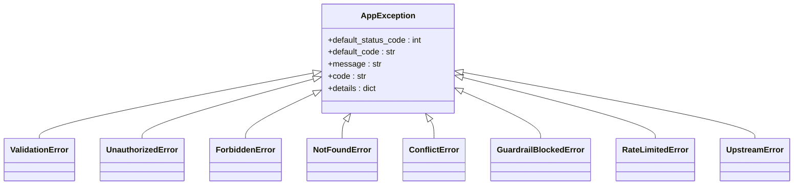
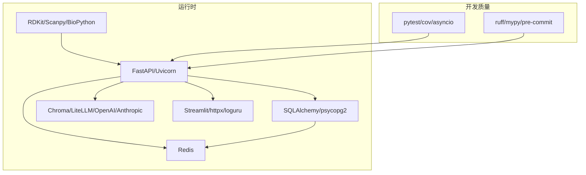

# 开发工作流程

<cite>
**本文引用的文件**   
- [README.md](file://precision-drug-design/README.md)
- [DEVELOPMENT.md](file://precision-drug-design/docs/DEVELOPMENT.md)
- [pyproject.toml](file://precision-drug-design/pyproject.toml)
- [recreate_db.py](file://precision-drug-design/scripts/recreate_db.py)
- [init_db.py](file://precision-drug-design/backend/app/db/init_db.py)
- [config.py](file://precision-drug-design/backend/app/core/config.py)
- [conftest.py](file://precision-drug-design/tests/conftest.py)
- [test_integration.py](file://precision-drug-design/scripts/test_integration.py)
- [test_p0_endpoints.py](file://precision-drug-design/scripts/test_p0_endpoints.py)
- [database.md](file://precision-drug-design/docs/design/03-database.md)
- [exceptions.py](file://precision-drug-design/backend/app/core/exceptions.py)
</cite>

## 目录
1. [引言](#引言)
2. [项目结构](#项目结构)
3. [核心组件](#核心组件)
4. [架构总览](#架构总览)
5. [详细组件分析](#详细组件分析)
6. [依赖关系分析](#依赖关系分析)
7. [性能与质量要求](#性能与质量要求)
8. [故障排查指南](#故障排查指南)
9. [结论](#结论)
10. [附录：团队规范与入职流程](#附录团队规范与入职流程)

## 引言
本文件为 AI 药物设计系统制定标准化的开发工作流程，覆盖 Git 分支管理、提交信息规范、代码合并流程；数据库迁移与版本管理（含 recreate_db.py 初始化与管理）；测试驱动开发实践（单元测试、集成测试、覆盖率要求）；代码审查与发布流程；版本管理策略；以及团队协作、知识沉淀与新成员入职流程。文档内容严格基于仓库现有配置与脚本进行提炼与规范化说明。

## 项目结构
仓库采用前后端分离与多子系统组织方式：后端 FastAPI + SQLAlchemy，前端 Streamlit，测试集中于 tests 目录，脚本工具位于 scripts，设计与用户文档在 docs。

**图表来源** 
- [README.md:190-235](file://precision-drug-design/README.md#L190-L235)
- [pyproject.toml:63-83](file://precision-drug-design/pyproject.toml#L63-L83)

**章节来源**
- [README.md:190-235](file://precision-drug-design/README.md#L190-L235)

## 核心组件
- 配置中心：基于 pydantic-settings 的环境变量加载与校验，统一通过 get_settings() 获取单例。
- 异常体系：自定义 AppException 及全局处理器，统一错误信封格式。
- 数据库初始化：提供 init_db.py 与 recreate_db.py 两种初始化路径，支持创建表与初始 founder 用户。
- 测试框架：pytest + pytest-cov + pytest-asyncio，默认开启覆盖率报告与最低阈值。
- 集成验证：提供 test_integration.py 与 test_p0_endpoints.py 等端到端验证脚本。

**章节来源**
- [config.py:1-144](file://precision-drug-design/backend/app/core/config.py#L1-L144)
- [exceptions.py:1-179](file://precision-drug-design/backend/app/core/exceptions.py#L1-L179)
- [init_db.py:1-88](file://precision-drug-design/backend/app/db/init_db.py#L1-L88)
- [recreate_db.py:1-68](file://precision-drug-design/scripts/recreate_db.py#L1-L68)
- [pyproject.toml:63-83](file://precision-drug-design/pyproject.toml#L63-L83)

## 架构总览
下图展示从请求到响应的主干链路，包括认证、路由、服务层、数据库与外部知识库调用，以及统一异常处理与响应信封。

**图表来源** 
- [README.md:239-296](file://precision-drug-design/README.md#L239-L296)
- [exceptions.py:131-179](file://precision-drug-design/backend/app/core/exceptions.py#L131-L179)

## 详细组件分析

### Git 分支管理与提交规范
- 分支模型
  - main：稳定发布分支
  - develop：开发集成分支
  - feature/*：功能分支
  - fix/*：修复分支
  - release/*：发布准备分支
- 工作流
  - 从 develop 拉取 feature/* 分支开发
  - 完成后发起 PR 至 develop，经代码审查通过后合并
  - develop 定期合并至 main 进行发布
- 提交信息规范
  - 格式：<type>(<scope>): <subject>
  - 类型：feat / fix / docs / style / refactor / test / chore
  - 建议包含变更原因与影响范围，必要时关联 Issue 编号

**章节来源**
- [DEVELOPMENT.md:205-260](file://precision-drug-design/docs/DEVELOPMENT.md#L205-L260)
- [README.md:323-340](file://precision-drug-design/README.md#L323-L340)

### 代码合并流程与代码审查
- 合并前要求
  - 通过 ruff 检查与格式化
  - 通过全部单元测试与必要的集成测试
  - 满足最低覆盖率要求
- 审查要点
  - 接口契约与错误码一致性
  - 安全与权限控制（RBAC、JWT）
  - 外部依赖调用与降级策略
  - 日志与可观测性（request_id、duration_ms）
- 合并后动作
  - 更新 CHANGELOG（如有）
  - 触发 CI 构建与部署流水线（按环境）

[本节为通用流程说明，不直接分析具体文件]

### 数据库迁移与版本管理
- 当前实现
  - 使用 Base.metadata.create_all() 创建表结构
  - 提供两个入口：
    - backend/app/db/init_db.py：异步引擎创建表并初始化 founder
    - scripts/recreate_db.py：同步引擎创建表并初始化 founder（便于快速重建）
- 推荐演进
  - 生产环境引入 Alembic 管理迁移，确保可回滚与可审计
  - 迁移文件集中管理，命名遵循语义化描述
- 初始化步骤
  - 设置 DATABASE_URL 指向目标数据库
  - 运行初始化脚本以创建表与初始用户
  - 验证表结构与基础数据

**图表来源** 
- [init_db.py:35-88](file://precision-drug-design/backend/app/db/init_db.py#L35-L88)
- [recreate_db.py:33-68](file://precision-drug-design/scripts/recreate_db.py#L33-L68)

**章节来源**
- [init_db.py:1-88](file://precision-drug-design/backend/app/db/init_db.py#L1-L88)
- [recreate_db.py:1-68](file://precision-drug-design/scripts/recreate_db.py#L1-L68)
- [database.md:309-325](file://precision-drug-design/docs/design/03-database.md#L309-L325)

### 测试驱动开发实践
- 测试框架与命令
  - pytest + pytest-asyncio + pytest-cov
  - 默认启用覆盖率报告与 HTML 输出
  - 最低覆盖率阈值：75%（pyproject），建议 ≥80%（README）
- 测试分类
  - 单元测试：针对模块与服务逻辑
  - 集成测试：前后端联调与外部服务交互
  - 标记策略：slow、integration、gpu
- 执行方式
  - 全量测试：python -m pytest
  - 带覆盖率：python -m pytest --cov=backend/app --cov-report=html
  - 跳过慢测：python -m pytest -m "not slow"
  - 集成验证：python scripts/test_integration.py
  - P0 深化端点验证：python scripts/test_p0_endpoints.py

**图表来源** 
- [pyproject.toml:63-83](file://precision-drug-design/pyproject.toml#L63-L83)
- [README.md:342-373](file://precision-drug-design/README.md#L342-L373)

**章节来源**
- [pyproject.toml:63-83](file://precision-drug-design/pyproject.toml#L63-L83)
- [README.md:342-373](file://precision-drug-design/README.md#L342-L373)
- [test_integration.py:1-165](file://precision-drug-design/scripts/test_integration.py#L1-L165)
- [test_p0_endpoints.py:1-234](file://precision-drug-design/scripts/test_p0_endpoints.py#L1-L234)
- [conftest.py:1-85](file://precision-drug-design/tests/conftest.py#L1-L85)

### 代码风格与注释规范
- Lint 与格式化：ruff（行宽 100，忽略部分规则以适应 FastAPI 与 Streamlit）
- 命名约定：模块 snake_case，类 PascalCase，函数 snake_case，常量 UPPER_SNAKE
- 注释规范：模块级 docstring、Google 风格类 docstring、函数 Args/Returns/Raises、行内注释解释“为什么”

**章节来源**
- [DEVELOPMENT.md:7-67](file://precision-drug-design/docs/DEVELOPMENT.md#L7-L67)
- [pyproject.toml:14-53](file://precision-drug-design/pyproject.toml#L14-L53)

### 错误处理与统一响应
- 自定义异常基类 AppException，携带 code、status_code、details
- 全局异常处理器将业务异常转换为统一信封格式
- 预定义异常：ValidationError、UnauthorizedError、ForbiddenError、NotFoundError、ConflictError、GuardrailBlockedError、RateLimitedError、UpstreamError

**图表来源** 
- [exceptions.py:19-94](file://precision-drug-design/backend/app/core/exceptions.py#L19-L94)

**章节来源**
- [exceptions.py:1-179](file://precision-drug-design/backend/app/core/exceptions.py#L1-L179)

### 配置与环境管理
- 配置加载：pydantic-settings，优先级真实环境变量 > .env > 默认值
- 关键配置项：数据库 URL、Redis、对象存储、LLM、CORS、联邦学习、CDISC、数据处理等
- 测试环境：conftest 中设置 APP_ENV、APP_DEBUG、JWT_SECRET_KEY、DATABASE_URL、REDIS_URL 等

**章节来源**
- [config.py:1-144](file://precision-drug-design/backend/app/core/config.py#L1-L144)
- [conftest.py:14-22](file://precision-drug-design/tests/conftest.py#L14-L22)

## 依赖关系分析
- 运行时依赖
  - Python 3.11+
  - FastAPI、Uvicorn、Pydantic
  - SQLAlchemy、psycopg2、redis-py
  - RDKit、Scanpy、BioPython
  - Chroma、LiteLLM、OpenAI、Anthropic
  - Streamlit、httpx、loguru、tenacity、orjson
- 开发与质量
  - pytest、pytest-cov、pytest-asyncio、responses
  - ruff、mypy、pre-commit

**图表来源** 
- [environment.yml:22-103](file://precision-drug-design/environment.yml#L22-L103)
- [pyproject.toml:14-53](file://precision-drug-design/pyproject.toml#L14-L53)

**章节来源**
- [environment.yml:1-103](file://precision-drug-design/environment.yml#L1-L103)
- [pyproject.toml:14-53](file://precision-drug-design/pyproject.toml#L14-L53)

## 性能与质量要求
- 代码质量
  - ruff 检查与格式化必须通过
  - mypy 逐步收紧类型检查
- 测试质量
  - 最低覆盖率阈值：75%（pyproject），建议 ≥80%（README）
  - 核心模块建议 ≥90%，API 路由建议 ≥85%
- 性能指标
  - 统一响应 meta.duration_ms 用于追踪耗时
  - Prometheus 指标暴露（/metrics）

**章节来源**
- [pyproject.toml:63-83](file://precision-drug-design/pyproject.toml#L63-L83)
- [README.md:360-373](file://precision-drug-design/README.md#L360-L373)
- [test_integration.py:120-126](file://precision-drug-design/scripts/test_integration.py#L120-L126)

## 故障排查指南
- 常见问题定位
  - 认证失败：检查 JWT_SECRET_KEY 与登录凭据
  - 数据库连接失败：确认 DATABASE_URL 与端口可达
  - Redis 不可用：检查 REDIS_URL 与网络连通
  - 外部 API 失败：查看 UpstreamError 与降级逻辑
- 日志与调试
  - 使用 Loguru 记录警告与异常
  - 通过 request_id 追踪请求链路
  - 使用集成验证脚本快速复现问题

**章节来源**
- [config.py:78-86](file://precision-drug-design/backend/app/core/config.py#L78-L86)
- [exceptions.py:131-179](file://precision-drug-design/backend/app/core/exceptions.py#L131-L179)
- [test_integration.py:1-165](file://precision-drug-design/scripts/test_integration.py#L1-L165)

## 结论
本工作流程以标准化分支与提交规范为基础，结合统一的异常与响应信封、严格的测试与覆盖率要求、完善的数据库初始化与迁移策略，形成闭环的开发与交付流程。配合协作与知识沉淀机制，可有效提升团队效率与系统稳定性。

## 附录：团队规范与入职流程

### 新成员入职流程
- 环境搭建
  - 克隆仓库，安装依赖（pip 或 conda）
  - 配置 .env（参考 README 中的关键配置项）
  - 初始化数据库（init_db.py 或 recreate_db.py）
- 启动服务
  - 后端：uvicorn 启动
  - 前端：streamlit 启动
- 首次登录
  - 使用创始人账号登录（见 README）
- 任务上手
  - 阅读开发规范与设计文档
  - 运行测试与集成验证脚本
  - 在 feature/* 分支上开展任务

**章节来源**
- [README.md:113-188](file://precision-drug-design/README.md#L113-L188)
- [init_db.py:64-88](file://precision-drug-design/backend/app/db/init_db.py#L64-L88)
- [recreate_db.py:33-68](file://precision-drug-design/scripts/recreate_db.py#L33-L68)

### 团队协作与沟通
- 任务管理
  - 使用 issue/PR 跟踪需求与缺陷
  - 每个 PR 对应一个 feature/* 分支
- 知识沉淀
  - 设计文档置于 docs/design
  - 用户指南置于 docs/user_guide
  - 变更记录随版本发布归档
- 培训与规范
  - 新员工需通过 ruff 检查与测试用例
  - 定期复盘与最佳实践分享

[本节为通用流程说明，不直接分析具体文件]