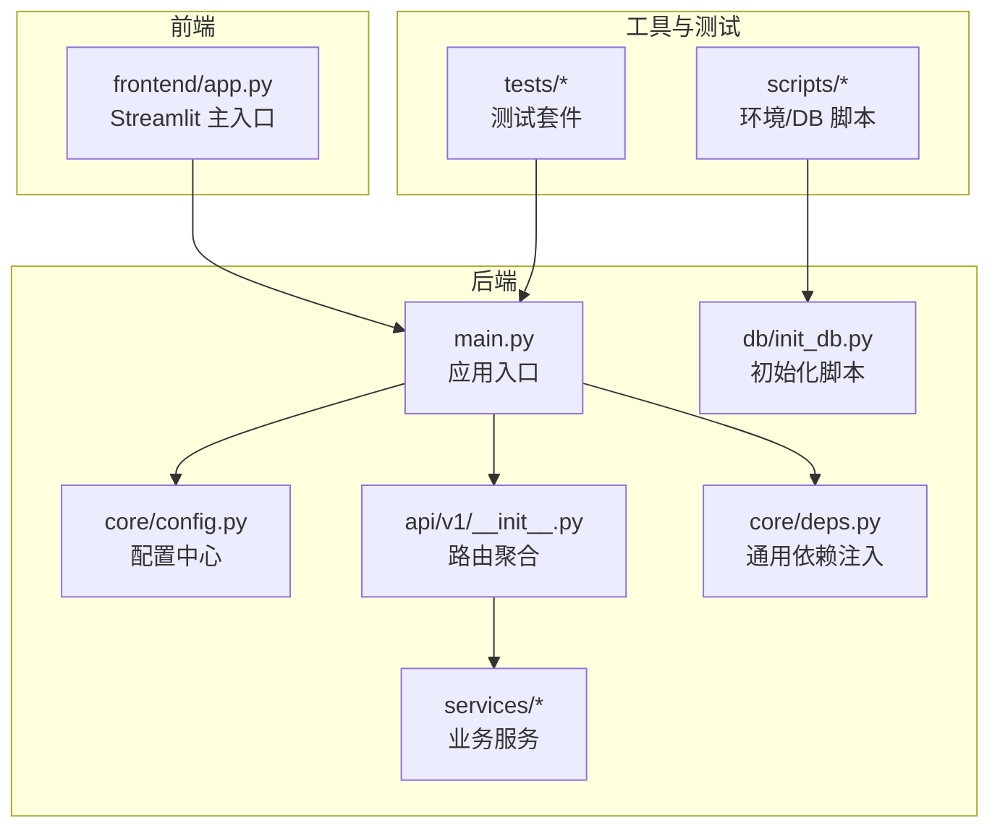
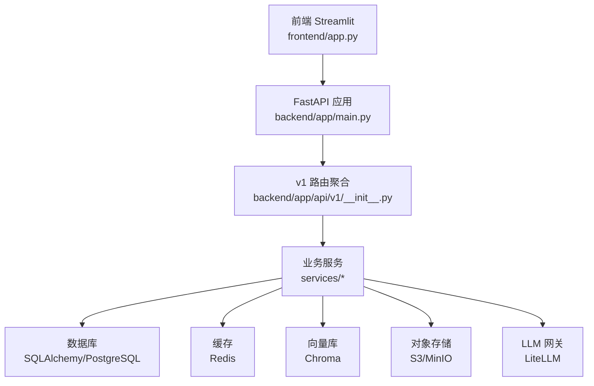
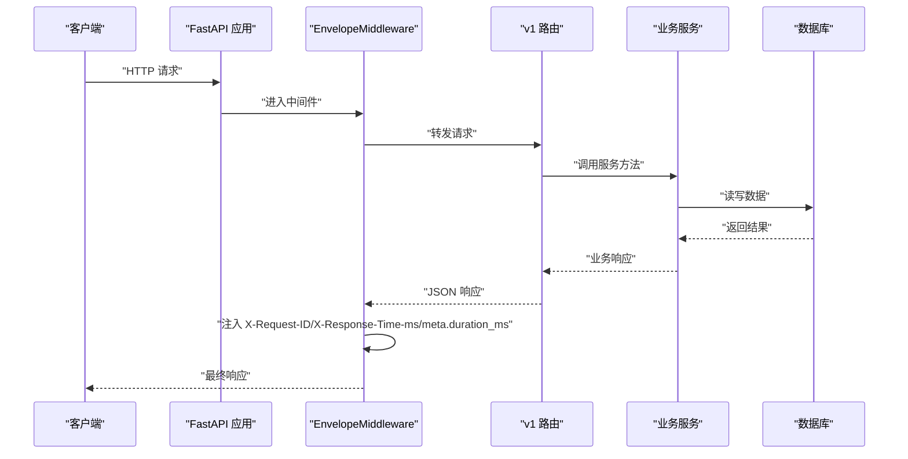
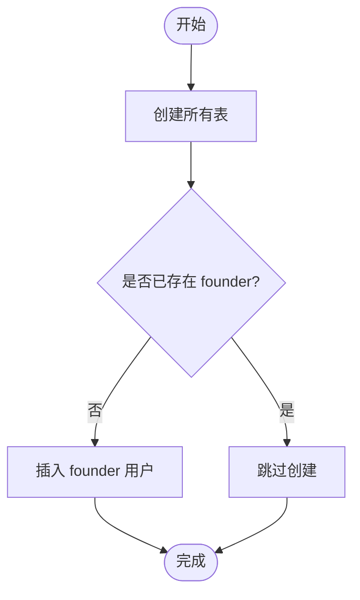
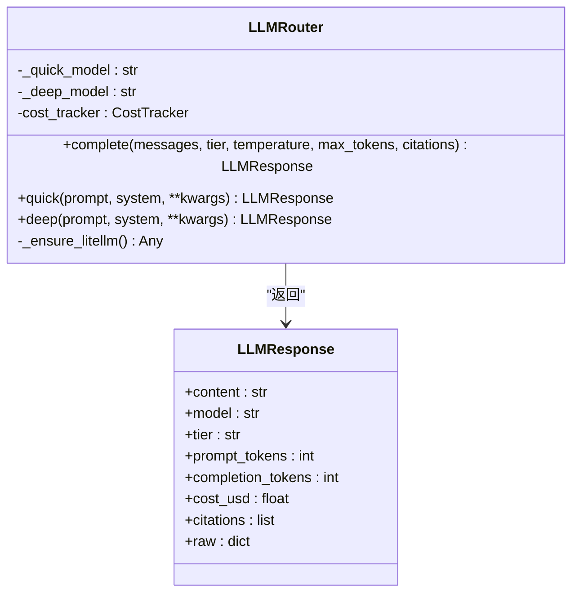
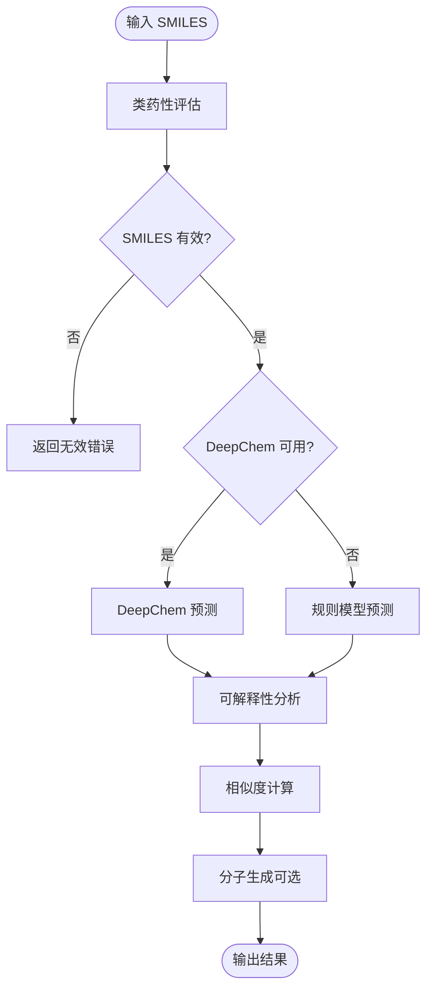
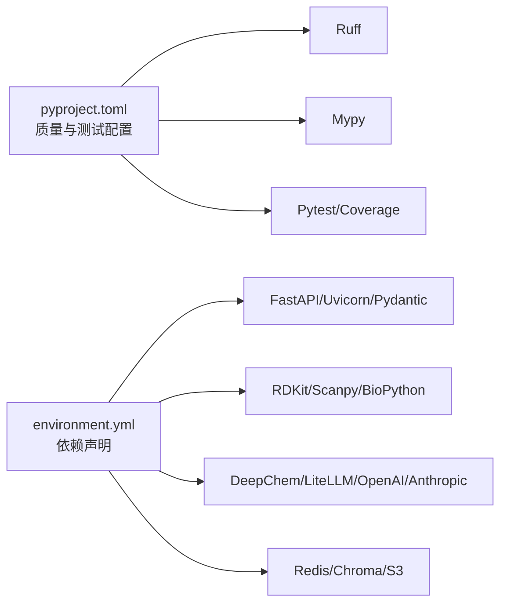

# 开发指南

<cite>
**本文引用的文件**
- [pyproject.toml](file://precision-drug-design/pyproject.toml)
- [README.md](file://precision-drug-design/README.md)
- [environment.yml](file://precision-drug-design/environment.yml)
- [backend/app/main.py](file://precision-drug-design/backend/app/main.py)
- [backend/app/core/config.py](file://precision-drug-design/backend/app/core/config.py)
- [backend/app/db/init_db.py](file://precision-drug-design/backend/app/db/init_db.py)
- [backend/app/api/v1/__init__.py](file://precision-drug-design/backend/app/api/v1/__init__.py)
- [scripts/recreate_db.py](file://precision-drug-design/scripts/recreate_db.py)
- [scripts/verify_env.py](file://precision-drug-design/scripts/verify_env.py)
- [backend/app/core/deps.py](file://precision-drug-design/backend/app/core/deps.py)
- [backend/app/services/llm/router.py](file://precision-drug-design/backend/app/services/llm/router.py)
- [backend/app/services/analyzer/molecule_designer.py](file://precision-drug-design/backend/app/services/analyzer/molecule_designer.py)
- [tests/conftest.py](file://precision-drug-design/tests/conftest.py)
- [frontend/app.py](file://precision-drug-design/frontend/app.py)
</cite>

## 目录
1. [简介](#简介)
2. [项目结构](#项目结构)
3. [核心组件](#核心组件)
4. [架构总览](#架构总览)
5. [详细组件分析](#详细组件分析)
6. [依赖关系分析](#依赖关系分析)
7. [性能与可观测性](#性能与可观测性)
8. [故障排查指南](#故障排查指南)
9. [结论](#结论)
10. [附录：常用命令与环境清单](#附录常用命令与环境清单)

## 简介
本指南面向新加入的开发者与技术团队，提供从环境搭建、代码规范、分支与提交规范，到调试技巧、故障排查、安全编码与性能优化的完整实践路径。系统采用 FastAPI + Streamlit 前后端分离架构，结合 RDKit、DeepChem、LLM（LiteLLM）等能力，覆盖多组学数据整合、靶点发现、分子设计与治疗方案优化等核心场景。

## 项目结构
仓库根目录包含后端应用、前端界面、测试套件、脚本工具与设计文档。关键目录职责如下：
- backend/app：FastAPI 应用，含路由、服务、模型、数据库、配置与安全等模块
- frontend：Streamlit 前端页面与认证、API 客户端
- tests：单元测试、集成测试与性能基准
- scripts：环境校验、数据库重建等运维脚本
- docs/design：系统设计文档
- pyproject.toml：统一配置（ruff、mypy、pytest、coverage）
- environment.yml：Conda 环境与依赖声明

图表来源
- [backend/app/main.py:187-248](file://precision-drug-design/backend/app/main.py#L187-L248)
- [backend/app/core/config.py:21-144](file://precision-drug-design/backend/app/core/config.py#L21-L144)
- [backend/app/db/init_db.py:35-88](file://precision-drug-design/backend/app/db/init_db.py#L35-L88)
- [backend/app/api/v1/__init__.py:24-41](file://precision-drug-design/backend/app/api/v1/__init__.py#L24-L41)
- [backend/app/core/deps.py:101-129](file://precision-drug-design/backend/app/core/deps.py#L101-L129)
- [frontend/app.py:149-157](file://precision-drug-design/frontend/app.py#L149-L157)

章节来源
- [README.md:190-235](file://precision-drug-design/README.md#L190-L235)
- [pyproject.toml:1-106](file://precision-drug-design/pyproject.toml#L1-L106)

## 核心组件
- 应用入口与中间件：创建 FastAPI 实例、注册全局中间件（信封响应、CORS）、异常处理器与 v1 路由；统一注入请求 ID、耗时与日志。
- 配置中心：基于 pydantic-settings 的环境变量加载，集中管理数据库、Redis、对象存储、LLM、联邦学习等配置项。
- 数据库初始化：异步创建表结构与初始 founder 用户，支持命令行参数传入凭据。
- API 路由聚合：按领域划分路由模块并挂载至 /api/v1。
- 通用依赖注入：分页参数、请求追踪 ID、当前用户获取（含短 TTL 内存缓存）。
- LLM 路由器：基于 LiteLLM 的多模型统一调用，区分快速/深度层，内置预算与成本追踪。
- 分子设计器：RDKit/DeepChem 封装，类药性评估、ADMET 预测、相似度计算与生成式分子设计（含降级策略）。
- 前端入口：Streamlit 主页面，登录态管理与健康检查展示。

章节来源
- [backend/app/main.py:29-185](file://precision-drug-design/backend/app/main.py#L29-L185)
- [backend/app/core/config.py:21-144](file://precision-drug-design/backend/app/core/config.py#L21-L144)
- [backend/app/db/init_db.py:35-88](file://precision-drug-design/backend/app/db/init_db.py#L35-L88)
- [backend/app/api/v1/__init__.py:24-41](file://precision-drug-design/backend/app/api/v1/__init__.py#L24-L41)
- [backend/app/core/deps.py:67-129](file://precision-drug-design/backend/app/core/deps.py#L67-L129)
- [backend/app/services/llm/router.py:55-198](file://precision-drug-design/backend/app/services/llm/router.py#L55-L198)
- [backend/app/services/analyzer/molecule_designer.py:20-332](file://precision-drug-design/backend/app/services/analyzer/molecule_designer.py#L20-L332)
- [frontend/app.py:35-157](file://precision-drug-design/frontend/app.py#L35-L157)

## 架构总览
系统采用分层架构：前端通过 HTTP 访问后端 API，后端由路由层、服务层、数据访问层构成，外部依赖包括数据库、缓存、向量库、对象存储与 LLM 网关。

图表来源
- [backend/app/main.py:187-248](file://precision-drug-design/backend/app/main.py#L187-L248)
- [backend/app/api/v1/__init__.py:24-41](file://precision-drug-design/backend/app/api/v1/__init__.py#L24-L41)
- [backend/app/core/config.py:21-144](file://precision-drug-design/backend/app/core/config.py#L21-L144)

## 详细组件分析

### 应用入口与信封中间件
- 职责：创建 FastAPI 实例、注册中间件与路由、暴露健康与文档端点。
- 信封中间件：解析或生成 X-Request-ID，累积响应体并在最后一片重写 start 消息，注入耗时与内容长度，兼容流式响应透传。
- 异常处理：集中注册自定义异常处理器，保证错误响应格式一致。

图表来源
- [backend/app/main.py:29-185](file://precision-drug-design/backend/app/main.py#L29-L185)
- [backend/app/api/v1/__init__.py:24-41](file://precision-drug-design/backend/app/api/v1/__init__.py#L24-L41)

章节来源
- [backend/app/main.py:187-248](file://precision-drug-design/backend/app/main.py#L187-L248)

### 配置中心（Settings）
- 使用 pydantic-settings 从 .env 与真实环境变量加载配置，提供类型校验与默认值。
- 提供 CORS 源列表、生产环境判断等便捷属性。
- 建议将敏感信息放入 .env，避免硬编码。

章节来源
- [backend/app/core/config.py:21-144](file://precision-drug-design/backend/app/core/config.py#L21-L144)

### 数据库初始化与重建
- init_db：异步创建所有表，并插入初始 founder 用户（可从命令行传入邮箱与密码）。
- recreate_db：同步方式重建 schema 并验证 SQLite 表结构，便于本地快速恢复。

图表来源
- [backend/app/db/init_db.py:35-88](file://precision-drug-design/backend/app/db/init_db.py#L35-L88)
- [scripts/recreate_db.py:33-68](file://precision-drug-design/scripts/recreate_db.py#L33-L68)

章节来源
- [backend/app/db/init_db.py:35-88](file://precision-drug-design/backend/app/db/init_db.py#L35-L88)
- [scripts/recreate_db.py:1-68](file://precision-drug-design/scripts/recreate_db.py#L1-L68)

### API 路由聚合
- 在 v1 下按领域挂载路由：health、auth、projects、datasets、targets、molecules、reports、hypotheses、chat、federated、privacy、feedback、efficacy、admin。
- 新增功能时，应在对应模块定义 router，并在聚合文件中 include_router。

章节来源
- [backend/app/api/v1/__init__.py:24-41](file://precision-drug-design/backend/app/api/v1/__init__.py#L24-L41)

### 通用依赖注入（分页、请求ID、当前用户）
- get_pagination：统一分页参数校验与转换。
- get_request_id：优先使用客户端 X-Request-ID，否则生成 UUID。
- get_current_user：从 token 解析 user_id，查询用户并做短 TTL 内存缓存，禁用用户直接拒绝。

章节来源
- [backend/app/core/deps.py:67-129](file://precision-drug-design/backend/app/core/deps.py#L67-L129)

### LLM 路由器（LiteLLM）
- 快速层与深度层模型选择，预算控制与成本估算。
- 惰性加载 litellm，未安装时抛出明确错误。
- 返回结构化响应，包含模型名、token 用量、费用与原始响应。

图表来源
- [backend/app/services/llm/router.py:30-198](file://precision-drug-design/backend/app/services/llm/router.py#L30-L198)

章节来源
- [backend/app/services/llm/router.py:55-198](file://precision-drug-design/backend/app/services/llm/router.py#L55-L198)

### 分子设计器（RDKit/DeepChem）
- 类药性评估：Lipinski 五规则、Veber 规则、QED。
- ADMET 预测：优先 DeepChem，失败则降级为规则模型。
- 相似度计算：Tanimoto（Morgan 指纹）。
- 生成式分子设计：片段组合、参考分子优化、随机生成（简化实现）。
- DiffDock 对接：NVIDIA NIM API 调用，不可用时返回占位响应。

图表来源
- [backend/app/services/analyzer/molecule_designer.py:71-332](file://precision-drug-design/backend/app/services/analyzer/molecule_designer.py#L71-L332)
- [backend/app/services/analyzer/molecule_designer.py:522-661](file://precision-drug-design/backend/app/services/analyzer/molecule_designer.py#L522-L661)

章节来源
- [backend/app/services/analyzer/molecule_designer.py:20-332](file://precision-drug-design/backend/app/services/analyzer/molecule_designer.py#L20-L332)
- [backend/app/services/analyzer/molecule_designer.py:522-661](file://precision-drug-design/backend/app/services/analyzer/molecule_designer.py#L522-L661)

### 前端入口（Streamlit）
- 设置页面布局与图标，渲染侧边栏导航与首页内容。
- 未登录显示登录表单与系统介绍；登录后展示健康状态与快速入口。
- 通过 API 客户端进行健康检查与数据获取。

章节来源
- [frontend/app.py:35-157](file://precision-drug-design/frontend/app.py#L35-L157)

## 依赖关系分析
- 构建与质量：ruff（lint/format）、mypy（类型检查）、pytest（测试与覆盖率）。
- 运行依赖：FastAPI、Uvicorn、Pydantic、SQLAlchemy、Redis、Chroma、OpenAI/Anthropic、Streamlit、Plotly/Altair、Loguru、Tenacity、Orjson。
- 生信与化学：RDKit、Scanpy、BioPython、Cyvcf2、Pysam、DeepChem（第二阶段）。
- 联邦学习与隐私：Flower、PySyft、Opacus（第三阶段）。

图表来源
- [pyproject.toml:14-106](file://precision-drug-design/pyproject.toml#L14-L106)
- [environment.yml:15-103](file://precision-drug-design/environment.yml#L15-L103)

章节来源
- [pyproject.toml:14-106](file://precision-drug-design/pyproject.toml#L14-L106)
- [environment.yml:15-103](file://precision-drug-design/environment.yml#L15-L103)

## 性能与可观测性
- 请求级可观测性：信封中间件注入 X-Request-ID 与 X-Response-Time-ms，并在 meta.duration_ms 记录耗时。
- 用户缓存：get_current_user 使用短 TTL 内存缓存减少频繁查询。
- 外部调用容错：LLM 与 DiffDock 均具备降级策略，避免单点失败影响整体可用性。
- 建议：
  - 对热点接口增加 Redis 缓存与限流。
  - 对长耗时任务引入异步队列与进度回调。
  - 使用 Prometheus 指标与结构化日志进行监控告警。

章节来源
- [backend/app/main.py:29-185](file://precision-drug-design/backend/app/main.py#L29-L185)
- [backend/app/core/deps.py:26-65](file://precision-drug-design/backend/app/core/deps.py#L26-L65)
- [backend/app/services/llm/router.py:115-171](file://precision-drug-design/backend/app/services/llm/router.py#L115-L171)
- [backend/app/services/analyzer/molecule_designer.py:522-661](file://precision-drug-design/backend/app/services/analyzer/molecule_designer.py#L522-L661)

## 故障排查指南
- 环境验证：使用 verify_env.py 检查 Python 版本、三阶段依赖、.env 关键变量与外部 API 可达性。
- 数据库问题：使用 recreate_db.py 重建 schema 并验证表结构；确认 DATABASE_URL 指向正确引擎。
- 认证失败：检查 JWT_SECRET_KEY 与 token 有效期；确认用户未被禁用。
- LLM 调用失败：确认 OPENAI_API_KEY/ANTHROPIC_API_KEY 配置；查看预算限制与模型可用性。
- 分子对接失败：确认 NVIDIA_API_KEY/DIFFDOCK_NIM_URL；网络连通性与超时设置。
- 前端无法连接后端：检查 CORS 配置与端口映射；查看健康端点返回状态。

章节来源
- [scripts/verify_env.py:170-233](file://precision-drug-design/scripts/verify_env.py#L170-L233)
- [scripts/recreate_db.py:33-68](file://precision-drug-design/scripts/recreate_db.py#L33-L68)
- [backend/app/core/config.py:78-86](file://precision-drug-design/backend/app/core/config.py#L78-L86)
- [backend/app/services/llm/router.py:115-171](file://precision-drug-design/backend/app/services/llm/router.py#L115-L171)
- [backend/app/services/analyzer/molecule_designer.py:522-661](file://precision-drug-design/backend/app/services/analyzer/molecule_designer.py#L522-L661)
- [frontend/app.py:120-134](file://precision-drug-design/frontend/app.py#L120-L134)

## 结论
本指南梳理了系统的核心组件、架构与开发流程，提供了从环境搭建、代码规范、测试与质量保障，到调试与排障的实操建议。遵循统一的配置与依赖管理、严格的代码风格与类型检查、完善的测试与覆盖率要求，以及健壮的错误处理与降级策略，有助于提升团队协作效率与系统稳定性。

## 附录：常用命令与环境清单
- 环境搭建
  - 使用 pip：pip install -e ".[dev]"
  - 使用 conda：conda env create -f environment.yml && conda activate pdd-system
- 配置与环境
  - 复制样例：cp .env.example .env
  - 关键变量：DATABASE_URL、OPENAI_API_KEY、ANTHROPIC_API_KEY、JWT_SECRET_KEY
- 数据库初始化
  - python -m backend.app.db.init_db founder@pdd.dev password123
  - 或使用脚本：python scripts/recreate_db.py
- 启动服务
  - 后端：uvicorn backend.app.main:app --host 0.0.0.0 --port 8000 --reload
  - 前端：streamlit run frontend/app.py --server.port 8501
- 代码质量
  - ruff check backend/ scripts/ --fix
  - ruff format backend/ scripts/
  - mypy backend/
- 测试
  - pytest
  - pytest --cov=backend/app --cov-report=html
  - pytest -m "not slow"
- 环境验证
  - python scripts/verify_env.py
  - python scripts/verify_env.py --stage 1
  - python scripts/verify_env.py --api

章节来源
- [README.md:128-187](file://precision-drug-design/README.md#L128-L187)
- [pyproject.toml:63-83](file://precision-drug-design/pyproject.toml#L63-L83)
- [environment.yml:15-103](file://precision-drug-design/environment.yml#L15-L103)
- [scripts/verify_env.py:170-233](file://precision-drug-design/scripts/verify_env.py#L170-L233)
- [backend/app/db/init_db.py:64-88](file://precision-drug-design/backend/app/db/init_db.py#L64-L88)
- [scripts/recreate_db.py:33-68](file://precision-drug-design/scripts/recreate_db.py#L33-L68)
- [frontend/app.py:149-157](file://precision-drug-design/frontend/app.py#L149-L157)