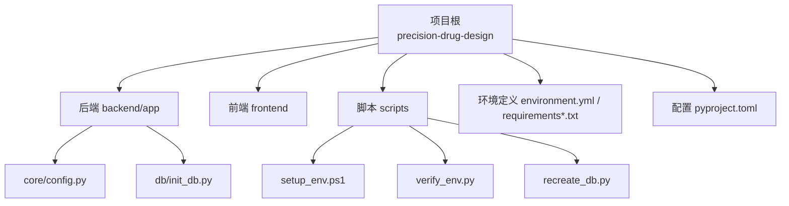
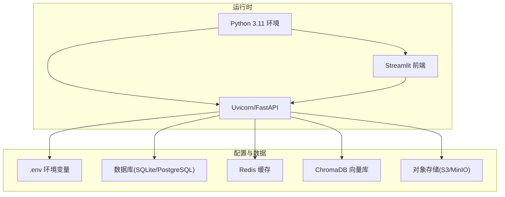
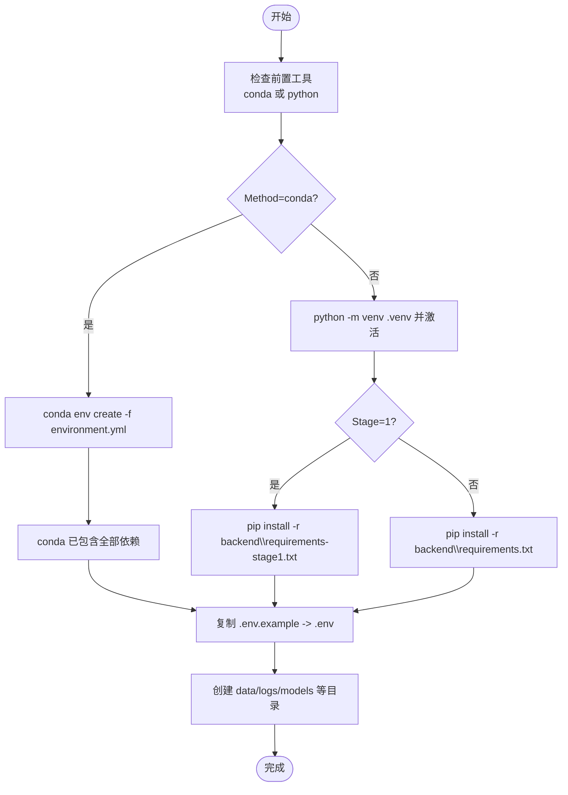
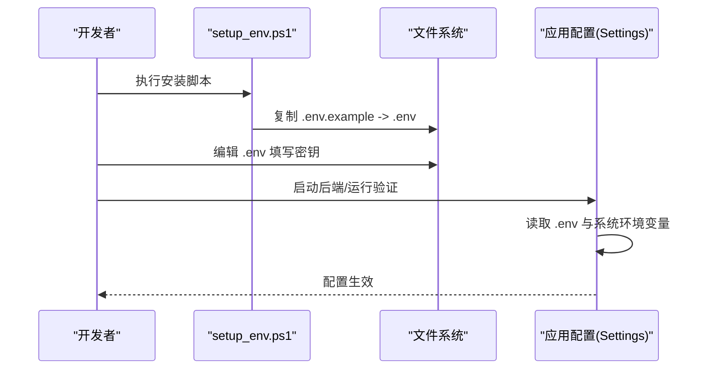
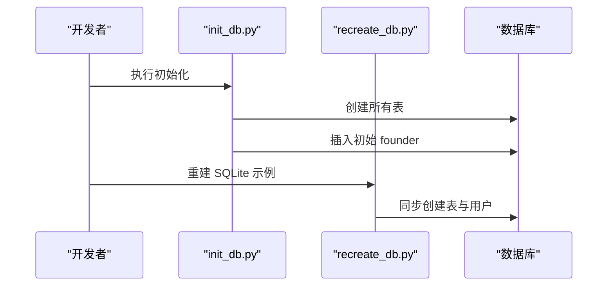
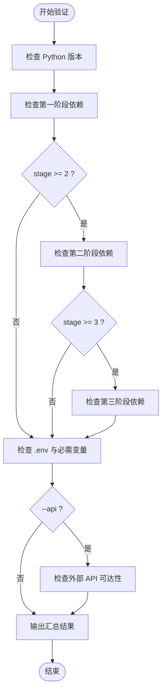
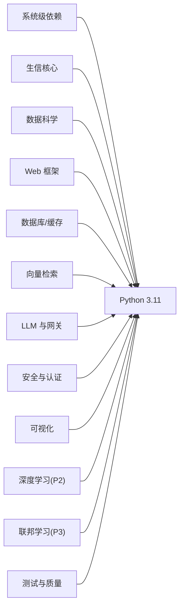

# 开发环境搭建

<cite>
**本文引用的文件**   
- [README.md](file://precision-drug-design\README.md)
- [environment.yml](file://precision-drug-design\environment.yml)
- [backend/requirements.txt](file://precision-drug-design\backend\requirements.txt)
- [backend/requirements-stage1.txt](file://precision-drug-design\backend\requirements-stage1.txt)
- [frontend/requirements.txt](file://precision-drug-design\frontend\requirements.txt)
- [scripts/setup_env.ps1](file://precision-drug-design\scripts\setup_env.ps1)
- [scripts/verify_env.py](file://precision-drug-design\scripts\verify_env.py)
- [backend/app/core/config.py](file://precision-drug-design\backend\app\core\config.py)
- [backend/app/db/init_db.py](file://precision-drug-design\backend\app\db\init_db.py)
- [scripts/recreate_db.py](file://precision-drug-design\scripts\recreate_db.py)
- [pyproject.toml](file://precision-drug-design\pyproject.toml)
</cite>

## 目录
1. [简介](#简介)
2. [项目结构](#项目结构)
3. [核心组件](#核心组件)
4. [架构总览](#架构总览)
5. [详细组件分析](#详细组件分析)
6. [依赖关系分析](#依赖关系分析)
7. [性能与兼容性建议](#性能与兼容性建议)
8. [故障排查指南](#故障排查指南)
9. [结论](#结论)
10. [附录](#附录)

## 简介
本指南面向在 Windows、Linux/macOS 上搭建 AI 药物设计系统的开发者，覆盖 Python 版本要求、Conda 与 pip 两种环境管理方式、虚拟环境配置、阶段化依赖安装、环境变量与数据库连接设置、外部 API 密钥配置，以及常见问题排查。脚本与验证工具均基于仓库内现有实现编写说明，确保可落地执行。

## 项目结构
本项目采用前后端分离与多阶段依赖策略：
- 后端：FastAPI + SQLAlchemy + Redis + ChromaDB + LLM 网关等
- 前端：Streamlit 页面
- 环境定义：environment.yml（conda）与 requirements*.txt（pip），支持分阶段安装
- 初始化与验证：提供一键环境安装脚本与环境验证脚本

图表来源
- [README.md:190-235](file://precision-drug-design\README.md#L190-L235)
- [environment.yml:1-103](file://precision-drug-design\environment.yml#L1-L103)
- [backend/requirements.txt:1-100](file://precision-drug-design\backend\requirements.txt#L1-L100)
- [scripts/setup_env.ps1:1-136](file://precision-drug-design\scripts\setup_env.ps1#L1-L136)
- [scripts/verify_env.py:1-233](file://precision-drug-design\scripts\verify_env.py#L1-L233)

章节来源
- [README.md:113-188](file://precision-drug-design\README.md#L113-L188)
- [pyproject.toml:1-106](file://precision-drug-design\pyproject.toml#L1-L106)

## 核心组件
- 环境定义与依赖管理
  - Conda：environment.yml 统一声明 Python 3.11、系统级依赖与 pip 子依赖，适合含 C 扩展的库（如 RDKit、cyvcf2、pysam）。
  - Pip：backend/requirements.txt（全量）、backend/requirements-stage1.txt（最小可运行闭环）、frontend/requirements.txt（仅前端）。
- 一键安装脚本（Windows）
  - setup_env.ps1：检查前置工具、创建 conda 或 venv 环境、按阶段安装依赖、生成 .env、创建必要目录。
- 环境验证脚本
  - verify_env.py：校验 Python 版本、三阶段依赖导入、.env 关键变量、可选的外部 API 可达性。
- 应用配置与数据库初始化
  - core/config.py：基于 pydantic-settings 的环境变量加载与默认值。
  - db/init_db.py：创建表结构与初始 founder 用户。
  - recreate_db.py：同步方式重建 SQLite 示例数据。

章节来源
- [environment.yml:1-103](file://precision-drug-design\environment.yml#L1-L103)
- [backend/requirements.txt:1-100](file://precision-drug-design\backend\requirements.txt#L1-L100)
- [backend/requirements-stage1.txt:1-40](file://precision-drug-design\backend\requirements-stage1.txt#L1-L40)
- [frontend/requirements.txt:1-3](file://precision-drug-design\frontend\requirements.txt#L1-L3)
- [scripts/setup_env.ps1:1-136](file://precision-drug-design\scripts\setup_env.ps1#L1-L136)
- [scripts/verify_env.py:1-233](file://precision-drug-design\scripts\verify_env.py#L1-L233)
- [backend/app/core/config.py:1-144](file://precision-drug-design\backend\app\core\config.py#L1-L144)
- [backend/app/db/init_db.py:1-88](file://precision-drug-design\backend\app\db\init_db.py#L1-L88)
- [scripts/recreate_db.py:1-68](file://precision-drug-design\scripts\recreate_db.py#L1-L68)

## 架构总览
下图展示本地开发时各组件的关系与启动顺序：Python 解释器通过 FastAPI/Uvicorn 启动后端，读取 .env 配置；数据库与缓存为可选依赖；向量库与对象存储用于持久化；前端 Streamlit 通过 HTTP 调用后端。

图表来源
- [backend/app/core/config.py:1-144](file://precision-drug-design\backend\app\core\config.py#L1-L144)
- [backend/app/db/init_db.py:1-88](file://precision-drug-design\backend\app\db\init_db.py#L1-L88)
- [README.md:113-188](file://precision-drug-design\README.md#L113-L188)

## 详细组件分析

### 平台与环境准备
- Python 版本
  - 要求：>=3.11，推荐 3.11（兼容 Scanpy/DeepChem/PySyft 生态与 CUDA 轮子）。
  - 验证：verify_env.py 会检查当前版本是否在 3.11–3.12 范围内。
- 包管理器选择
  - Conda（推荐）：environment.yml 统一管理系统级与 Python 依赖，避免编译问题。
  - Pip：使用 requirements*.txt，适合快速迭代或无 Conda 场景。
- 虚拟环境
  - Conda：conda env create -f environment.yml，激活 pdd-system。
  - Pip：python -m venv .venv，激活后安装对应 requirements。

章节来源
- [environment.yml:1-103](file://precision-drug-design\environment.yml#L1-L103)
- [scripts/verify_env.py:102-106](file://precision-drug-design\scripts\verify_env.py#L102-L106)
- [README.md:113-137](file://precision-drug-design\README.md#L113-L137)

### Windows 环境一键安装（setup_env.ps1）
- 前置条件
  - 以管理员身份打开 PowerShell。
  - 如需放行执行策略：Set-ExecutionPolicy -Scope CurrentUser -ExecutionPolicy RemoteSigned。
- 参数说明
  - Method：安装方式，支持 conda 或 pip（默认 conda）。
  - Stage：pip 模式下选择阶段，支持 1 或 2（默认 1）。
- 主要流程
  - 检查前置工具（conda 或 python）。
  - 创建环境（conda 环境或 .venv）。
  - 安装阶段依赖（conda 一次性安装；pip 按 stage 选择 requirements）。
  - 复制 .env.example 到 .env（若不存在）。
  - 创建必要目录（data/raw、data/processed、data/chroma、data/sdtm、logs、models）。
- 后续步骤
  - 激活环境并编辑 .env 填入真实密钥。
  - 运行 verify_env.py 验证环境。
  - 启动后端与前端。

图表来源
- [scripts/setup_env.ps1:1-136](file://precision-drug-design\scripts\setup_env.ps1#L1-L136)

章节来源
- [scripts/setup_env.ps1:1-136](file://precision-drug-design\scripts\setup_env.ps1#L1-L136)

### Linux/macOS 环境安装（Conda/Pip）
- Conda（推荐）
  - 创建环境：conda env create -f environment.yml
  - 激活环境：conda activate pdd-system
- Pip
  - 创建虚拟环境：python -m venv .venv
  - 激活环境：source .venv/bin/activate
  - 安装依赖：
    - 第一阶段：pip install -r backend/requirements-stage1.txt
    - 全量：pip install -r backend/requirements.txt
- 前端依赖
  - 可在同一环境中安装 frontend/requirements.txt，或单独维护。

章节来源
- [environment.yml:1-103](file://precision-drug-design\environment.yml#L1-L103)
- [backend/requirements.txt:1-100](file://precision-drug-design\backend\requirements.txt#L1-L100)
- [backend/requirements-stage1.txt:1-40](file://precision-drug-design\backend\requirements-stage1.txt#L1-L40)
- [frontend/requirements.txt:1-3](file://precision-drug-design\frontend\requirements.txt#L1-L3)

### 环境变量与外部服务配置
- 配置文件位置
  - 应用通过 pydantic-settings 从 .env 与系统环境变量加载配置，优先级：系统环境变量 > .env > 代码默认值。
- 关键变量（部分）
  - 应用：APP_NAME、APP_ENV、APP_DEBUG、APP_HOST、APP_PORT、APP_LOG_LEVEL
  - 数据库：DATABASE_URL（开发可用 SQLite，生产用 PostgreSQL）
  - 缓存：REDIS_URL
  - 对象存储：S3_ENDPOINT、S3_ACCESS_KEY、S3_SECRET_KEY、S3_BUCKET、S3_REGION
  - 向量库：CHROMA_PERSIST_DIR
  - LLM：OPENAI_API_KEY、ANTHROPIC_API_KEY、LLM_DEFAULT_MODEL、LLM_DEEP_MODEL、LLM_MAX_BUDGET_USD、LLM_QUICK_BUDGET_USD
  - NVIDIA NIM：NIM_API_KEY、NIM_DIFFDOCK_URL
  - 知识库 API：MYGENE_BASE_URL、MYVARIANT_BASE_URL、CHEMBL_BASE_URL、PUBMED_BASE_URL、CLINICAL_TRIALS_URL
  - NCBI：NCBI_EMAIL
  - 认证：JWT_SECRET_KEY、JWT_ALGORITHM、JWT_ACCESS_TOKEN_EXPIRE_MINUTES、JWT_REFRESH_TOKEN_EXPIRE_DAYS
  - CORS：CORS_ORIGINS
  - 联邦学习：FLOWER_SERVER_ADDRESS、FLOWER_NUM_ROUNDS
  - PySyft：PYSYFT_DOMAIN_PORT、PYSYFT_DOMAIN_NAME
  - CDISC：CDISC_SDTM_OUTPUT_DIR、PINNACLE21_JAR_PATH
  - 干湿闭环：LIMS_API_URL、LIMS_API_TOKEN
  - 数据处理：SCANPY_N_JOBS、SCANPY_USE_DASK、DASK_DASHBOARD_ADDRESS
  - 数据目录：DATA_RAW_DIR、DATA_PROCESSED_DIR
- 验证
  - verify_env.py 会检查 .env 是否存在并校验必需键（如 APP_NAME、DATABASE_URL、OPENAI_API_KEY、JWT_SECRET_KEY）。

图表来源
- [scripts/setup_env.ps1:99-108](file://precision-drug-design\scripts\setup_env.ps1#L99-L108)
- [backend/app/core/config.py:1-144](file://precision-drug-design\backend\app\core\config.py#L1-L144)
- [scripts/verify_env.py:118-143](file://precision-drug-design\scripts\verify_env.py#L118-L143)

章节来源
- [backend/app/core/config.py:1-144](file://precision-drug-design\backend\app\core\config.py#L1-L144)
- [scripts/verify_env.py:76-87](file://precision-drug-design\scripts\verify_env.py#L76-L87)

### 数据库初始化与本地开发
- 初始化入口
  - 异步方式：python -m backend.app.db.init_db（创建表与初始 founder）
  - 同步脚本：python scripts/recreate_db.py（适用于 SQLite 快速重建）
- 本地开发建议
  - 使用 SQLite：DATABASE_URL=sqlite:///./data/pdd_dev.sqlite
  - 生产部署：使用 PostgreSQL + Alembic 迁移（requirements 中已包含 alembic）

图表来源
- [backend/app/db/init_db.py:1-88](file://precision-drug-design\backend\app\db\init_db.py#L1-L88)
- [scripts/recreate_db.py:1-68](file://precision-drug-design\scripts\recreate_db.py#L1-L68)

章节来源
- [backend/app/db/init_db.py:1-88](file://precision-drug-design\backend\app\db\init_db.py#L1-L88)
- [scripts/recreate_db.py:1-68](file://precision-drug-design\scripts\recreate_db.py#L1-L68)

### 环境验证（verify_env.py）
- 功能
  - 检查 Python 版本（要求 3.11–3.12）。
  - 检查三阶段依赖是否可导入（STAGE1/2/3）。
  - 检查 .env 文件与必需变量。
  - 可选：检查外部 API 可达性（MyGene.info、MyVariant.info、ChEMBL）。
- 用法
  - 基础验证：python scripts/verify_env.py
  - 指定阶段：python scripts/verify_env.py --stage 1
  - 同时检查外部 API：python scripts/verify_env.py --api

图表来源
- [scripts/verify_env.py:170-233](file://precision-drug-design\scripts\verify_env.py#L170-L233)

章节来源
- [scripts/verify_env.py:1-233](file://precision-drug-design\scripts\verify_env.py#L1-L233)

## 依赖关系分析
- 依赖分层
  - 系统级：OpenJDK、Node.js、Graphviz、Pandoc（通过 conda 安装更稳定）。
  - 生信核心：Scanpy、Anndata、BioPython、cyvcf2、pysam。
  - 数据科学：NumPy、Pandas、SciPy、scikit-learn、Matplotlib、Seaborn、h5py、PyArrow。
  - Web 框架：FastAPI、Uvicorn、Pydantic。
  - 数据库与缓存：SQLAlchemy、psycopg2、asyncpg、Alembic、Redis。
  - 向量检索：ChromaDB。
  - LLM 与网关：LiteLLM、OpenAI、Anthropic、tiktoken。
  - 安全与认证：python-jose、passlib、python-dotenv、orjson。
  - 可视化：Streamlit、Plotly、Altair、py3Dmol。
  - 深度学习（P2）：Torch、torch-geometric、deepchem。
  - 联邦学习与隐私计算（P3）：flwr、syft、opacus。
  - 测试与质量：pytest、pytest-cov、pytest-asyncio、pytest-mock、responses、ruff、mypy、pre-commit。
- 安装策略
  - Conda：environment.yml 统一声明，优先解决系统级与 C 扩展依赖。
  - Pip：requirements*.txt 作为补充或替代方案，注意编译工具链。

图表来源
- [environment.yml:1-103](file://precision-drug-design\environment.yml#L1-L103)
- [backend/requirements.txt:1-100](file://precision-drug-design\backend\requirements.txt#L1-L100)

章节来源
- [environment.yml:1-103](file://precision-drug-design\environment.yml#L1-L103)
- [backend/requirements.txt:1-100](file://precision-drug-design\backend\requirements.txt#L1-L100)

## 性能与兼容性建议
- Python 版本
  - 固定使用 3.11，以获得最佳生态兼容性与 CUDA 轮子支持。
- 依赖安装
  - 优先使用 Conda 安装含 C 扩展的库（RDKit、cyvcf2、pysam），减少编译失败风险。
- 外部服务
  - 合理设置超时与重试（tenacity），避免外部 API 抖动影响主流程。
- 资源占用
  - 本地开发可使用 SQLite 与本地 ChromaDB；生产建议使用 PostgreSQL、Redis 与对象存储。

[本节为通用建议，不直接分析具体文件]

## 故障排查指南
- 权限问题（Windows）
  - 现象：PowerShell 无法执行脚本。
  - 处理：以管理员身份运行，并设置执行策略为 RemoteSigned。
- 未找到 conda/python
  - 现象：setup_env.ps1 报前置工具缺失。
  - 处理：安装 Anaconda/Miniconda 或 Python，并确保 PATH 正确。
- 依赖冲突或安装失败
  - 现象：pip 安装报错或编译失败。
  - 处理：切换至 Conda 安装；或使用 requirements-stage1.txt 逐步安装；必要时更新 pip 与构建工具。
- 环境变量未生效
  - 现象：应用启动时报缺少配置项。
  - 处理：确认 .env 存在且键名正确；系统环境变量优先级更高，避免覆盖。
- 数据库连接失败
  - 现象：初始化或启动时报数据库错误。
  - 处理：检查 DATABASE_URL；本地开发使用 SQLite；生产需确保 PostgreSQL 服务可用。
- 外部 API 不可达
  - 现象：verify_env.py 报告外部 API 失败。
  - 处理：检查网络与代理；确认 MyGene/MyVariant/ChEMBL 地址可达。

章节来源
- [scripts/setup_env.ps1:30-48](file://precision-drug-design\scripts\setup_env.ps1#L30-L48)
- [scripts/verify_env.py:146-157](file://precision-drug-design\scripts\verify_env.py#L146-L157)
- [backend/app/core/config.py:1-144](file://precision-drug-design\backend\app\core\config.py#L1-L144)
- [backend/app/db/init_db.py:1-88](file://precision-drug-design\backend\app\db\init_db.py#L1-L88)

## 结论
通过 Conda 或 Pip 两种方式均可完成环境搭建；推荐使用 Conda 以降低系统级依赖与 C 扩展的安装复杂度。配合 setup_env.ps1 与 verify_env.py，可快速完成环境初始化与验证。根据 README 与配置模块，明确环境变量与数据库连接设置，即可顺利启动后端与前端进行开发调试。

[本节为总结性内容，不直接分析具体文件]

## 附录
- 常用命令速查
  - 创建 Conda 环境：conda env create -f environment.yml
  - 激活环境：conda activate pdd-system
  - 初始化数据库：python -m backend.app.db.init_db
  - 启动后端：uvicorn backend.app.main:app --reload
  - 启动前端：streamlit run frontend/app.py
  - 验证环境：python scripts/verify_env.py --api

章节来源
- [README.md:113-188](file://precision-drug-design\README.md#L113-L188)
- [backend/app/db/init_db.py:1-88](file://precision-drug-design\backend\app\db\init_db.py#L1-L88)
- [scripts/verify_env.py:170-233](file://precision-drug-design\scripts\verify_env.py#L170-L233)