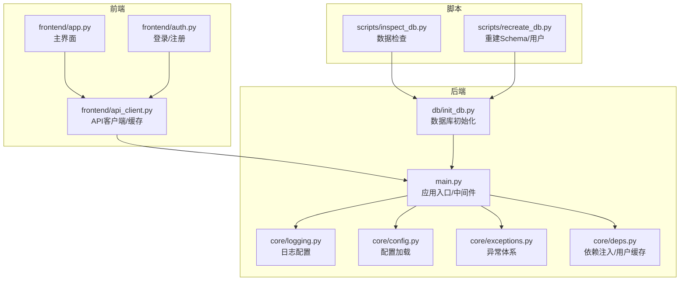
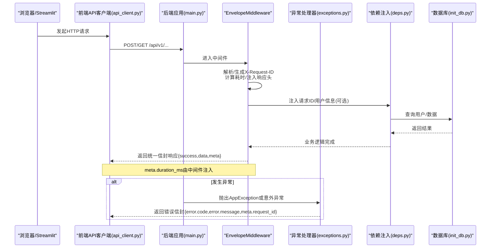
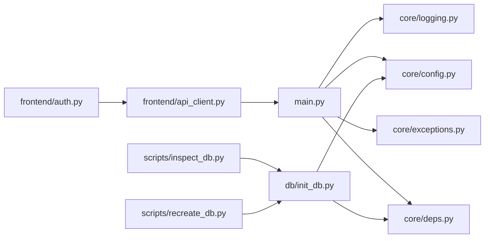

# 调试与故障排查

<cite>
**本文引用的文件**   
- [README.md](file://README.md)
- [main.py](file://backend/app/main.py)
- [logging.py](file://backend/app/core/logging.py)
- [config.py](file://backend/app/core/config.py)
- [exceptions.py](file://backend/app/core/exceptions.py)
- [deps.py](file://backend/app/core/deps.py)
- [init_db.py](file://backend/app/db/init_db.py)
- [inspect_db.py](file://scripts/inspect_db.py)
- [recreate_db.py](file://scripts/recreate_db.py)
- [app.py](file://frontend/app.py)
- [api_client.py](file://frontend/api_client.py)
- [auth.py](file://frontend/auth.py)
- [test_logging.py](file://tests/test_logging.py)
- [test_exceptions.py](file://tests/test_exceptions.py)
</cite>

## 目录
1. [简介](#简介)
2. [项目结构](#项目结构)
3. [核心组件](#核心组件)
4. [架构总览](#架构总览)
5. [详细组件分析](#详细组件分析)
6. [依赖关系分析](#依赖关系分析)
7. [性能考虑](#性能考虑)
8. [故障排查指南](#故障排查指南)
9. [结论](#结论)
10. [附录](#附录)

## 简介
本指南面向AI药物设计系统的开发与运维人员，聚焦后端FastAPI应用与前端Streamlit应用的调试技巧、数据库问题诊断、常见错误定位与解决、监控指标收集与生产环境问题诊断。内容基于仓库现有实现，提供可操作的步骤、可视化流程图与源码级定位路径，帮助快速定位并解决问题。

## 项目结构
系统采用前后端分离：
- 后端：FastAPI + SQLAlchemy（异步）+ Loguru 日志 + 统一异常处理 + 中间件注入请求ID与耗时
- 前端：Streamlit + httpx 客户端封装，带缓存与认证流程
- 脚本：数据库初始化与检查工具

图表来源
- [main.py:187-248](file://backend/app/main.py#L187-L248)
- [logging.py:20-74](file://backend/app/core/logging.py#L20-L74)
- [config.py:21-144](file://backend/app/core/config.py#L21-L144)
- [exceptions.py:131-179](file://backend/app/core/exceptions.py#L131-L179)
- [deps.py:101-129](file://backend/app/core/deps.py#L101-L129)
- [init_db.py:35-88](file://backend/app/db/init_db.py#L35-L88)
- [app.py:149-157](file://frontend/app.py#L149-L157)
- [api_client.py:24-60](file://frontend/api_client.py#L24-L60)
- [auth.py:10-66](file://frontend/auth.py#L10-L66)
- [inspect_db.py:1-79](file://scripts/inspect_db.py#L1-L79)
- [recreate_db.py:33-68](file://scripts/recreate_db.py#L33-L68)

章节来源
- [README.md:190-235](file://README.md#L190-L235)

## 核心组件
- 应用入口与中间件：创建FastAPI实例、注册CORS、统一信封响应中间件、异常处理器、挂载路由与健康检查
- 日志系统：Loguru，开发彩色控制台、生产JSON输出，按大小/时间轮转，错误单独归档
- 配置管理：pydantic-settings，环境变量优先级，属性校验与默认值
- 异常体系：AppException及其子类，全局处理器返回统一信封，包含request_id
- 依赖注入：分页参数、请求ID、当前用户对象（含短TTL内存缓存）
- 数据库初始化：创建所有表与初始创始人用户
- 前端API客户端：连接池复用、超时与限制、统一解包、请求级缓存
- 前端认证：登录/注册表单、会话状态管理、错误提示
- 数据库检查脚本：SQLite表结构检查与创始人用户创建

章节来源
- [main.py:187-248](file://backend/app/main.py#L187-L248)
- [logging.py:20-74](file://backend/app/core/logging.py#L20-L74)
- [config.py:21-144](file://backend/app/core/config.py#L21-L144)
- [exceptions.py:19-179](file://backend/app/core/exceptions.py#L19-L179)
- [deps.py:67-129](file://backend/app/core/deps.py#L67-L129)
- [init_db.py:35-88](file://backend/app/db/init_db.py#L35-L88)
- [api_client.py:24-60](file://frontend/api_client.py#L24-L60)
- [auth.py:10-66](file://frontend/auth.py#L10-L66)
- [inspect_db.py:1-79](file://scripts/inspect_db.py#L1-L79)
- [recreate_db.py:33-68](file://scripts/recreate_db.py#L33-L68)

## 架构总览
下图展示一次典型API请求从前端到后端的完整链路，包括中间件对请求ID与耗时的注入、异常处理器的统一信封返回。

图表来源
- [main.py:29-185](file://backend/app/main.py#L29-L185)
- [exceptions.py:131-179](file://backend/app/core/exceptions.py#L131-L179)
- [deps.py:91-129](file://backend/app/core/deps.py#L91-L129)
- [init_db.py:35-88](file://backend/app/db/init_db.py#L35-L88)

## 详细组件分析

### 后端FastAPI应用调试要点
- 启动与访问
  - 使用uvicorn启动，开启热重载便于本地调试
  - 访问OpenAPI文档进行接口验证
- 日志配置
  - 开发环境：彩色控制台输出，包含模块名、函数名、行号
  - 生产环境：JSON序列化输出，便于集中采集
  - 文件输出：按天轮转、压缩保留；错误级别单独归档
- 断点调试
  - 在中间件与异常处理器处设置断点，观察请求ID、耗时、错误信封
  - 在依赖注入的用户获取处设置断点，确认JWT解析与用户缓存命中
- 性能分析
  - 通过响应头X-Response-Time-ms与meta.duration_ms评估端到端耗时
  - 结合日志中的方法、路径、状态码与耗时统计瓶颈

章节来源
- [README.md:167-181](file://README.md#L167-L181)
- [logging.py:20-74](file://backend/app/core/logging.py#L20-L74)
- [main.py:29-185](file://backend/app/main.py#L29-L185)
- [exceptions.py:131-179](file://backend/app/core/exceptions.py#L131-L179)
- [deps.py:91-129](file://backend/app/core/deps.py#L91-L129)

### 前端Streamlit应用调试要点
- 浏览器开发者工具
  - 打开Network面板查看请求URL、状态码、响应体与耗时
  - 关注Authorization头是否正确携带，以及跨域预检是否通过
- 网络请求调试
  - 使用前端API客户端的缓存机制，必要时清除缓存以强制刷新
  - 调整base_url指向实际后端地址，避免默认localhost冲突
- 认证流程
  - 登录成功后检查session_state中access_token与refresh_token是否存在
  - 登出后确认相关键被清理，避免脏状态影响后续请求

章节来源
- [app.py:149-157](file://frontend/app.py#L149-L157)
- [api_client.py:24-60](file://frontend/api_client.py#L24-L60)
- [api_client.py:186-251](file://frontend/api_client.py#L186-L251)
- [auth.py:10-66](file://frontend/auth.py#L10-L66)

### 数据库问题排查
- 使用inspect_db.py检查SQLite数据库
  - 打印数据库文件存在性与大小
  - 列出所有表与users表记录，确认schema与数据完整性
- 使用recreate_db.py重建Schema与创始人用户
  - 同步engine创建所有表
  - 若用户已存在则跳过，否则创建默认创始人账号
- 使用init_db.py进行标准初始化
  - 支持命令行参数指定邮箱与密码
  - 自动创建所有表与初始用户

章节来源
- [inspect_db.py:1-79](file://scripts/inspect_db.py#L1-L79)
- [recreate_db.py:33-68](file://scripts/recreate_db.py#L33-L68)
- [init_db.py:35-88](file://backend/app/db/init_db.py#L35-L88)

### 常见错误解决方案
- 依赖冲突
  - 使用requirements.txt或environment.yml安装依赖，确保Python版本匹配
  - 若出现库版本不一致，优先锁定关键库版本（如fastapi、httpx、sqlalchemy）
- API调用失败
  - 检查后端健康检查端点是否可用
  - 核对CORS配置与前端base_url
  - 查看响应头X-Request-ID与meta.duration_ms定位慢请求
- 模型加载错误
  - 确认数据库表已创建且用户存在
  - 使用初始化脚本重建Schema与用户
- 内存溢出
  - 减少并发连接数与缓存条目上限
  - 优化大对象上传与流式处理，避免一次性加载全部数据

章节来源
- [README.md:128-181](file://README.md#L128-L181)
- [main.py:215-227](file://backend/app/main.py#L215-L227)
- [api_client.py:24-60](file://frontend/api_client.py#L24-L60)
- [init_db.py:35-88](file://backend/app/db/init_db.py#L35-L88)

### 监控指标收集与生产问题诊断
- 指标端点
  - 暴露Prometheus指标端点，用于监控系统运行状况
- 日志采集
  - 生产环境启用JSON输出，便于集中化日志平台解析
  - 错误日志单独归档，便于快速检索
- 请求追踪
  - 利用X-Request-ID贯穿前后端，关联同一请求的日志与指标
- 性能瓶颈定位
  - 通过X-Response-Time-ms与meta.duration_ms识别慢接口
  - 结合数据库查询与外部API调用日志定位具体瓶颈

章节来源
- [README.md:278-281](file://README.md#L278-L281)
- [logging.py:20-74](file://backend/app/core/logging.py#L20-L74)
- [main.py:29-185](file://backend/app/main.py#L29-L185)

## 依赖关系分析
后端核心模块之间的依赖关系如下：

图表来源
- [main.py:187-248](file://backend/app/main.py#L187-L248)
- [logging.py:20-74](file://backend/app/core/logging.py#L20-L74)
- [config.py:21-144](file://backend/app/core/config.py#L21-L144)
- [exceptions.py:131-179](file://backend/app/core/exceptions.py#L131-L179)
- [deps.py:101-129](file://backend/app/core/deps.py#L101-L129)
- [init_db.py:35-88](file://backend/app/db/init_db.py#L35-L88)
- [api_client.py:24-60](file://frontend/api_client.py#L24-L60)
- [auth.py:10-66](file://frontend/auth.py#L10-L66)
- [inspect_db.py:1-79](file://scripts/inspect_db.py#L1-L79)
- [recreate_db.py:33-68](file://scripts/recreate_db.py#L33-L68)

章节来源
- [main.py:187-248](file://backend/app/main.py#L187-L248)
- [api_client.py:24-60](file://frontend/api_client.py#L24-L60)

## 性能考虑
- 连接池复用
  - 前端API客户端使用共享httpx.Client，减少TCP握手开销
- 请求级缓存
  - Streamlit侧使用st.cache_data实现TTL失效，降低重复请求
- 中间件优化
  - 统一信封中间件仅在非流式响应时重写body，避免额外开销
- 用户缓存
  - 依赖注入中对用户对象进行短TTL内存缓存，减少数据库查询

章节来源
- [api_client.py:24-60](file://frontend/api_client.py#L24-L60)
- [api_client.py:186-251](file://frontend/api_client.py#L186-L251)
- [main.py:29-185](file://backend/app/main.py#L29-L185)
- [deps.py:26-53](file://backend/app/core/deps.py#L26-L53)

## 故障排查指南

### 后端FastAPI应用
- 日志配置
  - 确认setup_logging已在应用启动时调用
  - 检查日志输出格式与环境变量app_env控制的生产/开发模式
- 断点调试
  - 在中间件的send_wrapper处设置断点，观察请求ID与耗时注入
  - 在异常处理器中设置断点，确认错误信封结构与request_id
- 性能分析
  - 读取响应头X-Response-Time-ms与meta.duration_ms，定位慢接口
  - 结合日志中的method、path、status_code与耗时统计

章节来源
- [logging.py:20-74](file://backend/app/core/logging.py#L20-L74)
- [main.py:29-185](file://backend/app/main.py#L29-L185)
- [exceptions.py:131-179](file://backend/app/core/exceptions.py#L131-L179)

### 前端Streamlit应用
- 浏览器开发者工具
  - Network面板查看请求详情，确认Authorization头与跨域响应头
- 网络请求调试
  - 使用cached_get进行带缓存的请求，必要时调用invalidate_cache清除缓存
  - 调整base_url指向正确后端地址
- 认证流程
  - 登录成功后检查session_state中的token与用户邮箱
  - 登出后确认相关键被清理

章节来源
- [app.py:149-157](file://frontend/app.py#L149-L157)
- [api_client.py:186-251](file://frontend/api_client.py#L186-L251)
- [auth.py:10-66](file://frontend/auth.py#L10-L66)

### 数据库问题
- 使用inspect_db.py检查SQLite数据库
  - 打印表列表与users表记录，确认schema与数据完整性
- 使用recreate_db.py重建Schema与创始人用户
  - 同步engine创建所有表，若用户已存在则跳过
- 使用init_db.py进行标准初始化
  - 支持命令行参数指定邮箱与密码

章节来源
- [inspect_db.py:1-79](file://scripts/inspect_db.py#L1-L79)
- [recreate_db.py:33-68](file://scripts/recreate_db.py#L33-L68)
- [init_db.py:35-88](file://backend/app/db/init_db.py#L35-L88)

### 常见错误与解决
- 依赖冲突
  - 使用requirements.txt或environment.yml安装依赖，确保Python版本匹配
- API调用失败
  - 检查健康检查端点与CORS配置，核对base_url
- 模型加载错误
  - 确认数据库表已创建且用户存在，使用初始化脚本重建
- 内存溢出
  - 减少并发连接数与缓存条目上限，优化大对象上传与流式处理

章节来源
- [README.md:128-181](file://README.md#L128-L181)
- [main.py:215-227](file://backend/app/main.py#L215-L227)
- [api_client.py:24-60](file://frontend/api_client.py#L24-L60)
- [init_db.py:35-88](file://backend/app/db/init_db.py#L35-L88)

### 监控指标与生产问题诊断
- 指标端点
  - 访问Prometheus指标端点，监控系统运行状况
- 日志采集
  - 生产环境启用JSON输出，便于集中化日志平台解析
- 请求追踪
  - 利用X-Request-ID贯穿前后端，关联同一请求的日志与指标
- 性能瓶颈定位
  - 通过X-Response-Time-ms与meta.duration_ms识别慢接口

章节来源
- [README.md:278-281](file://README.md#L278-L281)
- [logging.py:20-74](file://backend/app/core/logging.py#L20-L74)
- [main.py:29-185](file://backend/app/main.py#L29-L185)

## 结论
本指南围绕后端FastAPI与前端Streamlit的调试技巧、数据库问题诊断、常见错误解决、监控指标收集与生产问题诊断展开。通过中间件注入的请求ID与耗时、统一异常信封、日志轮转与错误归档、前端缓存与连接池复用等机制，能够快速定位并解决问题。建议在生产环境中启用JSON日志与指标端点，并结合X-Request-ID进行全链路追踪。

## 附录

### 测试参考
- 日志配置测试
  - 验证setup_logging在不同环境下不抛错，get_logger返回Logger实例
- 异常体系测试
  - 验证各异常类的默认状态码与错误码，统一信封构造与处理器行为

章节来源
- [test_logging.py:1-67](file://tests/test_logging.py#L1-L67)
- [test_exceptions.py:1-223](file://tests/test_exceptions.py#L1-L223)