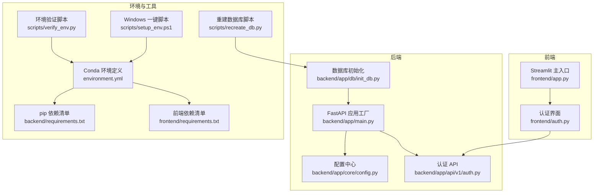
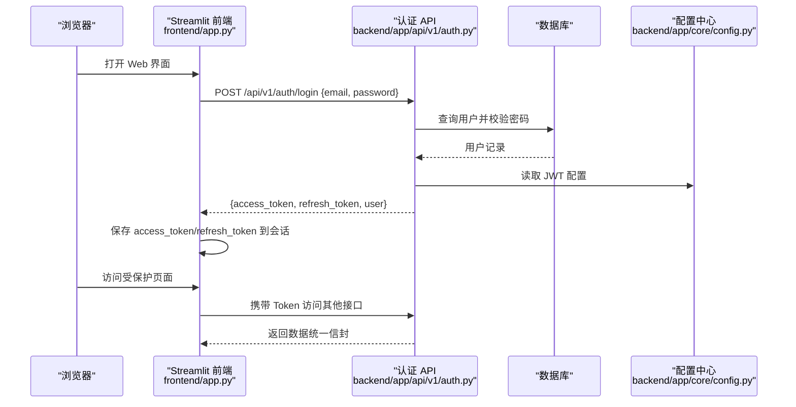
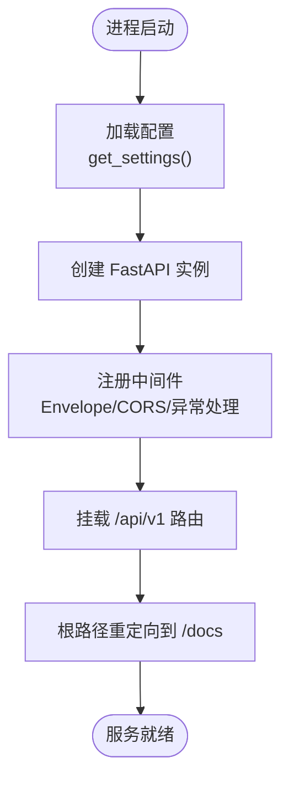
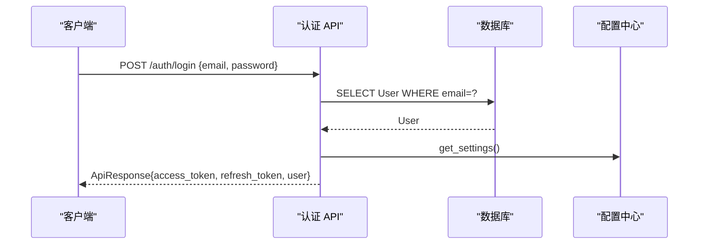
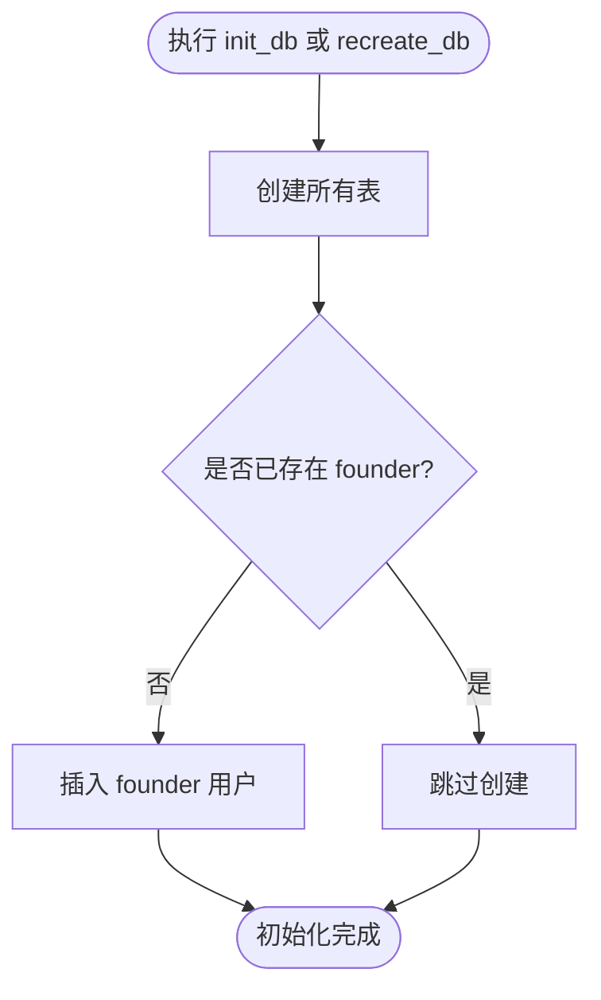
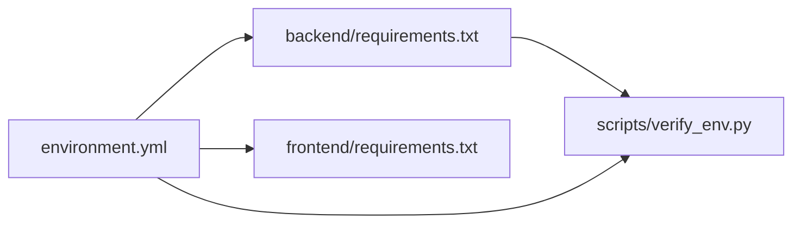

# 快速开始

<cite>
**本文引用的文件**   
- [README.md](file://precision-drug-design/README.md)
- [backend/app/main.py](file://precision-drug-design/backend/app/main.py)
- [backend/app/core/config.py](file://precision-drug-design/backend/app/core/config.py)
- [backend/app/db/init_db.py](file://precision-drug-design/backend/app/db/init_db.py)
- [scripts/recreate_db.py](file://precision-drug-design/scripts/recreate_db.py)
- [scripts/setup_env.ps1](file://precision-drug-design/scripts/setup_env.ps1)
- [scripts/verify_env.py](file://precision-drug-design/scripts/verify_env.py)
- [environment.yml](file://precision-drug-design/environment.yml)
- [backend/requirements.txt](file://precision-drug-design/backend/requirements.txt)
- [frontend/requirements.txt](file://precision-drug-design/frontend/requirements.txt)
- [frontend/app.py](file://precision-drug-design/frontend/app.py)
- [frontend/auth.py](file://precision-drug-design/frontend/auth.py)
- [backend/app/api/v1/auth.py](file://precision-drug-design/backend/app/api/v1/auth.py)
</cite>

## 目录
1. [简介](#简介)
2. [项目结构](#项目结构)
3. [核心组件](#核心组件)
4. [架构总览](#架构总览)
5. [详细组件分析](#详细组件分析)
6. [依赖关系分析](#依赖关系分析)
7. [性能与启动建议](#性能与启动建议)
8. [故障排查指南](#故障排查指南)
9. [结论](#结论)
10. [附录：5分钟上手清单](#附录5分钟上手清单)

## 简介
本指南面向首次使用者，目标是在5分钟内完成环境准备、配置、数据库初始化、后端与前端启动，并成功登录系统体验核心功能。系统采用 FastAPI 后端 + Streamlit 前端，支持 SQLite 本地开发模式，无需额外安装 PostgreSQL 即可运行。

## 项目结构
- 后端：FastAPI 应用，统一信封响应中间件、CORS、异常处理器、路由挂载等均在入口中完成。
- 前端：Streamlit 多页面应用，提供登录、项目管理、数据集、靶点发现、分子评估、报告查看、假设管理、AI问答、联邦学习、隐私计算、系统监控等页面。
- 配置：基于 pydantic-settings 的 .env 环境变量加载，默认读取 .env 文件。
- 数据库：支持 SQLite（本地）与 PostgreSQL（生产），并提供初始化脚本创建表与初始用户。

图表来源
- [backend/app/main.py:187-248](file://precision-drug-design/backend/app/main.py#L187-L248)
- [backend/app/core/config.py:128-144](file://precision-drug-design/backend/app/core/config.py#L128-L144)
- [backend/app/api/v1/auth.py:70-101](file://precision-drug-design/backend/app/api/v1/auth.py#L70-L101)
- [backend/app/db/init_db.py:64-88](file://precision-drug-design/backend/app/db/init_db.py#L64-L88)
- [scripts/recreate_db.py:33-68](file://precision-drug-design/scripts/recreate_db.py#L33-L68)
- [environment.yml:1-103](file://precision-drug-design/environment.yml#L1-L103)
- [backend/requirements.txt:1-100](file://precision-drug-design/backend/requirements.txt#L1-L100)
- [frontend/requirements.txt:1-3](file://precision-drug-design/frontend/requirements.txt#L1-L3)
- [scripts/verify_env.py:170-233](file://precision-drug-design/scripts/verify_env.py#L170-L233)
- [scripts/setup_env.ps1:1-136](file://precision-drug-design/scripts/setup_env.ps1#L1-L136)

章节来源
- [README.md:113-188](file://precision-drug-design/README.md#L113-L188)
- [backend/app/main.py:187-248](file://precision-drug-design/backend/app/main.py#L187-L248)
- [backend/app/core/config.py:128-144](file://precision-drug-design/backend/app/core/config.py#L128-L144)
- [frontend/app.py:1-157](file://precision-drug-design/frontend/app.py#L1-L157)

## 核心组件
- 后端应用工厂：创建 FastAPI 实例、注册中间件（统一信封、CORS）、异常处理器、挂载 v1 路由、暴露健康检查与文档。
- 配置中心：从 .env 与环境变量加载配置，提供 CORS 源列表、JWT 参数、数据库 URL 等。
- 认证 API：提供登录、刷新令牌、获取当前用户信息；返回统一信封格式。
- 数据库初始化：创建所有表并插入初始 founder 用户，支持命令行参数或默认值。
- 前端主入口：渲染侧边栏导航、首页登录表单、系统概览与健康状态展示。
- 前端认证组件：登录/注册表单、会话态管理、错误提示与演示模式提示。

章节来源
- [backend/app/main.py:187-248](file://precision-drug-design/backend/app/main.py#L187-L248)
- [backend/app/core/config.py:21-144](file://precision-drug-design/backend/app/core/config.py#L21-L144)
- [backend/app/api/v1/auth.py:70-147](file://precision-drug-design/backend/app/api/v1/auth.py#L70-L147)
- [backend/app/db/init_db.py:35-88](file://precision-drug-design/backend/app/db/init_db.py#L35-L88)
- [frontend/app.py:43-157](file://precision-drug-design/frontend/app.py#L43-L157)
- [frontend/auth.py:10-137](file://precision-drug-design/frontend/auth.py#L10-L137)

## 架构总览
下图展示了前后端交互与关键流程：前端通过 httpx 调用后端 /api/v1/auth/login，后端校验凭据后返回 access_token 与 refresh_token，前端将 token 写入会话并在后续请求携带。

图表来源
- [frontend/app.py:116-157](file://precision-drug-design/frontend/app.py#L116-L157)
- [frontend/auth.py:28-66](file://precision-drug-design/frontend/auth.py#L28-L66)
- [backend/app/api/v1/auth.py:70-101](file://precision-drug-design/backend/app/api/v1/auth.py#L70-L101)
- [backend/app/core/config.py:78-86](file://precision-drug-design/backend/app/core/config.py#L78-L86)

## 详细组件分析

### 后端应用工厂与中间件
- 应用工厂负责创建 FastAPI 实例、设置标题/版本/描述、启用 OpenAPI 文档。
- 中间件包括统一信封响应（注入 X-Request-ID、X-Response-Time-ms、meta.duration_ms）、CORS 允许跨域、全局异常处理器。
- 路由挂载前缀为 /api/v1，根路径返回应用名称与文档链接。

图表来源
- [backend/app/main.py:187-248](file://precision-drug-design/backend/app/main.py#L187-L248)

章节来源
- [backend/app/main.py:187-248](file://precision-drug-design/backend/app/main.py#L187-L248)

### 配置中心（.env 与 Settings）
- 使用 pydantic-settings 从 .env 与环境变量加载配置，优先级：真实环境变量 > .env > 代码默认值。
- 关键字段包括数据库 URL、Redis、对象存储、LLM 密钥、JWT 参数、CORS 源等。
- 提供 cors_origin_list 属性用于解析逗号分隔的字符串。

章节来源
- [backend/app/core/config.py:21-144](file://precision-drug-design/backend/app/core/config.py#L21-L144)

### 认证 API 流程
- 登录：校验邮箱与密码，更新最后登录时间，生成 access_token 与 refresh_token，返回统一信封。
- 刷新：使用 refresh_token 换取新的 access_token 与 refresh_token。
- 当前用户：根据当前用户上下文返回用户信息。

图表来源
- [backend/app/api/v1/auth.py:70-101](file://precision-drug-design/backend/app/api/v1/auth.py#L70-L101)
- [backend/app/core/config.py:136-144](file://precision-drug-design/backend/app/core/config.py#L136-L144)

章节来源
- [backend/app/api/v1/auth.py:70-147](file://precision-drug-design/backend/app/api/v1/auth.py#L70-L147)

### 数据库初始化与重建
- 初始化：创建所有表并插入初始 founder 用户，支持命令行参数传入邮箱与密码。
- 重建：同步 SQLAlchemy 创建 schema，列出表名，确保 founder 存在。

图表来源
- [backend/app/db/init_db.py:35-88](file://precision-drug-design/backend/app/db/init_db.py#L35-L88)
- [scripts/recreate_db.py:33-68](file://precision-drug-design/scripts/recreate_db.py#L33-L68)

章节来源
- [backend/app/db/init_db.py:35-88](file://precision-drug-design/backend/app/db/init_db.py#L35-L88)
- [scripts/recreate_db.py:33-68](file://precision-drug-design/scripts/recreate_db.py#L33-L68)

### 前端主入口与认证界面
- 主入口：渲染侧边栏导航、首页登录表单、系统概览与健康状态展示。
- 认证界面：登录/注册表单、错误提示、演示模式提示、会话态管理。

章节来源
- [frontend/app.py:43-157](file://precision-drug-design/frontend/app.py#L43-L157)
- [frontend/auth.py:10-137](file://precision-drug-design/frontend/auth.py#L10-L137)

## 依赖关系分析
- Conda 环境定义包含 Python 3.11、生信库、Web 框架、数据库驱动、LLM 客户端、可视化与测试工具等。
- pip 依赖清单按阶段合并，便于分阶段安装与锁定版本。
- 前端依赖清单仅包含 Streamlit 与 httpx。

图表来源
- [environment.yml:1-103](file://precision-drug-design/environment.yml#L1-L103)
- [backend/requirements.txt:1-100](file://precision-drug-design/backend/requirements.txt#L1-L100)
- [frontend/requirements.txt:1-3](file://precision-drug-design/frontend/requirements.txt#L1-L3)
- [scripts/verify_env.py:170-233](file://precision-drug-design/scripts/verify_env.py#L170-L233)

章节来源
- [environment.yml:1-103](file://precision-drug-design/environment.yml#L1-L103)
- [backend/requirements.txt:1-100](file://precision-drug-design/backend/requirements.txt#L1-L100)
- [frontend/requirements.txt:1-3](file://precision-drug-design/frontend/requirements.txt#L1-L3)

## 性能与启动建议
- 本地开发建议使用 SQLite，避免额外数据库服务开销。
- 后端启动时开启热重载以便快速迭代。
- 前端默认端口 8501，可通过参数调整。
- 若需生产部署，可切换至 PostgreSQL、Redis、MinIO 等外部服务。

[本节为通用指导，不直接分析具体文件]

## 故障排查指南
- 未找到 conda 或 python：确认已安装并加入 PATH，Windows 可使用 PowerShell 一键脚本检查前置工具。
- 依赖安装失败：优先使用 conda 安装含 C 扩展的库（如 rdkit、cyvcf2、pysam），或使用 environment.yml 一次性创建环境。
- .env 未配置或密钥占位符未替换：复制 .env.example 为 .env，填写 DATABASE_URL、OPENAI_API_KEY、JWT_SECRET_KEY 等必要项。
- 数据库连接失败：确认 database_url 指向正确的 SQLite 文件或 PostgreSQL 服务；必要时使用重建脚本重新创建 schema 与 founder。
- 前端无法连接后端：检查 API 地址是否正确（默认 http://localhost:8000），确认后端已启动且 CORS 允许前端域名。
- 外部 API 不可达：MyGene.info、ChEMBL 等网络可达性影响部分功能，可在验证脚本中开启 --api 检查。

章节来源
- [scripts/setup_env.ps1:30-48](file://precision-drug-design/scripts/setup_env.ps1#L30-L48)
- [scripts/verify_env.py:118-157](file://precision-drug-design/scripts/verify_env.py#L118-L157)
- [backend/app/core/config.py:37-86](file://precision-drug-design/backend/app/core/config.py#L37-L86)
- [scripts/recreate_db.py:33-68](file://precision-drug-design/scripts/recreate_db.py#L33-L68)
- [frontend/auth.py:28-66](file://precision-drug-design/frontend/auth.py#L28-L66)

## 结论
通过以上步骤，您可以在5分钟内完成环境准备、配置、数据库初始化、后端与前端启动，并使用默认账户登录系统体验核心功能。建议在本地开发时使用 SQLite 与 .env 配置，逐步引入外部服务与高级特性。

[本节为总结，不直接分析具体文件]

## 附录：5分钟上手清单

- 环境要求
  - Python 3.11+
  - pip 或 conda
  - Git

- 克隆仓库
  - git clone <repository-url>
  - cd precision-drug-design

- 安装依赖
  - 使用 pip：pip install -e ".[dev]"
  - 或使用 conda：conda env create -f environment.yml && conda activate pdd-system

- 配置环境变量
  - cp .env.example .env
  - 编辑 .env，至少配置：
    - DATABASE_URL=sqlite:///./data/pdd_dev.sqlite
    - OPENAI_API_KEY=sk-...
    - ANTHROPIC_API_KEY=sk-ant-...
    - JWT_SECRET_KEY=change-me-to-a-long-random-string

- 初始化数据库
  - 方式一：python -m backend.app.db.init_db founder@pdd.dev password123
  - 方式二：python scripts/recreate_db.py

- 启动后端
  - python -m uvicorn backend.app.main:app --host 0.0.0.0 --port 8000 --reload
  - 访问 API 文档：http://localhost:8000/docs

- 启动前端
  - python -m streamlit run frontend/app.py --server.port 8501
  - 访问 Web 界面：http://localhost:8501

- 登录
  - 邮箱：founder@pdd.dev
  - 密码：password123

- Windows 平台差异化
  - 以管理员身份打开 PowerShell
  - 放行执行策略（如需）：Set-ExecutionPolicy -Scope CurrentUser -ExecutionPolicy RemoteSigned
  - 运行一键脚本：.\scripts\setup_env.ps1
  - 激活环境：conda activate pdd-system 或 .\.venv\Scripts\Activate.ps1
  - 启动后端：uvicorn backend.app.main:app --reload
  - 启动前端：streamlit run frontend/app.py --server.port 8501

- Linux/macOS 平台差异化
  - 使用 conda 或 pip 安装依赖
  - 配置 .env
  - 初始化数据库：python -m backend.app.db.init_db founder@pdd.dev password123
  - 启动后端：uvicorn backend.app.main:app --host 0.0.0.0 --port 8000 --reload
  - 启动前端：streamlit run frontend/app.py --server.port 8501

章节来源
- [README.md:113-188](file://precision-drug-design/README.md#L113-L188)
- [scripts/setup_env.ps1:1-136](file://precision-drug-design/scripts/setup_env.ps1#L1-L136)
- [backend/app/db/init_db.py:64-88](file://precision-drug-design/backend/app/db/init_db.py#L64-L88)
- [scripts/recreate_db.py:33-68](file://precision-drug-design/scripts/recreate_db.py#L33-L68)
- [backend/app/main.py:187-248](file://precision-drug-design/backend/app/main.py#L187-L248)
- [frontend/app.py:1-157](file://precision-drug-design/frontend/app.py#L1-L157)
- [frontend/auth.py:130-137](file://precision-drug-design/frontend/auth.py#L130-L137)