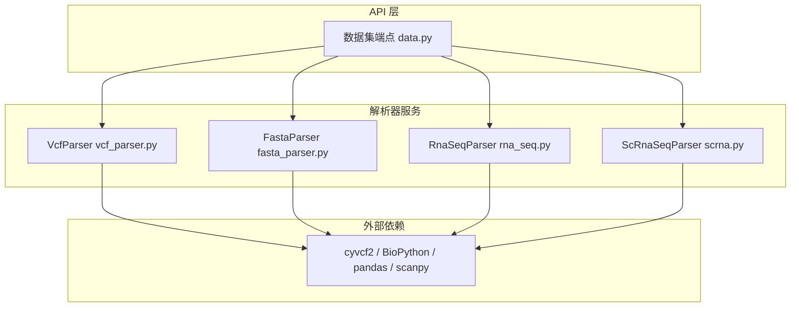
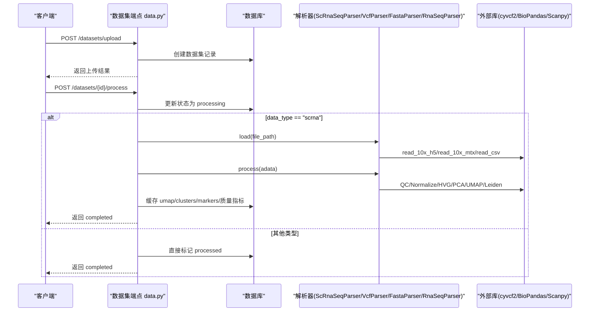
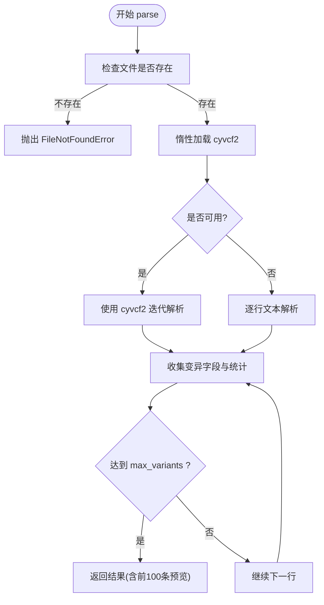
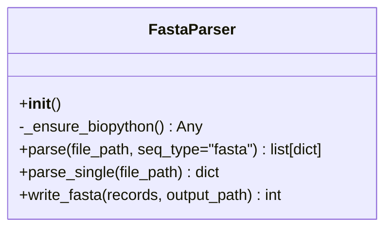
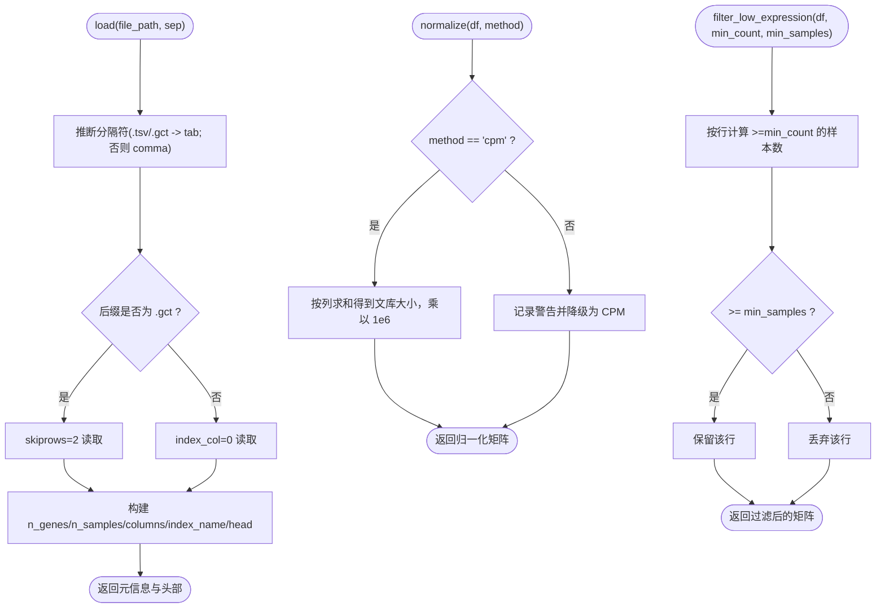
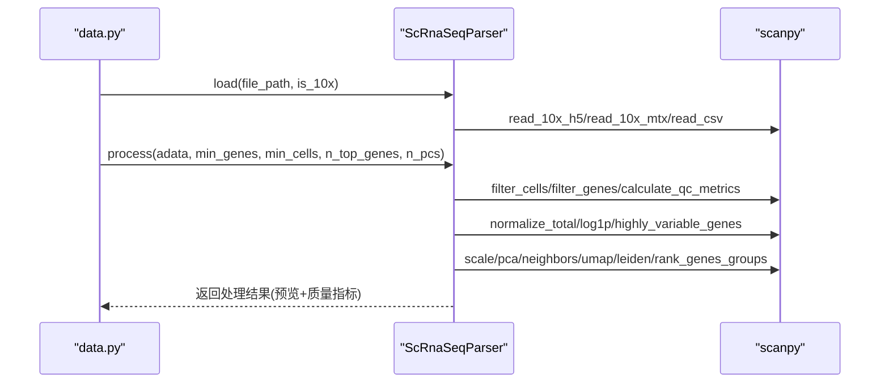
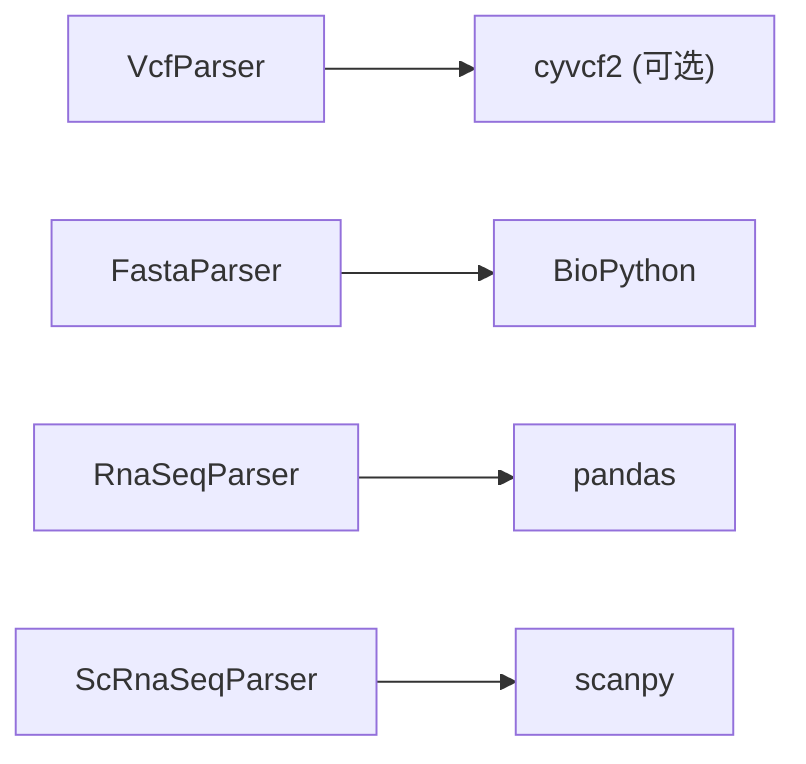

# 多格式数据支持

<cite>
**本文引用的文件**   
- [vcf_parser.py](file://backend/app/services/parser/vcf_parser.py)
- [fasta_parser.py](file://backend/app/services/parser/fasta_parser.py)
- [rna_seq.py](file://backend/app/services/parser/rna_seq.py)
- [scrna.py](file://backend/app/services/parser/scrna.py)
- [data.py](file://backend/app/api/v1/data.py)
- [requirements.txt](file://backend/requirements.txt)
- [test_vcf_parser.py](file://tests/test_vcf_parser.py)
- [test_fasta_parser.py](file://tests/test_fasta_parser.py)
</cite>

## 目录
1. [简介](#简介)
2. [项目结构](#项目结构)
3. [核心组件](#核心组件)
4. [架构总览](#架构总览)
5. [详细组件分析](#详细组件分析)
6. [依赖关系分析](#依赖关系分析)
7. [性能与内存优化](#性能与内存优化)
8. [故障排查指南](#故障排查指南)
9. [结论](#结论)
10. [附录：字段定义与数据结构](#附录字段定义与数据结构)

## 简介
本文件面向数据处理流水线中的多格式数据支持，聚焦以下三类数据的解析与处理实现：
- VCF 变异文件解析（VCF 4.x）
- FASTA 序列文件格式处理（核酸/蛋白质）
- RNA-seq 批量表达数据处理（CSV/TSV/GCT）

文档将详细说明各格式的字段定义、数据结构、编码方式；提供格式转换工具、数据清洗方法、兼容性处理策略；并给出大文件处理优化、流式读取、内存高效算法的实现细节。

## 项目结构
与多格式数据支持相关的代码主要位于后端服务模块的解析器包中，并通过 API 层暴露上传与处理能力。

图表来源
- [data.py:191-254](file://backend/app/api/v1/data.py#L191-L254)
- [vcf_parser.py:14-87](file://backend/app/services/parser/vcf_parser.py#L14-L87)
- [fasta_parser.py:12-58](file://backend/app/services/parser/fasta_parser.py#L12-L58)
- [rna_seq.py:15-65](file://backend/app/services/parser/rna_seq.py#L15-L65)
- [scrna.py:13-73](file://backend/app/services/parser/scrna.py#L13-L73)

章节来源
- [data.py:44-121](file://backend/app/api/v1/data.py#L44-L121)
- [vcf_parser.py:14-87](file://backend/app/services/parser/vcf_parser.py#L14-L87)
- [fasta_parser.py:12-58](file://backend/app/services/parser/fasta_parser.py#L12-L58)
- [rna_seq.py:15-65](file://backend/app/services/parser/rna_seq.py#L15-L65)
- [scrna.py:13-73](file://backend/app/services/parser/scrna.py#L13-L73)

## 核心组件
- VcfParser：解析 VCF 4.x，优先使用 cyvcf2，未安装时回退到纯文本解析；返回变异列表、样本名、统计信息。
- FastaParser：基于 BioPython 解析 FASTA/GenBank 等序列记录，支持单条/批量读取与写入。
- RnaSeqParser：加载 CSV/TSV/GCT 表达矩阵，支持过滤低表达基因与归一化（CPM/TPM）。
- ScRnaSeqParser：封装 Scanpy 工作流，支持 10x MTX/HDF5/CSV 加载，执行质控、归一化、高变基因选择、降维与聚类，并提取标记基因。

章节来源
- [vcf_parser.py:14-87](file://backend/app/services/parser/vcf_parser.py#L14-L87)
- [fasta_parser.py:12-58](file://backend/app/services/parser/fasta_parser.py#L12-L58)
- [rna_seq.py:15-106](file://backend/app/services/parser/rna_seq.py#L15-L106)
- [scrna.py:13-134](file://backend/app/services/parser/scrna.py#L13-L134)

## 架构总览
从前端或客户端上传数据后，API 层负责校验、持久化与状态管理；针对特定数据类型触发相应解析器进行处理，结果缓存至数据库元数据以便后续查询。

图表来源
- [data.py:191-254](file://backend/app/api/v1/data.py#L191-L254)
- [scrna.py:38-134](file://backend/app/services/parser/scrna.py#L38-L134)

## 详细组件分析

### VCF 变异文件解析（VcfParser）
- 功能要点
  - 优先使用 cyvcf2 进行高性能解析；若未安装则回退到逐行文本解析。
  - 输出包含变异预览（前 100 条）、样本列表、按染色体与变异类型的计数统计。
  - 支持 max_variants 限制，避免一次性加载过多数据。
- 关键流程
  - 惰性加载 cyvcf2，失败时走 _parse_fallback。
  - 主路径：遍历 VCF 记录，收集 chrom/pos/id/ref/alt/qual/filter/type 等字段。
  - 降级路径：跳过注释头，解析 #CHROM 行获取样本列，逐行拆分字段。
- 错误与边界
  - 文件不存在抛出 FileNotFoundError。
  - 短行或缺失字段会被跳过。
  - ID 或 QUAL 为空值时以 None 表示。
- 测试覆盖
  - 验证缺失文件、空 ID/QUAL、样本提取、短行跳过、max_variants 限制、stats 提示等。

图表来源
- [vcf_parser.py:32-87](file://backend/app/services/parser/vcf_parser.py#L32-L87)
- [vcf_parser.py:89-135](file://backend/app/services/parser/vcf_parser.py#L89-L135)

章节来源
- [vcf_parser.py:14-135](file://backend/app/services/parser/vcf_parser.py#L14-L135)
- [test_vcf_parser.py:14-106](file://tests/test_vcf_parser.py#L14-L106)

### FASTA 序列文件格式处理（FastaParser）
- 功能要点
  - 基于 BioPython SeqIO 解析 FASTA/GenBank 等格式，返回 id/name/description/sequence/length/annotations。
  - 支持单条序列快速读取与批量写入（每行 80 字符换行）。
- 关键流程
  - 惰性加载 BioPython；文件不存在抛错；空文件在单条读取时报 ValueError。
  - write_fasta 静态方法无需外部依赖，直接写标准 FASTA。
- 错误与边界
  - 未安装 BioPython 抛出 RuntimeError。
  - 空文件在 parse_single 时抛出 ValueError。
- 测试覆盖
  - 验证写入多条记录、长序列自动换行、父目录自动创建、缺失文件与空文件异常、未安装依赖异常。

图表来源
- [fasta_parser.py:12-100](file://backend/app/services/parser/fasta_parser.py#L12-L100)

章节来源
- [fasta_parser.py:12-100](file://backend/app/services/parser/fasta_parser.py#L12-L100)
- [test_fasta_parser.py:12-94](file://tests/test_fasta_parser.py#L12-L94)

### RNA-seq 批量表达数据处理（RnaSeqParser）
- 功能要点
  - 支持 CSV/TSV/GCT 三种输入；自动推断分隔符；GCT 跳过前两行标题。
  - 提供过滤低表达基因与归一化（CPM/TPM），其中 TPM 需要基因长度，当前简化为 CPM。
- 关键流程
  - load：根据扩展名选择分隔符与索引列，返回维度、列名、头部样例。
  - normalize：CPM 按样本文库大小缩放；TPM 降级为 CPM 并记录警告。
  - filter_low_expression：按最小计数与最少样本数筛选基因。
- 错误与边界
  - 文件不存在抛 FileNotFoundError。
  - 未安装 pandas 抛 RuntimeError。
- 使用建议
  - 对于大规模矩阵，建议使用分块读取或稀疏存储（见“性能与内存优化”）。

图表来源
- [rna_seq.py:32-106](file://backend/app/services/parser/rna_seq.py#L32-L106)

章节来源
- [rna_seq.py:15-106](file://backend/app/services/parser/rna_seq.py#L15-L106)

### scRNA-seq 数据处理（ScRnaSeqParser）
- 功能要点
  - 支持 10x HDF5/MTX 目录与 CSV 加载；封装标准预处理流程：QC、归一化、高变基因、PCA、邻居图、UMAP、Leiden 聚类、标记基因提取。
  - 返回处理后细胞/基因数量、聚类数、UMAP 坐标预览、标记基因与质量指标。
- 关键流程
  - load：根据后缀选择读取函数，返回 AnnData 对象及基本信息。
  - process：执行完整管线，提取 marker_genes 并裁剪预览数据。
- 错误与边界
  - 不支持的文件后缀抛 ValueError。
  - 未安装 scanpy 抛 RuntimeError。
- 集成点
  - API 层在 data_type=="scrna" 时调用该解析器，并将结果缓存至 dataset.metadata_。

图表来源
- [scrna.py:38-134](file://backend/app/services/parser/scrna.py#L38-L134)
- [data.py:216-247](file://backend/app/api/v1/data.py#L216-L247)

章节来源
- [scrna.py:13-160](file://backend/app/services/parser/scrna.py#L13-L160)
- [data.py:216-247](file://backend/app/api/v1/data.py#L216-L247)

## 依赖关系分析
- 运行时依赖
  - cyvcf2：VCF 高性能解析（可选，未安装则回退）。
  - BioPython：FASTA/GenBank 解析。
  - pandas：表达矩阵读写与基础运算。
  - scanpy：scRNA-seq 全流程处理。
- 版本约束
  - requirements.txt 指定了各库的版本范围，确保环境一致性。

图表来源
- [requirements.txt:12-23](file://backend/requirements.txt#L12-L23)
- [vcf_parser.py:21-30](file://backend/app/services/parser/vcf_parser.py#L21-L30)
- [fasta_parser.py:19-27](file://backend/app/services/parser/fasta_parser.py#L19-L27)
- [rna_seq.py:22-30](file://backend/app/services/parser/rna_seq.py#L22-L30)
- [scrna.py:28-36](file://backend/app/services/parser/scrna.py#L28-L36)

章节来源
- [requirements.txt:12-23](file://backend/requirements.txt#L12-L23)

## 性能与内存优化
- 大文件与流式读取
  - VCF：通过 cyvcf2 迭代器逐条解析，结合 max_variants 控制内存占用；回退路径也采用逐行读取，避免一次性载入。
  - FASTA：BioPython 的 parse 为迭代器，适合流式处理；write_fasta 按 80 字符分行写入，兼容主流工具。
  - RNA-seq：当前使用 pandas 全量读取，建议在超大规模场景下改用分块读取（如 chunksize）或 pyarrow/parquet 格式以提升 I/O 效率。
- 内存高效算法
  - 表达矩阵归一化：CPM 仅按列聚合，时间复杂度 O(G×S)，空间取决于 DataFrame 布局；可考虑稀疏矩阵（如 scipy.sparse）降低内存。
  - scRNA-seq：Scanpy 内部对 AnnData 使用稀疏存储，配合 cache=True 减少磁盘 IO；UMAP/Leiden 等步骤可按需调整参数控制资源消耗。
- 并发与并行
  - ScRnaSeqParser 初始化支持 n_jobs 参数，便于利用多核加速部分操作（具体由底层库决定）。
- 兼容性策略
  - 惰性加载与回退机制：当可选依赖不可用时，自动降级到更保守的实现，保证基本可用性。
  - 字段容错：VCF 解析中对缺失字段（如 ID、QUAL）做安全处理；短行被忽略。

章节来源
- [vcf_parser.py:32-87](file://backend/app/services/parser/vcf_parser.py#L32-L87)
- [fasta_parser.py:74-100](file://backend/app/services/parser/fasta_parser.py#L74-L100)
- [rna_seq.py:67-106](file://backend/app/services/parser/rna_seq.py#L67-L106)
- [scrna.py:19-36](file://backend/app/services/parser/scrna.py#L19-L36)

## 故障排查指南
- 常见异常与定位
  - FileNotFoundError：文件路径错误或权限不足。检查 API 保存路径与数据集记录。
  - RuntimeError（缺少依赖）：确认已安装对应库（biopython、pandas、scanpy、cyvcf2）。
  - ValueError（空文件或非法格式）：FASTA 空文件、scRNA-seq 不支持的后缀。
- 日志与诊断
  - 使用 loguru 记录警告与异常，便于追踪回退路径与降级行为。
- 复现与验证
  - 参考单元测试用例，构造最小可复现场景（如临时文件、Mock 依赖）。

章节来源
- [test_vcf_parser.py:14-106](file://tests/test_vcf_parser.py#L14-L106)
- [test_fasta_parser.py:53-94](file://tests/test_fasta_parser.py#L53-L94)

## 结论
本项目在多格式数据支持方面提供了稳健的解析与处理组件：
- VCF 解析具备高性能与回退能力，满足变异位点快速预览与统计需求。
- FASTA 解析与写入遵循标准规范，便于与其他生物信息学工具链集成。
- RNA-seq 与 scRNA-seq 处理覆盖了从加载、清洗、归一化到降维聚类的常用流程，并通过 API 层将结果持久化与可视化。
未来可在大数据场景引入分块读取、稀疏存储与异步任务队列，进一步提升吞吐与可扩展性。

## 附录：字段定义与数据结构
- VCF 解析输出字段（示例）
  - variants[].chrom：染色体名称
  - variants[].pos：位置（整数）
  - variants[].id：变异标识（可为空）
  - variants[].ref：参考碱基
  - variants[].alt：替代碱基（逗号分隔多个）
  - variants[].qual：质量分数（可为空）
  - variants[].filter：过滤标志
  - variants[].type：变异类型（由 cyvcf2 推断，回退时为 unknown）
  - samples[]：样本名列表
  - stats.by_chromosome/by_type：计数统计
- FASTA 解析输出字段（示例）
  - id：序列标识
  - name：序列名称
  - description：描述信息
  - sequence：序列字符串
  - length：序列长度
  - annotations：注释字典（若有）
- RNA-seq 加载输出字段（示例）
  - n_genes：基因行数
  - n_samples：样本列数
  - columns：样本列名
  - index_name：行索引名称
  - head：头部样例（DataFrame.to_dict）
- scRNA-seq 处理输出字段（示例）
  - n_cells_after_qc/n_genes_after_qc：质控后细胞/基因数
  - n_clusters：聚类数
  - umap_coords/clusters：UMAP 坐标与聚类标签（前 100 条预览）
  - marker_genes：标记基因列表（cluster/gene/score）
  - quality_metrics：质量指标（每细胞基因数中位数、计数中位数、最大线粒体比例）

章节来源
- [vcf_parser.py:67-87](file://backend/app/services/parser/vcf_parser.py#L67-L87)
- [fasta_parser.py:48-58](file://backend/app/services/parser/fasta_parser.py#L48-L58)
- [rna_seq.py:59-65](file://backend/app/services/parser/rna_seq.py#L59-L65)
- [scrna.py:122-134](file://backend/app/services/parser/scrna.py#L122-L134)