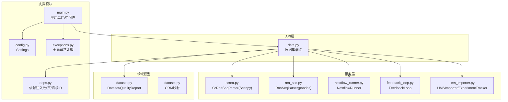
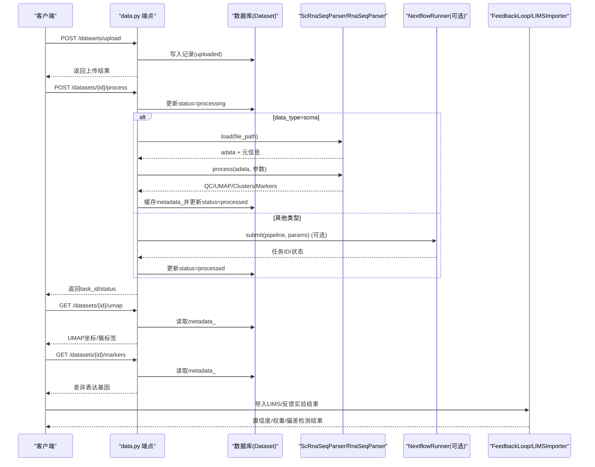
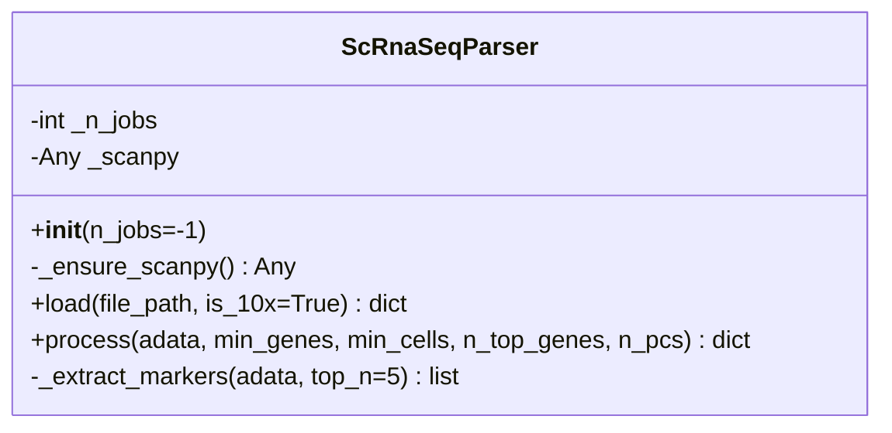
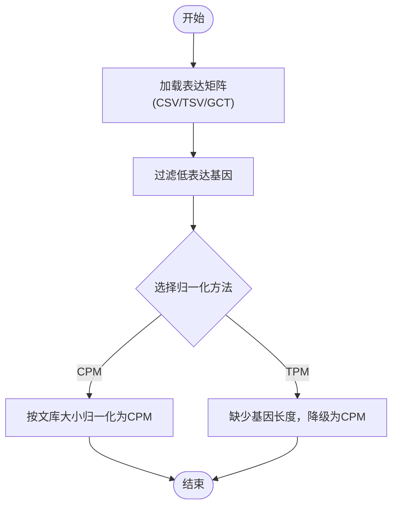
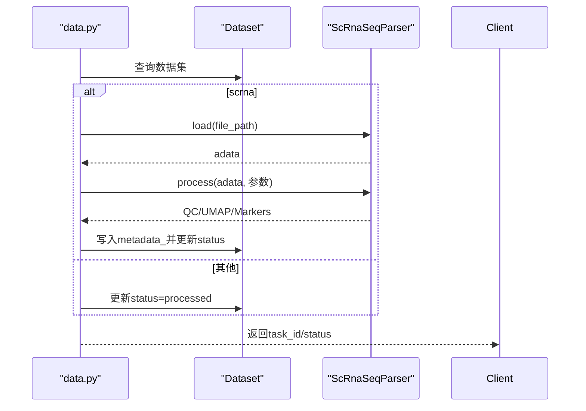
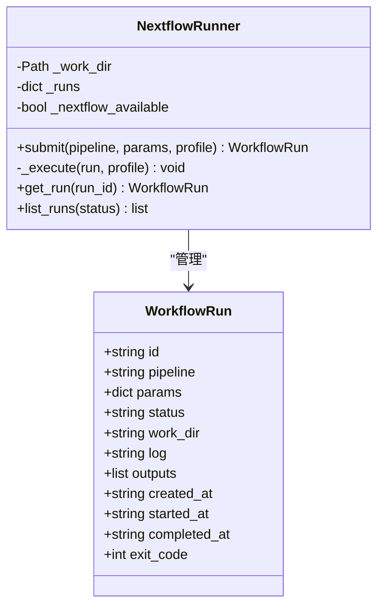
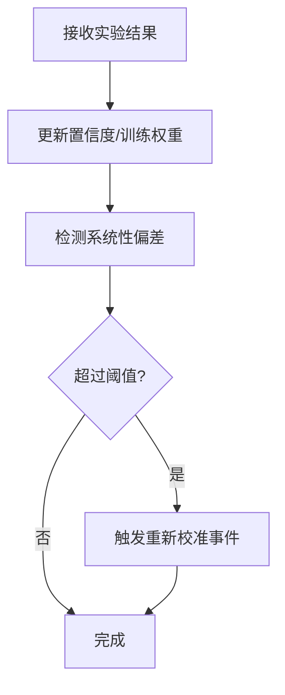
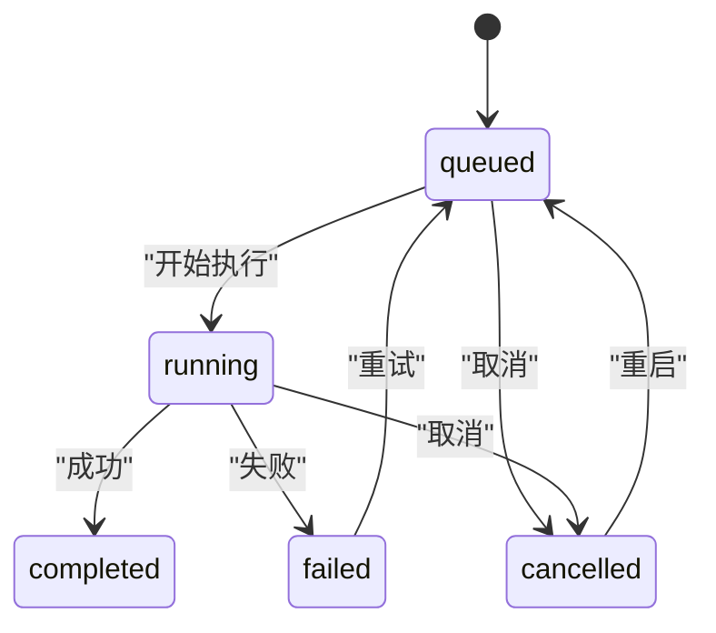
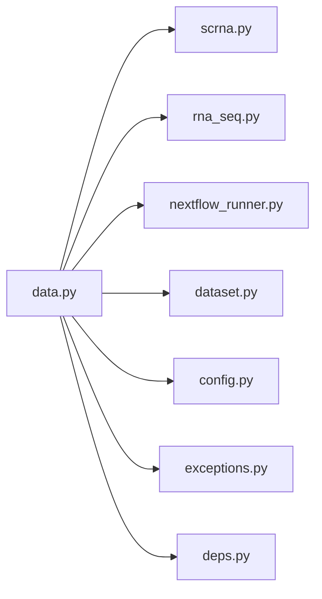

# 数据处理流水线

<cite>
**本文引用的文件**   
- [backend/app/main.py](file://backend/app/main.py)
- [backend/app/api/v1/data.py](file://backend/app/api/v1/data.py)
- [backend/app/services/parser/scrna.py](file://backend/app/services/parser/scrna.py)
- [backend/app/services/parser/rna_seq.py](file://backend/app/services/parser/rna_seq.py)
- [backend/app/models/dataset.py](file://backend/app/models/dataset.py)
- [backend/app/schemas/dataset.py](file://backend/app/schemas/dataset.py)
- [backend/app/core/config.py](file://backend/app/core/config.py)
- [backend/app/core/exceptions.py](file://backend/app/core/exceptions.py)
- [backend/app/core/deps.py](file://backend/app/core/deps.py)
- [backend/app/services/workflow/nextflow_runner.py](file://backend/app/services/workflow/nextflow_runner.py)
- [backend/app/services/workflow/feedback_loop.py](file://backend/app/services/workflow/feedback_loop.py)
- [backend/app/services/workflow/lims_importer.py](file://backend/app/services/workflow/lims_importer.py)
</cite>

## 目录
1. [简介](#简介)
2. [项目结构](#项目结构)
3. [核心组件](#核心组件)
4. [架构总览](#架构总览)
5. [详细组件分析](#详细组件分析)
6. [依赖关系分析](#依赖关系分析)
7. [性能与优化](#性能与优化)
8. [故障排查指南](#故障排查指南)
9. [结论](#结论)
10. [附录：配置参数与API参考](#附录配置参数与api参考)

## 简介
本文件面向AI药物设计系统的数据处理流水线，覆盖从数据上传、验证、质量控制、预处理、标准化、特征提取到可视化的完整流程。重点说明scRNA-seq的Scanpy工作流（细胞过滤、基因过滤、归一化、高变基因选择、降维聚类），并提供流水线配置参数、性能优化策略、错误处理与重试机制、异步任务调度、批量处理与进度跟踪的实现细节与扩展建议。

## 项目结构
后端采用FastAPI应用，提供数据集上传、列表、详情、触发处理、UMAP坐标与标记基因查询等接口；解析器封装了scRNA-seq与bulk RNA-seq的处理逻辑；模型与Schema定义数据库结构与请求/响应契约；配置中心集中管理环境变量；异常处理器统一错误信封；工作流运行器支持Nextflow执行与模拟模式；反馈闭环与LIMS导入用于干湿实验数据回流与状态追踪。

图表来源
- [backend/app/api/v1/data.py:1-369](file://backend/app/api/v1/data.py#L1-L369)
- [backend/app/services/parser/scrna.py:1-160](file://backend/app/services/parser/scrna.py#L1-L160)
- [backend/app/services/parser/rna_seq.py:1-106](file://backend/app/services/parser/rna_seq.py#L1-L106)
- [backend/app/services/workflow/nextflow_runner.py:1-173](file://backend/app/services/workflow/nextflow_runner.py#L1-L173)
- [backend/app/services/workflow/feedback_loop.py:1-281](file://backend/app/services/workflow/feedback_loop.py#L1-L281)
- [backend/app/services/workflow/lims_importer.py:1-369](file://backend/app/services/workflow/lims_importer.py#L1-L369)
- [backend/app/models/dataset.py:1-70](file://backend/app/models/dataset.py#L1-L70)
- [backend/app/main.py:1-248](file://backend/app/main.py#L1-L248)
- [backend/app/core/config.py:1-144](file://backend/app/core/config.py#L1-L144)
- [backend/app/core/exceptions.py:1-179](file://backend/app/core/exceptions.py#L1-L179)
- [backend/app/core/deps.py:1-129](file://backend/app/core/deps.py#L1-L129)

章节来源
- [backend/app/main.py:187-248](file://backend/app/main.py#L187-L248)
- [backend/app/api/v1/data.py:54-121](file://backend/app/api/v1/data.py#L54-L121)
- [backend/app/services/parser/scrna.py:13-160](file://backend/app/services/parser/scrna.py#L13-L160)
- [backend/app/services/parser/rna_seq.py:15-106](file://backend/app/services/parser/rna_seq.py#L15-L106)
- [backend/app/models/dataset.py:15-70](file://backend/app/models/dataset.py#L15-L70)
- [backend/app/core/config.py:21-144](file://backend/app/core/config.py#L21-L144)
- [backend/app/core/exceptions.py:131-179](file://backend/app/core/exceptions.py#L131-L179)
- [backend/app/core/deps.py:67-129](file://backend/app/core/deps.py#L67-L129)

## 核心组件
- 应用入口与中间件：创建FastAPI实例，注册CORS、统一信封中间件、全局异常处理器，挂载v1路由与健康检查。
- 数据集API：提供上传、列表、详情、触发处理、UMAP/Markers/质量报告查询、删除等能力。
- scRNA-seq解析器：基于Scanpy实现加载、质控、归一化、高变基因选择、PCA/UMAP、Leiden聚类与标记基因提取。
- bulk RNA-seq解析器：基于pandas实现CSV/TSV/GCT加载、低表达过滤、CPM/TPM归一化。
- 工作流运行器：提交Nextflow任务、异步执行、日志收集、输出归档，未安装时进入模拟模式。
- 反馈闭环：接收湿实验结果，动态调整靶点置信度与训练权重，检测系统性偏差并触发重新校准。
- LIMS导入器：CSV/JSON导入、字段映射、去重、规范化、生命周期状态机。
- 配置与异常：集中式配置、统一错误信封与全局异常处理。

章节来源
- [backend/app/main.py:187-248](file://backend/app/main.py#L187-L248)
- [backend/app/api/v1/data.py:191-254](file://backend/app/api/v1/data.py#L191-L254)
- [backend/app/services/parser/scrna.py:75-134](file://backend/app/services/parser/scrna.py#L75-L134)
- [backend/app/services/parser/rna_seq.py:67-106](file://backend/app/services/parser/rna_seq.py#L67-L106)
- [backend/app/services/workflow/nextflow_runner.py:54-173](file://backend/app/services/workflow/nextflow_runner.py#L54-L173)
- [backend/app/services/workflow/feedback_loop.py:71-281](file://backend/app/services/workflow/feedback_loop.py#L71-L281)
- [backend/app/services/workflow/lims_importer.py:100-369](file://backend/app/services/workflow/lims_importer.py#L100-L369)
- [backend/app/core/config.py:21-144](file://backend/app/core/config.py#L21-L144)
- [backend/app/core/exceptions.py:131-179](file://backend/app/core/exceptions.py#L131-L179)

## 架构总览
下图展示从客户端发起上传到触发处理、解析与可视化结果返回的整体调用链。

图表来源
- [backend/app/api/v1/data.py:54-121](file://backend/app/api/v1/data.py#L54-L121)
- [backend/app/api/v1/data.py:191-254](file://backend/app/api/v1/data.py#L191-L254)
- [backend/app/api/v1/data.py:257-306](file://backend/app/api/v1/data.py#L257-L306)
- [backend/app/services/parser/scrna.py:38-134](file://backend/app/services/parser/scrna.py#L38-L134)
- [backend/app/services/workflow/nextflow_runner.py:76-159](file://backend/app/services/workflow/nextflow_runner.py#L76-L159)
- [backend/app/services/workflow/feedback_loop.py:99-163](file://backend/app/services/workflow/feedback_loop.py#L99-L163)
- [backend/app/services/workflow/lims_importer.py:112-243](file://backend/app/services/workflow/lims_importer.py#L112-L243)

## 详细组件分析

### scRNA-seq 解析器（Scanpy）
- 功能要点
  - 惰性加载scanpy，避免启动开销。
  - 支持10x MTX/HDF5/CSV格式加载，返回AnnData对象及维度信息。
  - 标准预处理：细胞/基因过滤、线粒体基因比例计算、总计数归一化与log1p、高变基因选择、缩放、PCA、邻居构建、UMAP、Leiden聚类、rank_genes_groups。
  - 提取每个聚类的Top标记基因。
- 关键参数
  - min_genes、min_cells：质控阈值。
  - n_top_genes：高变基因数量。
  - n_pcs：主成分数。
- 复杂度与性能
  - 时间复杂度主要受n_cells×n_vars矩阵运算影响；PCA/UMAP/Leiden为近似算法，适合大规模数据。
  - 可通过n_jobs与Dask集成提升并行性（见配置）。
- 错误处理
  - 文件不存在或格式不支持抛出明确异常；scanpy缺失时抛出运行时异常。

图表来源
- [backend/app/services/parser/scrna.py:13-160](file://backend/app/services/parser/scrna.py#L13-L160)

章节来源
- [backend/app/services/parser/scrna.py:28-36](file://backend/app/services/parser/scrna.py#L28-L36)
- [backend/app/services/parser/scrna.py:38-73](file://backend/app/services/parser/scrna.py#L38-L73)
- [backend/app/services/parser/scrna.py:75-134](file://backend/app/services/parser/scrna.py#L75-L134)
- [backend/app/services/parser/scrna.py:136-159](file://backend/app/services/parser/scrna.py#L136-L159)

### bulk RNA-seq 解析器（pandas）
- 功能要点
  - 支持CSV/TSV/GCT加载，自动推断分隔符。
  - 低表达过滤：按最小计数与最小样本数筛选。
  - 归一化：CPM；TPM需基因长度，当前降级为CPM并记录警告。
- 适用场景
  - 批量样本表达矩阵快速清洗与标准化，便于后续差异表达分析。

图表来源
- [backend/app/services/parser/rna_seq.py:32-65](file://backend/app/services/parser/rna_seq.py#L32-L65)
- [backend/app/services/parser/rna_seq.py:67-106](file://backend/app/services/parser/rna_seq.py#L67-L106)

章节来源
- [backend/app/services/parser/rna_seq.py:15-106](file://backend/app/services/parser/rna_seq.py#L15-L106)

### 数据集API与处理编排
- 上传流程
  - 校验data_type与扩展名，计算文件大小与SHA256，持久化记录与物理文件。
- 处理流程
  - 将数据集状态置为processing；若类型为scrna，则调用ScRnaSeqParser.load/process，并将QC指标、UMAP坐标、聚类标签、标记基因与质量指标缓存至metadata_，最终置为processed；失败回退为uploaded。
  - 非scrna类型直接置为processed（可扩展为Nextflow任务）。
- 查询接口
  - UMAP与Markers直接从metadata_读取；质量报告由独立表维护。

图表来源
- [backend/app/api/v1/data.py:191-254](file://backend/app/api/v1/data.py#L191-L254)
- [backend/app/services/parser/scrna.py:38-134](file://backend/app/services/parser/scrna.py#L38-L134)

章节来源
- [backend/app/api/v1/data.py:54-121](file://backend/app/api/v1/data.py#L54-L121)
- [backend/app/api/v1/data.py:191-254](file://backend/app/api/v1/data.py#L191-L254)
- [backend/app/api/v1/data.py:257-306](file://backend/app/api/v1/data.py#L257-L306)
- [backend/app/models/dataset.py:15-47](file://backend/app/models/dataset.py#L15-L47)

### Nextflow 工作流运行器
- 功能要点
  - 提交工作流、异步执行、日志聚合、输出文件列表。
  - 未安装nextflow时进入模拟模式，保证可测试性与开发体验。
- 使用方式
  - 在数据处理的非scrna分支中，可接入Nextflow以执行更复杂的生信流水线。

图表来源
- [backend/app/services/workflow/nextflow_runner.py:23-173](file://backend/app/services/workflow/nextflow_runner.py#L23-L173)

章节来源
- [backend/app/services/workflow/nextflow_runner.py:54-173](file://backend/app/services/workflow/nextflow_runner.py#L54-L173)

### 干湿闭环反馈机制
- 功能要点
  - 吸收湿实验结果，动态调整靶点置信度与训练权重。
  - 检测系统性偏差（失败率阈值+最小样本数），触发模型重新校准事件。
- 输出
  - 新置信度、训练权重、偏差检测结果、是否触发重新校准。

图表来源
- [backend/app/services/workflow/feedback_loop.py:99-163](file://backend/app/services/workflow/feedback_loop.py#L99-L163)
- [backend/app/services/workflow/feedback_loop.py:165-206](file://backend/app/services/workflow/feedback_loop.py#L165-L206)
- [backend/app/services/workflow/feedback_loop.py:208-231](file://backend/app/services/workflow/feedback_loop.py#L208-L231)

章节来源
- [backend/app/services/workflow/feedback_loop.py:71-281](file://backend/app/services/workflow/feedback_loop.py#L71-L281)

### LIMS 导入器与实验状态机
- 功能要点
  - CSV/JSON导入、字段映射、去重、规范化outcome与时间戳。
  - 实验状态机：queued→running→completed/failed/cancelled，支持重试与重启。
- 用途
  - 将外部实验室数据标准化后接入反馈闭环或下游分析。

图表来源
- [backend/app/services/workflow/lims_importer.py:279-369](file://backend/app/services/workflow/lims_importer.py#L279-L369)

章节来源
- [backend/app/services/workflow/lims_importer.py:100-277](file://backend/app/services/workflow/lims_importer.py#L100-L277)
- [backend/app/services/workflow/lims_importer.py:279-369](file://backend/app/services/workflow/lims_importer.py#L279-L369)

## 依赖关系分析
- 组件耦合
  - API层依赖解析器与工作流运行器，通过数据库持久化状态与结果。
  - 解析器对第三方库（scanpy/pandas）惰性加载，降低启动成本。
  - 配置与异常处理贯穿全链路，确保一致性与可观测性。
- 外部依赖
  - scanpy、pandas、SQLAlchemy、FastAPI、Pydantic Settings、Loguru。
- 潜在循环依赖
  - 当前分层清晰，未见循环导入；解析器仅被API层调用。

图表来源
- [backend/app/api/v1/data.py:1-369](file://backend/app/api/v1/data.py#L1-L369)
- [backend/app/services/parser/scrna.py:1-160](file://backend/app/services/parser/scrna.py#L1-L160)
- [backend/app/services/parser/rna_seq.py:1-106](file://backend/app/services/parser/rna_seq.py#L1-L106)
- [backend/app/services/workflow/nextflow_runner.py:1-173](file://backend/app/services/workflow/nextflow_runner.py#L1-L173)
- [backend/app/models/dataset.py:1-70](file://backend/app/models/dataset.py#L1-L70)
- [backend/app/core/config.py:1-144](file://backend/app/core/config.py#L1-L144)
- [backend/app/core/exceptions.py:1-179](file://backend/app/core/exceptions.py#L1-L179)
- [backend/app/core/deps.py:1-129](file://backend/app/core/deps.py#L1-L129)

章节来源
- [backend/app/api/v1/data.py:1-369](file://backend/app/api/v1/data.py#L1-L369)
- [backend/app/services/parser/scrna.py:1-160](file://backend/app/services/parser/scrna.py#L1-L160)
- [backend/app/services/parser/rna_seq.py:1-106](file://backend/app/services/parser/rna_seq.py#L1-L106)
- [backend/app/services/workflow/nextflow_runner.py:1-173](file://backend/app/services/workflow/nextflow_runner.py#L1-L173)
- [backend/app/models/dataset.py:1-70](file://backend/app/models/dataset.py#L1-L70)
- [backend/app/core/config.py:1-144](file://backend/app/core/config.py#L1-L144)
- [backend/app/core/exceptions.py:1-179](file://backend/app/core/exceptions.py#L1-L179)
- [backend/app/core/deps.py:1-129](file://backend/app/core/deps.py#L1-L129)

## 性能与优化
- 并发与并行
  - Scanpy解析器支持n_jobs参数，结合配置项scanpy_n_jobs与scanpy_use_dask启用分布式加速。
  - NextflowRunner异步提交任务，避免阻塞HTTP线程。
- I/O与存储
  - 大文件上传先落盘再处理，减少内存峰值；metadata_缓存轻量结果，避免重复计算。
- 资源控制
  - 限制UMAP坐标返回规模（仅前100个预览），降低前端渲染压力。
- 扩展建议
  - 引入消息队列（如Redis/RabbitMQ）进行任务排队与重试；结合Celery或RQ实现可靠调度。
  - 对大数据集启用分块处理与增量计算，结合Dask或Spark。
  - 增加GPU加速（如UMAP GPU版）与内存映射（HDF5/Zarr）以降低内存占用。

[本节为通用指导，不直接分析具体文件]

## 故障排查指南
- 常见错误
  - 文件格式不支持或路径不存在：解析器会抛出明确异常，API层捕获后返回业务错误信封。
  - 外部依赖缺失（scanpy/pandas）：惰性加载阶段抛出运行时异常，需检查环境依赖。
  - 上游服务不可用：Nextflow未安装时进入模拟模式，生产环境需部署真实Nextflow。
- 日志与追踪
  - 全局中间件注入X-Request-ID与耗时头，便于端到端追踪。
  - 异常处理器统一返回信封格式，包含错误码、消息与详情。
- 重试与恢复
  - 当前处理为同步内联执行，建议在API层引入任务队列与幂等键，支持失败重试与断点续跑。
  - 利用LIMS状态机与反馈闭环记录失败原因与重试次数。

章节来源
- [backend/app/main.py:29-185](file://backend/app/main.py#L29-L185)
- [backend/app/core/exceptions.py:131-179](file://backend/app/core/exceptions.py#L131-L179)
- [backend/app/services/parser/scrna.py:28-36](file://backend/app/services/parser/scrna.py#L28-L36)
- [backend/app/services/parser/rna_seq.py:22-30](file://backend/app/services/parser/rna_seq.py#L22-L30)
- [backend/app/services/workflow/nextflow_runner.py:68-74](file://backend/app/services/workflow/nextflow_runner.py#L68-L74)

## 结论
该数据处理流水线以FastAPI为核心，结合Scanpy与pandas实现scRNA-seq与bulk RNA-seq的标准分析流程，并通过Nextflow扩展复杂生信任务。统一的配置、异常处理与中间件保障了系统的可观测性与健壮性。未来可通过引入消息队列、分布式计算与GPU加速进一步提升吞吐与稳定性，同时完善进度跟踪与重试机制以满足生产级SLA要求。

[本节为总结，不直接分析具体文件]

## 附录：配置参数与API参考

### 配置参数（部分）
- 应用与环境
  - app_name、app_version、app_env、app_debug、app_host、app_port、app_log_level
- 数据库与缓存
  - database_url、database_echo、redis_url
- 对象存储
  - s3_endpoint、s3_access_key、s3_secret_key、s3_bucket、s3_region
- 向量库与LLM
  - chroma_persist_dir、openai_api_key、anthropic_api_key、llm_default_model、llm_deep_model、llm_max_budget_usd、llm_quick_budget_usd
- NVIDIA NIM
  - nim_api_key、nim_diffdock_url
- 外部知识库
  - mygene_base_url、myvariant_base_url、chembl_base_url、pubmed_base_url、clinical_trials_url
- NCBI
  - ncbi_email
- 认证
  - jwt_secret_key、jwt_algorithm、jwt_access_token_expire_minutes、jwt_refresh_token_expire_days
- CORS
  - cors_origins（逗号分隔字符串，内部转换为列表）
- 联邦学习与隐私
  - flower_server_address、flower_num_rounds、pysyft_domain_port、pysyft_domain_name
- CDISC
  - cdisc_sdtm_output_dir、pinnacle21_jar_path
- 干湿闭环
  - lims_api_url、lims_api_token
- 数据处理
  - scanpy_n_jobs、scanpy_use_dask、dask_dashboard_address
- 数据目录
  - data_raw_dir、data_processed_dir

章节来源
- [backend/app/core/config.py:21-144](file://backend/app/core/config.py#L21-L144)

### API端点（节选）
- POST /api/v1/datasets/upload
  - 表单字段：file、project_id、name、data_type、metadata
  - 行为：校验类型与扩展名，计算checksum，保存文件，写入数据库，返回上传结果
- GET /api/v1/datasets
  - 查询参数：project_id、data_type、status、page、page_size
  - 行为：分页列出数据集
- GET /api/v1/datasets/{id}
  - 行为：返回数据集详情
- POST /api/v1/datasets/{id}/process
  - 请求体：pipeline、params
  - 行为：scrna类型调用Scanpy处理并缓存结果；其他类型可直接标记为已处理或提交Nextflow任务
- GET /api/v1/datasets/{id}/umap
  - 行为：返回UMAP坐标与簇标签（来自metadata_）
- GET /api/v1/datasets/{id}/markers
  - 行为：返回差异表达基因（来自metadata_）
- GET /api/v1/datasets/{id}/quality
  - 行为：返回质量报告（来自quality_report表）
- DELETE /api/v1/datasets/{id}
  - 行为：删除数据库记录与物理文件

章节来源
- [backend/app/api/v1/data.py:54-121](file://backend/app/api/v1/data.py#L54-L121)
- [backend/app/api/v1/data.py:124-171](file://backend/app/api/v1/data.py#L124-L171)
- [backend/app/api/v1/data.py:174-188](file://backend/app/api/v1/data.py#L174-L188)
- [backend/app/api/v1/data.py:191-254](file://backend/app/api/v1/data.py#L191-L254)
- [backend/app/api/v1/data.py:257-306](file://backend/app/api/v1/data.py#L257-L306)
- [backend/app/api/v1/data.py:309-340](file://backend/app/api/v1/data.py#L309-L340)
- [backend/app/api/v1/data.py:343-369](file://backend/app/api/v1/data.py#L343-L369)