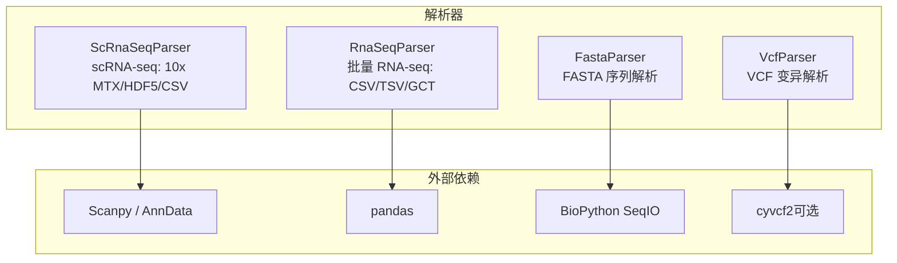
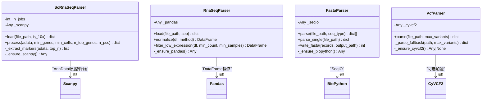
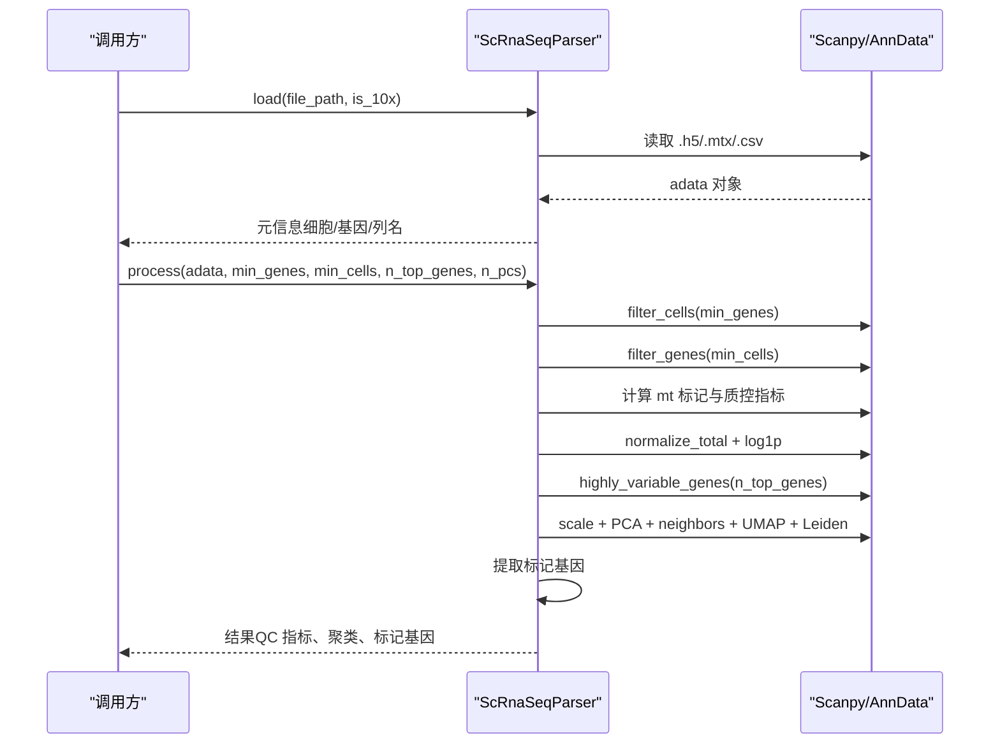
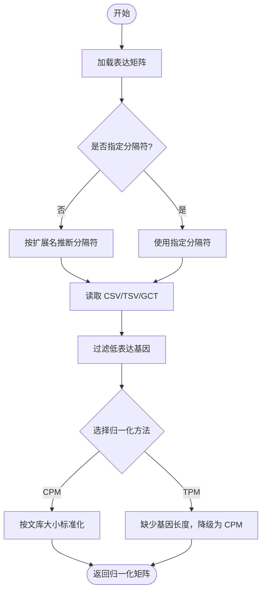
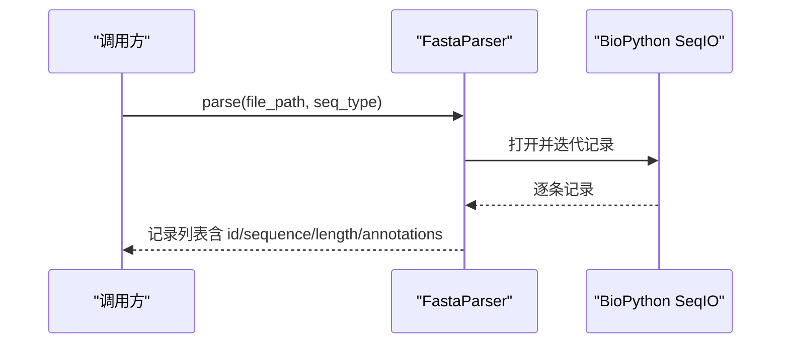
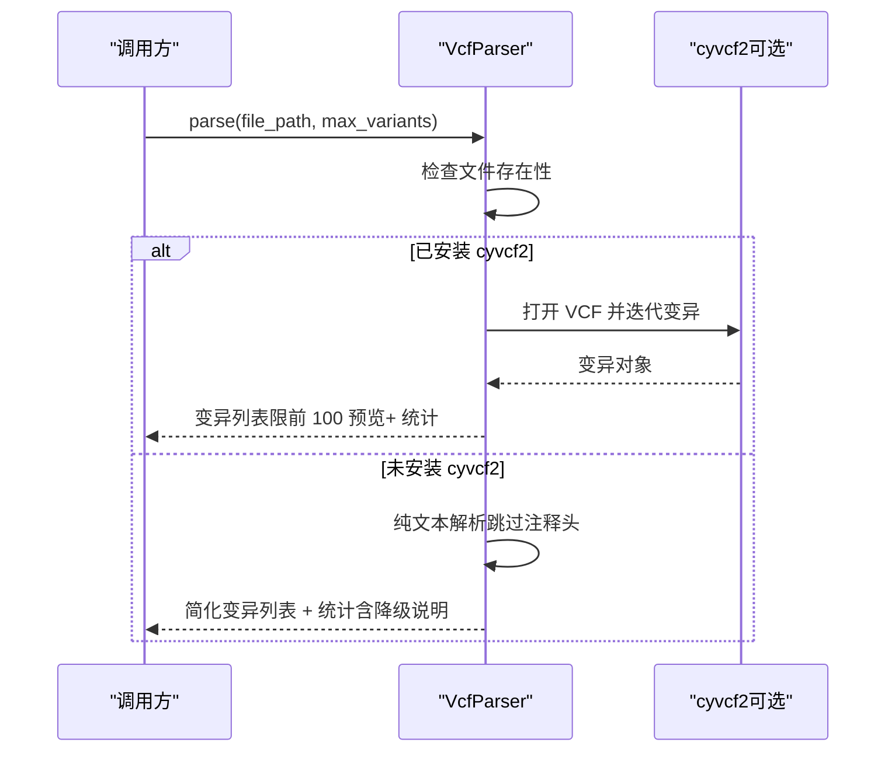
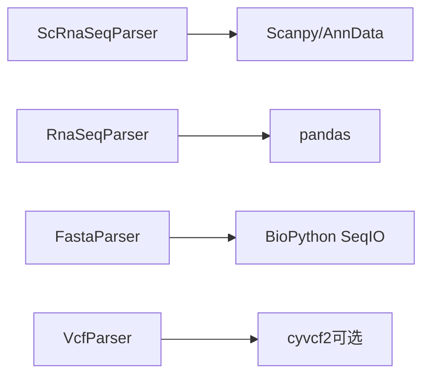

# 数据验证与质量控制

<cite>
**本文引用的文件**   
- [scrna.py](file://backend/app/services/parser/scrna.py)
- [rna_seq.py](file://backend/app/services/parser/rna_seq.py)
- [fasta_parser.py](file://backend/app/services/parser/fasta_parser.py)
- [vcf_parser.py](file://backend/app/services/parser/vcf_parser.py)
</cite>

## 目录
1. [引言](#引言)
2. [项目结构](#项目结构)
3. [核心组件](#核心组件)
4. [架构总览](#架构总览)
5. [详细组件分析](#详细组件分析)
6. [依赖关系分析](#依赖关系分析)
7. [性能考量](#性能考量)
8. [故障排查指南](#故障排查指南)
9. [结论](#结论)
10. [附录](#附录)

## 引言
本文件面向数据处理流水线中的“数据验证与质量控制”模块，聚焦生物医学多模态数据的输入校验、质控指标计算与异常处理策略。覆盖的数据类型包括：
- 单细胞转录组：10x MTX、10x HDF5、CSV
- 批量转录组：CSV/TSV/GCT
- 变异数据：VCF（支持 cyvcf2 加速与纯文本降级）
- 序列数据：FASTA（核酸/蛋白质）

文档将系统阐述各格式的验证规则、质控标准与阈值设置建议，解释细胞过滤、基因过滤、线粒体基因比例等关键指标的计算方法，并给出质量评估报告生成、异常检测与缺失值处理的实现细节与最佳实践。

## 项目结构
该模块位于后端服务解析层，按数据类型拆分为独立解析器类，遵循“惰性加载依赖 + 明确错误返回 + 可配置参数”的设计原则。

图表来源
- [scrna.py:1-160](file://backend/app/services/parser/scrna.py#L1-L160)
- [rna_seq.py:1-106](file://backend/app/services/parser/rna_seq.py#L1-L106)
- [fasta_parser.py:1-100](file://backend/app/services/parser/fasta_parser.py#L1-L100)
- [vcf_parser.py:1-136](file://backend/app/services/parser/vcf_parser.py#L1-L136)

章节来源
- [scrna.py:1-160](file://backend/app/services/parser/scrna.py#L1-L160)
- [rna_seq.py:1-106](file://backend/app/services/parser/rna_seq.py#L1-L106)
- [fasta_parser.py:1-100](file://backend/app/services/parser/fasta_parser.py#L1-L100)
- [vcf_parser.py:1-136](file://backend/app/services/parser/vcf_parser.py#L1-L136)

## 核心组件
- ScRnaSeqParser：封装 scRNA-seq 的加载、质控、归一化、高变基因选择、降维与聚类流程，输出质量指标与标记基因预览。
- RnaSeqParser：提供批量表达矩阵的加载、低表达过滤与归一化（CPM/TPM）。
- FastaParser：解析 FASTA 序列记录，支持批量读取与写入。
- VcfParser：解析 VCF 变异信息，优先使用 cyvcf2，未安装时回退到纯文本解析。

章节来源
- [scrna.py:13-160](file://backend/app/services/parser/scrna.py#L13-L160)
- [rna_seq.py:15-106](file://backend/app/services/parser/rna_seq.py#L15-L106)
- [fasta_parser.py:12-100](file://backend/app/services/parser/fasta_parser.py#L12-L100)
- [vcf_parser.py:14-136](file://backend/app/services/parser/vcf_parser.py#L14-L136)

## 架构总览
下图展示各解析器的职责边界与调用关系，以及对外暴露的接口与返回结构要点。

图表来源
- [scrna.py:13-160](file://backend/app/services/parser/scrna.py#L13-L160)
- [rna_seq.py:15-106](file://backend/app/services/parser/rna_seq.py#L15-L106)
- [fasta_parser.py:12-100](file://backend/app/services/parser/fasta_parser.py#L12-L100)
- [vcf_parser.py:14-136](file://backend/app/services/parser/vcf_parser.py#L14-L136)

## 详细组件分析

### 单细胞转录组（ScRnaSeqParser）
- 支持的输入格式与验证规则
  - 10x HDF5（.h5）：通过专用读取函数加载；若路径不存在或格式不匹配，抛出明确错误。
  - 10x MTX（.mtx 或目录）：根据 is_10x 决定根目录；var_names 指定为 gene_symbols。
  - CSV：直接读取为表达矩阵。
  - 不支持其他扩展名时抛出格式错误。
- 质控流程与指标
  - 细胞过滤：基于每个细胞的最低基因数阈值。
  - 基因过滤：基于每个基因的最低细胞数阈值。
  - 线粒体基因比例：依据基因名前缀识别线粒体基因，计算每细胞的线粒体计数占比。
  - 归一化：总计数标准化并对数变换。
  - 高变基因选择、缩放、PCA、邻域构建、UMAP 降维与 Leiden 聚类。
  - 标记基因提取：对每个聚类进行差异检验并取 Top N。
- 输出质量指标
  - QC 后细胞/基因数量、聚类数、UMAP 坐标与聚类标签预览、标记基因列表。
  - 质量统计：每细胞中位基因数、每细胞中位总计数、最大线粒体比例。
- 阈值设置建议
  - min_genes：常见范围 200–2500，视测序深度与组织类型调整。
  - min_cells：常见范围 3–10，避免稀有噪声基因保留。
  - n_top_genes：常见 1000–3000，平衡下游降维与计算成本。
  - n_pcs：常见 20–50，依数据复杂度与内存限制调整。
  - 线粒体比例阈值：通常以分布分位数或经验阈值（如 5%–20%）剔除高背景细胞。

图表来源
- [scrna.py:38-134](file://backend/app/services/parser/scrna.py#L38-L134)

章节来源
- [scrna.py:38-134](file://backend/app/services/parser/scrna.py#L38-L134)

### 批量转录组（RnaSeqParser）
- 支持的输入格式与验证规则
  - CSV/TSV/GCT：自动推断分隔符；GCT 跳过前两行注释头。
  - 路径不存在则抛出错误。
- 低表达过滤
  - 基于最小计数与最少样本数阈值，过滤低表达基因。
- 归一化
  - CPM：按样本文库大小标准化至每百万计数。
  - TPM：需要基因长度，当前实现简化为 CPM 并记录警告。
- 输出
  - 维度信息、列名、索引名与头部样例，便于快速校验。

图表来源
- [rna_seq.py:32-86](file://backend/app/services/parser/rna_seq.py#L32-L86)

章节来源
- [rna_seq.py:32-86](file://backend/app/services/parser/rna_seq.py#L32-L86)

### 序列数据（FastaParser）
- 支持的输入格式与验证规则
  - FASTA/GenBank 等：通过 SeqIO 解析；路径不存在或文件为空时抛出错误。
- 功能
  - 批量解析：返回每条记录的 id、name、description、sequence、length、annotations。
  - 单条解析：确保至少一条记录。
  - 写入：按 80 字符换行规范输出。
- 缺失值处理
  - 空文件直接报错，避免后续流程进入未知状态。

图表来源
- [fasta_parser.py:29-58](file://backend/app/services/parser/fasta_parser.py#L29-L58)

章节来源
- [fasta_parser.py:29-72](file://backend/app/services/parser/fasta_parser.py#L29-L72)

### 变异数据（VcfParser）
- 支持的输入格式与验证规则
  - VCF 4.x：优先使用 cyvcf2 高效解析；未安装时回退到纯文本解析。
  - 路径不存在则抛出错误。
- 解析内容
  - 变异字段：染色体、位置、ID、参考/替代等位基因、质量、过滤标志、类型。
  - 样本列表与统计：按染色体与变异类型的计数汇总。
- 降级策略
  - 当 cyvcf2 不可用时，按行解析表头与数据行，提取必要字段并标注“降级解析”。

图表来源
- [vcf_parser.py:32-87](file://backend/app/services/parser/vcf_parser.py#L32-L87)
- [vcf_parser.py:89-135](file://backend/app/services/parser/vcf_parser.py#L89-L135)

章节来源
- [vcf_parser.py:32-87](file://backend/app/services/parser/vcf_parser.py#L32-L87)
- [vcf_parser.py:89-135](file://backend/app/services/parser/vcf_parser.py#L89-L135)

## 依赖关系分析
- 外部库
  - Scanpy/AnnData：用于 scRNA-seq 全流程（加载、质控、降维、聚类）。
  - pandas：用于批量表达矩阵的读写与数值运算。
  - BioPython SeqIO：用于 FASTA/GenBank 等序列解析。
  - cyvcf2：用于高性能 VCF 解析（可选）。
- 耦合与内聚
  - 各解析器职责单一、内聚度高；对外仅暴露稳定接口，降低耦合。
  - 依赖惰性加载，减少启动开销与运行时错误传播。
- 潜在循环依赖
  - 无直接循环导入；各模块相互独立。

图表来源
- [scrna.py:28-36](file://backend/app/services/parser/scrna.py#L28-L36)
- [rna_seq.py:22-30](file://backend/app/services/parser/rna_seq.py#L22-L30)
- [fasta_parser.py:19-27](file://backend/app/services/parser/fasta_parser.py#L19-L27)
- [vcf_parser.py:21-30](file://backend/app/services/parser/vcf_parser.py#L21-L30)

章节来源
- [scrna.py:28-36](file://backend/app/services/parser/scrna.py#L28-L36)
- [rna_seq.py:22-30](file://backend/app/services/parser/rna_seq.py#L22-L30)
- [fasta_parser.py:19-27](file://backend/app/services/parser/fasta_parser.py#L19-L27)
- [vcf_parser.py:21-30](file://backend/app/services/parser/vcf_parser.py#L21-L30)

## 性能考量
- 单细胞流程
  - 高变基因选择与 PCA 的规模直接影响内存与时间；合理设置 n_top_genes 与 n_pcs。
  - UMAP/Leiden 在大规模数据上耗时较高，可先降采样预览再全量运行。
- 批量表达矩阵
  - CPM/TPM 向量化计算高效；大矩阵建议分块或增量处理。
- VCF 解析
  - cyvcf2 显著优于纯文本解析；大数据集务必启用。
- 惰性加载
  - 按需导入重型依赖，缩短冷启动时间。

[本节为通用指导，无需具体文件引用]

## 故障排查指南
- 文件不存在
  - 现象：所有解析器在路径不存在时抛出明确错误。
  - 处理：确认路径正确、权限可用、文件格式与扩展名一致。
- 依赖未安装
  - 现象：扫描 py/pandas/biopython/cyvcf2 未安装时抛出错误或降级。
  - 处理：安装对应依赖；对于 cyvcf2，未安装时将回退到纯文本解析但性能下降。
- 不支持的格式
  - 现象：scRNA-seq 加载时对未知扩展名抛出格式错误。
  - 处理：转换为支持的格式（.h5/.mtx/.csv）。
- 空文件或无效记录
  - 现象：FASTA 空文件抛错；VCF 降级解析可能丢失部分字段。
  - 处理：检查源数据完整性；必要时重新生成或修复。
- 阈值不合理导致数据过度过滤
  - 现象：细胞/基因被大量剔除，剩余数据过少。
  - 处理：放宽阈值或结合可视化（如线粒体比例分布）动态调整。

章节来源
- [scrna.py:54-64](file://backend/app/services/parser/scrna.py#L54-L64)
- [rna_seq.py:47-57](file://backend/app/services/parser/rna_seq.py#L47-L57)
- [fasta_parser.py:44-72](file://backend/app/services/parser/fasta_parser.py#L44-L72)
- [vcf_parser.py:46-52](file://backend/app/services/parser/vcf_parser.py#L46-L52)

## 结论
本模块通过统一的解析器抽象与明确的验证/质控流程，为多模态生物医学数据提供了稳健的入口与质量控制能力。针对不同类型数据，实现了：
- 严格的输入验证与清晰的错误提示
- 标准化的质控指标（细胞/基因过滤、线粒体比例等）
- 灵活的阈值配置与降级策略
- 可扩展的质量评估报告基础（可从返回字典聚合生成）

建议在流水线上层统一收集各解析器的返回结果，形成结构化质量报告，并结合可视化辅助决策。

[本节为总结性内容，无需具体文件引用]

## 附录

### 质量评估报告字段建议
- 基本信息
  - 数据来源、格式、文件大小、时间戳
- 数据维度
  - 细胞/基因/样本数量、稀疏度
- 质控指标
  - 每细胞中位基因数、每细胞中位总计数、最大线粒体比例
  - 低表达基因比例、缺失值比例
- 过滤与归一化
  - 使用的阈值、过滤前后维度变化、归一化方法
- 下游分析预览
  - 聚类数、标记基因 Top N、UMAP 坐标预览
- 异常与降级
  - 依赖缺失、降级解析说明、警告日志摘要

[本节为概念性内容，无需具体文件引用]