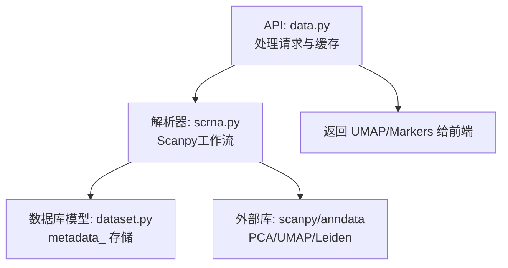
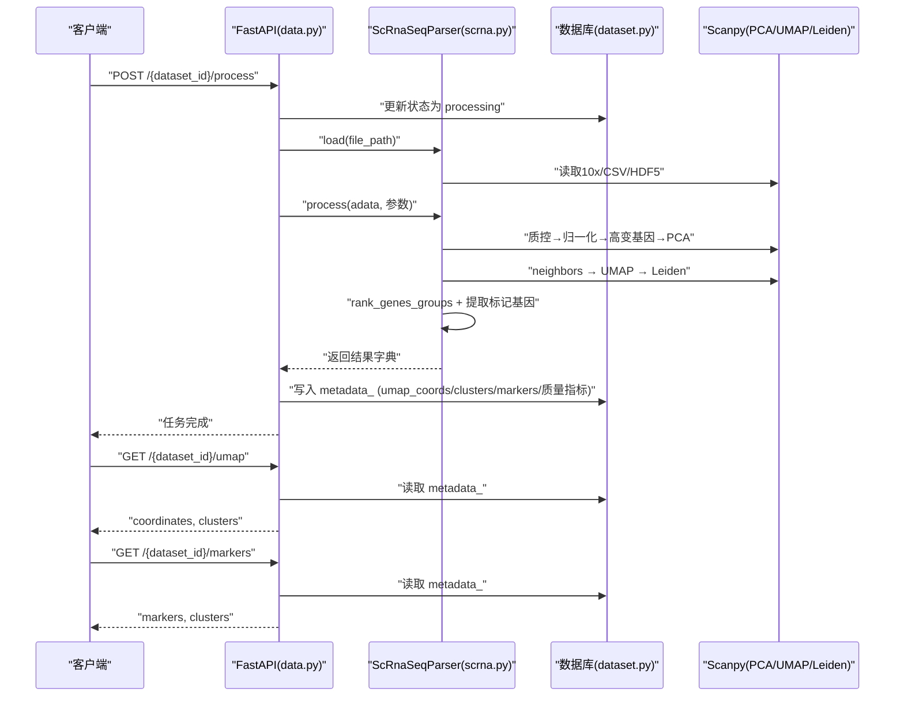
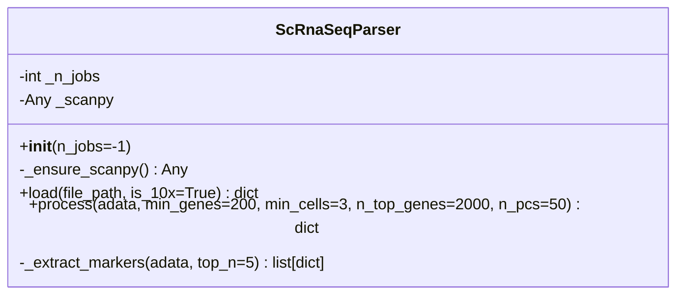
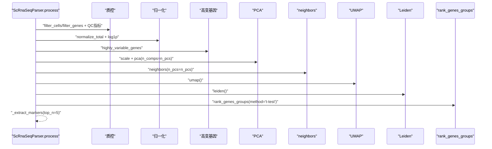
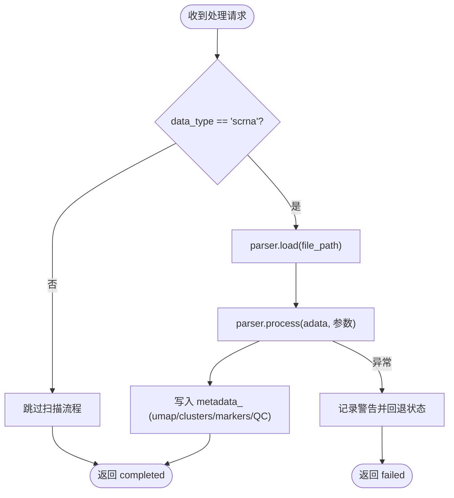
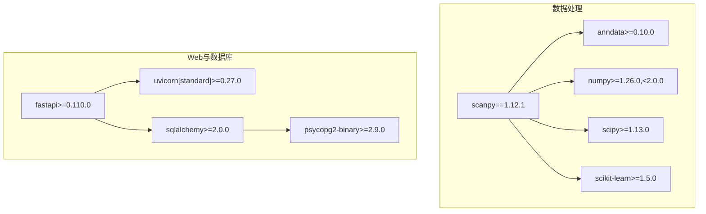

# 降维与聚类分析

<cite>
**本文引用的文件**   
- [scrna.py](file://backend/app/services/parser/scrna.py)
- [data.py](file://backend/app/api/v1/data.py)
- [dataset.py](file://backend/app/models/dataset.py)
- [requirements.txt](file://backend/requirements.txt)
</cite>

## 目录
1. [简介](#简介)
2. [项目结构](#项目结构)
3. [核心组件](#核心组件)
4. [架构总览](#架构总览)
5. [详细组件分析](#详细组件分析)
6. [依赖关系分析](#依赖关系分析)
7. [性能考虑](#性能考虑)
8. [故障排查指南](#故障排查指南)
9. [结论](#结论)
10. [附录](#附录)

## 简介
本模块聚焦于单细胞转录组（scRNA-seq）数据处理流水线中的“降维与聚类”环节，涵盖以下关键步骤：
- 质控、归一化与高变基因选择
- 线性降维（PCA）与非线性降维（UMAP）
- 基于图的聚类（Leiden）
- 标记基因提取与可视化数据输出
- 结果缓存与API访问

该实现以 Scanpy 为核心引擎，通过 FastAPI 暴露处理结果，便于前端可视化与下游生物学解释。

## 项目结构
与降维与聚类相关的代码主要分布在服务层解析器与API层：
- 服务层解析器：封装加载、预处理、降维、聚类与标记基因提取流程
- API层：触发处理、缓存结果并提供可视化接口
- 模型层：持久化数据集元信息（含降维与聚类结果）
- 依赖清单：声明 scanpy、anndata 等核心库版本

图表来源
- [data.py:200-306](file://backend/app/api/v1/data.py#L200-L306)
- [scrna.py:75-134](file://backend/app/services/parser/scrna.py#L75-L134)
- [dataset.py:15-47](file://backend/app/models/dataset.py#L15-L47)

章节来源
- [scrna.py:75-134](file://backend/app/services/parser/scrna.py#L75-L134)
- [data.py:200-306](file://backend/app/api/v1/data.py#L200-L306)
- [dataset.py:15-47](file://backend/app/models/dataset.py#L15-L47)

## 核心组件
- ScRnaSeqParser：封装 scRNA-seq 的完整处理流程，包括加载、质控、归一化、高变基因筛选、PCA、邻居图构建、UMAP、Leiden 聚类与标记基因提取。
- API 路由：提供“启动处理”、“获取UMAP坐标与聚类标签”、“获取标记基因”等接口，并将中间结果写入数据集的 metadata_ 字段。
- 数据模型：Dataset 记录 data_type、status、metadata_ 等，用于持久化处理结果。

章节来源
- [scrna.py:13-159](file://backend/app/services/parser/scrna.py#L13-L159)
- [data.py:200-306](file://backend/app/api/v1/data.py#L200-L306)
- [dataset.py:15-47](file://backend/app/models/dataset.py#L15-L47)

## 架构总览
下图展示了从用户发起处理到结果可视化的端到端流程，以及各阶段的数据流向。

图表来源
- [data.py:200-306](file://backend/app/api/v1/data.py#L200-L306)
- [scrna.py:75-134](file://backend/app/services/parser/scrna.py#L75-L134)
- [dataset.py:15-47](file://backend/app/models/dataset.py#L15-L47)

## 详细组件分析

### 组件A：ScRnaSeqParser（处理流水线）
职责与要点：
- 惰性加载 Scanpy，避免不必要的导入开销
- 支持多格式输入（10x MTX/HDF5/CSV）
- 标准预处理：过滤低质量细胞/基因、计算QC指标、标准化与对数变换
- 高变基因选择：减少维度并保留生物学信号
- 线性降维：PCA 控制主成分数量
- 非线性降维：UMAP 用于可视化
- 聚类：Leiden 在 PCA 导出的邻接图上执行
- 标记基因：按聚类进行差异表达统计并提取Top标记
- 输出：包含QC后细胞/基因计数、聚类数、UMAP坐标与聚类标签（前100个用于预览）、标记基因列表、质量指标

图表来源
- [scrna.py:13-159](file://backend/app/services/parser/scrna.py#L13-L159)

章节来源
- [scrna.py:13-159](file://backend/app/services/parser/scrna.py#L13-L159)

#### 处理流程时序（内部调用链）

图表来源
- [scrna.py:95-134](file://backend/app/services/parser/scrna.py#L95-L134)

章节来源
- [scrna.py:95-134](file://backend/app/services/parser/scrna.py#L95-L134)

### 组件B：API 路由（数据与可视化接口）
职责与要点：
- 处理入口：根据 data_type 判断是否为 scrna，调用解析器执行 load/process
- 结果缓存：将 umap_coords、clusters、marker_genes、quality_metrics 写入 dataset.metadata_
- 可视化接口：
  - GET /{dataset_id}/umap：返回 UMAP 坐标与聚类标签
  - GET /{dataset_id}/markers：返回按聚类分组的标记基因
- 错误降级：若处理失败，记录日志并将状态回退为 uploaded

图表来源
- [data.py:200-254](file://backend/app/api/v1/data.py#L200-L254)
- [data.py:257-306](file://backend/app/api/v1/data.py#L257-L306)

章节来源
- [data.py:200-254](file://backend/app/api/v1/data.py#L200-L254)
- [data.py:257-306](file://backend/app/api/v1/data.py#L257-L306)

### 组件C：数据模型（持久化与状态）
职责与要点：
- Dataset 表记录 data_type、status、metadata_（JSONB），用于保存处理结果
- QualityReport 表记录完整性、准确性、一致性评分及问题列表
- 状态流转：uploaded → processing → processed/failed

章节来源
- [dataset.py:15-47](file://backend/app/models/dataset.py#L15-L47)
- [dataset.py:53-70](file://backend/app/models/dataset.py#L53-L70)

## 依赖关系分析
- 核心算法依赖：scanpy、anndata、numpy、scipy、scikit-learn
- Web框架：fastapi、uvicorn、pydantic
- 数据库：sqlalchemy、psycopg2-binary、asyncpg
- 其他：loguru、tenacity、joblib 等工具库

图表来源
- [requirements.txt:12-23](file://backend/requirements.txt#L12-L23)
- [requirements.txt:35-46](file://backend/requirements.txt#L35-L46)

章节来源
- [requirements.txt:12-23](file://backend/requirements.txt#L12-L23)
- [requirements.txt:35-46](file://backend/requirements.txt#L35-L46)

## 性能考虑
- 并行与分布式
  - 解析器构造参数 n_jobs 可用于控制并行度（默认使用所有CPU）
  - 配置项 scanpy_use_dask 可启用 Dask 加速（需额外部署 Dask 集群）
- 内存与I/O
  - 使用 HDF5/MTX 稀疏格式降低内存占用
  - 仅返回前100个UMAP坐标用于预览，避免大响应体
- 计算瓶颈
  - neighbors 与 UMAP 在高维或大数据集上耗时较长，建议合理设置 n_pcs 与 n_top_genes
  - 可通过调整 max_value（缩放上限）与 n_comps 平衡精度与速度

章节来源
- [scrna.py:19-26](file://backend/app/services/parser/scrna.py#L19-L26)
- [scrna.py:112-116](file://backend/app/services/parser/scrna.py#L112-L116)
- [data.py:126-127](file://backend/app/services/parser/scrna.py#L126-L127)

## 故障排查指南
- 常见错误
  - 未安装 scanpy：会抛出运行时错误，需在环境中安装依赖
  - 文件格式不支持：仅支持 .h5/.mtx/.csv，其他后缀将报错
  - 文件不存在：路径校验失败时抛出文件未找到错误
- 处理失败降级
  - 捕获异常后记录警告日志，并将数据集状态回退为 uploaded，返回 failed
- 结果缺失
  - 若 metadata_ 为空或未成功写入，UMAP/Markers 接口将返回空列表；检查处理日志与数据库状态

章节来源
- [scrna.py:28-36](file://backend/app/services/parser/scrna.py#L28-36)
- [scrna.py:54-64](file://backend/app/services/parser/scrna.py#L54-L64)
- [data.py:240-247](file://backend/app/api/v1/data.py#L240-L247)
- [data.py:273-281](file://backend/app/api/v1/data.py#L273-L281)

## 结论
本模块以 Scanpy 为核心，实现了从数据加载到降维聚类的完整流水线，并通过 API 将结果持久化与对外暴露。其设计兼顾了易用性与可扩展性，适合在不同规模与类型的 scRNA-seq 数据集上进行快速分析与可视化。后续可在参数调优、质量控制阈值与聚类评估方面进一步细化，以提升结果的稳定性与生物学解释力。

## 附录

### 参数说明与调优建议
- 质控与高变基因
  - min_genes/min_cells：过滤低质量细胞与低频基因，建议依据数据分布与实验背景调整
  - n_top_genes：高变基因数量，影响后续降维与聚类分辨率，通常 1000–5000 之间尝试
- 降维与聚类
  - n_pcs：PCA 主成分数，过小可能丢失信号，过大引入噪声；建议 20–100 范围探索
  - neighbors：当前实现使用 n_pcs 作为邻居图构建的关键参数；可根据数据规模与分辨率需求微调
  - UMAP：默认参数适用于多数场景；如需更精细结构，可调整 n_neighbors 与 min_dist（需在扩展中传入）
  - Leiden：默认参数适用于通用场景；可通过 resolution 参数调节聚类粒度（需在扩展中传入）
- 标记基因
  - method="t-test"：适用于初步筛选；对于非正态分布或厚尾数据，可考虑其他方法（如 wilcoxon）
  - top_n：每个聚类返回的标记基因数量，建议 5–10 用于快速浏览

章节来源
- [scrna.py:75-134](file://backend/app/services/parser/scrna.py#L75-L134)

### 不同数据集的最佳实践参考
- 小型数据集（<1万细胞）
  - n_top_genes≈1000，n_pcs≈30–50，min_genes≈200，min_cells≈3
- 中型数据集（1–10万细胞）
  - n_top_genes≈2000–3000，n_pcs≈50–100，min_genes≈200–500，min_cells≈3–5
- 大型数据集（>10万细胞）
  - 建议使用 Dask 加速（scanpy_use_dask=True），并适当提高 n_pcs 与 n_top_genes
  - 分批或采样策略辅助调试，再全量运行

章节来源
- [scrna.py:75-134](file://backend/app/services/parser/scrna.py#L75-L134)

### 结果解释与可视化建议
- UMAP 可视化
  - 使用 coordinates 与 clusters 绘制散点图，按 cluster 着色，观察分离度与重叠情况
- 标记基因解读
  - 结合已知细胞类型标志物进行注释；必要时进行通路富集分析（本项目提供 PathwayAnalyzer 作为补充）
- 质量指标
  - 关注每细胞基因数中位数、每细胞读数中位数、线粒体基因比例最大值，识别潜在污染或双细胞

章节来源
- [data.py:273-281](file://backend/app/api/v1/data.py#L273-L281)
- [data.py:300-306](file://backend/app/api/v1/data.py#L300-L306)
- [scrna.py:129-133](file://backend/app/services/parser/scrna.py#L129-L133)