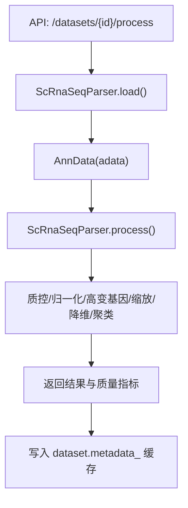
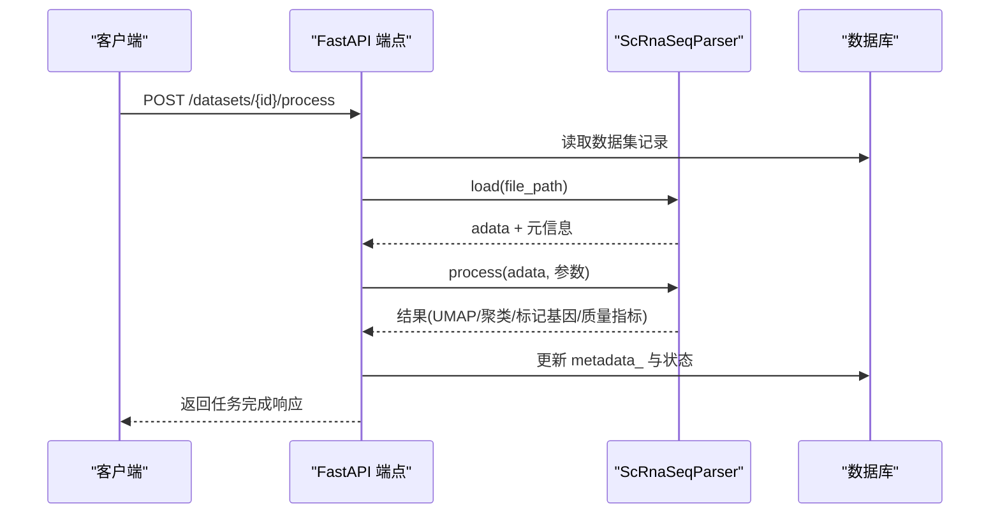
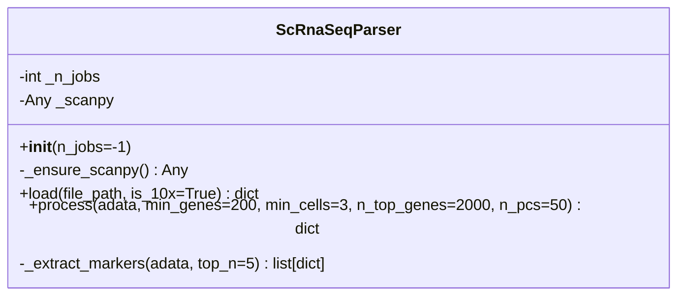
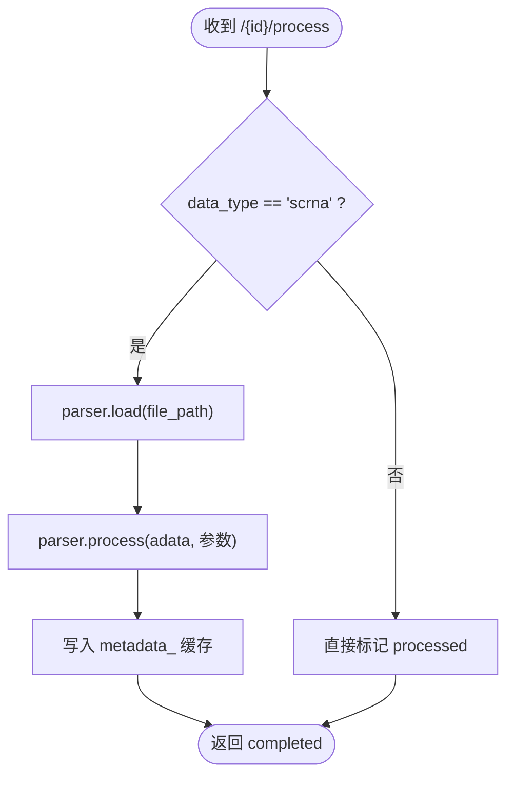

# 预处理工作流

<cite>
**本文引用的文件**   
- [scrna.py](file://backend/app/services/parser/scrna.py)
- [data.py](file://backend/app/api/v1/data.py)
- [config.py](file://backend/app/core/config.py)
</cite>

## 目录
1. [简介](#简介)
2. [项目结构](#项目结构)
3. [核心组件](#核心组件)
4. [架构总览](#架构总览)
5. [详细组件分析](#详细组件分析)
6. [依赖关系分析](#依赖关系分析)
7. [性能与并行优化](#性能与并行优化)
8. [内存管理与批处理策略](#内存管理与批处理策略)
9. [质量评估与可视化](#质量评估与可视化)
10. [故障排查指南](#故障排查指南)
11. [结论](#结论)

## 简介
本文件面向数据处理流水线的预处理工作流，聚焦于单细胞转录组（scRNA-seq）数据的标准化流程：归一化（normalize_total）、对数转换（log1p）、高变基因选择（highly_variable_genes）、缩放处理（scale）。文档从数学原理、参数配置与影响出发，结合代码实现路径，给出批量处理优化、内存管理、并行计算配置建议，并覆盖预处理结果的质量评估与可视化方法。

## 项目结构
与预处理相关的核心位置如下：
- 解析器与工作流封装：backend/app/services/parser/scrna.py
- API 触发与结果缓存：backend/app/api/v1/data.py
- 全局配置（含扫描库并行与Dask开关）：backend/app/core/config.py

图示来源
- [data.py:191-254](file://backend/app/api/v1/data.py#L191-L254)
- [scrna.py:38-73](file://backend/app/services/parser/scrna.py#L38-L73)
- [scrna.py:75-134](file://backend/app/services/parser/scrna.py#L75-L134)

章节来源
- [scrna.py:1-160](file://backend/app/services/parser/scrna.py#L1-L160)
- [data.py:191-254](file://backend/app/api/v1/data.py#L191-L254)
- [config.py:103-110](file://backend/app/core/config.py#L103-L110)

## 核心组件
- ScRnaSeqParser：封装基于 Scanpy 的 scRNA-seq 数据加载与标准预处理流程，包括质控、归一化、对数变换、高变基因筛选、缩放、PCA、UMAP、Leiden 聚类与标记基因提取。
- API 层 process_dataset：根据数据集类型触发预处理，将关键中间结果与质量指标持久化到数据库 metadata_ 字段，便于后续查询与可视化。
- Settings：提供 scanpy_n_jobs、scanpy_use_dask、dask_dashboard_address 等与数据处理相关的配置项。

章节来源
- [scrna.py:13-36](file://backend/app/services/parser/scrna.py#L13-L36)
- [scrna.py:75-134](file://backend/app/services/parser/scrna.py#L75-L134)
- [data.py:191-254](file://backend/app/api/v1/data.py#L191-L254)
- [config.py:103-110](file://backend/app/core/config.py#L103-L110)

## 架构总览
下图展示了从 API 调用到预处理执行与结果缓存的整体流程。

图示来源
- [data.py:191-254](file://backend/app/api/v1/data.py#L191-L254)
- [scrna.py:38-73](file://backend/app/services/parser/scrna.py#L38-L73)
- [scrna.py:75-134](file://backend/app/services/parser/scrna.py#L75-L134)

## 详细组件分析

### 组件A：ScRnaSeqParser 类
该类负责：
- 惰性导入 Scanpy，避免不必要的依赖开销
- 支持 10x MTX/HDF5/CSV 格式加载
- 执行标准预处理流程（质控→归一化→对数→高变基因→缩放→PCA→邻居→UMAP→Leiden→标记基因）
- 输出质量指标与可预览的 UMAP/聚类结果

图示来源
- [scrna.py:13-36](file://backend/app/services/parser/scrna.py#L13-L36)
- [scrna.py:38-73](file://backend/app/services/parser/scrna.py#L38-L73)
- [scrna.py:75-134](file://backend/app/services/parser/scrna.py#L75-L134)
- [scrna.py:136-159](file://backend/app/services/parser/scrna.py#L136-L159)

章节来源
- [scrna.py:13-36](file://backend/app/services/parser/scrna.py#L13-L36)
- [scrna.py:38-73](file://backend/app/services/parser/scrna.py#L38-L73)
- [scrna.py:75-134](file://backend/app/services/parser/scrna.py#L75-L134)
- [scrna.py:136-159](file://backend/app/services/parser/scrna.py#L136-L159)

### 组件B：API 集成与结果缓存
- 当 data_type 为 scrna 时，调用 ScRnaSeqParser 进行加载与处理
- 将处理后结果（细胞/基因数量、聚类数、UMAP坐标、聚类标签、标记基因、质量指标）写入 dataset.metadata_
- 提供 /umap、/markers、/quality 等接口用于前端展示

图示来源
- [data.py:191-254](file://backend/app/api/v1/data.py#L191-L254)

章节来源
- [data.py:191-254](file://backend/app/api/v1/data.py#L191-L254)

## 依赖关系分析
- ScRnaSeqParser 在运行时动态导入 scanpy，降低启动成本
- API 层通过依赖注入获取 Settings，从而获得数据处理相关配置
- 当前 ScrnaSeqParser 未直接使用 Settings 中的 scanpy_n_jobs/dask 开关，但可通过扩展传入

图示来源
- [config.py:103-110](file://backend/app/core/config.py#L103-L110)
- [data.py:191-254](file://backend/app/api/v1/data.py#L191-L254)
- [scrna.py:28-36](file://backend/app/services/parser/scrna.py#L28-L36)

章节来源
- [config.py:103-110](file://backend/app/core/config.py#L103-L110)
- [data.py:191-254](file://backend/app/api/v1/data.py#L191-L254)
- [scrna.py:28-36](file://backend/app/services/parser/scrna.py#L28-L36)

## 性能与并行优化
- 并行线程数：ScRnaSeqParser.__init__ 接收 n_jobs 参数，默认使用所有 CPU；可在上层构造时传入以控制并发度
- 分布式计算：Settings 提供 scanpy_use_dask 与 dask_dashboard_address，可用于未来接入 Dask 集群进行大规模并行
- 当前实现中，process 未显式传递 n_jobs 给底层函数，建议在后续版本中将 n_jobs 透传至需要并行的步骤（如 highly_variable_genes、neighbors、umap 等），以充分利用多核

章节来源
- [scrna.py:19-26](file://backend/app/services/parser/scrna.py#L19-L26)
- [config.py:103-110](file://backend/app/core/config.py#L103-L110)

## 内存管理与批处理策略
- 稀疏矩阵与惰性加载：加载阶段对 10x MTX 使用 cache=True，有助于减少内存占用
- 高变基因裁剪：仅保留 highly_variable 列，显著降低后续 PCA/UMAP 的计算与内存压力
- 缩放上限：scale 设置 max_value，限制极端值对数值稳定性的影响
- 预览输出：UMAP 坐标与聚类标签仅返回前若干条，避免大对象在网络传输中造成瓶颈

章节来源
- [scrna.py:59-61](file://backend/app/services/parser/scrna.py#L59-L61)
- [scrna.py:107-113](file://backend/app/services/parser/scrna.py#L107-L113)
- [scrna.py:126-128](file://backend/app/services/parser/scrna.py#L126-L128)

## 质量评估与可视化
- 质量指标：process 返回 quality_metrics，包含每细胞基因数中位数、每细胞总计数中位数、线粒体基因占比最大值等
- 可视化接口：/umap 返回 UMAP 坐标与聚类标签，/markers 返回按聚类分组的差异表达基因列表，/quality 返回质量报告
- 建议可视化方法：UMAP 散点图（按聚类着色）、箱线图（每细胞基因数/总计数分布）、热图（标记基因表达）、小提琴图（各聚类基因表达分布）

章节来源
- [scrna.py:122-134](file://backend/app/services/parser/scrna.py#L122-L134)
- [data.py:257-306](file://backend/app/api/v1/data.py#L257-L306)
- [data.py:309-340](file://backend/app/api/v1/data.py#L309-L340)

## 故障排查指南
- 依赖缺失：若未安装 scanpy，初始化时会抛出运行时错误，需确保环境正确安装
- 文件格式不支持：load 会校验后缀与目录结构，非支持的格式或路径不存在将抛出异常
- 处理失败降级：API 层捕获异常后会将状态回退为 uploaded，并返回 failed，便于重试或人工介入

章节来源
- [scrna.py:28-36](file://backend/app/services/parser/scrna.py#L28-L36)
- [scrna.py:54-64](file://backend/app/services/parser/scrna.py#L54-L64)
- [data.py:240-247](file://backend/app/api/v1/data.py#L240-L247)

## 结论
该预处理工作流围绕 scRNA-seq 的标准流程展开，实现了从数据加载、质控、归一化、对数变换、高变基因选择、缩放到降维与聚类的完整链路，并通过 API 层将关键结果与质量指标持久化，便于后续分析与可视化。建议在后续迭代中完善并行参数透传与 Dask 集成，进一步提升大规模数据的处理效率与可扩展性。