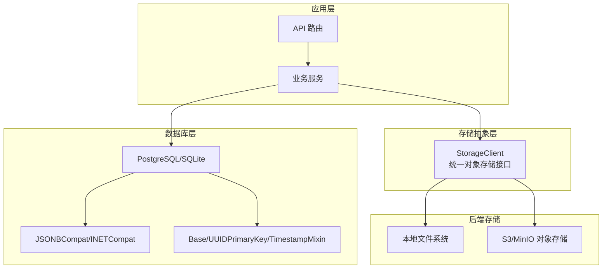
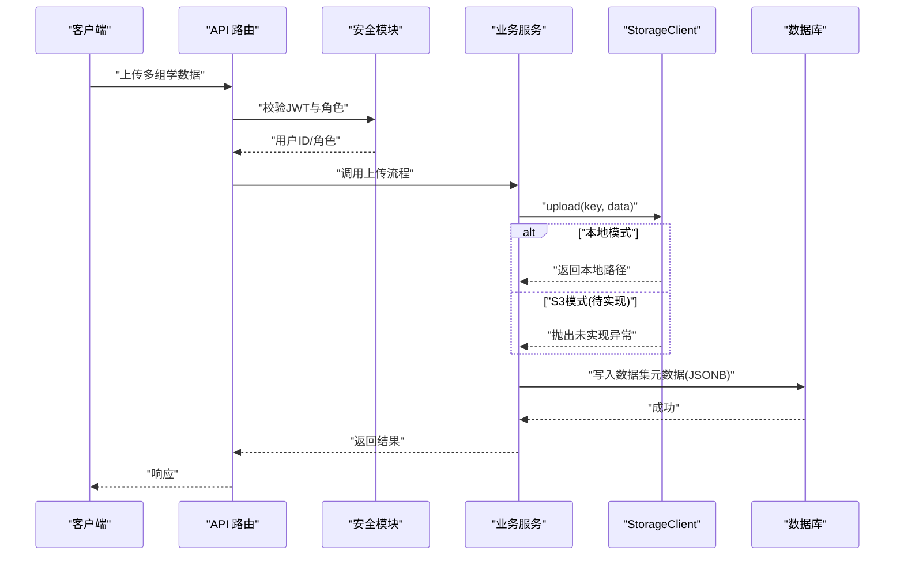
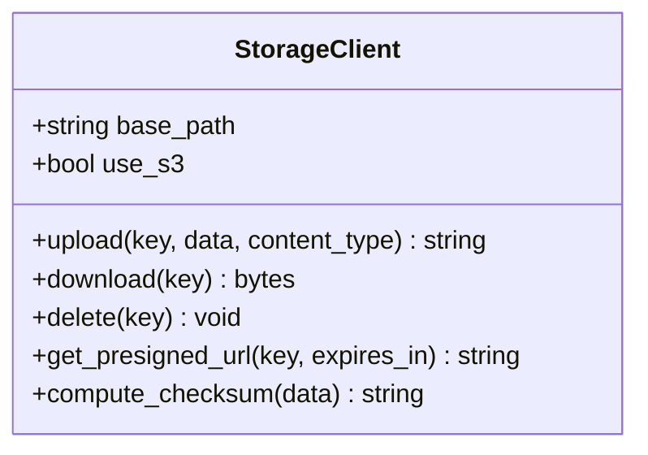
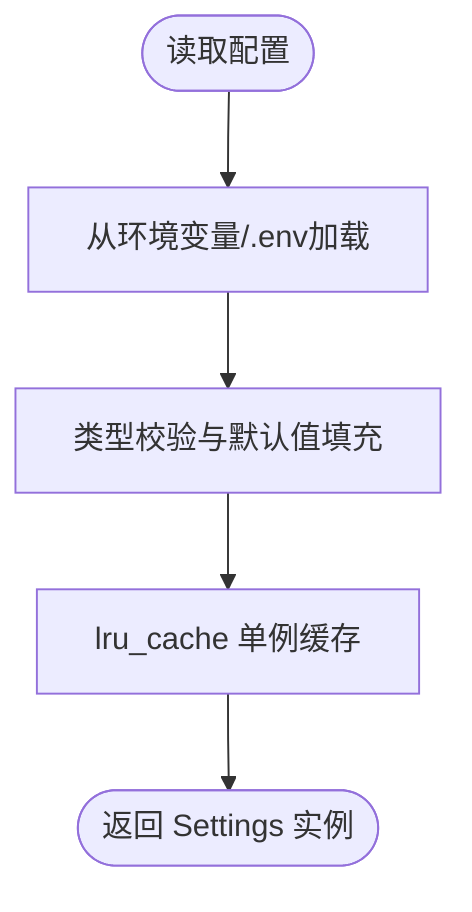
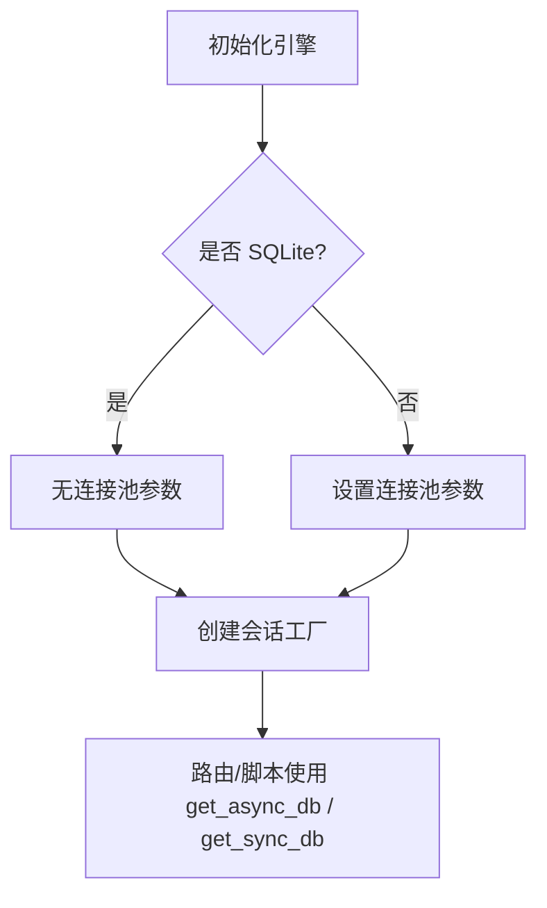
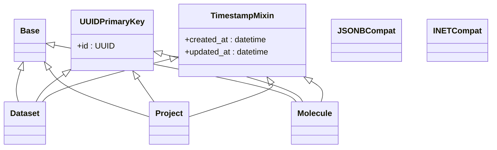
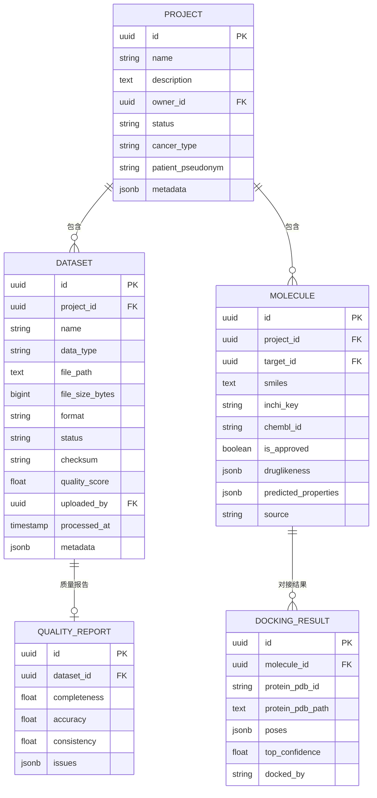
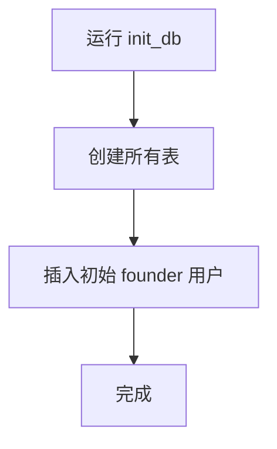
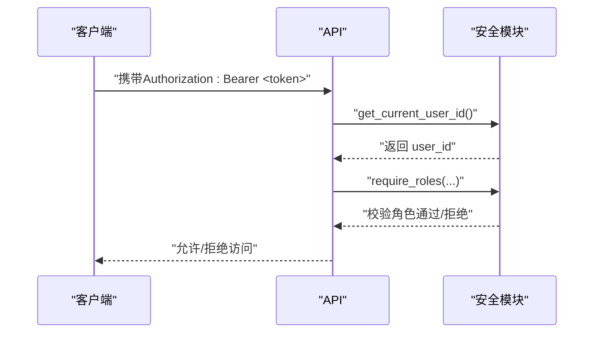
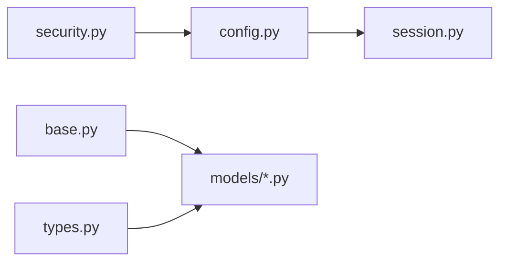

# 数据存储管理

<cite>
**本文引用的文件**   
- [s3_client.py](file://backend/app/utils/s3_client.py)
- [config.py](file://backend/app/core/config.py)
- [session.py](file://backend/app/db/session.py)
- [base.py](file://backend/app/db/base.py)
- [types.py](file://backend/app/db/types.py)
- [init_db.py](file://backend/app/db/init_db.py)
- [dataset.py](file://backend/app/models/dataset.py)
- [project.py](file://backend/app/models/project.py)
- [molecule.py](file://backend/app/models/molecule.py)
- [security.py](file://backend/app/core/security.py)
- [test_storage_client.py](file://tests/test_storage_client.py)
</cite>

## 目录
1. [简介](#简介)
2. [项目结构](#项目结构)
3. [核心组件](#核心组件)
4. [架构总览](#架构总览)
5. [详细组件分析](#详细组件分析)
6. [依赖关系分析](#依赖关系分析)
7. [性能考虑](#性能考虑)
8. [故障排查指南](#故障排查指南)
9. [结论](#结论)
10. [附录](#附录)

## 简介
本文件面向AI药物设计系统的数据存储管理，聚焦多组学数据的存储架构与策略，覆盖：
- 原始数据、中间结果与分析结果的持久化分层
- S3/MinIO对象存储集成与本地文件系统回退
- 数据库元数据记录与跨方言类型兼容
- 数据版本控制、备份恢复、访问权限控制机制
- 存储优化（压缩、索引、查询调优）
- 数据生命周期管理（归档与清理）

## 项目结构
与数据存储相关的代码主要分布在以下模块：
- 对象存储抽象与客户端：backend/app/utils/s3_client.py
- 配置中心与环境变量：backend/app/core/config.py
- 数据库会话与引擎：backend/app/db/session.py
- ORM基类与通用字段：backend/app/db/base.py
- 跨方言类型适配：backend/app/db/types.py
- 数据库初始化脚本：backend/app/db/init_db.py
- 数据集/项目/分子等模型：backend/app/models/*.py
- 认证与鉴权：backend/app/core/security.py
- 存储客户端测试：tests/test_storage_client.py

图表来源
- [s3_client.py:16-79](file://backend/app/utils/s3_client.py#L16-L79)
- [session.py:48-91](file://backend/app/db/session.py#L48-L91)
- [base.py:13-47](file://backend/app/db/base.py#L13-L47)
- [types.py:13-41](file://backend/app/db/types.py#L13-L41)

章节来源
- [s3_client.py:16-79](file://backend/app/utils/s3_client.py#L16-L79)
- [config.py:44-52](file://backend/app/core/config.py#L44-L52)
- [session.py:48-91](file://backend/app/db/session.py#L48-L91)
- [base.py:13-47](file://backend/app/db/base.py#L13-L47)
- [types.py:13-41](file://backend/app/db/types.py#L13-L41)

## 核心组件
- StorageClient：提供统一的上传、下载、删除、预签名URL获取与校验和计算能力；开发模式使用本地文件系统，生产模式预留S3/MinIO接入点。
- Settings：集中管理对象存储、数据库、向量库、LLM等配置项，支持环境变量与 .env 加载。
- 数据库会话：提供同步/异步引擎与会话工厂，自动处理连接池与事务边界。
- ORM基类与类型：统一主键、时间戳混入，以及跨方言的JSONB/INET类型适配。
- 模型层：Dataset、Project、Molecule等实体承载多组学与分子对接相关元数据。
- 安全与鉴权：JWT令牌生成与校验、角色守卫，为数据访问提供身份与权限基础。

章节来源
- [s3_client.py:16-79](file://backend/app/utils/s3_client.py#L16-L79)
- [config.py:21-52](file://backend/app/core/config.py#L21-L52)
- [session.py:48-91](file://backend/app/db/session.py#L48-L91)
- [base.py:13-47](file://backend/app/db/base.py#L13-L47)
- [types.py:13-41](file://backend/app/db/types.py#L13-L41)
- [dataset.py:15-70](file://backend/app/models/dataset.py#L15-L70)
- [project.py:14-42](file://backend/app/models/project.py#L14-L42)
- [molecule.py:14-61](file://backend/app/models/molecule.py#L14-L61)
- [security.py:96-122](file://backend/app/core/security.py#L96-L122)

## 架构总览
整体采用“对象存储+关系型数据库”的分层架构：
- 大体积二进制数据（原始测序文件、中间产物、分析产物）通过StorageClient写入对象存储或本地文件系统。
- 结构化元数据（数据集信息、质量报告、项目与分子信息等）持久化到数据库，利用JSONB进行灵活扩展。
- 配置驱动的对象存储参数（端点、桶名、区域等）由Settings统一管理，便于环境切换。
- 认证与鉴权基于JWT，结合角色守卫限制对敏感数据的访问。

图表来源
- [s3_client.py:28-49](file://backend/app/utils/s3_client.py#L28-L49)
- [dataset.py:15-47](file://backend/app/models/dataset.py#L15-L47)
- [security.py:155-174](file://backend/app/core/security.py#L155-L174)

## 详细组件分析

### 对象存储客户端（StorageClient）
- 功能要点
  - 统一接口：upload/download/delete/get_presigned_url
  - 本地模式：在 base_path 下按 key 组织目录，自动创建父目录
  - S3模式：当前抛出不实现异常，预留boto3/minio接入点
  - 校验和：compute_checksum 返回 sha256 前缀格式，用于完整性校验
- 关键行为
  - 初始化时根据 use_s3 决定是否创建本地根目录
  - 上传支持 bytes 或 IO[bytes] 输入
  - 预签名URL在本地模式下返回文件路径字符串

图表来源
- [s3_client.py:16-79](file://backend/app/utils/s3_client.py#L16-L79)

章节来源
- [s3_client.py:22-79](file://backend/app/utils/s3_client.py#L22-L79)
- [test_storage_client.py:12-33](file://tests/test_storage_client.py#L12-L33)
- [test_storage_client.py:35-96](file://tests/test_storage_client.py#L35-L96)
- [test_storage_client.py:98-129](file://tests/test_storage_client.py#L98-L129)

### 配置中心（Settings）
- 对象存储配置项
  - s3_endpoint、s3_access_key、s3_secret_key、s3_bucket、s3_region
- 数据目录
  - data_raw_dir、data_processed_dir
- 其他相关
  - chroma_persist_dir（向量库持久化目录）
  - cdisc_sdtm_output_dir（CDISC输出目录）

图表来源
- [config.py:21-52](file://backend/app/core/config.py#L21-L52)
- [config.py:136-143](file://backend/app/core/config.py#L136-L143)

章节来源
- [config.py:44-52](file://backend/app/core/config.py#L44-L52)
- [config.py:108-111](file://backend/app/core/config.py#L108-L111)
- [config.py:136-143](file://backend/app/core/config.py#L136-L143)

### 数据库会话与引擎
- 同步/异步双引擎
  - SQLite：不使用连接池参数
  - PostgreSQL：启用 pool_pre_ping、pool_size、max_overflow
- 会话工厂
  - AsyncSessionLocal：FastAPI 异步依赖
  - SyncSessionLocal：脚本/工具同步路径
- 事务与异常
  - 请求级上下文自动提交/回滚

图表来源
- [session.py:48-91](file://backend/app/db/session.py#L48-L91)
- [session.py:94-127](file://backend/app/db/session.py#L94-L127)

章节来源
- [session.py:48-91](file://backend/app/db/session.py#L48-L91)
- [session.py:94-127](file://backend/app/db/session.py#L94-L127)

### ORM基类与跨方言类型
- 基类与混入
  - Base：SQLAlchemy声明式基类
  - UUIDPrimaryKey：分布式友好的UUID主键
  - TimestampMixin：created_at/updated_at自动维护
- 类型适配
  - JSONBCompat：PostgreSQL使用JSONB，其他方言降级为JSON
  - INETCompat：PostgreSQL使用INET，其他方言降级为String(45)

图表来源
- [base.py:13-47](file://backend/app/db/base.py#L13-L47)
- [types.py:13-41](file://backend/app/db/types.py#L13-L41)
- [dataset.py:15-47](file://backend/app/models/dataset.py#L15-L47)
- [project.py:14-30](file://backend/app/models/project.py#L14-L30)
- [molecule.py:14-36](file://backend/app/models/molecule.py#L14-L36)

章节来源
- [base.py:13-47](file://backend/app/db/base.py#L13-L47)
- [types.py:13-41](file://backend/app/db/types.py#L13-L41)
- [dataset.py:15-47](file://backend/app/models/dataset.py#L15-L47)
- [project.py:14-30](file://backend/app/models/project.py#L14-L30)
- [molecule.py:14-36](file://backend/app/models/molecule.py#L14-L36)

### 数据模型与元数据策略
- Dataset
  - 字段：project_id、name、data_type、file_path、file_size_bytes、format、status、checksum、metadata_、quality_score、uploaded_by、processed_at
  - 关系：Project、QualityReport
- QualityReport
  - 字段：completeness、accuracy、consistency、issues
- Project
  - 字段：name、description、owner_id、status、cancer_type、patient_pseudonym、metadata_
  - 关系：datasets、hypotheses
- Molecule/DockingResult
  - 字段：smiles、inchi_key、druglikeness、predicted_properties、poses、top_confidence 等
  - 关系：Target、DockingResult

图表来源
- [dataset.py:15-70](file://backend/app/models/dataset.py#L15-L70)
- [project.py:14-42](file://backend/app/models/project.py#L14-L42)
- [molecule.py:14-61](file://backend/app/models/molecule.py#L14-L61)

章节来源
- [dataset.py:15-70](file://backend/app/models/dataset.py#L15-L70)
- [project.py:14-42](file://backend/app/models/project.py#L14-L42)
- [molecule.py:14-61](file://backend/app/models/molecule.py#L14-L61)

### 数据库初始化
- 创建所有表：基于 Base.metadata.create_all
- 初始用户：创建 founder 用户并哈希密码
- 入口：命令行参数或环境变量传入邮箱与密码

图表来源
- [init_db.py:35-87](file://backend/app/db/init_db.py#L35-L87)

章节来源
- [init_db.py:35-87](file://backend/app/db/init_db.py#L35-L87)

### 安全与访问控制
- JWT令牌：access/refresh token生成与解析
- 角色守卫：require_roles 装饰器限制资源访问
- 当前用户提取：get_current_user_id 从请求头解析用户ID

图表来源
- [security.py:96-122](file://backend/app/core/security.py#L96-L122)
- [security.py:155-174](file://backend/app/core/security.py#L155-L174)
- [security.py:194-210](file://backend/app/core/security.py#L194-L210)

章节来源
- [security.py:96-122](file://backend/app/core/security.py#L96-L122)
- [security.py:155-174](file://backend/app/core/security.py#L155-L174)
- [security.py:194-210](file://backend/app/core/security.py#L194-L210)

## 依赖关系分析
- 配置依赖
  - session.py 依赖 config.get_settings 以获取数据库URL与回显开关
- 模型依赖
  - dataset.py、project.py、molecule.py 均依赖 base.py 与 types.py
- 安全依赖
  - security.py 依赖 config.Settings 与 FastAPI 依赖注入框架

图表来源
- [session.py:22-23](file://backend/app/db/session.py#L22-L23)
- [dataset.py:11-12](file://backend/app/models/dataset.py#L11-L12)
- [project.py:10-11](file://backend/app/models/project.py#L10-L11)
- [molecule.py:10-11](file://backend/app/models/molecule.py#L10-L11)
- [security.py:21-22](file://backend/app/core/security.py#L21-L22)

章节来源
- [session.py:22-23](file://backend/app/db/session.py#L22-L23)
- [dataset.py:11-12](file://backend/app/models/dataset.py#L11-L12)
- [project.py:10-11](file://backend/app/models/project.py#L10-L11)
- [molecule.py:10-11](file://backend/app/models/molecule.py#L10-L11)
- [security.py:21-22](file://backend/app/core/security.py#L21-L22)

## 性能考虑
- 数据库连接池
  - PostgreSQL：启用 pool_pre_ping、pool_size=10、max_overflow=20，提升并发稳定性
  - SQLite：避免连接池参数，减少锁竞争
- JSONB高效查询
  - 使用JSONBCompat在PostgreSQL上获得原生JSONB能力，利于索引与条件查询
- 对象存储I/O
  - 本地模式：确保目录层级合理，避免深层嵌套导致inode压力
  - S3模式（待实现）：建议分片上传、断点续传、并行下载以提升吞吐

章节来源
- [session.py:64-80](file://backend/app/db/session.py#L64-L80)
- [types.py:13-26](file://backend/app/db/types.py#L13-L26)

## 故障排查指南
- 对象存储S3模式未实现
  - 现象：调用 upload/download/delete/get_presigned_url 抛出未实现异常
  - 排查：确认 use_s3 配置与初始化参数；开发阶段使用本地模式
- 本地文件路径不可写
  - 现象：上传失败或找不到文件
  - 排查：检查 base_path 是否存在且可写；确认目录权限
- 数据库连接失败
  - 现象：初始化或查询报错
  - 排查：核对 database_url、驱动后缀（psycopg2/asyncpg/sqlite+aiosqlite）、网络连通性
- 权限不足
  - 现象：访问受限资源被拒绝
  - 排查：检查JWT token是否有效、角色是否符合 require_roles 要求

章节来源
- [s3_client.py:35-37](file://backend/app/utils/s3_client.py#L35-L37)
- [s3_client.py:53-54](file://backend/app/utils/s3_client.py#L53-L54)
- [s3_client.py:61-62](file://backend/app/utils/s3_client.py#L61-L62)
- [s3_client.py:70-71](file://backend/app/utils/s3_client.py#L70-L71)
- [security.py:169-174](file://backend/app/core/security.py#L169-L174)

## 结论
本系统采用对象存储与关系型数据库协同的多层存储架构，通过StorageClient统一抽象文件操作，借助Settings集中管理配置，结合ORM基类与跨方言类型适配保障可移植性与可扩展性。当前S3模式处于预留阶段，建议在后续迭代中完善MinIO/S3集成，并配套引入数据版本控制、备份恢复、归档清理与更细粒度的访问控制策略，以满足多组学数据的高吞吐与高可靠需求。

## 附录

### 数据生命周期与归档策略（概念性建议）
- 原始数据（raw）：长期保留，仅追加，禁止修改；定期快照与异地备份
- 中间结果（intermediate）：按任务/批次命名，保留至下游任务完成后可清理
- 分析结果（processed）：按项目与版本归档，建立索引与元数据关联
- 清理机制：基于时间与引用计数（如QualityReport存在则不删），定时任务执行

[本节为概念性内容，不直接分析具体文件，故无章节来源]