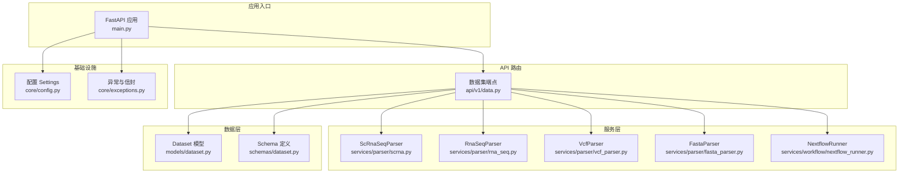
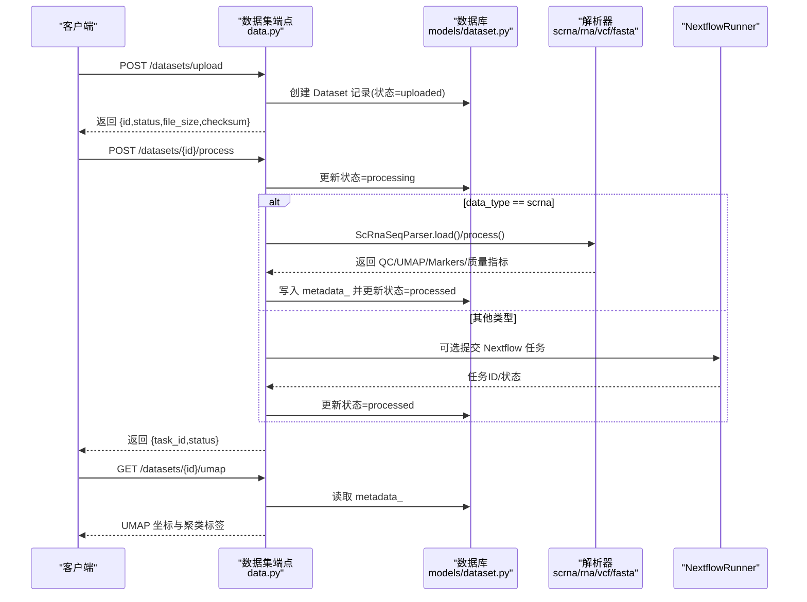
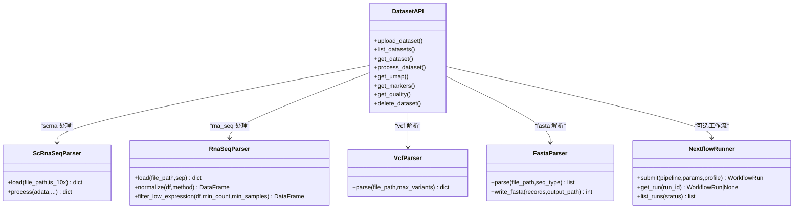
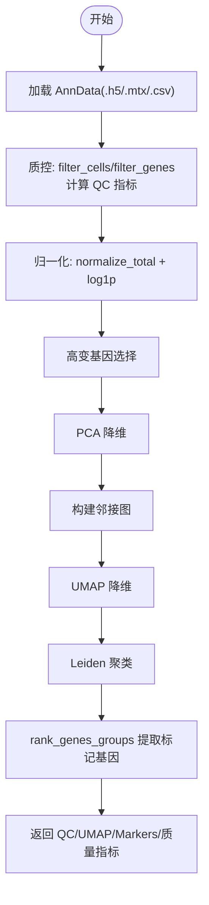
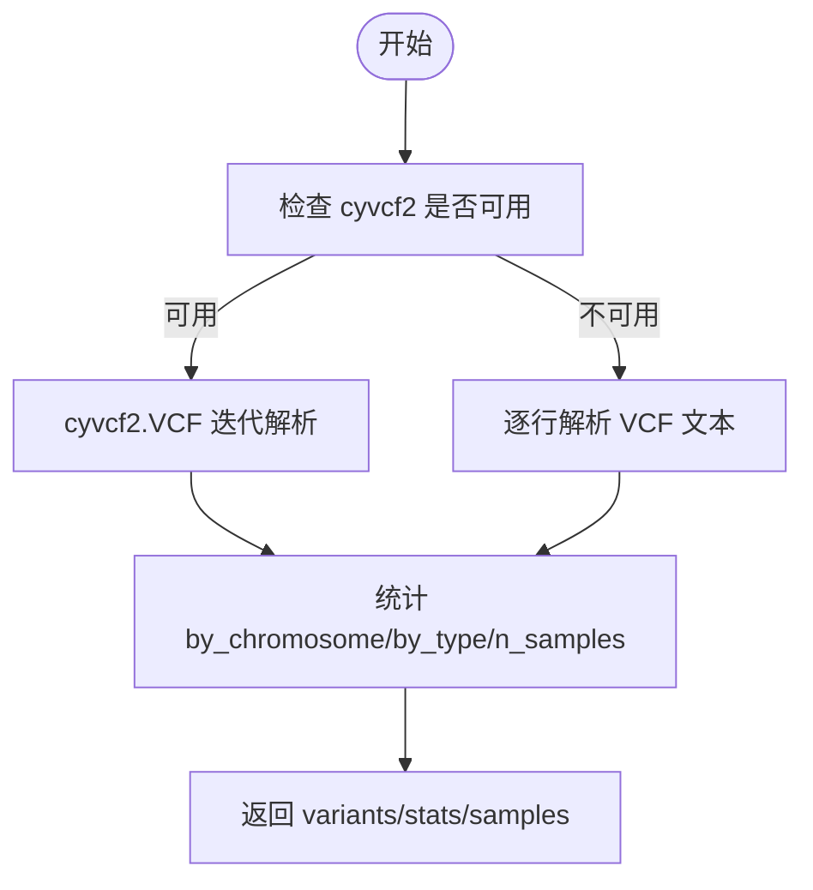
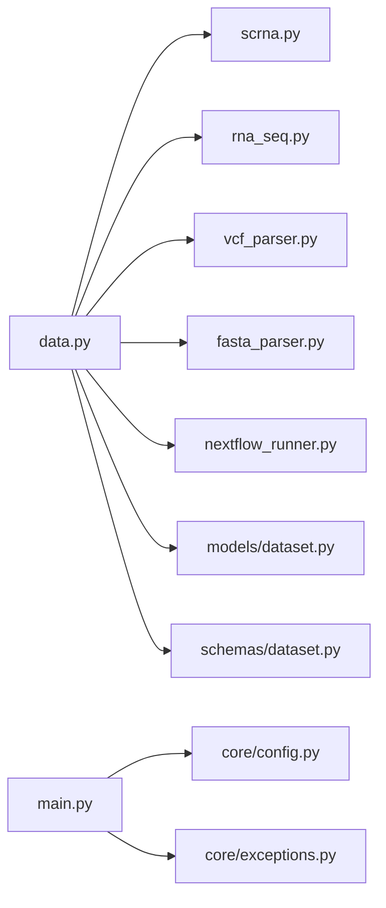

# 数据平台

<cite>
**本文引用的文件**   
- [README.md](file://README.md)
- [main.py](file://backend/app/main.py)
- [data.py](file://backend/app/api/v1/data.py)
- [scrna.py](file://backend/app/services/parser/scrna.py)
- [rna_seq.py](file://backend/app/services/parser/rna_seq.py)
- [vcf_parser.py](file://backend/app/services/parser/vcf_parser.py)
- [fasta_parser.py](file://backend/app/services/parser/fasta_parser.py)
- [dataset.py](file://backend/app/models/dataset.py)
- [dataset.py](file://backend/app/schemas/dataset.py)
- [config.py](file://backend/app/core/config.py)
- [nextflow_runner.py](file://backend/app/services/workflow/nextflow_runner.py)
- [exceptions.py](file://backend/app/core/exceptions.py)
- [test_fasta_parser.py](file://tests/test_fasta_parser.py)
- [test_vcf_parser.py](file://tests/test_vcf_parser.py)
</cite>

## 目录
1. [简介](#简介)
2. [项目结构](#项目结构)
3. [核心组件](#核心组件)
4. [架构总览](#架构总览)
5. [详细组件分析](#详细组件分析)
6. [依赖关系分析](#依赖关系分析)
7. [性能与存储优化](#性能与存储优化)
8. [故障排查指南](#故障排查指南)
9. [结论](#结论)
10. [附录：格式规范与使用示例](#附录格式规范与使用示例)

## 简介
本数据平台面向 AI 药物设计，提供多组学数据的上传、校验、预处理与分析能力，覆盖 RNA-seq、scRNA-seq、VCF、FASTA 等主流生物信息学数据格式。系统通过统一 API 暴露数据集管理、数据处理触发、质量报告与可视化结果查询等功能；在 scRNA-seq 场景下集成 Scanpy 标准流程（过滤→归一化→高变基因→PCA→UMAP→Leiden），并支持 Nextflow 工作流编排以扩展更复杂的生信流水线。

## 项目结构
后端采用 FastAPI + SQLAlchemy 异步 ORM，服务按模块分层组织：
- API 层：REST 路由与请求/响应模型
- 服务层：解析器、分析器、工作流执行器
- 数据层：ORM 模型与数据库会话
- 配置与安全：环境变量、异常处理、中间件

图表来源
- [main.py:187-248](file://backend/app/main.py#L187-L248)
- [data.py:1-369](file://backend/app/api/v1/data.py#L1-L369)
- [scrna.py:1-160](file://backend/app/services/parser/scrna.py#L1-L160)
- [rna_seq.py:1-106](file://backend/app/services/parser/rna_seq.py#L1-L106)
- [vcf_parser.py:1-136](file://backend/app/services/parser/vcf_parser.py#L1-L136)
- [fasta_parser.py:1-100](file://backend/app/services/parser/fasta_parser.py#L1-L100)
- [dataset.py:1-70](file://backend/app/models/dataset.py#L1-L70)
- [dataset.py:1-147](file://backend/app/schemas/dataset.py#L1-L147)
- [config.py:1-144](file://backend/app/core/config.py#L1-L144)
- [exceptions.py:1-179](file://backend/app/core/exceptions.py#L1-L179)

章节来源
- [README.md:1-421](file://README.md#L1-L421)
- [main.py:187-248](file://backend/app/main.py#L187-L248)

## 核心组件
- 数据集 API：提供上传、列表、详情、处理触发、UMAP/标记基因/质量报告查询与删除。
- 解析器族：
  - ScRnaSeqParser：基于 Scanpy 的 scRNA-seq 加载与标准预处理。
  - RnaSeqParser：批量表达矩阵读取、低表达过滤与 CPM/TPM 归一化。
  - VcfParser：VCF 变异解析，支持 cyvcf2 加速与纯文本降级。
  - FastaParser：FASTA 序列解析与写入。
- 工作流运行器：NextflowRunner 提交与追踪生信流水线。
- 配置与异常：Settings 集中管理环境变量；全局异常处理器输出统一信封。

章节来源
- [data.py:54-121](file://backend/app/api/v1/data.py#L54-L121)
- [scrna.py:13-160](file://backend/app/services/parser/scrna.py#L13-L160)
- [rna_seq.py:15-106](file://backend/app/services/parser/rna_seq.py#L15-L106)
- [vcf_parser.py:14-136](file://backend/app/services/parser/vcf_parser.py#L14-L136)
- [fasta_parser.py:12-100](file://backend/app/services/parser/fasta_parser.py#L12-L100)
- [nextflow_runner.py:54-173](file://backend/app/services/workflow/nextflow_runner.py#L54-L173)
- [config.py:21-144](file://backend/app/core/config.py#L21-L144)
- [exceptions.py:19-179](file://backend/app/core/exceptions.py#L19-L179)

## 架构总览
数据从前端或客户端经 REST API 进入后端，由数据集端点进行鉴权与校验，随后持久化元数据与原始文件；数据处理根据 data_type 选择对应解析器，将关键指标缓存至 dataset.metadata_，供后续可视化与质量评估接口消费。

图表来源
- [data.py:191-254](file://backend/app/api/v1/data.py#L191-L254)
- [scrna.py:75-134](file://backend/app/services/parser/scrna.py#L75-L134)
- [dataset.py:15-47](file://backend/app/models/dataset.py#L15-L47)
- [nextflow_runner.py:76-104](file://backend/app/services/workflow/nextflow_runner.py#L76-L104)

## 详细组件分析

### 数据集 API（上传、处理、查询）
- 上传：校验 data_type 与扩展名，计算文件大小与 SHA-256 校验和，落盘到 data_raw_dir/datasets/{project_id}/{id}.{ext}，写入数据库记录。
- 处理：对 scrna 调用 ScRnaSeqParser 进行 QC、归一化、高变基因、PCA/UMAP/Leiden 与差异表达，结果缓存至 metadata_；其他类型直接标记 processed 或通过 Nextflow 执行。
- 查询：UMAP、markers、quality 均从 metadata_/quality_report 读取；支持分页与过滤。

图表来源
- [data.py:54-369](file://backend/app/api/v1/data.py#L54-L369)
- [scrna.py:13-160](file://backend/app/services/parser/scrna.py#L13-L160)
- [rna_seq.py:15-106](file://backend/app/services/parser/rna_seq.py#L15-L106)
- [vcf_parser.py:14-136](file://backend/app/services/parser/vcf_parser.py#L14-L136)
- [fasta_parser.py:12-100](file://backend/app/services/parser/fasta_parser.py#L12-L100)
- [nextflow_runner.py:54-173](file://backend/app/services/workflow/nextflow_runner.py#L54-L173)

章节来源
- [data.py:54-121](file://backend/app/api/v1/data.py#L54-L121)
- [data.py:191-254](file://backend/app/api/v1/data.py#L191-L254)
- [data.py:257-340](file://backend/app/api/v1/data.py#L257-L340)

### scRNA-seq 解析器（Scanpy 流程）
- 加载：支持 .h5/.mtx/.csv，自动识别 10x 与 CSV。
- 质控：细胞/基因过滤、线粒体比例统计。
- 归一化：total normalization + log1p。
- 高变基因：top N 筛选。
- 降维与聚类：PCA → neighbors → UMAP → Leiden。
- 标记基因：rank_genes_groups 提取 top N。
- 返回：QC 后细胞/基因数、UMAP 前 100 点预览、聚类标签、marker 列表与质量指标。

图表来源
- [scrna.py:38-73](file://backend/app/services/parser/scrna.py#L38-L73)
- [scrna.py:75-134](file://backend/app/services/parser/scrna.py#L75-L134)

章节来源
- [scrna.py:13-160](file://backend/app/services/parser/scrna.py#L13-L160)

### RNA-seq 解析器（批量表达）
- 加载：CSV/TSV/GCT，自动推断分隔符。
- 过滤：保留在至少 min_samples 个样本中计数 ≥ min_count 的基因。
- 归一化：CPM；TPM 需要基因长度，当前简化为 CPM 并告警。

章节来源
- [rna_seq.py:32-65](file://backend/app/services/parser/rna_seq.py#L32-L65)
- [rna_seq.py:67-106](file://backend/app/services/parser/rna_seq.py#L67-L106)

### VCF 解析器（变异）
- 优先使用 cyvcf2 快速解析；未安装时回退为纯文本解析。
- 输出：变异条目（chrom/pos/ref/alt/qual/filter/type）、样本列、按染色体/类型统计。

图表来源
- [vcf_parser.py:32-87](file://backend/app/services/parser/vcf_parser.py#L32-L87)
- [vcf_parser.py:89-135](file://backend/app/services/parser/vcf_parser.py#L89-L135)

章节来源
- [vcf_parser.py:14-136](file://backend/app/services/parser/vcf_parser.py#L14-L136)
- [test_vcf_parser.py:14-106](file://tests/test_vcf_parser.py#L14-L106)

### FASTA 解析器（序列）
- 解析：支持 fasta/genbank 等，返回 id/name/description/sequence/length/annotations。
- 写入：每行 80 字符换行，自动创建父目录。

章节来源
- [fasta_parser.py:29-58](file://backend/app/services/parser/fasta_parser.py#L29-L58)
- [fasta_parser.py:74-100](file://backend/app/services/parser/fasta_parser.py#L74-L100)
- [test_fasta_parser.py:12-51](file://tests/test_fasta_parser.py#L12-L51)

### 工作流运行器（Nextflow）
- 提交：生成唯一 run_id 与工作目录，异步执行。
- 执行：若 nextflow 未安装则模拟模式返回完成；真实模式下通过子进程执行并收集日志与退出码。
- 查询：按 ID 获取运行详情，按状态列出运行。

章节来源
- [nextflow_runner.py:76-104](file://backend/app/services/workflow/nextflow_runner.py#L76-L104)
- [nextflow_runner.py:106-158](file://backend/app/services/workflow/nextflow_runner.py#L106-L158)
- [nextflow_runner.py:160-173](file://backend/app/services/workflow/nextflow_runner.py#L160-L173)

## 依赖关系分析
- API 层依赖解析器与服务，解析器惰性加载外部库（scanpy/pandas/cyvcf2/biopython）。
- 配置项通过 Settings 注入，控制扫描并行度、数据目录、对象存储等。
- 异常体系统一封装错误码与 HTTP 状态，中间件注入请求 ID 与耗时头。

图表来源
- [data.py:1-369](file://backend/app/api/v1/data.py#L1-L369)
- [main.py:187-248](file://backend/app/main.py#L187-L248)
- [config.py:21-144](file://backend/app/core/config.py#L21-L144)
- [exceptions.py:131-179](file://backend/app/core/exceptions.py#L131-L179)

章节来源
- [main.py:29-185](file://backend/app/main.py#L29-L185)
- [exceptions.py:19-179](file://backend/app/core/exceptions.py#L19-L179)

## 性能与存储优化
- 惰性加载：解析器按需导入 scanpy/pandas/cyvcf2/biopython，降低启动开销。
- 内存友好：scRNA-seq 仅返回 UMAP 前 100 点预览；VCF 默认限制 max_variants。
- 并行与分布式：Settings 提供 scanpy_n_jobs 与 dask 开关；NextflowRunner 支持 profile 与参数传递。
- 存储路径：原始数据存放于 data_raw_dir/datasets/{project_id}，处理后结果可归档至 data_processed_dir。
- 索引与分页：数据集列表支持分页与过滤，减少大表查询压力。
- 校验与去重：上传时计算 SHA-256，便于重复检测与完整性校验。

章节来源
- [scrna.py:19-36](file://backend/app/services/parser/scrna.py#L19-L36)
- [vcf_parser.py:32-52](file://backend/app/services/parser/vcf_parser.py#L32-L52)
- [data.py:78-121](file://backend/app/api/v1/data.py#L78-L121)
- [config.py:103-111](file://backend/app/core/config.py#L103-L111)

## 故障排查指南
- 常见错误码与状态：
  - VALIDATION_ERROR：参数校验失败（如 data_type 不在允许集合）。
  - NOT_FOUND：资源不存在（数据集 ID 无效）。
  - UPSTREAM_ERROR：外部依赖缺失或调用失败（如 cyvcf2 未安装走降级）。
  - INTERNAL_ERROR：未捕获异常兜底。
- 定位方法：
  - 查看响应信封中的 error.code/message/details 与 meta.request_id。
  - 结合中间件返回的 X-Request-ID 与 X-Response-Time-ms 进行链路追踪。
  - 检查日志级别与输出，关注“业务异常”与“内部错误”两类日志。
- 典型问题与建议：
  - 解析失败：确认文件格式与扩展名匹配；必要时调整 parser 参数（如 sep、is_10x）。
  - 内存不足：减小 n_top_genes/n_pcs，或启用 dask 分布式（需部署 Dask）。
  - 外部依赖缺失：安装 cyvcf2/biopython/scanpy 以获得最佳性能与功能。

章节来源
- [exceptions.py:131-179](file://backend/app/core/exceptions.py#L131-L179)
- [main.py:29-185](file://backend/app/main.py#L29-L185)
- [data.py:72-102](file://backend/app/api/v1/data.py#L72-L102)

## 结论
该平台以统一的 API 与可扩展的解析器架构，实现了多组学数据的标准化接入与预处理。通过 Scanpy 流程与 Nextflow 编排，既满足常规分析需求，又具备向复杂生信流水线演进的能力。配合完善的异常与日志机制、配置中心与存储策略，可为生信分析师与数据工程师提供稳定高效的数据底座。

## 附录：格式规范与使用示例

### 数据格式规范
- RNA-seq
  - 输入：CSV/TSV/GCT，行为基因，列为样本；GCT 跳过前两行注释。
  - 输出：过滤与归一化后的矩阵（CPM/TPM）。
- scRNA-seq
  - 输入：10x h5/mtx 或 CSV；支持 var_names=gene_symbols。
  - 输出：QC 指标、UMAP 坐标（前 100）、聚类标签、标记基因。
- VCF
  - 输入：VCF 4.x；支持 tab 分隔字段与 #CHROM 头。
  - 输出：变异条目与统计（by_chromosome/by_type/n_samples）。
- FASTA
  - 输入：fasta/genbank 等；每条记录含 header 与序列。
  - 输出：结构化记录（id/name/description/sequence/length/annotations）。

章节来源
- [rna_seq.py:32-65](file://backend/app/services/parser/rna_seq.py#L32-L65)
- [scrna.py:38-73](file://backend/app/services/parser/scrna.py#L38-L73)
- [vcf_parser.py:32-87](file://backend/app/services/parser/vcf_parser.py#L32-L87)
- [fasta_parser.py:29-58](file://backend/app/services/parser/fasta_parser.py#L29-L58)

### 解析器使用方法（路径指引）
- ScRnaSeqParser
  - 加载：[scrna.py:38-73](file://backend/app/services/parser/scrna.py#L38-L73)
  - 处理：[scrna.py:75-134](file://backend/app/services/parser/scrna.py#L75-L134)
- RnaSeqParser
  - 加载：[rna_seq.py:32-65](file://backend/app/services/parser/rna_seq.py#L32-L65)
  - 归一化：[rna_seq.py:67-86](file://backend/app/services/parser/rna_seq.py#L67-L86)
  - 过滤：[rna_seq.py:88-106](file://backend/app/services/parser/rna_seq.py#L88-L106)
- VcfParser
  - 解析：[vcf_parser.py:32-87](file://backend/app/services/parser/vcf_parser.py#L32-L87)
  - 降级：[vcf_parser.py:89-135](file://backend/app/services/parser/vcf_parser.py#L89-L135)
- FastaParser
  - 解析：[fasta_parser.py:29-58](file://backend/app/services/parser/fasta_parser.py#L29-L58)
  - 写入：[fasta_parser.py:74-100](file://backend/app/services/parser/fasta_parser.py#L74-L100)

### 数据上传与处理 API（路径指引）
- 上传：POST /api/v1/datasets/upload
  - 参考：[data.py:54-121](file://backend/app/api/v1/data.py#L54-L121)
- 触发处理：POST /api/v1/datasets/{id}/process
  - 参考：[data.py:191-254](file://backend/app/api/v1/data.py#L191-L254)
- 查询 UMAP：GET /api/v1/datasets/{id}/umap
  - 参考：[data.py:257-281](file://backend/app/api/v1/data.py#L257-L281)
- 查询标记基因：GET /api/v1/datasets/{id}/markers
  - 参考：[data.py:284-306](file://backend/app/api/v1/data.py#L284-L306)
- 查询质量报告：GET /api/v1/datasets/{id}/quality
  - 参考：[data.py:309-340](file://backend/app/api/v1/data.py#L309-L340)

### 配置与环境变量（路径指引）
- 关键项：scanpy_n_jobs、dask 开关、数据目录、对象存储、LLM 密钥等
  - 参考：[config.py:21-144](file://backend/app/core/config.py#L21-L144)

### 测试用例参考（路径指引）
- FASTA 写入与解析：
  - [test_fasta_parser.py:12-51](file://tests/test_fasta_parser.py#L12-L51)
  - [test_fasta_parser.py:53-94](file://tests/test_fasta_parser.py#L53-L94)
- VCF 降级解析：
  - [test_vcf_parser.py:14-106](file://tests/test_vcf_parser.py#L14-L106)