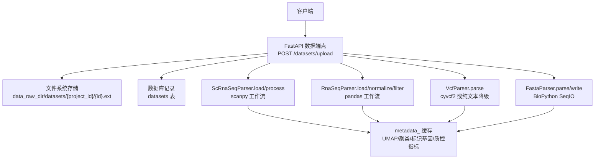
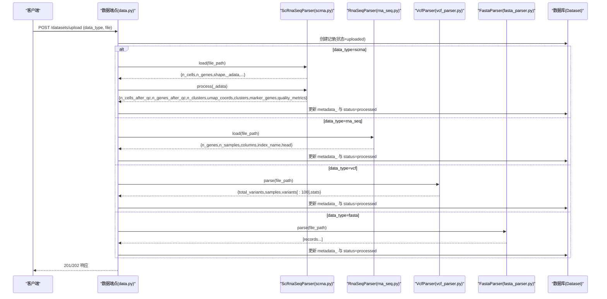
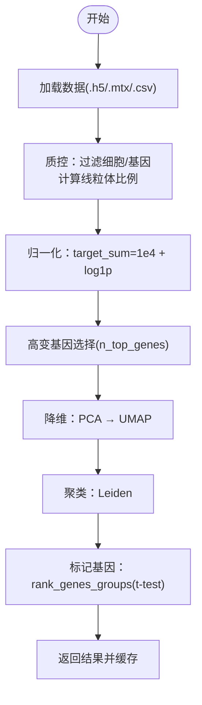
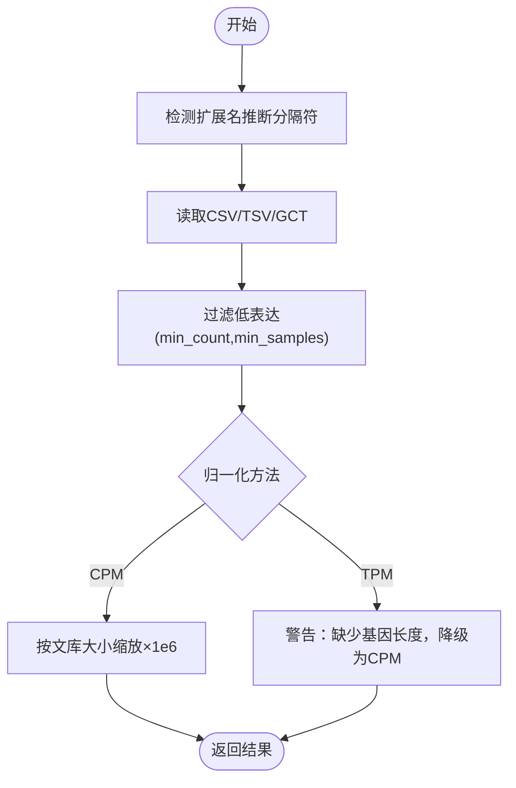
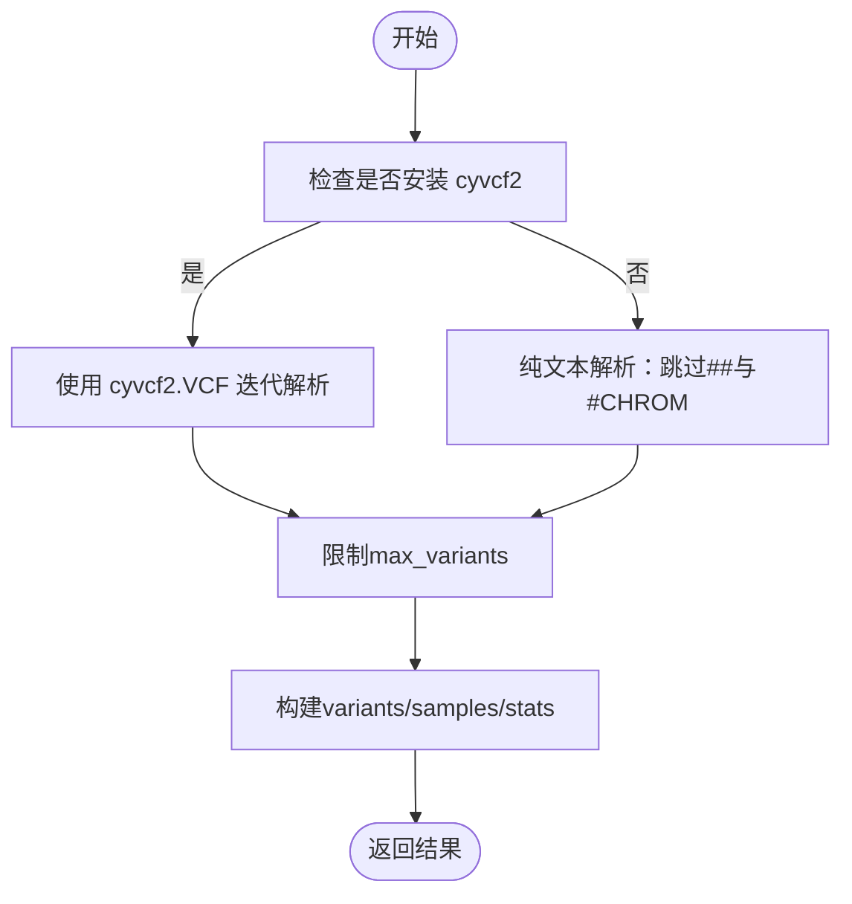
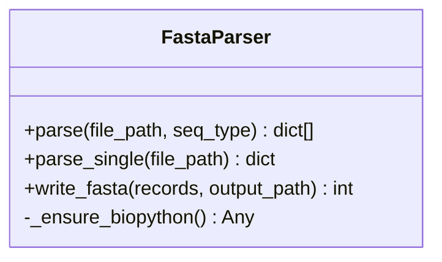
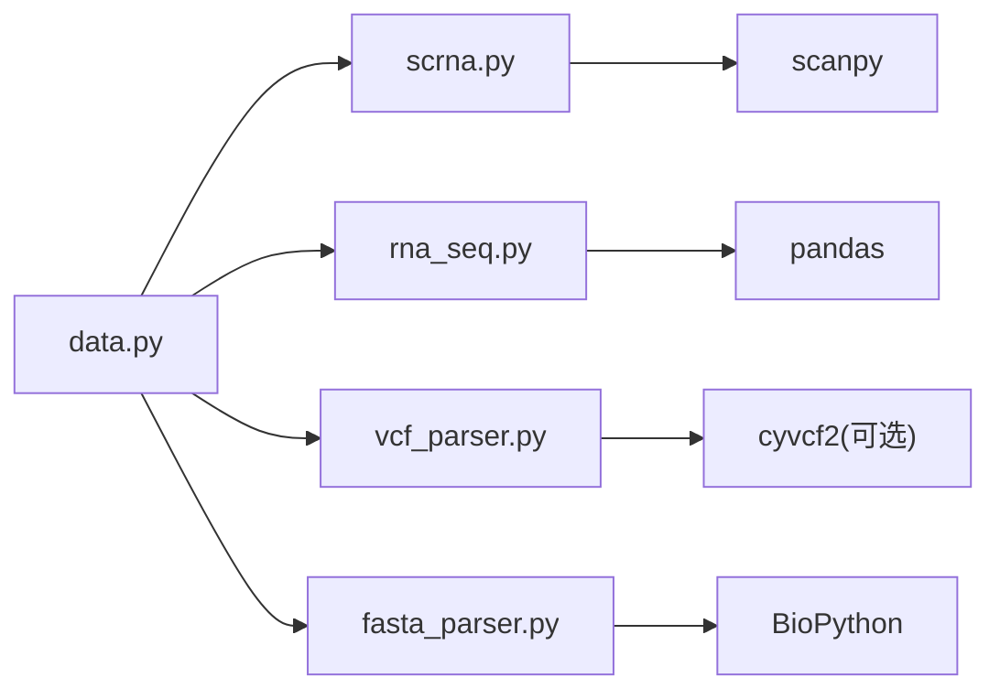

# 数据格式支持

<cite>
**本文引用的文件**   
- [fasta_parser.py](file://precision-drug-design/backend/app/services/parser/fasta_parser.py)
- [rna_seq.py](file://precision-drug-design/backend/app/services/parser/rna_seq.py)
- [scrna.py](file://precision-drug-design/backend/app/services/parser/scrna.py)
- [vcf_parser.py](file://precision-drug-design/backend/app/services/parser/vcf_parser.py)
- [data.py](file://precision-drug-design/backend/app/api/v1/data.py)
- [dataset.py](file://precision-drug-design/backend/app/models/dataset.py)
- [dataset.py](file://precision-drug-design/backend/app/schemas/dataset.py)
- [test_fasta_parser.py](file://precision-drug-design/tests/test_fasta_parser.py)
- [test_vcf_parser.py](file://precision-drug-design/tests/test_vcf_parser.py)
</cite>

## 目录
1. [简介](#简介)
2. [项目结构](#项目结构)
3. [核心组件](#核心组件)
4. [架构总览](#架构总览)
5. [详细组件分析](#详细组件分析)
6. [依赖关系分析](#依赖关系分析)
7. [性能与可扩展性](#性能与可扩展性)
8. [故障排查指南](#故障排查指南)
9. [结论](#结论)
10. [附录：格式规范与最佳实践](#附录格式规范与最佳实践)

## 简介
本文件面向AI药物设计系统的数据格式支持，聚焦以下生物医学数据格式的规范、数据结构定义与解析方法：
- scRNA-seq（10x MTX/HDF5/CSV）
- RNA-seq（CSV/TSV/GCT）
- VCF 变异文件
- FASTA 序列文件

文档涵盖字段含义、数据类型、编码方式、质量指标、验证规则、兼容性说明与转换工具使用方法，并提供实际文件格式示例与最佳实践建议。

## 项目结构
后端通过统一的上传接口接收多组学数据，按 data_type 路由到对应解析器进行加载与处理；scRNA-seq 提供标准预处理流程并缓存结果至数据集元数据中，供后续可视化与差异基因查询使用。

图表来源
- [data.py:54-121](file://precision-drug-design/backend/app/api/v1/data.py#L54-L121)
- [data.py:191-254](file://precision-drug-design/backend/app/api/v1/data.py#L191-L254)
- [dataset.py:15-47](file://precision-drug-design/backend/app/models/dataset.py#L15-L47)

章节来源
- [data.py:46-121](file://precision-drug-design/backend/app/api/v1/data.py#L46-L121)
- [dataset.py:15-47](file://precision-drug-design/backend/app/models/dataset.py#L15-L47)

## 核心组件
- ScRnaSeqParser：封装 scanpy 工作流，支持 10x MTX/HDF5/CSV 的加载与标准化预处理（QC、归一化、高变基因、PCA/UMAP、Leiden 聚类、标记基因）。
- RnaSeqParser：基于 pandas 的批量表达矩阵加载（CSV/TSV/GCT）、过滤低表达、CPM/TPM 归一化。
- VcfParser：基于 cyvcf2 的 VCF 4.x 解析，含纯文本降级路径，输出变异列表与统计信息。
- FastaParser：基于 BioPython 的 FASTA 解析与写入，支持注释提取与批量读写。

章节来源
- [scrna.py:13-160](file://precision-drug-design/backend/app/services/parser/scrna.py#L13-L160)
- [rna_seq.py:15-106](file://precision-drug-design/backend/app/services/parser/rna_seq.py#L15-L106)
- [vcf_parser.py:14-136](file://precision-drug-design/backend/app/services/parser/vcf_parser.py#L14-L136)
- [fasta_parser.py:12-100](file://precision-drug-design/backend/app/services/parser/fasta_parser.py#L12-L100)

## 架构总览
下图展示从上传到处理的端到端流程，以及各解析器的职责边界与返回数据结构。

图表来源
- [data.py:54-121](file://precision-drug-design/backend/app/api/v1/data.py#L54-L121)
- [data.py:191-254](file://precision-drug-design/backend/app/api/v1/data.py#L191-L254)
- [scrna.py:38-134](file://precision-drug-design/backend/app/services/parser/scrna.py#L38-L134)
- [rna_seq.py:32-106](file://precision-drug-design/backend/app/services/parser/rna_seq.py#L32-L106)
- [vcf_parser.py:32-136](file://precision-drug-design/backend/app/services/parser/vcf_parser.py#L32-L136)
- [fasta_parser.py:29-100](file://precision-drug-design/backend/app/services/parser/fasta_parser.py#L29-L100)

## 详细组件分析

### scRNA-seq（10x MTX/HDF5/CSV）
- 支持的输入
  - 10x HDF5：.h5（调用 read_10x_h5）
  - 10x MTX：.mtx 或包含 barcodes.tsv/features.tsv/matrix.mtx 的目录（调用 read_10x_mtx，var_names="gene_symbols"）
  - CSV：.csv（调用 read_csv）
- 数据结构与关键字段
  - AnnData.obs：细胞级观测，含 n_genes_by_counts、total_counts、pct_counts_mt 等 QC 指标列
  - AnnData.var：基因级变量，含 highly_variable 布尔列
  - AnnData.obsm["X_umap"]：UMAP 坐标
  - AnnData.obs["leiden"]：聚类标签
- 处理流程
  - 质控：过滤低基因数细胞与低细胞数基因；计算线粒体比例
  - 归一化：按总计数归一化至 1e4，log1p 变换
  - 高变基因选择：默认前 2000
  - 降维与聚类：PCA→邻域构建→UMAP→Leiden
  - 标记基因：rank_genes_groups（t-test），提取 top N
- 返回结果（用于缓存）
  - n_cells_after_qc、n_genes_after_qc、n_clusters
  - umap_coords（前 100 条预览）、clusters（前 100 条预览）
  - marker_genes：每个聚类的 top 标记基因及得分
  - quality_metrics：每细胞基因数中位数、每细胞总计数中位数、最大线粒体比例
- 兼容性与限制
  - 需要安装 scanpy；未安装将抛出运行时错误
  - 对 .gct 不支持直接读取（由 RnaSeqParser 负责）
- 典型用法路径
  - 加载：[scrna.py:38-73](file://precision-drug-design/backend/app/services/parser/scrna.py#L38-L73)
  - 处理：[scrna.py:75-134](file://precision-drug-design/backend/app/services/parser/scrna.py#L75-L134)
  - 标记基因提取：[scrna.py:136-159](file://precision-drug-design/backend/app/services/parser/scrna.py#L136-L159)

图表来源
- [scrna.py:75-134](file://precision-drug-design/backend/app/services/parser/scrna.py#L75-L134)

章节来源
- [scrna.py:13-160](file://precision-drug-design/backend/app/services/parser/scrna.py#L13-L160)

### RNA-seq（CSV/TSV/GCT）
- 支持的输入
  - CSV：逗号分隔，行=基因，列=样本
  - TSV：制表符分隔
  - GCT：跳过前两行头后以制表符分隔
- 数据结构与关键字段
  - index：基因标识（index_name）
  - columns：样本名列表
  - head：前几行字典快照
- 处理流程
  - 加载：根据扩展名推断分隔符；GCT 特殊处理
  - 过滤低表达：至少 min_samples 个样本中表达量 ≥ min_count
  - 归一化：CPM（每百万计数）；TPM 需基因长度，当前实现降级为 CPM 并告警
- 返回结果（用于缓存）
  - n_genes、n_samples、columns、index_name、head
- 兼容性与限制
  - 需要安装 pandas；未安装将抛出运行时错误
  - TPM 简化实现，不精确
- 典型用法路径
  - 加载：[rna_seq.py:32-65](file://precision-drug-design/backend/app/services/parser/rna_seq.py#L32-L65)
  - 归一化：[rna_seq.py:67-86](file://precision-drug-design/backend/app/services/parser/rna_seq.py#L67-L86)
  - 过滤：[rna_seq.py:88-106](file://precision-drug-design/backend/app/services/parser/rna_seq.py#L88-L106)

图表来源
- [rna_seq.py:32-86](file://precision-drug-design/backend/app/services/parser/rna_seq.py#L32-L86)

章节来源
- [rna_seq.py:15-106](file://precision-drug-design/backend/app/services/parser/rna_seq.py#L15-L106)

### VCF 变异文件（VCF 4.x）
- 支持的输入
  - VCF 4.x（可选 bgzip+tabix 索引，但解析器直接读取文本）
- 数据结构与关键字段
  - variants：每条变异含 chrom、pos、id、ref、alt、qual、filter、type
  - samples：样本名列
  - stats：按染色体/类型计数、样本数
- 处理流程
  - 优先使用 cyvcf2；若未安装则走纯文本降级路径
  - 解析头部与 #CHROM 行获取样本名
  - 逐行解析变异字段，限制 max_variants 数量
- 兼容性与限制
  - 未安装 cyvcf2 时降级为文本解析，type 标注为 unknown
  - 空 ID 或 QUAL 用 None 表示
- 典型用法路径
  - 主解析：[vcf_parser.py:32-87](file://precision-drug-design/backend/app/services/parser/vcf_parser.py#L32-L87)
  - 降级解析：[vcf_parser.py:89-136](file://precision-drug-design/backend/app/services/parser/vcf_parser.py#L89-L136)

图表来源
- [vcf_parser.py:32-136](file://precision-drug-design/backend/app/services/parser/vcf_parser.py#L32-L136)

章节来源
- [vcf_parser.py:14-136](file://precision-drug-design/backend/app/services/parser/vcf_parser.py#L14-L136)

### FASTA 序列文件
- 支持的输入
  - FASTA（可指定 seq_type，如 "fasta"/"genbank" 等）
- 数据结构与关键字段
  - id、name、description、sequence、length、annotations
- 处理流程
  - 惰性加载 BioPython SeqIO
  - 解析为记录列表；单序列便捷方法
  - 写入：每行 80 字符换行，自动创建父目录
- 兼容性与限制
  - 未安装 biopython 将抛出运行时错误
  - 空文件在单序列解析时报错
- 典型用法路径
  - 解析：[fasta_parser.py:29-58](file://precision-drug-design/backend/app/services/parser/fasta_parser.py#L29-L58)
  - 单序列：[fasta_parser.py:60-72](file://precision-drug-design/backend/app/services/parser/fasta_parser.py#L60-L72)
  - 写入：[fasta_parser.py:74-100](file://precision-drug-design/backend/app/services/parser/fasta_parser.py#L74-L100)

图表来源
- [fasta_parser.py:12-100](file://precision-drug-design/backend/app/services/parser/fasta_parser.py#L12-L100)

章节来源
- [fasta_parser.py:12-100](file://precision-drug-design/backend/app/services/parser/fasta_parser.py#L12-L100)

## 依赖关系分析
- 外部库
  - scanpy：scRNA-seq 全流程
  - pandas：RNA-seq 矩阵操作
  - cyvcf2：高性能 VCF 解析（可选，有降级）
  - BioPython：FASTA 解析与写入
- 内部耦合
  - API 层按 data_type 分发到对应解析器
  - 处理结果统一缓存至 Dataset.metadata_，便于后续查询（UMAP、markers、质量报告）

图表来源
- [data.py:191-254](file://precision-drug-design/backend/app/api/v1/data.py#L191-L254)
- [scrna.py:28-36](file://precision-drug-design/backend/app/services/parser/scrna.py#L28-L36)
- [rna_seq.py:22-30](file://precision-drug-design/backend/app/services/parser/rna_seq.py#L22-L30)
- [vcf_parser.py:21-30](file://precision-drug-design/backend/app/services/parser/vcf_parser.py#L21-L30)
- [fasta_parser.py:19-27](file://precision-drug-design/backend/app/services/parser/fasta_parser.py#L19-L27)

章节来源
- [data.py:191-254](file://precision-drug-design/backend/app/api/v1/data.py#L191-L254)

## 性能与可扩展性
- 大数据集
  - scRNA-seq：UMAP/Leiden 计算耗时，建议控制 n_pcs 与 n_top_genes；仅返回前 100 条预览以降低传输开销
  - VCF：max_variants 限制避免内存溢出；生产环境建议启用 cyvcf2
  - RNA-seq：大矩阵归一化注意内存占用，必要时分块处理
- 并行与缓存
  - ScRnaSeqParser 构造参数 n_jobs 可用于底层并行
  - 处理结果缓存于 metadata_，减少重复计算
- 扩展建议
  - 增加 GTF/GFF 注释以支持精确 TPM 计算
  - 引入增量解析与流式读取（如 h5ad 分块）

[本节为通用指导，无需源码引用]

## 故障排查指南
- 常见异常
  - 文件不存在：所有解析器均会抛出 FileNotFoundError
  - 依赖缺失：biopython/scanpy/pandas/cyvcf2 未安装导致运行时错误或降级
  - 空文件：FASTA 单序列解析报 ValueError
- 定位方法
  - 查看 API 日志与返回状态码（processing→failed 分支）
  - 检查 Dataset.status 与 metadata_ 中的 note 字段（VCF 降级时会包含提示）
- 测试用例参考
  - FASTA 写入与空文件行为：[test_fasta_parser.py:15-93](file://precision-drug-design/tests/test_fasta_parser.py#L15-L93)
  - VCF 降级路径与样本抽取：[test_vcf_parser.py:24-106](file://precision-drug-design/tests/test_vcf_parser.py#L24-L106)

章节来源
- [test_fasta_parser.py:53-93](file://precision-drug-design/tests/test_fasta_parser.py#L53-L93)
- [test_vcf_parser.py:14-106](file://precision-drug-design/tests/test_vcf_parser.py#L14-L106)

## 结论
系统围绕统一的数据上传与处理入口，为 scRNA-seq、RNA-seq、VCF 与 FASTA 提供了稳健的解析与处理管线。通过缓存中间结果与提供预览数据，兼顾了易用性与性能。建议在大规模场景下完善 TPM 计算、增强流式解析与监控告警能力。

[本节为总结，无需源码引用]

## 附录：格式规范与最佳实践

### scRNA-seq（10x MTX/HDF5/CSV）
- 字段与结构
  - obs（细胞）：n_genes_by_counts、total_counts、pct_counts_mt 等
  - var（基因）：highly_variable
  - obsm["X_umap"]：二维坐标
  - obs["leiden"]：聚类标签
- 质量指标
  - 每细胞基因数中位数、每细胞总计数中位数、最大线粒体比例
- 验证规则
  - 文件存在且后缀匹配；MTX 目录需包含必要文件；HDF5 可读
- 兼容性
  - 需要 scanpy；未安装将报错
- 转换工具
  - 10x Cell Ranger 输出可直接作为 .h5 或 .mtx 目录输入
  - CSV 应保证首列为基因名，其余列为样本计数
- 示例（示意）
  - .h5：read_10x_h5 可直接读取
  - .mtx：barcodes.tsv/features.tsv/matrix.mtx 三件套
  - .csv：第一行样本名，第一列基因名

章节来源
- [scrna.py:38-73](file://precision-drug-design/backend/app/services/parser/scrna.py#L38-L73)
- [scrna.py:75-134](file://precision-drug-design/backend/app/services/parser/scrna.py#L75-L134)

### RNA-seq（CSV/TSV/GCT）
- 字段与结构
  - 行：基因标识；列：样本；值：原始计数
- 质量指标
  - 低表达过滤阈值（min_count、min_samples）
- 验证规则
  - 行列维度合理；GCT 跳过前两行
- 兼容性
  - 需要 pandas；TPM 简化实现
- 转换工具
  - 从 HTSeq/featureCounts 输出的 count 矩阵可直接使用
- 示例（示意）
  - CSV：gene,sample1,sample2,...
  - TSV：同上，制表符分隔
  - GCT：前两行描述头，第三行起为矩阵

章节来源
- [rna_seq.py:32-65](file://precision-drug-design/backend/app/services/parser/rna_seq.py#L32-L65)
- [rna_seq.py:67-106](file://precision-drug-design/backend/app/services/parser/rna_seq.py#L67-L106)

### VCF（VCF 4.x）
- 字段与结构
  - CHROM、POS、ID、REF、ALT、QUAL、FILTER、INFO、FORMAT、样本列
- 质量指标
  - 质量分数（QUAL）、过滤标志（FILTER）
- 验证规则
  - 头部以 ## 开头；#CHROM 行必须存在；每行至少 8 列
- 兼容性
  - 优先 cyvcf2；未安装时降级为文本解析
- 转换工具
  - bcftools 压缩与索引（bgzip/tabix）可提升 I/O 性能
- 示例（示意）
  - 头部：##fileformat=VCFv4.2
  - 列头：#CHROM POS ID REF ALT QUAL FILTER INFO FORMAT S1 S2
  - 数据行：chr1 100 rs1 A T 99 PASS . GT 0/0 0/1

章节来源
- [vcf_parser.py:32-87](file://precision-drug-design/backend/app/services/parser/vcf_parser.py#L32-L87)
- [vcf_parser.py:89-136](file://precision-drug-design/backend/app/services/parser/vcf_parser.py#L89-L136)

### FASTA
- 字段与结构
  - 标题行以 > 开头，随后为序列行（每行 80 字符）
- 质量指标
  - 序列长度、注释完整性
- 验证规则
  - 非空文件；标题行与序列行交替出现
- 兼容性
  - 需要 biopython；支持多种 seq_type
- 转换工具
  - 可使用 write_fasta 生成合规文件
- 示例（示意）
  - >gene1\nATCGATCG...

章节来源
- [fasta_parser.py:29-100](file://precision-drug-design/backend/app/services/parser/fasta_parser.py#L29-L100)

### 上传与处理接口约定
- 允许的文件扩展名
  - csv、tsv、txt、vcf、fasta、fa、fna、h5、h5ad、mtx、pdf、png、jpg、jpeg、bam、json、xlsx
- 支持的 data_type
  - rna_seq、scrna、vcf、fasta、wes、wgs、ihc、proteomics、metabolomics
- 处理流程
  - scrna：触发 scanpy 标准流程并缓存结果
  - 其他类型：标记为 processed
- 查询接口
  - /datasets/{id}/umap：返回 UMAP 坐标与聚类标签
  - /datasets/{id}/markers：返回差异表达基因
  - /datasets/{id}/quality：返回质量报告

章节来源
- [data.py:46-121](file://precision-drug-design/backend/app/api/v1/data.py#L46-L121)
- [data.py:191-254](file://precision-drug-design/backend/app/api/v1/data.py#L191-L254)
- [data.py:257-340](file://precision-drug-design/backend/app/api/v1/data.py#L257-L340)
- [dataset.py:15-47](file://precision-drug-design/backend/app/models/dataset.py#L15-L47)