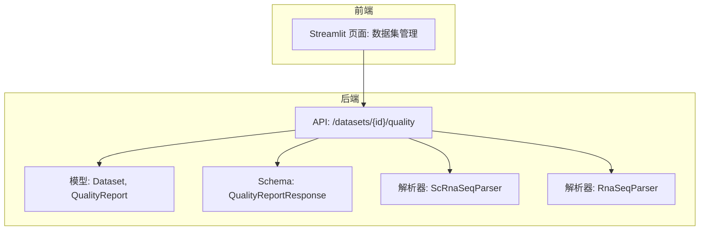
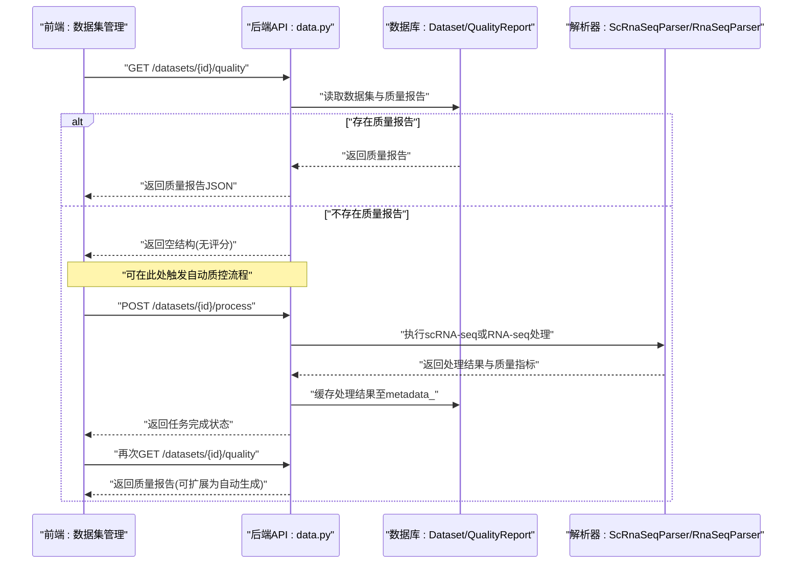
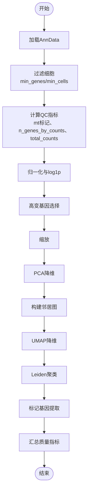
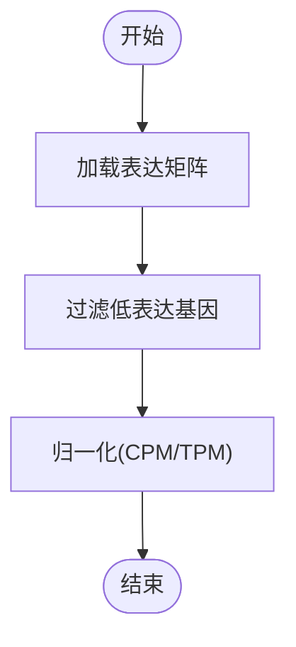
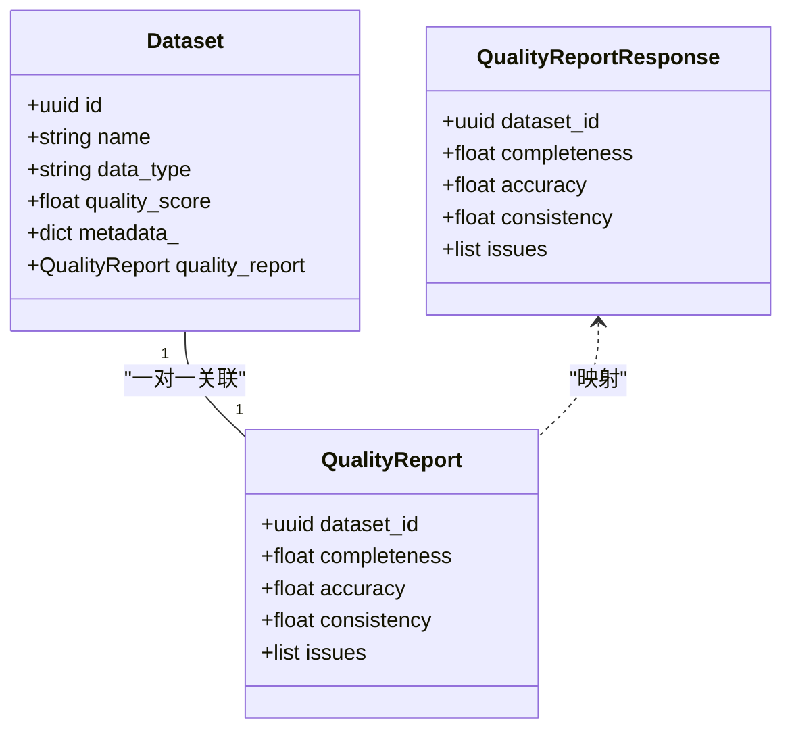
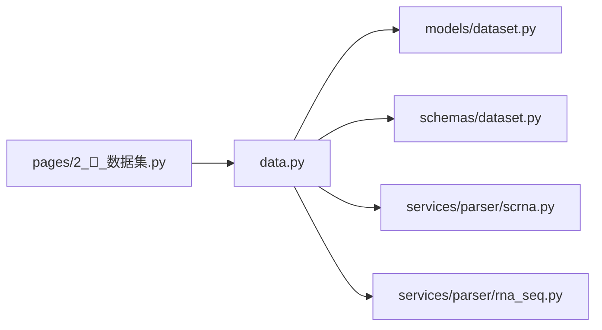

# 质量控制与评估

<cite>
**本文引用的文件**   
- [backend/app/models/dataset.py](file://backend/app/models/dataset.py)
- [backend/app/schemas/dataset.py](file://backend/app/schemas/dataset.py)
- [backend/app/api/v1/data.py](file://backend/app/api/v1/data.py)
- [backend/app/services/parser/scrna.py](file://backend/app/services/parser/scrna.py)
- [backend/app/services/parser/rna_seq.py](file://backend/app/services/parser/rna_seq.py)
- [frontend/pages/2_🧬_数据集.py](file://frontend/pages/2_🧬_数据集.py)
</cite>

## 目录
1. [简介](#简介)
2. [项目结构](#项目结构)
3. [核心组件](#核心组件)
4. [架构总览](#架构总览)
5. [详细组件分析](#详细组件分析)
6. [依赖关系分析](#依赖关系分析)
7. [性能考虑](#性能考虑)
8. [故障排查指南](#故障排查指南)
9. [结论](#结论)
10. [附录](#附录)

## 简介
本章节面向AI药物设计系统的质量控制与评估能力，聚焦以下目标：
- 数据质量评估指标的计算方法与阈值设置（细胞质量评分、基因表达质量、测序深度评估、批次效应检测等）
- 质量控制流程中的过滤标准、异常值识别、数据完整性检查
- 质量报告生成、可视化展示、质量趋势分析
- 质量阈值调优指南、常见问题诊断与解决方案

当前代码库已实现scRNA-seq与批量RNA-seq的基础质控与处理管线，并提供质量报告的数据模型与API接口。后续可在现有基础上扩展更丰富的指标与可视化能力。

## 项目结构
与质量控制相关的关键位置如下：
- 数据模型与响应Schema：定义质量报告结构与字段
- API层：提供质量报告查询接口
- 解析器：实现scRNA-seq与RNA-seq的质控与预处理逻辑
- 前端页面：提供上传、处理与查看质控结果的交互入口

图表来源
- [backend/app/api/v1/data.py:309-340](file://backend/app/api/v1/data.py#L309-L340)
- [backend/app/models/dataset.py:15-70](file://backend/app/models/dataset.py#L15-L70)
- [backend/app/schemas/dataset.py:106-123](file://backend/app/schemas/dataset.py#L106-L123)
- [backend/app/services/parser/scrna.py:75-134](file://backend/app/services/parser/scrna.py#L75-L134)
- [backend/app/services/parser/rna_seq.py:67-106](file://backend/app/services/parser/rna_seq.py#L67-L106)
- [frontend/pages/2_🧬_数据集.py:115-121](file://frontend/pages/2_🧬_数据集.py#L115-L121)

章节来源
- [backend/app/models/dataset.py:15-70](file://backend/app/models/dataset.py#L15-L70)
- [backend/app/schemas/dataset.py:106-123](file://backend/app/schemas/dataset.py#L106-L123)
- [backend/app/api/v1/data.py:309-340](file://backend/app/api/v1/data.py#L309-L340)
- [backend/app/services/parser/scrna.py:75-134](file://backend/app/services/parser/scrna.py#L75-L134)
- [backend/app/services/parser/rna_seq.py:67-106](file://backend/app/services/parser/rna_seq.py#L67-L106)
- [frontend/pages/2_🧬_数据集.py:115-121](file://frontend/pages/2_🧬_数据集.py#L115-L121)

## 核心组件
- 质量报告数据模型
  - 包含完整性、准确性、一致性三项评分（0-1），以及问题项列表
  - 与数据集一对一关联，便于按数据集追溯
- 质量报告响应Schema
  - 对外暴露dataset_id、completeness、accuracy、consistency、issues等字段
- scRNA-seq解析器
  - 基于Scanpy执行质控：过滤低质量细胞与低表达基因、计算线粒体比例、归一化、高变基因选择、PCA/UMAP降维、Leiden聚类、标记基因提取
  - 输出关键质量指标：每细胞中位基因数、每细胞中位计数、最大线粒体比例等
- RNA-seq解析器
  - 支持CSV/TSV/GCT加载、CPM/TPM归一化、低表达过滤
- 质量报告API
  - GET /datasets/{id}/quality 返回质量报告（若未生成则返回空结构）
- 前端交互
  - 数据集管理页面提供“查看质控”按钮，调用质量报告接口并展示结果

章节来源
- [backend/app/models/dataset.py:53-70](file://backend/app/models/dataset.py#L53-L70)
- [backend/app/schemas/dataset.py:106-123](file://backend/app/schemas/dataset.py#L106-L123)
- [backend/app/services/parser/scrna.py:75-134](file://backend/app/services/parser/scrna.py#L75-L134)
- [backend/app/services/parser/rna_seq.py:67-106](file://backend/app/services/parser/rna_seq.py#L67-L106)
- [backend/app/api/v1/data.py:309-340](file://backend/app/api/v1/data.py#L309-L340)
- [frontend/pages/2_🧬_数据集.py:115-121](file://frontend/pages/2_🧬_数据集.py#L115-L121)

## 架构总览
下图展示了从前端触发到后端生成/返回质量报告的端到端流程，以及scRNA-seq处理管线在其中的作用。

图表来源
- [backend/app/api/v1/data.py:191-254](file://backend/app/api/v1/data.py#L191-L254)
- [backend/app/api/v1/data.py:309-340](file://backend/app/api/v1/data.py#L309-L340)
- [backend/app/services/parser/scrna.py:75-134](file://backend/app/services/parser/scrna.py#L75-L134)
- [backend/app/services/parser/rna_seq.py:67-106](file://backend/app/services/parser/rna_seq.py#L67-L106)

## 详细组件分析

### scRNA-seq质量控制流程
- 输入：AnnData对象（来自10x MTX/HDF5/CSV）
- 步骤：
  - 细胞与基因过滤：min_genes、min_cells
  - 线粒体基因标记与QC指标计算（pct_counts_mt、n_genes_by_counts、total_counts）
  - 归一化与对数变换
  - 高变基因选择、缩放、PCA、邻居构建、UMAP、Leiden聚类
  - 标记基因提取（rank_genes_groups）
- 输出：
  - n_cells_after_qc、n_genes_after_qc、n_clusters
  - umap_coords、clusters（预览前100）
  - marker_genes
  - quality_metrics：median_genes_per_cell、median_counts_per_cell、max_pct_mt

图表来源
- [backend/app/services/parser/scrna.py:75-134](file://backend/app/services/parser/scrna.py#L75-L134)

章节来源
- [backend/app/services/parser/scrna.py:75-134](file://backend/app/services/parser/scrna.py#L75-L134)

### RNA-seq质量控制流程
- 输入：表达矩阵（CSV/TSV/GCT）
- 步骤：
  - 低表达过滤（min_count、min_samples）
  - 归一化（CPM/TPM，TPM简化为CPM）
- 输出：过滤后的表达矩阵与元信息

图表来源
- [backend/app/services/parser/rna_seq.py:67-106](file://backend/app/services/parser/rna_seq.py#L67-L106)

章节来源
- [backend/app/services/parser/rna_seq.py:67-106](file://backend/app/services/parser/rna_seq.py#L67-L106)

### 质量报告数据模型与API
- 数据模型
  - Dataset.quality_score：可选的综合质量分
  - QualityReport：completeness、accuracy、consistency、issues
- API
  - GET /datasets/{id}/quality：返回质量报告；若不存在则返回空结构
- 前端
  - “查看质控”按钮调用该接口并展示JSON结果

图表来源
- [backend/app/models/dataset.py:15-70](file://backend/app/models/dataset.py#L15-L70)
- [backend/app/schemas/dataset.py:106-123](file://backend/app/schemas/dataset.py#L106-L123)
- [backend/app/api/v1/data.py:309-340](file://backend/app/api/v1/data.py#L309-L340)

章节来源
- [backend/app/models/dataset.py:15-70](file://backend/app/models/dataset.py#L15-L70)
- [backend/app/schemas/dataset.py:106-123](file://backend/app/schemas/dataset.py#L106-L123)
- [backend/app/api/v1/data.py:309-340](file://backend/app/api/v1/data.py#L309-L340)
- [frontend/pages/2_🧬_数据集.py:115-121](file://frontend/pages/2_🧬_数据集.py#L115-L121)

## 依赖关系分析
- API层依赖：
  - 数据模型（Dataset、QualityReport）
  - Schema（QualityReportResponse）
  - 解析器（ScRnaSeqParser、RnaSeqParser）
- 解析器依赖：
  - Scanpy（scRNA-seq）
  - Pandas（RNA-seq）
- 前端依赖：
  - Streamlit界面与后端API交互

图表来源
- [backend/app/api/v1/data.py:309-340](file://backend/app/api/v1/data.py#L309-L340)
- [backend/app/models/dataset.py:15-70](file://backend/app/models/dataset.py#L15-L70)
- [backend/app/schemas/dataset.py:106-123](file://backend/app/schemas/dataset.py#L106-L123)
- [backend/app/services/parser/scrna.py:75-134](file://backend/app/services/parser/scrna.py#L75-L134)
- [backend/app/services/parser/rna_seq.py:67-106](file://backend/app/services/parser/rna_seq.py#L67-L106)
- [frontend/pages/2_🧬_数据集.py:115-121](file://frontend/pages/2_🧬_数据集.py#L115-L121)

## 性能考虑
- scRNA-seq处理涉及大规模矩阵运算，建议：
  - 合理设置n_jobs以利用多核
  - 控制高变基因数量与PCA主成分数以降低内存与时间开销
  - 仅返回预览坐标（如前100个）以减少传输体积
- RNA-seq归一化与过滤操作相对轻量，但大矩阵仍需注意内存占用
- 质量报告接口应支持分页与增量更新，避免重复计算

[本节为通用指导，不直接分析具体文件]

## 故障排查指南
- 扫描Py未安装
  - 现象：scRNA-seq处理抛出运行时错误
  - 解决：安装scanpy依赖
- 文件不存在或格式不支持
  - 现象：加载阶段报错
  - 解决：确认文件路径与扩展名（mtx/h5/csv）
- 质量报告为空
  - 现象：GET /datasets/{id}/quality返回空结构
  - 解决：先执行数据处理流程（POST /datasets/{id}/process），再重试获取质量报告
- 前端显示失败
  - 现象：点击“查看质控”报错
  - 解决：检查网络请求与后端日志，确认数据集ID有效且权限正确

章节来源
- [backend/app/services/parser/scrna.py:28-36](file://backend/app/services/parser/scrna.py#L28-36)
- [backend/app/services/parser/scrna.py:38-73](file://backend/app/services/parser/scrna.py#L38-L73)
- [backend/app/api/v1/data.py:309-340](file://backend/app/api/v1/data.py#L309-L340)
- [frontend/pages/2_🧬_数据集.py:115-121](file://frontend/pages/2_🧬_数据集.py#L115-L121)

## 结论
当前系统在scRNA-seq与RNA-seq层面提供了基础的质量控制与处理管线，并通过数据模型与API暴露质量报告。建议在现有基础上：
- 完善质量报告生成逻辑（自动触发与持久化）
- 扩展更多指标（如批次效应检测、测序深度评估、异常值识别）
- 增强可视化与趋势分析能力（前端集成图表）
- 建立阈值管理与调优机制（结合业务场景动态调整）

[本节为总结性内容，不直接分析具体文件]

## 附录

### 质量指标计算方法与阈值设置建议
- 细胞质量评分
  - 指标：每细胞基因数中位数、每细胞总计数中位数、最大线粒体比例
  - 阈值建议：根据样本类型与平台经验设定，例如pct_counts_mt上限常见于5%-20%之间
- 基因表达质量
  - 指标：高变基因数量、低表达过滤后保留率
  - 阈值建议：依据下游分析需求调整n_top_genes与min_samples
- 测序深度评估
  - 指标：每细胞总计数、每细胞基因数
  - 阈值建议：结合文库大小与测序策略评估
- 批次效应检测
  - 方法：可通过聚类分布比较、PCA/UMAP重叠度、统计检验（如K-S检验）进行初步筛查
  - 阈值建议：根据领域知识与可视化结果综合判断

[本节为概念性说明，不直接分析具体文件]

### 质量控制流程中的过滤标准与异常值识别
- 过滤标准
  - 细胞：min_genes、min_cells
  - 基因：min_cells（在scRNA-seq）、min_count与min_samples（在RNA-seq）
- 异常值识别
  - 基于线粒体比例、总计数分布、基因数分布进行离群点识别
  - 可使用稳健统计量（如MAD）辅助判定

[本节为概念性说明，不直接分析具体文件]

### 质量报告生成、可视化与趋势分析
- 生成
  - 当前API返回空结构时，可在处理完成后自动生成并持久化
- 可视化
  - 前端可集成UMAP散点图、聚类标签分布、标记基因热图
- 趋势分析
  - 记录每次处理的质量指标，绘制时间序列对比不同批次/版本

[本节为概念性说明，不直接分析具体文件]

### 质量阈值调优指南
- 基线设定
  - 参考公开数据集与平台规范，确定初始阈值
- 迭代优化
  - 通过A/B测试与下游任务表现反馈，逐步调整阈值
- 监控告警
  - 当关键指标超出阈值范围时触发告警，提示人工复核

[本节为概念性说明，不直接分析具体文件]