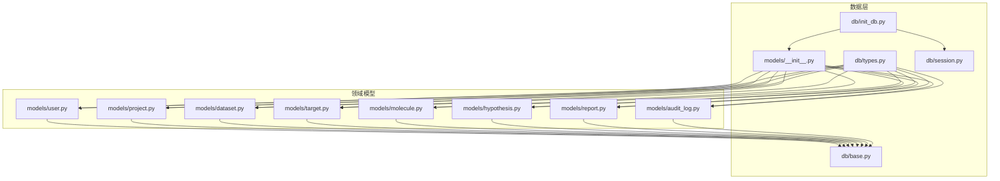
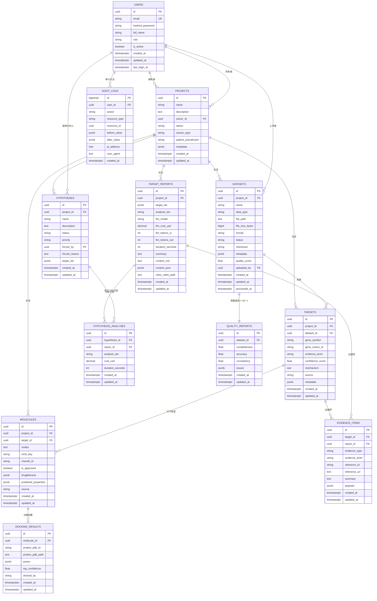

# 实体关系设计

<cite>
**本文引用的文件**   
- [backend/app/models/__init__.py](file://precision-drug-design/backend/app/models/__init__.py)
- [backend/app/db/base.py](file://precision-drug-design/backend/app/db/base.py)
- [backend/app/db/types.py](file://precision-drug-design/backend/app/db/types.py)
- [backend/app/db/session.py](file://precision-drug-design/backend/app/db/session.py)
- [backend/app/db/init_db.py](file://precision-drug-design/backend/app/db/init_db.py)
- [backend/app/models/user.py](file://precision-drug-design/backend/app/models/user.py)
- [backend/app/models/project.py](file://precision-drug-design/backend/app/models/project.py)
- [backend/app/models/dataset.py](file://precision-drug-design/backend/app/models/dataset.py)
- [backend/app/models/target.py](file://precision-drug-design/backend/app/models/target.py)
- [backend/app/models/molecule.py](file://precision-drug-design/backend/app/models/molecule.py)
- [backend/app/models/hypothesis.py](file://precision-drug-design/backend/app/models/hypothesis.py)
- [backend/app/models/report.py](file://precision-drug-design/backend/app/models/report.py)
- [backend/app/models/audit_log.py](file://precision-drug-design/backend/app/models/audit_log.py)
- [docs/design/03-database.md](file://precision-drug-design/docs/design/03-database.md)
</cite>

## 目录
1. [引言](#引言)
2. [项目结构](#项目结构)
3. [核心组件](#核心组件)
4. [架构总览](#架构总览)
5. [详细组件分析](#详细组件分析)
6. [依赖与关系分析](#依赖与关系分析)
7. [性能考虑](#性能考虑)
8. [故障排查指南](#故障排查指南)
9. [结论](#结论)
10. [附录](#附录)

## 引言
本文件面向数据库设计者与开发者，系统化梳理 AI 药物设计系统的实体关系模型、外键约束与级联策略、引用完整性保证机制，并提供 ER 图、关系映射策略、JOIN 查询优化方案、复杂查询示例与性能调优建议。系统采用 PostgreSQL 作为主存储，结合 JSONB/数组等灵活字段，配合 SQLAlchemy ORM 进行建模与迁移管理。

## 项目结构
后端使用 SQLAlchemy 声明式模型组织数据层，所有模型集中于 models 包，并通过 __init__ 统一导出供 Alembic 发现；基础类型、混入类与跨方言兼容类型位于 db 子包；数据库初始化脚本负责建表与初始用户创建。

图表来源
- [backend/app/models/__init__.py:1-29](file://precision-drug-design/backend/app/models/__init__.py#L1-L29)
- [backend/app/db/base.py:1-48](file://precision-drug-design/backend/app/db/base.py#L1-L48)
- [backend/app/db/types.py:1-42](file://precision-drug-design/backend/app/db/types.py#L1-L42)
- [backend/app/db/session.py:1-128](file://precision-drug-design/backend/app/db/session.py#L1-L128)
- [backend/app/db/init_db.py:1-88](file://precision-drug-design/backend/app/db/init_db.py#L1-L88)

章节来源
- [backend/app/models/__init__.py:1-29](file://precision-drug-design/backend/app/models/__init__.py#L1-L29)
- [backend/app/db/base.py:1-48](file://precision-drug-design/backend/app/db/base.py#L1-L48)
- [backend/app/db/types.py:1-42](file://precision-drug-design/backend/app/db/types.py#L1-L42)
- [backend/app/db/session.py:1-128](file://precision-drug-design/backend/app/db/session.py#L1-L128)
- [backend/app/db/init_db.py:1-88](file://precision-drug-design/backend/app/db/init_db.py#L1-L88)

## 核心组件
- 基础基类与混入：提供 UUID 主键与时间戳混入，统一 id、created_at、updated_at 语义。
- 跨方言类型：JSONBCompat 在 PostgreSQL 上为 JSONB，其他方言降级为 JSON；INETCompat 在 PostgreSQL 上使用 INET，其他方言使用字符串。
- 会话管理：同时暴露同步与异步引擎与会话工厂，FastAPI 路由通过依赖注入获取会话，异常时自动回滚。
- 初始化流程：导入全部模型以注册到 Base.metadata，随后创建所有表并插入初始 founder 用户。

章节来源
- [backend/app/db/base.py:13-48](file://precision-drug-design/backend/app/db/base.py#L13-L48)
- [backend/app/db/types.py:13-42](file://precision-drug-design/backend/app/db/types.py#L13-L42)
- [backend/app/db/session.py:48-128](file://precision-drug-design/backend/app/db/session.py#L48-L128)
- [backend/app/db/init_db.py:35-88](file://precision-drug-design/backend/app/db/init_db.py#L35-L88)

## 架构总览
下图展示核心实体间的关联关系（一对一、一对多、多对一）以及关键外键与级联策略。

图表来源
- [backend/app/models/user.py:14-36](file://precision-drug-design/backend/app/models/user.py#L14-L36)
- [backend/app/models/project.py:14-42](file://precision-drug-design/backend/app/models/project.py#L14-L42)
- [backend/app/models/dataset.py:15-70](file://precision-drug-design/backend/app/models/dataset.py#L15-L70)
- [backend/app/models/target.py:14-52](file://precision-drug-design/backend/app/models/target.py#L14-L52)
- [backend/app/models/molecule.py:14-61](file://precision-drug-design/backend/app/models/molecule.py#L14-L61)
- [backend/app/models/hypothesis.py:15-66](file://precision-drug-design/backend/app/models/hypothesis.py#L15-L66)
- [backend/app/models/report.py:15-73](file://precision-drug-design/backend/app/models/report.py#L15-L73)
- [backend/app/models/audit_log.py:15-45](file://precision-drug-design/backend/app/models/audit_log.py#L15-L45)
- [docs/design/03-database.md:44-242](file://precision-drug-design/docs/design/03-database.md#L44-L242)

## 详细组件分析

### 用户与项目（一对多）
- 关系：一个用户可拥有多个项目；项目通过外键 owner_id 引用 users.id。
- 约束与级联：删除用户时 RESTRICT，防止误删导致项目悬空。
- 索引：users.email 唯一索引；projects.owner_id 普通索引。

章节来源
- [backend/app/models/user.py:27-32](file://precision-drug-design/backend/app/models/user.py#L27-L32)
- [backend/app/models/project.py:24-26](file://precision-drug-design/backend/app/models/project.py#L24-L26)
- [docs/design/03-database.md:44-73](file://precision-drug-design/docs/design/03-database.md#L44-L73)

### 项目与数据集（一对多）
- 关系：一个项目包含多个数据集；dataset.project_id 引用 projects.id。
- 约束与级联：删除项目时 CASCADE，级联删除其数据集。
- 索引：datasets.project_id 索引；复合索引 idx_datasets_type_status 用于按类型与状态筛选。

章节来源
- [backend/app/models/project.py:33-35](file://precision-drug-design/backend/app/models/project.py#L33-L35)
- [backend/app/models/dataset.py:27-29](file://precision-drug-design/backend/app/models/dataset.py#L27-L29)
- [docs/design/03-database.md:75-94](file://precision-drug-design/docs/design/03-database.md#L75-L94)

### 数据集与质量报告（一对一）
- 关系：每个数据集最多一条质量报告；quality_report.dataset_id 唯一且引用 datasets.id。
- 约束与级联：删除数据集时 CASCADE，级联删除质量报告。
- 索引：quality_reports.dataset_id 唯一索引。

章节来源
- [backend/app/models/dataset.py:45-47](file://precision-drug-design/backend/app/models/dataset.py#L45-L47)
- [backend/app/models/dataset.py:61-63](file://precision-drug-design/backend/app/models/dataset.py#L61-L63)
- [docs/design/03-database.md:231-242](file://precision-drug-design/docs/design/03-database.md#L231-L242)

### 项目与靶点（一对多）
- 关系：一个项目包含多个靶点；target.project_id 引用 projects.id。
- 约束与级联：删除项目时 CASCADE。
- 索引：targets.project_id、targets.gene_symbol、targets.evidence_level。

章节来源
- [backend/app/models/target.py:29-31](file://precision-drug-design/backend/app/models/target.py#L29-L31)
- [docs/design/03-database.md:96-112](file://precision-drug-design/docs/design/03-database.md#L96-L112)

### 数据集与靶点（一对多，可选）
- 关系：靶点可来源于某个数据集；target.dataset_id 可为空。
- 约束与级联：删除数据集时 SET NULL，保留靶点但断开来源。
- 索引：targets.dataset_id 未显式定义，可通过查询条件过滤。

章节来源
- [backend/app/models/target.py:32-34](file://precision-drug-design/backend/app/models/target.py#L32-L34)
- [docs/design/03-database.md:96-112](file://precision-drug-design/docs/design/03-database.md#L96-L112)

### 项目与分子（一对多）
- 关系：一个项目包含多个分子；molecule.project_id 引用 projects.id。
- 约束与级联：删除项目时 CASCADE。
- 索引：molecules.project_id、molecules.target_id、molecules.inchi_key（唯一）。

章节来源
- [backend/app/models/molecule.py:23-25](file://precision-drug-design/backend/app/models/molecule.py#L23-L25)
- [docs/design/03-database.md:114-130](file://precision-drug-design/docs/design/03-database.md#L114-L130)

### 靶点与分子（一对多，可选）
- 关系：分子可关联到一个靶点；molecule.target_id 可为空。
- 约束与级联：删除靶点时 SET NULL，保留分子但断开关联。
- 索引：molecules.target_id 已定义索引。

章节来源
- [backend/app/models/molecule.py:26-28](file://precision-drug-design/backend/app/models/molecule.py#L26-L28)
- [docs/design/03-database.md:114-130](file://precision-drug-design/docs/design/03-database.md#L114-L130)

### 分子与对接结果（一对多）
- 关系：一个分子有多条对接结果；docking_result.molecule_id 引用 molecules.id。
- 约束与级联：删除分子时 CASCADE，级联删除对接结果。
- 索引：docking_results.molecule_id。

章节来源
- [backend/app/models/molecule.py:38-40](file://precision-drug-design/backend/app/models/molecule.py#L38-L40)
- [backend/app/models/molecule.py:51-53](file://precision-drug-design/backend/app/models/molecule.py#L51-L53)
- [docs/design/03-database.md:200-212](file://precision-drug-design/docs/design/03-database.md#L200-L212)

### 项目与假设（一对多）
- 关系：一个项目包含多个假设；hypothesis.project_id 引用 projects.id。
- 约束与级联：删除项目时 CASCADE。
- 索引：hypotheses.project_id、hypotheses.status。

章节来源
- [backend/app/models/hypothesis.py:27-29](file://precision-drug-design/backend/app/models/hypothesis.py#L27-L29)
- [docs/design/03-database.md:170-186](file://precision-drug-design/docs/design/03-database.md#L170-L186)

### 假设与分析记录（一对多）
- 关系：一个假设对应多条分析记录；analysis.hypothesis_id 引用 hypotheses.id。
- 约束与级联：删除假设时 CASCADE。
- 索引：hypothesis_analyses.hypothesis_id。

章节来源
- [backend/app/models/hypothesis.py:54-56](file://precision-drug-design/backend/app/models/hypothesis.py#L54-L56)
- [docs/design/03-database.md:188-199](file://precision-drug-design/docs/design/03-database.md#L188-L199)

### 项目与靶点报告（一对多）
- 关系：一个项目包含多个报告；report.project_id 引用 projects.id。
- 约束与级联：删除项目时 CASCADE。
- 索引：target_reports.project_id、target_reports.created_at。

章节来源
- [backend/app/models/report.py:23-25](file://precision-drug-design/backend/app/models/report.py#L23-L25)
- [docs/design/03-database.md:132-151](file://precision-drug-design/docs/design/03-database.md#L132-L151)

### 报告与证据项（一对多）
- 关系：一个报告包含多个证据项；evidence.report_id 引用 target_reports.id。
- 约束与级联：删除报告时 SET NULL，保留证据项但断开报告关联。
- 索引：evidence_items.report_id 未显式定义，可通过查询条件过滤。

章节来源
- [backend/app/models/report.py:38-41](file://precision-drug-design/backend/app/models/report.py#L38-L41)
- [backend/app/models/report.py:61-63](file://precision-drug-design/backend/app/models/report.py#L61-L63)
- [docs/design/03-database.md:153-168](file://precision-drug-design/docs/design/03-database.md#L153-L168)

### 靶点与证据项（一对多）
- 关系：一个靶点包含多个证据项；evidence.target_id 引用 targets.id。
- 约束与级联：删除靶点时 SET NULL，保留证据项但断开靶点关联。
- 索引：evidence_items.target_id、evidence_items.evidence_type。

章节来源
- [backend/app/models/target.py:43-45](file://precision-drug-design/backend/app/models/target.py#L43-L45)
- [backend/app/models/report.py:58-60](file://precision-drug-design/backend/app/models/report.py#L58-L60)
- [docs/design/03-database.md:153-168](file://precision-drug-design/docs/design/03-database.md#L153-L168)

### 审计日志（append-only）
- 关系：审计日志记录用户操作；audit_log.user_id 引用 users.id。
- 约束与级联：删除用户时 SET NULL，保留审计记录。
- 索引：idx_audit_action_time(action, created_at)。

章节来源
- [backend/app/models/audit_log.py:25-27](file://precision-drug-design/backend/app/models/audit_log.py#L25-L27)
- [backend/app/models/audit_log.py:39-41](file://precision-drug-design/backend/app/models/audit_log.py#L39-L41)
- [docs/design/03-database.md:213-229](file://precision-drug-design/docs/design/03-database.md#L213-L229)

## 依赖与关系分析
- 耦合与内聚：
  - 模型间通过外键形成清晰的主从关系，Project 作为业务边界聚合 Dataset、Target、Molecule、Hypothesis、Report。
  - EvidenceItem 同时关联 Target 与 Report，体现“证据”既可归属靶点也可归属报告的多维视角。
- 直接依赖：
  - 所有模型依赖 Base、UUIDPrimaryKey、TimestampMixin 与 JSONBCompat/INETCompat。
  - 会话模块提供同步/异步引擎与会话工厂，供应用层与初始化脚本使用。
- 间接依赖：
  - 初始化脚本依赖配置与密码哈希工具，确保首次启动可用。
- 潜在循环依赖：
  - 模型间通过 back_populates 建立双向关系，但无 import 循环风险（延迟解析字符串类型名）。

```mermaid
classDiagram
class Base
class UUIDPrimaryKey
class TimestampMixin
class JSONBCompat
class INETCompat
class User
class Project
class Dataset
class QualityReport
class Target
class Molecule
class DockingResult
class Hypothesis
class HypothesisAnalysis
class TargetReport
class EvidenceItem
class AuditLog
Base <|-- User
Base <|-- Project
Base <|-- Dataset
Base <|-- QualityReport
Base <|-- Target
Base <|-- Molecule
Base <|-- DockingResult
Base <|-- Hypothesis
Base <|-- HypothesisAnalysis
Base <|-- TargetReport
Base <|-- EvidenceItem
Base <|-- AuditLog
UUIDPrimaryKey <|-- User
UUIDPrimaryKey <|-- Project
UUIDPrimaryKey <|-- Dataset
UUIDPrimaryKey <|-- QualityReport
UUIDPrimaryKey <|-- Target
UUIDPrimaryKey <|-- Molecule
UUIDPrimaryKey <|-- DockingResult
UUIDPrimaryKey <|-- Hypothesis
UUIDPrimaryKey <|-- HypothesisAnalysis
UUIDPrimaryKey <|-- TargetReport
UUIDPrimaryKey <|-- EvidenceItem
TimestampMixin <|-- User
TimestampMixin <|-- Project
TimestampMixin <|-- Dataset
TimestampMixin <|-- QualityReport
TimestampMixin <|-- Target
TimestampMixin <|-- Molecule
TimestampMixin <|-- DockingResult
TimestampMixin <|-- Hypothesis
TimestampMixin <|-- HypothesisAnalysis
TimestampMixin <|-- TargetReport
TimestampMixin <|-- EvidenceItem
JSONBCompat <.. Project
JSONBCompat <.. Dataset
JSONBCompat <.. Target
JSONBCompat <.. Molecule
JSONBCompat <.. Hypothesis
JSONBCompat <.. TargetReport
JSONBCompat <.. EvidenceItem
JSONBCompat <.. AuditLog
INETCompat <.. AuditLog
```

图表来源
- [backend/app/db/base.py:13-48](file://precision-drug-design/backend/app/db/base.py#L13-L48)
- [backend/app/db/types.py:13-42](file://precision-drug-design/backend/app/db/types.py#L13-L42)
- [backend/app/models/user.py:14-36](file://precision-drug-design/backend/app/models/user.py#L14-L36)
- [backend/app/models/project.py:14-42](file://precision-drug-design/backend/app/models/project.py#L14-L42)
- [backend/app/models/dataset.py:15-70](file://precision-drug-design/backend/app/models/dataset.py#L15-L70)
- [backend/app/models/target.py:14-52](file://precision-drug-design/backend/app/models/target.py#L14-L52)
- [backend/app/models/molecule.py:14-61](file://precision-drug-design/backend/app/models/molecule.py#L14-L61)
- [backend/app/models/hypothesis.py:15-66](file://precision-drug-design/backend/app/models/hypothesis.py#L15-L66)
- [backend/app/models/report.py:15-73](file://precision-drug-design/backend/app/models/report.py#L15-L73)
- [backend/app/models/audit_log.py:15-45](file://precision-drug-design/backend/app/models/audit_log.py#L15-L45)

章节来源
- [backend/app/models/user.py:14-36](file://precision-drug-design/backend/app/models/user.py#L14-L36)
- [backend/app/models/project.py:14-42](file://precision-drug-design/backend/app/models/project.py#L14-L42)
- [backend/app/models/dataset.py:15-70](file://precision-drug-design/backend/app/models/dataset.py#L15-L70)
- [backend/app/models/target.py:14-52](file://precision-drug-design/backend/app/models/target.py#L14-L52)
- [backend/app/models/molecule.py:14-61](file://precision-drug-design/backend/app/models/molecule.py#L14-L61)
- [backend/app/models/hypothesis.py:15-66](file://precision-drug-design/backend/app/models/hypothesis.py#L15-L66)
- [backend/app/models/report.py:15-73](file://precision-drug-design/backend/app/models/report.py#L15-L73)
- [backend/app/models/audit_log.py:15-45](file://precision-drug-design/backend/app/models/audit_log.py#L15-L45)

## 性能考虑
- 索引策略
  - 高频过滤字段加索引：如 projects.owner_id、datasets.project_id、targets.gene_symbol/evidence_level、molecules.project_id/target_id/inchi_key、hypotheses.project_id/status、target_reports.project_id/created_at、evidence_items.target_id/evidence_type、audit_logs.action/created_at。
  - 复合索引：datasets.type+status、audit_logs.action+created_at，提升范围与组合查询效率。
  - GIN 索引：datasets.metadata(JSONB)、reports.content_json(JSONB)，支持高效 JSON 查询。
- 连接与池化
  - 非 SQLite 场景启用连接池参数（pool_pre_ping、pool_size、max_overflow），提高并发稳定性。
- 查询优化
  - 优先使用外键索引与复合索引减少全表扫描。
  - 避免 N+1 查询：批量加载时使用 joinedload/selectinload 或预取关联对象。
  - 大 JSONB 字段仅选择必要列，必要时拆分出结构化小表。
- 写入优化
  - 批量插入与事务合并提交，降低锁竞争。
  - append-only 审计表避免 UPDATE/DELETE，减少行版本膨胀。

[本节为通用指导，不直接分析具体文件]

## 故障排查指南
- 外键冲突
  - 现象：删除父记录时报外键约束失败（RESTRICT）。
  - 处理：先清理子记录或改为 SET NULL/CASCADE 策略。
  - 参考：projects.owner_id 的 RESTRICT 行为。
- 级联删除影响
  - 现象：删除项目后数据集、靶点、分子、报告被级联删除。
  - 处理：确认业务允许；如需保留，调整 ondelete 策略。
- 会话异常回滚
  - 现象：请求中 DB 操作抛出异常导致事务回滚。
  - 处理：检查业务逻辑与约束；查看日志定位错误。
- 初始化失败
  - 现象：建表或插入初始用户失败。
  - 处理：检查数据库 URL、权限、驱动兼容性；确认 alembic 迁移状态。

章节来源
- [backend/app/models/project.py:24-26](file://precision-drug-design/backend/app/models/project.py#L24-L26)
- [backend/app/db/session.py:94-128](file://precision-drug-design/backend/app/db/session.py#L94-L128)
- [backend/app/db/init_db.py:35-88](file://precision-drug-design/backend/app/db/init_db.py#L35-L88)

## 结论
本实体关系设计围绕“项目”为核心聚合边界，构建用户、数据集、靶点、分子、报告、假设及其分析记录的完整链路。通过合理的外键约束与级联策略保障引用完整性，借助索引与 JSONB/GIN 能力支撑复杂查询与灵活扩展。审计日志采用 append-only 设计确保不可篡改。整体模型兼顾科学工作流的可追溯性与工程实现的高效性。

[本节为总结性内容，不直接分析具体文件]

## 附录

### 关系映射策略
- 一对一：Dataset ↔ QualityReport（unique + cascade delete-orphan）。
- 一对多：Project → Dataset/Target/Molecule/Hypothesis/TargetReport；Target → EvidenceItem；Molecule → DockingResult；Hypothesis → HypothesisAnalysis。
- 多对一（可选）：Target ← Dataset（SET NULL）、Molecule ← Target（SET NULL）、EvidenceItem ← Target/Report（SET NULL）、AuditLog ← User（SET NULL）。
- 多对多：当前未引入中间表，使用 JSONB 数组（如 hypotheses.target_ids、target_reports.target_ids）表达集合关系，便于快速迭代与灵活扩展。

章节来源
- [backend/app/models/dataset.py:45-47](file://precision-drug-design/backend/app/models/dataset.py#L45-L47)
- [backend/app/models/target.py:43-48](file://precision-drug-design/backend/app/models/target.py#L43-L48)
- [backend/app/models/molecule.py:37-40](file://precision-drug-design/backend/app/models/molecule.py#L37-L40)
- [backend/app/models/hypothesis.py:40-43](file://precision-drug-design/backend/app/models/hypothesis.py#L40-L43)
- [backend/app/models/report.py:38-41](file://precision-drug-design/backend/app/models/report.py#L38-L41)
- [docs/design/03-database.md:170-199](file://precision-drug-design/docs/design/03-database.md#L170-L199)

### JOIN 查询优化方案
- 典型路径
  - 项目→数据集→质量报告：使用外键索引与一对一关系，避免额外 JOIN 开销。
  - 项目→靶点→证据项：利用 targets.project_id 与 evidence_items.target_id 索引，必要时使用 GIN 索引加速 JSONB 过滤。
  - 项目→分子→对接结果：基于 molecules.project_id 与 docking_results.molecule_id 索引。
- 批量加载
  - 使用 selectinload/joinedload 预取关联对象，减少 N+1 查询。
- 条件过滤
  - 将常用过滤条件置于带索引的列（如 status、data_type、evidence_level、created_at）。

[本节为通用指导，不直接分析具体文件]

### 复杂查询场景 SQL 示例
以下为概念性示例，实际字段与表名以模型为准：
- 列出某项目的活跃假设及其最新分析成本
  - SELECT h.name, ha.cost_usd, ha.duration_seconds
  - FROM hypotheses h
  - JOIN hypothesis_analyses ha ON ha.hypothesis_id = h.id
  - WHERE h.project_id = :pid AND h.status = 'active'
  - ORDER BY ha.created_at DESC LIMIT 1;
- 统计某项目下各证据类型的数量
  - SELECT e.evidence_type, COUNT(*) AS cnt
  - FROM evidence_items e
  - JOIN target_reports tr ON tr.id = e.report_id
  - WHERE tr.project_id = :pid
  - GROUP BY e.evidence_type;
- 检索某基因符号的靶点及其分子候选数
  - SELECT t.gene_symbol, COUNT(m.id) AS mol_count
  - FROM targets t
  - LEFT JOIN molecules m ON m.target_id = t.id
  - WHERE t.gene_symbol = :symbol
  - GROUP BY t.gene_symbol;
- 查询最近 7 天新增的对接结果及置信度
  - SELECT dr.protein_pdb_id, dr.top_confidence, dr.created_at
  - FROM docking_results dr
  - JOIN molecules mo ON mo.id = dr.molecule_id
  - WHERE mo.project_id = :pid AND dr.created_at >= now() - interval '7 days'
  - ORDER BY dr.created_at DESC;

[本节为概念性示例，不直接分析具体文件]

### 数据一致性保证机制
- 外键约束：确保父子记录存在性与正确性。
- 级联策略：根据业务语义选择 RESTRICT/CASCADE/SET NULL，避免孤儿记录。
- 唯一约束：如 users.email、quality_reports.dataset_id、molecules.inchi_key 等。
- 审计追踪：append-only 审计表记录关键变更，支持事后溯源。
- 事务与回滚：会话层在异常时自动回滚，保证原子性。

章节来源
- [backend/app/models/user.py:27-27](file://precision-drug-design/backend/app/models/user.py#L27-L27)
- [backend/app/models/dataset.py:61-63](file://precision-drug-design/backend/app/models/dataset.py#L61-L63)
- [backend/app/models/molecule.py:30-30](file://precision-drug-design/backend/app/models/molecule.py#L30-L30)
- [backend/app/models/audit_log.py:18-20](file://precision-drug-design/backend/app/models/audit_log.py#L18-L20)
- [backend/app/db/session.py:94-128](file://precision-drug-design/backend/app/db/session.py#L94-L128)