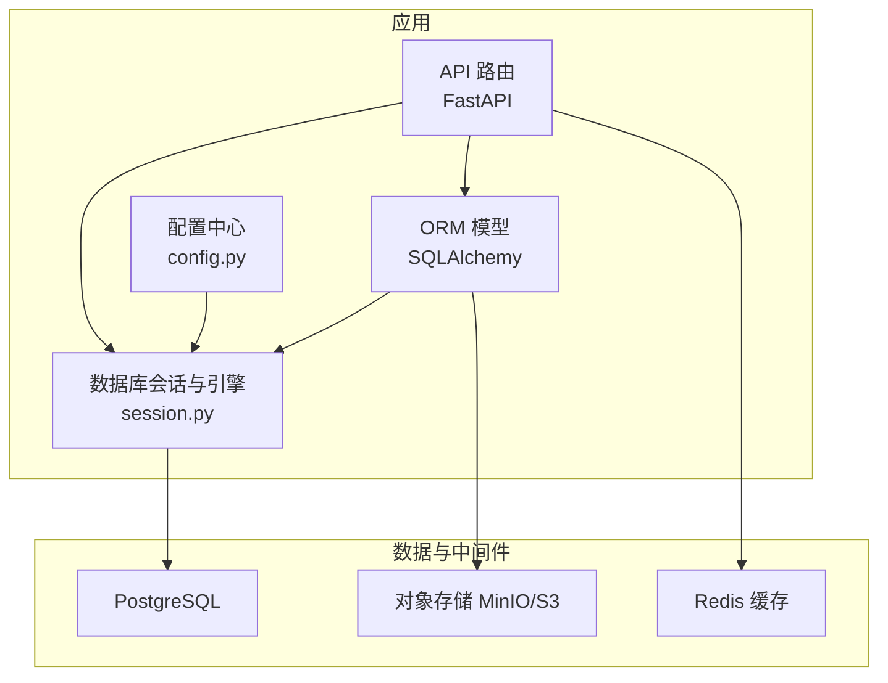
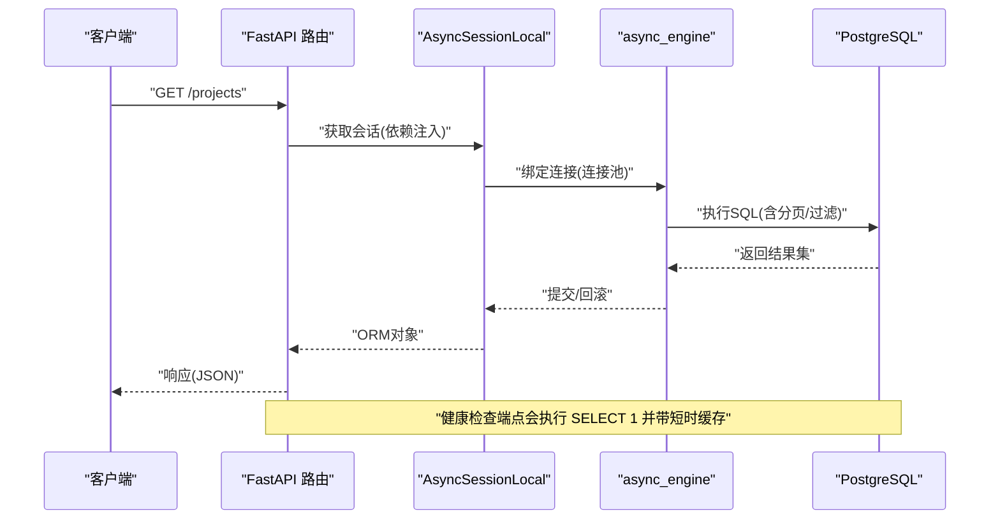
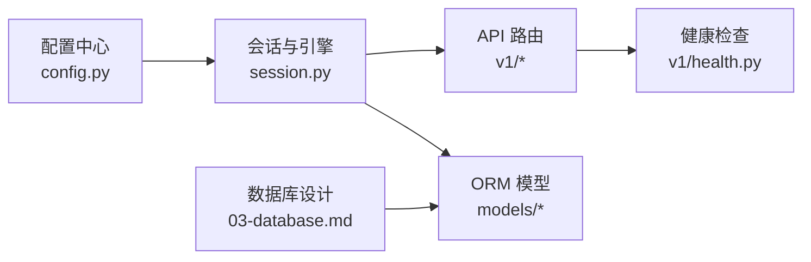
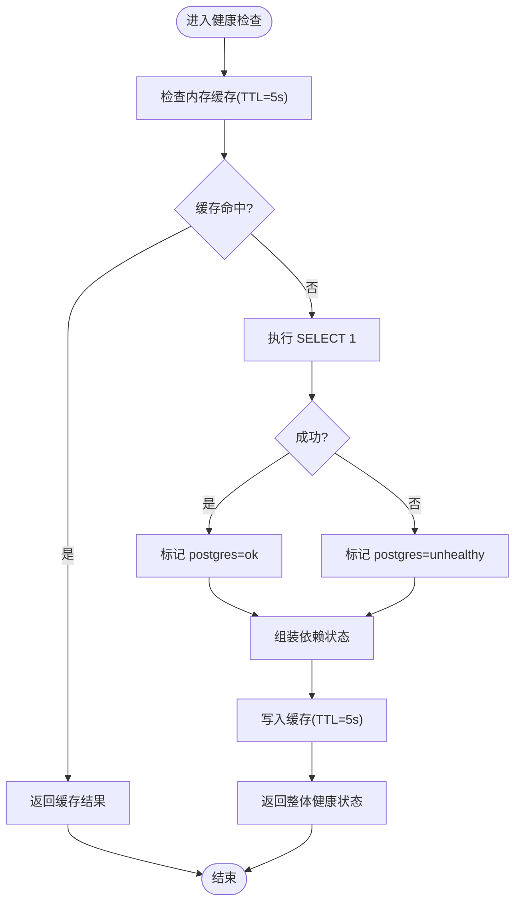

# 性能优化与监控

<cite>
**本文引用的文件**   
- [backend/app/db/session.py](file://backend/app/db/session.py)
- [backend/app/core/config.py](file://backend/app/core/config.py)
- [backend/app/db/base.py](file://backend/app/db/base.py)
- [backend/app/db/types.py](file://backend/app/db/types.py)
- [backend/app/models/molecule.py](file://backend/app/models/molecule.py)
- [backend/app/models/project.py](file://backend/app/models/project.py)
- [backend/app/models/target.py](file://backend/app/models/target.py)
- [backend/app/api/v1/health.py](file://backend/app/api/v1/health.py)
- [frontend/pages/10_📈_系统监控.py](file://frontend/pages/10_📈_系统监控.py)
- [docs/design/03-database.md](file://docs/design/03-database.md)
</cite>

## 目录
1. [简介](#简介)
2. [项目结构](#项目结构)
3. [核心组件](#核心组件)
4. [架构总览](#架构总览)
5. [详细组件分析](#详细组件分析)
6. [依赖关系分析](#依赖关系分析)
7. [性能考虑](#性能考虑)
8. [故障排查指南](#故障排查指南)
9. [结论](#结论)
10. [附录](#附录)

## 简介
本文件面向DBA与后端开发者，提供AI药物设计系统的数据库性能优化与监控完整指南。内容覆盖连接池配置、查询优化策略、索引设计原则、缓存机制实现；慢查询分析与执行计划解读方法；PostgreSQL特定优化技巧、内存与磁盘I/O调优；监控指标定义、告警规则与容量规划建议。文档结合代码仓库中的实际实现进行说明，确保可操作性与可落地性。

## 项目结构
本项目采用分层架构：API层（FastAPI）→ 服务/模型层（SQLAlchemy ORM）→ 数据库会话与引擎（异步/同步）→ PostgreSQL/Redis/对象存储等外部依赖。数据库相关的关键位置包括：
- 配置中心：集中管理数据库URL、日志开关等
- 会话与引擎：统一创建异步/同步Engine与Session工厂，并设置连接池参数
- ORM基类与类型：UUID主键、时间戳混入、跨方言JSONB/INET兼容类型
- 模型与索引：各业务表字段与索引声明
- 健康检查与前端监控：轻量级健康探测与可视化面板

图表来源
- [backend/app/db/session.py:64-80](file://backend/app/db/session.py#L64-L80)
- [backend/app/core/config.py:37-40](file://backend/app/core/config.py#L37-L40)
- [docs/design/03-database.md:9-18](file://docs/design/03-database.md#L9-L18)

章节来源
- [backend/app/db/session.py:1-128](file://backend/app/db/session.py#L1-L128)
- [backend/app/core/config.py:1-144](file://backend/app/core/config.py#L1-L144)
- [docs/design/03-database.md:1-325](file://docs/design/03-database.md#L1-L325)

## 核心组件
- 配置中心：通过环境变量加载数据库URL与回显开关，供会话层使用
- 会话与引擎：根据是否SQLite分支处理，非SQLite启用连接池参数（pool_pre_ping、pool_size、max_overflow），并提供异步/同步会话工厂与依赖注入函数
- ORM基类与类型：提供UUID主键、时间戳混入，以及JSONB/INET的跨方言兼容类型
- 模型与索引：在模型中声明外键与索引，配合设计文档中的索引策略
- 健康检查：轻量级“SELECT 1”探测，带短时内存缓存避免高频打库
- 前端监控：调用健康端点与成本统计接口，展示服务状态与关键指标

章节来源
- [backend/app/core/config.py:37-40](file://backend/app/core/config.py#L37-L40)
- [backend/app/db/session.py:48-91](file://backend/app/db/session.py#L48-L91)
- [backend/app/db/base.py:13-47](file://backend/app/db/base.py#L13-L47)
- [backend/app/db/types.py:13-41](file://backend/app/db/types.py#L13-L41)
- [backend/app/models/molecule.py:23-35](file://backend/app/models/molecule.py#L23-L35)
- [backend/app/models/project.py:24-30](file://backend/app/models/project.py#L24-L30)
- [backend/app/models/target.py:29-41](file://backend/app/models/target.py#L29-L41)
- [backend/app/api/v1/health.py:27-33](file://backend/app/api/v1/health.py#L27-L33)
- [frontend/pages/10_📈_系统监控.py:29-46](file://frontend/pages/10_📈_系统监控.py#L29-L46)

## 架构总览
下图展示了从请求到数据库访问的关键路径，以及健康检查流程。

图表来源
- [backend/app/api/v1/projects.py:47-84](file://backend/app/api/v1/projects.py#L47-L84)
- [backend/app/db/session.py:82-91](file://backend/app/db/session.py#L82-L91)
- [backend/app/api/v1/health.py:53-101](file://backend/app/api/v1/health.py#L53-L101)

## 详细组件分析

### 连接池与会话管理
- 引擎创建：非SQLite路径下启用连接池参数 pool_pre_ping、pool_size、max_overflow；SQLite路径禁用池化参数
- 会话工厂：异步/同步分别提供 sessionmaker，关闭自动刷新与提交后过期行为
- 依赖注入：get_async_db/get_sync_db 封装生命周期，异常时自动回滚

优化要点
- 生产环境建议按并发QPS与平均事务时长估算 pool_size 与 max_overflow，并结合数据库最大连接数限制
- 开启 pool_pre_ping 以检测死连接，降低长连接失效导致的错误
- 对高写负载场景，适当增大 max_overflow 但需评估数据库侧连接上限与锁竞争

章节来源
- [backend/app/db/session.py:64-80](file://backend/app/db/session.py#L64-L80)
- [backend/app/db/session.py:82-91](file://backend/app/db/session.py#L82-L91)
- [backend/app/db/session.py:94-127](file://backend/app/db/session.py#L94-L127)

### 配置与环境变量
- database_url：默认指向 PostgreSQL+psycopg2，支持切换为 asyncpg
- database_echo：控制SQL回显，便于调试
- 其他：Redis、S3、Chroma等外部依赖配置

优化要点
- 生产环境关闭 echo，避免额外I/O开销
- 使用独立的环境变量或密钥管理服务注入敏感信息

章节来源
- [backend/app/core/config.py:37-40](file://backend/app/core/config.py#L37-L40)
- [backend/app/core/config.py:41-52](file://backend/app/core/config.py#L41-L52)

### ORM基类与类型兼容
- UUIDPrimaryKey：分布式友好主键，避免自增热点
- TimestampMixin：created_at/updated_at由数据库默认值与应用层维护
- JSONBCompat/INETCompat：PostgreSQL使用原生JSONB/INET，其他方言降级为通用类型

优化要点
- 优先使用UUID主键，减少分片/迁移时的冲突
- 大量半结构化数据使用JSONB，并配合GIN索引提升检索性能

章节来源
- [backend/app/db/base.py:17-47](file://backend/app/db/base.py#L17-L47)
- [backend/app/db/types.py:13-41](file://backend/app/db/types.py#L13-L41)

### 模型与索引设计
- molecules：project_id、target_id、inchi_key 建立索引，支持按项目/靶点筛选与唯一性约束
- project：owner_id、status 建立索引，支持权限过滤与状态查询
- target：gene_symbol 建立索引，支持基因符号快速检索

优化要点
- 复合索引应匹配常见过滤条件组合（如 project_id + status）
- GIN索引用于JSONB字段的高频查询（如 datasets.metadata）

章节来源
- [backend/app/models/molecule.py:23-35](file://backend/app/models/molecule.py#L23-L35)
- [backend/app/models/project.py:24-30](file://backend/app/models/project.py#L24-L30)
- [backend/app/models/target.py:29-41](file://backend/app/models/target.py#L29-L41)
- [docs/design/03-database.md:94-131](file://docs/design/03-database.md#L94-L131)

### 健康检查与前端监控
- 健康检查：对PostgreSQL执行“SELECT 1”，并带5秒内存缓存，避免频繁打库
- 前端监控：调用健康端点与LLM成本统计接口，展示服务状态与预算使用情况

优化要点
- 健康检查TTL不宜过短，避免放大数据库压力
- 将健康检查纳入外部探针（如Kubernetes liveness/readiness）

章节来源
- [backend/app/api/v1/health.py:22-33](file://backend/app/api/v1/health.py#L22-L33)
- [backend/app/api/v1/health.py:53-101](file://backend/app/api/v1/health.py#L53-L101)
- [frontend/pages/10_📈_系统监控.py:29-46](file://frontend/pages/10_📈_系统监控.py#L29-L46)

### 查询优化策略
- 分页与计数分离：先count再limit+offset，避免全量拉取
- 选择性过滤：仅对必要字段加where条件，减少扫描范围
- 排序与索引：order_by字段尽量命中索引列（如 created_at）

优化要点
- 大表分页建议使用基于游标的分页（seek method）替代offset/limit
- 复杂查询拆分为多次简单查询，利用应用层聚合

章节来源
- [backend/app/api/v1/projects.py:47-84](file://backend/app/api/v1/projects.py#L47-L84)
- [backend/app/api/v1/molecules.py:146-191](file://backend/app/api/v1/molecules.py#L146-L191)

### 缓存机制实现
- 内存缓存：健康检查端点使用进程内字典缓存，TTL=5s
- Redis键空间：会话、速率限制、外部知识缓存、任务状态等

优化要点
- 进程内缓存适合单机低延迟场景，多实例需改用Redis
- 合理设置TTL，平衡一致性与性能

章节来源
- [backend/app/api/v1/health.py:22-33](file://backend/app/api/v1/health.py#L22-L33)
- [docs/design/03-database.md:245-256](file://docs/design/03-database.md#L245-L256)

## 依赖关系分析
- 配置中心被会话层读取，决定引擎与连接池参数
- 会话层为API与服务层提供异步/同步会话
- 模型层声明表结构与索引，受设计文档规范约束
- 健康检查端点依赖会话层执行轻量SQL

图表来源
- [backend/app/core/config.py:37-40](file://backend/app/core/config.py#L37-L40)
- [backend/app/db/session.py:64-80](file://backend/app/db/session.py#L64-L80)
- [backend/app/api/v1/health.py:53-101](file://backend/app/api/v1/health.py#L53-L101)
- [docs/design/03-database.md:1-325](file://docs/design/03-database.md#L1-L325)

章节来源
- [backend/app/core/config.py:1-144](file://backend/app/core/config.py#L1-L144)
- [backend/app/db/session.py:1-128](file://backend/app/db/session.py#L1-L128)
- [backend/app/api/v1/health.py:1-102](file://backend/app/api/v1/health.py#L1-L102)
- [docs/design/03-database.md:1-325](file://docs/design/03-database.md#L1-L325)

## 性能考虑

### 连接池配置
- 推荐参数：pool_pre_ping=True、pool_size=10、max_overflow=20（当前实现）
- 调整依据：并发度、平均事务时长、数据库最大连接数
- 风险：过大max_overflow可能导致数据库连接耗尽与锁竞争

章节来源
- [backend/app/db/session.py:64-80](file://backend/app/db/session.py#L64-L80)

### 查询优化
- 分页：count+limit+offset，注意大表偏移成本
- 过滤：精确匹配优先，避免函数包裹索引列
- 排序：尽量使用索引列排序，减少临时排序

章节来源
- [backend/app/api/v1/projects.py:47-84](file://backend/app/api/v1/projects.py#L47-L84)
- [backend/app/api/v1/molecules.py:146-191](file://backend/app/api/v1/molecules.py#L146-L191)

### 索引设计原则
- 单列索引：主键、外键、常用过滤列（如 gene_symbol、status）
- 复合索引：匹配常见查询谓词顺序（如 project_id + status）
- GIN索引：JSONB字段高频查询（如 datasets.metadata）

章节来源
- [docs/design/03-database.md:94-131](file://docs/design/03-database.md#L94-L131)
- [backend/app/models/molecule.py:23-35](file://backend/app/models/molecule.py#L23-L35)
- [backend/app/models/project.py:24-30](file://backend/app/models/project.py#L24-L30)
- [backend/app/models/target.py:29-41](file://backend/app/models/target.py#L29-L41)

### 缓存机制
- 进程内缓存：健康检查TTL=5s，降低探测频率
- Redis缓存：会话、速率限制、外部知识缓存、任务状态

章节来源
- [backend/app/api/v1/health.py:22-33](file://backend/app/api/v1/health.py#L22-L33)
- [docs/design/03-database.md:245-256](file://docs/design/03-database.md#L245-L256)

### PostgreSQL特定优化
- 连接驱动：默认psycopg2，异步路径使用asyncpg
- 数据类型：JSONB/INET原生支持，利于索引与高效查询
- WAL与归档：每日全量+WAL持续归档，保障恢复能力

章节来源
- [backend/app/db/session.py:25-40](file://backend/app/db/session.py#L25-L40)
- [backend/app/db/types.py:13-41](file://backend/app/db/types.py#L13-L41)
- [docs/design/03-database.md:298-306](file://docs/design/03-database.md#L298-L306)

### 内存配置调优
- shared_buffers：通常为物理内存的25%左右（视工作负载调整）
- effective_cache_size：约为物理内存的50%-75%
- work_mem：根据并发查询复杂度与可用内存设定
- maintenance_work_mem：VACUUM/CREATE INDEX期间使用

[本节为通用指导，不直接分析具体文件]

### 磁盘I/O优化
- SSD/NVMe：降低随机读写延迟，提升索引构建与WAL写入性能
- 分区与表空间：热数据与冷数据分离，提升维护效率
- 预读与缓冲：合理设置random_page_cost与seq_page_cost

[本节为通用指导，不直接分析具体文件]

## 故障排查指南

### 慢查询分析
- 启用log_min_duration_statement记录慢查询阈值
- 使用EXPLAIN/EXPLAIN ANALYZE分析执行计划，关注Seq Scan、Hash Join、Sort等节点
- 针对缺失索引或不当JOIN进行优化

章节来源
- [docs/design/03-database.md:309-325](file://docs/design/03-database.md#L309-L325)

### 执行计划解读
- Seq Scan：全表扫描，考虑添加合适索引
- Index Scan/Index Only Scan：命中索引，关注索引选择性与回表成本
- Hash Join/Merge Join：评估数据分布与统计信息准确性

[本节为通用指导，不直接分析具体文件]

### 性能瓶颈识别
- 连接池耗尽：观察连接数与等待队列，调整pool_size/max_overflow
- 锁竞争：分析长事务与更新热点，拆分事务或使用乐观锁
- I/O瓶颈：监控磁盘吞吐与延迟，评估SSD与分区策略

章节来源
- [backend/app/db/session.py:64-80](file://backend/app/db/session.py#L64-L80)

### 监控指标定义
- 服务健康：postgres/redis/chroma状态、版本、依赖健康度
- LLM成本：总花费、预算、剩余、调用次数、按模型/层级分解
- API概览：端点列表与功能描述

章节来源
- [backend/app/api/v1/health.py:53-101](file://backend/app/api/v1/health.py#L53-L101)
- [frontend/pages/10_📈_系统监控.py:49-79](file://frontend/pages/10_📈_系统监控.py#L49-L79)
- [frontend/pages/10_📈_系统监控.py:82-104](file://frontend/pages/10_📈_系统监控.py#L82-L104)

### 告警规则设置
- 健康状态：任一依赖unhealthy触发告警
- 延迟阈值：健康检查或关键接口P95/P99超过阈值
- 资源水位：连接池使用率、CPU/内存/磁盘使用率超阈

[本节为通用指导，不直接分析具体文件]

### 容量规划建议
- 连接数：根据并发与数据库最大连接数规划pool_size/max_overflow
- 存储增长：分子/对接结果/报告等增长趋势评估，预留扩容空间
- 备份与恢复：全量+增量策略，验证RTO/RPO目标

章节来源
- [docs/design/03-database.md:298-306](file://docs/design/03-database.md#L298-L306)

## 结论
通过合理的连接池配置、查询与索引优化、缓存策略与监控体系，AI药物设计系统可在高并发与大数据量场景下保持稳定与高性能。建议在生产环境逐步引入更完善的监控与告警，并结合PostgreSQL特性进行深度调优。

[本节为总结，不直接分析具体文件]

## 附录

### 关键流程图：健康检查

图表来源
- [backend/app/api/v1/health.py:22-33](file://backend/app/api/v1/health.py#L22-L33)
- [backend/app/api/v1/health.py:53-101](file://backend/app/api/v1/health.py#L53-L101)