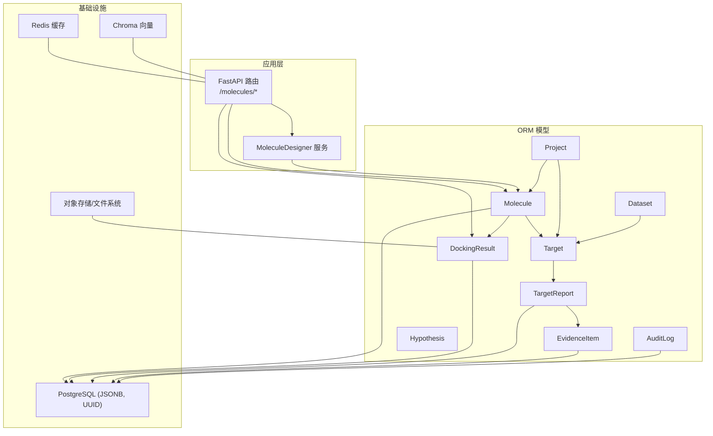
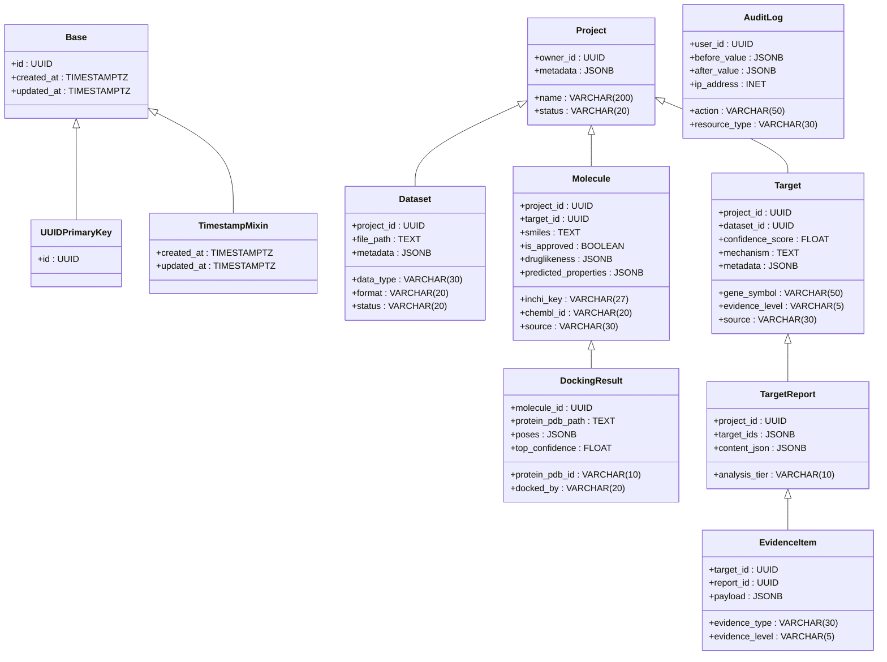
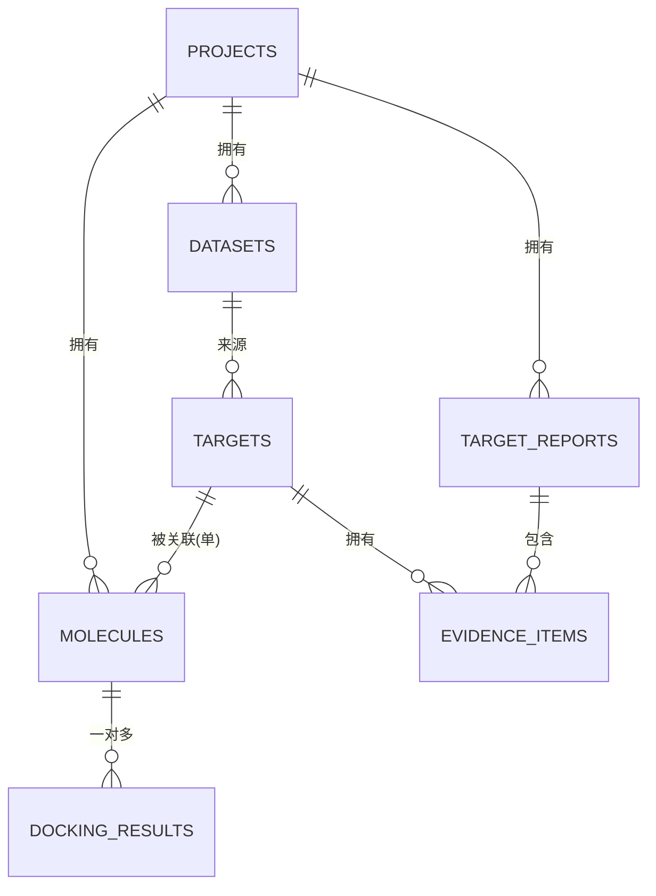
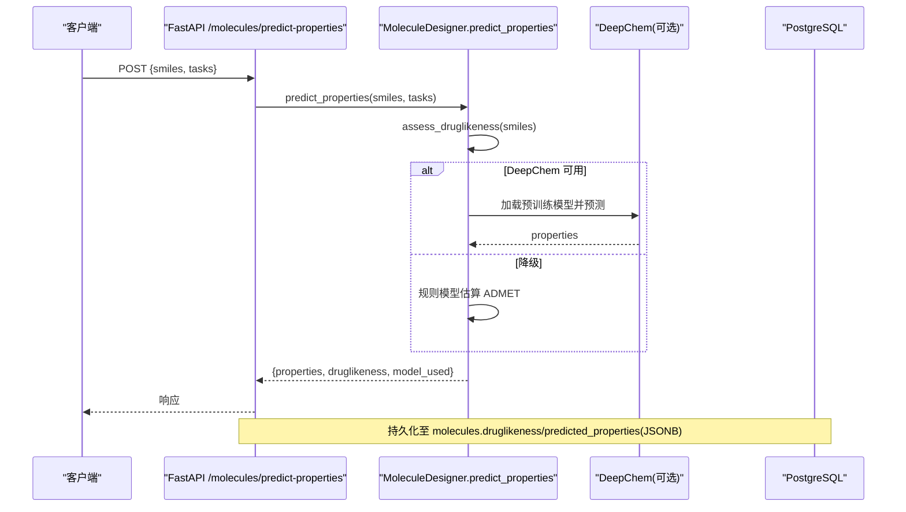
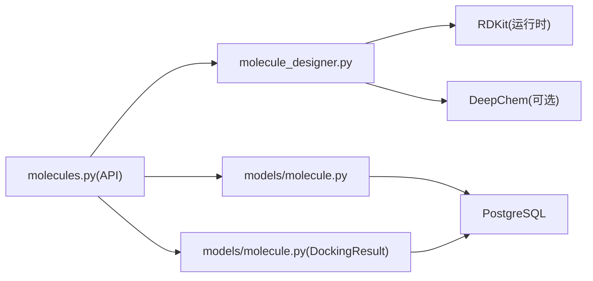

# 分子结构模型

<cite>
**本文引用的文件**   
- [molecule.py](file://backend/app/models/molecule.py)
- [target.py](file://backend/app/models/target.py)
- [project.py](file://backend/app/models/project.py)
- [dataset.py](file://backend/app/models/dataset.py)
- [report.py](file://backend/app/models/report.py)
- [hypothesis.py](file://backend/app/models/hypothesis.py)
- [audit_log.py](file://backend/app/models/audit_log.py)
- [base.py](file://backend/app/db/base.py)
- [types.py](file://backend/app/db/types.py)
- [molecule.py（API）](file://backend/app/api/v1/molecules.py)
- [molecule_designer.py](file://backend/app/services/analyzer/molecule_designer.py)
- [03-database.md](file://docs/design/03-database.md)
</cite>

## 目录
1. [引言](#引言)
2. [项目结构](#项目结构)
3. [核心组件](#核心组件)
4. [架构总览](#架构总览)
5. [详细组件分析](#详细组件分析)
6. [依赖关系分析](#依赖关系分析)
7. [性能与扩展性](#性能与扩展性)
8. [故障排查指南](#故障排查指南)
9. [结论](#结论)
10. [附录：DDL 与最佳实践](#附录ddl-与最佳实践)

## 引言
本文件面向计算化学家与药物设计师，系统化梳理 AI 药物设计系统中的“分子结构模型”数据库 Schema。内容覆盖 Molecule 实体的完整字段定义、数据类型与验证规则；分子与靶点的关联设计（支持多靶点场景）；对接结果存储；分子性质预测、ADMET 参数、合成可及性等计算结果的持久化方案；并提供完整的 SQL DDL 示例与工程最佳实践，帮助构建可扩展、可审计、可追溯的分子数据管理基座。

## 项目结构
围绕分子结构模型的代码主要分布在 ORM 模型、API 路由与服务层：
- ORM 模型：定义表结构与关系（Molecule、DockingResult、Target、Project 等）
- API 路由：提供类药性评估、分子对接、性质预测、生成式设计与可解释性接口
- 服务层：封装 RDKit/DeepChem 能力，实现 ADMET 预测与降级策略
- 设计文档：给出 PostgreSQL 主库、Redis、Chroma、对象存储的分层设计

图表来源
- [molecule.py（API）:1-403](file://backend/app/api/v1/molecules.py#L1-L403)
- [molecule_designer.py:1-200](file://backend/app/services/analyzer/molecule_designer.py#L1-L200)
- [molecule.py:1-61](file://backend/app/models/molecule.py#L1-L61)
- [target.py:1-52](file://backend/app/models/target.py#L1-L52)
- [report.py:1-73](file://backend/app/models/report.py#L1-L73)
- [project.py:1-42](file://backend/app/models/project.py#L1-L42)
- [dataset.py:1-70](file://backend/app/models/dataset.py#L1-L70)
- [audit_log.py:1-45](file://backend/app/models/audit_log.py#L1-L45)
- [03-database.md:1-325](file://docs/design/03-database.md#L1-L325)

章节来源
- [03-database.md:1-325](file://docs/design/03-database.md#L1-L325)

## 核心组件
- Molecule：分子实体，承载 SMILES、InChIKey、ChEMBL ID、是否已获批、类药性与预测性质 JSONB、来源标注等
- DockingResult：DiffDock 对接结果，包含蛋白 PDB ID/路径、构象列表、最高置信度、对接工具标识
- Target：靶点实体，含基因符号、证据等级、置信度、机制描述、来源与元数据
- Project/Dataset/TargetReport/EvidenceItem/Hypothesis/AuditLog：支撑项目、数据集、报告、证据、假设与审计追踪

章节来源
- [molecule.py:1-61](file://backend/app/models/molecule.py#L1-L61)
- [target.py:1-52](file://backend/app/models/target.py#L1-L52)
- [project.py:1-42](file://backend/app/models/project.py#L1-L42)
- [dataset.py:1-70](file://backend/app/models/dataset.py#L1-L70)
- [report.py:1-73](file://backend/app/models/report.py#L1-L73)
- [hypothesis.py:1-66](file://backend/app/models/hypothesis.py#L1-L66)
- [audit_log.py:1-45](file://backend/app/models/audit_log.py#L1-L45)

## 架构总览
系统采用分层存储：结构化数据落 PostgreSQL（UUID 主键、TIMESTAMPTZ 时间戳、JSONB 灵活字段），大文件（PDB/SDF/Parquet/HDF5）落对象存储或本地文件系统，会话与缓存使用 Redis，知识检索使用 Chroma。

图表来源
- [base.py:1-48](file://backend/app/db/base.py#L1-L48)
- [project.py:1-42](file://backend/app/models/project.py#L1-L42)
- [dataset.py:1-70](file://backend/app/models/dataset.py#L1-L70)
- [target.py:1-52](file://backend/app/models/target.py#L1-L52)
- [molecule.py:1-61](file://backend/app/models/molecule.py#L1-L61)
- [report.py:1-73](file://backend/app/models/report.py#L1-L73)
- [audit_log.py:1-45](file://backend/app/models/audit_log.py#L1-L45)

## 详细组件分析

### Molecule 实体与字段规范
- 标识与归属
  - id: UUID 主键（分布式友好）
  - project_id: UUID，外键至 projects.id，级联删除
  - target_id: UUID，外键至 targets.id，允许为空（支持一对多分子到单靶点；多靶点见后文“多靶点配对设计”）
- 化学信息
  - smiles: TEXT，必填
  - inchi_key: VARCHAR(27)，可选，建议唯一索引用于去重
  - chembl_id: VARCHAR(20)，老药新用时引用外部 ID
  - is_approved: BOOLEAN，默认 false
- 计算结果
  - druglikeness: JSONB，RDKit 类药性评估结果（MW、LogP、HBD、HBA、旋转键数、TPSA、Lipinski/Veber/QED 判定与违规项）
  - predicted_properties: JSONB，DeepChem 或规则模型输出的 ADMET 性质集合
- 元数据
  - source: VARCHAR(30)，来源标注（如 chembl_repurposing/de novo/docking）

字段验证与约束要点
- SMILES 有效性由服务层在写入前校验（RDKit MolFromSmiles）
- InChIKey 建议唯一索引避免重复分子
- JSONB 字段通过 Pydantic Schema 进行输入校验与类型提示

章节来源
- [molecule.py:1-61](file://backend/app/models/molecule.py#L1-L61)
- [molecule.py（API）:95-106](file://backend/app/api/v1/molecules.py#L95-L106)
- [molecule_designer.py:71-134](file://backend/app/services/analyzer/molecule_designer.py#L71-L134)

### 分子与靶点的关联关系（支持多靶点）
当前模型中 Molecule.target_id 为单外键，表示“分子-单靶点”关系。为满足“一分子对多靶点”的复杂场景，推荐以下两种方案：
- 方案 A（推荐）：引入中间表 molecule_targets
  - 字段：molecule_id(UUID), target_id(UUID), relation_type(VARCHAR), confidence(FLOAT), created_at(TIMESTAMPTZ)
  - 优势：清晰表达多对多关系，便于统计与筛选
- 方案 B：在 Molecule.metadata_ 中以 JSONB 记录 target_ids 数组
  - 优势：快速扩展；劣势：查询与一致性维护较弱

图表来源
- [molecule.py:1-61](file://backend/app/models/molecule.py#L1-L61)
- [target.py:1-52](file://backend/app/models/target.py#L1-L52)
- [report.py:1-73](file://backend/app/models/report.py#L1-L73)
- [dataset.py:1-70](file://backend/app/models/dataset.py#L1-L70)
- [project.py:1-42](file://backend/app/models/project.py#L1-L42)

### 分子对接结果（DockingResult）
- 字段说明
  - molecule_id: UUID，外键至 molecules.id
  - protein_pdb_id: VARCHAR(10)，PDB 编号
  - protein_pdb_path: TEXT，PDB 文件路径（对象存储或本地）
  - poses: JSONB，构象列表（含置信度、坐标、SDF 引用等）
  - top_confidence: FLOAT，最高置信度
  - docked_by: VARCHAR(20)，对接工具标识（如 diffdock_nim）
- 3D 结构文件引用机制
  - 建议将 PDB/SDF 等大文件存放于对象存储（MinIO/S3），仅保存路径与校验和
  - poses 中的 sdf 字段可存相对路径或对象存储 URL

章节来源
- [molecule.py:46-61](file://backend/app/models/molecule.py#L46-L61)
- [03-database.md:200-212](file://docs/design/03-database.md#L200-L212)

### 分子性质预测与 ADMET 记录
- 类药性评估（druglikeness）
  - 指标：分子量、LogP、HBD、HBA、旋转键数、TPSA、Lipinski/Veber 通过情况、QED 分数、违规项
  - 实现：RDKit 计算，失败时返回 valid=False 并携带错误信息
- ADMET 预测（predicted_properties）
  - DeepChem 优先（Tox21、Delaney 等），不可用时降级为规则模型
  - 输出包含 model_used 标识实际使用的模型版本/名称
- 存储位置
  - druglikeness 与 predicted_properties 均存入 JSONB，便于后续分析与回溯

图表来源
- [molecule.py（API）:219-298](file://backend/app/api/v1/molecules.py#L219-L298)
- [molecule_designer.py:136-200](file://backend/app/services/analyzer/molecule_designer.py#L136-L200)

### 分子指纹与相似性
- 指纹方案
  - 建议使用 Morgan 指纹（ECFP4）作为标准指纹，长度 2048，位图格式
  - 存储方式：
    - 方案一：JSONB 字段存储位图数组（便于兼容与迁移）
    - 方案二：PostgreSQL bit/bit varying 列（高效位运算）
    - 方案三：向量列（pgvector）+ 余弦/Tanimoto 近似搜索
- 相似性计算
  - Tanimoto 系数用于相似度排序与候选集筛选
  - 可在查询时基于 JSONB 或位图计算，或在物化视图中预计算

章节来源
- [molecule_designer.py:1-200](file://backend/app/services/analyzer/molecule_designer.py#L1-L200)

### 合成可及性评分（SA）
- SA 评分可通过 RDKit 计算，建议新增字段 sa_score: FLOAT
- 若需保留历史版本，可将 SA 纳入 JSONB 的 druglikeness 或单独建表记录每次评分与模型版本

章节来源
- [molecule_designer.py:71-134](file://backend/app/services/analyzer/molecule_designer.py#L71-L134)

## 依赖关系分析
- 模块耦合
  - API 路由依赖 Molecule/DockingResult 模型与 MoleculeDesigner 服务
  - 服务层惰性加载 RDKit/DeepChem，未安装时优雅降级
  - 模型间通过外键建立强一致关系（项目-数据集-靶点-分子-对接结果）
- 外部依赖
  - RDKit：类药性与基础理化性质
  - DeepChem：ADMET 预测（可选）
  - 对象存储：PDB/SDF 等大文件
  - Redis/Chroma：缓存与语义检索

图表来源
- [molecule.py（API）:1-403](file://backend/app/api/v1/molecules.py#L1-L403)
- [molecule_designer.py:1-200](file://backend/app/services/analyzer/molecule_designer.py#L1-L200)
- [molecule.py:1-61](file://backend/app/models/molecule.py#L1-L61)

章节来源
- [molecule.py（API）:1-403](file://backend/app/api/v1/molecules.py#L1-L403)
- [molecule_designer.py:1-200](file://backend/app/services/analyzer/molecule_designer.py#L1-L200)

## 性能与扩展性
- 索引策略
  - molecules.project_id、molecules.target_id、molecules.inchi_key 建立索引
  - docking_results.molecule_id 建立索引
  - targets.gene_symbol/evidence_level 建立索引
- JSONB 查询
  - 针对 druglikeness/predicted_properties 常用字段创建 GIN 索引或物化视图
- 大文件与 I/O
  - PDB/SDF 走对象存储，数据库仅存路径与校验和
- 异步任务
  - DiffDock 对接以任务形式提交，GET 拉取结果，避免阻塞

[本节为通用指导，不直接分析具体文件]

## 故障排查指南
- RDKit 未安装
  - 现象：类药性评估返回 valid=False 并带 error 信息
  - 处理：安装 rdkit 或启用降级逻辑
- DeepChem 未安装或加载失败
  - 现象：predict_properties 降级为规则模型，model_used 标记为 unavailable/error
  - 处理：安装 deepchem 或修复环境依赖
- 对接任务无结果
  - 现象：GET /molecules/{id}/docking-results 返回空列表
  - 处理：确认 protein_pdb_id/protein_pdb_path 是否正确、对象存储路径可达

章节来源
- [molecule.py（API）:95-106](file://backend/app/api/v1/molecules.py#L95-L106)
- [molecule.py（API）:219-298](file://backend/app/api/v1/molecules.py#L219-L298)
- [molecule_designer.py:52-69](file://backend/app/services/analyzer/molecule_designer.py#L52-L69)

## 结论
本 Schema 以 Molecule 为核心，结合 Target、DockingResult 与丰富的 JSONB 计算结果字段，形成从分子表征、对接、性质预测到证据链的完整数据闭环。通过外键与索引保障查询性能，通过对象存储与大字段分离提升扩展性，并通过审计日志确保可追溯。建议在多靶点场景下引入 molecule_targets 中间表，并在指纹与相似性方面采用位图或向量方案以提升检索效率。

[本节为总结性内容，不直接分析具体文件]

## 附录：DDL 与最佳实践

### 关键表 DDL 示例（PostgreSQL）
以下为与分子结构模型相关的关键表 DDL 示例（字段与约束与现有 ORM 模型保持一致）：

- 项目与用户（简要）
  - users(id UUID PK, email VARCHAR(255) UNIQUE NOT NULL, hashed_password VARCHAR(255) NOT NULL, full_name VARCHAR(100) NOT NULL, role VARCHAR(20) NOT NULL, is_active BOOLEAN DEFAULT true, created_at TIMESTAMPTZ DEFAULT now(), updated_at TIMESTAMPTZ DEFAULT now())
  - projects(id UUID PK, name VARCHAR(200) NOT NULL, description TEXT, owner_id UUID FK→users.id, status VARCHAR(20) DEFAULT 'active', cancer_type VARCHAR(100), patient_pseudonym VARCHAR(100), metadata JSONB DEFAULT '{}', created_at TIMESTAMPTZ DEFAULT now(), updated_at TIMESTAMPTZ DEFAULT now())

- 数据集
  - datasets(id UUID PK, project_id UUID FK→projects.id, name VARCHAR(200) NOT NULL, data_type VARCHAR(30) NOT NULL, file_path TEXT NOT NULL, file_size_bytes BIGINT, format VARCHAR(20), status VARCHAR(20) DEFAULT 'uploaded', checksum VARCHAR(64), metadata JSONB DEFAULT '{}', quality_score FLOAT, uploaded_by UUID FK→users.id, processed_at TIMESTAMPTZ, created_at TIMESTAMPTZ DEFAULT now(), updated_at TIMESTAMPTZ DEFAULT now())

- 靶点
  - targets(id UUID PK, project_id UUID FK→projects.id, dataset_id UUID FK→datasets.id, gene_symbol VARCHAR(50) NOT NULL, gene_entrez_id VARCHAR(20), evidence_level VARCHAR(5) NOT NULL DEFAULT 'IV', confidence_score FLOAT, mechanism TEXT, source VARCHAR(30), metadata JSONB DEFAULT '{}', created_at TIMESTAMPTZ DEFAULT now(), updated_at TIMESTAMPTZ DEFAULT now())

- 分子
  - molecules(id UUID PK, project_id UUID FK→projects.id, target_id UUID FK→targets.id, smiles TEXT NOT NULL, inchi_key VARCHAR(27), chembl_id VARCHAR(20), is_approved BOOLEAN DEFAULT false, druglikeness JSONB DEFAULT '{}', predicted_properties JSONB DEFAULT '{}', source VARCHAR(30), created_at TIMESTAMPTZ DEFAULT now(), updated_at TIMESTAMPTZ DEFAULT now())

- 对接结果
  - docking_results(id UUID PK, molecule_id UUID FK→molecules.id, protein_pdb_id VARCHAR(10), protein_pdb_path TEXT, poses JSONB DEFAULT '[]', top_confidence FLOAT, docked_by VARCHAR(20) DEFAULT 'diffdock_nim', created_at TIMESTAMPTZ DEFAULT now(), updated_at TIMESTAMPTZ DEFAULT now())

- 报告与证据
  - target_reports(id UUID PK, project_id UUID FK→projects.id, target_ids JSONB DEFAULT '[]', analysis_tier VARCHAR(10) DEFAULT 'quick', llm_model VARCHAR(50), llm_cost_usd DECIMAL(10,4), llm_tokens_in INT, llm_tokens_out INT, duration_seconds INT, summary TEXT, content_md TEXT, content_json JSONB DEFAULT '{}', cdisc_sdtm_path TEXT, created_at TIMESTAMPTZ DEFAULT now(), updated_at TIMESTAMPTZ DEFAULT now())
  - evidence_items(id UUID PK, target_id UUID FK→targets.id, report_id UUID FK→target_reports.id, evidence_type VARCHAR(30) NOT NULL, evidence_level VARCHAR(5) NOT NULL DEFAULT 'IV', reference_id VARCHAR(100), reference_url TEXT, summary TEXT, payload JSONB DEFAULT '{}', created_at TIMESTAMPTZ DEFAULT now(), updated_at TIMESTAMPTZ DEFAULT now())

- 审计日志（append-only）
  - audit_logs(id BIGSERIAL PK, user_id UUID FK→users.id, action VARCHAR(50) NOT NULL, resource_type VARCHAR(30), resource_id UUID, before_value JSONB, after_value JSONB, ip_address INET, user_agent TEXT, created_at TIMESTAMPTZ DEFAULT now())

- 索引建议
  - idx_molecules_project(project_id)
  - idx_molecules_target(target_id)
  - idx_molecules_inchi(inchi_key) UNIQUE
  - idx_docking_results_molecule(molecule_id)
  - idx_targets_gene(gene_symbol)
  - idx_targets_evidence(evidence_level)
  - idx_audit_action_time(action, created_at)

章节来源
- [03-database.md:44-242](file://docs/design/03-database.md#L44-L242)
- [molecule.py:1-61](file://backend/app/models/molecule.py#L1-L61)
- [target.py:1-52](file://backend/app/models/target.py#L1-L52)
- [report.py:1-73](file://backend/app/models/report.py#L1-L73)
- [audit_log.py:1-45](file://backend/app/models/audit_log.py#L1-L45)

### 多靶点配对设计（推荐）
- 新增表 molecule_targets
  - molecule_id UUID FK→molecules.id
  - target_id UUID FK→targets.id
  - relation_type VARCHAR(20)（如 direct/inferred）
  - confidence FLOAT
  - created_at TIMESTAMPTZ DEFAULT now()
  - 复合唯一索引 (molecule_id, target_id)

章节来源
- [molecule.py:1-61](file://backend/app/models/molecule.py#L1-L61)
- [target.py:1-52](file://backend/app/models/target.py#L1-L52)

### 分子指纹与相似性存储方案
- 指纹列
  - fingerprints BIT(2048) 或 JSONB 位图数组
- 相似性查询
  - 使用位运算或 pgvector 近似最近邻
- 物化视图
  - 预计算常见子结构的计数或片段指纹，加速筛选

[本节为通用指导，不直接分析具体文件]

### 3D 结构文件引用机制
- 存储位置
  - PDB/SDF 文件存放于对象存储（MinIO/S3）或本地文件系统
- 数据库字段
  - docking_results.protein_pdb_path、poses.sdf 字段存储路径或 URL
- 校验与生命周期
  - 记录 checksum，设置对象存储生命周期策略

章节来源
- [molecule.py:46-61](file://backend/app/models/molecule.py#L46-L61)
- [03-database.md:272-294](file://docs/design/03-database.md#L272-L294)

### 计算结果存储与版本化
- druglikeness/predicted_properties 使用 JSONB 存储，便于扩展字段
- 如需版本化，可新建表 molecule_computations
  - molecule_id UUID
  - computation_type VARCHAR(30)（druglikeness/admet/sa）
  - result JSONB
  - model_version VARCHAR(50)
  - created_at TIMESTAMPTZ

[本节为通用指导，不直接分析具体文件]

### 最佳实践
- 统一使用 UUID 主键与 TIMESTAMPTZ 时间戳
- 所有 JSONB 字段提供默认值与必要索引
- 对外部依赖（RDKit/DeepChem）做惰性加载与降级处理
- 大文件与结构化数据分离，数据库只存路径与校验和
- 审计日志 append-only，禁止 UPDATE/DELETE

章节来源
- [base.py:1-48](file://backend/app/db/base.py#L1-L48)
- [types.py:1-42](file://backend/app/db/types.py#L1-L42)
- [audit_log.py:1-45](file://backend/app/models/audit_log.py#L1-L45)
- [molecule.py（API）:219-298](file://backend/app/api/v1/molecules.py#L219-L298)