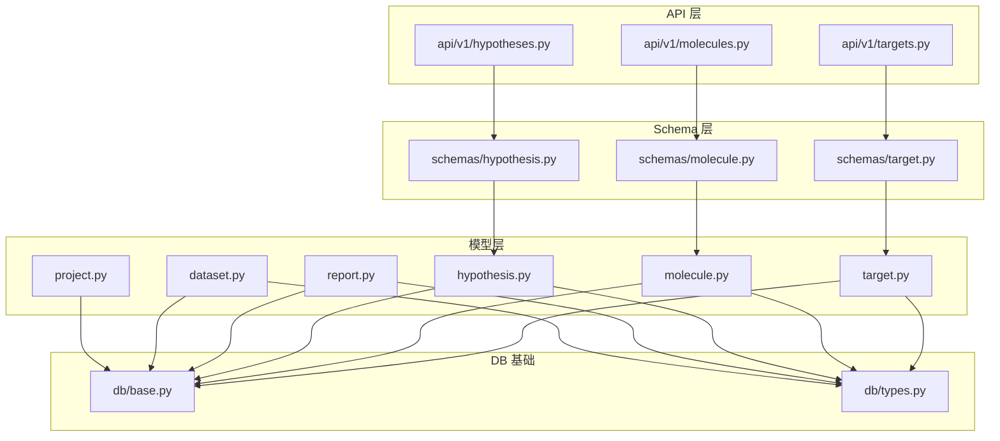
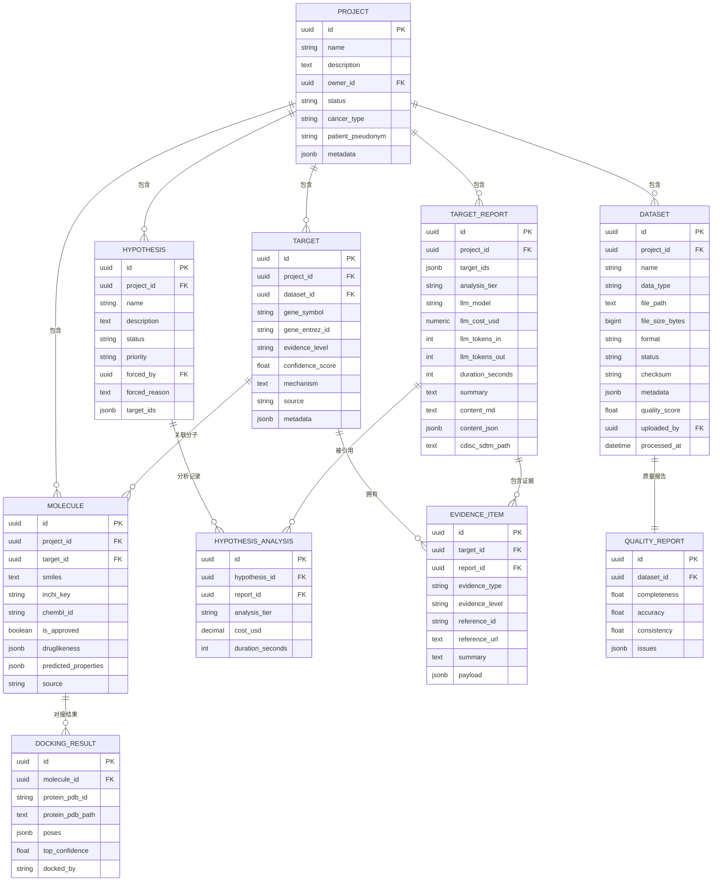
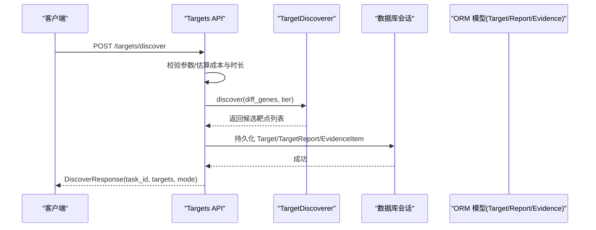
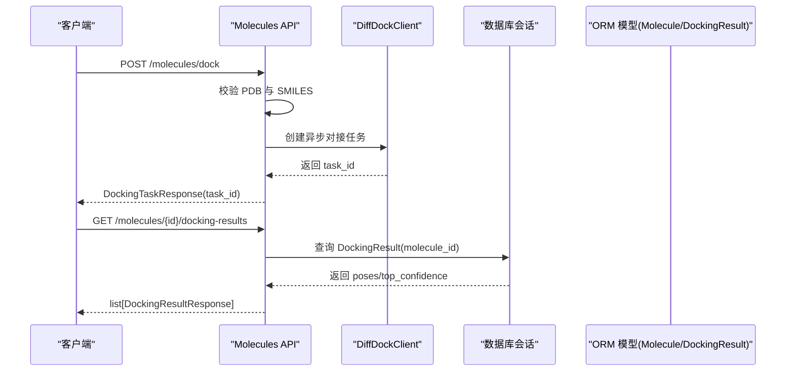
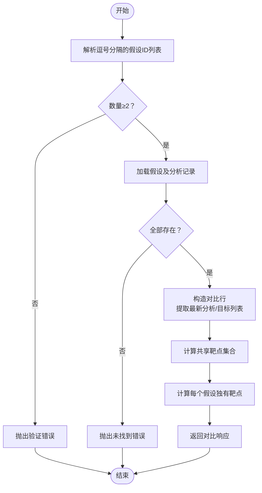
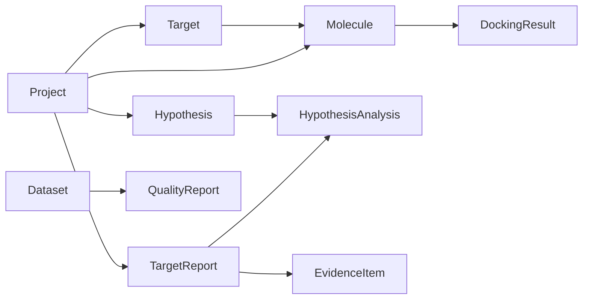

# 分析结果模型

<cite>
**本文引用的文件**   
- [backend/app/models/target.py](file://backend/app/models/target.py)
- [backend/app/models/molecule.py](file://backend/app/models/molecule.py)
- [backend/app/models/hypothesis.py](file://backend/app/models/hypothesis.py)
- [backend/app/models/report.py](file://backend/app/models/report.py)
- [backend/app/models/dataset.py](file://backend/app/models/dataset.py)
- [backend/app/models/project.py](file://backend/app/models/project.py)
- [backend/app/db/base.py](file://backend/app/db/base.py)
- [backend/app/db/types.py](file://backend/app/db/types.py)
- [backend/app/schemas/target.py](file://backend/app/schemas/target.py)
- [backend/app/schemas/molecule.py](file://backend/app/schemas/molecule.py)
- [backend/app/schemas/hypothesis.py](file://backend/app/schemas/hypothesis.py)
- [backend/app/api/v1/targets.py](file://backend/app/api/v1/targets.py)
- [backend/app/api/v1/molecules.py](file://backend/app/api/v1/molecules.py)
- [backend/app/api/v1/hypotheses.py](file://backend/app/api/v1/hypotheses.py)
</cite>

## 目录
1. [引言](#引言)
2. [项目结构](#项目结构)
3. [核心组件](#核心组件)
4. [架构总览](#架构总览)
5. [详细组件分析](#详细组件分析)
6. [依赖关系分析](#依赖关系分析)
7. [性能与索引优化](#性能与索引优化)
8. [故障排查指南](#故障排查指南)
9. [结论](#结论)
10. [附录：SQL DDL 示例](#附录sql-ddl-示例)

## 引言
本文件面向算法工程师与数据分析人员，系统化梳理 AI 药物设计系统中“分析结果”相关的数据模型与数据库 Schema。重点覆盖以下实体与关系：
- 靶点（Target）：记录发现的候选药物靶点、证据等级、置信度、机制说明等
- 分子（Molecule）与对接结果（DockingResult）：保存候选分子结构、类药性、性质预测与对接构象
- 假设（Hypothesis）与分析记录（HypothesisAnalysis）：管理科学假设及其分析版本与成本/时长追踪
- 报告（TargetReport）与证据项（EvidenceItem）：聚合多靶点发现报告与来源证据
- 数据集（Dataset）与质量报告（QualityReport）、项目（Project）：作为分析输入与上下文

文档提供字段定义、数据类型、约束条件、业务规则、关联关系图、查询优化建议，并给出可落地的 SQL DDL 示例，便于直接用于 PostgreSQL 部署。

## 项目结构
与“分析结果模型”相关的代码主要分布在以下模块：
- ORM 模型：models/*.py
- 数据校验与 API 契约：schemas/*.py
- 接口实现：api/v1/*.py
- 通用基类与类型：db/base.py, db/types.py



图表来源
- [backend/app/models/target.py:1-52](file://backend/app/models/target.py#L1-L52)
- [backend/app/models/molecule.py:1-61](file://backend/app/models/molecule.py#L1-L61)
- [backend/app/models/hypothesis.py:1-66](file://backend/app/models/hypothesis.py#L1-L66)
- [backend/app/models/report.py:1-73](file://backend/app/models/report.py#L1-L73)
- [backend/app/models/dataset.py:1-70](file://backend/app/models/dataset.py#L1-L70)
- [backend/app/models/project.py:1-42](file://backend/app/models/project.py#L1-L42)
- [backend/app/db/base.py:1-48](file://backend/app/db/base.py#L1-L48)
- [backend/app/db/types.py:1-42](file://backend/app/db/types.py#L1-L42)
- [backend/app/schemas/target.py:1-185](file://backend/app/schemas/target.py#L1-L185)
- [backend/app/schemas/molecule.py:1-178](file://backend/app/schemas/molecule.py#L1-L178)
- [backend/app/schemas/hypothesis.py:1-119](file://backend/app/schemas/hypothesis.py#L1-L119)
- [backend/app/api/v1/targets.py:1-200](file://backend/app/api/v1/targets.py#L1-L200)
- [backend/app/api/v1/molecules.py:1-200](file://backend/app/api/v1/molecules.py#L1-L200)
- [backend/app/api/v1/hypotheses.py:1-200](file://backend/app/api/v1/hypotheses.py#L1-L200)

章节来源
- [backend/app/models/target.py:1-52](file://backend/app/models/target.py#L1-L52)
- [backend/app/models/molecule.py:1-61](file://backend/app/models/molecule.py#L1-L61)
- [backend/app/models/hypothesis.py:1-66](file://backend/app/models/hypothesis.py#L1-L66)
- [backend/app/models/report.py:1-73](file://backend/app/models/report.py#L1-L73)
- [backend/app/models/dataset.py:1-70](file://backend/app/models/dataset.py#L1-L70)
- [backend/app/models/project.py:1-42](file://backend/app/models/project.py#L1-L42)
- [backend/app/db/base.py:1-48](file://backend/app/db/base.py#L1-L48)
- [backend/app/db/types.py:1-42](file://backend/app/db/types.py#L1-L42)

## 核心组件
本节聚焦“分析结果”相关实体的完整字段定义、数据类型、约束与业务规则。

### 靶点 Target
- 表名：targets
- 主键：id（UUID）
- 关键字段
  - project_id：所属项目（外键，非空，索引）
  - dataset_id：来源数据集（外键，可空）
  - gene_symbol：基因符号（非空，索引）
  - gene_entrez_id：Entrez ID（可空）
  - evidence_level：证据等级（I/II/III/IV，默认 IV）
  - confidence_score：置信度（浮点，可空）
  - mechanism：作用机制（文本，可空）
  - source：数据来源（如 differential_expression/variant/drug_repurposing/pathway/network）
  - metadata：扩展元数据（JSONB）
- 关系
  - 一对多到 EvidenceItem
  - 一对多到 Molecule
- 业务规则
  - evidence_level 必须为 I/II/III/IV 之一
  - source 枚举值需符合系统约定
  - 删除项目时级联删除靶点；删除数据集时置空 dataset_id

章节来源
- [backend/app/models/target.py:14-52](file://backend/app/models/target.py#L14-L52)
- [backend/app/schemas/target.py:20-65](file://backend/app/schemas/target.py#L20-L65)

### 分子 Molecule 与对接 DockingResult
- 表名：molecules / docking_results
- 分子关键字段
  - project_id：所属项目（外键，非空，索引）
  - target_id：关联靶点（外键，可空，索引）
  - smiles：SMILES 字符串（非空）
  - inchi_key：InChI Key（可空，索引）
  - chembl_id：外部库标识（可空）
  - is_approved：是否已获批（布尔，默认 False）
  - druglikeness：类药性评估结果（JSONB）
  - predicted_properties：性质预测结果（JSONB）
  - source：来源（chembl_repurposing/de_novo/docking/manual）
- 对接结果关键字段
  - molecule_id：关联分子（外键，非空，索引）
  - protein_pdb_id / protein_pdb_path：蛋白结构标识或路径
  - poses：构象列表（JSONB）
  - top_confidence：最高置信度（浮点，可空）
  - docked_by：对接工具标识（默认 diffdock_nim）
- 关系
  - Molecule 一对多到 DockingResult
  - Molecule 反向关联 Target
- 业务规则
  - smiles 必填且有效
  - docking_results 随分子删除级联删除

章节来源
- [backend/app/models/molecule.py:14-61](file://backend/app/models/molecule.py#L14-L61)
- [backend/app/schemas/molecule.py:22-86](file://backend/app/schemas/molecule.py#L22-L86)

### 假设 Hypothesis 与分析记录 HypothesisAnalysis
- 表名：hypotheses / hypothesis_analyses
- 假设关键字段
  - project_id：所属项目（外键，非空，索引）
  - name：名称（非空）
  - description：描述（文本，可空）
  - status：状态（active/merged/archived/eliminated，默认 active）
  - priority：优先级（low/normal/high/forced，默认 normal）
  - forced_by：强制分析用户（外键，可空）
  - forced_reason：强制原因（文本，可空）
  - target_ids：关联靶点 ID 列表（JSONB）
- 分析记录关键字段
  - hypothesis_id：关联假设（外键，非空，索引）
  - report_id：关联报告（外键，非空）
  - analysis_tier：分析层级（quick/deep，默认 quick）
  - cost_usd：成本（Decimal，可空）
  - duration_seconds：耗时（整数，可空）
- 关系
  - Hypothesis 一对多到 HypothesisAnalysis
  - HypothesisAnalysis 关联 TargetReport
- 业务规则
  - status/priority 取值受限于枚举
  - 删除假设时级联删除其分析记录

章节来源
- [backend/app/models/hypothesis.py:15-66](file://backend/app/models/hypothesis.py#L15-L66)
- [backend/app/schemas/hypothesis.py:20-86](file://backend/app/schemas/hypothesis.py#L20-L86)

### 报告 TargetReport 与证据项 EvidenceItem
- 表名：target_reports / evidence_items
- 报告关键字段
  - project_id：所属项目（外键，非空，索引）
  - target_ids：涵盖的靶点 ID 列表（JSONB）
  - analysis_tier：分析层级（quick/deep，默认 quick）
  - llm_model：使用的 LLM 模型（可空）
  - llm_cost_usd：LLM 成本（Numeric(10,4)，可空）
  - llm_tokens_in/out：输入/输出 token 数（整数，可空）
  - duration_seconds：生成耗时（整数，可空）
  - summary/content_md/content_json：摘要、Markdown 内容、结构化 JSON
  - cdisc_sdtm_path：导出路径（可空）
- 证据项关键字段
  - target_id / report_id：分别关联靶点与报告（外键，可空）
  - evidence_type：证据类型（clinvar/cosmic/chembl/pubmed/clinical_trial/pathway/dbSNP/gnomAD）
  - evidence_level：证据等级（I/II/III/IV，默认 IV）
  - reference_id/reference_url：参考标识与链接
  - summary：简要总结（文本，可空）
  - payload：原始负载（JSONB）
- 关系
  - TargetReport 一对多到 EvidenceItem
  - TargetReport 一对多到 HypothesisAnalysis
- 业务规则
  - evidence_type/evidence_level 取值受限于枚举
  - 删除报告时证据项置空 report_id（SET NULL）

章节来源
- [backend/app/models/report.py:15-73](file://backend/app/models/report.py#L15-L73)
- [backend/app/schemas/target.py:20-40](file://backend/app/schemas/target.py#L20-L40)

### 数据集 Dataset 与质量报告 QualityReport
- 表名：datasets / quality_reports
- 数据集关键字段
  - project_id：所属项目（外键，非空，索引）
  - name：名称（非空）
  - data_type：数据类型（rna_seq/scrna/vcf/fasta/wes/wgs/ihc/proteomics/metabolomics）
  - file_path：存储路径（非空）
  - file_size_bytes：文件大小（BigInteger，可空）
  - format：格式（可空）
  - status：处理状态（uploaded/processing/ready/failed，默认 uploaded）
  - checksum：校验和（可空）
  - metadata：扩展元数据（JSONB）
  - quality_score：质量评分（浮点，可空）
  - uploaded_by：上传用户（外键，非空）
  - processed_at：处理时间（可空）
- 质量报告关键字段
  - dataset_id：唯一关联数据集（外键，唯一）
  - completeness/accuracy/consistency：完整性/准确性/一致性（0-1 浮点，可空）
  - issues：问题清单（JSONB）
- 关系
  - Dataset 一对一到 QualityReport

章节来源
- [backend/app/models/dataset.py:15-70](file://backend/app/models/dataset.py#L15-L70)

### 项目 Project
- 表名：projects
- 关键字段
  - name：项目名称（非空）
  - description：描述（文本，可空）
  - owner_id：所有者用户（外键，非空，索引）
  - status：状态（默认 active）
  - cancer_type：癌种（可空）
  - patient_pseudonym：患者匿名化标识（可空）
  - metadata：扩展元数据（JSONB）
- 关系
  - 一对多到 Dataset、Hypothesis

章节来源
- [backend/app/models/project.py:14-42](file://backend/app/models/project.py#L14-L42)

## 架构总览
下图展示“分析结果”相关实体之间的整体关系与关键外键约束。



图表来源
- [backend/app/models/project.py:14-42](file://backend/app/models/project.py#L14-L42)
- [backend/app/models/dataset.py:15-70](file://backend/app/models/dataset.py#L15-L70)
- [backend/app/models/target.py:14-52](file://backend/app/models/target.py#L14-L52)
- [backend/app/models/molecule.py:14-61](file://backend/app/models/molecule.py#L14-L61)
- [backend/app/models/hypothesis.py:15-66](file://backend/app/models/hypothesis.py#L15-L66)
- [backend/app/models/report.py:15-73](file://backend/app/models/report.py#L15-L73)

## 详细组件分析

### 靶点发现流程（API 到模型）
该序列图展示了“触发靶点发现”从 API 到模型写入的关键调用链与数据流。



图表来源
- [backend/app/api/v1/targets.py:42-130](file://backend/app/api/v1/targets.py#L42-L130)
- [backend/app/models/target.py:14-52](file://backend/app/models/target.py#L14-L52)
- [backend/app/models/report.py:15-73](file://backend/app/models/report.py#L15-L73)

章节来源
- [backend/app/api/v1/targets.py:42-130](file://backend/app/api/v1/targets.py#L42-L130)

### 分子对接流程（API 到模型）
该序列图展示了“提交分子对接任务”的流程，以及后续获取对接结果的读取路径。



图表来源
- [backend/app/api/v1/molecules.py:109-143](file://backend/app/api/v1/molecules.py#L109-L143)
- [backend/app/api/v1/molecules.py:194-200](file://backend/app/api/v1/molecules.py#L194-L200)
- [backend/app/models/molecule.py:46-61](file://backend/app/models/molecule.py#L46-L61)

章节来源
- [backend/app/api/v1/molecules.py:109-143](file://backend/app/api/v1/molecules.py#L109-L143)
- [backend/app/api/v1/molecules.py:194-200](file://backend/app/api/v1/molecules.py#L194-L200)

### 假设对比逻辑（API 到模型）
该流程图展示了“对比多个假设”的核心判断与计算步骤。



图表来源
- [backend/app/api/v1/hypotheses.py:103-164](file://backend/app/api/v1/hypotheses.py#L103-L164)
- [backend/app/models/hypothesis.py:15-66](file://backend/app/models/hypothesis.py#L15-L66)

章节来源
- [backend/app/api/v1/hypotheses.py:103-164](file://backend/app/api/v1/hypotheses.py#L103-L164)

## 依赖关系分析
- 模型耦合
  - Target 与 Molecule 通过 target_id 建立一对多关系
  - Molecule 与 DockingResult 通过 molecule_id 建立一对多关系
  - Hypothesis 与 HypothesisAnalysis 通过 hypothesis_id 建立一对多关系
  - TargetReport 与 EvidenceItem/HypothesisAnalysis 分别建立一对多关系
- 外部依赖
  - 使用 JSONB 类型存储复杂结构（PostgreSQL 原生 JSONB，其他方言降级为 JSON）
  - UUID 主键提升分布式友好性与迁移便利性
- 潜在循环
  - 模型间通过 back_populates 双向导航，但无循环导入风险（Python 侧使用延迟引用）



图表来源
- [backend/app/models/target.py:14-52](file://backend/app/models/target.py#L14-L52)
- [backend/app/models/molecule.py:14-61](file://backend/app/models/molecule.py#L14-L61)
- [backend/app/models/hypothesis.py:15-66](file://backend/app/models/hypothesis.py#L15-L66)
- [backend/app/models/report.py:15-73](file://backend/app/models/report.py#L15-L73)
- [backend/app/models/dataset.py:15-70](file://backend/app/models/dataset.py#L15-L70)
- [backend/app/models/project.py:14-42](file://backend/app/models/project.py#L14-L42)

章节来源
- [backend/app/models/target.py:14-52](file://backend/app/models/target.py#L14-L52)
- [backend/app/models/molecule.py:14-61](file://backend/app/models/molecule.py#L14-L61)
- [backend/app/models/hypothesis.py:15-66](file://backend/app/models/hypothesis.py#L15-L66)
- [backend/app/models/report.py:15-73](file://backend/app/models/report.py#L15-L73)
- [backend/app/models/dataset.py:15-70](file://backend/app/models/dataset.py#L15-L70)
- [backend/app/models/project.py:14-42](file://backend/app/models/project.py#L14-L42)

## 性能与索引优化
- 常用过滤与排序字段建议加索引
  - targets.project_id、targets.gene_symbol、targets.evidence_level
  - molecules.project_id、molecules.target_id、molecules.inchi_key
  - hypothesis_analyses.hypothesis_id、hypothesis_analyses.report_id
  - evidence_items.evidence_type、evidence_items.target_id
  - datasets.project_id、datasets.status
- JSONB 高效查询
  - 在 PostgreSQL 上对频繁检索的 JSONB 字段建立 GIN 索引（例如 metadata、druglikeness、predicted_properties、poses）
- 分页与计数
  - 列表接口采用 count + offset/limit 模式，注意大数据量下的 count 开销，必要时引入物化视图或近似计数策略
- 连接加载
  - 详情接口使用 selectinload 预加载关联对象，避免 N+1 查询

章节来源
- [backend/app/api/v1/targets.py:133-179](file://backend/app/api/v1/targets.py#L133-L179)
- [backend/app/api/v1/molecules.py:146-191](file://backend/app/api/v1/molecules.py#L146-L191)
- [backend/app/api/v1/hypotheses.py:62-100](file://backend/app/api/v1/hypotheses.py#L62-L100)

## 故障排查指南
- 靶点发现失败降级
  - 当服务不可用时，API 返回空结果与错误信息，便于前端提示重试
- DiffDock 客户端初始化失败
  - 若未配置 API key，将返回占位 task_id，实际结果可通过结果查询接口获取
- 假设对比参数校验
  - 无效 ID 列表或数量不足会抛出验证错误，需检查请求参数格式

章节来源
- [backend/app/api/v1/targets.py:118-130](file://backend/app/api/v1/targets.py#L118-L130)
- [backend/app/api/v1/molecules.py:124-143](file://backend/app/api/v1/molecules.py#L124-L143)
- [backend/app/api/v1/hypotheses.py:111-117](file://backend/app/api/v1/hypotheses.py#L111-L117)

## 结论
本 Schema 围绕“分析结果”构建了以项目为中心、以靶点与分子为核心、以假设与报告为组织单元的数据模型。通过 JSONB 灵活承载复杂结构，结合枚举与外键约束保证数据一致性与可追溯性。配合合理的索引与查询策略，可满足大规模分析结果的高效存取与对比分析需求。

## 附录：SQL DDL 示例
以下为基于 PostgreSQL 的 DDL 示例，可直接用于初始化数据库。请根据实际部署环境调整大小与精度。

```sql
-- 项目
CREATE TABLE projects (
    id UUID PRIMARY KEY DEFAULT gen_random_uuid(),
    name VARCHAR(200) NOT NULL,
    description TEXT,
    owner_id UUID NOT NULL REFERENCES users(id),
    status VARCHAR(20) DEFAULT 'active' NOT NULL,
    cancer_type VARCHAR(100),
    patient_pseudonym VARCHAR(100),
    metadata JSONB DEFAULT '{}' NOT NULL,
    created_at TIMESTAMPTZ DEFAULT now() NOT NULL,
    updated_at TIMESTAMPTZ DEFAULT now() NOT NULL
);

-- 数据集
CREATE TABLE datasets (
    id UUID PRIMARY KEY DEFAULT gen_random_uuid(),
    project_id UUID NOT NULL REFERENCES projects(id) ON DELETE CASCADE,
    name VARCHAR(200) NOT NULL,
    data_type VARCHAR(30) NOT NULL,
    file_path TEXT NOT NULL,
    file_size_bytes BIGINT,
    format VARCHAR(20),
    status VARCHAR(20) DEFAULT 'uploaded' NOT NULL,
    checksum VARCHAR(64),
    metadata JSONB DEFAULT '{}' NOT NULL,
    quality_score FLOAT,
    uploaded_by UUID NOT NULL REFERENCES users(id),
    processed_at TIMESTAMPTZ,
    created_at TIMESTAMPTZ DEFAULT now() NOT NULL,
    updated_at TIMESTAMPTZ DEFAULT now() NOT NULL
);

-- 质量报告
CREATE TABLE quality_reports (
    id UUID PRIMARY KEY DEFAULT gen_random_uuid(),
    dataset_id UUID NOT NULL UNIQUE REFERENCES datasets(id) ON DELETE CASCADE,
    completeness FLOAT,
    accuracy FLOAT,
    consistency FLOAT,
    issues JSONB DEFAULT '[]' NOT NULL,
    created_at TIMESTAMPTZ DEFAULT now() NOT NULL,
    updated_at TIMESTAMPTZ DEFAULT now() NOT NULL
);

-- 靶点
CREATE TABLE targets (
    id UUID PRIMARY KEY DEFAULT gen_random_uuid(),
    project_id UUID NOT NULL REFERENCES projects(id) ON DELETE CASCADE,
    dataset_id UUID REFERENCES datasets(id) ON DELETE SET NULL,
    gene_symbol VARCHAR(50) NOT NULL,
    gene_entrez_id VARCHAR(20),
    evidence_level VARCHAR(5) DEFAULT 'IV' NOT NULL,
    confidence_score FLOAT,
    mechanism TEXT,
    source VARCHAR(30),
    metadata JSONB DEFAULT '{}' NOT NULL,
    created_at TIMESTAMPTZ DEFAULT now() NOT NULL,
    updated_at TIMESTAMPTZ DEFAULT now() NOT NULL
);

-- 分子
CREATE TABLE molecules (
    id UUID PRIMARY KEY DEFAULT gen_random_uuid(),
    project_id UUID NOT NULL REFERENCES projects(id) ON DELETE CASCADE,
    target_id UUID REFERENCES targets(id) ON DELETE SET NULL,
    smiles TEXT NOT NULL,
    inchi_key VARCHAR(27),
    chembl_id VARCHAR(20),
    is_approved BOOLEAN DEFAULT FALSE NOT NULL,
    druglikeness JSONB DEFAULT '{}' NOT NULL,
    predicted_properties JSONB DEFAULT '{}' NOT NULL,
    source VARCHAR(30),
    created_at TIMESTAMPTZ DEFAULT now() NOT NULL,
    updated_at TIMESTAMPTZ DEFAULT now() NOT NULL
);

-- 对接结果
CREATE TABLE docking_results (
    id UUID PRIMARY KEY DEFAULT gen_random_uuid(),
    molecule_id UUID NOT NULL REFERENCES molecules(id) ON DELETE CASCADE,
    protein_pdb_id VARCHAR(10),
    protein_pdb_path TEXT,
    poses JSONB DEFAULT '[]' NOT NULL,
    top_confidence FLOAT,
    docked_by VARCHAR(20) DEFAULT 'diffdock_nim' NOT NULL,
    created_at TIMESTAMPTZ DEFAULT now() NOT NULL,
    updated_at TIMESTAMPTZ DEFAULT now() NOT NULL
);

-- 假设
CREATE TABLE hypotheses (
    id UUID PRIMARY KEY DEFAULT gen_random_uuid(),
    project_id UUID NOT NULL REFERENCES projects(id) ON DELETE CASCADE,
    name VARCHAR(200) NOT NULL,
    description TEXT,
    status VARCHAR(20) DEFAULT 'active' NOT NULL,
    priority VARCHAR(10) DEFAULT 'normal' NOT NULL,
    forced_by UUID REFERENCES users(id) ON DELETE SET NULL,
    forced_reason TEXT,
    target_ids JSONB DEFAULT '[]' NOT NULL,
    created_at TIMESTAMPTZ DEFAULT now() NOT NULL,
    updated_at TIMESTAMPTZ DEFAULT now() NOT NULL
);

-- 假设分析记录
CREATE TABLE hypothesis_analyses (
    id UUID PRIMARY KEY DEFAULT gen_random_uuid(),
    hypothesis_id UUID NOT NULL REFERENCES hypotheses(id) ON DELETE CASCADE,
    report_id UUID NOT NULL REFERENCES target_reports(id) ON DELETE CASCADE,
    analysis_tier VARCHAR(10) DEFAULT 'quick' NOT NULL,
    cost_usd DECIMAL(10,4),
    duration_seconds INTEGER,
    created_at TIMESTAMPTZ DEFAULT now() NOT NULL,
    updated_at TIMESTAMPTZ DEFAULT now() NOT NULL
);

-- 靶点报告
CREATE TABLE target_reports (
    id UUID PRIMARY KEY DEFAULT gen_random_uuid(),
    project_id UUID NOT NULL REFERENCES projects(id) ON DELETE CASCADE,
    target_ids JSONB DEFAULT '[]' NOT NULL,
    analysis_tier VARCHAR(10) DEFAULT 'quick' NOT NULL,
    llm_model VARCHAR(50),
    llm_cost_usd NUMERIC(10,4),
    llm_tokens_in INTEGER,
    llm_tokens_out INTEGER,
    duration_seconds INTEGER,
    summary TEXT,
    content_md TEXT,
    content_json JSONB DEFAULT '{}' NOT NULL,
    cdisc_sdtm_path TEXT,
    created_at TIMESTAMPTZ DEFAULT now() NOT NULL,
    updated_at TIMESTAMPTZ DEFAULT now() NOT NULL
);

-- 证据项
CREATE TABLE evidence_items (
    id UUID PRIMARY KEY DEFAULT gen_random_uuid(),
    target_id UUID REFERENCES targets(id) ON DELETE SET NULL,
    report_id UUID REFERENCES target_reports(id) ON DELETE SET NULL,
    evidence_type VARCHAR(30) NOT NULL,
    evidence_level VARCHAR(5) DEFAULT 'IV' NOT NULL,
    reference_id VARCHAR(100),
    reference_url TEXT,
    summary TEXT,
    payload JSONB DEFAULT '{}' NOT NULL,
    created_at TIMESTAMPTZ DEFAULT now() NOT NULL,
    updated_at TIMESTAMPTZ DEFAULT now() NOT NULL
);

-- 索引建议
CREATE INDEX idx_targets_project_id ON targets(project_id);
CREATE INDEX idx_targets_gene_symbol ON targets(gene_symbol);
CREATE INDEX idx_targets_evidence_level ON targets(evidence_level);
CREATE INDEX idx_molecules_project_id ON molecules(project_id);
CREATE INDEX idx_molecules_target_id ON molecules(target_id);
CREATE INDEX idx_molecules_inchi_key ON molecules(inchi_key);
CREATE INDEX idx_docking_results_molecule_id ON docking_results(molecule_id);
CREATE INDEX idx_hypotheses_project_id ON hypotheses(project_id);
CREATE INDEX idx_hypothesis_analyses_hypothesis_id ON hypothesis_analyses(hypothesis_id);
CREATE INDEX idx_hypothesis_analyses_report_id ON hypothesis_analyses(report_id);
CREATE INDEX idx_target_reports_project_id ON target_reports(project_id);
CREATE INDEX idx_evidence_items_target_id ON evidence_items(target_id);
CREATE INDEX idx_evidence_items_evidence_type ON evidence_items(evidence_type);
CREATE INDEX idx_datasets_project_id ON datasets(project_id);
CREATE INDEX idx_datasets_status ON datasets(status);

-- JSONB 索引示例（按需启用）
-- CREATE INDEX idx_targets_metadata ON targets USING GIN(metadata);
-- CREATE INDEX idx_molecules_druglikeness ON molecules USING GIN(druglikeness);
-- CREATE INDEX idx_molecules_predicted_properties ON molecules USING GIN(predicted_properties);
-- CREATE INDEX idx_docking_results_poses ON docking_results USING GIN(poses);
```